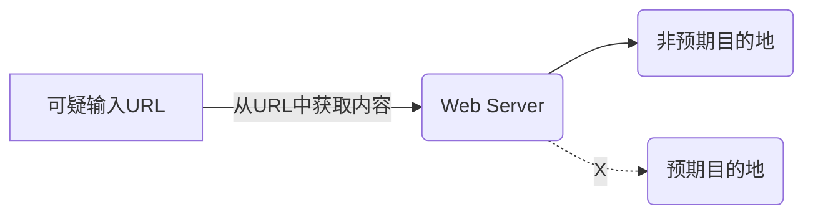

# CWD-1066 服务器请求伪造（SSRF）

**别名: **跨站端口攻击（XSPA）

**描述**
Web服务器从上游组件接收URL或类似请求，并检索此URL的内容，但它不能充分确保请求被发送到预期的目的地。当攻击者可以影响应用程序服务器建立的网络连接时，将会发生服务器请求伪造（SSRF）。




1. 网络连接源自于应用程序服务器内部 IP，因此攻击者将可以使用此连接来避开网络控制，并扫描或攻击没有以其他方式暴露的内部资源。2. 通过向意外主机或端口提供URL，攻击者可以使服务器看起来正在发送请求，可能绕过阻止，攻击者直接访问URL的防火墙等访问控制。服务器可以用作代理来对内部网络中的主机进行端口扫描，使用其他URL，如可以访问系统上的文档（使用文件：//），或者使用其他协议，如gopher://或tftp://，这可以提供对请求内容的更好控制。3. 攻击者能否劫持网络连接取决于他可以控制的 URI 的特定部分以及用于建立连接的库。例如，控制 URI 方案将使攻击者可以使用不同于 `http` 或 `https` 的协议，类似于：`up://`、`ldap://`、`jar://`、`gopher://`、`mailto://`、`ssh2://`、`telnet://`、`expect://`4. 攻击者将可以利用劫持的此网络连接执行下列攻击：
  - 对内联网资源进行端口扫描。  - 避开防火墙。  - 攻击运行于应用程序服务器或内联网上易受攻击的程序。  - 使用 Injection 攻击或 CSRF 攻击内部/外部 Web 应用程序。  - 使用 file:// 方案访问本地文件。  - 在 Windows 系统上，file:// 方案和 UNC 路径可以允许攻击者扫描和访问内部共享。  - 执行 DNS 缓存中毒攻击。
**语言: **JAVA,JAVASCRIPT,TYPESCRIPT

**严重等级**
严重

**cleancode特征**
安全,可靠

**示例**
**案例1: 直接使用外部输入数据导致SSRF**
**语言: **JAVA

**描述**
应用程序将使用用户控制的数据启动与第三方系统的连接，以创建资源 URI。当攻击者可以影响应用程序服务器建立的网络连接时，将会发生 Server-Side Request Forgery。网络连接源自于应用程序服务器内部 IP，因此攻击者将可以使用此连接来避开网络控制，并扫描或攻击没有以其他方式暴露的内部资源。

**案例分析**
攻击者能否劫持网络连接取决于他可以控制的 URI 的特定部分以及用于建立连接的库。例如，控制 URI 方案将使攻击者可以使用不同于 `http` 或 `https` 的协议，类似于：`up://`、`ldap://`、`jar://`、`gopher://`、`mailto://`、`ssh2://`、`telnet://`、`expect://`

**反例**
```java
String url = request.getParameter("url");
CloseableHttpClient httpclient = HttpClients.createDefault();
HttpGet httpGet = new HttpGet(url);
CloseableHttpResponse response1 = httpclient.execute(httpGet);
```

**正例**
```java
import org.apache.http.client.config.RequestConfig;
import org.apache.http.client.methods.CloseableHttpResponse;
import org.apache.http.client.methods.HttpGet;
import org.apache.http.impl.client.CloseableHttpClient;
import org.apache.http.impl.client.HttpClients;
import java.io.IOException;
import java.net.URI;
import java.net.URISyntaxException;
import java.util.Arrays;
import java.util.List;

public class SafeHttpClient {

    public void makeSafeRequest(HttpServletRequest request, HttpServletResponse response) {
        String url = request.getParameter("url");
        if (!isUrlValid(url, request)) {
            try {
                response.sendRedirect("/error");
                return;
            } catch (IOException e) {
                // ...异常处理
            }
        }

        CloseableHttpClient httpclient = HttpClients.createDefault();
        HttpGet httpGet = new HttpGet(url);

        // 配置请求以限制重定向和超时
        RequestConfig config = RequestConfig.custom()
                .setRedirectsEnabled(false)
                .setConnectTimeout(5000)
                .setSocketTimeout(5000)
                .build();
        httpGet.setConfig(config);

        try (CloseableHttpResponse response1 = httpclient.execute(httpGet)) {
            // 处理响应
        } catch (IOException e) {
            // ...异常处理
        }
    }

    private boolean isUrlValid(String url, HttpServletRequest request) {
        try {
            URI uri = new URI(url);
            String host = uri.getHost();
            if (host == null) {
                return false;
            }
            // 允许的host列表，例如当前服务器的host
            String currentHost = request.getServerName();
            return host.equals(currentHost);
        } catch (URISyntaxException e) {
            return false;
        }
    }
}
```

**修复建议**
- 验证URL来源：URL验证方法 `isUrlValid` 检查URL的主机名是否与当前请求的主机名相同，确保只能访问当前站点的资源。
- 限制重定向：HttpClient配置，通过 `RequestConfig` 禁用重定向，并设置连接和Socket超时，防止长时间等待。
- 错误处理：如果URL验证失败，重定向到错误页面，避免执行不安全的请求。
- 使用白名单：只允许访问特定的URL模式或资源。

**案例2: SSRF服务端请求伪造致内网资源暴露**
**语言: **JAVASCRIPT

**描述**
应用程序将使用用户控制的数据启动与第三方系统的连接，以创建资源 URI。当攻击者可以影响应用程序服务器建立的网络连接时，将会发生 Server-Side Request Forgery。网络连接源自于应用程序服务器内部 IP，因此攻击者将可以使用此连接来避开网络控制，并扫描或攻击没有以其他方式暴露的内部资源。

**案例分析**
攻击者能否劫持网络连接取决于他可以控制的 URI 的特定部分以及用于建立连接的库。例如，控制 URI 方案将使攻击者可以使用不同于 `http` 或 `https` 的协议，类似于：`up://`、`ldap://`、`jar://`、`gopher://`、`mailto://`、`ssh2://`、`telnet://`、`expect://`

**反例**
```js
var http = require('http');
var url = require('url');

function listener(request, response){
  var request_url = url.parse(request.url, true)['query']['url'];
  http.request(request_url)
  ...
}
...
http.createServer(listener).listen(8080);
...
```

**正例**
```js
var http = require('http');
var url = require('url');

// 定义允许访问的白名单域名
const ALLOWED_HOSTS = ['example.com', 'example.org'];
const TIMEOUT = 5000; // 5秒超时

function listener(request, response) {
    var request_url = url.parse(request.url, true).query?.url;

    // 检查url参数是否存在
    if (!request_url) {
        response.writeHead(400, { 'Content-Type': 'text/plain' });
        response.end('Missing required URL parameter');
        return;
    }

    // 解析目标URL
    var targetUrl = url.parse(request_url);
    var targetHost = targetUrl.host;
    var targetProtocol = targetUrl.protocol;

    // 检查协议是否为https
    if (targetProtocol !== 'https:') {
        response.writeHead(400, { 'Content-Type': 'text/plain' });
        response.end('Only HTTPS protocol is allowed');
        return;
    }

    // 检查目标域名是否在白名单中
    if (!ALLOWED_HOSTS.includes(targetHost)) {
        response.writeHead(400, { 'Content-Type': 'text/plain' });
        response.end('Access denied for this host');
        return;
    }

    // 创建请求
    var req = http.request({
        host: targetHost,
        port: targetUrl.port || 443,
        path: targetUrl.pathname || '/',
        method: 'GET',
        timeout: TIMEOUT
    }, (res) => {
        response.writeHead(res.statusCode, res.headers);
        res.pipe(response);
    });

    // 处理请求超时
    req.on('socket', function(socket) {
        socket.setTimeout(TIMEOUT);
        socket.on('timeout', function() {
            req.abort();
            response.writeHead(500, { 'Content-Type': 'text/plain' });
            response.end('Request timed out');
        });
    });

    // 处理错误
    req.on('error', (err) => {
        console.error('Request failed:', err);
        response.writeHead(500, { 'Content-Type': 'text/plain' });
        response.end('Request failed: ' + err.message);
    });

    req.end();
}

http.createServer(listener).listen(8080, () => {
    console.log('Server running on port 8080');
});
```

**修复建议**
- 白名单机制：ALLOWED_HOSTS数组定义了允许访问的域名，只允许访问特定的域名或IP地址。
- 协议检查：确保请求使用HTTPS协议，避免明文传输。
- 超时设置：设置请求超时为5秒，防止长时间挂起。
- 错误处理：在请求失败或超时时，返回适当的错误信息，避免暴露内部错误。

**案例3: SSRF服务端请求伪造致内网资源暴露**
**语言: **TYPESCRIPT

**描述**
应用程序将使用用户控制的数据启动与第三方系统的连接，以创建资源 URI。当攻击者可以影响应用程序服务器建立的网络连接时，将会发生 Server-Side Request Forgery。网络连接源自于应用程序服务器内部 IP，因此攻击者将可以使用此连接来避开网络控制，并扫描或攻击没有以其他方式暴露的内部资源。

**案例分析**
攻击者能否劫持网络连接取决于他可以控制的 URI 的特定部分以及用于建立连接的库。例如，控制 URI 方案将使攻击者可以使用不同于 `http` 或 `https` 的协议，类似于：`up://`、`ldap://`、`jar://`、`gopher://`、`mailto://`、`ssh2://`、`telnet://`、`expect://`

**反例**
```ts
var http = require('http');
var url = require('url');

function listener(request, response){
  var request_url = url.parse(request.url, true)['query']['url'];
  http.request(request_url)
  ...
}
...
http.createServer(listener).listen(8080);
...
```

**正例**
```ts
var http = require('http');
var url = require('url');

// 定义允许访问的白名单域名
const ALLOWED_HOSTS = ['example.com', 'example.org'];
const TIMEOUT = 5000; // 5秒超时

function listener(request, response) {
    var request_url = url.parse(request.url, true).query?.url;

    // 检查url参数是否存在
    if (!request_url) {
        response.writeHead(400, { 'Content-Type': 'text/plain' });
        response.end('Missing required URL parameter');
        return;
    }

    // 解析目标URL
    var targetUrl = url.parse(request_url);
    var targetHost = targetUrl.host;
    var targetProtocol = targetUrl.protocol;

    // 检查协议是否为https
    if (targetProtocol !== 'https:') {
        response.writeHead(400, { 'Content-Type': 'text/plain' });
        response.end('Only HTTPS protocol is allowed');
        return;
    }

    // 检查目标域名是否在白名单中
    if (!ALLOWED_HOSTS.includes(targetHost)) {
        response.writeHead(400, { 'Content-Type': 'text/plain' });
        response.end('Access denied for this host');
        return;
    }

    // 创建请求
    var req = http.request({
        host: targetHost,
        port: targetUrl.port || 443,
        path: targetUrl.pathname || '/',
        method: 'GET',
        timeout: TIMEOUT
    }, (res) => {
        response.writeHead(res.statusCode, res.headers);
        res.pipe(response);
    });

    // 处理请求超时
    req.on('socket', function(socket) {
        socket.setTimeout(TIMEOUT);
        socket.on('timeout', function() {
            req.abort();
            response.writeHead(500, { 'Content-Type': 'text/plain' });
            response.end('Request timed out');
        });
    });

    // 处理错误
    req.on('error', (err) => {
        console.error('Request failed:', err);
        response.writeHead(500, { 'Content-Type': 'text/plain' });
        response.end('Request failed: ' + err.message);
    });

    req.end();
}

http.createServer(listener).listen(8080, () => {
    console.log('Server running on port 8080');
});
```

**修复建议**
- 白名单机制：ALLOWED_HOSTS数组定义了允许访问的域名，只允许访问特定的域名或IP地址。
- 协议检查：确保请求使用HTTPS协议，避免明文传输。
- 超时设置：设置请求超时为5秒，防止长时间挂起。
- 错误处理：在请求失败或超时时，返回适当的错误信息，避免暴露内部错误。

#### CWD-1066-000 服务器请求伪造（SSRF）

#### CWD-1066-001 【HTTPClient-Fluent】通过org.apache.hc.client5.http.fluent.Request发起请求时，可被绕过的Host/IP校验方式引发SSRF漏洞

#### CWD-1066-002 【HTTPClient-Fluent】通过org.apache.hc.client5.http.fluent.Request发起请求时，未以"/"结尾的硬编码Host/IP拼接了不可信数据，可通过@符号绕过HOST/IP的限制，造成SSRF漏洞

#### CWD-1066-003 【HTTPClient-Fluent】通过org.apache.hc.client5.http.fluent.Request发起请求时，直接使用外部传入的URL进行请求引发SSRF漏洞

#### CWD-1066-004 【HTTPClient-Classic】通过org.apache.hc.client5.http.classic.methods下的HttpGet、HttpPost、HttpPut、HttpDelete发起请求时，可被绕过的Host/IP校验方式引发SSRF漏洞

#### CWD-1066-005 【HTTPClient-Classic】通过org.apache.hc.client5.http.classic.methods下的HttpGet、HttpPost、HttpPut、HttpDelete发起请求时，未以"/"结尾的硬编码Host/IP拼接了不可信数据，可通过@符号绕过HOST/IP的限制，造成SSRF漏洞

#### CWD-1066-006 【HTTPClient-Classic】通过org.apache.hc.client5.http.classic.methods下的HttpGet、HttpPost、HttpPut、HttpDelete发起请求时，直接使用外部传入的URL进行请求引发SSRF漏洞

#### CWD-1066-007 【Hutool】通过cn.hutool.http.HttpUtil发起请求时，可被绕过的Host/IP校验方式引发SSRF漏洞

#### CWD-1066-008 【Hutool】通过cn.hutool.http.HttpUtil发起请求时，未以"/"结尾的硬编码Host/IP拼接了不可信数据，可通过@符号绕过HOST/IP的限制，造成SSRF漏洞

#### CWD-1066-009 【Hutool】通过cn.hutool.http.HttpUtil发起请求时，直接使用外部传入的URL进行请求引发SSRF漏洞

#### CWD-1066-010 【JDK】通过java.net.URL/URI发起请求时，可被绕过的Host/IP校验方式引发SSRF漏洞

#### CWD-1066-011 【JDK】通过java.net.URL/URI发起请求时，未以"/"结尾的硬编码Host/IP拼接了不可信数据，可通过@符号绕过HOST/IP的限制，造成SSRF漏洞

#### CWD-1066-012 【JDK】通过java.net.URL/URI发起请求时，直接使用外部传入的URL进行请求引发SSRF漏洞

#### CWD-1066-013 【通用】通过java.net.URL的toString方法构造url时，URL对象的file属性受控造成SSRF

#### CWD-1066-014 【Okhttp】通过okhttp3.Request发起请求时，可被绕过的Host/IP校验方式引发SSRF漏洞

#### CWD-1066-015 【Okhttp】通过okhttp3.Request发起请求时，未以"/"结尾的硬编码Host/IP拼接了不可信数据，可通过@符号绕过HOST/IP的限制，造成SSRF漏洞

#### CWD-1066-016 【Okhttp】通过okhttp3.Request发起请求时，直接使用外部传入的URL进行请求引发SSRF漏洞

#### CWD-1066-017 【RestTemplate】通过org.springframework.web.client.RestTemplate发起请求时，可被绕过的Host/IP校验方式引发SSRF漏洞

#### CWD-1066-018 【RestTemplate】通过org.springframework.web.client.RestTemplate发起请求时，未以"/"结尾的硬编码Host/IP拼接了不可信数据，可通过@符号绕过HOST/IP的限制，造成SSRF漏洞

#### CWD-1066-019 【RestTemplate】通过org.springframework.web.client.RestTemplate发起请求时，直接使用外部传入的URL进行请求引发SSRF漏洞

#### CWD-1066-020 【Socket】通过java.net.Socket进行通信时，直接使用不可信的Host/IP构造Socket对象引发SSRF漏洞

#### CWD-1066-021 【SSLSocket】通过javax.net.ssl.SSLSocket进行通信时，直接使用不可信的Host/IP构造SSLSocket对象引发SSRF漏洞

**业界缺陷**

- [CWE-918: Server-Side Request Forgery (SSRF)](https://cwe.mitre.org/data/definitions/918.html)
---

