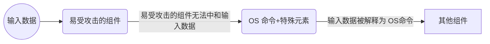

# CWD-1068 OS命令注入

**别名: **操作系统命令中使用的特殊元素中和不当（“OS命令注入”）；操作系统命令注入；shell注入；不可信数据直接拼接操作系统命令

**描述**
操作系统命令注入（OS命令注入），源于应用程序将用户输入直接合并到操作系统命令中（如shell），由shell命令解释器处理的命令中时，就会出现操作系统命令注入。若未严格验证，攻击者可使用shell元字符修改执行的命令，控制服务器，读取或修改数据，执行特权操作，甚至破坏服务器并扩展攻击至内部系统，建立持久访问点，造成严重安全威胁。为了避免这种漏洞，开发人员需要对用户输入进行严格的验证和过滤，并避免直接拼接用户输入到命令字符串中。通过使用参数化命令和安全的API，可以有效防止命令注入攻击。


- 操作系统命令注入至少有两种子类型：
  1. 直接使用外部输入作为执行命令：应用程序打算执行在自己控制下的单个固定程序。它打算使用外部提供的输入作为该程序的参数。例如，程序可能使用系统（"`nslookup[HOSTNAME]`"）来运行nslookup，并允许用户提供HOSTNAME，该HOSTNAME用作参数。攻击者无法阻止nslookup的执行。但是，如果程序不从HOSTNAME参数中删除命令分隔符，攻击者可以将分隔符放入参数中，这允许他们在nslookup执行完成后执行自己的程序。  2. 输入校验不完全：应用程序接受一个输入，它使用这个输入来完全选择要运行的程序以及要使用的命令。应用程序只是将整个命令重定向到操作系统。例如，程序可能使用“`exec([command])`”来执行用户提供的`[command]`。如果command处于攻击者控制之下，则攻击者可以执行任意命令或程序。如果使用`exec()`和`CreateProcess()`等函数执行命令，则攻击者可能无法将多个命令组合在同一行中。- 注入的OS命令需要搭配命令分隔符使用，以下命令分隔符
  - Linux和Windows系统下通用的：`&` `&&` `|` `||`  - 只有Linux系统下的：`;` `换行符(0x0a or \n)`


**语言: **C,CPP,JAVA

**严重等级**
严重

**cleancode特征**
安全,可靠

**示例**
**案例1: OS命令注入漏洞导致服务器受损**
**语言: **JAVA

**描述**
一个在线图片处理系统，用户可以通过上传图片并指定图片的格式（如JPEG、PNG等）来转换图片格式。系统后端使用Java编写，并通过调用外部命令（如ImageMagick的`convert`工具）来处理图片。以下是系统的简化代码：

**案例分析**
- 直接将用户输入拼接到命令中，没有进行任何过滤或转义。
- 攻击者可以通过注入分号;或其他命令分隔符，执行任意系统命令。

在这个案例中，攻击者可以通过构造恶意的`filename`或`targetFormat`参数，注入恶意命令，从而控制服务器。

假设攻击者构造以下请求：
```text
java ImageConverter png;rm -rf /var/www/html image.jpg
```
此时，command会被构造为：
```bash
convert image.jpg image.jpg.png;rm -rf /var/www/html
```
执行该命令后，`rm -rf /var/www/html`会被执行，导致服务器上的网站文件被删除。

**反例**
```java
import java.io.IOException;

public class ImageConverter {
    public static void main(String[] args) {
        String targetFormat = args[0];
        String filename = args[1];
        String command = "convert " + filename + " " + filename + "." + targetFormat;
        try {
            Process process = Runtime.getRuntime().exec(command);
            process.waitFor();
        } catch (IOException | InterruptedException e) {
            // ...异常处理
        }
    }
}
```

**正例**
```java
import java.io.IOException;
import java.util.stream.Collectors;
import java.util.stream.Stream;

public class ImageConverter {
    public static void main(String[] args) {
        String targetFormat = args[0];
        String filename = args[1];

        // 使用ProcessBuilder来构造命令，避免命令注入
        ProcessBuilder processBuilder = new ProcessBuilder(
            "convert",
            filename,
            filename + "." + targetFormat
        );

        try {
            Process process = processBuilder.start();
            process.waitFor();
            // 读取输出
            String output = process.getInputStream().readAllBytes()
                .toString();
            Logger.info(output);
        } catch (IOException | InterruptedException e) {
            // ...异常处理
        }
    }
}
```

**修复建议**
- 使用`ProcessBuilder`来构造命令，避免直接拼接用户输入。
- `ProcessBuilder`会自动对参数进行转义，防止命令注入。

#### CWD-1068-000 OS命令注入

#### CWD-1068-001 【JDK】使用Runtime.exec()执行非shell命令时，拼接的外部可控参数未得到正确校验，则可利用命令存在的参数进行攻击，造成OS命令注入

#### CWD-1068-002 【JDK】使用Runtime.exec()执行shell命令时，拼接的外部可控参数未得到正确校验，则可利用链接或者管道的方式来执行任意命令，造成OS命令注入

#### CWD-1068-003 【JDK】使用Runtime.exec()执行命令时，命令外部可控且未得到正确校验，则可执行任意命令，造成OS命令注入

#### CWD-1068-004 【JDK】使用java.lang.ProcessBuilder类执行非shell命令时，命令列表中外部可控的参数未得到正确校验，则可利用命令存在的参数进行攻击，造成OS命令注入

#### CWD-1068-005 【JDK】使用java.lang.ProcessBuilder类执行shell命令时，命令列表中外部可控的参数未得到正确校验，则可利用链接或者管道的方式来执行任意命令，造成OS命令注入

#### CWD-1068-006 【JDK】使用java.lang.ProcessBuilder类执行命令时，命令外部可控且未得到正确校验，则可执行任意命令，造成OS命令注入

#### CWD-1068-007 【JDK】使用java.lang.ProcessBuilder类执行命令时，通过ProcessBuilder.environment()配置的环境变量外部可控且未得到正确校验，造成OS命令注入

#### CWD-1068-008 【SSHJ】使用net.schmizz.sshj.SSHClient中的Session类执行命令时，命令外部可控且未得到正确校验，则可执行任意命令，造成OS命令注入

#### CWD-1068-009 【C/C++】禁止外部可控数据作为进程启动函数的参数

**业界缺陷**

- [CWE-78: Improper Neutralization of Special Elements used in an OS Command ('OS Command Injection')](https://cwe.mitre.org/data/definitions/78.html)
---

