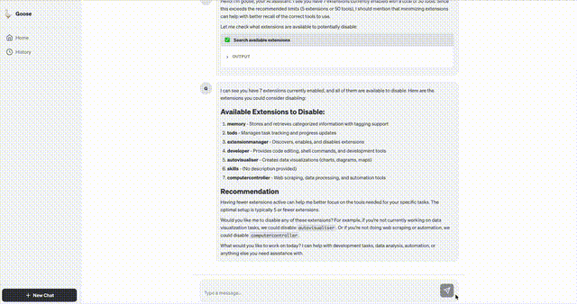

# Goose SDK & Web Client 🪿

Goose SDK provides a set of libraries and tools to interact with the Goose AI agent programmatically. This repository contains the Python and TypeScript SDKs, as well as a modern Web Client for managing and interacting with your agents.

## 🎥 Demo

[](./web-app/screenshot-c.mov)

> Click the image above to watch the full high-quality video.

---

## 🐍 Python SDK

Full documentation: [python-sdk/README.md](./python-sdk/README.md)

### Installation

```bash
pip install goosed-sdk
# Or from source
pip install -e "./python-sdk[dev]"
```

### Quick Start

```python
from goosed_sdk import GoosedClient

client = GoosedClient(base_url="http://127.0.0.1:3000", secret_key="your-secret")
print(client.status())
```

### Testing

```bash
# Requires running goosed server
pytest python-sdk/tests
```

---

## 📘 TypeScript SDK

Full documentation: [typescript-sdk/README.md](./typescript-sdk/README.md)

### Installation

```bash
npm install @goosed/sdk
# Or from source
cd typescript-sdk && npm install && npm run build
```

### Quick Start

```typescript
import { GoosedClient } from '@goosed/sdk';

const client = new GoosedClient({ baseUrl: 'http://127.0.0.1:3000', secretKey: 'secret' });
console.log(await client.status());
```

### Testing

```bash
# Requires running goosed server
cd typescript-sdk && npm test
```

---

## 🌐 Web App

Full documentation: [web-app/README.md](./web-app/README.md)

A modern React-based interface for the Goose AI agent.

### Features
- **AI Chat Interface**: Seamless conversation.
- **Tool Visualization**: Rich inputs/outputs.
- **Session Management**: Full CRUD for sessions.

### Running Locally

1.  **Start the Web App**:
    ```bash
    cd web-app
    npm install
    npm run dev
    ```
2.  **Access**: Open `http://127.0.0.1:5173`.

> **Note**: Ensure the `goosed` server is running on port 3000 (default) or configure accordingly.
