# Channel 模块架构说明

## 1. 目标与边界

`channel` 模块负责把外部即时通信渠道接入 `gateway`，再桥接到平台内部的 agent/session 体系。当前支持的渠道类型是：

- `whatsapp`
- `wechat`

该模块的核心职责是：

- 管理渠道实例的静态配置
- 管理每个真实平台用户拥有的渠道登录态和消息运行态
- 管理外部会话与内部 session 的绑定关系
- 把外部入站消息转成内部 agent 对话输入
- 把 agent 输出转成渠道出站消息
- 管理二维码登录、登录态刷新、去重、事件和排障信息

明确边界：

- 前端不能直接对接外部渠道 SDK 或第三方接口，只能通过 `gateway`
- 当前 `whatsapp` 是 `WhatsApp Web + 本地 helper` 模式，不是 Meta Cloud API 模式
- 当前 `wechat` 是 `二维码登录 + iLink 长轮询` 模式，不是公网 webhook 模式
- `ChannelWebhookController` 是预留扩展入口；现有 `whatsapp` / `wechat` 不依赖公网 webhook
- `gateway/channels` 只保存渠道静态配置，不保存真实用户登录态、消息队列、绑定、去重和日志
- `gateway/users` 保存真实平台用户拥有的渠道运行态，以及 channel 消息桥接后的 agent session 运行态

## 2. 核心设计原则

### 2.1 配置态与运行态分离

渠道实例配置属于平台配置面，目录固定为：

`gateway/channels/<type>/<channelId>/`

用户登录态和消息处理状态属于用户运行面，目录固定为：

`gateway/users/<ownerUserId>/channels/<type>/<channelId>/`

这样拆分后，`gateway/channels` 可以安全地表达“系统里有哪些渠道、由谁拥有、默认接入哪个 agent”，而不会混入真实账号凭据、外部联系人消息、出站队列、helper 日志和 session 绑定状态。

### 2.2 ownerUserId 是运行态归属

每个 channel 配置都有 `ownerUserId`。运行态目录必须由 `ownerUserId` 决定，而不是由当前请求用户、外部联系人 ID 或 helper 进程自行决定。

当 `ownerUserId = admin`、`type = whatsapp`、`channelId = whatsapp-main` 时：

- 配置目录：`gateway/channels/whatsapp/whatsapp-main/`
- 运行态目录：`gateway/users/admin/channels/whatsapp/whatsapp-main/`

### 2.3 不做旧路径兼容

本次目标态实现不保留旧布局兼容：

- 不再从 `gateway/channels/<type>/<channelId>/auth` 读取登录态
- 不再从 `gateway/channels/<type>/<channelId>/inbox` / `outbox` 读取或写入消息队列
- 不再从 `gateway/channels/<type>/<channelId>/bindings.json` / `events.json` / `inbound-dedup.json` 读取运行态
- 不做启动时自动迁移，不做懒迁移，不做双写

升级到目标态时，旧运行态数据需要在发布前一次性迁移或丢弃；代码只实现目标目录契约。

### 2.4 agent session 仍然落在 users/agents

channel 运行态迁移到 `gateway/users/<ownerUserId>/channels/...` 后，消息最终进入 agent 的 session 运行态仍然使用既有目录：

`gateway/users/<userId>/agents/<agentId>/`

channel 自身运行态和 agent session 运行态同属于 `gateway/users`，但目录职责不同：

- `users/<ownerUserId>/channels/...`：外部渠道登录态、消息队列、绑定和排障状态
- `users/<userId>/agents/...`：agent runtime、session、工具状态和 goosed 日志

## 3. 模块分层

### 3.1 管理面

- `ChannelAdminController`
  - 提供渠道创建、更新、启停、删除、登录、登出、探测、绑定列表、事件列表、自测接口
- `ChannelConfigService`
  - 只负责 `gateway/channels/<type>/<channelId>/config.json` 的配置落盘、读取、校验和列表查询
- `ChannelRuntimeStorageService`（建议新增）
  - 集中负责按 `ChannelDetail.ownerUserId` 解析运行态目录和运行态文件路径
  - 对外提供 `runtimeDir(channel)`、`authDir(channel)`、`loginStateFile(channel)`、`inboxDir(channel)`、`bindingsFile(channel)` 等方法
  - 避免各 service 手写 `gatewayRoot.resolve("users")...` 或继续拼 `gateway/channels/...`

### 3.2 运行面

- `WhatsAppWebLoginService`
  - 管理 WhatsApp Web 登录流程，启动/停止 helper，维护用户运行态目录下的 `login-state.json`
- `WeChatLoginService`
  - 管理 WeChat 二维码登录流程，启动/停止 helper，维护用户运行态目录下的 `login-state.json`
- `WhatsAppMessagePumpService`
  - 定时扫描用户运行态目录下的 WhatsApp `inbox/`，去重后投递到内部 session，再把回复写入 `outbox/pending/`
- `WeChatMessagePumpService`
  - 定时扫描用户运行态目录下的 WeChat `inbox/`，流程与 WhatsApp 类似，但保留 `contextToken`

### 3.3 桥接层

- `ChannelBindingService`
  - 为外部会话生成稳定 binding
  - binding 文件保存到用户运行态目录下的 `bindings.json`
- `SessionBridgeService`
  - 负责启动或复用 agent runtime/session，把外部文本转成 session reply 请求，并从 session events 中抽取最终可见回复
- `ChannelDedupService`
  - 基于 `externalMessageId` 做近 500 条去重
  - 去重文件保存到用户运行态目录下的 `inbound-dedup.json`

### 3.4 helper 进程

- `gateway/tools/whatsapp-web-helper/index.js`
  - 基于 Baileys 维护 WhatsApp Web 登录、收消息、发消息
- `gateway/tools/wechat-helper/index.mjs`
  - 基于 iLink 接口获取二维码、确认登录、执行 `getupdates` 长轮询和 `sendmessage`

helper 不自行推断目录。Java 登录服务启动 helper 时必须显式传入目标态路径：

- `--state-file`
- `--pid-file`
- `--auth-dir`
- `--inbox-dir`
- `--outbox-pending-dir`
- `--outbox-sent-dir`
- `--outbox-error-dir`
- `--log-file`（WeChat 已有，WhatsApp 也应统一显式传入或由 Java 控制 stdout 重定向）

## 4. 目录与落盘契约

### 4.1 配置目录

每个渠道实例有一个配置目录：

`gateway/channels/<type>/<channelId>/`

目标态只允许保存：

- `config.json`

`config.json` 示例：

```json
{
  "id": "whatsapp-main",
  "name": "WhatsApp Main",
  "type": "whatsapp",
  "enabled": true,
  "defaultAgentId": "fo-copilot",
  "ownerUserId": "admin",
  "createdAt": "2026-05-06T00:00:00Z",
  "updatedAt": "2026-05-06T00:00:00Z",
  "config": {
    "authStateDir": "auth"
  }
}
```

配置文件应避免保存运行态字段。下列字段应从配置模型中移出，或只在 API response 的运行态合并结果中出现：

- `loginStatus`
- `lastConnectedAt`
- `lastDisconnectedAt`
- `lastError`
- `selfPhone`
- `wechatId`
- `displayName`

如果短期内为了 API 兼容仍保留 `ChannelConnectionConfig` response 结构，也只能由运行态文件计算后返回，不能再写回 `config.json`。

### 4.2 用户运行态目录

每个渠道实例的运行态目录为：

`gateway/users/<ownerUserId>/channels/<type>/<channelId>/`

典型文件如下：

- `runtime-state.json`
  - gateway 维护的当前运行态摘要，可选
  - 用于保存 `loginStatus`、最近连接时间、最近断开时间、最近错误、真实账号展示信息
- `login-state.json`
  - helper 写入的实时登录态快照
  - 管理台优先读它展示二维码、错误、最近连接时间
- `login.pid`
  - helper 进程 PID
- `login.log`
  - helper 标准输出和登录相关日志
- `whatsapp-debug.log`
  - WhatsApp helper 详细调试日志
- `auth/`
  - WhatsApp Web / WeChat iLink 的真实账号凭据和游标
- `inbox/`
  - helper 写入入站消息文件，message pump 轮询消费
- `processed/`
  - 已消费、重复、异常文件归档
- `outbox/pending/`
  - message pump 产出的待发送消息
- `outbox/sent/`
  - helper 已成功发送的消息
- `outbox/error/`
  - helper 发送失败的消息
- `bindings.json`
  - 外部会话与内部 session 的绑定关系
- `inbound-dedup.json`
  - 最近消费过的外部消息 ID
- `events.json`
  - 最近事件流水，便于管理台展示和排障

### 4.3 目录示例

```text
gateway/
  channels/
    whatsapp/
      whatsapp-main/
        config.json
    wechat/
      wechat-main/
        config.json
  users/
    admin/
      channels/
        whatsapp/
          whatsapp-main/
            auth/
            inbox/
            processed/
            outbox/
              pending/
              sent/
              error/
            bindings.json
            events.json
            inbound-dedup.json
            login-state.json
            login.pid
            login.log
            whatsapp-debug.log
        wechat/
          wechat-main/
            auth/
            inbox/
            processed/
            outbox/
              pending/
              sent/
              error/
            bindings.json
            events.json
            inbound-dedup.json
            login-state.json
            login.pid
            login.log
      agents/
        fo-copilot/
          ...
```

## 5. API 读写模型

### 5.1 创建 channel

创建 channel 时：

1. 校验 `id`、`name`、`type`、`defaultAgentId`、`ownerUserId`
2. 写入 `gateway/channels/<type>/<channelId>/config.json`
3. 创建 `gateway/users/<ownerUserId>/channels/<type>/<channelId>/`
4. 初始化运行态文件：
   - `bindings.json`
   - `events.json`
   - `inbound-dedup.json`
5. 记录 `channel.created` 事件到用户运行态目录下的 `events.json`

### 5.2 更新 channel

更新 channel 时：

- 只更新配置目录下的 `config.json`
- 不清理或覆盖运行态目录
- 不允许通过普通配置更新写入 `loginStatus`、`lastError`、`selfPhone`、`wechatId` 等运行态字段

如果允许修改 `ownerUserId`，必须作为单独的受控操作处理，因为它意味着运行态目录所有权迁移。默认建议不允许修改已有 channel 的 `ownerUserId`。

### 5.3 删除 channel

删除 channel 时应删除两类数据：

- `gateway/channels/<type>/<channelId>/`
- `gateway/users/<ownerUserId>/channels/<type>/<channelId>/`

删除前应先尽力停止 helper 进程。删除失败时要返回明确错误，避免只删配置不删运行态造成孤儿数据。

### 5.4 查询 channel 详情

查询详情时：

1. 从 `config.json` 读取静态配置
2. 根据 `ownerUserId` 定位用户运行态目录
3. 从 `login-state.json` / `runtime-state.json` 合并运行态字段
4. 从 `bindings.json` / `events.json` 读取管理台展示数据
5. 返回给前端的 response 可以保持现有结构，但数据来源必须是配置态 + 运行态组合

## 6. 通用桥接流程

不论是 WhatsApp 还是 WeChat，消息桥接都遵循同一条主链路：

```mermaid
flowchart LR
    A["管理台创建渠道配置"] --> B["初始化用户 channel 运行态目录"]
    B --> C["登录服务启动 helper"]
    C --> D["helper 接入外部渠道"]
    D --> E["helper 写入 users/.../channels/.../inbox/*.json"]
    E --> F["MessagePump 定时扫描"]
    F --> G["ChannelDedupService 去重"]
    G --> H["ChannelBindingService 确认 binding"]
    H --> I["SessionBridgeService 启动或复用内部 session"]
    I --> J["提交 goosed session reply 并消费 session events"]
    J --> K["生成最终回复文本"]
    K --> L["写入 users/.../channels/.../outbox/pending/*.json"]
    L --> M["helper 发送到外部渠道"]
```



### 6.1 外部会话不会直接映射为真实平台用户

`ChannelBindingService` 按以下维度生成稳定 binding：

- `channelId`
- `accountId`
- `conversationId`
- `threadId`

binding 必须保存：

- `channelId`
- `ownerUserId`
- `syntheticUserId`
- `agentId`
- `sessionId`
- 外部会话维度字段
- 最近入站/出站时间

这样可以避免把外部手机号、微信 ID 直接当作真实平台用户，同时保证同一个外部会话能稳定复用同一个内部会话语境。

### 6.2 session 归属建议

当前代码里存在一个需要在实现时修正的边界：binding 会生成 `syntheticUserId`，但后续发送消息时又回到 `ownerUserId` 启动或复用 session。目标态应明确选择一个模型：

- 推荐模型：外部会话的 agent runtime 使用 `ownerUserId`
- `syntheticUserId` 只作为 binding 标识或 session metadata，不作为 `gateway/users/<userId>` 的真实目录层级

原因是外部渠道已经由 `ownerUserId` 拥有，用户运行态也落在 `gateway/users/<ownerUserId>/channels/...`。如果再把外部联系人映射成 `gateway/users/channel__...`，会重新制造一套不易管理的“伪用户运行态”。

如果后续需要每个外部会话隔离 agent 工作目录，应显式设计为：

`gateway/users/<ownerUserId>/channel-sessions/<type>/<channelId>/<bindingId>/agents/<agentId>/`

不要把 synthetic id 塞进真实用户目录层级。

### 6.3 webapp 与 channel 并发 resume

webapp 和 channel 可以 resume 同一个 `sessionId`。当前目标态不在 gateway 侧增加 per-session 串行化或队列，采用 best-effort shared session 模型：

- session 真值只保存在 `gateway/users/<ownerUserId>/agents/<agentId>/...`
- channel 侧只保存 binding、登录态、消息队列、去重和事件，不复制 session 对话历史
- 如果 webapp 和外部渠道同时向同一个 session 写入，允许由底层 session runtime 处理并发请求
- 已知风险是回复顺序和上下文可能交错，但这不是存储目录拆分导致的数据分叉
- 如果未来实际出现高频交错问题，再考虑为 channel conversation 使用独立 session 或引入 per-session queue

### 6.4 文件夹解耦不变

Java 服务仍不直接持有 WhatsApp/WeChat SDK 连接：

- helper 负责真实接入和协议细节
- gateway 负责编排、绑定、session 桥接
- 双方通过用户运行态目录下的 `inbox/` 和 `outbox/` 文件夹交互

## 7. WhatsApp 对接流程

### 7.1 登录流程

1. 管理台调用 `POST /gateway/channels/{channelId}/login`
2. `WhatsAppWebLoginService` 读取 channel 配置，确认类型为 `whatsapp`
3. 通过 `ChannelRuntimeStorageService` 定位 `gateway/users/<ownerUserId>/channels/whatsapp/<channelId>/`
4. 清理旧 PID 对应 helper
5. 创建运行态目录：
   - `auth/`
   - `inbox/`
   - `outbox/pending/`
   - `outbox/sent/`
   - `outbox/error/`
6. 写入初始 `login-state.json`
7. 启动 `gateway/tools/whatsapp-web-helper/index.js`，并显式传入用户运行态路径
8. helper 使用 Baileys 的 `useMultiFileAuthState(authDir)` 初始化登录态
9. 如果拿到 QR，helper 将二维码写入 `login-state.json.qrCodeDataUrl`
10. 用户在手机 WhatsApp 的 `Linked Devices` 中扫码
11. 连接打开后，helper 从 `sock.user.id` 解析出本机号码，回写：
    - `status=connected`
    - `selfPhone`
    - `lastConnectedAt`
12. 管理台通过 `GET /gateway/channels/{channelId}/login-state` 轮询读取用户运行态下的登录状态

### 7.2 入站消息流程

1. helper 监听 `messages.upsert`
2. 只处理文本消息：
   - `conversation`
   - `extendedTextMessage.text`
3. helper 将 JID 归一化成 E.164 风格手机号
4. helper 把入站消息写成用户运行态目录下的 `inbox/<messageId>.json`
5. `WhatsAppMessagePumpService` 每 2 秒扫描该 channel 的用户运行态 `inbox/`
6. `ChannelDedupService` 基于 `messageId` 去重，写入用户运行态 `inbound-dedup.json`
7. `SessionBridgeService.sendConversationText(...)` 把文本送入内部 session
8. 如果 agent 有文本回复，pump 写入用户运行态 `outbox/pending/<uuid>.json`
9. 原始入站文件移动到用户运行态 `processed/`

### 7.3 出站消息流程

1. pump 写入用户运行态 `outbox/pending/`
2. helper 每 1.5 秒扫描待发送目录
3. helper 把 `to` 转成 `digits@s.whatsapp.net`
4. 调用 `sock.sendMessage(jid, { text })`
5. 成功后写入 `outbox/sent/`，失败写入 `outbox/error/`

## 8. WeChat 对接流程

### 8.1 登录流程

1. 管理台调用 `POST /gateway/channels/{channelId}/login`
2. `WeChatLoginService` 读取 channel 配置，确认类型为 `wechat`
3. 通过 `ChannelRuntimeStorageService` 定位 `gateway/users/<ownerUserId>/channels/wechat/<channelId>/`
4. 创建运行态目录并写入初始 `login-state.json`
5. 启动 `gateway/tools/wechat-helper/index.mjs`，并显式传入用户运行态路径
6. helper 调用 `https://ilinkai.weixin.qq.com/ilink/bot/get_bot_qrcode`
7. helper 把二维码页面内容转成 `qrCodeDataUrl`，写回用户运行态 `login-state.json`
8. 用户用微信扫码并确认授权
9. helper 持续轮询 `get_qrcode_status`
10. 登录确认后，helper 将凭据保存到用户运行态 `auth/credentials.json`
11. helper 将 `status` 更新为 `connected`，并回写：
    - `wechatId`
    - `displayName`
    - `lastConnectedAt`

### 8.2 入站消息流程

1. helper 登录成功后进入 `monitorMessages(...)`
2. helper 使用 `getupdates` 长轮询微信消息
3. 如果响应里带 `get_updates_buf`，写入用户运行态 `auth/get-updates-buf.txt`
4. helper 从消息中提取文本内容：
   - 普通文本：`item.type === 1`
   - 语音转文本：`item.type === 3` 且 `voice_item.text` 存在
5. helper 将消息写入用户运行态 `inbox/`
6. `WeChatMessagePumpService` 每 2 秒扫描该 channel 的用户运行态 `inbox/`
7. 去重后通过 `SessionBridgeService` 调用内部 agent
8. 如果拿到回复文本，则写入用户运行态 `outbox/pending/`

WeChat 入站文件里的 `contextToken` 必须在出站时原样带回。

### 8.3 出站消息流程

1. `WeChatMessagePumpService` 写入用户运行态 `outbox/pending/`
2. helper 周期性扫描待发送目录
3. helper 调用 `ilink/bot/sendmessage`
4. 出站消息带上：
   - `to_user_id`
   - `text`
   - `context_token`
5. 成功后写入 `outbox/sent/`，失败写入 `outbox/error/`

### 8.4 会话过期与恢复

如果 `getupdates` 返回 `errcode = -14`，helper 认为当前微信会话已过期，并执行：

- 清理用户运行态 `auth/credentials.json`
- 清理用户运行态 `auth/get-updates-buf.txt`
- 把用户运行态 `login-state.json.status` 置为 `disconnected`
- 要求管理台重新发起扫码登录

## 9. WhatsApp 与 WeChat 的差异

| 维度 | WhatsApp | WeChat |
| --- | --- | --- |
| 登录方式 | WhatsApp Web 扫码 | WeChat QR + iLink 确认 |
| 协议接入 | Baileys socket | HTTP API + long polling |
| 入站来源 | `messages.upsert` 推送 | `getupdates` 拉取 |
| 出站方式 | `sock.sendMessage` | `ilink/bot/sendmessage` |
| 关键身份字段 | `selfPhone` | `wechatId` / `displayName` |
| 上下文字段 | 无额外上下文 token | `contextToken` 必须透传 |
| 自测能力 | 已实现 self-test | 暂未实现 self-test |
| 运行态目录 | `users/<ownerUserId>/channels/whatsapp/<channelId>` | `users/<ownerUserId>/channels/wechat/<channelId>` |

## 10. 管理面接口与运维关注点

常用接口保持不变：

- `GET /gateway/channels`
- `GET /gateway/channels/{channelId}`
- `POST /gateway/channels/{channelId}/login`
- `GET /gateway/channels/{channelId}/login-state`
- `POST /gateway/channels/{channelId}/logout`
- `POST /gateway/channels/{channelId}/probe`
- `POST /gateway/channels/{channelId}/verify`
- `GET /gateway/channels/{channelId}/bindings`
- `GET /gateway/channels/{channelId}/events`

排障时优先看用户运行态目录：

1. `gateway/users/<ownerUserId>/channels/<type>/<channelId>/login-state.json`
   - 看当前状态、二维码、最近错误、最近连接时间
2. `gateway/users/<ownerUserId>/channels/<type>/<channelId>/events.json`
   - 看 gateway 侧是否已经完成 binding、reply、outbox enqueue
3. `gateway/users/<ownerUserId>/channels/<type>/<channelId>/login.log`
   - 看 helper 是否启动、登录和退出
4. `gateway/users/<ownerUserId>/channels/<type>/<channelId>/whatsapp-debug.log`
   - 看 WhatsApp helper 是否持续收到消息、是否发送失败
5. `gateway/users/<ownerUserId>/channels/<type>/<channelId>/inbox/` 和 `outbox/`
   - 看消息卡在 helper 接入层、pump 层还是出站层

行为边界：

- `disable` 只会让 message pump 不再处理该渠道，不等于强制登出 helper
- 真正清理登录态需要调用 `logout`
- `logout` 只清理用户运行态下的 auth 和登录状态，不删除 `config.json`
- `delete` 同时删除配置目录和用户运行态目录

## 11. 实施设计

### 11.1 新增路径解析层

新增 `ChannelRuntimeStorageService`，职责是集中管理目标态路径：

- `Path runtimeDirectory(ChannelDetail channel)`
- `Path authDirectory(ChannelDetail channel)`
- `Path loginStateFile(ChannelDetail channel)`
- `Path pidFile(ChannelDetail channel)`
- `Path logFile(ChannelDetail channel)`
- `Path inboxDirectory(ChannelDetail channel)`
- `Path processedInboxDirectory(ChannelDetail channel)`
- `Path outboxPendingDirectory(ChannelDetail channel)`
- `Path outboxSentDirectory(ChannelDetail channel)`
- `Path outboxErrorDirectory(ChannelDetail channel)`
- `Path bindingsFile(ChannelDetail channel)`
- `Path dedupFile(ChannelDetail channel)`
- `Path eventsFile(ChannelDetail channel)`
- `void initializeRuntime(ChannelDetail channel)`
- `void deleteRuntime(ChannelDetail channel)`

所有 channel 运行态服务必须通过该服务取路径，不允许再直接使用 `channelConfigService.channelDirectory(...)` 拼运行态路径。

### 11.2 调整 ChannelConfigService

`ChannelConfigService` 调整为：

- 只扫描 `gateway/channels/<type>/<channelId>/config.json`
- 创建时只写配置文件，再调用 runtime storage 初始化用户运行态
- 读取详情时从 runtime storage 读取 bindings、events 和 login state
- `recordEvent` 写入用户运行态 `events.json`
- `updateChannelConfig` 不再把登录状态写回 `config.json`
- 删除时同时删除配置目录和用户运行态目录
- 移除旧的 `legacyChannelsDir` / `migrateLegacyLayoutIfNeeded` 行为

### 11.3 调整登录服务

`WhatsAppWebLoginService` 和 `WeChatLoginService` 调整为：

- 使用 runtime storage 获取 auth、state、pid、log、inbox、outbox 路径
- 登录状态只写入用户运行态 `login-state.json` 或 `runtime-state.json`
- `logout` 只清理用户运行态 auth/state/pid，不改配置文件里的运行态字段
- helper 命令参数全部使用用户运行态路径

### 11.4 调整消息泵与运行态服务

以下服务统一改为用户运行态路径：

- `WhatsAppMessagePumpService`
- `WeChatMessagePumpService`
- `ChannelBindingService`
- `ChannelDedupService`

其中：

- message pump 扫描 `users/<ownerUserId>/channels/.../inbox`
- outbox 写入 `users/<ownerUserId>/channels/.../outbox/pending`
- binding 写入 `users/<ownerUserId>/channels/.../bindings.json`
- dedup 写入 `users/<ownerUserId>/channels/.../inbound-dedup.json`
- event 写入 `users/<ownerUserId>/channels/.../events.json`

### 11.5 调整测试

需要更新或补充测试：

- `ChannelConfigService` 创建 channel 后，断言 `config.json` 和用户运行态目录分离
- 登录服务启动 helper 时，断言传入的是 `gateway/users/<ownerUserId>/channels/...` 路径
- binding/dedup/event 写入用户运行态目录
- 删除 channel 时同时删除配置目录和用户运行态目录
- 验证不会读取旧的 `gateway/channels/<type>/<channelId>/auth`、`inbox`、`bindings.json`

### 11.6 文档与清理

实现目标态时同步更新：

- `docs/architecture/overview.md`
- `docs/architecture/process-management.md`（如涉及 runtime 目录说明）
- `docs/development/testing-guidelines.md`（如涉及临时 channel runtime 清理）

本次不做旧路径兼容，因此落地前应明确清理策略：

- 删除或手工迁移旧 `gateway/channels/<type>/<channelId>/auth`
- 删除或手工迁移旧 `inbox` / `outbox` / `processed`
- 删除或手工迁移旧 `bindings.json` / `events.json` / `inbound-dedup.json`
- 确认目标态代码不再从旧路径读取这些文件

## 12. 当前限制与后续演进

当前限制：

- `whatsapp` / `wechat` 都只支持文本主链路
- WeChat 的 self-test 尚未实现
- 绑定关系默认偏向单聊场景，群聊/线程化能力还比较弱
- helper 与 gateway 之间仍以本地文件夹通信，不适合跨主机拆分部署

后续演进原则：

- 新增渠道优先复用 `ChannelRuntimeStorageService`、`ChannelBindingService`、`SessionBridgeService`、`ChannelDedupService`
- 只有真正需要公网回调的渠道，才接入 `ChannelWebhookController`
- 不要让前端或业务模块直接碰第三方渠道 SDK
- 对新增消息类型，优先扩展 helper 的入站/出站文件协议，再扩展 pump 层
- 所有新增运行态文件默认落到 `gateway/users/<ownerUserId>/channels/<type>/<channelId>/`
