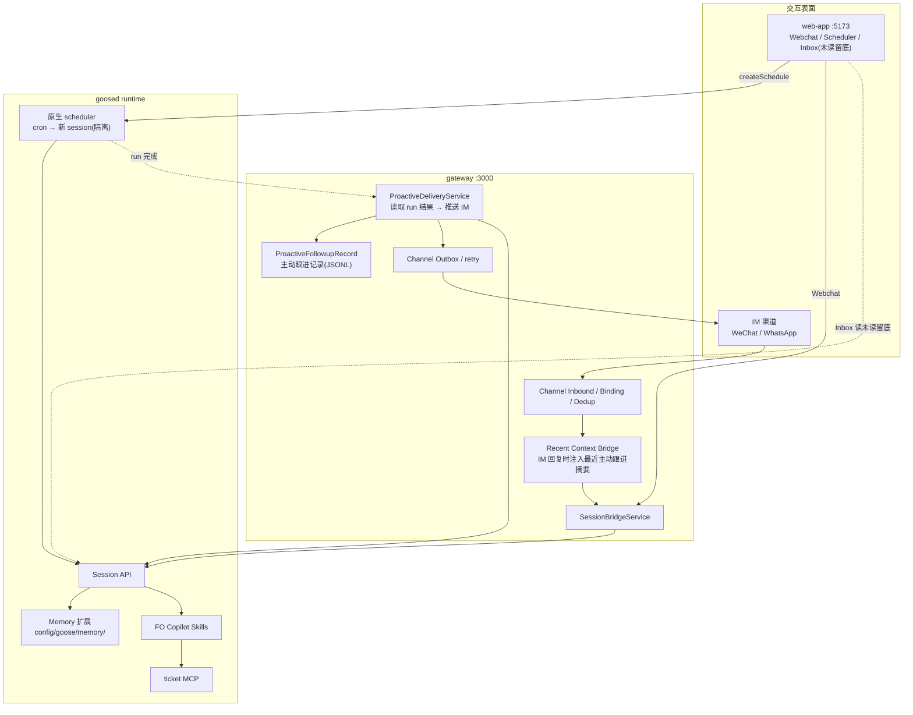

# FO Copilot 主动助理 — PRD 与架构

本文同时是产品需求说明与实现基线:讲清产品定义与关键技术机制,不展开实现细节。后续开发以本文为准。

---

## 一、产品定义

### 1.1 是什么

FO Copilot 是 FO 团队的数字助理,服务 FO lead(前台运维负责人)和团队工单协同,看护工单(Incident / Problem / Change / Service Request)从开单到关单的全过程。它不是工单系统的 CRUD 外壳,而是一个持续在岗、会判断局面的运维同事:单子被打回、接手人请假需转派、客户中途改诉求、第三方迟迟不响应、SLA 临近……这些都不是"调一个函数"能了事的,需要先获取背景再决定怎么做。

FO Copilot 这个 agent 在本仓库已存在(`gateway/agents/fo-copilot/`,含 AGENTS.md 定位、system 提示词、记忆目录、skills 目录)。本特性是在其上补齐**主动看护能力 + 工单操作能力 + 跨会话记忆的运行期维护**,不新建 agent。

### 1.2 两种工作方式

- **被动响应**:FO lead 在 WebApp Webchat 或 IM(WeChat / WhatsApp)里直接对话。
- **主动看护**:按计划周期性检查"待我处理的工单",逐个推进,然后向 FO lead 回报本次结果。**回报主动推送走 IM(WeChat / WhatsApp)**;同一次运行天然在 WebApp Inbox 以未读留底(现成能力),两者解耦,投递失败不影响执行(见五)。

### 1.3 交互原则

- **一切交互都是自然语言。** 不引入卡片、结构化决策协议或预设消息类型。场景空间是开放的(确认关单、改派、暂缓、仲裁冲突……),自然语言 + 模型判断足以覆盖。
- **总是回报,不静默。** 主动检查即使"无须行动"也回报一句,让 FO lead 确信助理在盯;是否需要人出手写在消息尾部。在打扰与让人不安之间,宁可适度打扰。
- **只向 FO lead 回报与请示,不替人对外联系**客户或处理人——对外提醒由工单系统自带通知能力负责。

### 1.4 数据边界:能力归 agent,状态归 user

OpsFactory 是多用户架构,每个 `(agentId, userId)` 是一个独立 goosed 进程。一条清晰的分界线贯穿本特性:

- **能力(agent 定义,所有使用者共享)**:AGENTS.md、system 提示词、skills、MCP、provider/模型,以及**人预置的团队策略**(SLA 标尺、运维偏好)。在 `gateway/agents/<agentId>/config/...`,经 symlink 共享。
- **状态(每用户私有)**:session、产物、上传、渠道绑定/收发、**schedule**,以及 **memory**。在 `gateway/users/<userId>/...`,每用户独立。

**记忆是"状态",不是"能力"**:它是 agent 跨运行记住的东西,应当每用户私有(和 schedule 同级)。本特性据此把记忆从"agent 级共享"**纠正为"user 级私有"**(机制见三),这是对所有 agent 生效的平台改动。

**"团队"还是"个人"由 userId 的分配决定,不写死在代码里**:

- 团队共用:成员用**同一个 userId**(团队账号)→ 一份状态、一个 watch、一份记忆,天然团队共享。
- 各自独立:成员用**各自 userId** → 各看各的状态。
- 多团队隔离:用不同 **agentId**。

> 推论:既然记忆每用户私有,**团队级规则不要写进(动态)记忆**——团队策略放进共享提示词(见三),保持单一来源。

### 1.5 模型

FO Copilot 使用 minimax/minimax-m2.7,上下文 196K(已配置于 `config/config.yaml` 与 `config/custom_providers/custom_minimax-m2.7.json`)。本设计依赖"强模型 + 长上下文"这一前提:用自然语言 + 轻量约定,而非把输出强制成结构化协议。

---

## 二、整体架构



**复用现状,不另起炉灶:**

- 主动任务 = goosed 原生 scheduler 的一个定时任务(WebApp 现有 Scheduler 页面创建,经 SDK `createSchedule({id, recipe, cron})` 打到 goosed `/schedule/create`)。recipe 的 `instructions` 是一段自然语言,指示 agent 跑某个 skill。
- goosed 每次调度都起一个**全新 session = 天然隔离运行**,自动加载记忆、skills、ticket MCP。无需 Gateway 自建调度器。
- skills 已是现成机制(`skills` 扩展启用,goose 自动发现 `config/skills/*/SKILL.md`):**新增能力 = 新增一个 SKILL.md,不改代码。**
- 记忆复用 goose `memory` 扩展,但**按用户私有**(每用户各一份,见三):运行期维护写进 skill 提示词,不需要旁路服务。
- ticket MCP 按现有 agent MCP 约定接入(`config/mcp/` 下,参考其它 agent),具体工单系统由 adapter 适配,本文档只定语义契约。

**主动看护闭环:**

1. goosed scheduler 按 cron 起隔离 session,加载记忆 + skills + ticket MCP。
2. agent 跑工作流(见四):拉取待处理工单 → 逐个判断与推进 → 顺手维护记忆 → 产出一条回报消息。
3. **留底 + 投递(解耦)**:该次运行产出的 session 天然在 Inbox 以未读留底(现成能力,无需新做)。在此之上,`ProactiveDeliveryService` 监测 run 完成,提取最终可见回复文本,写入主动跟进记录,再推送到该用户绑定的**所有** IM 渠道(微信 + WhatsApp 各发一份)。**没绑定 / 投递失败只记日志,不影响执行与 Inbox 留底。** 中间过程消息不投递。

被动对话仍可在 WebApp Webchat 或 IM 进行;主动看护的回报**主动推送走 IM**(FO lead 在 IM 里自然语言回复,上下文注入见六),WebApp Inbox 的未读留底是并存的兜底,不依赖投递成功。

---

## 三、记忆机制

FO Copilot 每次主动检查都是隔离运行,必须能跨运行记住东西。这复用 **goose 内置 Memory 扩展**,不自建;但**记忆按用户私有**(是状态、不是 agent 能力,见 1.4),这是对所有 agent 生效的平台改动。

### 3.1 机制

- 记忆是 goose Memory 扩展的全局记忆,在**每个新 session 启动时自动注入系统提示词**,agent 无需主动调工具即可"想起";运行中通过 Memory 工具读写,写入即落盘。
- **每用户私有(平台级)**:goosed 从 `XDG_CONFIG_HOME/goose/memory` 加载记忆,而 `XDG_CONFIG_HOME` 由 Gateway 在进程启动时**按用户**设置(每个 `(agentId, userId)` 进程指向各自的每用户目录)。于是记忆落在 `gateway/users/<userId>/...` 下,和 schedule 同级。已核实:`XDG_CONFIG_HOME` 在本部署里几乎是"记忆专用"——config.yaml / 提示词 / skills / provider 都走 `GOOSE_PATH_ROOT`,不受影响。
- **两个读者必须指同一处**:记忆有两个读者——goosed(注入提示词)和 Gateway 的 `/agents/{id}/memory` CRUD 端点(配置页"记忆"tab,前端已带 userId 头)。平台改动要把**两者都指到同一个每用户目录**,否则 tab 编辑的和 agent 加载的会割裂。
- **首启动 seed**:每用户记忆目录初始为空。实例首次启动、该目录为空时,把该 agent 的**共享种子记忆**拷一份进去(统一规则,不丢现有 agent 的预置)。
- **实现约束(必须遵守)**:
  - goose 只自动注入**全局**记忆(`is_global=true`);局部记忆(`is_global=false`)落别处、永不自动加载。故所有记忆读写**一律用全局作用域**,写进每个 skill 提示词,否则动态记忆会静默地不跨运行生效。
  - `XDG_CONFIG_HOME` 在 **Linux(Xdg 策略)生效**;macOS(Apple 策略)可能忽略它、走 `~/Library/Application Support`。生产 Linux 正确;本地 mac 验证时需确认记忆确实指到了每用户目录。
  - 同一 session 内新写的记忆**不会回灌当前提示词**(扩展初始化时定格),只在下一次 session 生效;运行中要看自己刚写的需用工具重读。

### 3.2 静态团队策略 → 提示词;记忆 → 只放动态状态

既然记忆每用户私有,**团队级静态规则不该放进记忆**(否则每用户各拷一份、会漂移,且团队策略丢了单一来源)。本特性把两类内容各归其位:

- **静态团队策略 → 共享 system 提示词 / AGENTS.md**(agent 级,经配置页"提示词"tab 编辑):
  - SLA 看护标尺:各优先级响应/恢复时限、"多久没动算卡住"、临期提前量、何时升级——盯梢判断"卡没卡、该不该升级"的依据。
  - 运维偏好与约束:变更窗口/维护期(期间哪些状态不催、哪些动作暂缓)、升级矩阵、协作偏好(免打扰时段、回报详略、语言)。
- **动态记忆 → 每用户记忆目录**(运行中由 agent 增删,规则见 3.3):人给的临时约定、已升级未闭环的事项等。

这样:团队策略是单一共享源、随提示词走;记忆纯粹是每用户动态状态,和 schedule 同级,毫无矛盾。

### 3.3 动态记忆的增删规则(写进 skill 提示词)

- **何时写入**:对话或检查暴露出"会改变未来看护行为、且工单系统查不到"的持久信息。例如:人给的约定("INC-1 等客户周五确认前不要催")、已升级未闭环的事项(避免重复打扰)、临时的协作偏好。
- **何时移除**:该信息不再为真时立即删——对应工单已关、约定时间已过、升级已得决策、偏好被覆盖。
- **绝不写入**:工单系统能查到的事实(状态、处理人、SLA、timeline),一律现查,避免双真相源。
- 每条尽量自带工单号/时间锚点;写入前先检索同类做去重/就地更新,不无脑追加。

### 3.4 记忆长度控制

goose 加载记忆时**无条件读取全部并拼入系统提示词,不做任何长度限制**(已核实源码)。因此长度必须自控,手段:日常靠主动看护工作流(四)收尾时"失效即删";兜底靠每日一次的记忆维护任务(见 5.3)。

---

## 四、能力分层:Skills 与 ticket MCP

FO Copilot 做的每件事都含判断(怎么做、做不做、做成什么),区别只在需要多少背景:简单的事判断后调一个原子操作即可(如加备注);复杂的事要先获取背景再多步编排(如把被打回的单子改字段并重新派人)。据此分两层:

- **ticket MCP = 原子操作**:确定性、单步、可独立调用的工单原语,不含"该不该、改成啥"的判断。
- **Skills = 工作流提示词**:描述某类 FO 操作如何判断、需要哪些证据、按什么步骤编排原子操作、输出什么(含记忆增删规则 3.3、回报格式 1.3)。简单 skill 可能就是"判断 → 调一个原语";复杂 skill 先收集背景再行动。

skill 不为某个具体工单系统定制(不出现 `jira_transition_to_done` 这类);系统差异由 ticket MCP adapter 在系统侧聚合映射,skill 只面向通用工单语义。

### 4.1 Skills

| Skill | 触发 | 工作流要点 |
| --- | --- | --- |
| **intake**(开单) | 对话中识别到开单意图 | 判断是否真要开单(纯咨询不开)→ 抽取标题/描述/影响/紧急度/系统/联系人 → 关键字段缺失先追问(最多 1–3 个)→ 创建 → 回写来源摘要 |
| **assign**(派单/改派) | 新单待派、处理人不可用、需换手 | 读详情与路由上下文 → 综合技能/排班/负载/职责边界选人 → 改派或给推荐理由待确认 → 评论说明 |
| **advance**(推进/订正) | 需把工单推向下一状态,或订正字段(改类目、改优先级等) | 读上下文 → 选目标状态/字段改动 → 校验前置条件 → 写理由评论 → 按授权执行(P1/P2 提议待确认,P3/P4 直接执行) |
| **watch**(主动看护) | 主动定时任务触发 | 见 4.3,是驱动循环,观察后路由到上述动作 skill 或升级,并产出回报 |
| **escalate**(升级) | 出现需 FO lead 知会或决策的局面(高优先级、冲突、卡死) | 组织清晰上下文 → 产出回报(尾部说明需 FO lead 做什么)→ 记一条升级记忆避免重复 |
| **close**(关单) | 工单具备关闭条件 | 读完整上下文(含 timeline)→ 总结问题/影响/根因/处理/验证/预防 → 回报并请 FO lead 确认 → 确认后回写总结并推进到 closed |
| **daily-brief**(每日简报) | 主动定时任务触发(每日早上)/ 被问“昨天怎么样” | **只读、不动单**:调 `ticket.get_daily_brief` 取前一日处理摘要 → 按运维总监日报模板渲染(昨日数量 → 重要在办 → **最需 FO lead 决策的事项**,每项带具体待决问题 → SLA 风险),投递给 FO lead |

回报通则:带明确工单上下文(别让人猜是哪张单);一次聚焦最重要 1–3 项;尾部说明是否需人出手;不编造影响/优先级/系统名;不把敏感联系人、密钥、内部临时链接写入评论;关单总结区分事实/推断/未验证假设。

**动作授权(按优先级,靠提示词约束)**:高风险写操作(状态流转 / 改派 / 关单)对 **P1/P2 工单只提议、不自动执行**——在回报里给建议并标"等你确认",真正执行发生在 FO lead 确认回复之后(见六);**P3/P4 工单 copilot 直接执行**。所有自动执行的动作都写一条 `ticket.comment`(含理由)并留审计记录,保证可追溯。这是提示词级约束(非代码硬闸),残留风险见十。

### 4.2 ticket MCP 契约

数据语义:

| 对象 | 必要语义 |
| --- | --- |
| `Ticket` | 基础字段、状态、处理人(owner)、优先级、SLA(**绝对时间戳**,由 agent 拿 `current_date_time` 自行比对,adapter 不替它算"逾期没")、最近更新时间、项目扩展字段;**不内嵌候选人**(见 `Candidate`) |
| `Candidate` | 成员、技能、是否在班、当前负载(在办工单数)、职责边界;无数据时返回空集合或缺省原因 |
| `TimelineEvent` | 时间、作者、事件类型、摘要、可见性 |
| `Transition` | 流转 ID、目标状态、前置条件、是否需确认(`needsConfirm`);作为**数据**随 `get_state_context` 返回,供上层判断,adapter 自身不拦 |

工具设计原则(对齐 [Writing tools for agents](https://www.anthropic.com/engineering/writing-tools-for-agents)):**写操作保持原子、正交**(create/update/comment/transition/update_assignment 是 skill 自由编排的离散动作);**读操作对齐 agent 任务、做合并**——不暴露逐字段的裸 CRUD,而按"扫一眼待办"和"要动这张单、把决策依据一次给全"两种真实任务各给一个读,用 `format: concise | detailed` 旋钮控制详略,避免 agent 为一次决策分多次往返、重复消耗上下文。

工具(共 9 个):

| Tool | 类型 | 说明 |
| --- | --- | --- |
| `ticket.get_todo` | 读·扫描 | **主动看护入口**:返回"待我(copilot)跟进"的工单列表,**concise 摘要**(id/标题/状态/owner/优先级/SLA 目标时刻/上次更新/一句话),让 watch 大多数单不必再深读 |
| `ticket.get_daily_brief` | 读·汇总 | **每日简报入口**:前一日处理摘要——开单/解决/处理计数 + 按优先级分布 + 当前重要(P1/P2)在办积压 + **等待 FO lead 决策的事项(各带具体待决问题)** + SLA 风险项;默认昨天,若昨天无活动自动回退到最近活跃日(永不为空)。可选 `date`(YYYY-MM-DD)。首发为 mock 派生,真实 adapter 同面替换 |
| `ticket.get_state_context` | 读·深查 | 单张单的"决策依据一次给全":字段/状态/SLA/owner + 可用 `Transition`(含前置条件、`needsConfirm`)+ timeline + 近期评论;带 `format: concise \| detailed`,`concise` 即单张单的摘要视图 |
| `ticket.get_candidates` | 读·路由 | 花名册:成员 + 技能 + 是否在班 + 当前负载(在办工单数)+ 职责边界;可选按 `ticketId` 预筛/排序(assign 用) |
| `ticket.create` | 写 | 创建工单 |
| `ticket.update` | 写 | 改字段(类目、优先级等) |
| `ticket.comment` | 写 | 加评论 |
| `ticket.transition` | 写 | 执行状态流转(校验状态图合法性,非法流转报错并给出可操作提示;不内置 P1/P2 授权判断) |
| `ticket.update_assignment` | 写 | 改派处理人 |

> `get_todo` 的"待我跟进"由工单系统侧定义并返回一个列表;copilot 不关心其判定规则,只负责把列表逐个处理掉。
> 相比初稿,合并了原 `get` / `get_timeline` / `list_transitions` 三个裸读为 `get_state_context`(深查一次给全,`concise` 覆盖原 `get` 的摘要),并新增 `get_candidates` 把候选人/技能/负载从 `Ticket` 内嵌中独立出来(单一来源、watch 扫描更轻、派单时再点查最新负载)。

写操作可选支持 `operationId` / `followupId` 这类业务幂等键。goosed 已负责 session/request/schedule 级别的执行关联、取消和同一 session 并发控制;但它不知道某次 `ticket.comment` 或 `ticket.transition` 是否是同一张工单的同一个业务动作。若首发 adapter 无法支持幂等键,也可以先把该字段透传或忽略,但工具契约应保留这个扩展点。

### 4.3 主动看护工作流(watch)

watch 不去拥有任意工单系统的完整状态机,而以"球在谁手里"为视角:**每张单都有一个"下一步动作归属方";盯梢 = 把球不在对方手里、卡在我这儿的单子推出去。**

```text
1. ticket.get_todo 拿到"待我跟进"的工单列表(已含 concise 摘要:状态/owner/优先级/SLA 目标时刻)
2. 逐个处理每张单:
   - 直接用 get_todo 返回的摘要做首轮判断(摘要级,不深读);仅当要动这张单时再 ticket.get_state_context(detailed)拿全上下文
   - 读记忆:人给过的约定(如"等客户周五")、已升级过什么 → 避免违约/重复打扰
   - 决定并**按授权**处理:推进(advance)/ 改派(assign)/ 升级(escalate)/ 评论留待 / 暂缓;高风险写操作对 P1/P2 只提议待确认,P3/P4 直接执行(见 4.1 授权)
   - 处理的目标是把"球"交出去 —— 让这张单的 owner 不再是 copilot
3. 维护记忆:写入新约定,清理已失效条目
4. 产出回报:聚焦最重要 1–3 项,尾部说明是否需人出手;无异常则回报"一切正常、无需处理"
```

**无状态原则**:每次看护是独立的一轮——拿到当轮 todo,逐个判断并尽量交球,产出回报,结束;不把“上一轮扫过哪些单”写进记忆。某张单这轮若无法交球(如约定“等客户周五确认前不要催”),它下一轮仍会出现在 todo 里且状态没变,这是预期的;不引入跨轮扫描状态,而靠回报精炼来容忍:对“还在等”这类只极简一句或并入汇总,不为同一张单反复单独刷屏。本轮 todo 处理完即结束。
主动跟进记录只保存投递事实(发了什么、发到哪个会话),不维护待确认状态、不承担工单状态机。
深查(`ticket.get_state_context` 的 `detailed`:完整字段 + timeline + 可用流转 + 近期评论)只在 advance / close 真正要动某张单时进行,不在 watch 的常规扫描里做。

工单系统自带提醒会通知该通知的人;watch 的回报只发给 FO lead,内容是需要他知道或决策的事。

---

## 五、主动任务与投递

### 5.1 主动看护任务

由 FO lead 在 WebApp 的 agent 配置页『我的 · 定时任务』tab 创建(见十一)。**注意 goosed 的 `/schedule/create` 只接受 `{id, recipe, cron}`,装不下投递信息**;故创建经一个 Gateway 端点:Gateway 调 goosed 建调度,同时把“该任务要投递回报”这一标记按 `schedule id` 旁存(不写进 goosed)。

```jsonc
// ① 传给 goosed 的部分(它只认这三项)
{
  "id": "ticket-watch-loop",
  "cron": "0 */30 * * * *",
  "recipe": { "title": "Ticket watch loop", "instructions": "Run proactive ticket watch (watch): pull the tickets waiting on me, judge each and try to pass the ball on, then report." }
}
// ② Gateway 旁存的投递标记(以 schedule id 为 key)
{ "scheduleId": "ticket-watch-loop", "deliver": "im" }
```

投递目标**不需手填渠道坐标**:主动推送只走 IM,Gateway 按该用户已有的 IM 绑定(`ChannelBindingService`)解析出会话,投递到其绑定的**所有** IM 渠道。无投递标记的任务为普通后台任务,只留 Inbox 未读、不主动推送。

> cron 字段 goose 同时接受 5 段或 6 段写法(5 段会自动转 6 段),与现有 Gateway 代码保持一致即可。

> **前提:`(fo-copilot, 该 FO lead userId)` 必须登记为常驻实例**(`gateway/config.yaml` 的 `residentInstances`:`enabled: true` + 在 `entries` 加该 `(userId, agentId)`)。goosed 的 cron 是进程内的,实例被空闲回收后就不会触发;只有常驻实例能保证到点起跑(见八/九)。

> **schedule 的存储位置:** goosed 把定时任务存为**每用户运行态**,不是签入仓库的静态配置——recipe 正文写到 `gateway/users/<userId>/agents/<agentId>/data/scheduled_recipes/<id>.yaml`(schema 仅 `version/title/description/instructions`,**不含 cron**),cron / 暂停 / 上次运行等调度元数据写到同目录的 `data/schedule.json`(其 `source` 字段指向该 recipe 文件);二者都由 goosed 在 `/schedule/create` 时生成。**不存在被 goosed 读取的 `config/recipes/`**——`config_dir = GOOSE_PATH_ROOT/config` 只承载提示词 / skills / provider 等"能力"。故"内置默认任务"必须在常驻实例首启时 **seed/注册**(机制类比 PR1 记忆 seed,见九、十二 PR5),而非摆放静态配置文件。

### 5.2 主动消息投递

goosed 不提供“往已有 session 追加 assistant 消息”的能力(写入 transcript 的接口都会真正跑一遍 agent)。所以主动运行的产出有**两条并存、解耦**的去向:

- **Inbox 留底(现成、免费)**:该次 scheduled run 本身是带 transcript 的 session,天然在 WebApp Inbox 以未读出现(复用现有 InboxContext 能力),无需新做、也不抑制。
- **IM 主动推送(解耦、尽力而为)**:`ProactiveDeliveryService` 监测该 run 完成,取其返回 messageList 里**最后一条 text 类型的 final response**作为回报文本(中间工具调用 / 过程消息一律不投);按该用户的 IM 绑定推送到其**所有**绑定渠道(微信 + WhatsApp 各一份),走现有 channel 出站(写 outbox);同时往 `ProactiveFollowupRecord` 追加一条投递记录。

**没设置投递 / 没有 IM 绑定 / 投递失败,都只记日志(WARN),不影响巡检执行与 Inbox 留底。** 需要 IM 投递的任务由 §5.1 的旁存标记(`deliver:"im"`)圈定。

**投递配置**(`gateway/config.yaml` → `gateway.proactive-delivery`,均支持环境变量覆盖):

| key | 默认 | env 覆盖 | 含义 |
| --- | --- | --- | --- |
| `enabled` | `true` | `PROACTIVE_DELIVERY_ENABLED` | 主动投递总开关 |
| `poll-interval-ms` | `30000` | `PROACTIVE_DELIVERY_POLL_INTERVAL` | 扫描已完成 run 的节奏 |
| `max-age-minutes` | `60` | `PROACTIVE_DELIVERY_MAX_AGE_MINUTES` | 早于此时长的 run 不再投递 |
| `followup-inject-limit` | `10` | `PROACTIVE_DELIVERY_FOLLOWUP_INJECT_LIMIT` | IM 回复注入的最近主动跟进条数(见 6.2) |

### 5.3 记忆维护任务

独立的每日定时任务,专做记忆体检与控长(对应 3.4 的兜底):

- **id**:`fo-copilot-memory-maintenance`
- **cron**:每天 12:00
- **职责**:全量读取记忆 → 合并重复、删除已失效条目(对照工单现状判断:已关单的约定、已过期的维护窗口、已得决策的升级)→ 精炼过长条目 → 保证总量在合理上下文占用内。
- **提示词设计要点**(实现时写入对应 SKILL.md):
  - **量力而行**:一次只处理记忆文件,不去翻全量工单;需要核实某条是否失效时,用 ticket MCP 点查对应工单,而非全表扫描。
  - **上下文友好**:记忆全文随 196K 上下文进来,维护任务直接在上下文里就能看到所有记忆,逐条判断"留 / 改 / 删"。
  - **保留尺度**:不动人预置的看护规则(`sla-criteria` / `ops-preferences` 这类),只清理运行中自动累积的条目;靠 category 约定区分,不在文件层面强制。有疑义时倾向保留并标注,不擅自删除人写的内容。
  - **可追溯**:删除/合并应在回报里列出"改了什么、为什么",便于 FO lead 复核。
- **不投 IM、日志走现成的**:本任务只维护记忆,**不向任何渠道推送**;它的执行记录就是该次 goosed session transcript + 现成的 goosed / gateway 日志,不另造日志。

---

## 六、回复与上下文桥接

### 6.1 回复一条主动消息

主动消息只在 IM 推送,FO lead 也在 IM 会话里回复:确认/驳回就是一句自然话(“关吧” / “先别关,等客户确认”),Gateway 注入最近主动跟进摘要让 agent 对齐(6.2),agent 据此执行对应工作流或更新记忆,无需结构化 UI 协议。(WebApp 里 FO lead 仍可主动发起被动对话,但那不是对某条主动回报的回复。)

### 6.2 IM 回复的上下文注入(IM 专用)

IM 用户回复时,Gateway 不恢复主动运行的完整 transcript,只把最近相关主动跟进摘要拼进本轮 `user_message`:

```text
[最近 FO Copilot 主动跟进]
- 2026-06-02 14:30(今天) ticket-watch-loop:INC-1 建议关单,等你确认。
- 2026-05-31 11:00(约 2 天前) ticket-watch-loop:INC-7 第三方仍未响应,已替你升级。

[用户当前回复]
关吧。
```

仍调用现有 `/sessions/{id}/reply`,无需 goosed 新 API;展示侧只展示用户原始输入,agent 看到增强后的输入。**注入规则**:按本会话 `targetKey` 取最近 **~10 条**(可调)主动跟进,每条带**绝对时间 + 相对时间(“约 2 天前”)**;**不设硬性时间窗**——晚回也照常注入,只把“多久之前”标清楚,让 agent 自己判断相关性。**彻底无状态**:记录只追加不改、不维护“已回应”状态;“别重复追问”靠三层天然兜底——① 注入过的内容已在该会话历史里,agent 看到自己已处理就不再问;② 漏掉的下一轮 watch 会重新提上来;③ 极端重复动作由 ticket MCP 幂等挡掉。若回复能唯一匹配某条跟进,agent 直接处理;多条候选或语义不清则自然语言追问。摘要来源是 `ProactiveFollowupRecord`(见七)。

---

## 七、Gateway 维护的数据

### 7.1 ProactiveFollowupRecord(主动跟进记录)

这是一个轻量 JSONL 记录,不建新数据库,不替代 goosed session transcript,**不保存工单状态机**。它只服务于 **IM 投递的审计/排障** 与 **IM 回复的上下文注入(6.2)**。

- 存储:`gateway/users/<userId>/agents/<agentId>/proactive-followups/records.jsonl`,**只追加、不回写**,不写 goosed SQLite。
- 每条只含:`time`、`scheduleId`、`sessionId`、`targetKey`(`im:<type>:<channelId>:<accountId>:<conversationId>:<threadId>`)、`summary`(即投递出去的回报原文)。**不存结构化动作/状态机,不存完整 transcript。**
- 读取(注入):按 `targetKey` 取最近 ~10 条(可调),**不按状态过滤**(无状态)。
- 保留:每个 `(userId, agentId)` 最近 30 天或最多 1000 条,写入/启动时轻量 compaction;IM 失败细节以 channel outbox / 日志为准。

示例:

```json
{
  "time": "2026-06-02T14:30:00Z",
  "scheduleId": "ticket-watch-loop",
  "sessionId": "20260602_1430",
  "targetKey": "im:wechat:wechat-main:account-1:conversation-1:thread-1",
  "summary": "INC-1 建议关单,等你确认。"
}
```

### 7.2 运行历史(不单独维护)

Gateway **不再为主动运行建独立的运行历史存储**。运行事实由三处兜底:goosed 的 schedule session 列表(每次运行一个 session,带 `scheduleId` / `current_session_id` / 起止 / token)、`ProactiveFollowupRecord`(投递事实)、以及按日志规范打的 gateway 日志(收割、投递成功/失败/无绑定)。投递状态以**日志 + channel outbox** 为准,不另立状态表。

---

## 八、职责边界

- **Gateway**:创建调度的端点(调 goosed + 旁存“投 IM”标记);`ProactiveDeliveryService` 在 run 完成后提取最终可见回复,按 IM 绑定推送到全部绑定渠道(**解耦、尽力而为,无绑定/失败只记日志**);维护 `ProactiveFollowupRecord`;IM 回复上下文注入;按日志规范打点。**不单独维护运行历史**(见 7.2)。
- **goosed**:cron 调度并每次起隔离 session;agent loop;model / tool / MCP 运行;session transcript;加载记忆;执行 ticket MCP;维护 request_id / events / cancel / schedule session 历史等运行时能力。
- **FO Copilot(agent 配置)**:AGENTS.md / system 提示词(含团队策略:SLA 标尺 / 运维偏好);skills(intake / assign / advance / watch / escalate / close / daily-brief + 记忆维护);ticket MCP 接入;记忆为**每用户动态状态**(运行期增删,不再有 agent 级静态记忆文件)。
- **平台(对所有 agent)**:记忆改为每用户私有——Gateway 把 goosed 的 `XDG_CONFIG_HOME` 与 `/agents/{id}/memory` 端点都指到每用户目录,并在实例首启动时 seed;WebApp 配置页按作用域分组(见十一)。

---

## 九、需要新建/改造的清单

- **FO Copilot agent 配置**(`gateway/agents/fo-copilot/`):
  - 模型已切到 minimax-m2.7 / 196K(已完成)。
  - 提示词:把团队策略(SLA 看护标尺、运维偏好)写进 system 提示词 / AGENTS.md(agent 级单一来源,替代旧的静态记忆文件)。
  - 记忆:不再建 agent 级静态文件;运行期由 agent 生成**每用户动态记忆**(机制见三)。
  - skills:`config/skills/` 下新增 watch / intake / assign / advance / escalate / close / daily-brief,以及记忆维护 skill。
  - ticket MCP:`config/mcp/` 下接入(adapter 由项目侧实现 9 个工具:`get_todo` / `get_daily_brief` / `get_state_context` / `get_candidates` / `create` / `update` / `comment` / `transition` / `update_assignment`)。
- **WebApp**:agent 配置页 tab **按作用域分两组**(“Agent · 对所有人” / “我的 · 仅对你”,见十一);**定时任务并入“我的”组**(复用原 Scheduler 页能力);创建主动看护任务时加“投递到 IM”开关、经新 Gateway 端点带标记(不直接调 goosed);**从 sidebar 移除独立 Scheduler 页**;Inbox 未读留底复用现有能力,无需改。
- **Gateway**:创建调度的端点(调 goosed + 旁存“投 IM”标记);`ProactiveDeliveryService` 提取最终可见回复 → 按 IM 绑定推送到全部绑定渠道(失败/无绑定只记日志);`ProactiveFollowupRecord` 读写与保留;IM 回复上下文注入。
- **平台改动(所有 agent)**:记忆转每用户——`InstanceManager.buildEnvironment` 把 `XDG_CONFIG_HOME` 指向每用户目录;`/agents/{id}/memory` CRUD 端点同步指向该每用户目录;实例首启动时若每用户记忆目录为空,从 agent 共享种子拷贝。
- **常驻实例**:将 `(fo-copilot, <FO lead userId>)` 登记为常驻(`gateway/config.yaml` 的 `residentInstances`:`enabled: true` 并在 `entries` 加该 `(userId, agentId)`),否则空闲回收后 cron 不触发。
- **日志**:新增 Gateway 组件按 [`docs/development/logging-guidelines.md`](../development/logging-guidelines.md) 打点——SLF4J + MDC(`scheduleId`/`sessionId`/`conversationId`)、主链路 INFO 摘要、失败 WARN/ERROR、**不打回报正文**(只记长度/工单号/渠道数);新增配置开关同步 `config.yaml.example` + 文档 + 测试。
- **配置(`gateway.proactive-delivery.*`)**:`enabled`(总开关)/ `poll-interval-ms`(投递轮询间隔,默认 30s)/ `max-age-minutes`(忽略多久之前的历史 run,避免重启回灌,默认 60min)/ `followup-inject-limit`(IM 回复注入的最近跟进条数,默认 10);四项同步 `application.yml` 默认值 + `config.yaml.example` 注释 + `ctl.sh` 环境覆盖(`PROACTIVE_DELIVERY_*`)。
- **定时任务(每用户运行态,非静态配置)**:`ticket-watch-loop`(主动看护,cron `0 */30 * * * *`,每 30 分钟轮询,投 IM)、`ticket-daily-brief`(每日简报,cron `0 0 9 * * *`,每天 09:00,投 IM)、`fo-copilot-memory-maintenance`(每天 12:00 记忆维护);三者在常驻实例首启时按 `config/seed-schedules/seed.json` seed/注册进该用户的 `data/scheduled_recipes/<id>.yaml` + `data/schedule.json`(由 goosed `/schedule/create` 生成,机制类比 PR1 记忆 seed),**不签入 `config/`**(seed 清单与 recipe 模板签入 `config/seed-schedules/`)。

---

## 十、风险登记

- **注意力管理**:每 30 分钟轮询 × 总是回报 ≈ 48 次/天(Inbox 留底 + IM 均推)。每轮都回报(含"无事")、IM 也推,不做"无事不推"(§1.3);"无事"回报须足够精炼(极简一句 / 并入汇总),把固定噪声压到最低。
- **授权靠提示词(非代码硬闸)**:P1/P2 提议待确认、P3/P4 直接执行,由 watch / 动作 skill 的提示词约束;存在模型误判风险,靠 `ticket.comment` 审计 + 人工复核兜底,后续可按需把高风险写操作下沉到 ticket MCP 关口加硬约束。
- **ticket adapter 是命门**:工单语义(状态、owner、SLA)归一化错误会导致"在错的工单上行动";adapter 需有一个真实首发系统打穿后再推广。
- **记忆每用户的取舍**:记忆改为每用户后,动态约定不再自动跨人共享——按"个人用法"(各自 userId)时,A 学到的"INC-1 等客户周五"对 B 不可见;需要团队共享时用同一 userId(团队账号)。团队级规则放共享提示词、不放记忆,可减轻此问题。另:这是平台级改动,影响所有 agent 的记忆迁移/seed,需统一验证。
- **业务动作去重**:goosed 负责 request/session/schedule 级执行关联,不负责工单业务动作幂等;ticket adapter 后续应利用 `operationId` / `followupId` 做评论、流转、改派等写操作去重。
- **记忆膨胀**:goose 不自动限长,靠 watch 收尾"失效即删" + 每日维护任务兜底。
- **成功度量**:建议跟踪主动消息的行动转化率、SLA 漏检下降、FO lead 对助理的静音/关闭率。

---

## 十一、配置页交互:按作用域分组

记忆和 schedule 都是**每用户状态**,却和 agent 级能力同在一个 agent 配置页。为让用户一眼看清作用域,把配置 tab **按作用域分两组、加组标题**:

- **Agent · 对所有使用者生效**:基础信息、提示词、模型、Skills、MCP
- **我的 · 仅对你生效**:记忆、定时任务

要点:

- 作用域靠**结构**表达,不必给每个 tab 单独解释;用户看到"我的"组即知此处只影响自己。
- **记忆 tab**:数据本就按当前 userId 走(`useMemory` 带 userId 头),平台改动(三)后自动编辑当前用户的每用户记忆,前端只需归组,无数据层改动。
- **定时任务 tab**:把原独立 Scheduler 页能力(`listSchedules` / `create` / `pause` / `runNow` 等,本就走用户实例)搬进"我的"组,与记忆并排。
- **从 sidebar 移除独立 Scheduler 页**:不再需要跨 agent 总览;定时任务统一从各 agent 配置页"我的"组进入。

---

## 十二、PR 提交计划

这串 PR 是**同一个大特性分步长出来的一条线**,不是零散补丁。"FO Copilot 主动助理"分三段递进:**先有地基(状态归位)→ 再有大脑(会判断、能动单)→ 最后主动起来并闭环(到点自查、推到 IM、回一句话接着干)**。每个 PR 都对应一个"此前做不到、此后能做到"的能力增量,沿途有四个可交付、可演示的里程碑。

> 总目标:助理到点自查工单 → 逐个判断/推进或提议 → 把回报推到 FO lead 的微信/WhatsApp → FO lead 回一句自然话就闭环。

### 阶段一 · 地基:让"状态"归位(平台级)

不直接产出主动看护,但**没有它,助理就没有"每人一份、干净的记忆和任务"**——是后面一切的承重墙。

**PR1 — 记忆每用户**
- **此后能做到**:助理"每个人一份独立记忆"(和 schedule 同级的每用户状态);团队还是个人由 userId 分配决定,不再写死在代码里。
- 内容:`buildEnvironment` 把 `XDG_CONFIG_HOME` 指向每用户目录;`/agents/{id}/memory` 端点同指;实例首启动 seed。
- 影响面:所有 agent(行为变更,需逐 agent 回归)。依赖:无。
- 验收:同 agent 不同 userId 记忆互不可见;种子正确拷入;现有 agent 记忆仍正常注入(Linux)。

**PR2 — 配置页按作用域分组**
- **此后能做到**:FO lead 在一个地方就能分清"团队设置 vs 我自己的(记忆、定时任务)",并拿到后面"建看护任务"的入口。
- 内容:配置页 tab 分两组(Agent / 我的);定时任务并入"我的"组;移除 sidebar 独立 Scheduler 页。
- 影响面:前端 only。依赖:与 PR1 可并行。
- 验收:作用域一眼清楚;记忆/定时任务 tab 正常读写当前用户;sidebar 无 Scheduler 入口。

> 🧱 **里程碑 A · 地基就绪**:状态归位、配置入口清晰。助理还"不会干活",但站得稳了。

### 阶段二 · 大脑:让助理会判断、能动单(隔离在单 agent)

把 fo-copilot 从空壳变成"懂运维的同事",且**只动它自己的配置目录,不碰平台代码**。

**PR3 — 提示词(团队策略)+ skills**
- **此后能做到**:助理"懂"了——懂 SLA 标尺,懂怎么开单/派单/推进/升级/关单/维护记忆,懂 P1/P2 要先请示。
- 内容:团队策略写进 system 提示词/AGENTS.md;移除过时旧 skills(agent-config-viewer / log-analysis / system-info)与旧记忆种子;新增 watch / intake / assign / advance / escalate / close + 记忆维护 SKILL.md(含授权、记忆全局作用域、无状态规则)。
- 影响面:仅 `gateway/agents/fo-copilot/config/`。依赖:概念上在 PR1 后。
- 验收:对话时 skills 正确发现;建临时调度 `runNow` 跑 watch → 产出回报(此时尚无真实工单动作 / 无 IM)。

**PR4 — ticket MCP 接入(你方实现,可与 PR3 并行)**
- **此后能做到**:给助理接上工单系统的"手脚"——它能真的拉单、改字段、加评论、流转、改派。
- 内容:`config/mcp/` adapter,实现 8 个工具(`get_todo`/`get_state_context`/`get_candidates`/`create`/`update`/`comment`/`transition`/`update_assignment`)。读对齐任务(合并裸读 + concise/detailed 旋钮),写保持原子正交;首发用文件落盘的 mock 工单库(真状态机)打穿端到端,真实系统 adapter 后续替换同一工具面。
- 影响面:仅 fo-copilot config。**PR3 的 skill 按本工具面重构**(skill 是可组合的,工具是原子的)。验收:watch 能真拉单、真动单。

**PR5 — 常驻实例 + 默认定时任务(seed)**
- **此后能做到**:助理开始"主动"——到点自己跑巡检、自己维护记忆,无需人点。
- 内容:在 `gateway/config.yaml` `residentInstances` 把 `(fo-copilot, <FO lead userId>)` 设为常驻(`enabled: true` + entries);常驻实例首启时 **seed/注册**两个默认任务——`ticket-watch-loop`(主动看护,cron `0 */30 * * * *`,每 30 分钟)与 `fo-copilot-memory-maintenance`(每天 12:00)。任务以每用户运行态落到 `data/scheduled_recipes/<id>.yaml` + `data/schedule.json`(由 goosed `/schedule/create` 生成),seed 源签入 agent 级、用一次性 marker 注册(类比 PR1 记忆 seed),不覆盖用户后续的改/删。
- 影响面:`config.yaml` 常驻配置 + 一处 seed/注册逻辑。依赖:PR3、PR4 方有实效。验收:常驻实例到点自动起跑(30 分钟内即可观测);回报已能在 Inbox 以未读看到。

> 🚀 **里程碑 B · 主动看护在 WebApp 侧可用**:助理已能到点自查、判断、动单/提议,回报落在 Inbox。**这是大特性名字的首次兑现**——只是回报还在 WebApp,没到手机。

### 阶段三 · 主动起来并闭环:推到 IM、回一句话接着干

把回报送出 WebApp、送到 FO lead 手机,并打通"回一句话就推进"的双向闭环。

**PR6 — 调度创建端点 + deliver 旁存(+ WebApp 投递开关)**
- **此后能做到**:FO lead 建看护任务时能勾选"把回报发我微信/WhatsApp"。
- 内容:新 Gateway 端点(goosed createSchedule + 旁存 `deliver:im`);定时任务 tab 加投递开关。
- 影响面:Gateway 一端点 + 前端一开关。依赖:PR2。验收:任务带标记;旁存/读取正确。

**PR7 — ProactiveDeliveryService + FollowupRecord(投递)**
- **此后能做到**:巡检结果真的推到 FO lead 的微信/WhatsApp,人不用守着 WebApp。
- 内容:监测 run 完成 → 取最后一条 text → 按绑定写各渠道 outbox → 追加 followup 记录;失败/无绑定仅记日志。
- 影响面:Gateway 新服务 + 复用 channel outbox。依赖:PR6 + IM 通道(已有)。验收:回报推到微信/WhatsApp;记录落盘;失败有日志。

> 📲 **里程碑 C · IM 主动推送可用**:助理主动把回报送到手机。单向已通。

**PR8 — IM 回复上下文注入(闭环)**
- **此后能做到**:FO lead 在 IM 回一句"关吧"就能让助理接着把那张单办了——双向闭环完成。
- 内容:入站 IM 发 `/reply` 前,按 targetKey 取最近 ~10 条 followup(带时间戳、无状态)prepend。
- 影响面:Gateway 入站一处。依赖:PR7。验收:IM 回"关吧"能对上单、执行确认动作。

> ✅ **里程碑 D · 完整特性**:到点自查 → 推送回报到 IM → 回一句话推进。FO Copilot 主动助理成型。

### 阶段四 · 可视化:让主动看护「被看见」(Thread 入口)

阶段三让助理主动起来并闭环,但 FO lead 还缺一个**看见这段关系**的固定入口——渠道会话混在 History 里要翻,主动推送散在 Inbox。PR9 补这个表面(详见十三),与阶段三同批并入同一 PR。

**PR9 — Thread 入口(以对端为中心的会话视图)**
- **此后能做到**:FO lead 有一个固定入口,一处看"我和某个 copilot 的对话 + 它主动推给我的全部播报",不必再去 History 里翻。
- 内容:前端新增 Thread 模块——面包屑下拉切 thread + B 主对话(resume `binding.sessionId`)+ C 主动推送时间线(按 `targetKey` 列 followup,常驻 rail)+ 点卡只读模态(翻页 / goto session / 关闭);数据复用 bindings / followup / session-detail,按需暴露"按 `targetKey` 列 followup"。
- 影响面:前端为主 + Gateway 至多一个查询端点。依赖:PR7(followup 记录)、PR8(回复闭环)。
- 验收:切 copilot;B 能 resume 主对话并回复;C 列出主动推送;点卡弹只读模态、可翻页/关闭/goto;无主会话时中间有提示。边界见十三(单渠道、不合并联系人、注入块不剥离)。

> 🔭 **里程碑 E · 可被看见**:主动看护从"在跑"变成"看得见、点得开"——给主动助理一个以对端为中心的常驻入口。

### 关键路径与节奏

- **主干**:PR1 →(PR3 → PR5)→ PR6 → PR7 → PR8 →(PR9 可视化)。**可并行**:PR2 与 PR1;PR4 与 PR3。
- **里程碑节奏**:A(PR1–2)地基 → B(PR3–5)WebApp 侧主动看护可用 → C(PR6–7)IM 推送 → D(PR8)双向闭环 → E(PR9)可被看见。**每个里程碑都可独立交付、可演示**,不必等全链路。

### 横切要求(每个 PR 都遵守)

- **日志**:新增/改动的 Gateway 组件按 [`docs/development/logging-guidelines.md`](../development/logging-guidelines.md) 打点(SLF4J + MDC、INFO 摘要、失败 WARN/ERROR、不打敏感信息与回报正文)。
- **配置同步**:任何新增 config key(`deliver` 旁存、seed、日志开关等)同步 `config.yaml.example` + 相关文档。
- **测试**:前端 PR 跑 `npm run test:basic` + `check:boundaries` + `build`;Gateway PR 跑 `mvn test`(含日志/配置生效测试)。
- **临时产物清理**:验证用的 e2e/debug 用户、截图、脚本按仓库规范清理,不留 `e2e-*`/`debug-*`/`test-*` 残留。

---

## 十三、Thread 入口(主动看护的可视化,PR9)

PR5–8 让助理"会主动、能投递、可闭环",但 FO lead 还缺一个**看得见这段关系**的固定入口:渠道会话混在 History 里要翻,主动推送散在 Inbox。Thread 给每个 copilot 一个**以对端为中心**的常驻入口,把"我和它的对话"与"它主动推给我的全部播报"一处呈现。本节是阶段三的可视化补充(PR9),与阶段三同批并入同一 PR。

### 13.1 模型与身份

- **一个 thread = 一个 `targetKey`**(`im:{type}:{channelId}:{accountId}:{conversationId}:{threadId}`):direct 会话即"一个人",group 会话即"一个房间"。
- **命名 = agent 名**(如 "FO Copilot"):一个用户对一个 copilot 一条线,是**部署约定**,不是技术限制。
- 一个 thread 聚合的内容,**按 session 身份天然分两类,无需跨 session 合并**:
  - **主 session** = 与该对端的实时对话(`binding.sessionId`);
  - **该 `targetKey` 下的其它 session** = 每个定时任务的每次 run(经 followup 记录的 `targetKey` 关联)。

### 13.2 信息架构(复用现有「主区 + 右栏」框架:共享对话外壳 + RightPanelHost 窄 mode)

```
┌──────────┬─────────────────────────────────────┬──────────────────────────────┐
│ 面包屑    │  Thread ▸ [ FO Copilot ▾ ]          │ C:主动推送时间线(常驻·默认开)│
│ 下拉切换  │  B:主对话(resume,chat + composer)  │  ▣ 今天 09:00 每日简报        │
├──────────┼─────────────────────────────────────┼──────────────────────────────┤
│ (侧栏     │  ▶ FO Copilot 09:00 …               │   Opened6 Resolved2 · 2待决策 │
│  Thread   │  ◀ 你 09:12 第一条为啥要我决策       │  ───────────────────────────  │
│  入口 +   │  ▶ FO Copilot 09:12 INC-1042…       │  ▣ 昨天 09:00 每日简报        │
│  聚合     │                                     │  ▣ 前天 09:00 每日简报        │
│  badge)   │  ┌───────────────────────────────┐  │  ▣ …                         │
│           │  │ 输入回复…                  ▸ │  │                              │
│           │  └───────────────────────────────┘  │                              │
└──────────┴─────────────────────────────────────┴──────────────────────────────┘
   点 C 卡 → 只读模态(resume 的 run,无输入框):[← 翻页 →] [goto session] [✕ 关闭]
   B 内附件 → overlay 预览
```

- **页头面包屑下拉** `我的助理 ▸ [FO Copilot ▾]`:切 copilot,**常驻下拉(单个也显示、项数不限)**;头是 **48px 对齐头**(与 sidebar / 右栏同线)。侧栏入口名为「我的助理」(`sidebar.thread`,曾用名「助理 / 主动助理」),挂**聚合未读 badge**(各 copilot 合计,复用 Inbox 那套)。
- **B(主区)= 主对话**:`resume(binding.sessionId)`,**复用提升到 platform 的对话外壳 `ConversationShell`**(48px 头 + 居中正文 + 固定满宽 composer,与 chat 同款且右面板感知)。无主 session 时给一段提示。
- **C(右栏)= 主动推送时间线**:**挂进现成的 `RightPanelHost`**(新增窄 `thread` mode ~32%,与 file-preview / market 同框架),48px 头自动对齐、主区联动收缩;**默认开、可关可再开**;按 `targetKey` 列该 thread 下**所有**定时任务投递(统一样式、不分内容),时间倒序;卡片预览**剥 markdown**。
- **点 C 卡片 → 只读模态**:resume 那次 run 的 session、**无输入框**(只看);支持 **←/→ 翻页**(连看不必关)、**goto session**(去现有完整 session 视图,罕用深挖)、**✕ 易关闭**回到时间线。
- **B 内的附件 → overlay 预览**(右栏已被时间线占用)。

### 13.3 关键交互:扫 → 开 → 回 的高频环

FO lead 的典型用法是"扫时间线 → 点开一条 → 迅速回 → 再点另一条":

- **C 是导航,模态是阅读**;模态翻页让"开 → 瞄 → 翻 → 瞄"零摩擦,`✕` 即回时间线;B 与 C 始终都在,**不需要"返回"动作**。
- **只读语义**:历史推送只看不回——要回就在 B 的主对话里回(回复落点单一、清晰)。

### 13.4 数据接线(大量复用,几乎不造新轮子)

| UI | 数据源 | 现状 |
| --- | --- | --- |
| 下拉 + 聚合 badge | bindings + 每 thread 未读水位 | bindings 现成;水位是少量新状态 |
| B 主对话 | 现有 resume + chat 渲染 → `binding.sessionId` | 现成 |
| C 推送时间线 | 按 `targetKey` 查 followup 记录(`recentByTargetKey`) | 查询现成 |
| 卡片 → 只读模态 | 现有 session-detail(只读)resume run session | 现成 |
| goto session | 现有完整 session 视图 | 现成 |

> 唯一可能新增的后端:把"按 `targetKey` 列 followup"暴露给前端(查询逻辑已存在于 `ProactiveFollowupService`)。

### 13.5 v1 边界与已知项

- **单渠道**:一个用户接一个渠道;**不做跨渠道联系人合并**(不把多 `targetKey` 归并成一个"人")。
- **分流取代合流**:C(推送)与 B(对话)分两栏,**不再合并成单条时间线**——相对早前设计的有意改动。代价是丢"某条回复紧跟某条日报"的精确交错,换来"在聊的 / 自动播报的"各归其位,并免去跨 session 合并。
- **注入块不剥离(已知 cosmetic)**:主 session 的 transcript 里存的是 PR8 注入放大过的用户消息(`[最近 FO Copilot 主动跟进]…[用户当前回复]…`);v1 直接 resume、**不剥离**,故 B 里用户消息会带注入前缀。需要时是渲染层一行过滤(只显 `[用户当前回复]` 之后),非阻塞。
- 前端遵守 platform/modules 边界、i18n 中英双语、复用既有 primitive(面包屑、sidebar badge、chat、session-detail、modal/overlay),不自造视觉语言。
- **框架复用(对前一版的实现修订)**:C 由"自持 rail"改为**挂进 `RightPanelHost`**(新增通用 `PagePanelContext` + 窄 `thread` mode);B 由"手搓 flex 列"改为**共享 `ConversationShell`**——对话外壳布局从 `modules/chat` 提升到 `platform/chat/conversation-layout.css`,chat 与助理页共用同一套 CSS(零重复、ChatPage 不变),三条 48px 头自动对齐。命名:侧栏 `会话→助理`、`历史记录→历史会话`(英文 `Threads→Assistant`、`History→Session History` 同改)。

### 13.6 实现细化(第三轮 UI 复刻)

围绕"B 区严格复刻 resume 页、各处复用平台 primitive"做的收口,**全程不改 `ChatPage`(避免回归风险)**:

- **B = chat resume 页的忠实复刻**:`ThreadMainConversation` 把 composer 工具栏补齐到与 chat 一致——只读 **model badge**、token 用量、文件上传、技能选择(`/`)、快捷「继续」、失败重试 / 取消;并补 **@mention 委派**(仅当绑定 agent 是编排者 `fo-copilot` 时,可 @ 调工具 agent)与**滚动体验**(回到底部悬浮按钮 + 发送后把用户消息锚定到顶部)。滚动逻辑抽成共享 hook **`platform/chat/useConversationScroll.ts`**——它是 `ChatPage` 内联滚动逻辑的**有意副本**(二者需同步维护),让助理页复用同一行为而**不动 ChatPage**。**有意差异**:composer 内不显 agent 选择器(`showAgentSelector=false`,身份归页头切换器)、无新建会话 / 切 agent。
- **B composer 居中修正**:`.conversation-shell` 内的 composer 由"视口百分比 fixed 条"改为 **`position:absolute` 定位在外壳内**,精确铺满 B 列并居中(原 `calc(68% - 110px)` 按视口算会溢出右栏/不对齐)。规则限定在 `.conversation-shell` 作用域,`ChatPage`(用 `.chat-container`)不受影响;`.chat-scroll-bottom-*` 样式随之从 `modules/chat/chat.css` 移入共享 `conversation-layout.css`(chat.css 仍 `@import` 之)。
- **切换器**:胶囊(`border-radius:999px`)→ **知识库筛选式 `radius-md` 紧凑控件**(32px,适配 48px 头),去掉前导 icon;同 `agent + 渠道类型`撞名时(如两个微信号)用 **channelName** 区分。
- **推送卡片**:手搓卡 → 平台 **`ListCard`**(与历史会话列表卡一致的边框/圆角/hover),整卡为**可键盘访问的 `<button>`**;schedule + 时间改**左对齐**(去掉两端拉伸的局促感)。
- **运行模态**:对齐平台 **`DetailDialog`** 规范(参照「创建定时操作」)——**标题区**(schedule 名 + 时间副标题)/ **内容区**(翻页条 + 简报 markdown)/ **底部按钮区**(右对齐:查看运行 + 关闭);翻页器从 footer 移出,不再污染动作区。
- **消息渲染现代化(共享层,chat + 助理页同步生效)**:改 `platform/chat` 的共享消息渲染器,**不针对单页**(resume 页 ChatPage 自动同步、无需改其逻辑)——
  - **无头像**:`Message.tsx` / `MessageList.tsx` 不再渲染 `.message-avatar`;孤儿 `UserAvatarIcon` 删除(`GooseAvatarIcon` 仍被首页用,保留)。
  - **user = 靠右气泡(Claude/Codex 风)**:`width: fit-content` 短消息贴文字收窄、靠右;长消息到 `max-width: min(72%, 560px)` 换行;**超高(>220px)clamp + 「展开/收起」**(`Message.tsx` 测 `scrollHeight` 决定,`ResizeObserver` 跟随换行重测;i18n `chat.showMore/showLess`)。assistant 保持全宽透明左对齐。
  - **三档会话宽度(`--conv-width`,messages 与 composer 永远同宽同心)**:C 隐藏→ **MAX 900**(B 独占);C 显示→ **DEFAULT 760**(留白更舒展);`.with-right-panel .main-content { min-width:480px }` 作 **B 地板**(拖拽改 C 宽是后续能力,先留地板)。修掉了"面板打开时消息列放开到满宽、甩出 composer"的错位(`with-right-panel .chat-messages{max-width:100%}` 覆盖删除)。`scrollbar-gutter: stable both-edges` 保证经典滚动条平台也对齐。
- **C 推送卡(向 Inbox/History 列表项看齐)**:**信封式三层**——概览行(schedule 名 + run 时间)/ 标题行(简报首行,突出)/ 摘要行(`snippetOf` 取正文次行,muted);内边距 `spacing-4`、卡间距 `spacing-3`。**面板 body 给一层浅灰底(`bg-secondary`),白卡浮起来**(列表面板的标准做法,解决"白压白、卡片像淡描边"的不搭感);去掉了之前的前导彩色圆点(全站表达类型用文字/badge,不用色点,圆点是外来元素)。
- **气泡内 show-more + 输入区上沿渐隐(共享层)**:① user 气泡的「展开/收起」从气泡**外下方**移进**气泡内右下角**(absolute,压在底部渐隐上;展开态留底部内边距避免压正文)。② 消息区接 composer 处,给 composer dock 上沿一条 **transparent → 会话白底(`bg-primary`)的渐隐**,消息滚到输入框上边缘时优雅淡出,不再生硬地压在输入框后。
- **运行模态精修**:① 用平台**大号(`wide`=1040)模态**并给**稳定高度**(`height: min(80vh, 760px)`,只内容区滚动),翻页短↔长简报外框不再跳变。② 翻页器从"头部第三行"移到 **footer 左侧**,头部瘦回两行(名称 + 时间副标题)。③ 底部动作**平权中性**(均 `secondary`,无 primary 高亮——只读查看场景关闭概率更大);「查看运行」更名 **「前往会话」**(`thread.openSession`,语义是去往该次 run 的会话)。④ 简报正文**限宽 720 居中** + 文档级排版(`font-size-base`/行距 1.7/标题层级),长行不再铺满整宽。
- **agent 选择器统一(chat ↔ 助理页)**:**一个 session 一旦有消息,agent/model 就固定**(切 agent 本质=新建 session)。因此 ChatPage 由写死 `showAgentSelector={true}` 改为 **`showAgentSelector={messages.length === 0}`**:空草稿才让选;**resume 出来的(有历史)或发了第一条后,选择器隐藏、只显示只读模型徽标**——与助理页 B 完全一致。新建会话挑 agent 的能力保留在首页/新建对话(空 composer)。顺带堵上"聊到一半切 agent 静默丢当前会话"的坑。(随手修一处 e2e:`local-tiny-agent` 发消息后选择器按设计隐藏,去掉过时断言。)
